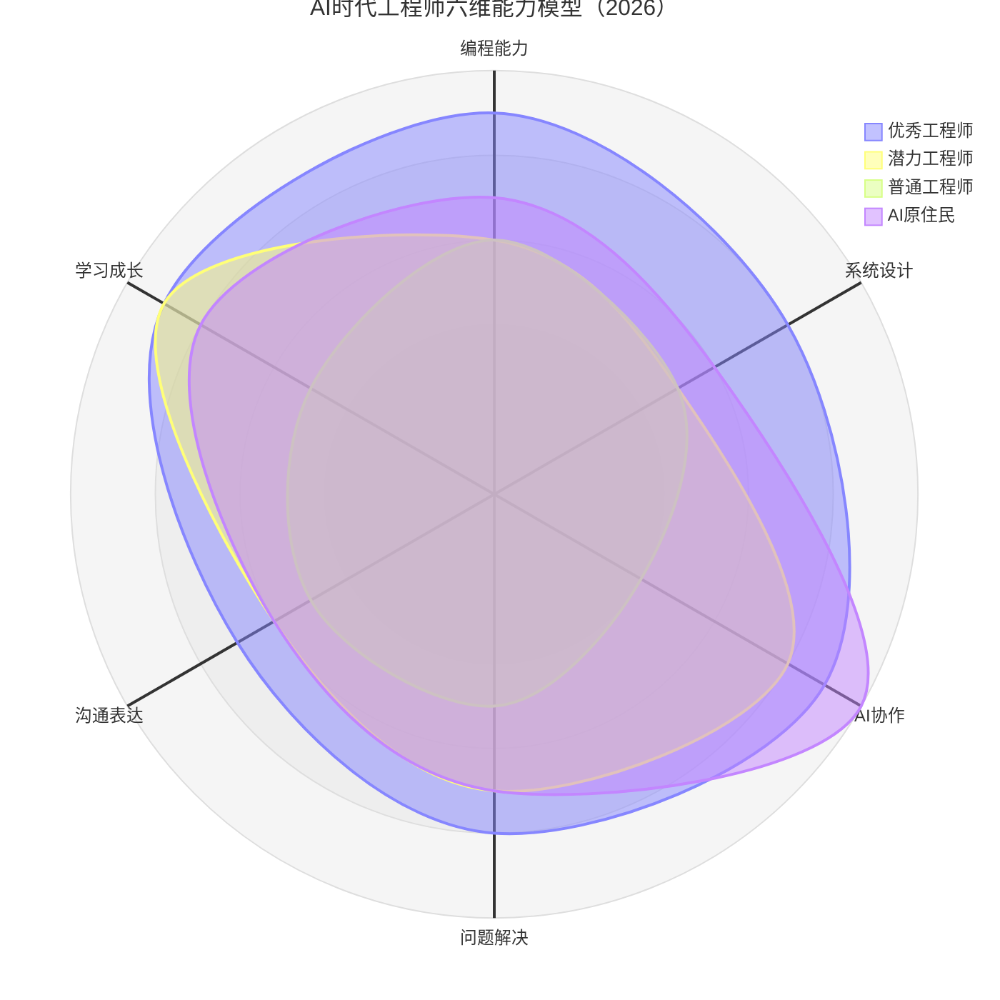
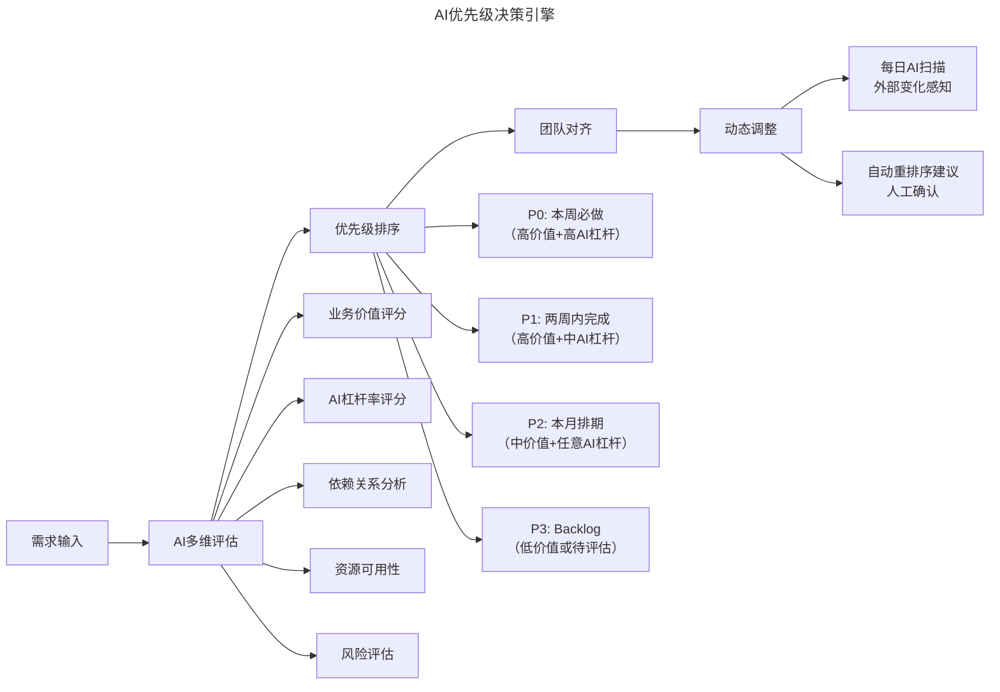
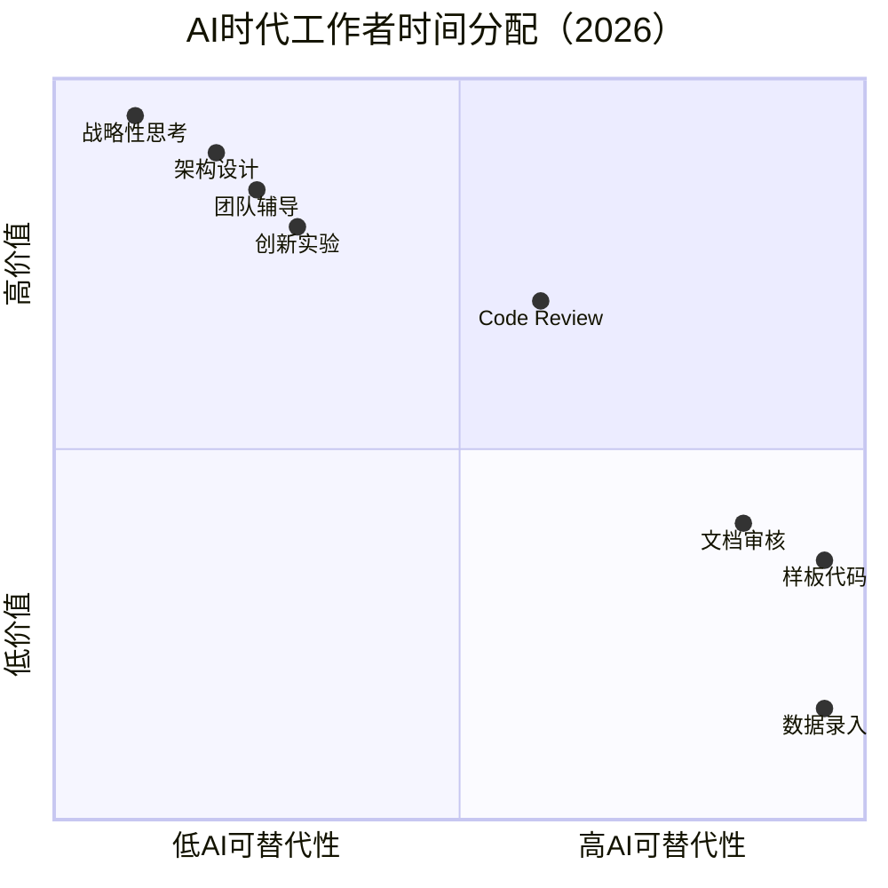

> **适用范围**：toB 企业 CTO、技术团队负责人、Engineering Manager
> **更新摘要**：v2 版本基于原文第 146 讲内容，保留全部原始内容并升级为 6 节结构；融入 2026 年 AI 时代注解，新增 AI 工程师六维能力模型、AI 优先级决策引擎、AI 弹性资源池及从"时间管理"到"注意力管理"的范式升级。

---

# 第146讲 | 刘天胜：打造高效团队，关键在于平衡人、事和时间（一）

## 一、导言

上海讯联数据作为一个 toB 企业，致力于激发每一位员工，尽我们所能帮助客户成功。在这样的企业价值观下，我们一般评判团队是不是高效，主要看这个团队是否能投入最少的人，在最短的时间内高质量地完成客户所托付给我们的事情。

如何做到高效呢？我认为团队需要平衡好"人"、"事"、"时间"之间的关系。三方面平衡得好，客户反馈好，续约率高，公司投入产出比小，公司管理团队觉得业务在发展，这才具备成为高效团队的条件。

> **⭐ 2026 年技术背景**：2026 年，"人、事、时间"的三维平衡模型在 AI 时代演变为 **"人 + AI、事 × AI 杠杆、时间 ÷ AI 加速度"** 的新公式。84% 的开发者使用 AI 编程工具，Agent 承担了 30-50% 的重复性工作，团队管理的核心从"管人"转向"管人机协同"。

---

## 二、核心方法论

### 2.1 "人"的维度：招人不将就，宁缺毋滥

一个团队，绝不是人越多越高效，务必保持精干。做到这一点，首先要把好招聘关。回顾团队的招聘时，有三种方式最有效能找到合适的人：

1. **内推**：最可靠的人才渠道
2. **凭彼此的感觉**：程序员有种很特殊的气场，优秀的程序员都是艺术家，那种描述起自己喜欢做的事儿两眼放光的状态
3. **考核基础+学习意愿**：基础厚的应聘者后劲足，不挑活，成长快

### 2.2 ⭐ AI 时代工程师六维能力模型（2026 版）



上述雷达图对比了四类工程师在六个维度上的能力分布：AI 原住民在 AI 协作维度上得分最高（10 分），但其他维度未必突出；优秀工程师在各项能力上均衡且突出；潜力工程师在 AI 协作和学习成长上表现优异。

### 2.3 "事"的维度：方向明确、目标清晰、优先级一致

任何一个团队，不论是做产品还是做项目，都需要有方向。方向要明确，不能什么都做，而且对于团队目标，每一位团队成员也都需要知道。事情安排需要清晰明确，同时需要具备可行性。

### 2.4 "时间"的维度：统一排期、留出弹性、靠技术提效

在"用好人"、"做好事"之前，特别是对于 toB 服务这样甲方话语权很大的行业，时间安排是否合理非常重要。为了留给团队更多的时间，需要统一阶段性目标和排期、留出弹性空间、靠技术提升生产效率、减少事务性时间消耗。

---

## 三、关键流程

### 3.1 因材分派任务，制定成长目标

团队负责人一定要利用面试时和日常团队管理过程中的 1v1 机会，充分了解团队中的每一位成员，包括性格偏好、家庭情况、技术能力、发展规划，然后才能更好的根据个人情况分配任务。

**⭐ 2026 升级**：任务分配矩阵增加 **AI 杠杆率** 维度

| 任务类型 | AI 杠杆率 | 适合人员类型 | 分配策略 |
|---------|---------|------------|---------|
| 样板代码生成 | ★★★★★ | 任何工程师 | 让 AI 生成，人工审核 |
| 核心算法开发 | ★★☆☆☆ | 资深工程师 | 人工为主，AI 辅助验证 |
| 测试用例编写 | ★★★★☆ | 初级工程师 | AI 生成，人工补充边界 case |
| 代码 Review | ★★★☆☆ | 中高级工程师 | AI 初审 + 人工复审 |
| 文档编写 | ★★★★★ | 任何人员 | AI 主导，人工校对 |
| 架构设计 | ★☆☆☆☆ | 架构师/Tech Lead | 人工为主，AI 提供参考方案 |
| Agent 开发 | ★★★★★ | AI Specialist | 全人工（核心竞争力） |

### 3.2 能力互补，分工明确

在一个团队中，每个人的分工必须明确，管理流程如需求流程、评审流程、变更流程、请假流程等要清晰。同时引入"AI 协作者"角色：

| 角色 | 职责 | 与 AI 的关系 |
|-----|------|----------|
| 技术 Lead | 技术方向决策 | AI Advisor：利用 AI 辅助决策 |
| 架构师 | 系统架构设计 | AI Co-designer：与 AI 共同设计 |
| 核心开发 | 核心功能实现 | AI Pair Programmer：与 AI 结对编程 |
| **AI Engineer（新增）** | AI 工具链维护、Agent 开发 | AI Orchestrator：编排 AI Agent |
| **AI Champion（新增）** | 团队 AI 推广和最佳实践 | AI Evangelist：推动 AI 文化 |

### 3.3 要求复盘，鼓励分享

复盘和分享对于一个成长中的团队来说非常重要。**⭐ 2026 升级**：每次复盘必须包含 **AI 使用效果回顾**：

```
【AI复盘专项】
1. 本迭代AI工具使用情况统计
2. 高光时刻（AI显著提效的场景）
3. 翻车现场（AI造成问题的场景）+ 根因分析
4. Prompt优化记录
5. 下迭代AI改进计划
```

### 3.4 ⭐ AI 优先级决策引擎



上述流程图展示了 AI 优先级决策引擎的工作机制：需求输入后，AI 从业务价值、AI 杠杆率、依赖关系、资源可用性和风险评估五个维度进行评估，自动生成优先级排序建议，并支持每日动态调整。

### 3.5 ⭐ AI 弹性资源池

从"预留人力"到"AI Agent 构成新型弹性资源池"：

| 紧急程度 | 传统应对 | AI 时代应对 | 成本对比 |
|---------|---------|-----------|---------|
| 🔥 极急（当天） | 全员加班 | AI Agent + 核心人员复核 | 成本↓70% |
| 🟠 紧急（3 天内） | 借调人力 | AI 生成 + 专职人员精调 | 成本↓50% |
| 🟡 较急（1 周内） | 调整排期 | AI 辅助加速 + 正常排期 | 成本↓30% |
| 🟢 正常 | 按计划执行 | AI 常态化辅助 | 质量提升 |

### 3.6 减少事务性时间消耗

**⭐ 2026 终极目标**：技术人员的**事务性工作时间占比从 20-30% 降至 <5%**

| 事务类型 | 传统耗时 | AI 方案 | 2026 耗时 |
|---------|---------|--------|---------|
| 报销贴发票 | 4 小时/人/月 | OCR AI + 自动报销流程 | 5 分钟/人/月 |
| 填写工时系统 | 2 小时/人/周 | AI 自动从 Git 提交记录生成 | 0 分钟 |
| 周报撰写 | 1 小时/人/周 | AI 自动汇总数据生成 | 5 分钟审核 |
| 技术文档更新 | 2 小时/次 | AI Code → Doc 自动同步 | 10 分钟审核 |

---

## 四、工具与实战

### 4.1 2026 必备 AI 效率工具矩阵

| 工具类别 | 推荐工具 | 替代的人工工作 | 效率提升 |
|---------|---------|--------------|---------|
| 代码生成 | Cursor / Copilot Workspace | 手写样板代码 | 5-10x |
| 代码审查 | CodeRabbit / Amazon Q | 人工 Code Review | 3-5x |
| 测试生成 | CodiumAI / Meteor | 手写测试用例 | 5-8x |
| 文档生成 | Mintlify / AI Writer | 手写技术文档 | 10x |
| Debug | Copilot Debugger / Roo Code | 手动排查 Bug | 3-5x |
| 会议纪要 | Otter.ai / Fireflies.ai | 手写会议记录 | 10x |

### 4.2 ⭐ 从"时间管理"到"注意力管理"



上述象限图根据 AI 可替代性和价值两个维度，将工作分为四类。高价值且 AI 不可替代的工作（如战略性思考、架构设计）是人类的**核心战场**，应全力保护这段时间；高 AI 可替代且低价值的工作应 100% 交给 AI Agent。

### 4.3 管理者自我升级清单

| 能力领域 | 具体能力 | 提升资源 |
|---------|---------|---------|
| AI 战略思维 | 能制定团队 AI 转型路线图 | 《AI-First Company》课程 |
| AI 工具评估 | 能评估和选择合适的 AI 工具 | Gartner Magic Quadrant |
| Prompt 领导力 | 能编写高质量 Prompt 并指导团队 | Prompt Engineering Guide |
| AI 效能度量 | 能设计和解读 AI 效能指标 | DORA Metrics + AI 扩展 |
| AI 伦理意识 | 能识别和规避 AI 使用风险 | EU AI Act 指南 |

---

## 五、常见误区

| 误区 | 表现 | 应对策略 |
|------|------|----------|
| **方向模糊** | 团队不知道做什么、为什么做 | 明确团队目标并达成一致认知 |
| **目标模糊** | 模模糊糊的事情分派给下属 | 将模糊目标转化为 SMART + AI-ready 目标 |
| **优先级不清** | 信息不一致引起扯皮 | 建立 AI 增强的优先级管理系统 |
| **时间浪费** | 大量时间花在事务性工作上 | AI Agent 全面接管事务性工作 |
| **忽视深度工作** | 被频繁打断，无法深度思考 | 设立"No-AI-Interruption Zones" |

---

## 六、进阶延展

### 总结

打造一个高效团队需要协调好"人"、"事"和"时间"，要有制度，但又不能完全依赖制度。有的地方是科学，有的地方是艺术，有的地方是哲学，但更多的地方需要用心。用心与团队一起成长，协调好三者之间的关系，提高凝聚力，使自己的团队越来越高效地完成客户和公司交给我们的任务。

> **⭐ 2026 核心洞察**：平衡依然是关键，但平衡的对象从纯人类工作扩展到了"人 + AI"的协同工作体系。**人决定方向，AI 加速执行。**

### 行动清单

- [ ] **周一**：在团队周会上引入"AI 时间审计"环节
- [ ] **周二**：为团队开通 Cursor Pro / Copilot Workspace 账号
- [ ] **周三**：选择 1 个高频事务性工作，部署 AI 自动化方案
- [ ] **周四**：重新审视当前排期，标注每个任务的"AI 杠杆率"
- [ ] **周五**：试点"AI 优先级预审"

### 作者简介

刘天胜，TGO 鲲鹏会会员，上海讯联数据合伙人、CTO 兼数据营销事业部总经理，曾任 Cadence 顾问工程师，拥有十一年软件开发和项目管理经验，在技术领域的高可用高并发、微服务架构、信息安全、智能推荐、性能优化、研发流程改进等方面有丰富经验，共享软件 Compare++ 作者。