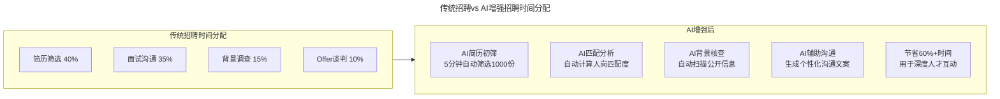
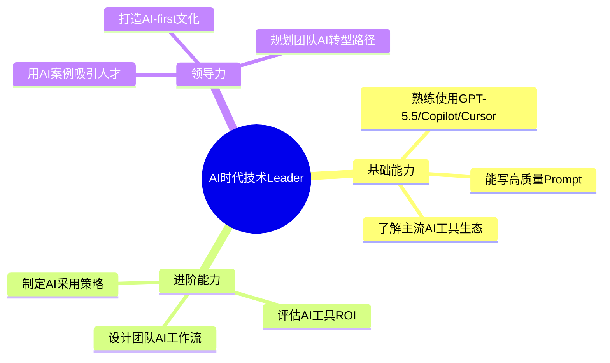
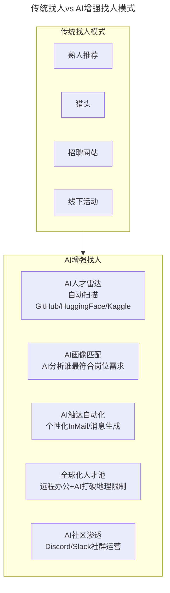

> **适用范围**：创业公司 CEO/CTO、技术团队负责人、招聘决策者
> **更新摘要**：v2 版本基于原文第 72 讲内容，保留全部原始内容并升级为 6 节结构；融入 2026 年 AI 时代注解，新增 AI 人才雷达、AI 领导力技能清单、AI 增强找人模式及雷军模式的 2026 版本。

---

# 第72讲 | 创业公司如何招到合适的人才

## 一、导言

对于科技公司来说，技术人可以说是最核心的宝贵资产了，然而招聘几乎是所有科技公司都头疼的事情，尤其是对创业公司来说，如何招到一个优秀又合适的人才更是前期会面临的极大的挑战。

> **⭐ 2026 年技术背景**：原文的核心思想——"找人是创业者最重要的工作之一"——在 AI 时代不仅没有减弱，反而更加重要。但**"怎么找"发生了根本性变化**：过去靠"刷简历"、"跑招聘会"，现在**靠 AI 雷达、社区渗透、技术品牌**。谁先建立起 AI 时代的人才获取系统，谁就能在人才竞争中占据制高点。

---

## 二、核心方法论

### 2.1 花更多的时间去做招聘

创业初期必然非常繁忙，四面八方涌来的事千头万绪，但是，再忙，招聘依然是所有事情里最重要的。你需要花更多的时间去看人，获得那些有潜力的候选人对你的公司的垂青，并且和所有来面试的人面对面交流。

雷军就曾说过，"如果你招不到人才，只是因为你投入的精力不够多。我每天都要花费一半以上的时间用来招募人才，前 100 名员工每名员工入职我都亲自见面并沟通。"

### 2.2 自己强，才能吸引到相对强的候选人

我们要招人，但更多的时候，我把它称之为吸引人。简单来讲就是对方想听什么、需要什么，我们就给他什么。一般来说，技术人需要的就六个字——跟对人、做对事。

**⭐ 2026 升级**：AI 时代展示实力的新方式

| 传统展示实力的方式 | ⭐ 2026 AI 时代新增方式 |
|------------------|---------------------|
| 秀 GitHub 项目 | **秀 AI 项目**：开源的 Agent、Prompt 库、AI 工具 |
| 技术博客 | **AI 实践文章**：分享 AI 提效经验、踩坑记录 |
| 技术大会演讲 | **AI Meetup 组织者/演讲者** |
| 开源贡献 | **HuggingFace Models/Datasets 贡献者** |

### 2.3 扩大团队与 Leader 影响力

有技术大 V 曾分享过，他通过影响力得到的最大的收获就是便于"勾引"各种人才。提升影响力的方法：

1. **多参加业界交流会**：主动参加活动，分享技术心得，建立良好形象
2. **选定一个技术方向着力打造技术品牌**：在相关技术大会上分享，撰写或翻译优质文章
3. **看到优秀内容主动在对方博客圈里留下痕迹**：主动勾搭牛人，聊技术话题
4. **在职员工推荐**：最好的口碑传播模式

### 2.4 不要完美，合适就行，有潜力最重要

很多时候，大家在招人的时候都想着一定要打造一个梦之队。但这很显然是不现实的。90 分容易，100 分难，100 分的人你肯定要付出 200 分的代价。

潜力人才的特征：
1. 是否具备正确的动机，以强烈责任感和极高投入度去追寻一个目标
2. 是否具备极强的好奇心，渴望获得新体验、新知识以及别人反馈
3. 是否有面对挑战的决心，在面临挑战或在逆境中受挫时，依旧能为目标不懈努力

### 2.5 从招人变为找人

对于优秀或稀缺人才，千万不能端着，要主动出击，放下身段，以真诚打动和吸引他们。正如雷军，为了找到一个非常资深和出色的硬件工程师，连续打了 90 多个电话，和几个合伙人轮流交流整整 12 个小时。

---

## 三、关键流程

### 3.1 ⭐ AI 增强招聘时间分配

上述流程图对比了传统招聘与 AI 增强招聘的时间分配：传统招聘大量时间花在简历筛选和背景调查上；AI 增强后，这些事务性工作由 AI 自动完成，节省 60%+ 的时间用于高价值的人才关系建立。

### 3.2 ⭐ 创业公司 CTO 必备 AI 技能清单

上述思维导图展示了 AI 时代技术 Leader 的三层能力结构：基础能力（AI 工具使用）、进阶能力（AI 工作流设计和 ROI 评估）、领导力（AI 文化和转型路径规划）。

### 3.3 ⭐ 从"找人"到"AI 赋能找人"

上述流程图展示了找人模式的 AI 升级：从传统的熟人推荐、猎头、招聘网站，升级为 AI 人才雷达、AI 画像匹配、AI 触达自动化、全球化人才池和 AI 社区渗透五个新维度。

### 3.4 潜力人才的 AI 时代新特征

| 特征 | 描述 | 如何识别 |
|-----|------|---------|
| **AI 好奇心** | 主动尝试新 AI 工具 | 问："你最近试过什么新的 AI 工具？" |
| **AI 反思能力** | 总结 AI 使用的得失 | 要求分享一个"AI 帮倒忙"的案例 |
| **AI 分享欲** | 愿意教同事用 AI | 观察是否主动传播 AI 知识 |
| **AI 边界感** | 知道 AI 不能做什么 | 讨论 AI 伦理和安全问题时的表现 |

---

## 四、工具与实战

### 4.1 招聘流程 AI 升级 Checklist

- [ ] **部署 AI 简历筛选工具**：设置关键词 + AI 语义匹配
- [ ] **建立 AI 人才库**：定期收录 GitHub/HuggingFace 优秀开发者
- [ ] **设计 AI 实操面试环节**：30 分钟 AI 辅助编程挑战
- [ ] **准备 AI 相关面试题库**：覆盖不同岗位和难度
- [ ] **培训面试官 AI 素养**：确保能识别真正的 AI 能力

### 4.2 吸引人才的 AI 武器库

1. **AI 工具包承诺**：列出公司提供的所有 AI 工具订阅
2. **AI 文化展示**：官网/博客展示团队 AI 实践案例
3. **AI 成长机会**：清晰的 AI 技能晋升通道
4. **算力资源**：GPU access、API credits 作为福利
5. **AI 项目机会**：候选人可参与的 AI 创新项目列表

### 4.3 ⭐ 雷军模式的 2026 版本

> 雷军说"每天花 50% 时间招人"，2026 版的建议是：
> - **30% 时间**：用 AI 工具高效处理招聘事务（筛选、初试）
> - **20% 时间**：与顶尖 AI 人才深度交流（线下/视频）
> - **10% 时间**：建设个人和公司的 AI 品牌影响力
> - **剩余时间**：正常管理工作
>
> **总时间投入不变，但产出质量大幅提升**

---

## 五、常见误区

| 误区 | 表现 | 应对策略 |
|------|------|----------|
| **追求梦之队** | 非最牛的人不要 | 90 分容易 100 分难，合适才是最好的 |
| **只看当前能力** | 忽视潜力评估 | 潜力比当前能力更重要，增加 AI 适应力维度 |
| **被动等简历** | 端着等人才上门 | 主动出击，用 AI 雷达和社区渗透找人 |
| **忽视 AI 品牌** | 只靠传统渠道 | AI 时代需要打造 AI-first 的技术品牌 |
| **事务性时间过多** | 大量时间花在筛选上 | AI 自动化筛选，时间用于深度互动 |

---

## 六、进阶延展

### 结语

创业团队想要招到优秀又合适的技术人才，从来不只是 HR 的事，而是 CEO、CTO 以及整个公司的事情。在具体操作上，我们可以从花更多的时间在招聘上；增强自己作为技术 Leader 的实力，用实力来说服候选人；扩大团队与 Leader 的影响力，吸引人才主动来投；制定合适的人才标准，选择最合适的人才而不是最完美的；从招人变成找人，求才若渴，主动出击等几个方面出发，来应对招聘挑战。

> **⭐ 2026 关键洞察**：谁先建立起 AI 时代的人才获取系统，谁就能在人才竞争中占据制高点。

### 影响力渠道的 AI 时代扩展

| 渠道类型 | 传统做法 | ⭐ 2026 AI 增强 |
|---------|---------|--------------|
| 技术大会 | 参会/演讲 | + AI 专题分会场组织者 |
| 技术博客 | 写原创文章 | + AI 实践系列、Prompt 模板分享 |
| 开源社区 | 贡献代码 | + HuggingFace/GitHub AI 项目维护 |
| 社交媒体 | 微博/知乎 | + Twitter/X AI 圈、Discord 社群活跃 |
| 线上课程 | 极客时间等 | + AI 工具教程、AI 实战训练营 |

### ⭐ 2026 新兴渠道

- **YouTube/B 站 AI 频道**：制作 AI 编程教程
- **Newsletter**：发行 AI 技术周刊（如"AI Engineer Weekly"）
- **Podcast**：受邀参加 AI 播客访谈

---

*本注解基于 2026 年 6 月技术环境生成，结合 84% 开发者用 AI 编程、Agent 加速落地等行业动态。*