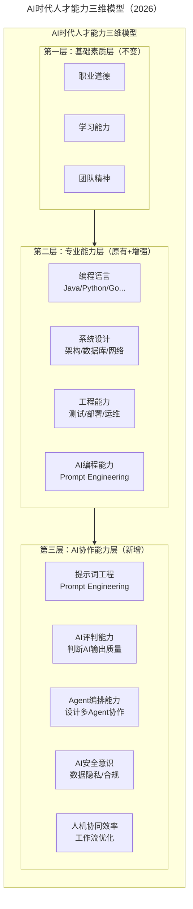
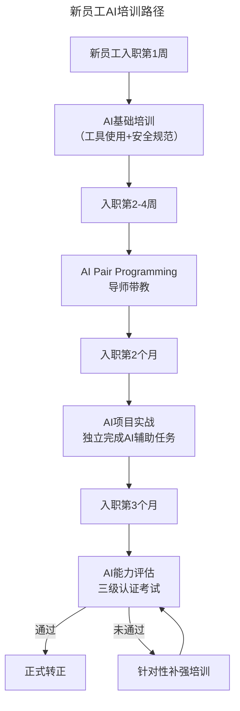
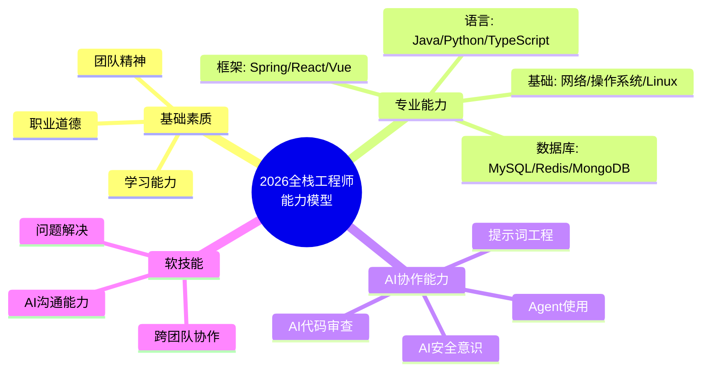

> **适用范围**：技术团队 Leader、CTO、HRBP、培训体系设计者
> **更新摘要**：v2 版本基于原文第 17 讲内容，保留全部原始内容并升级为 6 节结构；融入 2026 年 AI 时代注解，新增 AI 时代人才能力三维模型、火种计划 2.0（AI 增强版）、AI 能力三级认证体系及 AI 时代团队成长陷阱。

---

# 第17讲 | 团队成长要靠技巧和体系

## 一、导言

谁都希望能够有一个牛逼的团队。但创业公司前期资金少，不可能全员都是牛人，所以也会引入一些在能力上刚刚合适或有一定潜力（比如实习生）且认同公司价值观的人加入，先让业务跑起来，再来优化结构。

从 HR 的角度，所谓优化，就是补短板，或许直接换掉来得更快，但作为早期加入有过苦劳的员工，这样太不公平。所以提升团队成员，让他们与公司一同成长才是团队领导者第一选择。

> **⭐ 2026 年技术背景**：2026 年，**"AI 协作能力"已成为技术招聘中的重要加分项**，并逐步被企业纳入正式的技能评估体系。原文提到的 JobModel（能力模型）需要大幅扩展——一个优秀的工程师不再只需要 Java、网络协议等传统技能，还需要具备 **AI 协作能力**。

---

## 二、核心方法论

### 2.1 如何引导团队成长方向

一个成熟的公司，会清楚的知道他们需要什么样能力的人才，所以根据公司的实际情况，构建一个清晰的 JobModel（能力模型），规划出不同层级的核心能力、通用能力及标准，可以对团队成长有较为明确的指引。

以二维火为例，一个 Java 工程师，他的核心能力为：操作系统、编码基础、Java、网络协议、网络安全、数据库、架构设计、运维能力等。每一项能力需要有三个等级的评定：

- **第一级是会用**：有过三个到五个项目经验，对正常的语法、概念、配置、部署等方面有正常的认识
- **第二级是熟练**：有过十个项目以上的经验，能够指导他人进行工作并解决问题，同时阅读过源码
- **第三级是能多深入源码**：能够做较为低层的优化，遇到无法解决的问题，能够通过修改源码甚至更换技术及框架来解决

### 2.2 ⭐ AI 时代人才能力三维模型（2026）

在原有基础上增加**第三维度：AI 协作能力层**：

上述三维模型图在原有的基础素质层和专业能力层基础上，新增了 AI 协作能力层，包含提示词工程、AI 评判能力、Agent 编排能力、AI 安全意识和人机协同效率五个能力项，形成完整的人才能力体系。

### 2.3 ⭐ AI 协作能力层的详细定义

| 能力项 | 一级（入门） | 二级（熟练） | 三级（专家） |
|--------|-------------|-------------|-------------|
| **提示词工程** | 会用基本提示词让 AI 完成任务 | 能设计结构化 Prompt，控制输出格式 | 能构建 Prompt Chain，处理复杂任务 |
| **AI 评判能力** | 能发现 AI 输出的明显错误 | 能系统性评估 AI 代码质量和安全性 | 能制定 AI 输出质量标准，训练团队 |
| **Agent 编排** | 了解 Agent 概念，能使用现成 Agent | 能配置和调优现有 Agent 工作流 | 能设计和开发自定义 Agent |
| **AI 安全意识** | 知道不能把敏感数据喂给公开 AI | 能识别 AI 使用的合规风险点 | 能制定企业 AI 安全规范并推行 |
| **人机协同效率** | 在工作中使用 AI 工具 | 能优化个人 AI 工作流，效率提升 50%+ | 能设计团队级 AI 协作流程 |

---

## 三、关键流程

### 3.1 文化和学习氛围比培训更重要

2012 年曾经有幸加入过支付宝技术大学，深刻体会到，培训和技术分享本身带来的效果是非常有限的，在团队内部营造一种人人爱学习，乐于分享的氛围，建立一个持续学习的文化，才能让团队更快成长。

原文介绍了"火种计划"和管理培训：

**火种计划**：针对每年实习生和应届毕业生组织的培训，从编程技巧、项目流程、工具使用和企业文化等方面进行培训，最后有一周的练习项目。

**管理培训（初级、进阶）**：针对主管、经理层级的管理人员进行基础管理技巧培训，从组织结构设计、岗位模型、招聘技巧、授权、激励、绩效管理等多个方面进行深入培训。

### 3.2 ⭐ 火种计划 2.0（AI 增强版）

| 原有模块 | 🆕 新增 AI 模块 | 培训时长 |
|----------|--------------|---------|
| 编程技巧 | **AI 辅助编程实战**（Cursor/Copilot） | +8 小时 |
| 项目流程 | **AI 项目管理工具使用** | +4 小时 |
| 工具使用 | **AI 工具链搭建与配置** | +6 小时 |
| 企业文化 | **AI 伦理与企业 AI 价值观** | +2 小时 |
| 内部系统开发 | **Vibe Coding 实践** | +8 小时 |

### 3.3 ⭐ 管理培训 2.0（AI 增强版）

| 原有模块 | 🆕 新增 AI 模块 | 说明 |
|----------|--------------|------|
| 组织结构设计 | **人机协作组织设计** | 如何设计 AI 参与的工作流 |
| 招聘技巧 | **AI 时代人才评估** | 如何评估候选人的 AI 能力 |
| 授权 | **AI 权限管理** | AI 工具的使用授权与审计 |
| 激励 | **AI 贡献认可机制** | 如何奖励 AI 最佳实践 |
| 绩效管理 | **AI 效能度量** | 如何衡量 AI 带来的效率提升 |

### 3.4 从绩效上给予激励和鞭策

如何帮助和鼓励团队成员成长呢，人都是有惰性的，或者很容易陷入具体的工作中。作为团队的管理者，要为每一个团队成员做好职业规划和能力提升的规划，定期 review。绩效考核相信一定规模的公司都会用到，建议把员工的个人成长放进绩效，当能力有提升时，给予一些实际的奖励。

**⭐ 2026 升级**：将 AI 能力纳入绩效

| 维度 | 权重建议 | 考核方式 |
|------|---------|---------|
| 工作成果 | 50% | 项目交付、质量指标 |
| 专业能力 | 20% | 代码质量、技术深度 |
| **🆕 AI 协作能力** | **15%** | AI 工具使用率、AI 产出质量、Prompt 能力 |
| 团队贡献 | 10% | 分享、mentoring |
| 文化践行 | 5% | 价值观表现 |

### 3.5 ⭐ 可执行的 AI 培训方案

上述流程图展示了新员工 AI 培训的四阶段路径：入职第 1 周进行 AI 基础培训，第 2-4 周进行 AI Pair Programming 导师带教，第 2 个月进行 AI 项目实战，第 3 个月进行 AI 能力评估和三级认证考试。

---

## 四、工具与实战

### 4.1 2026 全栈工程师能力模型

### 4.2 ⭐ AI 相关的激励措施

- **AI 创新奖**：每季度评选，奖励 AI 最佳实践
- **AI 认证津贴**：通过内部 AI 能力认证，给予一次性奖金
- **AI 工具探索基金**：鼓励尝试新 AI 工具，报销费用
- **AI 分享积分**：内部分享 AI 内容，积累晋升积分

### 4.3 建议的 AI 分享主题

1. **"我用 AI 把效率提升了 300%"** —— 个人 AI 工作流分享
2. **"AI Code Review 的坑与对策"** —— 团队 AI 实践
3. **"从零搭建企业 Prompt Library"** —— AI 基础设施建设
4. **"当 AI 出错时我们怎么办"** —— AI 风险管理

---

## 五、常见误区

### 陷阱 1：只关注 AI 工具，忽略基础能力
- **现象**：团队成员沉迷 AI 工具，但基础编程能力退化
- **对策**：定期进行无 AI 的编程考核，确保基本功扎实

### 陷阱 2：AI 培训形式化
- **现象**：培训做了，但大家回去还是老样子
- **对策**：培训后必须有实战项目跟进，在实践中固化

### 陷阱 3：忽视 AI 带来的焦虑
- **现象**：老员工担心被 AI 取代，抵触学习
- **对策**：强调 AI 是放大器不是替代者，用成功案例证明

### 陷阱 4：批评方式不当
- **现象**：在团队周会或办公区批评团队成员，打击自信心
- **对策**：奖励在公开场合，批评在一对一的时候

---

## 六、进阶延展

### 总结

最后，给所有的技术管理者分享一个心态，很多管理者担心自己培养了很长时间的人才一两年后就跳槽走了。实习生成本方面比社招要低很多，你的成本其实已经收回了。也不要因为培养出来的人跳槽，就有了是不是给其他公司当了培训班的心态，其实这反而可以扩展你的团队在行业中的影响力，还有可能带回来一些人，同时也让我们反思给这些子弟兵的待遇是不是符合他们的成长。

> **⭐ 一句话总结（2026 版）**：团队成长的核心逻辑没变——**实战 + 体系 + 文化**。但成长的内容变了：从"学会用框架"变成"**学会用好 AI 工具**"，从"个人能力提升"变成"**人机协同能力提升**"。2026 年的优秀团队 = **扎实的基础能力 + 熟练的 AI 协作 + 持续学习的文化**。

### 2026 年团队成长体系 Checklist

- [ ] 更新 **JobModel**，加入 AI 协作能力维度
- [ ] 制定 **AI 能力三级认证体系**（入门/熟练/专家）
- [ ] 更新 **新人培训计划**，加入 AI 模块（建议占 30%+）
- [ ] 建立 **内部 Prompt Library**，持续沉淀提示词资产
- [ ] 设立 **AI 分享月**，每月至少一次 AI 主题分享
- [ ] 将 **AI 能力纳入绩效考核**，权重建议 15%
- [ ] 每季度发布 **团队 AI 能力报告**，可视化成长轨迹

### 作者简介

芦宇峰，花名红烧肉，前支付宝用户技术部/技术大学负责人，《旅途求助》创始人 & CEO，现任二维火产品研发中心副总裁，TGO 鲲鹏会杭州分会会长。