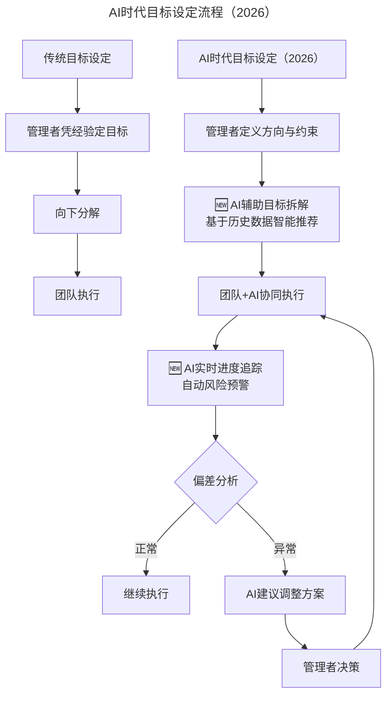
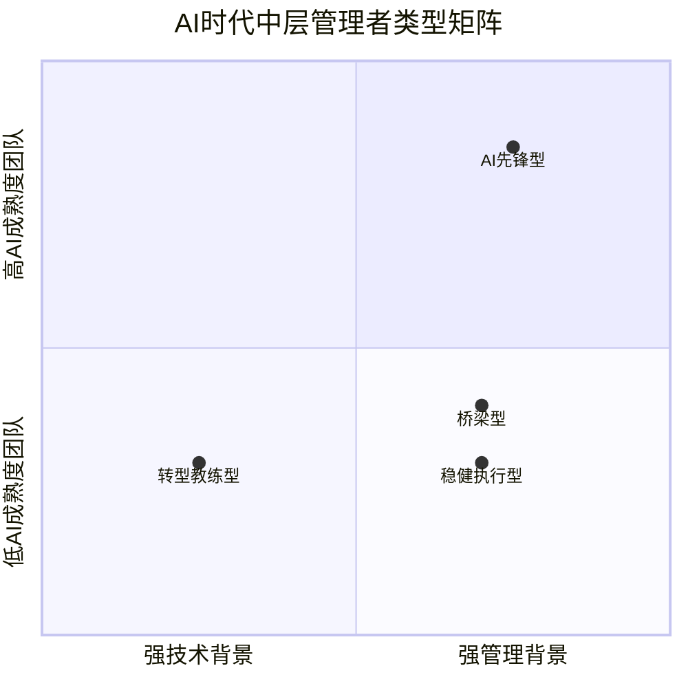
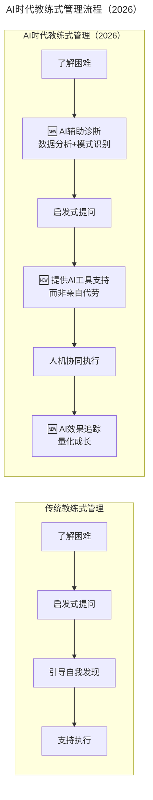
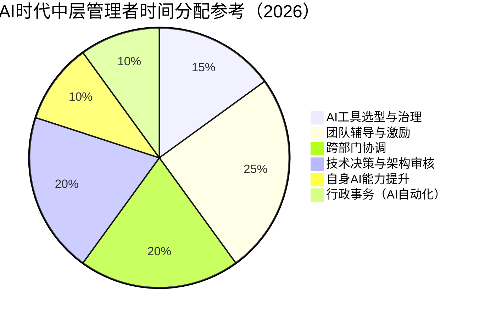

> **适用范围**：技术团队 CTO、工程总监、Tech Lead、HRBP
> **更新摘要**：v2 版本基于原文第 16 讲内容，保留全部原始内容并升级为 6 节结构；融入 2026 年 AI 时代注解，新增 AI 时代目标-AI 协同设计、中层管理者四象限选拔模型、人机协同教练式管理及中层管理者能力 Checklist。

---

# 第16讲 | 培养中层团队的管理认知

## 一、导言

技术团队到达一定规模之后，要保持高效，中层管理者会变得非常重要。他们在团队中起到承上启下的作用，既要接受上层的指派，又要领导下层执行。如果中层管理者给力，上层的管理者会轻松很多。所以一定要选对中层，培养中层。

> **⭐ 2026 年技术背景**：2026 年，**中层管理者的角色正在发生深刻变化**。传统中层管理者的核心职责——任务分配、进度跟踪、质量控制——正在被 AI 工具大量接管。GPT-5.5 和 DeepSeek V4 的能力意味着**很多"管理动作"可以被 Agent 自动化**。但这不意味着中层管理者变得不重要了，相反，**AI 时代的中层管理者需要具备更高阶的能力**。

| 能力维度 | 传统中层管理者 | AI 时代中层管理者（2026） |
|----------|----------------|-------------------------|
| 任务分配 | 手动拆解分配 | **AI 辅助拆解 + 人机协同分配** |
| 进度跟踪 | 周会/日报 | **AI 实时看板 + 异常预警** |
| 质量控制 | Code Review | **AI Review + 人工架构审核** |
| 团队激励 | 一对一沟通 | **个性化激励 + AI 数据分析** |
| 🆕 新要求 | - | **AI 工具选型与治理、人机协作设计、AI 伦理判断** |

---

## 二、核心方法论

### 2.1 先做目标管理

在说中层团队的选拔和培养之前，先来说说我选择公司或者职位的理念。首先，我要去了解这家公司的目标是什么，我个人非常关注目标的选择。目标选择的好，就比较容易成功。反之，个人和团队都会比较辛苦，结果还不一定好。有了一个合理的目标之后，剩下都是一些执行层面的技巧，我很清楚如何去带领团队达成一个目标。

举个例子，我之前在盛大集团刚开始负责整个测试团队的时候，当时 CEO 觉得测试团队不能满足公司的期望。测试团队一般有两个指标，一个是速度，另一个是质量。其实不只是测试团队，绝大部分团队都是这样，很多时候这两个指标的实现上存在一定的冲突。

我意识到公司对测试团队的期望是速度能更快一点，避免因为测试花掉太多时间，而导致产品上线的延迟。当时的测试团队把过多注意力放在了测试质量上，时间用的比较长。

我做的一个最主要的改变，就是让整个测试团队了解我们真正的目标是什么，把原来以质量为重的目标，变成了质量和效率兼顾的目标。目标修改了之后，整个测试团队对公司业务的支撑就改善了很多。不到一个季度的时间，整个公司都感受到了测试团队的焕然一新。这是通过目标的选择和调整，让团队表现更好的一个例子。

在盛大在线的时候，我曾经带领数据团队做数据算法的研究，大概用了两个季度左右的时间，把我们广告的推荐算法优化，让整个点击率和广告收入提升了大概一倍。利用这个案例，我分享一些管理经验。

很多时候我们团队在做事情时可能会忽略一些东西，从而导致整个进展不够顺利，我要做的是帮助他们把事情理顺。那时候的实际情况是，团队已经在广告算法上探索了很长时间，但是一直没有很好的产出。我接手之后，比较全面地去了解了导致团队进展慢的原因。我发现了几个问题：一个是当时数据的准确性是有问题的，原始数据的准确性不够，导致我们被数据误导，结果自然不会很好。

另外，在广告算法提升场景上，我们也是做了一些判断。很多人在做算法的时候，会有些假设，很多时候我们认为某一个用户的唯一标识代表的是一个用户。其实在实际情况中，你应该想到，有的电脑白天是先生在用，晚上是太太在用，有一些类似这样的情况。后面我们基于这样的假设再去提升整个推荐算法，效果就会比较明显。

我想用这个案例告诉大家，有些目标达成过程中会出现一些困难，要能够全面的思考可能是哪里出了问题，问题解决之后，才会获得比较好的进展。

### 2.2 AI 时代的目标管理升级

#### 从"目标选择"到"目标-AI 协同设计"

原文强调"目标选择的好，就比较容易成功"。在 AI 时代，这个原则依然成立，但目标的**设定方式**发生了变化：

上述流程图展示了 AI 时代目标设定的闭环机制：管理者定义方向与约束后，AI 基于历史数据辅助目标拆解，团队与 AI 协同执行，AI 实时追踪进度并预警偏差，管理者据此做出调整决策。

### 2.3 根据需要选管理者

在中层团队建立起来的时候，我会把这些亲身实战的管理方式传达给我的中层管理者。我现在的团队大概有五、六个中层管理者。每一个细分的团队都有各自的 Manager，包括运维团队、后端开发团队、移动端开发团队、测试团队等。

一线工程师需要做实际的工作，但是管理者更主要的目标是用各种手段帮助一个团队更好地提高产出，或者说提升整个团队的能力。我属于一个非常关注目标的管理者，围绕这个目标，我们会去了解是不是有合适的人来做管理者。如果内部有些合适的人，就会内部提拔，如果内部没有太合适的人，我会考虑从外部招一些管理人才，让他们来帮助我把团队的产出和整个技术能力提的更高。

很多管理者比较关注选拔中层管理者的通用标准，我认为不存在通用类型的中层管理者，也就没有通用的标准。关键还是要结合团队当时的情况，选拔最需要的管理者类型。

大多数时候，不同的团队需要的管理者都是不一样的。有些团队面临的问题是，由于经验不足导致很多东西做不了，大家都不知道应该怎么做事。在这种情况下，就不能找一个通常的人员管理能力较强的管理人员，而是需要一个过去做过类似事情的人，他只有在做这种类型的事情上有经验，才能帮我解决问题。另一些团队遇到的问题是内部沟通不够顺畅，激励机制不够顺畅，导致大家士气低落，这种情况下，我要找的管理者就偏向于更擅长人员管理和沟通的人。

### 2.4 AI 时代的中层管理者选拔标准

#### 原有标准的 AI 时代演进

原文提到"不存在通用类型的中层管理者"。在 AI 时代，这个观点更加正确——**不同 AI 成熟度阶段的团队需要不同类型的管理者**：

上述四象限图根据团队 AI 成熟度和管理者背景两个维度，将 AI 时代中层管理者分为转型教练型、AI 先锋型、稳健执行型和桥梁型四类。

| 类型 | 适用场景 | 核心能力要求 |
|------|----------|-------------|
| **转型教练型** | 团队刚引入 AI 工具 | **变革管理能力 + AI 培训能力** |
| **AI 先锋型** | 团队 AI 成熟度高 | **技术创新敏感度 + Agent 编排能力** |
| **稳健执行型** | 团队 AI 使用较浅 | **传统管理能力 + AI 基础应用** |
| **桥梁型** | 跨 AI/非 AI 团队协作 | **沟通能力 + AI 价值翻译能力** |

---

## 三、关键流程

### 3.1 做好教练

管理者选好之后，接下来才是培训。对任何中层管理者，首先，我一定会跟他们分享我对管理的认知。很多管理者对管理的目标、职责以及常用的管理方法还不太了解，其中包括管理的职责是什么，最主要的目标是什么，常用的管理手段是什么等问题。

一旦有了这样的认知，在一些具体的操作细节上面，他们才会有管理的概念，他们会在日常工作中实践一些东西。如果在实践的过程中遇到了问题，我会进一步跟他们一对一沟通，分享一些精髓。主要是让他们对自己的职责和大的提升方向有一个比较清晰的认识。然后，在日常工作中会根据实际案例、实际情况分享在不同的情况下应该怎么采取管理手段。

中层管理人员的时间分配也是大家比较关注的问题，我认为这个事没办法固定。还是那句话，不同团队情况不一样，有些团队人员比较少，内部沟通也比较顺畅，不需要花太多时间做人员管理，这时候我会要求管理者直接做一些技术方面的事情，提升架构能力，或者做一些产品的方案设计。让他们利用过去的经验，帮助团队少走一些弯路，让整个的团队产出更好一些。

有些团队可能在具体的业务技术经验方面还可以，主要是内部的沟通不够顺畅，这种情况，我就会希望他在人员管理方面投入更多的精力。

### 3.2 AI 时代的教练式管理升级

#### 从"教练"到"人机协同教练"

原文强调"极少情况下我才会真正代替他们做事。更多时候是以教练这样的角色"。在 AI 时代，教练的角色需要扩展：

上述流程对比了传统教练式管理与 AI 时代教练式管理的差异：AI 时代增加了 AI 辅助诊断、AI 工具支持和 AI 效果追踪三个关键环节。

### 3.3 AI 时代中层管理者的时间分配

#### 时间分配模型演变

原文提到"时间分配没办法固定"。在 AI 时代，虽然依然如此，但有一些新的趋势：

上述饼图展示了 AI 时代中层管理者的时间分配参考模型：行政事务时间被大幅压缩，新增 AI 工具选型与治理时间，团队辅导时间质量得到提升。

关键变化：
- **行政事务时间大幅压缩**：AI 自动生成周报、会议纪要、进度报告
- **新增 AI 治理时间**：工具选型、安全审计、成本管控
- **辅导时间质量提升**：AI 承担事务性工作后，可投入更深度的一对一

---

## 四、工具与实战

### 4.1 教练的新技能包

| 场景 | 传统做法 | AI 时代做法 |
|------|----------|-----------|
| 成员遇到技术难题 | 一起 debug | **推荐 AI 调试工具 + 引导使用方法** |
| 成员效率低下 | 分析原因+给建议 | **AI 分析工作模式 + 识别瓶颈** |
| 成员职业发展迷茫 | 分享经验 | **AI 职业路径规划 + 技能图谱匹配** |
| 团队氛围不好 | 组织团建 | **AI 匿名调研 + 数据驱动改善** |

### 4.2 ⭐ 可执行建议

- 使用 **AI OKR 工具**（如 Tability AI、Weekdone）辅助目标拆解
- 让 AI 基于**历史项目数据**预估工期，减少拍脑袋
- 建立**目标-AI 联动机制**：目标变更时 AI 自动评估影响范围

### 4.3 选拔时的 AI 相关考察点

1. **AI 学习意愿**：候选人最近半年学习了哪些 AI 工具？
2. **AI 实践经验**：是否有带领团队引入 AI 工具的经验？
3. **AI 判断力**：能否区分"适合 AI 完成的任务"和"必须人做的任务"？

---

## 五、常见误区

### 陷阱 1："AI 替代中层"的错误预期
- **现实**：AI 可以替代事务性管理工作，但无法替代**人际洞察和判断**
- **对策**：中层管理者应主动拥抱 AI，将时间投入到**更高价值的活动**

### 陷阱 2：忽视团队的 AI 焦虑
- **现象**：团队成员担心被 AI 取代，士气低落
- **对策**：**透明化沟通 AI 战略**，强调"AI 是工具不是替代者"

### 陷阱 3：自己成为 AI 能力的瓶颈
- **现象**：管理者自己不会用 AI 工具，无法指导团队
- **对策**：**管理者必须是团队中最积极的 AI 学习者**

---

## 六、进阶延展

### 结语

最后，我还是要强调一下目标管理的重要性。不管管理什么样的团队，我首先会做的就是帮团队管理一个目标，让所有人都能理解这个目标。对于应该用什么方式为这个目标努力，我也会有比较清晰的设置。在设置完目标之后，我使用的是偏教练式的管理方式，也就是说，极少情况下我才会真正代替他们做事。更多时候是以教练这样的角色，了解他们在完成目标过程当中会遇到的困难，然后通过启发式的提问，让他们意识到他们应该做怎样的改变，才能够更好的完成目标。

### 📊 2026 年中层管理者能力 Checklist

- [ ] 完成 **AI 管理工具认证**（至少掌握 3 款 AI 管理工具）
- [ ] 建立 **团队 AI 技能档案**，了解每位成员的 AI 能力水平
- [ ] 制定 **团队 AI 成长路线图**，明确阶段性目标
- [ ] 每月进行一次 **AI 工具效果评估**，优化工具组合
- [ ] 培养 **至少 2 名 AI Champion**（团队内的 AI 推广大使）
- [ ] 自身保持 **每周 5 小时以上**的 AI 学习时间

> **⭐ 一句话总结（2026 版）**：中层管理者不会被 AI 替代，但**会被善用 AI 的中层管理者替代**。2026 年的优秀中层 = **卓越的教练能力 + 熟练的 AI 工具运用 + 敏锐的人机协作设计能力**。记住：你的角色从"管人"升级为"**设计人机协同系统**"。

### 作者简介

陆怡，医信金融 CTO，[TGO 鲲鹏会](https://tgo.geekbang.org)上海分会董事会成员。20 年以上的技术团队管理经验。曾在盛大，eBay 中国研发中心任职技术高管，管理过各种类型的技术团队。2013 年作为技术合伙人，和朋友共同创立维金公司，提供互联网金融的解决方案和系统服务。从零开始组建产品技术团队，团队人数最多时接近 200 人。维金先后获得 IDG 和蚂蚁金服的投资。目前出任医信金融 CTO，全面负责产品和技术工作。