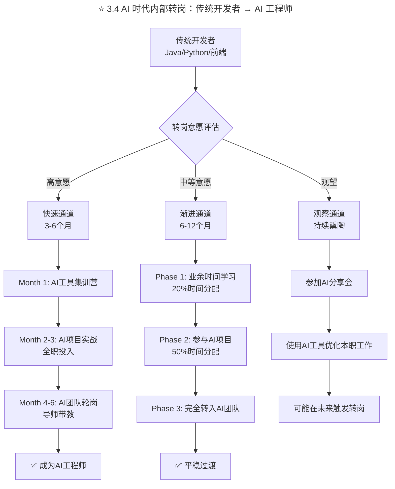
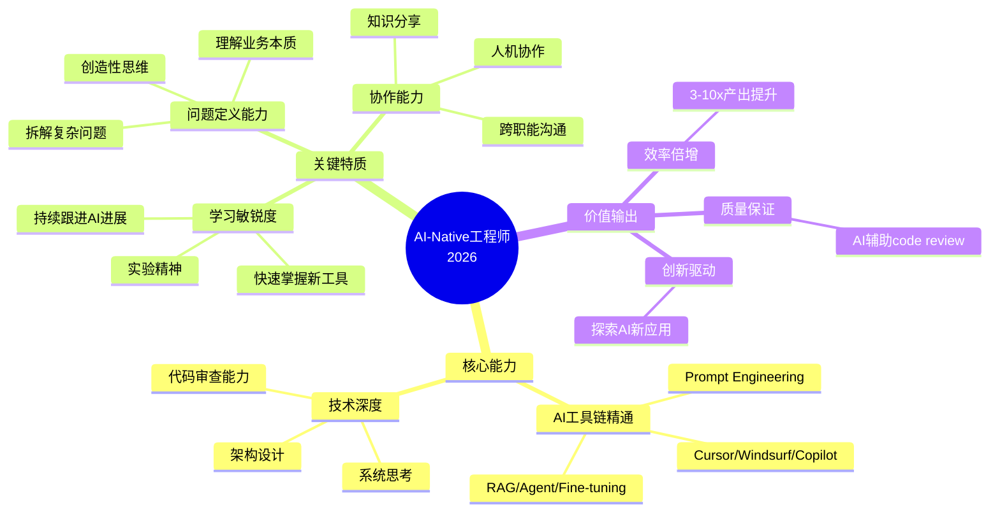
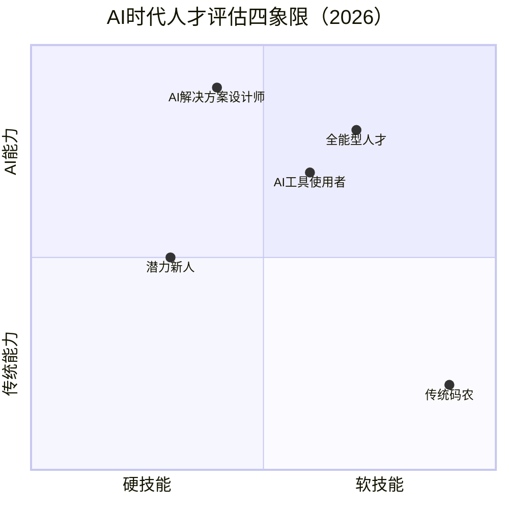
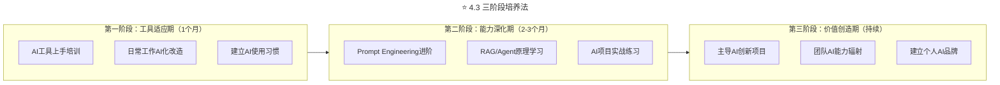
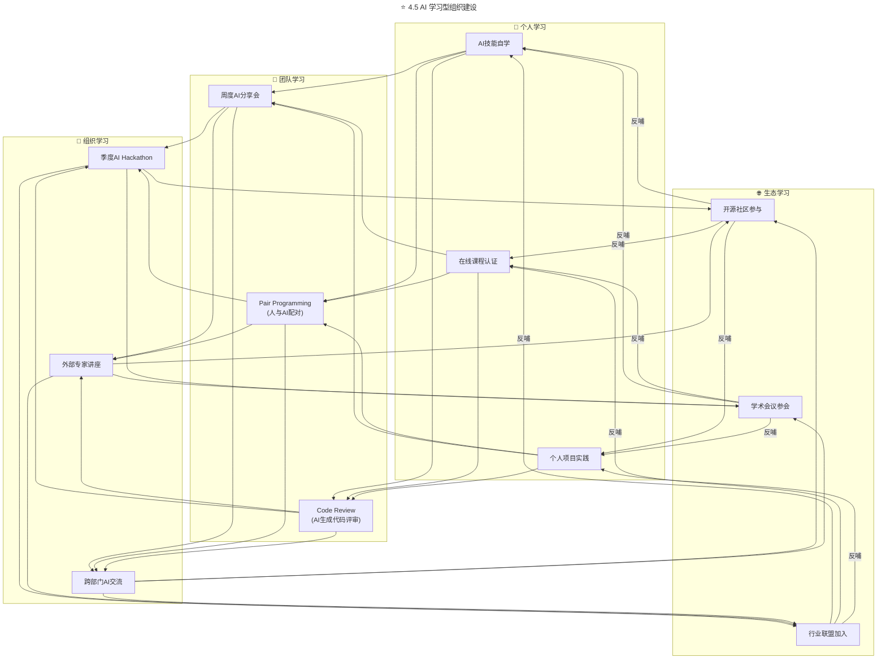

> **适用范围**：CTO、技术VP、HRBP、招聘负责人、团队Leader
> **更新摘要**：v2 版本基于原文大咖对话内容，保留全部原始内容并升级为 6 节结构；融入 2026 年 AI 时代注解，新增 AI-Native 工程师人才画像、AI 能力评估体系、AI 薪酬激励方案及 AI 学习型组织建设方法。

---

# 大咖对话 | 万玉权：如何招到并培养核心人才

## 一、导言

本周"大咖对话"的嘉宾依然是连尚网络副总裁、WiFi万能钥匙事业群CEO万玉权，拥有10多年互联网研发和管理经验，目前负责WiFi万能钥匙核心产品和技术研发管理及热点画像业务，在连尚网络期间，完成了核心系统架构从 1.0 到 2.0 的改进。

上周，我们和他聊了CTO到CEO的转变之路，以及高效团队打造等话题，其中谈到人才管理时，万玉权认为"兵不在多，而在于精"，本周，我们就跟他深入聊了聊他对于人才战略的认知。

> **⭐ 2026 年技术背景**：2026 年，**84% 的开发者使用 AI 编程工具**（Stack Overflow 开发者调查 2025），AI-Native 工程师（AI-Native Engineer）已成为市场最稀缺的人才类型。万玉权老师"兵不在多，而在于精"的理念在 AI 时代有了全新含义——**"精"的定义从"代码写得快、bug少"升级为"AI 协作能力强、问题定义准、学习速度快"**。

---

## 二、核心方法论

### 2.1 明确目标，享受过程

**极客时间：在您看来，人才成长过程中，最重要的特质是什么？**

**万玉权：** 总结一下，可以归纳为" **明确目标，享受过程**"。

首先，在职业发展路径中，无论是初入职场的新人，还是企业的领导者，都需要明确自己的目标，这就像航船需要知道灯塔的位置一样重要。只有明确目标，才能够知道自己前行的方向。

同时，在这过程中，你的目标不要随着时间、职位、薪资等外界因素的变化而变化。这里我举个反例，有些人在职业发展过程中，往往会因为追求高薪资、年终奖、特斯拉等附加物质，而改变自己的目标，最终导致迷失方向。在我看来，这些都是不可取的行为，当你的事业目标达成之后，这些附加物质自然会随之而来。所以，确定你的目标，坚定并坚持去实现它。

以我自己为例，2013年，我加入WiFi万能钥匙，从最初的程序员到技术经理再到现在的事业群CEO，我的目标一直很笃定，就是希望能够在这个平台上实践属于自己的架构思维和技术理想，研发出服务千万级甚至上亿级用户的产品。最初，确立这个目标的时候，作为程序员的我认为，能够做出这样的产品很牛，而尽管之后的职位一直在变，我的这个想法也没变过。

其次，在实现目标的过程中，要学会享受。打个比方，我将自己比作一名舞者，练了十几年基本功，现在，我想在WiFi万能钥匙这个舞台上跳一段舞，并尽情享受这跳舞的整个过程。我一直都以这样的状态面对工作，面向目标，乃至于到现在，尽管我已经不写程序，已经转向管理了，我依然享受每天所经历的事情，无论过程开心与否，对我来讲，都非常有价值，因为每一天，都是向着目标前进的一天。

对于我的团队，我也是按照这两点来要求大家，要求每个人都明确自己的目标，并学会享受实现目标的过程。事实证明，这对于提升团队效率非常有效。

WiFi万能钥匙里有很多13年、14年就加入跟随团队的老员工，他们像我一样，在这里历经了不同的岗位，接受过许多新挑战，他们都一步一步实现了自己的目标，比如从最初的程序员，到现在成为技术总监、技术VP。他们很清楚自己在这个地方要做什么，也时常跟我聊天，一起沟通自己在这个团队的目标与发展路径。

### 2.2 兵不在多，而在于精

**极客时间：以您的经验来看，如何招到合适的人才呢？**

**万玉权：** 公司长远发展的核心推动者是人才，我个人认为，兵不在多，而在于精。所以，我们非常注重人才的挑选与培养。挑选人才时，我们主要看重两点，第一点是价值观，第二点是能力。

> **⭐ 2026 升级**：在 AI 时代，"精"的定义发生了根本性变化：
>
> | 时代 | "精"的定义 |
> |------|-----------|
> | 2018年 | 代码写得快、bug少、技术栈熟悉 |
> | 2026年 | AI协作能力强、问题定义准、学习速度快、跨界整合好 |
>
> **精 = AI协作能力 × 问题解决能力 × 学习适应能力 × 业务理解深度**

### 2.3 价值观第一，能力第二

首先，最重要的考核因素就是人才的品质，即价值观。如果员工的价值观与公司不符，即使能力再强，他也很难真正为公司创造多少价值。

具体在面试中，可以考察候选人对之前公司的企业文化的看法及认同程度，还可以考察他对之前公司制度的遵守程度，或对企业文化的践行程度。可以让他举一些实际的例子来说明。

其次，要考核的是人才自身的能力，是否能够胜任本职工作。其实，简历经过筛选之后，挑选出的多数人都是合格的胜任者。如果在实际工作中，他难以胜任，基本都脱离不了两个原因：一是价值观偏差，工作态度问题；二是之前的工作经历和方向与新工作不太匹配。

### ⭐ 2.4 AI 时代人才标准代际变迁

| 能力维度 | 2018年权重 | 2026年权重 | 变化趋势 |
|---------|-----------|-----------|---------|
| 编码能力 | ⭐⭐⭐⭐⭐ | ⭐⭐⭐ | 📉 AI承担了大量编码工作 |
| 系统设计能力 | ⭐⭐⭐⭐ | ⭐⭐⭐⭐⭐ | 📈 架构思维更重要了 |
| AI协作能力 | ⭐ | ⭐⭐⭐⭐⭐ | 🆕 新的核心竞争力 |
| 问题解决能力 | ⭐⭐⭐ | ⭐⭐⭐⭐⭐ | 📈 从执行者变为解决者 |
| 学习适应能力 | ⭐⭐⭐ | ⭐⭐⭐⭐⭐ | 📈 技术变化更快了 |
| 沟通协作能力 | ⭐⭐⭐ | ⭐⭐⭐⭐ | 📈 人机协作需要更好沟通 |
| 业务理解能力 | ⭐⭐ | ⭐⭐⭐⭐ | 📈 需要懂业务才能用好AI |

---

## 三、关键流程

### 3.1 招聘流程：试用期 + 导师制 + 红线机制

但是，在招人时，你很难保证，你招进来的人或被你拒绝的人就一定合适或一定不合适，所以出现了试用期。对于人才管理，必须依靠制度，依靠流程，依靠规范。

在试用期阶段，我们会定期与新人沟通，比如入职一周后沟通一次，入职一个月的时候沟通一次，入职三个月的时候再聊一次。尽管现在团队已经很大了，但对于新招进来的中层干部或专家类人才，我依旧会亲自与他们定期沟通，而其他岗位的员工，就由相应部门的负责人进行沟通辅导。除了直属领导的沟通， HRBP也会定期与新人沟通，帮助他们解决疑惑与工作中遇到的困难。

另外，新人会有一名专属导师，帮助他熟悉公司流程，熟悉业务情况，制订阶段性目标、绩效和计划等，并根据完成情况去做综合评判。如果发现价值观明显不符，我们会先帮助他进一步了解公司的文化与价值观；如果是工作岗位不匹配，我们会先对他进行调岗，帮助他再一次尝试。

如果在诸多尝试之后，新人依然不能胜任工作，我们也会主动解聘。还有一种情况是员工踩到公司的红线，比如贪污受贿、数据泄密、威胁公司信息安全等，那么，无论是谁，价值观匹配度多高，能力多强，都必须马上终止劳动合同。

### 3.2 培养流程：先成就员工，长板短板交替推进

**极客时间：在人才招进来之后，您会如何对他们进行培养？**

**万玉权：** 在人才培养方面，我的观点是 **先成就员工，再成就团队，最后成就企业**。我们要给每个员工足够多的成长机会，让他对公司有归属感，找到自己的目标与追求，认为在这里无论是输入还是输出，都有价值。

每个人都有长板和短板，在用人时，要看到大家的长板。当我需要达成某个目标的时候，就要找出拥有这方面能力的员工，再依据每个人的特长进行目标拆解，使结果达到极致。

待目标达成之后，就要抽出时间与精力找到每个人的短板，再通过内部经验分享、读书交流、业务培训或参加类似TGO这样的技术交流平台，帮助员工提升。

在我看来，作为一名管理者，需要同时注重员工的长板效应与短板效应，并主动沟通，了解他们的诉求与困难点，对症下药，帮助他们提升自己，以此提升团队战斗力。

目前，对于短板较明显的同学，我们更多的是以一种辅导的方式，帮助他成长。同时，我们也会跟他积极沟通，看他是不是愿意调岗，毕竟很可能另一个岗位就是他的长板所在。

### 3.3 之字形成长路径

不同公司对调岗的做法不太一样，比方在腾讯，员工入职两年后，会强制要求轮岗。不轮岗说明两个问题，要么是他能力不行，只能在这个岗位；要么是学习态度不行，或学习能力不行，综合来看就是不符合公司的人才要求。

而WiFi万能钥匙对于员工的发展不会设限，不强制固定岗位，也不强制轮岗。只是我们过往的实践中，发现很多人在岗位的转变过程中，获得了很多成长。

举个例子，我们团队中有一名部门负责人，最初是测试人员，只负责产品测试，但他做事认真细心，且责任心强，有强烈的责任感，除了做好本职工作，他还会去考虑整个产品相关的工作，比如从产品研发到运营，再到用户数据分析等，都愿意去思考。另外，他还经常主动与团队沟通，各方面表现都非常好，初步具备了团队Leader的条件。

在这种情况下，你需要给他足够的机会，让他去尝试。可能刚开始尝试其他岗位时，他会有些迷茫，有些不知所措，与之前的表现也相差较大，但这时，你应该主动帮助他，给予他指导，经过几个轮回的试炼，他就会迅速成长，真正做好Leader这个角色。

可以说，任何人的成长路径都是之字形，所谓之字形成长，就是从一个点盘桓旋曲而上至另一个点，在这过程中，需要经历许多磨砺。因此，对于内部的人才培养，也应该本着这样的态度与方式。

### ⭐ 3.4 AI 时代内部转岗：传统开发者 → AI 工程师



上述流程图展示了传统开发者转型为 AI 工程师的三条路径：快速通道（3-6个月，全职投入AI集训和实战）、渐进通道（6-12个月，逐步增加AI项目占比）和观察通道（持续熏陶，在现有工作中使用AI工具），最终均可实现向 AI 工程师的平稳过渡。

---

## 四、工具与实战

### ⭐ 4.1 AI-Native 工程师人才画像（2026）



上述思维导图展示了 AI-Native 工程师的三大能力域：核心能力（AI工具链精通+技术深度）、关键特质（学习敏锐度+问题定义+协作能力）和价值输出（效率倍增+质量保证+创新驱动），形成完整的人才画像体系。

**与传统工程师的对比：**

| 场景 | 传统工程师（2018） | AI-Native工程师（2026） |
|-----|------------------|----------------------|
| 接到一个功能需求 | 直接开始写代码 | 先和AI讨论方案，快速验证可行性 |
| 遇到技术难题 | Google/Stack Overflow | 问AI + 自己判断 + 社区验证 |
| Code Review | 逐行检查 | 关注架构和逻辑，细节交给AI |
| 写文档 | 拖延或敷衍 | AI生成初稿，人工润色 |
| 学习新技术 | 看教程/书籍 | 让AI当导师，边学边练 |
| 一天的产出 | 完成1-2个功能 | 完成5-8个功能 + 技术方案设计 |

### ⭐ 4.2 AI 能力评估框架



上述四象限图按硬技能/软技能和传统能力/AI能力两个维度，将人才划分为传统码农、AI工具使用者、AI解决方案设计师、全能型人才和潜力新人五种类型，帮助管理者快速定位候选人特征。

### ⭐ 4.3 三阶段培养法



上述流程图展示了 AI-Native 工程师的三阶段培养路径：工具适应期（1个月，建立使用习惯）、能力深化期（2-3个月，进阶Prompt和Agent技能）和价值创造期（持续，主导AI创新并辐射团队），层层递进。

### ⭐ 4.4 AI 薪酬激励方案

| AI能力等级 | 基础薪资调整 | 绩效奖金系数 | 特殊福利 |
|-----------|-------------|------------|---------|
| Lv1-2 | 不变 | 1.0x | 基础AI工具账号 |
| Lv3 | +5-10% | 1.2x | Pro版AI工具 + 培训基金 |
| Lv4 | +15-25% | 1.5x | 全套AI工具 + 会议出席资格 |
| Lv5 | +30-50% | 2.0x | AI战略决策权 + 股权激励 |

**非金钱激励**：
- 🏆 "AI创新之星"月度评选
- 📚 AI图书和学习资源预算（每人每年$2000）
- 🎤 内部技术大会演讲机会
- 🌐 外部会议和社区参与支持
- ⏰ "AI探索日"（每月1天自由研究时间）

### ⭐ 4.5 AI 学习型组织建设



上述流程图展示了 AI 学习型组织的四层架构：个人学习（自学+认证+实践）、团队学习（分享会+配对编程+代码审查）、组织学习（Hackathon+讲座+跨部门交流）和生态学习（开源+学术+行业联盟），四层之间形成正向循环反哺机制。

---

## 五、常见误区

### 误区 1：只看学历和名校

- **现象**：AI 时代，学习能力和好奇心比学历更重要
- **对策**：关注候选人的实际 AI 项目经验和学习能力

### 误区 2：设定过高的 AI 门槛

- **现象**：要求候选人具备深入的 AI 算法知识
- **对策**：给传统开发者转型的机会和时间，区分"必备"和"加分"技能

### 误区 3：忽视软技能

- **现象**：只关注 AI 硬技能，忽略团队匹配
- **对策**：AI 越强，沟通协作能力越值钱，保持行为面试环节

### 误区 4：停止招聘传统人才

- **现象**：只招 AI 背景的人才
- **对策**：传统开发者可以通过培养成为 AI-Native 工程师

### 误区 5：制造"AI 焦虑"

- **现象**：强调"不用 AI 就会被淘汰"
- **对策**：强调 AI 是工具和伙伴，不是威胁，提供转型支持

---

## 六、进阶延展

### ⭐ 6.1 2026 年人才战略 ROI 计算器

```
示例：50人团队
- 团队规模：50人
- 当前人均产出：1.0（基准）
- AI采用率：80%
- 人均培训成本：5,000元
- 人均月工具成本：500元

预期结果（示意估算）：
- 生产力提升：220%
- 年投资：¥55万（培训 5,000 元/人 + 工具 500 元/人/月 × 12 月）
- 产出增值：¥2,200万
- ROI：约 4,000%
- 回报周期：约 0.3 个月
```

### 总结

万玉权老师说："**兵不在多，而在于精**"

在2026年，"精"的定义变了：

> **精 = AI协作能力 × 问题解决能力 × 学习适应能力 × 业务理解深度**

一个掌握了AI的精锐团队，其战斗力可以超过十倍规模的传统团队。

**这就是AI时代人才战略的核心命题：**
- 不是招更多的人
- 而是培养更"精"的人
- 不是替代人
- 而是让人变得更强大

**投资于人，让他们驾驭AI——这是2026年最高ROI的投资。**

### 作者简介

万玉权，连尚网络副总裁、WiFi万能钥匙事业群CEO，拥有10多年互联网研发和管理经验，负责WiFi万能钥匙核心产品和技术研发管理及热点画像业务，在连尚网络期间完成了核心系统架构从 1.0 到 2.0 的改进。