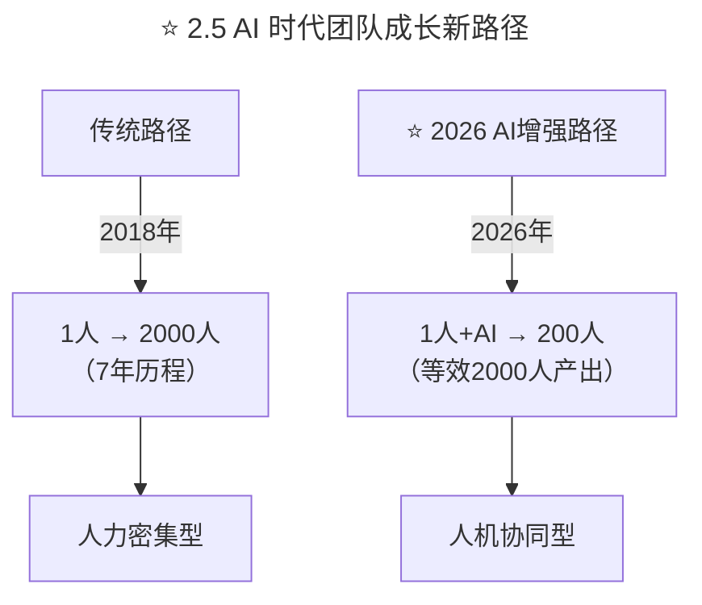

> **适用范围**：CTO、技术VP、工程总监、技术管理者
> **更新摘要**：v2 版本基于原文大咖对话内容，保留全部原始内容并升级为 6 节结构；融入 2026 年 AI 时代注解，新增 AI 时代团队成长新路径、AI-T 型知识结构、编排式领导力模型及 2026 行动清单。

---

# 大咖对话 | 从几个工程师到2000+个工程师的技术团队成长秘诀

## 一、导言

每周五是《技术领导力300讲》的"大咖对话"时间，本周与我们对话的嘉宾是斑马资本合伙人、原去哪儿网CTO、TGO鲲鹏会北京分会会员吴永强。

在去哪儿期间，他建立了世界上访问量最高的旅游搜索引擎。在公司发展过程中，又成功地带领技术团队支持公司转型为以移动为核心的在线旅游平台。在团队建设上，他成功将去哪儿的技术团队从几个工程师扩展到2000+个工程师的规模。

本周，我们邀请他来分享自己伴随公司成长过程中的收获，以及转型投资人的心得体会。

> **⭐ 2026 年技术背景**：2026 年，GPT-5.5 发布，DeepSeek V4 国产大模型崛起，84% 开发者已将 AI 编程作为日常工作方式，Agent（智能代理）进入加速落地期，人机协作成为新常态。吴永强老师"从几个人到2000人"的经验，在 AI 时代有了全新诠释——**2026年的目标不是"招更多人"，而是"让每个人+AI发挥更大效能"**。

---

## 二、核心方法论

### 2.1 人是企业最重要的财富

**Q：作为CTO伴随着创业公司（去哪儿网）一步步成长，到最终上市，你最大的收获是什么？**

A：伴随一家公司从小成长到大，是一段奇妙的旅程，途中有欣喜，痛苦，焦虑，兴奋，什么样的场景、困难都会遇到，就如同我们伴随着孩子成长一样，孩子成长的过程，同时也是父母跟随成长的过程。我在去哪儿的工作历程，收获良多，我就挑几个对我影响比较大的说一下：

首先，人是企业最重要的财富和资源，一个公司的成长伴随的是人的成长和团队的成长，一个公司就是所有员工的集合，公司所有人的集合的高度决定了公司发展的高度。所以要能够吸引好的人才，并且让这些人才在企业的平台上不断经历磨练，不断学习，不断进步。作为企业就应该从一开始就重视建立并改进自己的企业文化、激励机制、组织结构，为人才在内部的发展提供动力、平台。

### 2.2 懂业务的技术人

其次，技术部门定位问题，我向来认为业务是一个企业的核心。业务的发展壮大是保证技术部门得到足够投入并得到发展的关键。那么如何扎根于业务，同时对业务有自己的深刻的洞察，就是一个技术管理者日常最重要的工作。

我经常开玩笑说，懂业务的技术，就像流氓会武术，多懂些公司的业务，会对我们日常跟产品、业务部门的沟通有很大的好处，也能看得懂各种业务上的变化。对自己在技术上的判断有特别大的帮助，特别是在优先级、重要性的判断准确性上，是那些不懂业务的技术人所不能比拟的。

通常一个懂业务的技术人，在公司的发展速度都是比别人快很多的，而且也比较容易晋升到关键岗位。即使是换工作，选择加入哪家公司，又或者去创业，一个懂业务的技术人，大家可以想象会有多少优势吧。

### 2.3 深度/广度并重的 T 型知识结构

深度/广度并重，我认为人的知识要形成T字形的结构，有一个专长的方向，这是一竖，同时要掌握相关的知识，这是一横，这两个方向是相互促进的。

没有一定的宽度，其实你的专长深度是有限的，没有一定的深度，横跨的知识就会很松散，而且很难形成结构，大家应该都有这个经验，你在一个方向感到进步很慢，去涉猎一下相关的知识，很多时候就能帮你打开原来方向的困局。

现在的技术工作分工很细，我觉得这是计算机技术发展到成熟阶段的标志，但是技术人自己不能被分工所束缚，简单举例说，你做前端工作，光会前端技术会极大限制你的发展，跟前端相关的操作系统、网络、硬件、产品的基础知识都是需要涉猎和掌握的，而且能把这些知识形成有机的结构。

我遇到过的大牛，都是有这样的知识结构，甚至都对人文，历史有一定的研究，他们把知识当成一个体系。

### 2.4 人的技术：懂表达 + 懂尊重

人的技术，一个技术人的发展，不可避免会遇到人方面的问题，尤其对高端技术人的发展非常重要。高端技术人的日常工作大概是40%跟人相关，30%跟业务相关，剩下30%才跟技术相关。我认为掌握人的技术，有两点非常重要：一是懂表达，二是懂尊重。

懂表达就是如何能将自己的理解用大家容易接受和理解的方式表达出来，这个对于建立和扩大自己的影响力非常关键。

懂尊重，就是要帮助他人成长，好的技术人都容易有英雄情结，视比自己水平低的人如草芥，沟通基本以鄙视为主，所以必须从内心深处尊重其他人，才能建立和发展好一个技术团队。

### ⭐ 2.5 AI 时代团队成长新路径



上述流程图对比了传统团队成长路径（2018年，7年从1人扩展到2000人，人力密集型）与 AI 增强路径（2026年，1人+AI等效2000人产出，人机协同型），展示了 AI 时代团队规模可能变小但产出能力倍增的新范式。

---

## 三、关键流程

### 3.1 团队成长三阶段

去哪儿技术团队，从几个人开始，发展到两千多人，基本经历几个阶段。

**第一阶段：熟人为主**

这时候团队很小，更多是依靠核心人员过去积累的人脉，快速地建立起团队，这时候大家之间都很熟悉、信任，而且都战斗在业务的第一线，通常这个阶段的问题是很小的。

**第二阶段：社招为主**

这一阶段业务快速扩张，业务的复杂度也快速上升，急需更多的人才加入进来，同时公司有了一定的知名度，也能招到非常多优秀的人才。

这个阶段的问题主要是，人员来自四面八方，各自有各自的文化底色和做事的方法，同时技术分工变得复杂，很多人会离业务越来越远，这个阶段，如何能够保持原来建立的以业务为核心的技术文化不被稀释，同时能够将大家融合在一起，形成合力，是一个技术管理者需要解决的大问题。

**第三阶段：自己培养人才**

这个阶段主要的人才来自于各大高校的校招。经验告诉我们，这是目前唯一能够大批量招到优秀人才的途径，所幸去哪儿在技术团队只有六十个人的时候就开始尝试校招，这对后面几年公司业务大发展的时候，解决人才的储备和发展起到了决定性的作用。

校招进来的同学的选、用、育、留，又是一个非常不同的课题，我们在这些同学身上花了大量的时间和资源，做了很多不同的尝试，去培养他们技术、管理、业务等多方面的能力，很高兴看到的是，目前去哪儿网的大部分中坚力量都来自于我们当年的校招。

### 3.2 团队成长三阶段的 AI 版本

| 阶段 | 传统特征 | ⭐ 2026 AI增强 |
|------|---------|---------------|
| **初创期（熟人）** | 核心人员亲力亲为 | **核心人员+AI工具=超级个体团队** |
| **扩张期（社招）** | 快速招人填坑 | **招AI Native人才+AI培训加速融入** |
| **成熟期（校招）** | 批量培养新人 | **AI导师制：1资深+AI带教10新人** |

### 3.3 技术部门定位与节奏

技术的积累和发展有自己独特的规律和步调，必须对业务目前和未来面临的技术挑战有一个清晰的认识，技术部门就有了当前运行的重心，也能对未来的挑战做技术和人才上的储备。在业务的挑战到来的时候，才不至于临时抱佛脚。

另外，一个企业的发展历程如同一首交响乐，各个部门在不同的发展阶段，所处的位置和扮演的角色是不同的，如何能够在企业不同发展阶段，对技术部门进行准确的定位是非常重要的。

在轮到技术部门作为主角的时候，就要勇于承担责任，发挥技术部门的优势，促进公司业务的发展；在轮到做配角的时候，也能安心、全力支持其他部门的工作，踏踏实实做好技术的积累和对未来的准备工作。只有这样，企业才能快速、和谐地向前发展。

### 3.4 从 CTO 到投资人转型

**Q：离开去哪儿之后，你成了一名投资人，转型过程中你遇到过哪些障碍？**

A：确切说我目前还没有做大的转型，如果让我选择，技术和投资之间，我一定毫不犹豫选择技术。因此目前在投资方面我依然侧重于技术，以及帮助我们投资的公司的技术团队如何能运作得更好。

和在企业做事不同的是，投资有他独特的知识结构以及运作流程，这部分我之前基本是空白，所以现阶段，能做和正在做的就是努力向有经验的同事学习，希望自己能够早日"毕业"。

另外，作为一个技术人员，我跟很多工程师一样，思考问题相对保守，同时习惯于在过程中不断收集信息，学习知识，积累自己对这件事情的信心，这个和投资非常不一样，投资相对来说更加宏观、更加趋势性，时间点也更加急迫，就需要你作出抉择。

### ⭐ 3.5 AI 时代重新分配时间

```
传统时间分配：
├─ 40% 跟人相关（沟通、管理）
├─ 30% 跟业务相关（需求、洞察）
└─ 30% 跟技术相关（编码、架构）

⭐ 2026 AI增强分配：
├─ 50% 跟人相关（AI时代更需要领导力和影响力）
├─ 30% 跟业务相关（判断AI应用场景）
├─ 15% 跟技术相关（AI辅助完成）
└─ 5% AI工具使用和优化
```

---

## 四、工具与实战

### ⭐ 4.1 懂业务 + AI 的升级

```
传统懂业务：
├─ 理解产品功能
├─ 理解业务流程
├─ 理解商业模式
└─ 结果：晋升快、选择多

⭐ 2026懂业务+AI：
├─ 理解产品功能
├─ 理解业务流程
├─ 理解商业模式
├─ ⭐ 理解AI如何赋能业务
└─ 结果：晋升更快 + 成为稀缺人才
```

### ⭐ 4.2 AI-T 型知识结构

| 维度 | 传统T型 | ⭐ 2026 AI-T型 |
|------|---------|---------------|
| **竖线（深度）** | 某技术领域专精 | **某技术领域 + AI应用能力** |
| **横线（广度）** | 相关技术涉猎 | **相关技术 + AI工具链 + 商业理解** |

### ⭐ 4.3 懂表达 × 懂尊重 = AI 时代领导力

| 技能 | 传统做法 | ⭐ 2026 AI增强 |
|------|---------|---------------|
| **懂表达** | 清晰传达技术方案 | **用AI生成可视化方案+人类讲解情感** |
| **懂尊重** | 尊重每个团队成员 | **尊重人类同事+善用AI助手（不炫耀）** |

---

## 五、常见误区

### 误区 1：盲目扩张团队规模

- **现象**：认为人越多越好，忽视 AI 的乘数效应
- **对策**：先评估每个岗位的 AI 增效潜力，再决定是否增编

### 误区 2：技术人只关注技术

- **现象**：40%跟人、30%跟业务的比例在 AI 时代需要进一步调整
- **对策**：增加人和业务相关时间，将纯技术工作交给 AI 辅助

### 误区 3：忽视校招的战略价值

- **现象**：只依赖社招快速扩张
- **对策**：在团队60人时就启动校招，为未来3-5年储备人才

### 误区 4：用旧标准衡量新人才

- **现象**：用2018年的技术标准评估2026年的候选人
- **对策**：在T型知识中加入AI维度，评估AI协作能力

---

## 六、进阶延展

### ⭐ 2026 行动清单

**✅ 技术管理者本周行动：**

1. **评估团队的"AI成熟度"**
   - 当前处于哪个成长阶段？
   - AI工具使用率是多少？
   - 人机协作流程是否建立？

2. **启动"AI导师制"试点**
   - 选1位资深员工
   - 配备AI工具（Copilot等）
   - 带教2-3位新人
   - 1个月后评估效果

3. **重新分配自己的时间**
   - 减少纯技术工作时间（用AI替代）
   - 增加人和业务相关时间
   - 目标：从30%技术 → 15%技术

### 核心结论

吴永强老师分享的"从几个人到2000人"的团队成长经验在AI时代有了新的诠释——**2026年的目标不是"招更多人"，而是"让每个人+AI发挥更大效能"**。记住：**AI时代的团队规模可能变小，但影响力和产出可以更大**。

### 作者简介

吴永强，斑马资本合伙人兼董事总经理、原去哪儿网CTO、TGO鲲鹏会北京分会会员。专注技术管理、大数据、云计算等领域，并具有非常丰富的实战经验。在去哪儿期间建立了世界上访问量最高的旅游搜索引擎，成功带领技术团队从几个工程师扩展到2000+个工程师的规模。