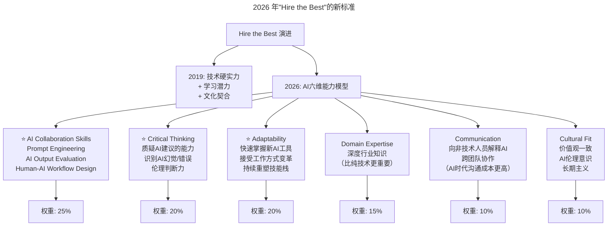

> **适用范围**：CTO、技术 VP、HR 负责人、Engineering Manager
> **更新摘要**：v2 版本基于 2019 年容力博士大咖对话原文，保留全部原始内容并升级为 6 节结构；融入 2026 年 AI 时代注解，新增 Hire the Best 新标准（AI 六维能力模型）、人才培养体系 AI 升级、人才留存新挑战及国际化团队 AI 协同实践。

---

# 大咖对话 | 对人才的长期投资是人才体系打造的根本

## 一、导言

本周作客"大咖对话"的嘉宾是 Comcast 全球副总裁、FreeWheel 高级副总裁容力博士，在加入 FreeWheel 之前，他曾就职于雅虎和微软，具备多年技术管理经验，并在搜索广告、展示广告和视频广告领域拥有深厚的知识储备和业务理解。今天，我们和他聊了聊如何打造自己的人才体系。

> **⭐ 2026 年技术背景**：84% 开发者使用 AI 编程，Agentic Coding 渗透率达 29%。容力博士 2019 年提出的"Hire the Best"原则在 AI 时代需要重新定义——"Best"不再仅指技术最强的人，而是 AI 协作能力最强 + 学习力最快 + 批判性思维最强的人。

---

## 二、核心方法论

### 2.1 打造高效研发团队的五大要素

**极客时间：以您的经验来看，如何打造高效的研发团队？**

**容力**：作为一家以技术创新为主要发展手段的新兴企业，我们在市场上面对的是全球顶级的竞争对手，因此，一支高效的有持续活力的研发团队是我们的竞争基础。我们会从以下几点出发：

1. 优秀人才是打造高效研发团队的基础，因此，在招贤纳士时我们始终秉承"Hire the Best"的基准和原则。但 Hire the Best 的难点在于，不能只看他现在会什么，而是要预测他将来是否能更快地学到更多。技术人的学习能力，其个人长期的潜质和潜力应该在面试环节得到更多的加分。
2. 技术引领的创新是我们公司从创立伊始就一直秉承的公司文化，也就是工程师文化。我们认为这样的工程师文化，为我们营造了一种浓厚的技术氛围，能促使研发团队持续高效运转。
3. 优秀的管理层是必要条件，我们鼓励从研发一线选拔出积累了丰富的实操经验、具备国际视野和深厚技术背景的管理人，从管理层面 empower 潜心研究前沿技术领域的技术大牛。
4. 持续不断地优化流程，使其适应变化，结合 project 和 squad 模式对资源进行有效管理，并根据优先级合理分配资源。
5. 管理层非常重视跟员工之间充分、开放地沟通。比如技术层面和商业模式层面的信息，都可以在领导层和员工之间做到充分的沟通和共享，使得员工能更好地把握整体方向、理清事情的优先级，做对公司最重要的事情。另外，大家做事都是本着平等开放的原则，不会因为说话的人不同，就对他提出的问题或者方案持有不同的态度，不因人废言，更不因言废人。这样做更能激发大家的积极性，充分发挥每一位员工的创造力。

#### 2026 年验证

| 原始观点 | 2026 年验证 | 验证结果 |
|---------|-----------|---------|
| Hire the Best | ⭐ **需重新定义"Best"**。2026 年"Best"不是技术最强的人，而是**AI 协作能力最强 + 学习力最快 + 批判性思维最强**的人 | 🔧 重定义 |
| 工程师文化 | ⭐ **演变为"AI-Augmented Engineer Culture"**。文化内核不变（技术创新），但工具和方法全面 AI 化 | ✅ 演进 |
| 双通道机制 | ⭐ **需扩展为三通道**：技术专家 / 管理者 / **AI 架构师（新角色）**。第三通道专门负责 AI 系统集成和 Agent 设计 | 🔧 扩展 |
| 轮岗制提升视野 | ⭐ **更加重要但也更易实现**。AI 降低了跨岗位学习成本（如 AI 辅助快速理解新业务），轮岗 ROI 大幅提升 | ✅ 强化 |
| 百人/千人临界点 | ⭐ **因 AI 而改变**。AI 工具使单管理人效提升 2-3 倍，百人瓶颈可能延至 200-300 人；但新增了**AI 协同效率瓶颈** | ⚠️ 复杂化 |

### 2.2 人才体系三支柱

**极客时间：FreeWheel 非常注重人才培养，那您能否分享一下 FreeWheel 的人才培养体系？**

**容力**：对人才的长期投资是我们搭建人才培养体系的根本出发点，我将从人才招聘、人才培养、人才留存三个方面分享一下 FreeWheel 的做法。

#### 支柱一：人才招聘

1. FreeWheel 有着自己的"文化基因"，我们始终鼓励技术引领创新，加上多年对行业的深厚理解和积淀，造就了今天的市场地位。我们所做的事情时刻反映着我们的理念，我们认为，理念和价值观的契合是十分重要的，在这个前提下，我们能为他带来什么、他能为公司带来什么、双方能否达到长期的互相认同——这三点是我们在甄选人才时始终在强调的。
2. 我们认为人才培养是一个长期的投资，所以我们非常看重候选人的发展潜力，强调对市场和业务的理解。
3. 我们看中人才的国际视野，我们的定位和立意是全球化，即我们研发的产品，是为全球客户服务的，而不是为某一个或几个特定的国家服务，因此，我们的技术团队、我们的员工必须具备国际视野。

#### 支柱二：人才培养

1. 我们为技术人提供技术路线和管理路线两条上升路径，两者并不互斥，他们可以根据自己的兴趣与特长选择适合自己的道路。
2. FreeWheel 建立了非常完备的培训系统，设有专门的培训团队，并划拨专门的培训预算。我们会为员工提供不同维度的培训机会，包括技术培训（技术分享、技术大会、专业培训、技术书籍等）、软技能培训（英文、演讲、领导力、沟通等）和业务培训（高端视频市场及广告业务方面）。

#### 支柱三：人才留存

1. 打造归属感和个人影响力。我们团队所研发的产品的每一个功能，都是客户迫切需要，并且能为他们带来明显收益的，因此每一个人的工作重要性和回报都显而易见，每一个人都在时刻对公司发挥着个人影响力。这样的高要求，加上十分紧密的团队合作、带 FreeWheel"文化基因"的做事方式，最终会带给个人强烈的归属感。
2. 轮岗制。加强全球各部门之间的沟通，加深工程师对不同区域市场的理解，是轮岗制设立的初衷。前面我提到我们很看重员工的国际视野，轮岗制正是建立和提升我们员工国际视野的有效机制。尤其是我们的轮岗不仅仅是在纽约和北京两地，也包括了美国西海岸以及欧洲，并且是多向而不是单向的。

### 2.3 团队规模阶段论

#### 初创阶段

与所有初创公司一样，大家有明确的共同目标，组织架构和人际关系作为辅助手段的作用尚不显著。

#### 百人规模阶段

100 人是通常可保持稳定相互关系的一个阈值。此时，团队正式从"部落"进入到"村落"阶段，必须要建立两级管理制度，并明确分工。在这个阶段，团队之间如何协调会成为管理层必须关心留意的一个问题。

#### 千人规模阶段

FreeWheel 现在就处于这个阶段，我们全球有约 800 位工程师，北京占 300 余人。此时的团队从"村落"进化到"城镇"，在管理中尤其需要注意以下几点：

1. 需要不定期审视组织架构并对其进行优化
2. 为确保团队的高效，需保证团队上下对企业愿景和使命的理解高度一致
3. 保持竞争力（狼性），有些公司鼓励内部项目竞争，我们则希望通过别的方式，尤其是希望以技术竞争替代项目竞争达到同样目的，Hackathon 是一个例子

---

## 三、关键流程

### 3.1 2026 年"Hire the Best"的新标准 ⭐ 2026

上述流程图展示了 Hire the Best 从 2019 年的三维标准到 2026 年 AI 六维能力模型的演进：AI 协作能力（25%）和批判性思维（20%）及适应力（20%）成为权重最高的三个维度，领域专精（15%）、沟通能力（10%）和文化契合（10%）紧随其后，体现了 AI 时代对复合型人才的新要求。

### 3.2 人才培养体系的 AI 升级 ⭐ 2026

| 培养维度 | 2019 年做法 | 2026 年 AI 增强做法 |
|---------|-----------|----------------|
| 技术培训 | 内部分享、外部培训、读书 | **AI Personalized Learning Path**：根据员工技能图谱自动推荐课程和实践项目 |
| 软技能培训 | 演讲、领导力、沟通工作坊 | **AI Communication Coach**：实时反馈表达清晰度、逻辑性；AI Roleplay 模拟困难对话 |
| 业务培训 | 行业知识讲座 | **AI Knowledge Synthesis**：自动聚合行业报告、竞品动态、用户反馈，生成个性化学习材料 |
| 导师制 | Senior 带 Junior | **AI Mentor + Human Mentor 双轨制**：AI 负责知识传递和答疑，人类导师聚焦职业规划和情感支持 |

### 3.3 优秀技术人的能力素养

**极客时间：在您看来，一个优秀的技术人最应该具备的能力或素养是什么？该如何更好的培养、锻炼这一能力呢？**

**容力**：正如我之前提到的，优秀的技术人他应该要具备强技术硬实力、国际化视野、对业务逻辑和市场需求的理解力，以及扩散自身影响力的个人软实力。不过，对技术人才的要求是随着大环境的变化在不断变化着的，这一点是技术管理者在建立人才体系时需要注意的。

---

## 四、工具与实战

### 4.1 ⭐ 2026 行动清单

#### 对于 CTO/技术 VP

- [ ] **修订 Job Description 模板**：加入 AI 协作能力要求，更新面试题库（增加 Prompt Engineering 测试、AI Scenario Judgment 等）
- [ ] **建立 AI Skills Matrix**：为每个角色定义必需的 AI 技能等级和成长路径
- [ ] **设计三通道晋升体系**：技术 IC / Manager / AI Architect，明确每通道的晋升标准和薪酬区间
- [ ] **投资 AI Learning Platform**：为企业引入或自建个性化 AI 学习系统

#### 对于 HR/招聘负责人

- [ ] **更新面试评估表**：增加 AI Collaboration Assessment 模块（可使用 AI 面试助手辅助评分）
- [ ] **关注"AI Native"候选人**：优先考虑有 AI 工具使用经验的候选人（尤其是 Gen Z）
- [ ] **建立 AI Ethics Screening**：在背景调查中加入 AI 伦理相关问题的评估

#### 对于团队 Leader

- [ ] **实施"AI Buddy System"**：每位成员配一个 AI 助手（如 GitHub Copilot、Cursor），定期分享使用技巧
- [ ] **开展"AI Anxiety Workshop"**：开放讨论团队对 AI 的担忧，制定共同应对策略
- [ ] **重新设计 OKR/KPI**：确保指标能反映"人机协同产出"而非仅个人产出

#### 对于个人发展

- [ ] **制定 AI Skill Development Plan**：每季度掌握一个新 AI 工具或框架
- [ ] **建立 Personal AI Knowledge Base**：用 AI 工具整理和沉淀自己的专业知识
- [ ] **寻找 AI Mentor**：可以是真实的人类导师，也可以是 AI Coach（如 ChatGPT Advanced Data Analysis 模式）

### 4.2 人才留存的新挑战——AI 时代的归属感 ⭐ 2026

容力提到的"归属感"和"个人影响力"在 2026 年面临新问题：
- 当 AI 能完成 80% 的工作时，员工会问："我的价值是什么？"
- 新一代员工（Gen Z）更看重**工作的意义感和创造性**，而非稳定性
- **AI 焦虑**成为离职原因之一（担心被替代）

**解决方案**：
- 重新定义贡献：从"代码量"转向"问题解决复杂度"和"AI 协调能力"
- 创造"人类独占"的高价值工作：战略决策、创意方向、客户关系、团队激励
- 透明沟通 AI 策略：让员工知道 AI 是工具而非替代者

### 4.3 国际化团队的 AI 协同 ⭐ 2026

FreeWheel 强调的"国际视野"在 2026 年有了新内涵：

- **全球化 AI 团队**：利用时差实现 24 小时 AI 训练/开发循环（美国白天标注数据，中国白天训练模型）
- **跨文化 AI Ethics**：不同国家对 AI 的监管和文化接受度不同，需要本地化适配
- **AI 降低语言障碍**：实时翻译工具使得跨国协作更顺畅，但文化差异仍需人类智慧

---

## 五、常见误区

### 5.1 Hire the Best 的理解误区

- **误区**：Hire the Best = 招技术最牛的人
- **正确理解**：Hire the Best = 招最能与 AI 共舞的人——他们知道何时该听 AI 的，何时该坚持自己的判断
- **AI 时代延伸**：不仅看当前能力，更要看 AI 协作潜力和批判性思维

### 5.2 人才投资周期误区

- **误区**：培养一个骨干需要 3-5 年，太慢了
- **正确理解**：借助 AI 加速学习，可能 18-24 个月就能胜任——前提是你选对了人
- **关键前提**：选对具有高学习力和 AI 适应力的人才

### 5.3 归属感的来源误区

- **误区**：归属感来自"公司离不开我"
- **正确理解**：归属感来自"我能用 AI 创造出独特的价值"
- **AI 时代延伸**：当 AI 承担常规工作时，归属感应来自人类的独特贡献——判断、创意、沟通

---

## 六、进阶延展

### 6.1 核心金句（2026 版）

> **"2026 年的'Hire the Best'不是招技术最牛的人，而是招'最能与 AI 共舞的人'——他们知道何时该听 AI 的，何时该坚持自己的判断。"**

> **"人才投资的回报周期在缩短：以前培养一个骨干需要 3-5 年，现在借助 AI 加速学习，可能 18-24 个月就能胜任——前提是你选对了人。"**

> **"归属感的来源不再是'公司离不开我'，而是'我能用 AI 创造出独特的价值'。"**

### 6.2 延伸思考

- "对人才的长期投资"在 AI 时代需要加入 AI 技能维度，但核心的"长期主义"不变
- 双通道晋升机制需扩展为三通道（技术/管理/AI 架构师），以适应 AI 时代的新角色
- 轮岗制的 ROI 在 AI 时代大幅提升，因为 AI 降低了跨岗位学习成本
- 团队规模临界点因 AI 工具而延后，但新增了 AI 协同效率瓶颈

---

*本注解基于 2026 年 6 月的团队管理实践生成，是对容力博士 2019 年经验的致敬与延展。*