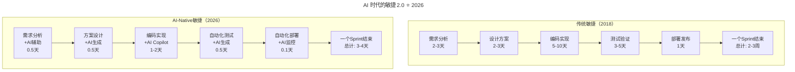
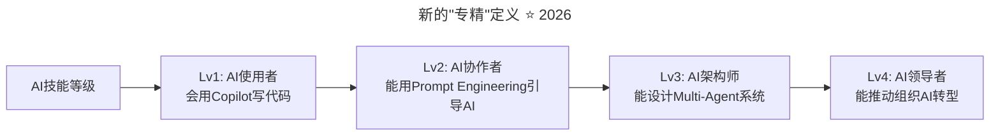
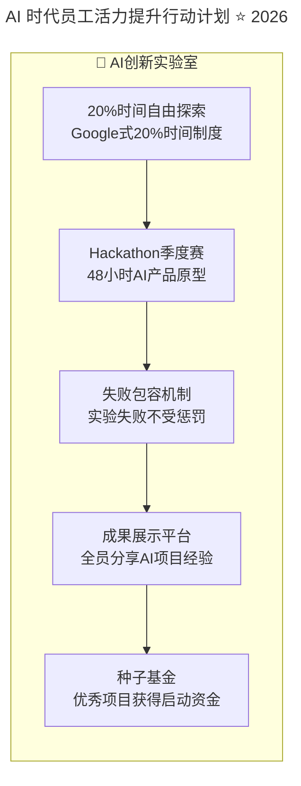
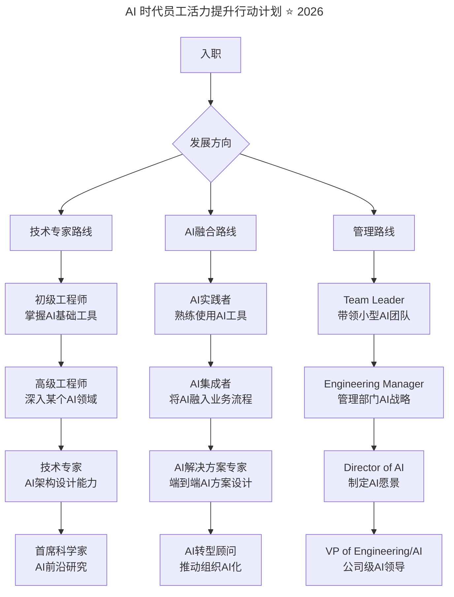

> **适用范围**：技术团队管理者、HR 负责人、敏捷教练、Engineering Manager
> **更新摘要**：v2 版本基于 2018 年徐毅大咖对话原文，保留全部原始内容并升级为 6 节结构；融入 2026 年 AI 时代注解，新增 AI 时代驱动力 3.0 演进、人机协作环境下的员工体验设计、AI-Native 敏捷 2.0 及 AI 时代员工活力诊断体系。

---

# 大咖对话 | 徐毅：如何提升员工的活力与动力？

## 一、导言

本周作客大咖对话的嘉宾是华为云 DevCloud 首席技术布道师徐毅，也是华为 Cloud BU 软件开发云产品部、华为研发能力中心特聘敏捷专家顾问，前 IBM 大中华区敏捷及 DevOps 卓越中心主管，前惠普企业服务资深敏捷顾问，前诺基亚移动设备敏捷及精益教练，前诺基亚网络全球敏捷转型中心精益及敏捷教练，拥有 10+ 年行业经验。今天，我们跟他聊了聊如何提升员工的活力，以及他对敏捷的认知。

> **⭐ 2026 年技术背景**：84% 的开发者使用 AI 编程，员工每天都在与 AI 协作，工作内容和性质发生了根本变化。徐毅老师的驱动力 3.0 框架在 AI 时代不仅不过时，反而更重要了——当 AI 能够承担越来越多的重复性工作时，人类工作的意义感、自主性和成长性就成为了稀缺资源。

---

## 二、核心方法论

### 2.1 驱动力 3.0：自主、目的、专精

**极客时间：您之前的采访中提到活力是让效率之轮滚动起来的动力之源，那在具体的实践中，该如何提升员工的活力呢？**

**徐毅**：活力方面，首先要理解新时代我们员工的动力在哪里，我比较推荐咱们的技术 Leader 们可以学习一下丹·平克的《驱动力》这本书，作者认为适合现代知识工作者的驱动力 3.0 包括三个要素，自主（Autonomy）、目的（Purpose）和专精（Mastery）。

#### 自主（Autonomy）

我一般会举例说，如果一个人要做什么、怎么做都无法做主，那这个人就被管死了。作为中国人，我们可以回想一下自己的成长经历，尤其是中学时代，学什么、怎么学都没有什么可选择的余地，所以逃课的人很多。当然，怎么释放自主，也不是说马上把这些选择权给到员工就行了，就好比前面这些学生突然进入寄宿制大学就跟放羊一样，也是不行的，必须有个过程，这方面呢，我推荐参考理查德·哈克曼（Richard Hackman）的职权模型，要逐步地培养自主能力。

#### 目的（Purpose）

一个非常具体的小例子，就是我们平时大家交流需求，越大的组织越容易出这种问题。当基层员工拿到一个需求的时候，其实已经不是需求，而是一个开发任务了，他们可能都不理解这个任务为什么是这样的，但是当架构师或者 SE（系统工程师）讲完需求问他们"大家有什么问题"的时候，都陷入了中国式沉默，也就是说心里其实有不懂，但都不知道怎么问出来或者担心问了太简单的问题被鄙视。我的建议就是，我们能不能在讲需求的时候，讲清楚这个开发任务、这个功能、这个特性需求实现之后，使用这个功能特性的人，那个用户，他们会有什么样的变化，是不是生活会变得更美好一些？如果我们的工程师在开发代码的时候，也都能在心中想着这段代码所服务的那个人，我会说这是一种充满爱的开发。

#### 专精（Mastery）

我通常会在这里问听众一个问题，"中国人说一技之长，那么给大家 20 秒时间，你觉得你的一技之长是什么？"，但多次演讲下来，会举手说自己清楚自己一技之长的人寥寥无几。这是一个非常危险的信号，就好像我们每天过着昏昏庸庸的生活，忙来忙去，不知道自己的核心能力是什么，万一遇到职业生涯的变化，例如公司裁员啥的，就很容易陷入迷茫和恐慌。不说那么极端的情况，就说平常，如果不清楚自己的能力，我们又怎么能够有意识地去提升自己的能力、持续精进呢？虽然有 10000 小时理论，但后来也有澄清，那需要是刻意练习的 10000 小时，而不是 1 个小时用 10000 次啊。

#### 2018 vs 2026：驱动力 3.0 的演进

| 驱动力 | 2018 年含义 | 2026 年 AI 时代的升级 |
|-------|-----------|-------------------|
| **自主** | 选择做什么、怎么做 | ⭐ **AI 工具选择权、工作方式灵活性、人机协作模式的自主决定权** |
| **目的** | 理解任务的用户价值 | ⭐ **从"搬砖"到"用 AI 创造价值"，工作意义的重新定义** |
| **专精** | 找到一技之长并精进 | ⭐ **AI 协作能力成为新的核心竞争力，终身学习能力至关重要** |

### 2.2 敏捷的演进认知

**极客时间：您有很多敏捷相关的经验，但目前国内谈论敏捷的声音好像变少了，您是怎么看待这一情况的呢？**

**徐毅**：这其实是一个很正常的情况。我记得 InfoQ 在 2011 年的时候做过敏捷宣言十年的专题报道，请一些敏捷宣言签署人和业界专家针对敏捷的发展发表意见，我记得有一位专家就说过，或许十年后敏捷这个名字已经被人们所遗忘，但敏捷的精神却已经无所不在。当然，也有很多的抱怨，也有写批评意见说，现在感觉有种趋势，凡是好的都是敏捷的，这就没有办法讨论了。其实技术成熟度曲线总结得很好，敏捷从某种角度来讲，也可以用这个曲线来看待，我想敏捷现在应该处于光明期吧，虽然也已经越来越普及，但是其实很多组织的敏捷程度还很低，只是号称敏捷而已。

另一方面，大家可能都听说过创新鸿沟的技术采用曲线，用它的角度来看，2001 年应该算是创新者发明了"敏捷"，直到今天 2018 年，我觉得我们也只能说是刚刚过了早期采用者阶段，越来越多的企业开始谈论和走向敏捷，应该说是早期大众开始动起来了。同时，跟敏捷平级的其他主张也开始冒头，例如 DevOps、设计思维，它们相对敏捷来说位于曲线周期的更前面一些，自然也就会显得更时尚、更新颖、更趋势，敏捷就会显得更过时、更平淡。

还有就是，近些年我们看到组织领域、管理咨询领域也开始谈论敏捷，它们谈的敏捷和传统研发群体所谈论的敏捷又有所不同，可能是内容不同，也可能是层面、看角度不同。我想，从整体形势的角度来看，就是这样。

另一个层面，我前些年非常关注国内敏捷教练角色的情况，其实它的梯队是断档的，但是要做好敏捷，敏捷教练又是很重要的一类角色。早些年的时候，大众都不太知道敏捷教练这个角色是干嘛的，更多的人把它跟 Scrum Master 混为一谈，而近些年，各家企业都开始大量招聘各种级别的敏捷教练，从团队级别到汇报给 PMO、技术 VP、CIO、CTO 各种级别的都有。这在我看来，意味着各家企业开始接受敏捷教练是一个常规角色，是提升组织敏捷能力的一个关键手段。说手段，是因为我认为敏捷教练从某个角度来讲，最终的目的是要把自己的位置做没，做到组织不再需要他们。

在这个回答里，我就不讲非常具体的点了，感兴趣的朋友可以留言或者评论跟我交流。简言之呢，就是说，敏捷的声音变少了，是因为有更多其他的新趋势和新技术点冒出来了，另一方面是因为敏捷已经逐渐被大家接受是必要的，也就少了很多"要不要"的争议，更多的变成了"怎么做"的更深度的交流，从战略层面下沉到了战术层面，就好像是从大众市场到了垂直领域，所以大众感知度就降低了。

但是，这其实是更艰巨的时刻，因为这意味着敏捷必须要和各行各业、各家企业的具体场景结合，敏捷实践者需要更深度地理解敏捷精神的道法术器各个层面，灵活运用敏捷方法和实践解决具体问题，另一方面也要敞开胸怀去迎接和消化敏捷领域的新内容以及其他新领域的发展变化。

---

## 三、关键流程

### 3.1 华为研发能力提升的多层面推动流程

华为公司的研发队伍相当庞大，在实际推动的时候，研发能力中心这种公司级部门、各个产品线产品部自己的相关部门、研究所的相关部门等等各个部门都会发挥自己的作用：

- 一方面是**发起这个能力**，让大家意识到这件事情的重要性
- 另一方面是**在各地造势**，让大家可以接触到最新的信息、知道工作效率高的团队和个人榜样，知道公司重视这个方面
- 还有一方面当然就是**提供理论和实践方面的指导**，以及协助引进外界的大牛跟我们介绍外界的先进经验和理念
- 以及让**优秀的基层团队和个人得到宣传**，被大家所知道

总之就是从各个层面全方面大家一起来推动。

### 3.2 AI 时代的敏捷 2.0 ⭐ 2026

徐毅老师提到"敏捷的声音变少了，是因为已经变成了'怎么做'的问题"。在 2026 年，这个问题变成了：**"如何在人机协作的时代保持敏捷？"**

#### AI 加速的敏捷循环



上述流程图对比了传统敏捷与 AI-Native 敏捷的 Sprint 周期：传统敏捷一个 Sprint 需要 2-3 周，而 AI-Native 敏捷将每个环节的时间压缩了 60-80%，整个 Sprint 缩短至 3-5 天，迭代频率大幅提升。

**关键变化**：
- 📉 **每个环节的时间压缩了 60-80%**
- 📈 **迭代频率可以从两周提升到一周甚至更短**
- 🔄 **更多的精力放在"做什么"而不是"怎么做"**
- 💡 **创新实验的成本大幅降低，可以尝试更多想法**

### 3.3 新的"专精"定义 ⭐ 2026

徐毅老师问："你的一技之长是什么？"在 2026 年，这个问题的答案变了：

**❌ 过去的答案**：
- "我会 Java/Spring"
- "我擅长 MySQL 调优"
- "我是 React 专家"

**✅ 2026 年的答案**：
- "我擅长用 AI 快速构建 MVP"
- "我能设计和优化 RAG 系统"
- "我是 Prompt Engineering 专家"
- "我能管理 Multi-Agent 工作流"

#### AI 技能等级体系



上述流程图展示了 AI 技能从 Lv1 到 Lv4 的四个等级：AI 使用者（基础工具操作）、AI 协作者（Prompt Engineering 引导）、AI 架构师（Multi-Agent 系统设计）、AI 领导者（组织级 AI 转型推动），为员工提供了清晰的 AI 能力成长路径。

---

## 四、工具与实战

### 4.1 华为云 DevCloud

**极客时间：华为云 DevCloud 能为开发者和企业带来哪些好处？其核心竞争力是什么？**

**徐毅**：华为云 DevCloud 我们目前的宣传主要是强调"一站式云端 DevOps 平台，集成华为 30 年研发实践和前沿理念"，所以我们能够带给开发者和企业的好处最直接来说，就是这样的一个平台以及它所承载的先进理念和华为研发实践。

平台，解决的是生产力的问题，所谓工欲善其事必先利其器，DevCloud 首先提供的就是针对企业常见研发挑战的一个智能高效的研发平台。另外，生产力和生产关系是要匹配的，落后的生产关系会阻碍生产力的发挥，我们是通过逐渐开放华为 30 年研发能力提升的理念和实践，来协助客户实现人力物力资源节约和效率提升，提质增效、提高企业自身的行业竞争力。除了 DevCloud 平台之外，我们也会逐渐地提供专业咨询服务，全方位覆盖，助力企业研发转型升级。目前 5 人以下可以免费使用 DevCloud，欢迎大家尝试。

### 4.2 人机协作环境下的员工体验设计 ⭐ 2026

**2026 年的现实：84% 的开发者使用 AI 编程**

这意味着：
- 员工每天都在与 AI 协作
- 工作内容和性质发生了根本变化
- 需要重新设计激励机制和工作体验

#### 维度一：AI 赋能感（新增）

```
传统感受："我只是个代码工人"
AI时代感受："我是AI团队的指挥官"
```

**如何营造 AI 赋能感**：
- ✅ 提供最好的 AI 工具（Cursor Pro、Windsurf Enterprise 等）
- ✅ 庆祝"人机协作成果"而非单纯的个人产出
- ✅ 分享 AI 提效案例："用 AI 将 3 天的工作压缩到 3 小时"
- ✅ 创造"AI 挑战赛"：看谁能更好地利用 AI 解决问题

#### 维度二：工作意义重塑（核心）

**从"功能开发者"到"问题解决者"**：

| 过去（2018） | 现在（2026） |
|-------------|-------------|
| 产品经理给我需求 | 我和 AI 一起定义问题 |
| 我负责实现功能 | 我负责设计解决方案 |
| 我的产出是代码行数 | 我的产出是用户价值和业务影响 |
| 我是个"资源" | 我是个"创造者" |

**管理者话术升级**：
```
❌ 旧版："这个功能下周上线，你负责实现"
✅ 新版："这个用户痛点我们想用AI来解决，你来主导方案设计，
        AI可以帮你快速验证想法，我支持你需要的一切资源"
```

### 4.3 AI 时代员工活力提升行动计划 ⭐ 2026

#### 行动 1：AI 工具民主化（立即执行）

```yaml
# AI工具包配置示例
company_ai_toolkit:
  coding_assistants:
    - name: Cursor Pro
      cost: $20/user/month
      target_users: all_engineers
    - name: GitHub Copilot Enterprise
      cost: $39/user/month
      target_users: senior_engineers

  productivity_tools:
    - name: ChatGPT Plus/Team
      cost: $25/user/month
      target_users: all_employees

  specialized_tools:
    - name: Midjourney/DALL-E
      cost: $30/user/month
      target_users: designers_pm
    - name: Notion AI
      cost: $10/user/month
      target_users: all_employees

  budget_calculation:
    total_monthly: "$94/engineer + $35/others"
    roi_expectation: "300-500% productivity boost"
```

**实施步骤**：
1. 第 1 周：采购和分发账号
2. 第 2 周：组织基础培训（如何使用）
3. 第 3-4 周：进阶培训（最佳实践）
4. 每月：分享会（展示优秀案例）

#### 行动 2：重构绩效评估体系（1-2 个月）

**从"产出导向"到"影响导向"**：

| 评估维度 | 权重（旧） | 权重（新） | 说明 |
|---------|----------|----------|------|
| 代码产量 | 40% | 15% | AI 时代代码产量不再是核心指标 |
| 代码质量 | 30% | 25% | 依然重要，但更注重架构设计 |
| 问题解决能力 | 20% | 30% | 能否用 AI 高效解决复杂问题 |
| AI 协作能力 | 0% | 20% | 新增：能否充分利用 AI 工具 |
| 影响力和协作 | 10% | 10% | 不变 |

#### 行动 3：创建"AI 实验室"文化（持续进行）



上述流程图展示了 AI 创新实验室的五个核心要素：20% 自由探索时间、季度 Hackathon、失败包容机制、成果展示平台和种子基金，形成从探索到孵化的完整闭环。

#### 行动 4：重新定义职业发展路径（3-6 个月）



上述流程图展示了 2026 年的三通道职业发展路径：技术专家路线（从初级工程师到首席科学家）、AI 融合路线（从 AI 实践者到 AI 转型顾问）、管理路线（从 Team Leader 到 VP），三条路径并行且可交叉转换。

---

## 五、常见误区

### 5.1 ⚠️ 避坑指南

1. **不要强制使用 AI 工具** —— 提供选择，让员工自己决定
2. **不要用 AI 替代人类** —— AI 是增强器，不是替代品
3. **不要忽视情感连接** —— AI 越强大，人际互动越珍贵
4. **不要停止学习投资** —— AI 技术在快速进化，组织也要跟上
5. **不要制造焦虑** —— 强调 AI 是机遇而非威胁

### 5.2 忽视员工核心能力的误区

徐毅老师指出的"不知道自己一技之长是什么"这一现象，在 2026 年更加危险：
- **传统风险**：遇到职业生涯变化时陷入迷茫和恐慌
- **AI 时代新风险**：当 AI 能完成大部分常规工作时，没有核心专精能力的人最先被边缘化
- **正确做法**：持续刻意练习，建立不可替代的差异化能力

### 5.3 需求传递中的"中国式沉默"误区

- **误区**：基层员工不理解任务目的却不敢提问
- **正确做法**：讲清楚功能实现后用户生活会变得怎样，让工程师心中有服务的对象
- **AI 时代延伸**：AI 辅助需求澄清，但仍需人类理解工作意义

---

## 六、进阶延展

### 6.1 2026 年员工活力诊断问卷（管理者自测）

```markdown
## AI时代员工活力快速诊断

请在每项后面打分（1-5分，5分最高）：

### 自主性
- [ ] 员工可以选择使用哪些AI工具？____分
- [ ] 员工可以决定如何安排工作时间？____分
- [ ] 员工参与技术方案决策的程度？____分

### 目的感
- [ ] 员工理解自己的工作如何创造用户价值？____分
- [ ] 员工能看到AI带来的效率提升？____分
- [ ] 员工感到自己在用AI解决有意义的问题？____分

### 成长性
- [ ] 公司提供AI技能培训的机会？____分
- [ ] 员工有清晰的AI能力发展路径？____分
- [ ] 员工因掌握AI技能而获得认可？____分

### 协作体验
- [ ] 团队成员之间有良好的AI实践经验分享？____分
- [ ] 跨部门协作中AI工具的使用顺畅？____分
- [ ] 管理者理解和支持员工的AI探索？____分

---
总分：___/60分
- 50-60分：✅ 优秀！继续保持
- 40-49分：💡 良好，有改进空间
- 30-39分：⚠️ 需要重点关注
- <30分：🚨 紧急！需要立即行动
```

### 6.2 核心启示

徐毅老师说："**活力是让效率之轮滚动起来的动力之源**"

在 2026 年，这个"动力之源"有了新的燃料——**AI 赋予每个人的超能力**。

但核心没有变：**自主、目的、专精**。

区别在于：
- 自主 = **驾驭 AI 的自由**
- 目的 = **用 AI 创造真实的价值**
- 专精 = **成为人机协作时代不可替代的人才**

> **管理的终极目标不是让人工智能替代人，而是让每个人都能借助 AI 成为更好的自己。**

### 6.3 延伸思考

- 驱动力 3.0 在 AI 时代更加重要，因为人类工作的意义感、自主性和成长性成为稀缺资源
- 敏捷从"要不要"变成"怎么做"，在 AI 时代进一步演进为"如何在人机协作时代保持敏捷"
- "充满爱的开发"在 AI 时代升华为"心中有用户的人机协作"

---

*本注解基于 2026 年 6 月的组织管理和 AI 协作实践生成，包含最新的员工激励理论和管理工具。建议每季度根据团队反馈进行调整。*