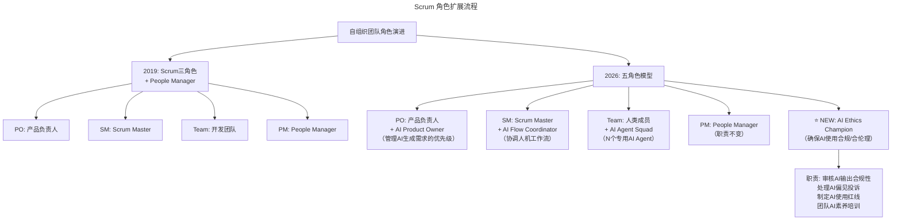
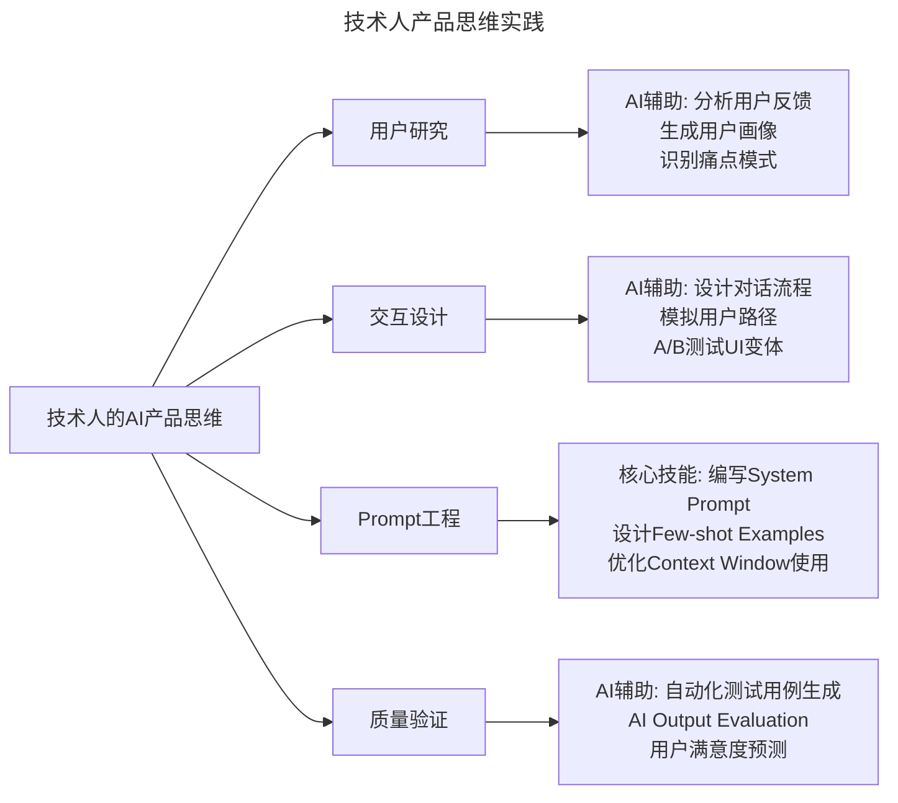

> **适用范围**：敏捷教练、Scrum Master、技术团队管理者、Tech Lead
> **更新摘要**：v2 版本基于 2019 年袁店明大咖对话原文，保留全部原始内容并升级为 6 节结构；融入 2026 年 AI 时代注解，新增自组织团队五角色模型、AI 透明度协议、Motivation 新公式及技术人 AI 产品思维实践。

---

# 大咖对话 | 袁店明：如何将打造自组织团队落诸实践

## 一、导言

本周作客大咖对话的是 Dell EMC 敏捷与精益创业咨询师袁店明。曾任职于百度、阿尔卡特朗讯，辅导过多个产品线转型，包括商业产品、无线变现以及多个移动互联网产品的团队转型和组织转型。目前着重于项目管理、团队转型、组织转型、精益创业、欣赏式探询以及专业引导(Facilitation)的实践和应用。今天我们共同探讨了自驱动、自组织团队的相关话题。

> **⭐ 2026 年技术背景**：随着 AI 编程工具使用率达 84%（Stack Overflow 开发者调查 2025），自组织团队面临新的机遇与挑战——AI Agent 作为"虚拟团队成员"加入，透明度的内涵从"任务透明"升级为"AI 决策透明"，技术人的产品思维因 Prompt 即产品而更加关键。

---

## 二、核心方法论

### 2.1 自驱动三要素

**极客时间：很多公司都希望打造自驱动的团队，那如何落诸实践，打造真正自驱动的团队呢？**

**袁店明**：我认为自驱动的关键在于个人的 Motivation（动机），同时离不开组织管理对个人的影响，包括团队项目管理的透明性、团队的规则、透明的考评机制、团队中权力与职责的分布，等等。

个人的 Motivation 并不单单是指薪资福利，其实，一个人在拿到公司的 offer 时，他的薪资待遇、职业通道就已经确定了。因为每年加薪的范畴是固定的，是你能够想象到的，除此之外，根据公司制定的晋升机制，你的升职路径也是能想象到的。所以，升职加薪不是给个人带来 Motivation 的主要因素，我认为其主要因素有三点。

第一点是尊重与认可，因为人具有社会属性，每个人都希望得到认可，感受到荣誉感与归属感。第二点是个人能力的成长，而个人成长只靠自我驱动是不够的，还需要依靠团队的帮助，比如团队成员间的相互促进和知识的传递分享等。第三点是职业发展通道与个人兴趣的匹配度，也就是个人职业生涯是否符合他的个人兴趣，兴趣可以激发动力，这一点不难理解。

不知道你有没有发现，获得 Motivation 的这三点因素，其前后顺序是有关联的，先是获得认可，其次是个人能力的提升，在获得成长之后，才会更多的考虑个人职业生涯与个人兴趣的匹合度。

#### 2026 年验证

| 原始观点 | 2026 年验证 | 验证结果 |
|---------|-----------|---------|
| 自驱动三要素 | ⭐ **依然成立但第三要素权重上升**。2026 年"兴趣匹配"变得更重要——因为 AI 承担了枯燥工作，人类更追求有意义、有兴趣的工作 | ⚠️ 权重变化 |
| 分散权力 | ⭐ **需补充"AI 权力分配"**。当 AI Agent 能自主完成任务时，需要明确：哪些决策权给 AI？哪些必须保留给人类？ | 🔧 扩展 |
| 透明度是基础 | ⭐ **从"任务透明"到"AI 决策透明"**。不仅要透明任务进度，还要透明"AI 做了什么决策、为什么这样做" | ✅ 升级 |
| 技术人要懂产品 | ⭐ **更加关键**。AI 时代技术人与产品的边界模糊化，**Prompt 即产品**，技术人直接定义用户体验 | ✅ 强化 |
| 150 人临界点 | ⭐ **因 AI 而改变**。AI Agent 作为"虚拟团队成员"，使得实际协作单元扩大；但新增了**AI 协同一致性挑战** | ⚠️ 新维度 |

### 2.2 打造自组织团队的两个关键点

其实，相比自驱动，我更建议用自组织来说这个话题，内容可以更丰富。那如何打造自组织的团队呢，我认为有两个关键点：

#### 关键点一：分散权力

比如 Scrum 中，有三个角色，分别是 PO（产品负责人）、Scrum Master 和 Team（开发团队），我觉得应该再加入一个重要角色，即 People Manager，这四个角色相互制约、相互促进。具体有哪些措施呢？

首先，People Manager 不应该参与团队的日常运作。如果团队要更好地实现自组织，People Manager 所做的事情非常多，比如招聘、培训、考核，一对一面谈等等。如果是一个几十人组织中的 People Manager，这些事情就已经够他/她忙的了。

其次，Scrum master 需要提醒团队成员，每个人的职责所在和权力范围，不要越界，同时需要引导团队如何更好的呈现项目进度。

在这方面，Scrum master 需要做两件事，即对外透明和对内透明。先说对外透明，比如 Scrum master 需要提醒产品负责人，不要干涉开发团队的进度，但产品负责人一定是会很关心项目进度的，这时，Scrum master 就需要引导团队及时向外部所有关系人输出信息，比如利用大白板公开工作任务及任务进度、用户故事的进度等，使产品负责人能够直观的看到项目迭代进度。

所以，作为 Scrum master，需要引导团队，准确地对外输出信息，并及时更新，这样一来，外部关系人才不会越权，干涉内部团队的项目进度。

再说对内透明，Scrum master 需要保证项目管理的透明性和真实性。只有项目管理真实、透明，才能在此基础上建立团队内部的信任，打造自组织团队。刚才讲到的对外的信息输出，是透明你的需求，也就是公开用户故事的状态，而对内透明，是为了保证任务的真实性和时效性。这里的真实性是任务要真实，时效性是指业务状态要及时更新。

#### 关键点二：设定个人与团队的成长目标

一个自组织团队，必须要让团队不断地达成自己的成长目标，同时帮助团队成员成长。在这方面，就需要 Scrum master 去做许多工作，比如对于个人，就需要 Scrum master 在回顾会议上，组织每个人展望自己下个季度的目标，并依此制定自己的学习目标和成长目标。而对于团队，也需要 Scrum master 根据团队所面临挑战的不同，制定不同的项目计划与业务计划。总的来说，设定团队和个人的成长目标是 Scrum master 非常重要的一项职责。

为什么又谈个人成长，又提团队成长呢？因为团队由个人组成，每一个人都应该对团队有所贡献，在自己获得成长的同时，帮助其他人学习与提升。当然，这个团队绝对不是共产主义，只是在小团队中，拥有互相帮助、共同成长的环境，能够促使团队成员的个人能力得到快速提升。而这样才能够激发自组织团队的 Motivation，从而使团队越来越优秀。

### 2.3 最好的需求来自自组织团队

**极客时间：敏捷原则中提到"最好的构架、需求和设计出自于自组织的团队"，您怎么理解这句话呢？**

**袁店明**：这句话中，架构和设计出自于自组织团队这两点不难理解，那为什么会说最好的需求是来自于团队，而不是来自于客户呢？主要原因在于，客户其实并不知道自己想要什么，是产品经理将客户需求描述出来的。那这么说，最好的需求难道来自于产品经理吗？也不是，产品经理只是把客户的痛点收集起来，至于如何用产品解决用户的问题，应该是实现需求的人最了解，也就是团队。团队需要写代码去实现产品，还要考虑到各种用户情况，因此可以说，最好的需求来自于自组织团队。

正因如此，作为一名最了解需求的技术人，就需要具备一定的产品思维，主要包括两点，一是了解用户细分人群，二是了解用户的行为和交互逻辑。

---

## 三、关键流程

### 3.1 Scrum 角色扩展流程

#### 2026 年自组织团队的"五角色模型" ⭐ 2026

上述流程图展示了自组织团队从 2019 年的四角色模型到 2026 年五角色模型的演进路径。新增的 AI Ethics Champion 角色专注于 AI 输出合规性审核、AI 偏见投诉处理、AI 使用红线制定及团队 AI 素养培训，体现了 AI 时代对伦理合规的新要求。

### 3.2 透明度机制

#### 对外透明流程

- Scrum Master 引导团队向外部所有关系人输出信息
- 利用大白板公开工作任务及任务进度
- 公开用户故事的状态和进度
- 及时更新，使产品负责人能直观看到迭代进度

#### 对内透明流程

- 保证项目管理的透明性和真实性
- 确保任务真实性（任务要真实）
- 确保时效性（业务状态要及时更新）
- 建立团队内部信任

#### 透明度的 AI 升级版 ⭐ 2026

传统透明：
- 白板展示任务状态
- 每日站会同步进度
- 公开迭代计划

2026 年 AI 透明：
- **AI Decision Log**：记录所有 AI 自主决策及其依据（可追溯、可审计）
- **AI Output Dashboard**：实时展示 AI 产出的质量指标（准确率、满意度、错误率）
- **Human-AI Collaboration Map**：可视化展示每个任务中人和 AI 各自承担的部分
- **AI Learning Progress**：公开团队 AI 技能提升轨迹（谁在使用什么 AI 工具、效果如何）

### 3.3 技术人产品思维实践

#### 了解用户细分人群

极限编程中有个概念叫用户故事（User Story），是从用户的角度来描述用户渴望得到的功能，而我们有很多用户，用户需求也各不相同，因此就需要我们去了解用户的细分人群，清楚我们的用户是什么人，有什么特征等，这样才能写出更好的用户故事。

举个例子，有次我带团队，做的是一款管理工作流的产品，就需要去了解这类产品的用户人群，了解这类人群的特征。团队中有一位产品经理非常聪明，想到从 LinkedIn 上收集信息，他搜索相关岗位就能看到对应的人有什么特点和属性，比如工作职责、教育程度、能力方向等，是一个提取用户信息的好方法。

#### 了解用户的行为和交互逻辑

最熟悉产品的人应该是技术人员，因此技术人需要熟悉所有用户和产品的交互逻辑，比如用户先输入什么，再输入什么，以及每一个数据的边界值、各种测试情况、各种交互路径的细节等等。你作为技术人，需要对此都非常了解。当然技术团队既包括开发，又包括测试，其实测试应该要比开发更了解用户行为。

#### 技术人产品思维的 AI 时代实践 ⭐ 2026

上述流程图展示了技术人在 AI 时代的产品思维四大维度：用户研究（AI 辅助分析用户反馈和生成画像）、交互设计（AI 辅助设计对话流程和模拟用户路径）、Prompt 工程（编写 System Prompt 和设计 Few-shot Examples）、质量验证（AI 辅助自动化测试和用户满意度预测）。

---

## 四、工具与实战

### 4.1 ⭐ 2026 行动清单

#### 对于 Scrum Master / 敏捷教练

- [ ] **更新团队角色定义**：明确 AI Agent 在团队中的定位（是工具还是成员？）
- [ ] **建立"AI Transparency Protocol"**：规定 AI 相关信息的公开范围和更新频率
- [ ] **引入 AI Ethics Checkpoint**：在每个 Sprint Review 中加入 AI 伦理审查环节
- [ ] **重新设计 Daily Standup**：除了"昨天做了什么"，增加"AI 帮了我什么"和"我遇到什么 AI 搞不定的问题"

#### 对于技术管理者

- [ ] **试点"AI-Augmented Squad"**：选择一个小团队，配备专用 AI Agent（如代码审查 Agent、文档生成 Agent、测试 Agent）
- [ ] **重新定义"Done"的标准**：不仅功能完成，还要包含"AI 输出已审核"、"AI 决策已记录"
- [ ] **创建"AI Motivation Survey"**：定期了解团队对 AI 的态度和使用障碍，针对性解决

#### 对于团队成员

- [ ] **发展"T-Shaped + AI"能力**：在一个领域深耕（T 的一竖），同时广泛掌握 AI 工具（T 的一横）
- [ ] **练习"AI Collaboration Journaling"**：记录每天与 AI 协作的心得，沉淀最佳实践
- [ ] **主动参与 User Story 协商**：不要等 PM 写完需求再动手，从需求定义阶段就介入（尤其是 AI 相关的需求）

#### 对于 PO / 产品负责人

- [ ] **学习基础的 Prompt Engineering**：理解技术团队在 AI 实现上的约束和可能性
- [ ] **重新思考 User Story 格式**：可能需要增加"AI Behavior"字段（描述 AI 在这个故事中的行为规范）

---

## 五、常见误区

### 5.1 产品经理与开发人员之间的矛盾

第一个原因是产品经理与开发人员之间的矛盾，矛盾冲突加深之后，可能会让开发人员为了完成产品经理的紧急需求，而选择只求交差，放弃思考的做法。甚至于产品后续会出现什么样的问题，技术人员也不会去深入思考了。所以，产品与技术人之间的矛盾是产生问题的首要因素。

### 5.2 忽视用户故事协商

第二个原因是技术人没有参与用户故事内容的描述。一个好的用户故事应该遵循 INVEST 原则，这六个字母代表六个特性，其中的第二个字母 N 是 Negotiable，意思是一个用户故事的内容要是可以协商的。

但很多人就忽略了协商因素。我在辅导团队时，通常会用电子工具来管理用户故事，从中能够看到用户故事的版本记录。如果一个用户故事从初稿到终稿都是由产品负责人拍板，中间没有其他任何人做改动，那这个用户故事一定是有问题的。合理的做法应该是在产品负责人写完初稿后，开发和测试再将用户故事细化，最终经过协商后确定终稿。

我认为每个用户故事都应该加入技术人的产品思维。因为，产品经理虽然从用户端了解到了他们的需求，但对于实现需求的产品逻辑与细节，技术团队才是最清楚的，所以，产品负责人应该与开发团队共同协商，形成最终解决方案。

### 5.3 AI 时代的新误区 ⭐ 2026

- **误区**：将 AI Agent 简单视为工具而非团队成员
- **正确做法**：明确 AI Agent 在团队中的定位和权责边界

- **误区**：忽视 AI 决策的透明度
- **正确做法**：建立 AI Decision Log，确保 AI 决策可追溯、可审计

---

## 六、进阶延展

### 6.1 AI 时代的"Motivation"新公式

袁店明提到的三要素在 2026 年的演进：

| 要素 | 2019 年版 | 2026 年 AI 增强版 |
|-----|---------|---------------|
| 尊重与认可 | 来自领导和同事的认可 | + **AI 贡献被认可**：当 AI 辅助完成工作时，如何公平归属功劳？（需要新的评价体系） |
| 个人成长 | 技能提升、知识分享 | + **AI Skill Mastery**：掌握 AI 工具成为核心成长指标；+ **从执行者到指挥者**的成长（学会管理 AI Agent） |
| 兴趣匹配 | 岗位与个人兴趣一致 | + **工作重塑**：AI 承担枯燥部分后，人类可以专注于更有创造性和趣味性的工作 |

**新增第四要素（2026）**：
- **⭐ 自主感（Autonomy）**：在 AI 辅助下，个人能更大程度地掌控工作方式和节奏——这是 2026 年员工最看重的激励因素

### 6.2 核心金句（2026 版）

> **"2026 年的自组织团队不是'没有经理的团队'，而是'人类设定方向，AI 负责执行，大家一起评审'的团队。"**

> **"透明度的最高境界不是'你知道我在做什么'，而是'你知道我和 AI 分别做了什么，以及为什么这样分工'。"**

> **"当 AI 能完成 80% 的任务时，剩下的 20%（判断、创意、沟通）就是人类体现价值的地方——自组织的目标就是让这 20% 发挥到 100% 的效果。"**

### 6.3 延伸思考

- 自组织团队的边界因 AI 而扩展：人类设定方向，AI 负责执行，大家一起评审
- 透明度的内涵升级：从"你知道我在做什么"到"你知道我和 AI 分别做了什么"
- 技术人产品思维的 AI 时代核心：Prompt 即产品，技术人直接定义用户体验