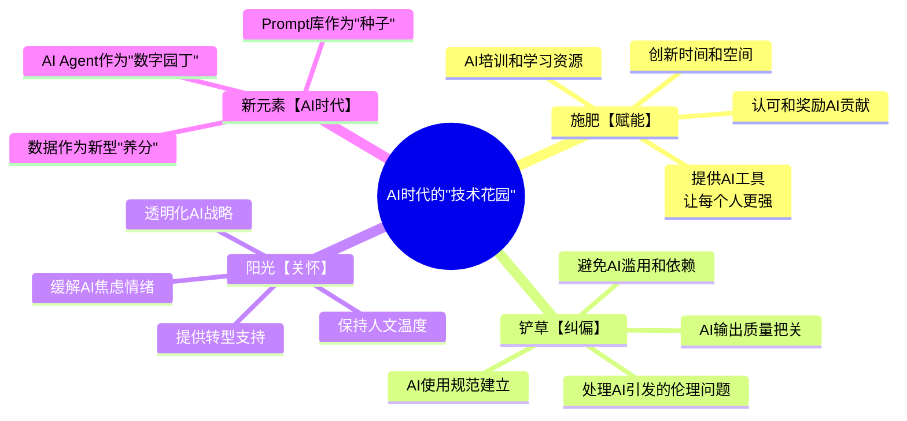
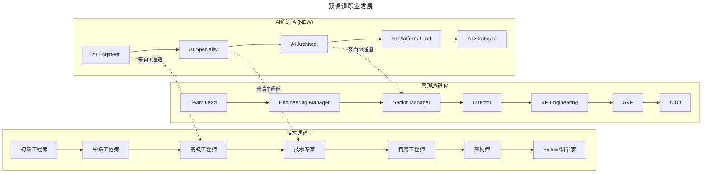

> **适用范围**：技术团队管理者、CTO、Engineering Manager、Tech Lead
> **更新摘要**：v2 版本基于 2018 年陈斌大咖对话原文，保留全部原始内容并升级为 6 节结构；融入 2026 年 AI-Augmented（AI 增强）时代注解，新增"花园隐喻"AI 新解、三通道职业发展模型、AI-Hackathon 设计方案及 150 人临界点再思考。

---

# 大咖对话 | 陈斌：如何打造高创造力、高动力的技术团队

## 一、导言

本周作客"大咖对话"的嘉宾是易宝支付 CTO 陈斌，曾任日立美国系统集成总监、Abacus 首席架构师、Nokia 美国首席工程师和 eBay 资深架构师等职位，拥有丰富的海外经历和架构经验。回国后加入易宝支付，领导公司技术团队，负责建设公司技术体系，对管理有自己独特的认知。今天我们主要聊了聊技术领导者如何带团队，以及技术人的职业通道。

> **⭐ 2026 年技术背景**：GPT-5.5 发布，DeepSeek V4 国产大模型崛起，84% 开发者已将 AI 编程作为日常工作方式，Agent（智能代理）进入加速落地期，人机协作成为新常态。陈斌老师 2018 年的管理智慧在 AI 时代不仅不过时，反而获得了新的内涵。

---

## 二、核心方法论

### 2.1 中外 IT 公司的差异

**极客时间：依您多年的海外工作经验来看，国内外的 IT 公司有哪些方面的差异？**

**陈斌**：我认为主要有两方面的差异。第一个方面是技术应用的差异，美国的 IT 公司更加注重对基础技术的投入和研发。比如 Android 系统，国内几乎所有的手机制造商都在用这个操作系统。再比如大数据领域的 Hadoop、Spark 等，都是源于美国的一些开源项目或者科技公司的自研项目。相比之下，国内的 IT 公司对基础技术的投入比例没那么多，但国内 IT 公司在技术的应用方面比美国做得更灵活。比如微信，它相当于整合了美国的 Facebook、Twitter 等诸多软件的技术，功能更丰富，能解决更多问题。

第二个方面是领导力的差异，美国公司更注重激发员工潜力，使员工在做事的时候主动发挥个人能力、个人影响力，国内公司则更多见于 KPI 的管控。我认为如何让工程师高高兴兴的来上班，自发努力的去工作，这是技术领导者要研究的一个重要课题，在这方面，国外就做得比较靠前。

#### 2026 年技术背景验证

| 陈斌 2018 年观点 | 2026 年 AI 时代现实 | 验证结果 |
|--------------|----------------|---------|
| "激发员工潜力优于 KPI 管控" | AI 时代创造力比执行力更稀缺 | ✅ 更加重要 |
| "对事不对人" | AI 时代更需要心理安全感来冒险创新 | ✅ 关键前提 |
| "双通道发展" | 新增 AI 相关通道（AI Specialist 等）| ✅ 需要扩展 |
| "150 人临界点" | 人机混合团队使管理复杂度上升 | ⚠️ 可能需要调整 |
| "CTO 主动跨一步" | AI 战略沟通成为新挑战 | ✅ 更加必要 |

### 2.2 对事不对人的管理理念

**极客时间：您回国后，管理理念会不会有所改变，谈谈您是如何管理团队的？**

**陈斌**：重新回到易宝集团后，随着团队规模的不断扩大，也遇到了各方面的问题，比如技术团队与非技术团队的配合问题，包括与产品部门、业务部门的配合问题等。

同时，在一些事情的处理方法上也有些不同。举个例子，如果一个系统由于员工操作不当出现了问题，有些公司可能会主张给员工记过、罚款。我非常不赞同这样的做法，为什么呢？因为这种做法是针对人，而不是针对事。正确的做法应该要对事不对人，因为我们的目的是要解决产品技术的不足，优化流程、优化管控系统等。做接近目标的事情远远比处分一个员工重要的多。

### 2.3 "花园隐喻"的管理哲学

另外，公司文化也很重要，作为 CTO，有些方面跟 CEO 是一样的，我们都对公司的企业文化建设有着不可推卸的责任。企业就像一个花园，里面长满了各种奇花异草，有好看的玫瑰，也有无用的烂草。作为领导者，该施肥的就给它施肥，该铲掉的就把它铲掉，这样花园中的植物才能生长的更好。同样，领导者的关怀就像阳光，应该多给员工鼓励，多拍拍肩膀，让小草成长得更快更茁壮。

更具体点讲，不同企业的规模大小不一，管理方式也应该根据企业自身的情况作出调整。团队人数一般以 150 人为临界点，对于 150 人以下的团队，CTO 可以施加个人影响力，通过沟通来解决大部分问题；而超过 150 人的团队，就需要更好的企业文化来推动，此时 CTO 必须具备 Leadership，是一个领导者，而不仅仅是管理者。

#### ⭐ 2026 升级解读：花园隐喻的 AI 时代新解

**陈斌原话**："企业就像一个花园...领导者该施肥的就给它施肥，该铲掉的就把它铲掉"

**2026 年的"AI-Augmented 花园"**：



上述思维导图展示了 AI 时代"技术花园"的四个维度：施肥（赋能）关注 AI 工具与培训资源供给；铲草（纠偏）聚焦 AI 使用规范与质量把关；阳光（关怀）强调缓解 AI 焦虑与提供转型支持；新元素则体现 AI Agent、数据与 Prompt 库带来的全新管理维度。

#### 2.3.1 从 KPI 管控到 AI-Augmented 激励 ⭐ 2026

**传统 KPI 的问题**（陈斌已指出）：
- 导致短视行为
- 抑制创新尝试
- 忽视过程质量

**2026 年 AI 增强的激励体系**：

| 维度 | 传统方式 | AI 时代优化 |
|-----|---------|----------|
| **目标设定** | 自上而下分解 OKR/KPI | +AI 辅助目标对齐、智能建议 |
| **过程跟踪** | 定期汇报/周报 | +AI 自动采集效能数据 |
| **反馈机制** | 季度/年度绩效面谈 | +AI 实时反馈 + 定性点评 |
| **激励方式** | 奖金/晋升 | +AI 创新奖、Prompt 贡献奖、Agent 优化奖 |

### 2.4 核心观点回顾

陈斌老师基于丰富的海内外管理经验，分享了**打造高创造力、高动力技术团队**的深度洞察：

- **核心观点 1：中外 IT 公司差异** — 美国重基础研发（Android、Hadoop、Spark），中国重应用创新（微信）；美国注重激发潜力，国内更多 KPI 管控；目标是让工程师"高高兴兴上班，自发努力工作"
- **核心观点 2：对事不对人的管理理念** — 反对员工出错就记过、罚款；倡导对事不对人，优化流程和系统；企业像花园，领导者要施肥（鼓励）、铲草（纠正）、给阳光（关怀）
- **核心观点 3：激发创造力的方法** — 创新 24 小时活动提供创新氛围；内部创业政策支持好想法独立成公司；双通道职业发展（技术通道 T1-T7 + 管理通道）
- **核心观点 4：150 人临界点** — 150 人以下靠个人影响力 + 沟通；150 人以上必须靠企业文化 + Leadership
- **核心观点 5：CTO 与 CEO 的沟通** — 相互理解与信任；相互尊重与默契；CTO 要主动跨一步

---

## 三、关键流程

### 3.1 激发创造力的方法

**极客时间：作为技术领导者，如何保证技术团队的创造力与动力？**

**陈斌**：互联网公司都提倡创新，比如在易宝集团，我们更加鼓励大家要有创新的意识，不要把创新当做一件高不可攀的事情。你可以做一些微创新，也可以做一些流程上的小改动，或者利用新技术做一些事情。

我们每年都会举办两次创新 24 小时活动，一般在周末把大家聚到一个地方，提供食宿。大家可以三五成群、集思广益去讨论、研究一些东西。在活动中，我们成功找到很多不错的创新，甚至有人做出了能够申请专利的产品，这其中关键的是企业给大家提供了一个创新的氛围。同时，我们也有内部创业的政策，如果员工有好的想法，公司可以提供创业条件，与员工一起创建新的公司。

#### 3.1.1 创新 24 小时的 AI 版 ⭐ 2026

**陈斌原做法**：周末聚在一起，集思广益做创新

**2026 年升级版——"AI-Hackathon 48 小时"**：

```
📋 AI-Hackathon 设计方案：

时间：周五晚 - 周日晚（48小时）
主题：围绕业务痛点，用AI寻找创新解决方案

Day 1 晚上：
├── 19:00 开场 + 主题发布（AI相关业务场景）
├── 20:00 组队（强制跨职能：产品+技术+AI）
└── 21:00 开始 brainstorm（AI辅助生成创意）

Day 2 全天：
├── 09:00-12:00 快速原型开发（AI辅助编码）
├── 14:00-18:00 功能完善 + Demo准备
├── 19:00 导师辅导（AI专家+业务专家）
└── 20:00 继续迭代

Day 3 上午：
├── 09:00-11:00 最终打磨
├── 14:00-17:00 Demo Day（全员参与）
└── 17:30 颁奖 + 庆祝

特色规则：
✅ 必须使用至少一种AI工具/Agent
✅ 产出物包含：Demo + 商业价值说明 + AI使用报告
✅ 评审维度：创新性(30%) + 可行性(30%) + AI应用质量(20%) + 商业价值(20%)
```

### 3.2 双通道职业发展

除了创新，要保证技术团队的创造力与动力，我们还要给员工打开上升的职业通道。在易宝，职业通道可以分为技术通道和管理通道两个方向。在技术通道，员工可以从 T1、T2、T3、T4……一直往上走，到 T7 时可能就是架构师。只要在技术方面不断积累经验、提升能力，就一定会得到公司认可，会有新的挑战，能一直做下去。否则每天都重复做同样的事情，员工就感觉不到自己的价值所在。

另一方面，如果员工在长期的实践中不断总结经验，甚至积累管理经验，我们也可以把他从技术通道转为管理通道。管理方面的知识比较通用，比如，前期可能是管理运维，那后面也可以管理监控或者测试等其他方面的工作。

另外，我们也鼓励员工主动思考。比如，自动化运维一直是我们追求的目标，越来越多的重复性手工工作被自动化取代，节省了大量的人力资源。但剩下的人不等于说失去价值了，我会希望他们做更深入的研究和分析工作，比如分析运维设备的使用率，如何把进一步提升其使用率等。这能给公司创造更多的价值。

#### 3.2.1 双通道职业发展的 AI 扩展 ⭐ 2026

**陈斌原模型**：T1-T7 技术通道 + 管理通道

**2026 年三通道模型**：



上述流程图展示了 2026 年升级后的三通道职业发展模型：技术通道（T1-T7）保持原有技术深度路径；管理通道（M1-M7）保持原有管理晋升路径；新增 AI 通道（A1-A5）作为第三条独立晋升路径，且与技术和通道存在交叉转岗机制，体现了 AI 时代对复合型人才的发展需求。

### 3.3 CTO 的职业规划与挑战

**极客时间：CTO 在各方面已经达到顶尖了，那他未来的职业规划是什么？**

**陈斌**：公司规模有大小之分，大公司的 CTO 和小公司的 CTO 所需的能力也有差别。真正优秀的 CTO 需要有很强的领导力、影响力、技术战略能力以及战略前瞻性。没有人敢跳出来自称是一名很合格的 CTO，大家都是在实践中不断总结经验，不断提高自己。包括我也是，对我们来讲，要学习的东西太多了。

首先是技术方面的挑战，因为不断有新的技术涌现，作为技术领导者，不能只要求团队的兄弟不断学习，自己却止步不前。对于各种新的技术与趋势，你也要不断的更新与学习。

其次是业务方面的挑战，技术领导者需要有很强的敏锐性，需要熟知你的业务，对于所处的行业、自己的产品以及当前业务的发展，都要有敏锐的分析力。所以 CTO 必须清楚，这个业务是赚是亏，在行业中处于怎样的竞争态势，你的产品有哪些特点与不足，等等。这些都需要不断学习，不断更新。

然后是领导能力的挑战，领导力是个人的性格魅力，加上后天培养形成的。领导力的培养并不是报一个班，教一教就能学会的。例如，怎么跟你的下属、上级以及周围的同学沟通，怎么去说服别人等。这些都有一定的技巧性，并不是通过学习理论就能搞定的。这就是领导的艺术。为什么领导力是一种艺术而不是技术呢？因为艺术是多元的、生动的，需要自己体会、自己摸索、自己掌控。所以即使已经成为 CTO，要学习的还有很多，学无止境。

还有一种情况是，很多 CTO，在一段时间之后，选择自己创业，转变为 CEO，这又是一个新的开始。

### 3.4 CTO 与 CEO 的沟通流程

讲到这里，我再多说一点，就是 CTO 与 CEO 的沟通难题，如果 CEO 有技术背景，那沟通起来还比较容易，但很多情况是，CEO 没有技术背景，他与 CTO 的思考方式不同，那作为 CTO，如何与 CEO 形成伙伴关系，共同推进公司业务，这是所有技术人都要面对的一个问题。

我的建议有两点，第一点是理解与信任，第二点是尊重与默契。

首先要做到相互理解、彼此信任，因为 CTO 与 CEO 各自承受的压力类型不同，要懂彼此其实很难。CEO 负担的是整个公司的存亡问题，包括如何应对激烈的竞争，如何在市场中分一杯羹等，而 CTO 考虑更多的是公司技术体系的搭建，保证系统的平稳运行等。所以，双方要互相理解各自的难处，同时，做到相互信任才能更好地沟通与协作。

其次，双方要互相尊重，有合作默契，比如 CEO 不要把 CTO 当成是"我请来打工的，你只要把活干好就好"，CTO 也不要有这样的想法"反正是给老板干活，公司死活是他的事，跟我没关系"。

在合作中，往往是先有信任，才有尊重。如果你觉得 CEO 信任你，那你就不会觉得他说的话是对你的不尊重，否则 CEO 说话直接点，CTO 就会受不了。相反也是这样的。所以，最关键的还是彼此间的信任与尊重。

其实 CEO 与 CTO 之间的沟通障碍是客观存在的，也是正常的，我们要清醒意识它的存在，更关键的是在这种时候，CTO 要主动向前走一步，跨越这个鸿沟。

---

## 四、工具与实战

### 4.1 打造 AI-Augmented 创造力的具体行动

#### 4.1.1 建立"AI 创新基金"（本月启动）

- 预算：占部门预算的 2-5%
- 用途：支持员工探索 AI 新应用（不要求立即有 ROI）
- 流程：提案→评审（轻量级）→试点→复盘

#### 4.1.2 举办首次 AI-Hackathon（本季度）

- 参考上文的活动设计方案
- 目标：产生 3-5 个可落地的 AI 创新想法
- 重点：让平时不用 AI 的同事也参与进来

#### 4.1.3 更新职业发展通道（本季度完成）

- 在现有双通道基础上增加 AI 专项通道
- 明确每个级别的 AI 能力要求
- 与 HR 沟通，确保薪酬体系匹配

### 4.2 改善 CTO-CEO 沟通的 AI 时代策略

#### 4.2.1 建立 AI 战略沟通机制

- 月度 AI 进展汇报（用业务语言，非技术语言）
- 季度 AI 投资回报分析（量化数据）
- 年度 AI 路线图对齐会

#### 4.2.2 主动"翻译"AI 价值

- 将 AI 项目转化为 CEO 关心的指标：效率提升、成本节约、收入增长
- 用案例说话：同行业 AI 成功故事
- 邀请 CEO 参加 AI 相关的行业会议或客户拜访

### 4.3 150 人临界点的 AI 时代再思考

**陈斌原观点**：150 人是临界点，以上需要靠文化

**2026 年的复杂性因素**：
- 人机混合团队使"人数"概念模糊（5 人+3 Agent = ？人）
- 远程协作 + AI 工具使物理边界弱化
- Agent 之间的"管理"不同于人类管理

**⭐ 2026 修正建议**：

| 团队类型 | 有效管理半径 | 关键成功因素 |
|---------|------------|-------------|
| 纯人类团队 | 10-15 人/管理者 | 沟通频率、信任关系 |
| 人机混合团队 | 8-12 人+Agent/管理者 | 任务分配机制、质量把控 |
| 分布式团队 | 8-10 人/管理者 | 工具协同、异步沟通 |
| Agent 密集型团队 | 5-8 人+多 Agent/管理者 | Agent 编排能力、监控体系 |

---

## 五、常见误区

### 5.1 KPI 管控的陷阱

陈斌老师指出，KPI 管控会导致：
- **短视行为**：为短期指标牺牲长期价值
- **抑制创新尝试**：害怕失败而不敢尝试新方法
- **忽视过程质量**：只关注结果数字而非过程质量

在 AI 时代，这一问题更加突出——当 AI 能快速产出代码时，单纯衡量代码行数等 KPI 已严重失真。

### 5.2 对人不对事的处罚文化

- **误区**：员工出错就记过、罚款
- **正确做法**：对事不对人，优化流程和系统
- **AI 时代延伸**：AI 出错时也不应归咎于使用者，而应审视 AI 工具选型和使用流程

### 5.3 忽视企业文化建设

- **误区**：只关注业务指标，忽视文化建设
- **正确做法**：CTO 对企业文化建设有不可推卸的责任
- **AI 时代延伸**：文化中需要加入 AI 使用规范和伦理意识

---

## 六、进阶延展

### 6.1 核心启示

> **"陈斌老师的'花园理论'在 AI 时代获得了新的内涵——技术领导者不仅是传统意义上的'园丁'（浇水施肥），更是'AI 生态设计师'（设计人机共生的环境）。核心不变的是：让每个个体（无论是人类还是 AI Agent）都能在合适的土壤中茁壮成长。"**

### 6.2 2026 年可执行建议汇总

**立即行动（本周内完成）**：
1. 评估团队当前 AI 成熟度，确定所处的"花园"阶段
2. 制定首个 AI-Hackathon 的执行计划

**中期规划（本季度完成）**：
3. 在现有双通道基础上设计 AI 专项通道
4. 建立月度 AI 战略汇报机制，改善 CTO-CEO 沟通

**长期愿景（本年度完成）**：
5. 将"花园隐喻"升级为 AI-Augmented 版本，融入团队管理实践
6. 重新评估 150 人临界点在人机混合团队中的适用性

### 6.3 延伸思考

- 技术领导者不仅是传统意义上的"园丁"（浇水施肥），更是"AI 生态设计师"（设计人机共生的环境）
- CTO 主动跨一步的理念在 AI 时代意味着主动将 AI 价值"翻译"为业务语言
- 150 人临界点在人机混合团队中可能需要下调，但管理复杂度反而上升

---

*本注解基于 2026 年 6 月的团队管理实践生成，是对陈斌老师 2018 年经验的致敬与延展。*