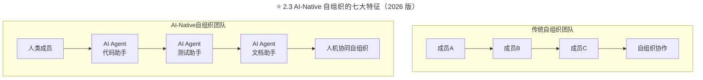
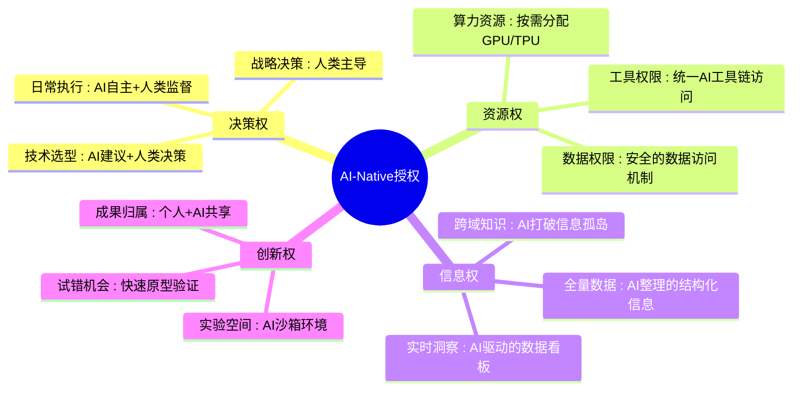
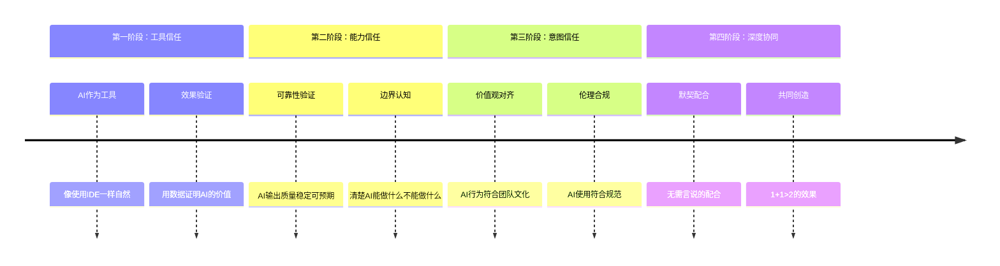

> **适用范围**：技术Leader、敏捷教练（Scrum Master）、工程经理、CTO
> **更新摘要**：v2 版本基于原文第 68 讲内容，保留全部原始内容并升级为 6 节结构；融入 2026 年 AI 时代注解，新增 AI-Native 自组织团队演进、人机协同自治模式、编排式领导力及人机信任建立机制。

---

# 第68讲 | 如何打造一个自组织团队？

## 一、导言

敏捷宣言的原则中提到，"最好的架构、需求和设计都出自自组织团队。"这带来几个问题：什么是自组织团队？我们为什么需要它？又该如何领导一个自组织团队呢？

> **⭐ 2026 年技术背景**：2026 年，GPT-5.5 和 DeepSeek V4 让 AI Agent 能力达到新高度，**84% 的开发者使用 AI 编程工具**。在这样的背景下，自组织团队的内涵需要从"人的自组织"进化为**"人+AI协同的自组织"**——AI Agent 成为团队的"虚拟成员"，与人类成员共同自组织、自管理、自进化。

---

## 二、核心方法论

### 2.1 什么是自组织团队

技术人是典型的知识工作者，他们需要解决全新的问题，需要具备较强的学习知识和创新知识的能力，他们的劳动兼具知识性、创造性、灵活性等多种特性。

因此，对技术人来说，通常只能管理目标，而不好以严格的操作规范来管理过程，同时，他们必须要自我管理，必须要有自主权。正如Scrum指南中说的，"自组织团队要自我决择如何最好地完成他们的工作，而不是由其他外部团队来决定。"

具体来说：

1. 给予自组织团队令人信服的使命，并为他们指定清晰的边界，与其他组织单位、资源达成一致。
2. 在一定的边界范围内设立团队自己的规则，并且确保所有人遵守。
3. 在这些边界内给予自组织团队自管理的权利，不需要定向控制和监督，由他们自己监控和管理自己的进度。
4. 可以给自组织团队安排一个目标，并查看他们的进展如何，不过你只需要在他们需要的时候提供帮助。
5. 自组织团队想要知道，并且知道项目和产品的所有内容，理解需求，不会害怕提问题或提出建议。
6. 自组织团队有主人翁意识和承诺意识，他们对自己的工作感到自豪，并承担相应的责任。
7. 自组织团队利用成员所有领域的专业知识，演化、调整并且能够解决广泛的任务。

### 2.2 为什么需要自组织团队

当今社会正经历着巨大的变迁，而这些变迁带来了新的挑战，可以说，我们正面临一个易变的、不确定的、复杂的、模糊的世界。

而一个组织要想成功，就必须充分利用这些变化带来的机遇，同时对危机有足够的准备。如此，管理者就不可避免地要去应对无穷无尽的不确定性、不可预测性和各种风险。

面对这样的情况，"业务敏捷性"成为必须，作为技术领导者，要充分利用手上的机会，要充分挖掘新的可能性，以逐步建立竞争优势。

而自组织团队是敏捷的一种体现，它比微观管理的团队更加高效地协同工作，团队成员接受新事物、学习新知识的能力更快，他们在工作中的动力和得到的乐趣也更大，因此，在人才极度宝贵的软件行业，自组织团队会带来更高的回报，传递更多的商业价值。

此外，自组织不仅是一种团队形式，更是一种管理手段。在此前已经固化的业务流程中，管理者必须自己一手设计出一个高绩效的团队。他必须有能力设定明确的目标，建立正确的决策模式，有效调配资源等。不少团队依旧遵循着这种管理模式和价值观。而在自组织的管理模式中：

1. 提倡自我控制的现代文化取代了旧式的命令和控制手段。
2. 专注于自我控制，是为了表达对知识型工作者的尊重，并充分利用他们能力的唯一途径。
3. 新型的面向关系网的领导方式，与面向层级的管理方式并存，目的是为了充分利用专家资源，并能够对环境变化作出快速响应。
4. 鼓励分散式的决策，同时，运用可视化管理了解全局、建立快速反馈通道、精心选择团队绩效指标，以使各个团队更加齐心，并激发他们内在的驱动力。

### ⭐ 2.3 AI-Native 自组织的七大特征（2026 版）

| # | 传统特征 | AI-Native特征 | 具体实践 |
|---|---------|---------------|---------|
| 1 | **人的使命** | **人机共同的使命** | 使命中包含AI的角色和价值定位 |
| 2 | **人制定的规则** | **人机协作的规则** | 规范AI使用的边界和行为准则 |
| 3 | **人的自管理** | **人机共治** | 人负责决策，AI负责执行和建议 |
| 4 | **人查看进展** | **AI辅助的智能跟踪** | AI自动收集数据、生成洞察报告 |
| 5 | **人了解内容** | **人+AI的全局视野** | AI提供跨领域知识整合和推荐 |
| 6 | **人的主人翁感** | **人机共同的责任感** | 明确人和AI的责任边界 |
| 7 | **人的专业协作** | **人机协同网络** | AI作为"虚拟团队成员"参与协作 |

上述流程图对比了传统自组织团队（人类成员之间的线性协作）与 AI-Native 自组织团队（人类成员与多个 AI Agent 协同形成的网络化协作），展示了 AI Agent 作为虚拟团队成员参与自组织的新形态。

---

## 三、关键流程

### 3.1 授权给团队

内外部各种因素都表明我们必须要改变我们组织的运营方式。为了变得更敏捷，我们必须把权力和权威交给更贴近客户的人，并充分授予他们信息，给他们时间思考、学习并改进。

要达到这些目的，唯一的办法就是授权给我们的团队，让他们竭尽所能，不仅仅是完成指派工作任务，而是要激发他们的创造力和自我驱动性，让他们自我决定、自我执行、自我监督、自我控制。这是一种自然而然的尊重，技术人，也就是知识型工作者，必须要有自主权。

另外，自组织团队不是一夜之间就能崛起的。自组织对赖以生存的土壤本身就有各种苛刻的要求，更不用说还时常被微观管理所妨碍，也受累于缺乏工作流程设计，所以想利用自组织流程，必须进行彻底的变革。

同时，团队的自组织过程是永远不会结束的。他们必须持续地、用感知和响应的方式调整需求和上下文来重组自己。换句话说，自组织团队是一个进行中的过程：每一次的设置更改，组织和团队就需要重复整个过程。

#### ⭐ AI-Native 授权升级

上述思维导图展示了 AI-Native 授权的四大维度：决策权（战略→选型→日常的分层授权）、资源权（算力/工具/数据的安全访问）、信息权（结构化信息/跨域知识/实时洞察）和创新权（实验空间/试错机会/成果归属），形成完整的人机授权体系。

### 3.2 允许自治

我们用足球队来打个比方，一旦比赛开始，一支足球队就是一个按着特有方式变化着的自组织单位。要成为一支成功的队伍，即赢得比赛，队员需要有互相帮助的意愿和能力。这需要多方面的技能：

1. 能够专业地理解和把握自己在团队中的具体角色（门将、后卫、中场、前锋），以及为了成为一个真正的团队，这一角色应该如何与其他角色进行配合。
2. 动作和控球技巧，比如跑、冲刺、拦截、弹跳，以及传接球、盘带、过人、射门等。
3. 战术，对整场比赛以及每次配合流程的理解，比如在不同情况下，每个球员必须决定是参与进攻还是留在后场进行防守，在正确的时候出现在正确的位置上。
4. 战略，能够具备对当前球场形式的大局观。能够阅读比赛的局势并采取相应的措施。无论球场上的形式变化是由队友还是对方球员触发的，都能够立即做出响应。

那教练的角色是什么呢？他是否控制着比赛？他是否操纵着他的团队？他是否监控着每个队员的活动？他是否真正参与其中？实际上，他的影响力是有限的。

无论教练是否足够大牌，哪怕他在教练区急得上蹿下跳，冲着关键球员发号指令，但他没有任何机会去控制球场上正在发生的一切。球队的成功只能靠场上队员的努力才能达成。

这是否意味着教练是多余的呢？当然不是，从一个系统的观点上看，教练对球队的组成、战术、训练计划、踢球风格等等产生着深远的影响。在比赛中，他能够换下一些队员，也能够利用中场休息时间对上半场进行反思并布置战术。

有趣的是，教练最主要的任务是观察，他们观察每一个球员自身的表现与球队的配合，以及和对手对抗的情况。此外，教练会根据观察结果提供专业的反馈。从某种程度上说，教练的主要作用是通过搭建提供积极反馈的回环，创建正确的意识。正如自组织团队中的领导者一样。

#### ⭐ AI-Native 自治模式

| 场景 | 传统做法 | AI-Native做法 |
|------|---------|---------------|
| 任务分解 | 人工拆解WBS | AI自动生成任务树 + 人工调整 |
| 进度跟踪 | 每日站会汇报 | AI实时采集数据 + 异常提醒 |
| Code Review | 人工审查PR | AI预审 + 人工复审关键逻辑 |
| 文档维护 | 专人负责 | AI自动生成 + 人工审核更新 |
| 问题排查 | 人工日志分析 | AI根因分析 + 人类确认 |

> **关键原则**：自治不等于放任。AI-Native自治的核心是：**明确边界 + 智能辅助 + 人类兜底**。

### 3.3 领导者角色：从教练到编排者

| 维度 | 教练式领导 | 编排式领导（Orchestrator） |
|------|-----------|--------------------------|
| **核心职责** | 指导个人成长 | **编排人机协作** |
| **关注点** | 团队成员状态 | **系统整体效能** |
| **决策方式** | 基于经验判断 | **数据驱动 + AI洞察** |
| **沟通方式** | 一对一交流 | **多渠道同步 + AI辅助** |
| **成功标准** | 团队绩效 | **人机协同价值最大化** |

---

## 四、工具与实战

### 4.1 建立人机信任机制

上述时间线展示了人机信任建立的四个阶段：工具信任（AI作为工具自然使用）、能力信任（验证可靠性并认知边界）、意图信任（价值观对齐与伦理合规）和深度协同（默契配合实现1+1>2），层层递进。

### 4.2 建立信任的具体措施

1. **从小事开始**：选择低风险场景试点（如代码补全、文档生成），让团队亲身体验AI的价值，及时分享成功案例。

2. **透明化过程**：公开AI的决策依据和推理过程，允许质疑和挑战AI的输出结果，记录并分享AI的失误和教训。

3. **建立纠错机制**：设定AI输出的质量标准，建立快速反馈和修正流程，定期评估和优化AI工具配置。

4. **持续学习和适应**：跟踪AI技术的最新发展，定期培训团队的新技能，根据实践调整人机协作模式。

### 4.3 AI-Native 自组织团队成熟度模型

| 等级 | 特征 | 关键指标 |
|------|------|---------|
| **Level 1: 初级** | 个别使用AI工具，缺乏系统性 | AI工具采用率<30% |
| **Level 2: 发展中** | 部分流程接入AI，开始尝到甜头 | AI工具采用率30-60%，效率提升20% |
| **Level 3: 成熟** | 全面使用AI，人机协作成为常态 | AI工具采用率60-90%，效率提升40% |
| **Level 4: 卓越** | AI深度融入，形成独特竞争力 | AI驱动创新占比≥50%，行业领先 |

---

## 五、常见误区

### 误区 1：自组织等于无管理

- **现象**：认为自组织团队不需要任何管理，放任团队自由行动
- **对策**：自组织需要清晰的使命、边界和规则，教练式领导依然重要

### 误区 2：忽视自组织的土壤要求

- **现象**：直接推行自组织，缺乏工作流程设计和文化基础
- **对策**：自组织对赖以生存的土壤有苛刻要求，必须进行彻底的变革

### 误区 3：微观管理妨碍自组织

- **现象**：名义上推行自组织，实际上仍在微观管理
- **对策**：真正授权，让团队自我决定、自我执行、自我监督、自我控制

### 误区 4：AI Agent 全权代理

- **现象**：认为 AI 可以完全自主决策，不需要人类监督
- **对策**：AI-Native自治的核心是明确边界 + 智能辅助 + 人类兜底

### 误区 5：忽视信任建设过程

- **现象**：期望团队立即接受 AI 协作，忽视信任建立的时间
- **对策**：从小事开始，透明化过程，建立纠错机制，持续学习适应

---

## 六、进阶延展

### 关键洞察：从"人的自组织"到"生态系统的自组织"

| 维度 | 传统视角 | AI-Native视角 |
|------|---------|---------------|
| **组织单元** | 人的团队 | **人+AI的生态系统** |
| **协作模式** | 人际协作 | **人机协同网络** |
| **能力来源** | 个人技能积累 | **人机能力互补** |
| **创新源泉** | 人的灵感 | **数据驱动+AI启发+人的判断** |
| **成功要素** | 团队凝聚力 | **系统设计能力+AI编排能力** |

### 结语

我们观察到，这个世界唯一不变的就是变化本身，所以我们需要"业务敏捷性"。而我们过去运作组织的方法已经过时了，那些由教练式领导者指引的自组织团队才是新运转体系的核心。而在这一组织形态下，权力下放和允许自治是让知识型员工重拾和保持工作热情的必要措施。

> **⭐ 2026 升级总结**：未来的自组织不是"去中心化的人的组织"，而是"人机协同的智能生态系统"；领导者的角色从"教练"升级为"编排者"（Orchestrator）。