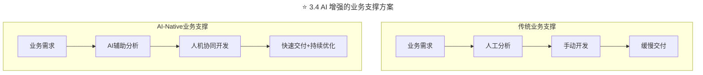
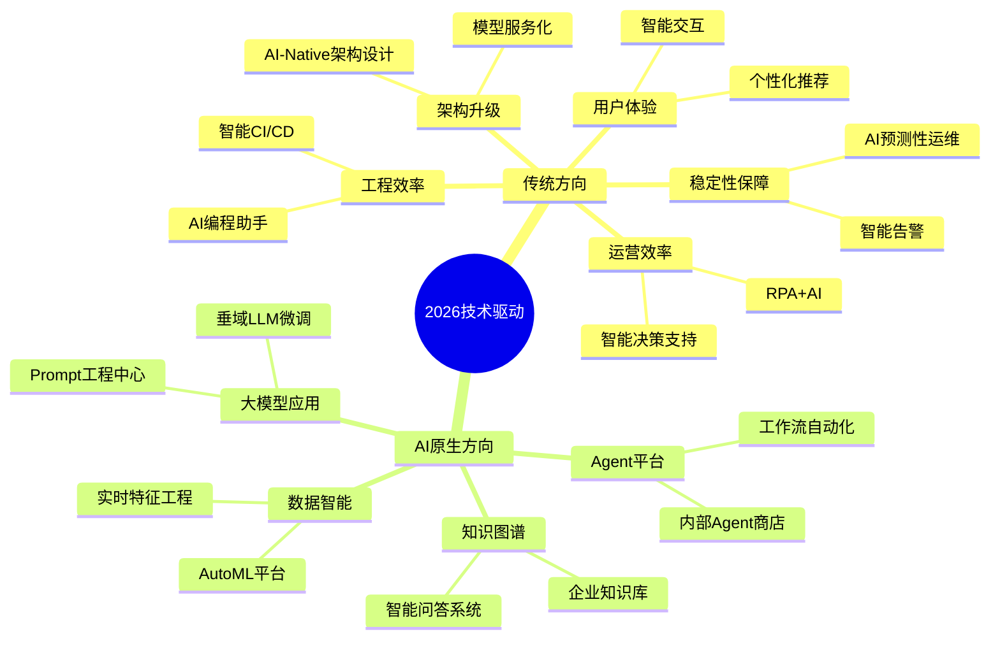
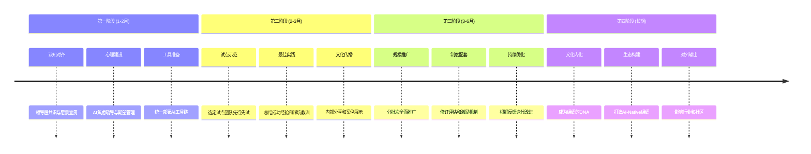

> **适用范围**：CTO、技术VP、研发总监、工程经理
> **更新摘要**：v2 版本基于原文第 66 讲内容，保留全部原始内容并升级为 6 节结构；融入 2026 年 AI 时代注解，新增 AI 增强业务支撑、AI 引领技术创新方向、AI-Native 文化培育路径及人机协同团队配置方法。

---

# 第66讲 | 如何打造有活力、持续创新的研发团队？

## 一、导言

运满满是一个车货匹配的货运调度平台，也提供很多增值服务，整个行业非常大，发展非常快，因此对技术和团队也提出了很高的要求。

在具体的执行中，我们花了大量的心血，从业务支撑、技术驱动、文化塑造和团队建设这四个方面出发，打造一个有活力的、持续创新的研发团队，以支持业务的快速发展。

> **⭐ 2026 年技术背景**：2026 年，GPT-5.5 和 DeepSeek V4 的发布让 AI Agent 能力达到新高度，**84% 的开发者使用 AI 编程工具**。在这样的背景下，打造有活力、持续创新的研发团队需要重新思考"人"与"AI"的协作模式——从"业务支撑方"进化为"创新引擎"。

---

## 二、核心方法论

### 2.1 四大支柱框架

打造有活力、持续创新的研发团队，从以下四个方面出发：

| 支柱 | 传统定位 | ⭐ AI-Native 定位 |
|------|---------|------------------|
| **业务支撑** | 按需交付 | **AI 增强的业务支撑** |
| **技术驱动** | 技术实现 | **AI 引领的技术创新** |
| **文化塑造** | 团队氛围 | **AI-Native 文化培育** |
| **团队建设** | 人员配置 | **人机协同团队配置** |

### 2.2 业务支撑的核心理念

快速发展已经成为互联网公司的一种共识，那么在快的情况下，怎么面对业务支撑？尤其是当业务多，团队人手不够，大家又想做技术驱动、平台升级的时候。

我们的做法是跟大家做了一个共创，把业务分成日常项目和重点项目。在互联网领域，所谓重点项目就是能影响市场抢占度，甚至影响公司成败的项目。因此，对于重点项目，我们有一个明确的要求，即0排期，让重点项目能够随时启动、快速上线，以雷霆之势赢得战略优势。

以运满满为例，我们是一家强运营公司，前线销售人员面对的情况多变，因此他们的KPI、运营方式、所需的数据支撑也一直在变，这就需要CRM系统也能跟上这种变化速度，给他们最大的支撑。

面对这种情况，我们就把CRM建设作为重点项目，高速迭代，在3个月内完成了58次发布，支持14个业务扩展了109个需求。

这是我们最根本的态度，重点业务一定要好好支撑掉，然后才会去做技术驱动。

### 2.3 技术驱动的五大方向

1. **架构升级**：包括服务化、中心化、中间件、平台化等
2. **工程效率**：包括动态化、配置化、工具化、自动化等
3. **稳定性**：通过系统保障系统
4. **用户体验**：包括性能/交互、可用性、新IO、安全特性等
5. **运营效率**：包括系统化、智能化等

### ⭐ 2.4 从"支撑业务"到"引领创新"

| 维度 | 2018年视角 | 2026年视角 |
|------|-----------|-----------|
| **团队定位** | 业务支撑方 | **业务创新引擎** |
| **核心能力** | 技术实现 | **问题定义 + AI协作** |
| **价值创造** | 按需交付 | **主动探索 + 价值放大** |
| **成功标准** | 项目按时交付 | **业务影响 × 技术领先** |
| **人才模型** | T型人才 | **π型人才（专业+AI+业务）** |

---

## 三、关键流程

### 3.1 保证业务支撑的流程

那在具体执行层面，如何保证业务支撑呢？毫无疑问，架构和技术是基础，但你会发现架构永远跟不上新业务的发展。这时，在平台化还没有实现、工具化还没有完善的情况下，我们就需要先靠项目管理和人员素质来解决这个问题。

首先，要理顺整个项目管理流程和节奏，我们有几个原则，包括早进入、并行化、反向推动、Deadline、公告等。

以并行化为例，在开始聊想法、MRD、运营计划的时候，核心产品经理、核心架构师、核心设计师要同步参与；在出商业计划的时候，基本的整体架构设计就应该已经完成了；在出产品PRD的时候，基本的概念设计就应该已经完成了；真正到开发的时候，测试用例和自动化测试脚本等就应该已经同步的完成了。尽量分解并行，以此来提高效率。

其次，要打造项目机动组织。举个例子，大家排期的时候经常会提到人员不够，我们的做法是对整个团队做一次大的封闭培训，要求大多数成员特别是高T的同学要非常熟悉每个系统，尤其是核心系统。这样，当某个系统模块比较紧急需要人手的时候，我就可以随时把其他系统的人调过去，尤其是高T的同学，他再带上两个研发的话，可以快速的把这个模块做起来。

对于一家较大规模的公司来说，人员肯定是不缺的，关键在于组织是否足够机动，能否做到员工兵力的机动调配，去支撑重点项目，尤其是脉冲型重点项目。

除了这两点，还需要其他项目管理原则、项目公约、项目同步机制等，通过共享的方式，让大家都能看到项目进度，都能参与进来，真正做好项目管理。

### 3.2 业务支撑遇到的问题及解决

在保证业务支撑的过程中，我们会遇到各种问题，最典型的有以下3种：

1. 过来的所有需求都说非常重要、非常紧急，但是拼完上线了，业务那边却不做数据反馈或者根本不用，团队这边也不知道效果到底怎么样。
2. 因为都是机动支撑，做完这个版本，也不知道下个版本做啥。
3. 团队也想给业务打枪造炮，但看不到业务蓝图、路线图和运营思路，感觉就像高级外包一样，完全没法和业务一起思考，一起做系统架构，导致没有成就感。

为了解决这些问题，我们和团队又完成一次共创，提出了一个概念，即由单纯只关心"技术指标"的"需求翻译机器"、"架构优化机器"，转变为从技术视角去推动平台业务发展的业务架构师。不断锻炼"寻找技术和业务完美结合点的敏锐嗅觉"，保持"跨界"的核心竞争力。这个概念最初是天猫架构负责人大少提出来的，当我们再次用在满满团队，发现也非常适用。

具体到执行层面，可以从以下几个方面出发：

1. **了解你的用户**：我们会让研发团队到前线去跟真正的用户接触，做前线业务同学、运营同学做的事情，听他们的声音。同时要重视用户的反馈，我们的做法是每两周会把所有在线用户的问题拿出来分享给整个团队，让他们去了解用户的需求。
2. **体验你的产品**：我们会强行要求每个同学都得用自己的产品，频率可以不高，比方说一两周一次，但一定要亲自去使用，同时要注意在使用的过程中提出问题。
3. **关注线上数据**：同样也是要求每个同学都关注线上数据，还会不定期抽查，比方说上线了一个新模块，那这个模块最近数据怎么样了？涨和跌的原因是什么？数据的变动又跟哪个项目有关系等。
4. **懂你的行业**：这方面我们也做了很多举措，比如汇集行业资讯，开展行业分享，引入行业专家等。通过这些方式，让大家了解这个行业究竟是怎么运转的，也真正了解业内司机的痛点。当我们足够了解对方的时候，大家才会带有情感和思考的做事。
5. **心中有一张大图**：即做每一个功能都要思考整个架构，思考业务的运营，而不是只做单点思考。同时，还要思考要实现这个功能，底层需要有哪些支撑等。

当每个研发人员脑袋里都有一张完整的大图，同时又很懂行业、懂用户，他的参与感就会很高，这些是我们经历过共创、碰撞后提出的硬性要求和做法，目前执行下来效果非常不错。

### 3.3 技术驱动的具体执行

#### 架构升级

架构升级对于整个研发的拉动作用是非常明显的，以大家都在做的服务化为例，拆分完之后，模块直接松耦合，可以独立发展和演变，团队也能快速扩张。像运满满一开始也是一个All In One的App，后来服务化拆分之后，团队就可以迅速打起来。

服务化做起来之后，一定要跟上中心化、平台化，底层一定要有一个很强大的中台做支撑，这样才能支持新业务的快速扩张，也能支持已有业务的快速变化。之后还可以去思考怎么在平台里去做业务监控、做数据分析等，慢慢会沉淀出很多中间件。

#### 工程效率

工程效率对业务会有比较直接的支撑，而我们做技术驱动的整体思路，就是把工程效率中的每条线、每个子模块，都去做动态化、配置化、工具化、自动化。

从发布到运维，从测试到自动化，我们大概做了六七十个系统来打造我们的工具体系。这样一个工具体系的打造，首先大家会有成就感，自己做出的工具有效的帮助自己提高了工作效率；其次这些事情都有一定的技术挑战和技术深度，让整体团队的技术氛围得以增强。

#### 稳定性

稳定性是研发不变的一个主题，当公司体量越来越大的时候，稳定性就越来越重要，可能一个功能宕机5分钟，就有几万通电话打进来。在稳定性上，除了形成很多固定的流程机制外，我们还通过系统来保证系统，包括测试/灰度、降级/容灾/回滚、监控告警等。

#### 用户体验

稳定性和工程效率是研发中两个基础的部分，能够在早期和中期很好的带动研发技术氛围，但最性感的还是用户体验。

用户体验是非常大的一个课题，需要长期的去监控、去治理。除了已有性能的不断优化外，我们还可以采用一些新技术来提升用户体验，比如当前很火的自然语言处理、人脸识别等。

以自然语言处理为例，它的知识图谱跟所处的行业有着密切的关系，比如我们就用它来做智能助手、智能客服，帮助司机解决使用问题，甚至帮助他们语音发货等。

这就是新技术跟行业、跟产品的结合点，而对技术团队来说，每一个结合点都是一个很好的技术驱动的方向。

#### 运营效率

每家公司不一样，运满满的运营基因很强大，大概有3000多名运营人员，所以怎么提高运营效率，怎么让他们更高效的获取用户、服务用户、拓展业务，也是我们的工作重点。

从这个维度出发，也能衍生出很多Topic，比如各个系统怎么去做自己的优化，通过系统化、智能化的手段大幅度提升运营效率。

### ⭐ 3.4 AI 增强的业务支撑方案

| 场景 | 传统方式 | AI-Native方式 | 效果提升 |
|------|---------|---------------|---------|
| 需求分析 | 人工梳理PRD | AI辅助需求拆解和优先级排序 | 效率提升60% |
| 原型开发 | 手写MVP代码 | AI生成80%样板代码 | 开发速度提升3-5倍 |
| 数据分析 | 手工SQL查询 | 自然语言转SQL + 智能洞察 | 分析效率提升10倍 |
| 用户反馈 | 人工整理分类 | AI情感分析和主题聚类 | 处理效率提升20倍 |

上述流程图对比了传统业务支撑（人工分析→手动开发→缓慢交付）与 AI-Native 业务支撑（AI辅助分析→人机协同开发→快速交付+持续优化）的流程差异，展示了 AI 如何在需求分析到交付的每个环节提供增强。

---

## 四、工具与实战

### ⭐ 4.1 AI-Native 技术驱动新方向

上述思维导图展示了 2026 年技术驱动的两大方向：传统方向的 AI 增强（架构升级、工程效率、稳定性、用户体验、运营效率）和 AI 原生方向（Agent平台、知识图谱、大模型应用、数据智能），形成完整的技术驱动布局。

### ⭐ 4.2 人机协同团队配置

| 角色 | 传统职责 | AI-Native职责 | 变化 |
|------|---------|---------------|------|
| 产品经理 | 需求分析、PRD编写 | **AI辅助需求分析、数据驱动决策** | 更聚焦战略和用户 |
| 设计师 | UI/UX设计 | **AI生成初稿 + 人工精修** | 效率提升，创意更聚焦 |
| 前端工程师 | 页面开发 | **AI生成组件 + 交互逻辑实现** | 从编码转向架构 |
| 后端工程师 | 服务端开发 | **AI生成CRUD + 核心逻辑实现** | 聚焦复杂业务逻辑 |
| 测试工程师 | 用例设计、执行 | **AI生成用例 + 探索性测试** | 聚焦质量策略 |
| 运维工程师 | 系统维护 | **AI监控 + 预测性维护** | 从救火转向防火 |
| **新增：AI工程师** | N/A | **Prompt工程、Agent开发、模型调优** | 团队的AI能力中心 |

> **关键洞察**：AI不是要替代某个角色，而是要让每个角色都**升级**。未来的团队不再是"人的集合"，而是**"人+AI协同网络"**。

### ⭐ 4.3 AI-Native 文化建设路径

上述时间线展示了 AI-Native 文化建设的四个阶段：认知对齐（1-2月，领导层共识+心理建设+工具准备）、试点示范（2-3月，选定试点+总结最佳实践）、规模推广（3-6月，分批推广+制度配套）和文化内化（长期，成为组织DNA+对外输出），形成完整的文化转型路线图。

### ⭐ 4.4 创新活力度量指标（AI 时代版）

| 维度 | 传统指标 | AI-Native指标 | 目标值 |
|------|---------|---------------|--------|
| **创新产出** | 专利数、论文数 | **AI创新项目数量** | 季度≥5个 |
| **技术影响力** | 开源贡献、技术分享 | **AI最佳实践输出** | 月度≥2篇 |
| **学习成长** | 培训时长、认证数 | **AI工具掌握度评分** | 平均≥4.0/5.0 |
| **协作效率** | 项目交付周期 | **人机协作效率指数** | 提升40%+ |
| **员工满意度** | 满意度调查 | **AI工作体验评分** | ≥4.5/5.0 |
| **业务价值** | 线上指标 | **AI驱动的业务增长占比** | ≥30% |

---

## 五、常见误区

### 误区 1：技术驱动脱离业务

- **现象**：技术团队追求新技术，但不与业务结合
- **对策**：重点业务一定要好好支撑，然后再做技术驱动，保持以业务为核心的技术文化

### 误区 2：人员不够就盲目扩招

- **现象**：每个系统模块都说缺人，拼命招人
- **对策**：打造项目机动组织，通过封闭培训让高T同学熟悉多个系统，实现机动调配

### 误区 3：研发人员只做"需求翻译机器"

- **现象**：团队看不到业务蓝图和运营思路，感觉像高级外包
- **对策**：让研发转型为业务架构师，了解用户、体验产品、关注数据、懂行业、心中有图

### 误区 4：AI 引入制造焦虑

- **现象**：员工担心被 AI 替代，对 AI 工具有抵触
- **对策**：建立 AI 心理建设机制，制定渐进式采用策略，从辅助性工具逐步过渡

### 误区 5：忽视员工成就感

- **现象**：只关注业务指标，忽视技术同学的成长需求
- **对策**：通过架构升级、工程效率等方向激发技术激情，让大家自驱动思考

---

## 六、进阶延展

### 关键洞察

我们期待的团队必然是充满活力创新，每个人都在贡献idea，尝试优化产品和系统，参与到业务创造以及技术改变商业的过程中来。

> **⭐ 2026 核心观点**：AI时代的研发团队应该从"业务支撑"进化为"创新引擎"，通过人机协同释放更大的创造力。

### 作者简介

王东，运满满CTO，资深技术专家与管理者，曾先后负责过10多条亿级用户的产品研发管理工作，历任天猫高级技术专家、360高级总监、百度主任架构师，有过两次创业经验。