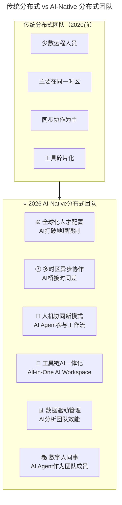
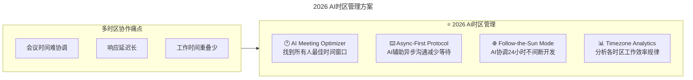
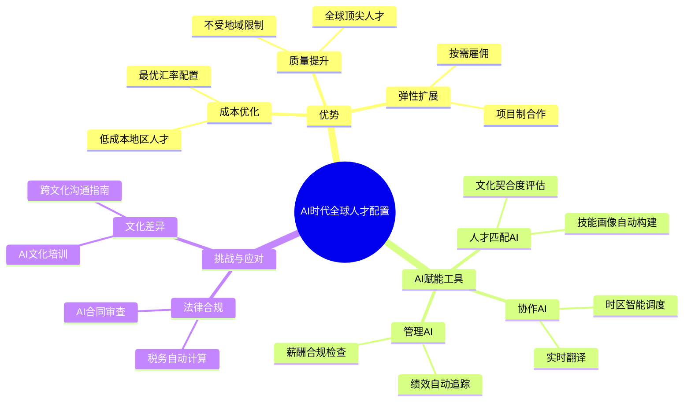

> **适用范围**：分布式团队管理者、远程办公负责人、CTO、工程经理
> **更新摘要**：v2 版本基于原文第 65 讲内容，保留全部原始内容并升级为 6 节结构；融入 2026 年 AI 时代注解，新增 AI-Native 分布式团队新常态、AI 社交增强工具箱、AI 项目管理工具栈及分布式团队 AI 成熟度自评模型。

---

# 第65讲 | 如何打造高效的分布式团队？

## 一、导言

在如今全球化趋势下，因为业务需要或人才竞争，许多互联网公司都建立了远程团队或者说分布式团队。但分布式团队在日常工作中确实会面临许多问题，需要付出更多的努力来克服距离带来的内在挑战。

> **⭐ 2026 年关键背景**：2026 年，**超过 60% 的技术团队采用混合或全远程模式**，AI 工具使得分布式协作效率首次超越（或持平）现场办公。未来的竞争不是"分布式 vs 集中式"，而是"谁的分布式团队 AI 工具链更完善、协作效率更高"。

### 传统分布式 vs AI-Native 分布式



上述流程图对比了传统分布式团队与 AI-Native 分布式团队的六大差异：AI 时代分布式团队在人才配置、时区协作、人机协同、工具链、数据管理和数字人同事六个方面实现了质的飞跃。

---

## 二、核心方法论

### 2.1 三大核心挑战概述

打造高效的分布式团队主要面临三大挑战：
1. **如何增加分布式团队之间的熟悉度和亲密感**
2. **如何做好分布式团队的项目管理**
3. **如何解决沟通协作问题**

### 2.2 挑战一：增加熟悉度和亲密感

Doximity 工程部门副总裁 Bruno Miranda 表示，和队友尽快建立个人联系非常重要。我们会要求新员工至少第一周要来办公室，和总部的团队见面，一起吃午餐，最重要的是和他们的导师建立个人联系。我们也鼓励远程员工不时地来办公室，这样的线下碰面对各自的团队都是有益的。

另外，我们每个季度都会抽出几天时间把团队成员聚在一起，回顾之前的工作，分享经验教训，提前规划下季度的工作等。这样每季度一次的聚会也让我们有时间进行面对面的团队建设，如滑雪、骑马等，高质量的休闲时光，也强化了同事之间的个人联系。

除了面对面的团建外，我们也鼓励各地的员工在线上围绕感兴趣的话题进行即时交流。话题可以非常宽泛，从滑雪到游戏再到音乐都可以。这类对话通常是和业务不相干的，只是提供一个非正式的讨论媒介，让人们有个地方可以增进个人关系。其作用有点类似于公司里的茶水间，为人们增进关系提供了一个舒适的地方。

Passive Management 公司创始人 Janis Janovskis 表示，关键是要强调沟通的重要性，鼓励人们将他们当前的状态分享给他人，例如他们是感觉受挫、焦虑或是快乐等等；也要鼓励团队成员将他们的状态变化告知其他人，例如他们是打算去吃午餐或是去倒杯咖啡。在办公室中，彼此能看到的一切状态都是透明的，但对于远程团队来说，就必须通过一些沟通协作工具分享自己的状态，来保证成员间的亲密感。

另外可以增加虚拟的线上聚会，比如视频会议，但尽量不要为了某些平淡的话题而进行视频会议，而是要仔细挑选主题，比如让团队中的某人为某个有趣的话题准备 10-20 分钟的演讲。甚至可以选择一些主题让成员轮流演讲，给团队中的每个人都有发挥的机会。

#### ⭐ 2026 AI 社交增强

| 传统做法 | ⭐2026 AI 增强 |
|---------|--------------|
| 每季度线下聚会 | **+ AI 策划个性化团建方案（基于成员兴趣）** |
| 非正式在线聊天 | **+ AI 匹配聊天话题、破冰游戏推荐** |
| 状态分享 | **+ AI 生成每日状态摘要、情绪健康提醒** |
| 视频会议 | **+ AI 实时翻译（跨国团队）、会议纪要自动生成** |

### 2.3 挑战二：做好分布式团队的项目管理

Bridge Global 创始人 Hugo Messer 表示，前提是要让分布式团队的成员都清楚他们正在执行的项目。然而在现实中，我们会发现很多远程团队对他们正在搭建的产品完全不了解。对此，我们可以问自己和团队成员以下几个问题：

1. 是否位于所有地方的团队成员都了解业务层面的产品愿景和项目情况？
2. 是否每个人对产品的定义都相同？
3. 是否所有团队成员都参与到了制定产品愿景、创造项目路线图和 backlog 细化研讨会中？
4. 产品愿景和项目路线图是否对身处各地的所有团队成员都可见？
5. 是否所有团队成员都直接与业务相关者和用户紧密合作？

作为管理者，我们可以通过各种项目管理工具、协作工具将产品内容和项目进度与分布式团队成员共享，更要有意识的让他们了解更多有关项目和产品的信息。

敏捷专家 Tanya Kumari 则表示，要制定一个连接各团队的项目路线图。分布式团队意味着成员所处的空间甚至是时间不同，这让计划变成了一项挑战，因为你无法像了解身边的团队那样了解一个远程团队。

因此，我们需要制定一个项目路线图来传达行动计划，不管团队成员身处何方，都可以通过这个路线图来了解项目或产品是如何随着时间推进、演化的。在这种情况下，类似滚动计划这样的方法就可能更有效，对于时间上比较近的事情就详细地计划，而时间上比较远的事情就做大概的规划。

Kumari 还表示要打造有意义的自动化。当项目时间比较长，或者需要管理远程团队时，创建一套自动化流程就特别有价值。以奥迪为例，奥迪在全世界雇用了数以千计的工程师、设计师、软件开发人员和 QA 团队，办公室遍布全球，但它的研发中心（R&D）都在德国。2007 年，他们开始用 Jira 跟踪问题，并用 Confluence 管理知识，如今，这两个工具被用来支持所有的团队和项目。

---

## 三、关键流程

### 3.1 挑战三：解决沟通协作问题

如今，技术不断发展，视频会议、屏幕共享以及异步通信的广泛应用帮助我们实现了这种便利的工作环境。Bruno Miranda 表示，他们在测试了六种解决方案后，最终选择了一套自己觉得效果最好的技术。

1. **视频会议**：我们的会议室中都配备了 ChromeBox、会议系统和一个大型的壁挂电视。ChromeBox 直接集成了谷歌日历，让参与会议变得轻而易举。
2. **异步聊天**：市面上有不少聊天工具，我们选择的是 Slack，因为它提供了我们需要的集成，可以把工作统一到一个平台上，包括来自 DevOps 栈的警示讯号、日历提醒、自动回复等。
3. **屏幕共享**：在促成分布式沟通方面，屏幕共享无疑是其中一项比较显著的技术改进。不管我们是在帮助同事解决一个配置问题，还是结对编写一段比较难的代码，亦或是仅仅共享一个幻灯片，可以快速共享屏幕的能力会让整个过程变得更愉快。
4. **语音呼叫**：异步的文本聊天很有效，但对于沟通来说，文字并非最有效、最直接的方式。Slack 让我们有能力从文本聊天快速、无缝地转到语音呼叫，再到屏幕共享，再到视频。

除了以上提到的这些，市面上有很多不同的沟通协作工具和技术，包括国内的 Tower、Teambition、明道、钉钉等，大家可以在尝试后，根据自己公司或团队的业务特性选择最适合自己的沟通协作方式。

### 3.2 ⭐ 2026 沟通协作的 AI 革命性变革

| 沟通类型 | 传统方式 | ⭐2026 AI 增强方式 | 效率提升 |
|---------|---------|------------------|---------|
| **异步文字** | Slack/邮件 | **+ AI 摘要、自动分类、智能回复建议** | 3x |
| **视频会议** | Zoom/Meet | **+ 实时翻译、自动纪要、发言者识别** | 2x |
| **代码评审** | GitHub PR | **+ AI Code Review、自动检测问题** | 5x |
| **一对一面谈** | 线上视频 | **+ AI 生成议程、谈话要点提取、跟进建议** | 2x |
| **技术分享** | 线上 PPT | **+ AI 辅助生成幻灯片、实时 Q&A** | 3x |

### 3.3 时区管理的 AI 优化



上述流程图展示了 AI 时区管理的四个解决方案：AI 会议优化器、异步优先协议、Follow-the-Sun 模式和时区分析，分别解决会议协调、响应延迟和工作时间重叠三大痛点。

---

## 四、工具与实战

### 4.1 ⭐ 2026 分布式团队 AI 项目管理工具栈

| 类别 | 传统工具 | ⭐2026 AI 增强版 |
|-----|---------|---------------|
| **任务跟踪** | Jira, Trello | **+ Jira AI, Linear AI（智能优先级、自动拆解）** |
| **文档协作** | Confluence, Notion | **+ Notion AI, Coda AI（自动总结、问答）** |
| **代码协作** | GitHub, GitLab | **+ GitHub Copilot, AI Code Review** |
| **沟通协作** | Slack, Teams | **+ Slack AI, Teams AI（智能摘要、行动项提取）** |
| **视频会议** | Zoom, Google Meet | **+ Zoom AI, Meet AI（转录、翻译、纪要）** |
| **知识管理** | Wiki, 内网 | **+ AI Knowledge Base（语义搜索、智能推荐）** |

### 4.2 异步协作最佳实践（AI 增强版）

**AI 驱动的"Handoff Protocol"**：

```
工作交接 AI Checklist:
✅ 当前状态总结（AI 从代码/文档自动生成）
✅ 待办事项列表（AI 从 Issue 追踪器提取）
✅ 关键决策记录（AI 从聊天记录提取）
✅ 风险点提示（AI 基于历史数据预警）
✅ 下一步建议（AI 推荐）
```

### 4.3 全球人才库的 AI 赋能



上述思维导图展示了 AI 时代全球人才配置的三大维度：优势（成本、质量、弹性）、AI 赋能工具（匹配、协作、管理）和挑战应对（法律合规、文化差异）。

---

## 五、常见误区

### 误区 1：忽视异步沟通规范
- **现象**：分布式团队没有明确的异步沟通 SOP，导致信息混乱
- **对策**：建立 Async-First Protocol，用 AI 辅助规范执行

### 误区 2：工具碎片化
- **现象**：使用过多不同的工具，导致信息孤岛
- **对策**：选择 AI 一体化工具链，减少工具切换成本

### 误区 3：忽视文化差异
- **现象**：跨国团队忽视文化差异，导致误解和冲突
- **对策**：使用 AI 文化桥接工具，提供跨文化沟通指南

### 误区 4：过度监控
- **现象**：管理者担心远程效率，过度监控员工
- **对策**：以结果为导向，用 AI 数据分析替代微观管理

---

## 六、进阶延展

### 结语

打造一个高效的分布式团队存在一定的成本和学习曲线，但业务需要和人才竞争让分布式团队变得越来越普遍，因此，对于技术管理者来说，如何不断改进流程，建立高效的分布式环境，让信任、协作和创造性流行起来，已经成为管理中的必修课。

### ⭐ 分布式团队 AI 成熟度自评

| 维度 | Level 1（初级） | Level 2（中级） | Level 3（高级） | Level 4（专家） |
|-----|----------------|----------------|----------------|----------------|
| **沟通工具** | 基础 Slack/Zoom | + AI 摘要功能 | + 全套 AI 工具链 | + 自建 AI 平台 |
| **项目管理** | Jira 手动管理 | + AI 优先级建议 | + AI 全自动流转 | + AI 预测性管理 |
| **文档协作** | Confluence 静态文档 | + AI 搜索/问答 | + AI 自动维护 | + AI 知识图谱 |
| **异步协议** | 无规范 | 有基本 SOP | AI 辅助执行 | AI 驱动优化 |
| **时区管理** | 手动协调 | 共享日历 | AI 最优时间推荐 | AI Follow-the-Sun |
| **文化建设** | 偶尔线上团建 | 定期虚拟活动 | AI 策划个性化活动 | AI 驱动的社区运营 |

### ⭐ 分布式团队 AI 工具包推荐（按团队规模）

| 团队规模 | 必备 AI 工具 | 月成本估算（总） |
|---------|-----------|----------------|
| **<10 人** | ChatGPT Plus, Copilot, Notion AI, Slack Free | $200-500 |
| **10-50 人** | + Linear AI, Zoom AI, Loom AI | $500-2000 |
| **50-200 人** | + 企业版全套, 自建 AI 知识库 | $2000-10000 |
| **200+ 人** | + 自研 AI 平台, AI Training 预算 | $10000+/月 |

> **⭐ 关键洞察**：原文的核心观点——"分布式团队存在成本和学习曲线，但已成为必然趋势"——在 AI 时代得到了根本性的强化。过去的痛点（沟通效率低、信息不对称、文化隔阂）已被 AI 解决了大部分，分布式团队的优势（全球人才、成本优化、弹性工作）被充分释放。