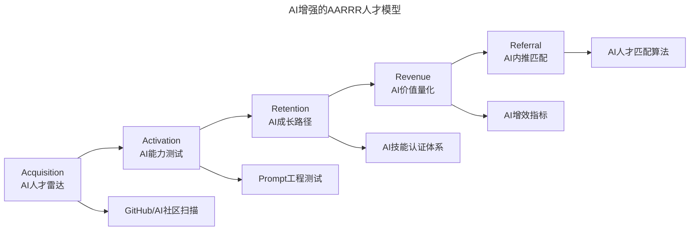
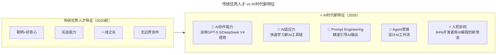
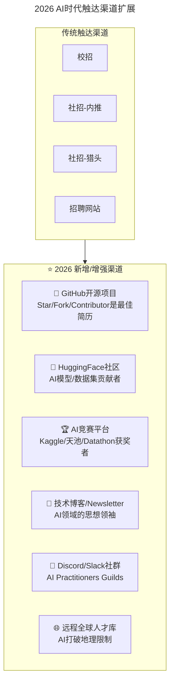
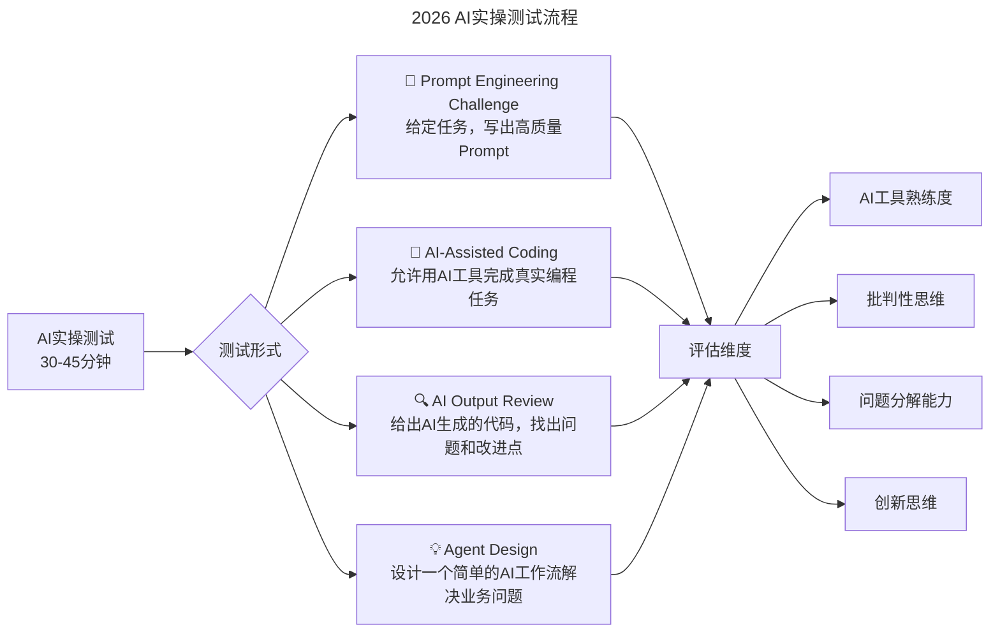

> **适用范围**：CTO、技术招聘负责人、HRBP、工程经理
> **更新摘要**：v2 版本基于原文（含四篇系列文章）完整内容，保留全部原始内容并升级为 6 节结构；融入 2026 年 AI 时代注解，新增 AI 增强的 AARRR 人才模型、AI 时代人才画像升级、AI 面试实操测试及 AI 时代留存/价值/推荐策略。

---

# 第102讲 | 姚从磊：巧用AARRR模型，吸引优秀技术人才

## 一、导言

这十年间，作为技术线和业务线负责人，先后面试过的技术人员超过两千人，读过的简历更是数以万计。在这个过程中，经常会为吸引到顶尖的技术人才而感到欣喜，更为错过优秀的技术人才而感到惋惜。

欣喜和惋惜之余，逐渐发现吸引优秀技术人才这件事儿，跟研发运营一款成功的产品有着相通之处；并且，产品研发运营过程中的成熟方法论，可以直接拿来提升吸引优秀技术人才的成功率，AARRR 模型就是其中之一。

> **⭐ 2026 年关键背景**：Stack Overflow 开发者调查 2025 显示，**84% 的开发者已经使用或计划在日常工作中使用 AI 编程工具**。这意味着"不会用 AI"的技术人才正在被快速边缘化，AARRR 模型在 AI 时代不仅没有过时，反而更加重要——系统化的人才运营方法论比以往任何时候都更有价值。

---

## 二、核心方法论

### 2.1 何为 AARRR 模型

AARRR 模型是一个经典的用户生命周期分析模型，在互联网产品研发运营中被频繁使用。在这个模型中，一个产品的用户生命周期分为五个阶段：

1. Acquisition：获取用户阶段，通过各种免费和付费的方式获取大量用户
2. Activation：产品互动阶段，在用户初次体验产品的时候，最大程度让用户感受产品的核心价值
3. Retention：用户留存阶段，用户被产品功能吸引，频繁使用产品
4. Revenue：获取收入阶段，利用广告、收费等模式，将用户流量转化为商业收入
5. Referral：口碑传播阶段，用户认为产品足够好，主动向周围的人介绍

AARRR 模型也是一个漏斗转化模型，可以用来验证产品的价值，并指导产品的研发和运营行为。

### 2.2 吸引优秀技术人才的 AARRR 模型

借鉴产品研发和运营的 AARRR 模型，我们可以得到吸引优秀技术人才的 AARRR 模型：



上述流程图展示了 AI 增强的 AARRR 人才模型：Acquisition 阶段引入 AI 人才雷达扫描开源社区，Activation 阶段增加 Prompt 工程测试，Retention 阶段建立 AI 技能认证体系，Revenue 阶段量化 AI 增效指标，Referral 阶段使用 AI 人才匹配算法。

### 2.3 目标用户画像——何为优秀的技术人才

宁要一位优秀的技术人才，也不要 100 位平庸的工程师。一位优秀技术人才的贡献，要超过至少 100 位平庸的工程师。

**首先，「聪明和好奇心」会是一个基本特征。** 聪明意味着学习能力强，成长速度快；好奇心意味着探索精神强，对未知事物有强烈的求知欲。

**第二，「实战能力」会是重中之重。** 过去的面试中，我经常遇到聪明且好奇心强的人，开始聊的时候会非常开心。一旦抛出一个实际的问题，不少人会很快提出一个大体方案，但当尝试细化到可执行层面时，往往就不太顺利了。

**第三，「一技之长」会是非常关键的因素。** 所谓一技之长，指的是在一个技术领域有一定的技术深度和积累。

**共性的最后一点，我认为是「无边界」的特质。** 没有一个人是可以脱离团队而独自达成高难度目标的，在团队合作中，如果成员可以做到「无边界」，乐于承担更多，乐于帮助团队内外的同事，这样的团队往往无往不利。

#### ⭐ 2026 人才画像的 AI 时代演进



上述流程图对比了传统优秀人才与 AI 时代新特征的差异：在传统四项特征基础上，AI 时代新增了 AI 协作能力、AI 适应力、Prompt Engineering、Agent 思维和人机协同五项新特征。

### 2.4 目标用户痛点

优秀技术人才的痛点往往共性更多，差异更少。最基本的痛点有二，一为「成长」，二为「成就感」。

#### 成长痛点的三大支撑条件

1. **牛人环境**：如果周围的人都比自己要强，耳濡目染下，自己也会有不错的成长
2. **成长路径**：清晰可执行的「成长路径」让技术人才时刻对照现状，及时发现问题并改正
3. **技术氛围**：团队有没有好的技术氛围，有没有好的技术导师及时解答问题，有没有高水平的技术分享

#### 成就感痛点的三大来源

1. **业务增长成就感**：贡献真正对业务增长提供了支撑甚至决定性的作用
2. **技术提升成就感**：通过技术职级晋升的方式对提升进行肯定，提供高质量的技术分享机会
3. **现实收益成就感**：多劳多得，能力越强得到的也应该越多

---

## 三、关键流程

### 3.1 Acquisition — 如何触达更多的技术人才

#### 定位

在开始行动触达技术人才之前，需要想清楚两个问题：一是公司的定位，二是职位的定位。公司的定位，其实就是期望能够占领用户/客户心智的唯一标签。职位的定位，不仅包含传统 JD 中的职位职责和职位要求，更应该说清楚职位的独特技术挑战和发展机会。

#### 渠道

吸引目标技术人才的渠道，无外乎校招和社招两类。

**校招**：合格的校招，要准确定位目标人才在哪里。一类方式是通过老师、社团和师兄师姐来触达；另一种方式是通过在学校教授公开课；除此之外，优质的实习生项目也是一类重要的方式。

**社招**：一是「自己动手，丰衣足食」，内部推荐是最重要的渠道；二是「借助外部，广泛撒网」，猎头渠道需要重点投入，但不能产生依赖。

#### ⭐ 2026 Acquisition 渠道 AI 时代扩展



上述流程图展示了 AI 时代触达渠道的扩展：在传统校招和社招渠道基础上，新增了 GitHub 开源、HuggingFace 社区、AI 竞赛平台、技术博客、Discord 社群和远程全球人才库六大新渠道。

### 3.2 Activation — 如何促成优秀人才顺利入职

#### 面试阶段

面试是一个双向选择的过程。好的面试，需要在两个方面做好功课。

**面试邀约**：面试邀约的原则是，一切以目标人才为主。需要提供足够多且客观的材料，供目标人才判断是否接受面试。同时，一定要同目标人才有直接的沟通，避免线上纯文字的沟通方式。

**现场面试**：现场面试有两个重点，简单高效的面试流程，和科学的评价体系。在面试流程的设计和执行上，任何环节都同等重要。科学的评价体系，首先要坚持目标人才能力高于团队平均水平的原则。

**Offer 阶段**：Offer 谈判的基本原则是足够自信和真诚。在 offer 的设计上要有足够的诚意；要让目标人才清晰地理解公司设计 offer 的原则；对于核心岗位的目标人才，要保持足够高的灵活性。

**入职等待阶段**：入职等待阶段的原则，是让目标人才持续得到来自公司的信息。要保持足够频繁的沟通，也可以邀请他/她参加公司的特殊活动。

#### ⭐ 2026 新增面试环节：AI 实操测试



上述流程图展示了 2026 年新增的 AI 实操测试流程：包含 Prompt Engineering 挑战、AI 辅助编程、AI 输出审查和 Agent 设计四种测试形式，评估候选人的 AI 工具熟练度、批判性思维、问题分解能力和创新思维四个维度。

### 3.3 Retention — 如何提高技术人才对公司的认同感

#### 兑现承诺

Offer 阶段的所有承诺需要清清楚楚地书面确认，并且在入职后需要按照约定按时兑现，不能有半点折扣，这是同人才建立信任的前提。

#### 四个关键阶段管理

1. **破冰阶段（1-2 周）**：尽可能创造机会，让人才在公司各团队中认识足够多的人，初步感受公司的文化
2. **融入阶段（试用期）**：mentor 需要发挥关键作用，帮助人才熟悉团队、公司技术栈和研发过程
3. **成熟阶段**：最重要的事情就是如何通过日常工作，使得人才收获足够强的「成就感」
4. **波动阶段**：有统计数据表明，员工入职后的一些关键时间节点（例如三个月和两年）是离职高发期

#### ⭐ 2026 Retention 的 AI 时代策略

| 阶段 | 传统做法 | ⭐2026 AI 增强 |
|------|---------|--------------|
| 破冰 | 团建活动、自我介绍 | **AI-assisted Icebreaker：用 AI 生成个性化的"新人档案"，匹配兴趣相投的同事** |
| 融入 | mentor 带教 | **AI-Mentor 加速融入：24/7 问答 + 个性化学习路径 + 人类 Mentor 双轨制** |
| 成熟 | 职级晋升 | **AI 成就感引擎：实时追踪 AI 增效数据，可视化个人 AI 贡献** |
| 波动 | 定期沟通 | **AI 预警波动：分析工作模式变化，提前识别离职风险** |

### 3.4 Revenue — 如何使技术人才更好实现价值

技术人才实现价值有两种模式。被动模式的特点是「干自己的活，拿应得的钱，公司好坏与我无关」。主动模式的特点是每位技术人才都肩扛具体业务目标，在具体工作中有足够大的权限和自由度，自身乐于承担更多。

#### ⭐ 2026 价值实现的三大模式

| 模式 | 描述 | 适用场景 | AI 增效倍数 |
|-----|------|---------|-----------|
| **AI-Augmented** | 用 AI 增强现有工作 | 大多数岗位 | 2-3x |
| **AI-Automated** | 用 AI 自动化重复工作 | 运维、测试、文档 | 5-10x |
| **AI-Innovated** | 创造全新的 AI 产品/服务 | 产品、算法团队 | 10-100x |

> **管理者任务**：帮助每个团队成员找到适合自己的 AI 价值实现模式，并为之创造条件。

### 3.5 Referral — 如何使优秀人才积极推荐朋友入职

一方面，可以通过长期运营精心设计的内推项目，使得优秀人才在推荐优秀朋友加入的同时，可以有令人惊喜的收益。另一方面，可以通过 Hack Day、Family Day 和高水平技术沙龙这样的社交活动，邀请优秀技术人才的家人朋友参与到活动中来。

#### ⭐ 2026 Referral 的 AI 时代社交裂变

| 激励类型 | 传统 | ⭐2026 AI 时代 |
|---------|------|--------------|
| **现金奖励** | 3000-10000 元 | **+ AI 工具包一年使用权** |
| **特殊奖励** | iPhone、旅游 | **+ 最新 AI 硬件（Apple Vision Pro、GPU 服务器 access）** |
| **荣誉激励** | 年度内推王 | **+ AI Influencer 认证** |
| **体验奖励** | 参加大会 | **+ AI Conference VIP（NeurIPS、ICML 特邀）** |

---

## 四、工具与实战

### 4.1 ✅ Acquisition 行动清单

1. **建立 AI 人才雷达**：定期扫描 GitHub Trending、HuggingFace Popular Models，关注 Kaggle Competition 排行榜
2. **打造 AI 雇主品牌**：在公司官网展示 AI 项目案例，在技术博客发布 AI 实践文章
3. **优化招聘漏斗的 AI 转化**：AI 初筛后快速决策

### 4.2 ✅ Activation 行动清单

1. **面试官 AI 培训**：确保所有面试官了解 AI 时代人才标准
2. **准备 AI 测试题库**：覆盖不同岗位、不同难度
3. **设计 AI Welcome Package**：包含所有 AI 工具账号、使用指南
4. **建立 AI Buddy System**：每位新员工配备一位"AI 导师"

### 4.3 ✅ Retention 行动清单

1. **建立 AI Onboarding SOP**：Day 1 发放 AI 工具账号，Week 1 分配 AI Buddy，Month 1 AI 技能评估
2. **设计 AI 贡献可视化仪表盘**
3. **设定 AI-OKR**：每个季度的 OKR 中至少包含 1 个 AI 相关目标

### 4.4 ⭐ 2026 职位定位模板（JD 升级版）

**⭐2026 AI 增强 JD**：
```
职位：AI-Augmented Java工程师 🤖
要求：
- 5年Java经验 + 1年AI工具使用经验
- 能用GPT-5.5/Copilot将开发效率提升3x+
- 有Prompt Engineering实践经验优先
- 我们提供：全套AI工具订阅 + GPU算力 + AI项目机会

独特挑战：
- 设计Agent系统自动化我们的代码审查流程
- 用LLM重构遗留系统的文档和测试用例
- 探索AI Pair Programming的最佳实践
```

---

## 五、常见误区

### 误区 1：忽视 AI 时代人才标准的变化
- **现象**：招聘标准停留在"代码写得好"，忽视 AI 协作能力
- **对策**：更新 JD 和面试流程，增加 AI 能力评估维度

### 误区 2：Offer 阶段过度承诺
- **现象**：为了吸引人才，在 offer 阶段过度承诺，入职后无法兑现
- **对策**：所有细节必须说清楚，要书面化，坦坦荡荡

### 误区 3：忽视入职等待阶段
- **现象**：发了 offer 后就不管了，导致人才流失
- **对策**：保持足够频繁的沟通，提前融入团队

### 误区 4：将 AI 能力作为唯一标准
- **现象**：只看 AI 工具用得好不好，忽视基础能力和价值观
- **对策**：AI 是放大器，基础能力决定了放大的上限

---

## 六、进阶延展

### 结语

虽然我们将吸引优秀技术人才的工作分为五个阶段来看，但这五个阶段应该是一个统一的整体，不同阶段的效果会相互影响，在实际操作过程中需要有全局性思维。借鉴 AARRR 这样的以用户为核心、以产品体验为中心的模型，来运营技术人才的吸引工作，其本质是充分地换位思考，以技术人才的视角来分析他们的需求。

> **⭐ AI 时代闭环**：传统闭环：吸引→留存→价值→推荐→吸引（线性循环）。**AI 时代闭环**：**吸引(AI 人才) → AI 赋能 → 10x 价值产出 → AI 品牌传播 → 吸引更多 AI 人才（指数增长循环）**。这个闭环的核心变量是**AI 增效倍数**——如果一个人在你这里能用 AI 产生 10 倍于别处的价值，那他不仅会留下，还会疯狂推荐朋友来。

### 作者简介

姚从磊，百炼智能联合创始人兼 CTO，致力于利用深度自然语言处理技术，将无结构的公开互联网信息结构化，构建以商业机构和商业人物为核心的知识图谱，服务于各种商业场景。2008 年博士毕业于北京大学计算机系"天网"实验室，师从李晓明教授。毕业后，先后在惠普中国研究院、腾讯负责文本挖掘和搜索引擎相关技术和产品研发。2012 年加入豌豆荚先后负责技术团队和搜索、营收等业务，主导建设的技术团队成为当时国内最有吸引力和竞争力的团队。2016 年加入 Kika 任 CTO，负责 AI 技术团队打造、输入法 AI 引擎、语音识别等业务，大幅提升 Kika 的技术实力。