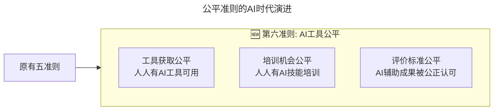
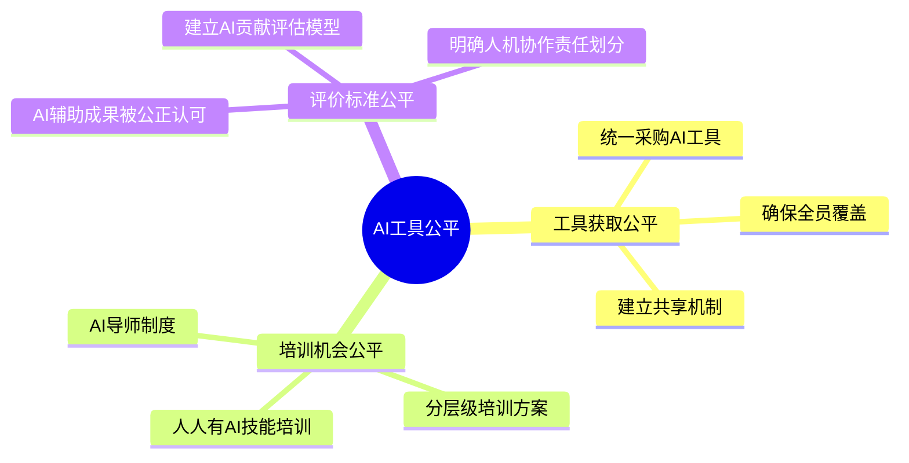

> **适用范围**：技术团队 Leader、CTO、工程经理、HRBP
> **更新摘要**：v2 版本基于原文第 181 讲内容，保留全部原始内容并升级为 6 节结构；融入 2026 年 AI 时代注解，新增第六准则"AI 工具公平"、AI 时代公平感来源分析及 AI 公平行动清单。

---

# 第181讲 | 姚威：技术团队管理中关于公平的五个核心准则

## 一、导言

你有没有听过这样一句话"技术人员都很单纯的，连这样一群人都管理不好，那一定是管理者的问题"。或者你在管理技术团队时有没有这样的感觉：技术团队管理工作中的那些头疼的问题，大多与公平一词相关。新东方年会那首职场版"沙漠骆驼"依稀还在耳边，整首歌都表达着各种不公平的问题。这些问题往往由很小的点爆发，认真处理时又发现牵涉太广，继续解决甚至开始自我怀疑，是制度问题？还是管理问题？还是某人的个人问题？每到这时都有一种无力感油然而生。

创业这两年，跟很多管理者们聊过，有信奉管理方法论的，有频繁修正优化管理制度的，有打感情牌的，有用三寸不烂之舌左右调停的，我个人也深受其累，也是在不久前做出了新的管理方案调整，今天和大家一起分享一下。

> **⭐ 2026 年技术背景**：原文核心方法论"公平五准则（机会均等、按贡献分配、透明公开、程序正义、尊重个体）"在 AI 时代面临新挑战——**AI 工具的使用可能引入新的不公平因素（如 AI 工具分配不均、AI 能力差距导致的绩效差异）**。84% 开发者使用 AI 编程，管理者需要确保在 AI 时代依然维护团队公平。

---

## 二、核心方法论

### 2.1 关于公平的几类常见问题

1. **沟通类**：技术人员往往会用管理者和个人沟通的频率来判断两人的关系密切程度，沟通少的人往往觉得自己在整个团队中和他人已经拉开了差距，处在了弱势一方，自然会认为自己所有的事情从此都失去了公平待遇。

2. **考核类**：这类问题可谓经久不衰，你会发现无论多么完美的考核体系，在出结果的那一天都会被无情挑战；无论如何高喊用制度去管理，矛头都会指向某一个具体的人。

3. **工作分配类**：每个人对"活儿"的评估都是很主观的，于是乎，在工作分配初期就会有人觉得不公平，甚至在进度出现问题的时候也会质疑当初工作分配上就有问题。

4. **制度类**：这类问题也是传说中管理者面临的"婆媳关系"，管理者觉得制度执行上出了问题，而技术人员觉得是制度本身就有问题。

### 2.2 为什么会出现上述几类问题

首先，技术团队管理虽是管理的一种，也是与人打交道，但具有很强的特殊性，特殊在这类人群本身就很特殊。技术人员往往有着极强的契约精神，在自己的领域非常有主见，自尊心很强，对曾经处理过的问题有着绝对自信。所以对于这样的人群，如果没有意识层面的共识，只是强调管理制度的执行，那本身就让他们觉得是不公平的，冲突的出现就会是必然且频繁的了。

其次，我建议不要用目标、过程、结果这样的词汇去管理技术团队。拿目标一词举个例子，对于管理这份工作的目标可能是项目成果、效率提升、良好的用户体验。而技术人员真实的工作目标呢？是完成一个活儿、完成 KPI、完成一个功能。从目标一词的理解开始就产生了分歧，过程中的冲突就可想而知了。

### 2.3 ⭐ 2026 新增第六准则：AI 工具公平

上述流程图展示了公平准则的 AI 时代演进：在原有五准则基础上新增第六准则"AI 工具公平"，包含工具获取公平、培训机会公平和评价标准公平三个要素。

### 2.4 各准则的 AI 时代具体挑战

| 准则 | AI 时代新挑战 | 管理对策 |
|-----|------------|---------|
| **机会均等** | AI 工具账号数量有限，不是所有人都能用 | 统一采购，确保全员覆盖；或建立共享机制 |
| **按贡献分配** | 如何衡量"AI 辅助的贡献"vs"人工的贡献"？ | 建立 AI 贡献评估模型；明确人机协作中的责任划分 |
| **透明公开** | AI 决策过程不透明（黑箱问题） | 要求使用可解释性强的 AI 工具；建立 AI 决策日志 |
| **程序正义** | AI 可能引入隐性偏见（如训练数据偏见） | 定期审计 AI 工具的输出偏差；建立申诉机制 |
| **尊重个体** | 不同成员对 AI 的适应速度不同 | 为慢速适应者提供额外支持，而非惩罚 |

---

## 三、关键流程

### 3.1 准则一：意识层面的核心准则

意识是技术团队管理中的根基。技术人员有着非常高的独立思维并且越优秀越自信。那么从根本上来说，你就没办法让其信服你制定的制度是正确的。当技术人员接触制度时根本不知道这些制度制定时的目的和意义是什么。他们挑战的其实不是制度本身，而是制度制定的原则和目的。

在制定和下发制度前，先做好团队基础意识的统一就显得尤为重要了，我们的团队统一的是"以终为本，能力为尺，人人平等"的意识与理念。也就是告诉所有技术人员，所有的工作制度是为了保障完成最终工作制定的，所有考核制度考核的是技术人员个人能力与协作能力。

### 3.2 准则二：角色层面的核心准则

我使用角色一词是为了区别等级和职位。我个人对于具体技术工作中的流程持悲观心态，并不认为现实中存在"完美流程"。于是我们尝试确定团队中的不同角色，用角色扮演的方式让每个技术人员立即判断自己该做什么。

- **决策人**：当技术工作出现多种方案时做决策的人
- **责任人**：需要收集他人遇到的问题和不同想法
- **操作人**：只要做好常规的本职工作
- **协作人**：配合某一个具体的操作人推进工作

以上种种虚拟角色是在工作分配会议上分配的，针对不同的项目，虚拟角色都可以进行更换。工作是管理者进行分配的，而虚拟角色是技术人员参考自己的能力选择担任的。

### 3.3 准则三：制度层面的核心准则

基于我们能先确定的意识与角色这两个层面，在制定制度的时候就可以有理可依。我们的制度不针对任何人，而是针对各种角色。我们的制度约束了每个角色应该做什么事、拥有什么权利、需要承担什么责任、获得什么利益保障。制度依然是"死"的，但角色是"活"的，每个人可以根据自身能力和对不同项目工作的熟悉程度而自由选择。

### 3.4 准则四：执行层面的核心准则

在执行层面，管理者需要做的就没有那么多了，针对不同角色履行相关的制度就可以了。唯一需要注意的是，针对不同角色去优化制度的细节，也可以将一些特别细的监督和管理任务分配给一些角色。

记得著名的国际战略管理专家林正大曾说过："权限就像风筝线，部属能力强了就放一放；部属能力弱了就收一收。"

### 3.5 准则五：奖惩层面的核心准则

奖惩的公平不一定是人人平等，且预设统一的幅度。基于前面说到的角色层面，每个角色承担的责任是不同的，那么奖惩幅度和标准也应该是不同的。比如决策人和责任人，是需要额外解决问题做出决策的，他们做的好，贡献更大，奖励更高；他们出现了问题，那么可能不是一个 bug 的问题，所以惩罚可能更重。有担当的人自然敢于挑战，想打一份安稳工的人也有他选择的权利。

### 3.6 ⭐ 2026 "公平感"的 AI 时代来源分析

| 新增因素 | 描述 | 管理启示 |
|---------|------|----------|
| **AI 工具获取差异** | 有人用高级版有人用基础版 | 尽量统一工具版本，或明确差异化理由 |
| **AI 能力差距** | 同样任务，善用 AI 的人效率高 5x | 将 AI 技能纳入培训体系，缩小差距 |
| **AI 绩效认可度** | AI 辅助完成的成果是否被同等认可 | 明确 AI 辅助工作的价值认定标准 |

---

## 四、工具与实战

### 4.1 ⭐ 2026 立即行动清单

- [ ] 审视当前团队的 AI 工具分配情况，确保"工具获取公平"
- [ ] 建立"AI 贡献评估模型"，明确如何衡量 AI 辅助的工作成果
- [ ] 在团队会议中讨论"AI 时代的公平"，收集成员反馈
- [ ] 制定 AI 工具使用规范，平衡自由与安全
- [ ] 建立 AI 输出审核机制，确保质量和安全
- [ ] 定期进行 AI 公平性审计

### 4.2 AI 工具公平三要素落地

上述思维导图展示了 AI 工具公平三要素的落地措施：工具获取公平（统一采购、全员覆盖、共享机制）、培训机会公平（人人有培训、分层方案、AI 导师）和评价标准公平（公正认可、评估模型、责任划分）。

---

## 五、常见误区

### 误区 1：用 AI 替代人文关怀
- **现象**：认为有了 AI 工具就不需要关心员工
- **对策**：AI 越强大，人的情感需求越重要

### 误区 2：AI 能力成为唯一标准
- **现象**：只看 AI 工具用得好不好
- **对策**：AI 是放大器，基础能力和价值观依然是根本

### 误区 3：忽视 AI 带来的新型不公平
- **现象**：AI 工具分配不均、AI 能力差距导致的绩效差异
- **对策**：主动关注和解决 AI 带来的新型不公平问题

### 误区 4：制度"一刀切"
- **现象**：不分角色、不分场景，统一标准
- **对策**：基于角色制定差异化制度，角色是"活"的

---

## 六、进阶延展

### 结语

以上关于公平与制度的核心准则，来源于我的公司和团队，可能与大家的整体环境不同，会有很多的实际差异。毕竟管理这事无外乎两点，一个是对人，一个是对事。人人不相同，事有千千万。作为一个网络安全技术从业者转型的管理者，我也一直在摸索前行，总结出的五个准则不敢说一定都是正确的，但作为我的经验之谈，可以保证为其付诸了实验、时间与实践。

对于管理而言，技术团队的管理确实要单纯的多，但是技术团队的中层管理者或是小型技术公司的管理者更多的是在做搭通天地线的工作，偶尔还会被两边怼，背后背锅胸前还得挂个锅盖。但有时候想想，不管想出来的管理方法是不是有效，这不也是我们该承担的责任和扮演的角色吗？

> **⭐ 一句话总结（2026 版）**：公正是团队凝聚力的基石——在 AI 时代，公正的含义扩展了，管理者需要主动关注和解决 AI 带来的新型不公平问题。

### 作者简介

姚威，凌晨网络科技 CEO，TGO 鲲鹏会广州分会会员，腾讯 WiFi 安全实验室联合发起人，RainRaid 雨袭团信息安全团队负责人。曾发布：《中国一线城市公共 wifi 安全与潜在威胁调查研究报告》《社会工程学攻击建模》《针对 IPTV 的 EPG 系统攻击思路分析与实验》《匿名者黑客组织针对我各国政务网站攻击思路分析》。