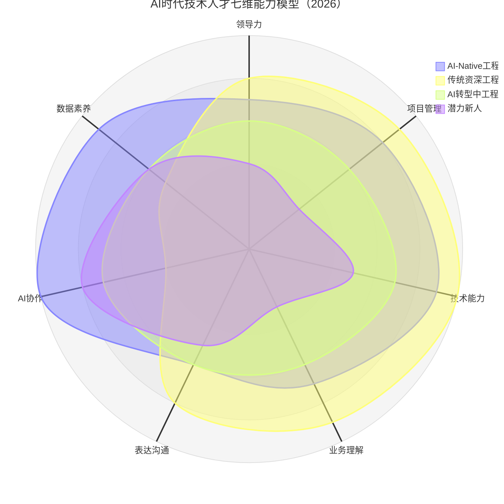
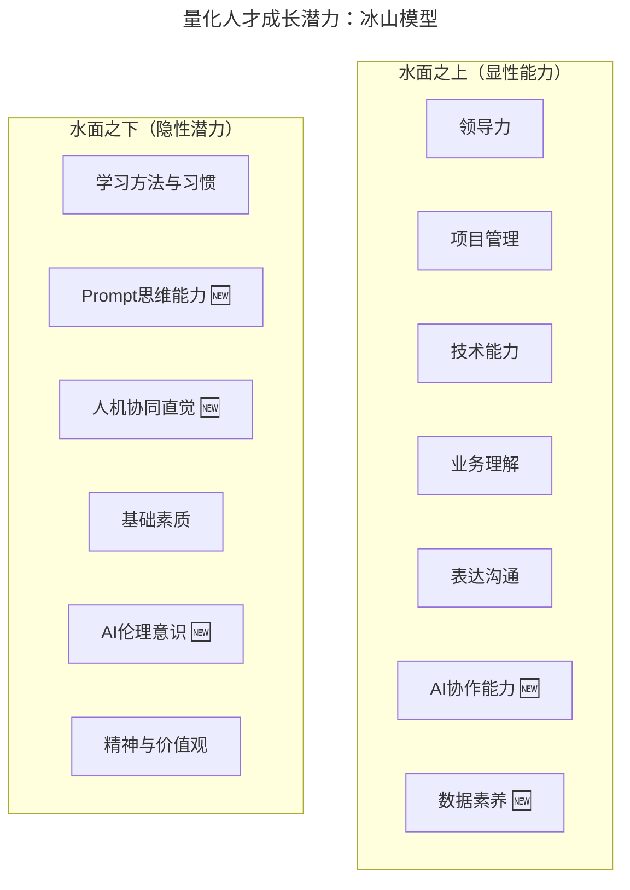
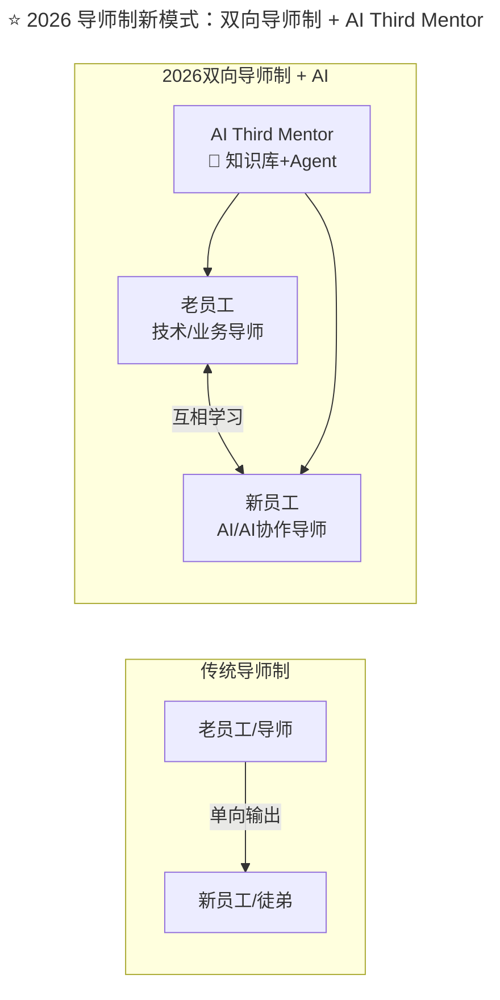

> **适用范围**：技术团队管理者、Tech Lead、HRBP
> **更新摘要**：v2 版本基于原文第 157 讲内容，保留全部原始内容并升级为 6 节结构；融入 2026 年 AI 时代注解，将五维能力画像升级为七维 AI 时代能力模型，新增冰山模型重塑、双向导师制+AI Third Mentor 及 AI 协同契约。

---

# 第157讲 | 成敏：技术人才的管理公式

## 一、导言

那我们不妨换个角度思考：如果管人也有公式，是不是又能回到技术人熟悉的思维方式中，是不是就能够降低管人的难度呢？

> **⭐ 2026 年技术背景**：2026 年，技术人才的"五维能力画像"需要全面升级为"七维 AI 时代能力画像"，新增"AI 协作能力"和"数据素养"两个维度。同时，团队组织方式从纯人类协作演进为"人+Agent 混合团队"。本文将对原文的管理公式、能力画像和团队建设方法进行 AI 时代升级。

---

## 二、核心方法论

### 2.1 管人的公式：五维能力画像

既然谈公式，就要先确定公式中的各个参数。不妨将员工的表现抽象为五个维度，分别是领导力、项目管理能力、技术能力、业务理解能力和表达沟通能力，并用这五个维度能力的高低构建一个人的能力画像。

根据不同场景，选择考量的维度不同，而且每个维度，细展开来都有不同层次。比如项目管理，最低的层次是个人时间管理，然后逐步上升为工作任务管理，再进阶可能是对整个项目过程的管理。其他四个维度也是类似。

有了这样的能力画像后，我们就可以尝试把团队成员按照这个模型归类，有了直观的对比后，可以很容易地从中看到某个同学的优势、不足和需要学习与进步的空间。在管理中，我们就可以依照这些信息，跟团队成员进行有针对性的高效沟通，帮助他们更好地成长。

通过这张能力画像图，我们也可以看出团队目前缺少哪类人才。一个优秀的团队中，每位团队成员最好都拥有不一样的技能，这样才能适应各种各样的问题。而借助能力画像，我们可以合理搭配团队间的合作关系，使团队更加稳健。

### 2.2 ⭐ 2026 七维能力画像

原文的五维画像在 2026 年需要扩展为**七维**：



上述雷达图展示了 AI 时代技术人才的七维能力模型，对比了 AI-Native 工程师、传统资深工程师、AI 转型中工程师和潜力新人的能力分布。AI-Native 工程师在 AI 协作（10 分）和数据素养（9 分）上遥遥领先，而传统资深工程师在技术能力（10 分）上最强但 AI 协作较弱（4 分）。

#### 新增两维详解

| 维度 | 定义 | 2026 关键要求 | 评估方式 |
|-----|------|------------|---------|
| **AI 协作能力（新增）** | 与 AI 工具/Agent 高效协同的能力 | Prompt Engineering、AI 输出质量控制、Agent 调试、识别 AI 幻觉 | 实操测试 + 项目观察 |
| **数据素养（新增）** | 理解和使用数据驱动决策的能力 | 数据分析、AI 训练数据质量判断、指标设计、A/B Test 设计 | 案例分析 + 报告评审 |

### 2.3 量化人才成长潜力：冰山模型

对于新同学，我们要关注的不仅仅是他当前的能力，还要关注他未来的成长潜力。如果将一个人的成长潜力比作冰山，那么能力画像中所罗列的个人能力都只是浮在水面的部分，是我们能够直观看到的他现有的能力与经验。

而水面下的部分就是他的潜力，最直接的就是他做事的方法和习惯。但方法和习惯并不是难以习得，所以，起到更深层次影响的是他的基础素质与精神。因此，我们在招贤纳士时，除了关注水面上的部分，还要多多关注水面下的部分，即人才在方法、习惯、基础素质、精神等方面的表现。

#### ⭐ 2026 冰山模型重塑



上述流程图展示了 2026 年冰山模型的重塑版本：水面之上的显性能力从五维扩展到七维（新增 AI 协作能力和数据素养）；水面之下的隐性潜力新增了 Prompt 思维能力、人机协同直觉和 AI 伦理意识三个维度，体现了 AI 时代对人才潜力评估的新要求。

### 2.4 培养逻辑

那我们怎样培养人才呢？可能有人说，我们直接改善他的方法与习惯不就好了，也有人会说，直接给他打鸡血，提升素质，塑造精神。但从我的实践经验来讲，这样做的效果很差。人才的选育用留，直接只在"育"层面发力去培养人才是不够的，我们要把"用"和"育"结合起来，让他们通过解决问题来提升能力。

**⭐ 2026 升级**：从"用"+"育"结合升级为**"用"+"育"+"AI 辅"三位一体**

| 培养维度 | 传统方式 | AI 增强方式 | 效果对比 |
|---------|---------|-----------|---------|
| **任务分配** | 根据能力分配任务 | **AI 建议最优任务-人员匹配** | 匹配准确度↑40% |
| **技能诊断** | 定期绩效评估 | **AI 实时追踪技能成长轨迹** | 诊断频率↑10x |
| **知识传递** | 导师制、文档 | **AI 知识库 + Agent 问答** | 知识获取效率↑5x |
| **实践反馈** | 定期 Review | **AI 实时 Code Review + 即时反馈** | 反馈延迟↓90% |
| **成长规划** | 季度 OKR 对齐 | **AI 生成个性化学习路径** | 规划精准度↑35% |

---

## 三、关键流程

### 3.1 导师制：搭配 B 更佳

举个例子，很多团队都有导师制度，会给新加入的员工分配老员工作为导师，便于快速融入团队并获得成长。但导师选择也有诀窍在，要考虑到新老员工之间的相性，如果没有经过思考，随意指定老员工，导致两者之间相性不合，反而会造成反效果。

但如果利用能力画像来量化搭配，就很好的解决这个问题。图中展现出的是两种不同的搭配思路。在搭配 A 中，新员工五个维度的能力普遍弱于老员工，或是跟老员工持平，没有比老员工突出的能力。在搭配 B 中，新员工的综合能力依旧弱于老员工，但他在某个能力维度上却有高于老员工的能力，图中示意的例子中是表达沟通能力这个维度。

在我看来，搭配 B 的效果会更胜一筹。因为，新老员工双方各有所长，他们可以形成一个良性的合作关系，彼此都可以得到相应的成长，而不是只有老员工在输出。比如，老员工作为导师可以将他在技术能力、业务理解能力等维度上的理解和经验传递给新同学，而新同学有着良好的表达和沟通能力，反过来也会影响导师。这就是搭配 B 效果更佳的原因，有相互促进的作用，因此，在条件允许的情况下，更推荐大家使用 B 类搭配。

### 3.2 ⭐ 2026 导师制新模式：双向导师制 + AI Third Mentor



上述流程图对比了传统导师制与 2026 年双向导师制+AI Third Mentor 模式：传统模式是老员工单向输出给新员工；2026 年模式中，老员工和新员工双向互学（新员工在 AI 协作方面反哺老员工），同时 AI Third Mentor 为双方提供知识库和 Agent 支持。

#### AI Third Mentor 的职责

| 职责 | 具体内容 | 可用工具 |
|-----|---------|---------|
| **7×24 答疑** | 随时回答技术和流程问题 | 内部 Wiki RAG + GPT-5.5 |
| **代码审查辅导** | 在 Code Review 中给出教学性反馈 | CodeRabbit 自定义规则 |
| **最佳实践推荐** | 根据代码上下文推荐最佳实践 | Copilot Workspace |
| **技能差距诊断** | 自动识别技能短板并推荐学习资源 | 技能雷达图 + 学习平台 API |
| **知识沉淀** | 将问答中有价值的内容沉淀为文档 | Auto-GPT + Wiki |

### 3.3 从个体到团队：四个层次

有了人之后，面临的问题就是如何把这些人更好的组织起来，也就是从个体到团队。虽然互联网行业跟体育行业相隔甚远，但运动队的团队组织方式是非常值得大家在组织团队时借鉴的。

比方说一个 NBA 篮球队，或是一个俱乐部足球队，你会发现它非常的形式化，连工资都有上限，比如 NBA 的工资帽。而在这样的环境中，如何组织好团队间的关系，是非常有学问的，也是值得我们借鉴的。

**首先，一个先决条件是基本相同的价值观**。如果一位同学极度自私或极度不成熟，而你没有办法改变他，不能让他认同并贯彻团队的价值观，那他就不能与这个团队共生，你就需要尽早的将他清出团队。

**其次，一个团队需要有相应的规则纪律**。我们有很多管理规则，如绩效、奖惩、约定、制度等。但关键在于，作为团队 leader，不能滥用这些规则纪律，而是要利用好它们，让团队运转更加稳健顺畅，同时，通过这些抓手来传达你想传达的东西，比如对团队成员的正面引导。

**接着，再上一个层次是文化与归属**。我们在做同样的事情，有着同样的"气味"，彼此拥有情谊与信任。很多管理者都会头疼的一个问题是，怎样让新同学快速地融入团队？其实，与其反复跟新同学讲要如何融入团队，都不如设定一些机制，创造条件让他跟团队成员发生互动。团队架构关系是固定的，但我们可以通过互动、沟通，加深彼此的信任，建立新的友好关系，使团队形成一张网，这个团队才可以更加稳健、团结。

**最后，最高层次就是彼此拥有共同目标**。作为团队的技术 leader，需要经常思考，为什么我们是一个团队？

---

## 四、工具与实战

### 4.1 ⭐ 2026 第五层次：AI 协同契约

在上述四层基础上，AI 时代的团队需要增加**第五层次**：

```
我们团队的AI协同契约：

1. **透明原则**
   我们坦诚记录AI的使用情况，包括失败和教训

2. **质量底线**
   AI生成的所有代码必须经过人工审核才能合并

3. **安全红线**
   绝不将敏感数据输入未经批准的AI服务

4. **持续学习**
   每人每月至少分享一个AI使用技巧或踩坑经验

5. **人机边界**
   明确哪些决策必须由人类做出，哪些可以交给AI

6. **包容失败**
   在AI实验中失败是被鼓励的，只要从中学习
```

### 4.2 ⭐ 2026 人才培养 AI 工具箱

| 工具类型 | 推荐工具 | 用途 |
|---------|---------|------|
| **技能雷达图自动生成** | Custom GPT + HR 系统 | 自动绘制七维能力雷达图 |
| **AI 学习路径推荐** | Notion AI + 内部知识库 | 根据技能 GAP 推荐学习资源 |
| **AI Mentor** | 内部知识库 RAG 应用 | 24 小时回答技术问题 |
| **AI Code Review Coach** | CodeRabbit + 自定义规则 | 边写代码边学习最佳实践 |
| **AI Career Path Simulator** | 自研/定制工具 | 模拟不同职业发展路径的技能需求 |

### 4.3 AI 时代团队建设 CheckList

| 层次 | 检查项 | 状态 |
|-----|--------|------|
| **价值观** | 团队是否就 AI 使用的价值观达成共识？ | ☐ |
| **规则纪律** | 是否有明确的 AI 工具使用规范？ | ☐ |
| **文化归属** | 团队成员是否愿意分享 AI 使用经验？ | ☐ |
| **共同目标** | 团队目标中是否包含 AI 效能指标？ | ☐ |
| **AI 协同契约** | 是否签署了 AI 协同契约？ | ☐ |
| **工具统一** | 是否统一了团队的 AI 工具栈？ | ☐ |
| **技能发展** | 是否有每个人的 AI 技能提升计划？ | ☐ |
| **效能度量** | 是否建立了 AI 效能看板？ | ☐ |

### 4.4 ⭐ 2026 行动清单

#### 本周行动

- [ ] 为团队成员绘制**七维能力雷达图**
- [ ] 识别团队中的**AI Champion**（AI 协作能力最强的人）
- [ ] 起草团队的**AI 协同契约**初稿
- [ ] 选择并统一一款**AI 编程工具**

#### 本月行动

- [ ] 建立**AI Third Mentor**（基于内部知识库的 RAG 应用）
- [ ] 实施**双向导师制**配对
- [ ] 搭建**AI 效能看板**（至少追踪 5 个核心指标）
- [ ] 组织第一次**AI 经验分享会**

#### 本季度目标

- [ ] 团队 AI Adoption Rate > 85%
- [ ] 每人至少完成一项 AI 技能认证/培训
- [ ] 人均 AI 节省工时 > 8 小时/周
- [ ] 建立完整的 AI 人才培养体系文档

---

## 五、常见误区

### 5.1 只在"育"层面发力

- **误区**：只靠培训来培养人才，效果很差
- **正确做法**：把"用"和"育"结合起来，让他们通过解决问题来提升能力
- **AI 时代升级**：升级为"用"+"育"+"AI 辅"三位一体

### 5.2 搭配 A 的单向输出陷阱

- **误区**：新员工各维度都弱于或持平于老员工，只有老员工在输出
- **正确做法**：采用搭配 B，新员工某维度强于老员工，形成双向促进
- **AI 时代升级**：实施双向导师制+AI Third Mentor，三方协同

### 5.3 滥用规则纪律

- **误区**：作为团队 leader 滥用管理规则
- **正确做法**：善用而非滥用规则，让团队运转更加稳健顺畅

---

## 六、进阶延展

### 6.1 AI 时代的人才分类新框架

基于七维能力画像，2026 年技术人才可分为以下类型：

| 类型 | 特征 | 团队角色 | 管理策略 |
|-----|------|---------|---------|
| **AI Architect** | AI 协作+数据素养极高 | 团队 AI 战略制定者 | 充分授权，参与决策 |
| **Domain Expert** | 业务理解+技术能力极深 | 领域问题终结者 | 保护深度工作时间 |
| **AI-Augmented Builder** | 各维度均衡，AI 协作强 | 高效执行者 | 提供最佳 AI 工具链 |
| **AI Native Newcomer** | AI 协作强但其他弱 | 快速成长型 | 配强导师+AI 辅助 |
| **Traditional Specialist** | 技术深但 AI 弱 | 需转型的老兵 | 制定 AI 技能提升计划 |

### 6.2 核心理念

> **人是团队的根本，但在 AI 时代，"人"的定义扩展到了"能够与 AI 高效协同的人"。**

正如瑞·达利欧的《原则》一书中强调的，在管理中，理性的思考无处不在。

### 6.3 延伸思考

- 管人公式的参数从五维扩展到七维，AI 协作和数据素养成为新的核心维度
- 冰山模型的水面之下新增 Prompt 思维、人机协同直觉和 AI 伦理意识
- 团队组织从四个层次扩展到五个层次，新增 AI 协同契约
- 导师制从单向输出进化为双向互学+AI Third Mentor 三方协同