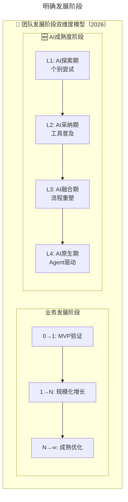
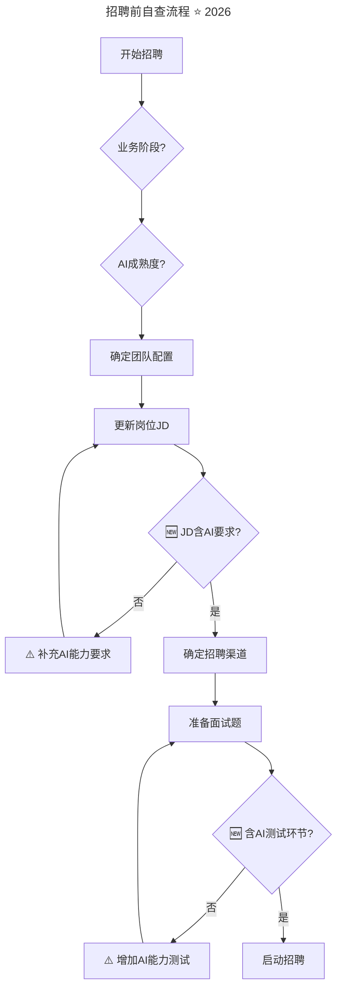

> **适用范围**：CTO、技术团队管理者、HRBP、招聘负责人
> **更新摘要**：v2 版本基于原文第 34 讲内容，保留全部原始内容并升级为 6 节结构；融入 2026 年 AI 时代注解，新增团队发展阶段双维度模型、AI 相关岗位定义、AI 垂直招聘渠道及招聘前自查清单。

---

# 第34讲 | 打好技术团队搭建的基础

## 一、导言

从运营、到产品、再到技术研发落地，都需要一个团队的执行，尤其要仰仗团队的核心骨干来执行落地。对于 CTO 等技术领导者来说，招聘始终是绕不过去的话题，毕竟，任何一个团队，都不是每个岗位都齐整，等着你来领导的。如果技术领导者不能搭建自己的强大团队，是无法胜任其岗位的。

那么，招聘前需要做好哪些准备工作？如何定岗定级？有哪些有效的招聘渠道？本文将就这些问题展开探讨。

> **⭐ 2026 年技术背景**：原文关于招聘准备工作的方法论依然有效，但**每一个环节都需要考虑 AI 的影响**——定岗定级需新增 AI 相关岗位，招聘渠道需扩展 AI 开发者社区，候选人画像必须包含 AI 能力维度，团队发展阶段需引入 AI 成熟度作为新维度。

---

## 二、核心方法论

### 2.1 明确发展阶段

首先要明确的是公司发展阶段，这点非常重要。产品从 0 到 1，和 1 到 N 的过程中，对团队的人员需求，能力诉求是完全不一样的。在从 0 到 1 的过程里，讲究的是如何高效的利用现有的条件实现产品研发落地，而不过分追求技术的先进性。

这个阶段中，往往从 CEO 开始到一线的产品、研发人员未必清楚产品在市场上的响应，整个团队的核心思想其实是需要将产品放到市场上试错，从而收集第一手的用户数据，这时，时间决定一切。这个时候的 CTO（未必就是一个 CTO，可能是技术总监或者技术专家的角色）更多应该扮演的是技术专家的角色，主要的工作是根据产品的设计，带领大家一起写代码，并在团队资源紧张的情况下，自己撸起袖子写代码。

随着产品在市场的反响越来越好，慢慢的有了一些用户基础和用户数据，数据日益增长，原来的系统架构越来越不能胜任用户增长、数据增长的需求，要求平台从会员、商品、WMS、交易等进行划分，甚至微服务化，此时对团队的技术能力要求也越来越高，需要专人专岗负责，甚至专业的团队来负责。这时，团队规模较公司创立之初有了较大幅度的扩张，CTO 应该将更多的精力转移到团队管理，如绩效、战略等。

明确团队发展阶段对于 CTO 来说，是招聘的前提，比如在创业之初，没有 P9 级别的诉求。做技术的人都有一个通病，总是希望将技术做到极致。殊不知，在 QPS 1000 都到不了的情况下，从技术上将 QPS 做到 100 万级别没有任何价值。

#### 团队发展阶段双维度模型 ⭐ 2026

原文强调根据公司发展阶段确定用人策略。2026 年建议采用**双维度模型**：

上述流程图展示了 2026 年团队发展阶段的双维度模型：业务维度（0→1→N→∞）与 AI 成熟度维度（L1-L4）交叉，形成更精准的团队配置决策矩阵。管理者需要同时评估业务阶段和 AI 成熟度，才能制定合理的人员配置策略。

**不同阶段的用人策略**：

| 业务阶段 × AI 阶段 | 团队规模建议 | 重点招聘岗位 | AI 能力要求 |
|-------------------|-------------|-------------|-----------|
| **0→1 × L1** | 3-5 人 | 全栈工程师 | 基础 AI 工具使用 |
| **0→1 × L2** | 3-5 人 | 全栈+AI 爱好者 | AI 工具熟练使用 |
| **1→N × L2** | 8-12 人 | 各角色+AI Platform Engineer | 分层 AI 能力要求 |
| **1→N × L3** | 8-15 人 | 含 Agent Architect | 高阶 AI 编排能力 |
| **N→∞ × L4** | 15-25 人 | 完整 AI 职能体系 | AI 原生能力 |

### 2.2 定岗定级

大多数的创业型互联网公司都是靠融资活着，在公司扩张方面，有人任性，有人谨慎。当然也见过有人任性到拿到投资时无限制招人，到最后裁员的结局。任何一家公司都不可能无限制的扩张，基本都是根据业务的需求制定合理的招聘需求，对于技术领导者来说也是一样的。

作为一个技术领导者，需要根据业务和产品的需求，结合现有团队的资源（现有团队的能力分布对于新的业务需求在招聘岗位上的能力需求是很有意义的参考），定义岗位的能力要求。

比如，现在要做一个 WMS，那么首先就要评估团队的现状，明确团队的技术栈（比较忌讳采用全新的技术栈，一般沿用现有的技术栈）。从产品角度来说，如果团队成员对 WMS 都比较熟悉，但就是没有资源能将想法落地，此时需要一个对 WMS 有点概念或者比较资深的产品经理来设计落地即可，至于招聘还是内部提拔，视不同情况而定。

对于研发技术人员的需求，本人比较崇尚根据目前团队某个产品的 duty team 的构成作为参考，而不是盲目地提升团队的需求，导致招人困难，致使项目延期；也不需要为了便于招人，刻意降低团队的需求，从而导致最后产品质量没法保障。

那么如何定级呢？相信大家对现在互联网行业中的 P／M 定义都非常熟悉，但是不能照搬，要结合自己团队的现状定义合理的级别。此时，HRBP 在这个过程中能够起到很大的作用，通常 HRBP 在每个季度都会对团队的效能进行分析，明确每个团队，每个伙伴的绩效分析，和效能分析报告。CTO 可以根据这些分析报告，结合业务需求，制定比较合理的 headcount。

在技术管理者中不乏这样的人，对 headcount 的诉求是拍脑袋决定的，总觉得人越多越能显示权威，说明自己越厉害。这样的技术管理者自身就是不合格的，我们一定要避免陷入这种思维。

#### 定级的 AI 能力参考 ⭐ 2026

| 职级 | 传统技术要求 | 🆕 AI 能力要求 |
|------|-------------|--------------|
| P5（初级） | 独立完成模块开发 | **熟练使用 AI 编程工具** |
| P6（高级） | 模块设计+指导他人 | **能优化 AI 工作流，具备 Prompt 设计能力** |
| P7（专家） | 系统设计+技术决策 | **能评估 AI 输出质量，参与 AI 工具选型** |
| P8（架构） | 架构设计+跨团队协调 | **能设计人机协同系统，制定 AI 规范** |
| P9（首席） | 技术战略+行业影响 | **能规划 AI 战略，推动 AI 文化建设** |

### 2.3 招聘渠道

面向不同岗位，不同定级的招聘诉求，对应的招聘渠道应该尽量多样化。可能很多人都认为招聘渠道的获取应该是 HR 的事情，这种观点本人并不认可。本人 2003 年参加工作，那个时候领导真的是领导，在办公室高高在上，而现在的领导，尤其是互联网行业的 CTO 等，已经早就不是领导，而是保姆。对于招聘渠道的布置和推广，CTO 至少要参与其中，给出思路，让 HRBP 去执行。

目前比较有效的几个招聘渠道，基本上有下面几种：

1. **熟人圈子**：这种方式是最可靠的，尤其针对核心岗位，骨干级别，高 P／M 级别的岗位，非常推荐这种方式。熟人圈子最大的优势是，对于业主和候选人都知根知底，背景清楚。

2. **猎头**：通常企业在需要招聘团队负责人时，才会启用猎头，毕竟利用猎头的成本不低。但是，由于猎头准入门槛较低，滥竽充数者大有人在，作为团队负责人，想要提高命中率，恐怕需要向猎头明确候选人背景、候选人经历、能力、岗位诉求、岗位价值回报等。

3. **内部推荐**：内部推荐实际上是对企业文化的一次考验。大多数创业型团队将内部推荐作为常态工作。根据岗位定级的差异，设计内部推荐的激励制度。内部推荐成功的概率往往比较高，毕竟大家都不希望自己推荐的候选人被拒，从而或多或少影响到自己。

4. **扫街**：负责团队招聘的 HR 在各大招聘信息网站上海选简历，将符合需求的简历放入到人才库，接着再一个一个电话预约面试。这种获取简历的方式工作量巨大，效率比较低下，也难以获取符合岗位诉求的候选人。目前，很多公司已经不大会采用这种方式了。

5. **发布招聘信息**：大多数希望从传统转型到互联网的企业比较喜欢的招聘渠道。由于深受传统思维的限制，这种类型的企业的 HR 大多认为用人单位是强势的一方，就等着人家主动投递简历过来，我来筛选。现在的招聘方式变了，候选人更加在乎的是自己做事情的感受，是否被认可，是否受到应有的尊重。不是说不能发布招聘信息，而是应该更加主动的出击，直接面对候选人，而非被动的等待投递的简历上门。

对于招聘渠道，往往需要一个双向的，长期的建设过程，除了正常的维护高质量的招聘渠道之外，还要尽量的对外推广。推广的目的之一是企业形象的推广，实际上是促进招聘的便利。

---

## 三、关键流程

### 3.1 团队发展阶段判断流程

从原文案例中提炼的阶段判断流程：

1. **评估业务阶段**：产品是 0→1 还是 1→N？QPS 需求如何？
2. **评估系统瓶颈**：当前架构是否能支撑业务增长？
3. **确定团队配置**：根据业务需求和技术挑战，确定需要的角色和级别
4. **避免过度配置**：在 QPS 1000 都到不了的情况下，追求 QPS 100 万没有价值

原文案例：
- **案例 1**：公司 TPS 大概在 100 左右，团队里有技术控想对平台技术进行改造，但当时系统足够使用，没有改造必要。多次沟通无果，最后不欢而散。
- **案例 2**：系统 TPS 大概在 3000 左右，实际需求已达 30000+，直接导致系统每天不定时重启。CTO 上任后第一件事就是解决这个问题。

### 3.2 招聘前自查流程 ⭐ 2026

上述流程图展示了 2026 年招聘前的自查流程：从业务阶段判断到 AI 成熟度评估，再到团队配置和岗位 JD 更新（必须包含 AI 能力要求），最后到面试流程设计（必须包含 AI 测试环节），形成完整的 AI 时代招聘准备闭环。

---

## 四、工具与实战

### 4.1 新增 AI 相关岗位定义 ⭐ 2026

| 岗位名称 | 职级建议 | 核心职责 | 任职要求 |
|----------|---------|---------|---------|
| **AI Platform Engineer** | P7-P8 | 企业 AI 基础设施运维、LLM 网关、RAG 系统 | DevOps 背景+ML 基础 |
| **Prompt Engineer** | P6-P7 | 企业 Prompt Library 建设、最佳实践沉淀 | NLP 背景或强 Prompt 天赋 |
| **Agent Architect** | P8+ | 多 Agent 系统架构设计、工作流编排 | 架构能力+Agent 实战经验 |
| **AI Governance Specialist** | P6-P7 | AI 使用规范制定、安全审计、合规检查 | 法务/安全+AI 理解 |

### 4.2 招聘渠道的 AI 时代扩展 ⭐ 2026

| 渠道类型 | 传统渠道 | 🆕 2026 新增渠道 | 适用岗位 |
|----------|---------|----------------|---------|
| **熟人圈子** | 前同事、朋友 | **AI 社区 KOL、开源贡献者** | 所有岗位 |
| **猎头** | 传统猎头 | **AI 领域专业猎头** | 高 P 级别、AI 专项岗位 |
| **内部推荐** | 员工推荐 | **AI 社群推荐、Hackathon 发掘** | 中低 P 级别 |
| **🆕 AI 垂直平台** | - | **PromptBase、Hugging Face、LangChain 社区** | AI 专项岗位 |
| **🆕 开源社区** | GitHub | **AI 项目 Contributor、Prompt Engineer 市场** | 技术岗位 |
| **🆕 AI 竞赛** | - | **Kaggle、AI Hackathon 获奖者** | 算法/AI 岗位 |

#### ⭐ AI 时代渠道运营建议

1. 在**AI 开发者活跃的平台**建立企业技术品牌
2. 参与**AI 开源项目**，通过 Contributor 发现人才
3. 举办**AI 主题 Hackathon**，现场发掘潜力人才
4. 关注**AI 领域的 KOL 和意见领袖**，建立联系网络

### 4.3 招聘前具体检查项

- [ ] 明确当前团队的**AI 成熟度等级**（L1-L4）
- [ ] 岗位 JD 中包含**具体的 AI 能力要求**（不是泛泛而谈）
- [ ] 面试流程中包含**AI 能力测试环节**（Prompt 测试/输出审查等）
- [ ] 面试官经过**AI 能力评估培训**，能准确判断候选人的 AI 水平
- [ ] 准备好**AI 工具账号和测试环境**，供现场测试使用
- [ ] 了解**市场上 AI 人才的薪酬水平**，避免估价偏差

---

## 五、常见误区

### 5.1 拍脑袋定 headcount

- **误区**：对 headcount 的诉求拍脑袋决定，总觉得人越多越能显示权威
- **正确做法**：根据 HRBP 的效能分析报告，结合业务需求，制定合理的 headcount

### 5.2 技术过度配置

- **误区**：在 QPS 1000 都到不了的情况下，追求 QPS 100 万级别的技术改造
- **正确做法**：在合适的阶段用合适的人，明确团队所处的阶段

### 5.3 AI 时代招聘的陷阱 ⭐ 2026

#### 陷阱 1：AI 岗位定义模糊
- **现象**：招"AI 工程师"但不清楚具体要做什么
- **对策**：**先想清楚 AI 应用场景，再定义岗位**

#### 陷阱 2：期望不切实际
- **现象**：希望找到"既懂 AI 又懂业务又便宜"的人才
- **现实**：**复合型人才稀缺且昂贵**，考虑培养 vs 购买的权衡

#### 陷阱 3：忽视 AI 安全背景
- **现象**：没有调查候选人的 AI 使用习惯和安全意识
- **对策**：**增加 AI 伦理和安全相关的背景调查问题**

---

## 六、进阶延展

### 6.1 2026 年招聘准备 Checklist

- [ ] 评估团队**AI 成熟度等级**，明确当前所处阶段
- [ ] 更新**岗位能力模型**，加入 AI 能力维度
- [ ] 确定**AI 相关岗位编制**（如有需要）
- [ ] 拓展**AI 垂直招聘渠道**（至少 2-3 个新渠道）
- [ ] 设计**AI 能力面试流程**（标准化、可量化）
- [ ] 培训**面试官的 AI 评估能力**
- [ ] 调研**AI 人才市场薪酬**，确保竞争力

### 6.2 核心总结

> 💡 **一句话总结（2026 版）**：
> "明确发展阶段、合理定岗定级、多元化招聘渠道"的方法论没有变，但**每一个环节都需要注入 AI 思维**。2026 年的招聘准备 = **传统的岗位分析能力 + 对 AI 人才市场的理解 + 将 AI 能力纳入评估体系的意识**。最重要的是：**先搞清楚自己的团队处在 AI 成熟的哪个阶段，再决定需要什么样的人**。

### 6.3 延伸思考

- 团队发展阶段的判断需从单维度（业务）升级为双维度（业务×AI 成熟度）
- 定岗定级需加入 AI 能力参考，从 P5 到 P9 都有对应的 AI 能力要求
- 招聘渠道需扩展 AI 垂直平台和开源社区，传统渠道已不够用
- 招聘前自查清单需增加 AI 相关检查项，确保招聘流程的 AI 适配性