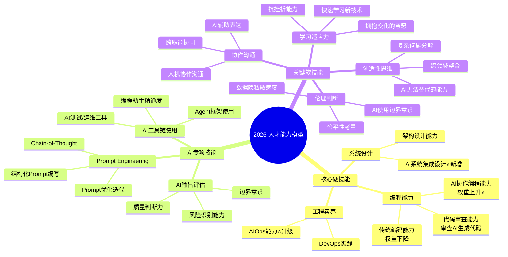
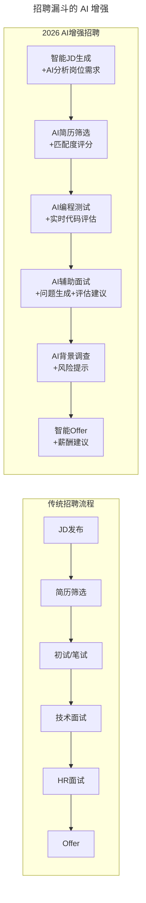
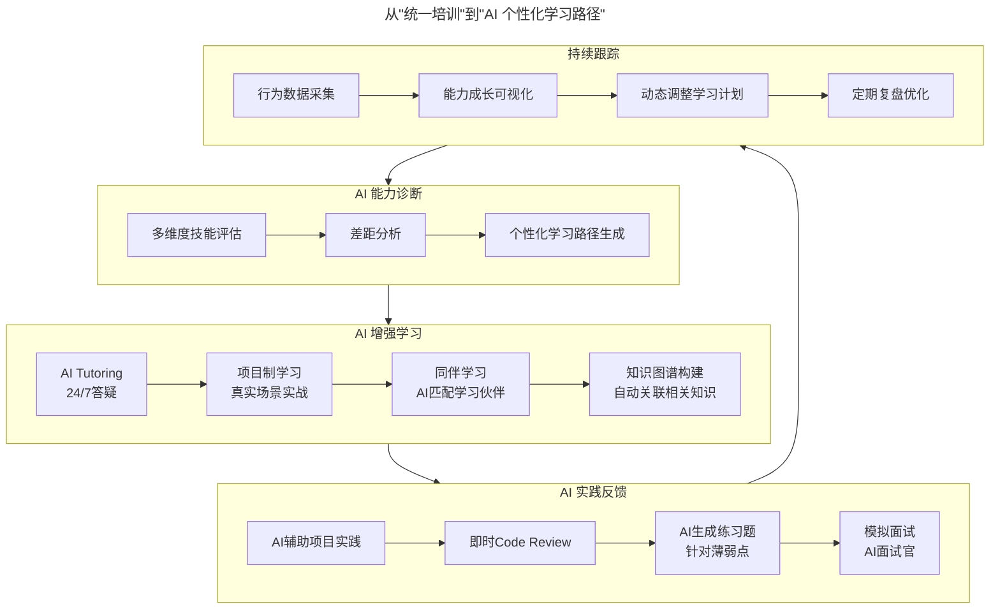
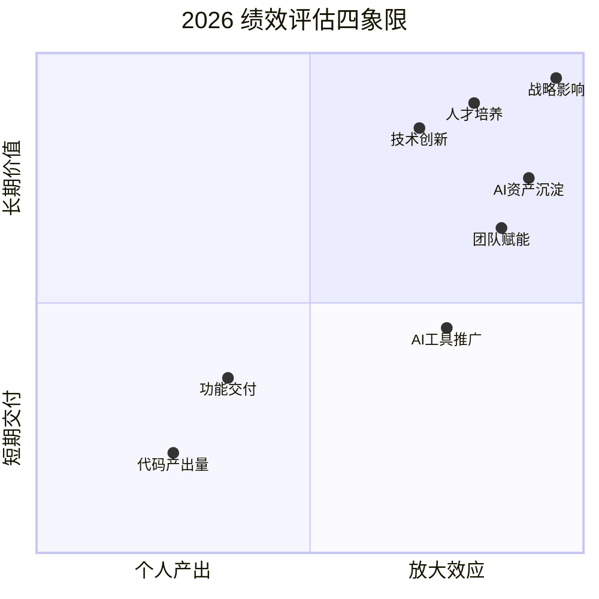

> **适用范围**：CTO、技术VP、HRBP、招聘负责人、团队Leader
> **更新摘要**：v2 版本基于原文新春特辑5内容，保留全部原始内容并升级为 6 节结构；融入 2026 年 AI 时代注解，新增 AI-Augmented 人才能力模型、AI 个性化培养体系、人机协作任务分配范式及 AI 时代留才组合拳策略。

---

# 新春特辑5 | 如何做好人才的选育用留？

## 一、导言

本文作为"人才选育用留"主题专辑，汇集了关于技术人才全生命周期管理的深度实践。原文核心观点包括：

1. **选才**：识别潜力、匹配文化、精准招聘
2. **育才**：系统培养、导师制、成长路径
3. **用才**：人岗匹配、充分授权、激发潜能
4. **留才**：薪酬激励、文化认同、职业发展
5. **人才战略是公司战略的核心支撑**

> **⭐ 2026 年技术背景**：2026年的人才管理面临**前所未有的变局**：
> - **84%开发者使用AI编程**：技能要求发生根本变化，传统评估标准失效
> - **Agent替代部分岗位**：初级开发、测试、文档等岗位需求减少30-50%
> - **AI素养成为硬技能**：不会用AI的工程师如同2018年不会用搜索引擎
> - **技能半衰期缩短至2年**：一次性招聘"终身技能"成为历史

---

## 二、核心方法论

### ⭐ 2.1 2026 人才能力模型：从"技术能力"到"AI-Augmented能力模型"



上述思维导图展示了 2026 年人才能力模型的三大能力域：核心硬技能（编程能力+系统设计+工程素养）、AI 专项技能（Prompt Engineering+AI工具链+AI输出评估）和关键软技能（学习适应力+创造性思维+协作沟通+伦理判断），形成完整的能力体系。

### 2.2 不同级别的能力要求对比

| 级别 | 传统核心要求 | 2026年新增/强化要求 |
|-----|------------|-------------------|
| **初级工程师** | 掌握一门语言、能独立完成任务 | ✅ 熟练使用AI编程工具、✅ 基础Prompt能力、✅ AI输出质量判断 |
| **中级工程师** | 深入某一领域、能负责模块 | ✅ AI系统集成能力、✅ Agent基础使用、✅ AI Code Review能力 |
| **高级工程师** | 架构设计、技术攻坚 | ✅ AI架构设计能力、✅ Agent编排能力、✅ AI质量保障体系设计 |
| **Tech Lead** | 技术决策、带小团队 | ✅ 人机混合团队管理、✅ AI工具推广能力、✅ AI效能度量 |
| **工程经理** | 团队管理、项目管理 | ✅ AI Orchestra能力、✅ AI文化建设、✅ AI时代绩效管理 |

### 2.3 招聘漏斗的 AI 增强



上述流程图对比了传统招聘流程（JD发布→简历筛选→笔试→技术面试→HR面试→Offer）与 AI 增强招聘流程（智能JD→AI筛选→AI编程测试→AI辅助面试→AI背景调查→智能Offer），每个环节都由 AI 提供增强支持。

---

## 三、关键流程

### 3.1 2026 年面试问题库更新

**必须增加的AI相关面试维度**：

| 评估维度 | 问题示例 | 期望的回答要点 |
|---------|---------|--------------|
| **AI工具使用经验** | "描述一个你用AI辅助解决复杂问题的案例" | 场景清晰、方法具体、效果量化、有反思 |
| **Prompt Engineering** | "如何写出一个高质量的代码生成Prompt？" | 结构化思维、Context意识、迭代优化经验 |
| **AI批判思维** | "AI生成的代码有什么潜在风险？你如何应对？" | 能识别幻觉、安全、性能等问题 |
| **学习适应力** | "过去半年你学习了什么AI相关技能？" | 展示主动性和有效的学习方法 |
| **人机协作观** | "你认为人类和AI应该如何分工协作？" | 理性的角色认知，不盲目乐观或悲观 |
| **伦理意识** | "如果AI建议的方案可能存在偏见，你会怎么做？" | 伦理敏感度和负责任的态度 |

### 3.2 从"统一培训"到"AI 个性化学习路径"

**传统培训的问题**：
- 一刀切式内容，无法满足差异化需求
- 课程开发周期长，跟不上技术变化
- 培训效果难以量化和追踪
- 学完就忘，缺乏持续巩固机制



上述流程图展示了 AI 增强培训的四阶段闭环：AI 能力诊断（评估→差距分析→学习路径生成）、AI 增强学习（AI Tutoring→项目实战→同伴学习→知识图谱）、AI 实践反馈（项目实践→Code Review→练习题→模拟面试）和持续跟踪（数据采集→成长可视化→计划调整→复盘优化），四阶段形成正向循环。

### 3.3 新员工入职 90 天 AI 赋能计划

```
📋 新员工入职90天AI赋能计划：

第1周：基础融入
├── Day 1-2: 公司文化 + AI使用政策培训
├── Day 3-4: 开发环境配置 + AI工具安装（Cursor/Copilot）
└── Day 5: 第一个AI辅助编程任务（配Mentor）

第2-3周：技能建立
├── Week 2: Prompt Engineering工作坊（每天1小时）
├── Week 3: AI辅助开发实战（完成第一个完整功能）
└── 持续: 每日AI使用日志记录

第2个月：深度应用
├── Week 4-5: 参与真实项目，AI辅助占比目标50%+
├── Week 6-7: 学习团队内部的AI最佳实践
└── 中期评估: AI能力自评 + Mentor反馈

第3个月：独立贡献
├── Week 8-10: 独立负责模块，展示AI协作效率
├── Week 11-12: 分享AI使用心得，沉淀为团队资产
└── 转正评估: 包含AI能力维度的综合评定

持续成长（转正后）：
├── 季度AI技能提升目标
├── 半年度AI能力认证
└── 年度AI创新贡献评估
```

### 3.4 任务分配的人机协作新范式

**任务分类决策树**：

| 任务特征 | 推荐执行者 | 判断依据 |
|---------|-----------|---------|
| 高创造性、需要洞察 | 👤 纯人类 | AI无法提供独特视角 |
| 高复杂度、需领域知识 | 👤‍🤖 人机协作 | AI处理细节，人类把控方向 |
| 规则明确、高频重复 | 🤖 Agent自主 | 人类参与性价比低 |
| 涉及敏感数据/决策 | 👤 纯人类 | 合规和安全要求 |
| 需要情感交互 | 👤 纯人类 | AI缺乏真正的同理心 |

---

## 四、工具与实战

### 4.1 绩效评估的 AI 时代新维度



上述四象限图按个人产出/放大效应和短期交付/长期价值两个维度，将绩效评估指标从代码产出量（低个人产出、低长期价值）到战略影响（高放大效应、高长期价值）进行了定位，引导管理者关注高价值贡献。

**推荐的新增考核指标**：

| 指标类别 | 具体指标 | 权重建议 | 度量方法 |
|---------|---------|---------|---------|
| **AI生产力** | AI辅助完成的工时占比 | 15% | 工具日志 |
| **AI质量** | AI引入的缺陷率 | 10% | Bug根因分析 |
| **AI影响力** | AI工具推广/优化的贡献 | 10% | 采纳统计 |
| **知识沉淀** | Prompt/Workflow的贡献数 | 10% | 资产库统计 |
| **创新价值** | AI驱动的创新方案 | 15% | 项目评审 |
| **传统指标** | 业务价值交付、质量等 | 40% | 原有方式 |

### 4.2 新一代人才的诉求变化

| 诉求维度 | 2018年 | 2026年变化 | 应对策略 |
|---------|-------|-----------|---------|
| **薪酬待遇** | 核心诉求 #1 | 依然重要但非唯一 | 有竞争力的薪酬 + AI技能补贴 |
| **技术成长** | 重要 | ⬆️ 更重要（技能半衰期缩短） | 提供AI培训、快速成长通道 |
| **工作意义** | 一般 | ⬆️⬆️ 显著提升 | 强调工作的创造性和影响力 |
| **工具赋能** | 不太关注 | ⭐ 新增核心诉求 | 提供最先进的AI工具和平台 |
| **工作灵活性** | 开始关注 | ⬆️ 远程+灵活工时成标配 | 支持远程、弹性工作制 |
| **AI焦虑** | 不存在 | ⭐ 新增普遍担忧 | 透明沟通、提供转型支持 |

### 4.3 AI 时代的留才"组合拳"

**策略1：AI工具赋能（让员工更强）**
- 提供业界领先的AI工具栈（Cursor Pro、Copilot Enterprise等）
- 建立内部AI能力中心，支持员工解决复杂问题
- 设立"AI创新基金"，鼓励员工探索AI新应用

**策略2：成长可见（让未来可期）**
- 明确的AI时代职业发展路径
- 定期的AI技能认证和能力评估
- 内部轮岗机会（如从工程师转到AI Platform Team）

**策略3：文化归属（让心有所依）**
- 透明的AI战略沟通（不会突然裁员）
- 员工参与AI决策（征集AI工具选型意见）
- 认可和奖励AI相关的贡献

**策略4：转型保障（让后顾无忧）**
- 对被AI影响的岗位提供转岗培训
- 建立"技能再投资"预算
- 与员工共同制定个人AI转型计划

---

## 五、常见误区

### 误区 1：在原有基础上加 AI 要求

- **现象**：简单地在现有JD和考核标准上添加"会使用AI工具"
- **对策**：以AI时代为背景重新定义人才的全生命周期——从招什么样的人到怎么培养、怎么用、怎么留

### 误区 2：AI 能力成为唯一标准

- **现象**：只看 AI 工具用得好不好
- **对策**：AI 是放大器，基础能力和价值观依然是根本

### 误区 3：忽视 AI 焦虑

- **现象**：员工担心被 AI 取代，管理者不主动沟通
- **对策**：透明沟通 AI 战略，提供转岗和再培训机会

### 误区 4：一刀切的培训方式

- **现象**：所有员工参加相同的 AI 培训
- **对策**：基于能力诊断，提供个性化的学习路径

### 误区 5：只关注招聘不关注留存

- **现象**：花大力气招 AI 人才，但留不住
- **对策**：AI 时代最大的留才风险不是薪酬不够高，而是员工感觉自己在被时代抛弃

---

## 六、进阶延展

### 关键数据参考（2026）

| 指标 | 数据 | 来源 | 启示 |
|-----|------|------|------|
| 开发者AI使用率 | 84% | Stack Overflow 开发者调查 2025 | 不会用AI=不具备基本竞争力 |
| AI技能溢价 | +20-40%薪资 | Glassdoor 2026 | AI能力强的人才更贵 |
| 员工AI培训需求 | 92%希望获得 | LinkedIn 2026 | 培训是强留才手段 |
| AI焦虑比例 | 58%担心被替代 | Gartner 2025 | 需要主动沟通和管理 |
| AI工具满意度与留任相关性 | 0.72 | 内部调研 | 提供好AI工具能显著留人 |
| 技能半衰期 | 2年 | IBM 2026 | 必须建立持续学习机制 |

> 注：除 Stack Overflow 开发者调查 2025（84%）外，其余数据的出处与口径未能在审校时点（2026-09）核实，请作为示意性参考。

### 核心启示

> **"2026年的人才管理，不是'在原有基础上加AI要求'，而是'以AI时代为背景重新定义人才的全生命周期'——从招什么样的人，到怎么培养、怎么用、怎么留，都需要系统性升级。"**

原文强调的"选育用留"四要素在AI时代不仅没有过时，反而更加重要，但内涵发生了根本变化：

1. **选才** → **"AI-Augmented人才识别"**（新标准、新方法）
2. **育才** → **"AI个性化培养体系"**（更高效、更精准）
3. **用才** → **"人机协作的任务编排"**（新范式、新思维）
4. **留才** → **"AI赋能+成长保障"**（新诉求、新策略）

**最后提醒**：AI时代最大的留才风险不是薪酬不够高，而是**员工感觉自己在被时代抛弃**。最好的留才策略是**让每个员工都成为AI时代的赢家**——通过AI赋能让他们更强、更有价值、更有安全感。

---

*本注解基于2026年6月的人才管理最佳实践生成。人才市场会随AI技术演进而动态变化，建议每季度回顾一次人才策略。*