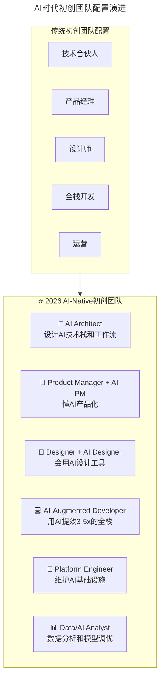
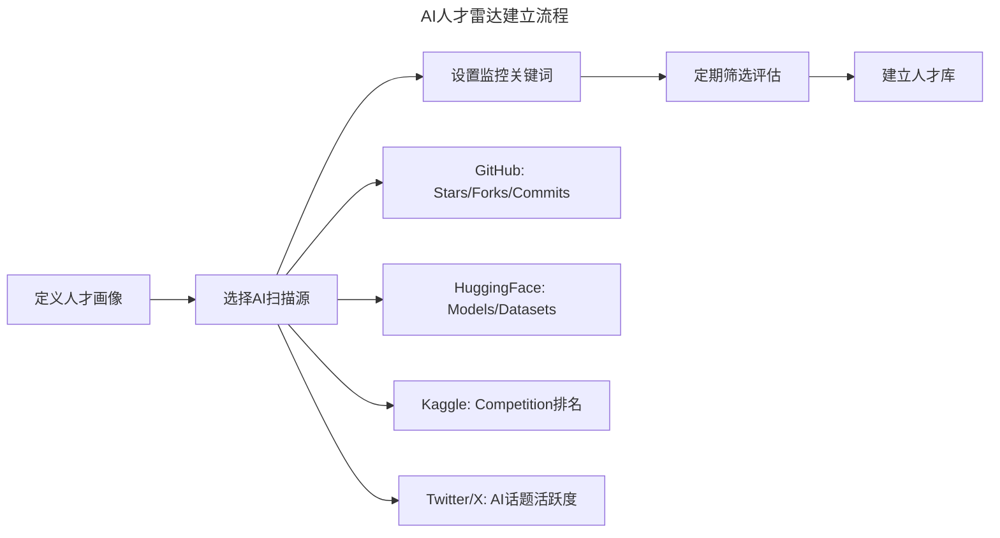
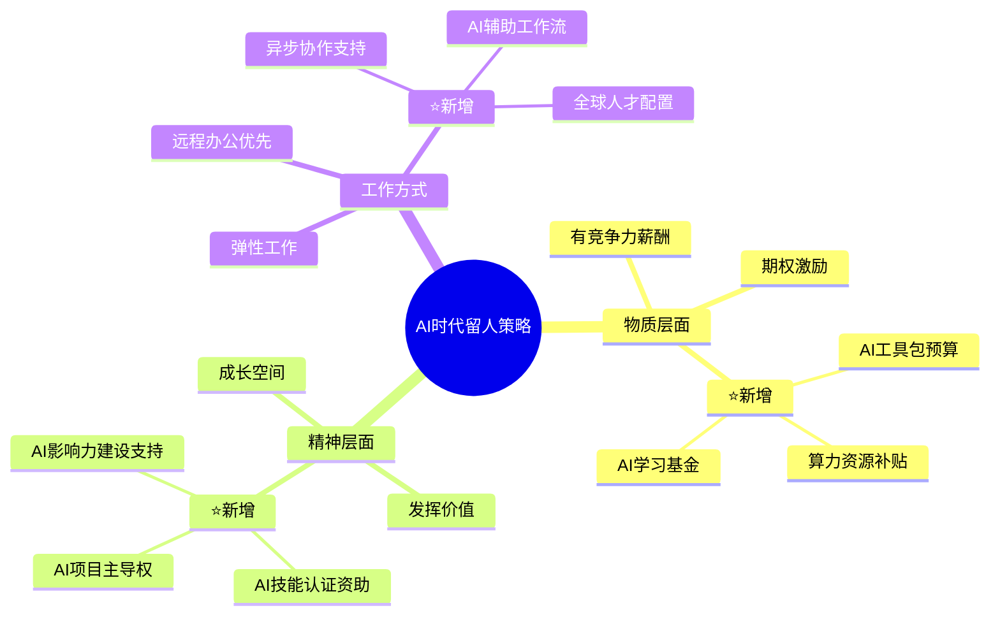

> **适用范围**：初创公司 CTO、技术负责人、团队搭建者
> **更新摘要**：v2 版本基于原文第 155 讲内容，保留全部原始内容并升级为 6 节结构；融入 2026 年 AI 时代注解，新增 AI-Native 初创团队配置模型、AI 人才雷达建立方法及 AI 时代留人策略升级。

---

# 第155讲 | 王可光：如何搭建初创团队之人才关

## 一、导言

你应该注意到了，我这里使用的是"找人"，而不是"招人"，"招人"只是一个人事部门流水线的动作，而"找人"最重要的就是这个"找"字，"找"在百度汉语中的解释是"为了要见到或得到所需求的人或事物而努力"，也就是你必须付出努力才会得到想要的人。

找人之前我们先聊聊多数初创公司的创立过程：即首先有好的产品创意，然后快速实现，再推向市场，最后不停迭代。前期就是大家常挂在嘴边的"我有个好点子，就差一个程序员了"，有了程序员之后产品需要快速上线，因为移动互联网时代有"唯快不破"的法则，所以前期找人也需要快，那如何找人呢？

> **⭐ 2026 年技术背景**：AI 时代初创团队的"找人"逻辑发生了根本变化——AI 工具让最低启动人数降低 30-50%，但每个人的 AI 能力要求大幅提升。找人不仅是找"人"，更是找"AI-Augmented 人才"。

---

## 二、核心方法论

### 2.1 找人的核心问题：需要什么样的人

首先，我们需要想清楚找人的核心问题是什么？是要明确到底需要什么样的人！如果团队里面没有一个懂技术的，那你最需要的是一个技术合伙人（找到这个人后，这篇文章剩下的内容就可以交给他看了）；如果没有一个人有产品思维，那你就需要找一个专业产品经理……

比如我们当时只是有一个初步的想法：要做澳门本地的 O2O 平台。但是这个想法要落地，就需要有专业的产品经理去梳理需求，同时还需要有专业的 APP 开发人员，所以当时思路很明确：服务端我自己来，再找一个产品经理、一个视觉设计师、一个 IOS 开发人员（经过调研澳门市场 IOS 和 Android 的比例约为 7:3，所以为了快速试错，前期战略性放弃 Android 用户）。总之一句话：找人之前先想好需要找什么样的人。

### 2.2 ⭐ 2026 AI-Native 初创团队人才地图



上述流程图展示了初创团队配置从传统模式向 AI-Native 模式的演进：传统团队需要技术合伙人、产品经理、设计师、全栈开发、运营等完整角色；AI 时代团队则新增 AI Architect、AI PM、AI Designer 等复合角色，每个人都需要具备 AI 协作能力。

#### ⭐ 2026 初创团队最小可行配置（MVP Team）

| 角色 | 传统要求 | ⭐ 2026 AI 增强版 | 人数 |
|-----|---------|----------------|------|
| **CTO/技术负责人** | 全栈能力 | **+ AI 架构设计能力** | 1 |
| **核心开发** | 熟练掌握技术栈 | **+ AI 工具熟练度 80%+** | 1-2 |
| **产品经理** | 需求分析能力 | **+ AI 产品思维** | 1 |
| **设计师** | UI/UX 设计能力 | **+ AI 设计工具（Midjourney 等）** | 0.5（可兼职） |
| **总计** | - | - | **3.5-4.5 人**（vs 传统 5-8 人） |

> **关键洞察**：AI 让初创团队的**最低启动人数降低了 30-50%**，但每个人的**AI 能力要求大幅提升**。

### 2.3 留人的核心理念

毛主席在《沁园春·雪》中写道，"一代天骄，成吉思汗，只识弯弓射大雕"，说的是成吉思汗只知道骑在马上打天下而不会治天下。我们辛辛苦苦把人招进来，如果留不住，那岂不是前功尽弃了？所以招人只是万里长征第一步，怎么留住人才更重要。

那么，怎么才能留住人呢？从马斯洛的需求层次理论就能窥其一二，人的需求无非是物质和精神两个层面的。

---

## 三、关键流程

### 3.1 找人方法：熟人圈最靠谱

其次，就是找人的方法；找核心员工最靠谱的方式是在熟人圈里面找到合适的人，靠谱的朋友推荐的人也可以，只要是能力和口碑俱佳的，碰到这种人，即使不能全职加入，兼职的方式也未尝不可，如果产品顺利，兼职的人后期自然而然就会转成全职了。

这里我大概介绍一下我们的产品澳覓 APP 第一版上线前的状态：当时核心成员都位于不同的城市，技术方面全职的人员只有我一个，我在南京；其他成员都是熟人推荐的非常靠谱的小伙伴：产品经理是微信资深产品经理兼职，位于广州；设计师是联想的设计师兼职，位于广州；IOS 开发是远光的开发兼职，位于珠海；而我们的创始人在澳门。就是这样一个分布在 4 个城市的松散组织，2 个半月完成了第一版 APP 上线；上线后运行效果非常好，随后兼职人员基本全部收编转为全职了。

另外，需要注意的是核心员工只要你认为值，真的可以不用太考虑成本，即使小公司也是一样，小公司前期更需要优秀的人。还是以我司为例：我们公司的架构师，当时我面试的时候就非常满意，再加上有百度大数据的背景，即使当时要求的薪资超出了我们的预算，而且这种情况下他还不是特别愿意加入，但我一点都没有犹豫，当即叫上了老板一起聊，最后用薪资+期权的模式敲定了，现在回过头来看，真的是超值，他给团队和公司带来的价值远远超出了我们付出的有限成本。

最后，核心人员搞定之后，其他成员的招聘主要交给各个小组的 leader 负责就可以了，我主要使用如下几个方式：

1. 充分放权，leader 可以有下属薪资定价权，当然超出范围的需要给出合理的理由；

2. 内推机制，从后面的实际情况来看内推的人真的更靠谱；

3. 宁缺毋滥，我们找的每一个人都是认真考量的，一定要认可公司文化和价值观。

#### ⭐ 2026 "熟人圈找人"的 AI 时代扩展

| 渠道类型 | 传统做法 | ⭐ 2026 AI 增强 |
|---------|---------|--------------|
| **前同事** | 微信私聊 | **+ LinkedIn AI 匹配推荐** |
| **校友圈** | 校友群发消息 | **+ 校友 AI 项目合作吸引** |
| **开源社区** | GitHub 关注 | **+ HuggingFace/Kaggle 人才挖掘** |
| **技术社群** | 线下 Meetup | **+ Discord/Slack AI 社群运营** |
| **AI 竞赛** | 无 | **⭐ 新增：Kaggle/天池获奖者直聘** |

#### ⭐ 2026 AI 人才雷达建立方法



上述流程图展示了 AI 人才雷达的建立步骤：从定义人才画像开始，选择 GitHub、HuggingFace、Kaggle、Twitter/X 等 AI 扫描源，设置监控关键词，定期筛选评估，最终建立人才库，实现被动招聘向主动挖掘的转变。

#### ⭐ 2026 "核心员工值得高薪"的 AI 时代诠释

| 投资维度 | 传统高薪理由 | ⭐ 2026 高薪新理由 |
|---------|------------|------------------|
| **稀缺性** | 经验丰富、能力强 | **+ 懂 AI 的复合型人才极度稀缺** |
| **杠杆效应** | 带动团队成长 | **+ 用 AI 将个人能力放大 10 倍** |
| **竞争壁垒** | 难以被替代 | **+ AI 能力构建护城河** |
| **速度优势** | 快速交付 | **+ AI 加速产品迭代周期** |

> **⭐ 2026 薪资公式调整**：
> ```
> 传统薪资 = 基础工资 × 经验系数 × 稀缺系数
>
> AI时代薪资 = 基础工资 × 经验系数 × 稀缺系数 × AI增效系数(1.5-3x)
> ```

### 3.2 留人方法：物质层面

先谈谈物质层面，就是一个字：钱。一般初创公司的薪资不会太高，希望用期权的方式留住人，但是经历了这几年互联网公司各种期权问题后，这个方式对于大部分员工已经失效了，因此，我们至少要提供和业内持平的薪资待遇，再辅以期权模式，效果会更佳。我一般会在每个季度考核结束后，组织主管 review 一遍产品和研发部门的人员结构以及薪资水平，适时调整员工的薪资，及时给予优秀员工奖金或期权奖励，每隔一年左右进行一次普调。

比如我们某部门有位主管，有次沟通的时候得知他个人认为以他的能力和目前的薪资是匹配的，薪资方面也不会有太大的提升了；但是我总觉得他最大的问题是责任心不够强，还有很大的提升空间，于是为了激发他的责任心，让他有更大的成长，沟通后的第二个月给他加薪了，并告诉他，"你的能力远比你想象中的要强，下一个版本由你来主负责"，他收到调薪邮件的时候很意外，还单独给我发微信说感谢对他的信任，然后在接下来的几个月，他经过引导，主动把控研发流程各个环节的进度，并积极带领同事解决之前版本的遗留问题，各方面的能力都有质的提升。可见物质层面需要及时奖励，也需要适时激励。

### 3.3 留人方法：精神层面

精神层面的范围就比较广一些，每个人都有被认可、被信任的需求，我们要尽量发挥每个成员的价值。我在写这篇文章时，先使用锤子便签列了提纲，恰好在便签中看到了自己在 2018 年第一次使用极客时间 APP 时摘录的德鲁克的一句话："组织的目的，就是让平凡的人做出不平凡的事"。组织最重要的特性就是用人所长，要充分发挥每个个体的价值，而个体价值的发挥又能反向促进个体对组织的认可。

记得公司某部门最初只有 1 个人，后来加入一位新成员，能力比较强，做事也比较踏实，但是因为有老员工在，做事情总是有些畏手畏脚不能施展他的能力，后来经过沟通，直接任命刚过试用期的新员工为部门主管，然后她渐渐开始放开手脚梳理流程、制定规范，目前管理一支近十人的团队游刃有余，她的部门也是目前最让我放心的一个部门。

#### ⭐ 2026 "留人"策略的 AI 升级



上述思维导图展示了 AI 时代留人策略的三层体系：物质层面在传统薪酬期权基础上新增 AI 工具包预算、算力资源补贴和 AI 学习基金；精神层面新增 AI 项目主导权、AI 影响力建设支持和 AI 技能认证资助；工作方式层面新增异步协作支持、全球人才配置和 AI 辅助工作流。

---

## 四、工具与实战

### 4.1 初创团队 AI 人才配置 SOP

1. **Day 0-30（组建期）**：
   - 明确团队的 AI 成熟度目标（Level 1-4）
   - 核心岗位 JD 中加入 AI 能力要求
   - 准备 AI 实操面试题

2. **Day 31-90（磨合期）**：
   - 统一团队 AI 工具栈（避免碎片化）
   - 建立 AI Best Practices 文档
   - 启动每周 AI 分享会

3. **Day 91+（增长期）**：
   - 引入 AI 绩效指标（增效倍数）
   - 设计 AI 技能晋升通道
   - 打造 AI 雇主品牌

### 4.2 AI 人才吸引力 Checklist

- [ ] 公司官网展示 AI 项目/技术栈
- [ ] 团队成员有 GitHub/HuggingFace 活跃账号
- [ ] 提供具体的 AI 工具订阅列表
- [ ] 有清晰的 AI 学习和发展路径
- [ ] 参与或主办过 AI 相关活动

### 4.3 创业公司 CTO 的 AI 能力自检清单

- [ ] 我是否每天使用 AI 工具辅助工作？（GPT-5.5/Copilot/Cursor）
- [ ] 我是否了解主流 AI 工具生态及其适用场景？
- [ ] 我能否为团队制定清晰的 AI 采用路线图？
- [ ] 我是否在用 AI 案例吸引和说服候选人？
- [ ] 我是否建立了团队的 AI 学习和分享机制？

---

## 五、常见误区

### 5.1 误区：找人前未想清楚需要什么样的人

- **误区**：盲目招人，没有明确的人才需求画像
- **正确做法**：先想好需要找什么样的人——技术合伙人？产品经理？开发？明确后再行动

### 5.2 误区：核心员工过度考虑成本

- **误区**：小公司前期不舍得在核心人才上投入
- **正确做法**：核心员工只要认为值，真的可以不用太考虑成本，小公司前期更需要优秀的人

### 5.3 误区：期权万能论

- **误区**：低薪+期权就能留住人才
- **正确做法**：至少提供业内持平的薪资待遇，再辅以期权模式，效果更佳

### 5.4 ⭐ 2026 误区：忽视 AI 能力要求

- **误区**：仍按传统标准招人，忽视 AI 协作能力
- **正确做法**：在核心岗位 JD 中加入 AI 能力要求，将 AI 工具熟练度作为关键评估维度

---

## 六、进阶延展

### 6.1 管理者建议

今天主要分享了初创团队找人与留人方面的经验，这些年，我自己对于技术管理有几点感悟，或者说是对技术领导者的几点建议，也在此分享一下，希望能给你带来新的思考。

1. **服务思维**：很多时候领导就是团队的粘合剂，要有为团队服务的意识；

2. **全局观念**：要站在更高层次看待问题，不断引进比我们更优秀的人加入公司，学会"像 CEO 一样思考"；

3. **不断学习**：随着公司业务拓展，对各种能力的要求也越来越高，技术管理者也需要与时俱进，不断学习充电，比如订阅极客时间专栏、加入 TGO 鲲鹏会，就是非常好的学习方式。

| 原始建议 | ⭐ 2026 AI 时代解读 |
|---------|------------------|
| **服务思维** | **+ 为团队提供 AI 工具和服务，消除使用障碍** |
| **全局观念** | **+ 从 AI 战略高度思考团队配置和技术选型** |
| **不断学习** | **+ 个人必须率先掌握 AI 工具，成为 AI 实践者** |

### 6.2 作者简介

王可光，澳门网络传媒发展有限公司技术总监、TGO 南京会员，有着 10 余年技术研发、团队管理经验，2016 年联合创办珠海市蜜瓜科技有限公司和澳门新鲜生活科技有限公司两家企业，依托国内技术力量，从事澳门市场智慧生活等方面产品的研发和推广业务，目前公司已成为澳门地区移动互联网方面的领军企业。

### 6.3 关键洞察

> **王可光老师的"找熟人、重核心、敢投入"原则在 AI 时代依然有效，但需要加上"AI 滤镜"**：
>
> - **找熟人** → 找**AI 圈子的熟人**（Discord、HuggingFace 社区）
> - **重核心** → 重**AI 能力强的核心**（一个人顶过去三个）
> - **敢投入** → 敢投入**AI 基础设施**（工具、算力、培训）
>
> **AI 时代的初创团队竞争，本质上是"AI 人才密度"的竞争。**

### 6.4 延伸思考

- 初创团队的"找人 vs 招人"理念在 AI 时代需要升级为"找 AI-Augmented 人才"
- 熟人圈找人的半径因 AI 社区（HuggingFace、Kaggle、Discord）而大幅扩展
- 物质留人策略需新增 AI 工具包预算和算力资源补贴
- 精神留人策略需新增 AI 项目主导权和 AI 影响力建设支持

---

*本注解基于 2026 年 6 月技术环境生成，结合 Agent 加速落地期、84% 开发者用 AI 编程等行业动态。*