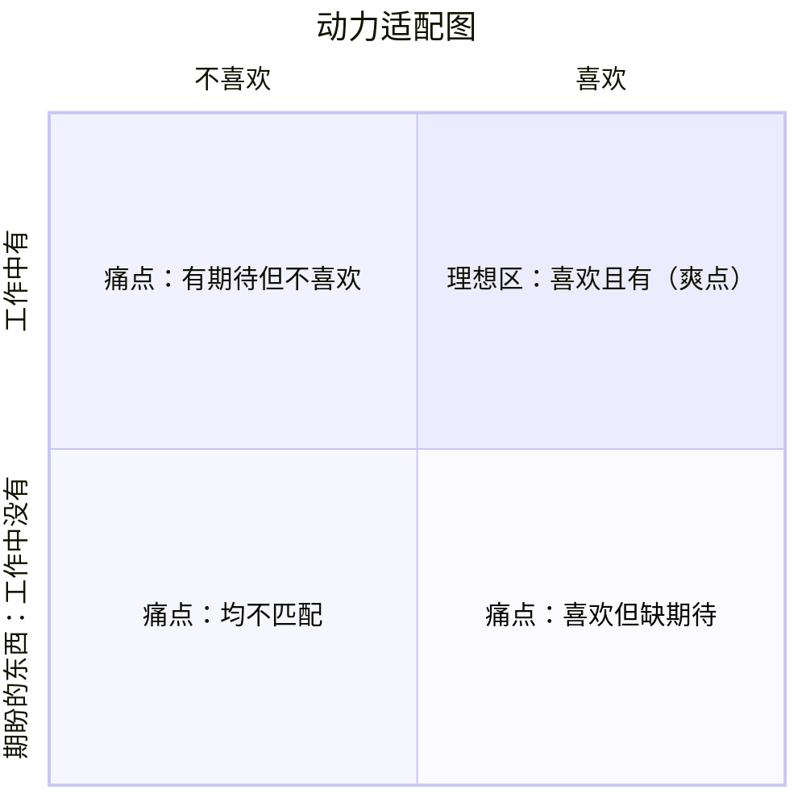
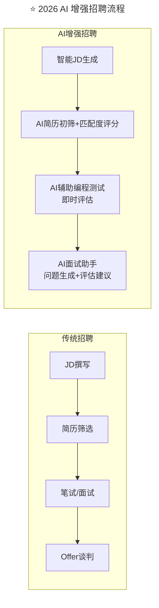

> **适用范围**：CTO、技术团队管理者、招聘负责人
> **更新摘要**：v2 版本基于原文第 90 讲内容，保留全部原始内容并升级为 6 节结构；融入 2026 年 AI 时代注解，新增 AI 增强招聘流程、AI 时代新增评估维度及面试新题示例。

---

# 第90讲 | 程军：打造高效技术团队之招人

## 一、导言

每一个人心中都有偶像，我的偶像是乔峰和李小龙。

从乔峰那里我学到了铁汉柔情、处事侠义、国家问题大于一切，回忆其中的情节，依然会被那种义薄云天的气概、那种大碗喝酒的豪爽触动，感到痛快不已。

李小龙，我之所以崇拜他，并不只是因为他武功高强，还在于他对武术的不断追求，他学习各类武术，汲取各家之长，从中国武术到世界武术，最终融合形成自己的"截拳道"。

很显然我的偶像都是集大成者，是杰出并且成功的。从他们身上，我找到了成功的因素：对已选择目标的坚持（称之为"行"）和达成目标后的认知升级（称之为"知"），我将其称为知行合一。

回到今天的话题，如何从 0 到 1 打造高效技术团队？在我的实践中，最关键的就是要做好两件事：招人和做事。虽然老生常谈，但却至关重要。今天我主要跟你聊聊招人这件事。

> **⭐ 2026 年技术背景**：AI 时代招聘的本质没变——找到对的人，但方法需要升级。AI 对招聘流程的影响覆盖 JD 撰写、简历筛选、面试评估全链路。

---

## 二、核心方法论

### 2.1 识人模型：知识、经验、能力、动力

这是一个经久不衰的话题，从三国中的"刘关张"团队到西游记中的"西天取经"团队，不难发现，招人并选择合适的人是一个团队成功的关键因素之一。而具体到互联网行业怎么去招人，我认为两个最核心的因素是招聘渠道和识人。

谈到识人，各位都有自己的见解和做法，我也来先跟你分享一个识人的模型，这个模型主要分为知识、经验、能力、动力四个模块。

#### 识人的第一步，看知识和经验

这两个模块都可以很容易的从候选人的简历和自我介绍中判断出来，并不难。比如你想找一个高级软件工程师，具体的数据库索引怎么设计，简单的算法和数据结构理论就是知识，做了两个实际的软件项目并且有一定的业务量就叫经验。

#### 识人的第二步，看能力，以及他未来能做什么

这个一般都需要多轮现场面试来判断，墨子曾经说过，听其言，迹其行，察其所能，即通过判断对方的过去行为，来推测他的能力。

那具体该怎么做呢？这里推荐一个模型——STAR 法则：

- **S** 是 Situation，即情况
- **T** 是 Task，即任务
- **A** 是 Action，即行动
- **R** 是 Result，即结果

这几点是我们在面谈中需要重点考察的，即"在什么情况下/什么任务中 → 候选人做了什么 → 带来什么结果"。

#### 识人的第三步，看动力

那如何判断候选人是否有动力呢？这个动力本身就是如何自我说服换工作的内因，你应该见到过候选人换工作是因为女朋友异地恋的事吧。我一般会从三个框架去判断：

1. **职位是否适配**：也就是岗位的工作领域和职责，与候选人的个人爱好是否吻合，以及工作本身是否令人满意甚至愉悦。
2. **组织适配**：也就是组织的运作模式和价值观所营造的工作环境和氛围与候选人的个人喜好的适配度。
3. **地点适配**：也就是工作或者组织的工作地点，与候选人的个人喜好是否匹配。

### 2.2 ⭐ 2026 新增评估维度

| 维度 | 传统评估 | 2026 年新增 |
|-----|---------|----------|
| 技术能力 | 算法/项目经验 | +AI 协作能力、Prompt 质量 |
| 学习能力 | 技术成长曲线 | +AI 工具上手速度 |
| 创造力 | 开源贡献/创新项目 | +AI 应用创新能力 |
| 文化匹配 | 价值观认同 | +AI 伦理意识 |

---

## 三、关键流程

### 3.1 招聘渠道分类

我的做法是先把需求分类，一般分为核心骨干、高潜骨干、一线员工这三类，然后根据招聘规划列出总人数和分批的需求时间节点。

**一线员工**可以去 boss 直聘等招聘网站，效果比较好，注意多平等沟通、多研究这类网站的攻略，就可以花更少的钱达到更好的效果。

通常，找到心仪的人才后，我会先简单问候，再添加微信，从他的朋友圈观察他是怎么样的人，然后找到彼此可聊的话题，并发掘他想要的东西，而这些恰好你能给的。

**核心骨干和高潜骨干**，建议还是通过我们的人脉或朋友推荐比较靠谱。因为这类人才都不缺工作机会，缺的是一个适合自己的机会。

对于**高潜骨干**，我们还可以通过猎头渠道从对手公司寻找，有时候会有非常不错的收获。

### 3.2 动力适配图

下面这个动力适配图可以清晰的说明我的观点，图中，横轴描述的是候选人对工作的喜好程度，从不喜欢到喜欢，纵轴描述的是候选人期待的东西工作中有没有，从工作中没有到工作中有。

比如，第二象限的工作中有候选人期盼的东西，但他不喜欢这份工作，和第四象限的候选人喜欢这份工作，但工作中没有他期盼的东西，这两种情况都会导致候选人不开心，也就是他的痛点。我们就按照这张图找出这些痛点并且视情况满足他，直到他感觉到爽点。

### 3.3 ⭐ 2026 AI 增强招聘流程

上述流程图对比了传统招聘与 AI 增强招聘的流程差异：传统招聘从 JD 撰写到 Offer 谈判全靠人工；AI 增强招聘在每个环节引入 AI 辅助——智能 JD 生成、AI 简历初筛与匹配度评分、AI 辅助编程测试即时评估、AI 面试助手生成问题和评估建议，大幅提升招聘效率。

### 3.4 猎头渠道的三点建议

1. 一定要找 2 家或 3 家适合自己的猎头公司，向猎头顾问讲清楚你的需求，并且定期 review 结果、反思过程，并落实改进方案。
2. 猎头公司并不是越大越好，有时候公司小一点，但对方的专业度和资源投入度都足够的话，也是非常不错的选择。
3. 建议扩大选择范围，不要把目光只放在竞品公司，思路开阔一些，办法就会更多一些。

---

## 四、工具与实战

### 4.1 STAR 法则实践

通常，候选人说一个观点或者结果的时候，你不但要让他举一个具体的例子，还要让他说出来当时这么做的优点，以及带来的问题。

因为这个世界是辩证的，每一种技术方案或者管理方法都有其优缺点，如果一个人说不出原委，或者你们聊的不透彻不痛快，那只能说明他从来没有认真思考过，或者即使思考了也深度有限，那就显而易见，对方并不是一个非常有能力的人。

### 4.2 动力适配图应用

这个理论还可以推广到日常的团队管理中：找出团队成员的痛点和爽点，视情况满足他。

### 4.3 ⭐ 2026 面试新题示例

1. "描述一个你用 AI 辅助解决复杂问题的案例"
2. "你认为 AI 生成的代码有什么风险？如何应对？"
3. "你如何看待人与 AI 在团队中的分工？"

---

## 五、常见误区

### 5.1 无效的 STAR

还有一些候选人会做假设，比如"如果我是什么什么，我就能做到怎样怎样"，这些没有任何用，是无效的 STAR。当我们遇到这种情况时，就要让他具体化、典型化并可量化，从而避免一些模糊、主观、假设或者不具体的 STAR。

### 5.2 猎头选择误区

- **误区**：猎头公司越大越好
- **正确做法**：关注专业度和资源投入度，小公司有时反而更好

### 5.3 招聘范围过窄

- **误区**：只把目光放在竞品公司
- **正确做法**：扩大选择范围，思路开阔一些

---

## 六、进阶延展

### 6.1 核心原则回顾

1. **明确岗位需求**：技能要求 + 文化匹配
2. **多渠道获取简历**：内推、猎头、校招、社招
3. **科学面试流程**：多轮面试、综合评估
4. **关注潜力**：学习能力比现有能力更重要

### 6.2 核心总结

招到优秀的人才只是第一步，更重要的是如何让这些人才在团队中发挥价值，持续成长，这需要我们在团队管理、文化建设等方面持续投入。

> **招聘的本质没变——找到对的人，但方法需要升级。**

### 6.3 作者简介

程军，现任贝壳技术总监，曾任饿了么技术总监、1 号店架构师，10 年以上互联网开发经验，8 年以上技术管理经验。

### 6.4 延伸思考

- 识人模型从四模块（知识/经验/能力/动力）扩展，需加入 AI 协作能力评估
- 招聘渠道在 AI 时代新增 AI 垂直平台（PromptBase、Hugging Face 等）
- STAR 法则在 AI 时代需增加 AI 使用场景的追问
- 动力适配图可扩展加入"AI 工具选择权"作为新的动力维度