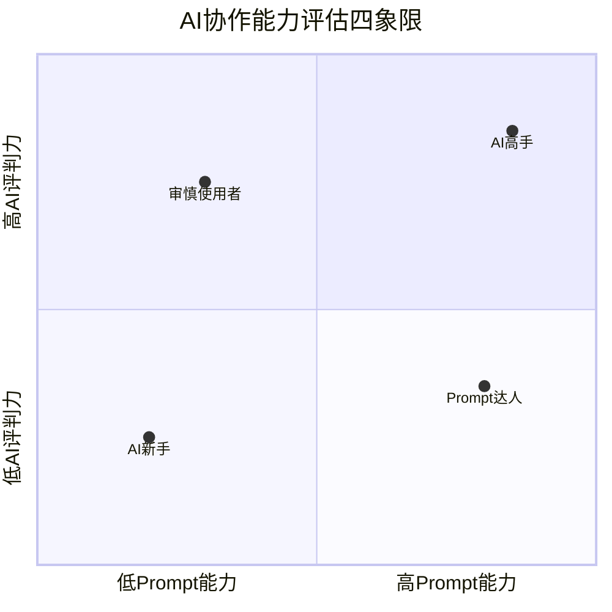
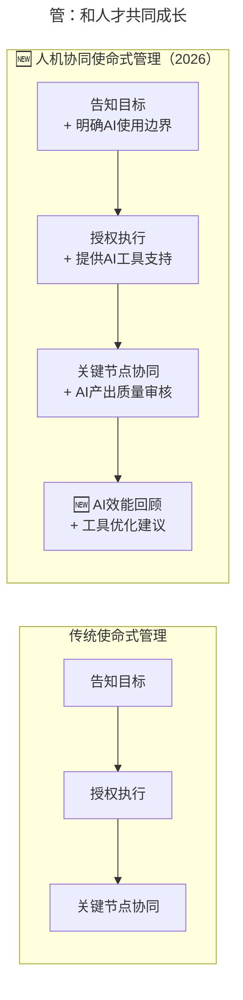

> **适用范围**：CTO、技术VP、工程总监、团队Leader
> **更新摘要**：v2 版本基于原文第 20 讲内容，保留全部原始内容并升级为 6 节结构；融入 2026 年 AI 时代注解，新增 AI 时代"招识管留开"五字诀的全面升级、AI 协作能力评估四象限、人机协同使命式管理及 AI 时代留才策略。

---

# 第20讲 | 论团队管理与共同升级

_**近两周，我们共同探讨了打造优秀的技术团队的一些经验，接下来几周，我们还会继续相关的话题。其实，不管是招聘、培训、考核还是激励等等，归根结底考验的是团队负责人的"人员管理能力"。**_

## 一、导言

_**此前，易观CTO郭炜在"技术管理核心能力"系列文章中，已经分析了"领导力"和"体系搭建能力"，今天我们就来一起听一听，郭炜对于"人员管理能力"的分析。以下为正文内容：**_

所有企业管理的问题都是"人"的问题，人就是一个企业的竞争优势。在写作本文时，我思考了半天用什么词来讲"人"的问题，用"管理"这个词并不合适，卓越的人才其实是"自我驱动"，而不是仅仅需要被"管理"的，所以加入了"共同升级"一词。

> **⭐ 2026 年技术背景**：2026年，原文提出的"招、识、管、留、开"五字诀依然有效，但每一个环节都被AI深刻改变。**84%的开发者使用AI编程工具**意味着：
> - **招**：候选人评估需要增加AI能力维度
> - **识**：人才标准需要扩展AI协作能力
> - **管**：管理模式需要适配人机协同
> - **留**：员工诉求中增加了AI成长空间
> - **开**：淘汰标准需要考虑AI适应能力
>
> 更重要的是，**"共同升级"有了新的含义——不仅是人与公司共同升级，更是人与AI共同升级**。

---

## 二、核心方法论

### 2.1 企业是"原则"构成的生机型组织

在《原则》当中有这样一张图，有效的说明了一个企业其实就是一个从设定目标到实现最终结果的机器，这个机器是由一些"原则"组成。而执行就是由"文化"和"人"来做到的，人本身也是由文化和制定的原则来影响的，卓越的人才对卓越的文化体系有一个正反馈，对公司本身的原则也是一个正反馈，最后与公司"共同升级"。

公司并不是僵化、一成不变的，而是一个由"原则"构成的生机型组织，这也是现代企业必备的生存和竞争技能。所以，人员是一个科技企业和技术团队最重要的核心资产，如何让这些特别聪明甚至"傲娇"的技术人才可以在一起高效的工作，对这些聪明人如何招、识、管、留、开，是一个技术管理者的核心技能。

### 2.2 识：价值观 >>> 学习能力 >> 技术技能

先考察一个人的价值观，因为这是一个人最难改变的。一个优秀的技术人才是否认同公司的MTP（MTP，Massive Transformation Purpose 参见《How Google Works》），是否认同公司的使命和顶层设计，通俗化讲，你所招聘的员工信不信这个公司或者部门能把事情做成。

这也是我为什么坚持终面所有人都要我亲自面试一次的原因，此时不会再考量这个人的技术技能细节，而是"闻味"，看他是否和我们团队的价值观和公司的价值观一致。

其次是看一个人的学习能力，这可以从人才的简历看出来，也可以从人员的经历以及他问的问题和回答问题的情况看出来。一个优秀的技术人员，现在会什么其实并不是那么的重要，而是他是否有潜力可以学习更多的东西。在技术领域里，没有一成不变的东西，一个新技术，往往1、2年就过时了，能不能快速学习迭代自己的技术，快速适应公司业务的变化，往往是一个人才自己最重要的素质。

最后再看技术技能，在价值观和学习能力都OK的情况下，技术能力好的人才，可以节约你培养的时间，可以快速上手。

#### ⭐ AI 时代人才标准升级

原文提出"价值观>>>学习能力>>技术技能"的优先级。在2026年，这个公式需要扩展：

```
价值观 >>> 学习能力 >> AI协作能力 >> 技术技能
```



上述四象限图按 Prompt 能力和 AI 评判力两个维度，将人才划分为 AI 新手（两项均低）、AI 高手（两项均高）、Prompt 达人（Prompt 强但评判力待提升）和审慎使用者（Prompt 待提升但评判力强）四种类型，帮助管理者根据不同岗位需求匹配人才。

| 象限 | 特征 | 适用岗位建议 |
|------|------|-------------|
| **AI高手** | Prompt能力强+评判力强 | **Tech Lead、架构师、AI Platform Engineer** |
| **Prompt达人** | Prompt强+评判力待提升 | **高级工程师、全栈开发** |
| **审慎使用者** | Prompt待提升+评判力强 | **资深工程师、Code Reviewer** |
| **AI新手** | 两项均待提升 | **初中级工程师（重点培养对象）** |

---

## 三、关键流程

### 3.1 招：人才招聘

对于科技企业，招贤纳士是每一个技术管理者最头疼的问题，一个CTO往往会花50%以上的时间用来找人。但是，招聘其实不是一个单点问题，招不到合适人才，并不是招聘体系出了问题，招聘是一个企业的技术品牌、技术文化、技术薪酬体系的综合产物，只靠钱是买不来人才的，我一直坚守着的原则是只有将心比心、诚心求才，才可以换来高质量、忠诚的员工。

**技术品牌**：技术品牌上技术人员是否认为你所在的企业是一个有技术发展潜力的企业，自己在加盟企业的过程中，除了待遇，是否可以学到东西有成长空间，将来离开企业是否会对自己未来的职业生涯有正向影响。

**技术文化**：技术文化是技术最高管理者和公司共同营造的核心技术竞争力，看上去非常虚无，但是一个公司重要人才的流失、招聘不利，往往是公司的文化和所需要人才的不匹配造成的。

**技术薪酬体系**：整体上需要构建和市场接轨的薪酬体系以迅速扩张团队，在团队构建初期以期权和现金的模式吸引高级技术人才，中期以高于市场同等价位迅速扩张，迅速淘汰保留优秀的中层人才；长期通过异地研发中心等方式拉平整体研发成本，提高整体技术团队ROI。

关于招聘，最后还有一句话，高级人才的招聘要高级技术管理者自己亲自上阵，三顾茅庐，将心比心、诚心求才才可以成功。对于高级技术管理者，招聘，并不是人力的事情，而是自己的事情。

#### ⭐ AI 时代的技术品牌化

| 品牌维度 | 传统内容 | 🆕 2026新增 |
|----------|---------|------------|
| 技术影响力 | 开源项目、技术文章 | **AI开源贡献、Prompt开源库、Agent案例** |
| 学习成长 | 培训体系、晋升通道 | **AI工具栈、AI实验环境、AI创新基金** |
| 技术氛围 | 技术分享、Hackathon | **AI竞赛、Prompt Engineering大赛、Agent Day** |
| 行业地位 | 行业排名、客户案例 | **AI应用落地案例、AI治理最佳实践** |

### 3.2 管：和人才共同成长

首先我的管理理念是精英团队理念，也就是所有的团队成员一定是由精英构成的团队，哪怕团队规模小一些，也不会有鱼目混珠的成员在其中混事。

这里需要和大家分享的观点是用"使命式"管理，而不是用"命令式"管理。使命式管理含义就是告诉大家要做什么，目标是什么，为什么要这样做，让大家理解我们的使命是什么，而权力和决策下放到具体执行层面，只在关键点上进行协同。

使命式管理，是坚定的把"人"放在核心位置上，每一个员工是否愿意承担责任，上级领导是否愿意支持下属的决定，对善意的错误是否可以容忍。

#### ⭐ 从使命式管理到"人机协同使命式管理"



上述流程图对比了传统使命式管理（告知目标→授权执行→关键节点协同）与人机协同使命式管理（告知目标+AI边界→授权执行+AI工具支持→关键协同+AI产出审核→AI效能回顾+工具优化），后者在人机协作维度进行了全面扩展。

| 原则 | 具体做法 |
|------|---------|
| **目标清晰** | 不仅说清楚做什么，还要说清楚**哪些环节可以用AI** |
| **充分授权** | 授权包括**选择AI工具的权利**和**决定AI使用程度的权利** |
| **容忍善意错误** | 包括**AI使用过程中的探索性失败** |
| **关键协同** | 在**AI产出的审核节点**加强协同，而非全程监控 |

### 3.3 留：评估和挽留人才

挽留人才是在"管"这个阶段管理没有做到位的体现，往往是一线管理者或者团队使命出现问题，才会进入"留"这个环节。一般提出分手的员工，需要从他的需求来做分析。马斯洛的需求理论在这里可以发挥出比较大的作用。

#### ⭐ AI 时代的留人策略

| 员工类型 | 主要诉求 | 挽留策略 |
|----------|---------|---------|
| **技术追求者** | 接触最新AI技术 | 提供**AI探索时间和预算**，允许尝试新工具 |
| **效率追求者** | 用AI提升产出 | 提供**顶级AI工具**，消除使用障碍 |
| **成长追求者** | AI能力提升 | 提供**系统性AI培训**和**认证支持** |
| **影响追求者** | AI领域的影响力 | 支持**开源、分享、演讲**等外部影响力建设 |

### 3.4 开：和人才友好分手

开有两个含义，一个是管理者要在每隔一段时间，例如半年，评估一下所有的员工，把他们和市场上的资源相比，重新招聘一次，这个员工是否还值得。

另一个含义，开，是针对触犯公司文化、原则红线，或者持续无法跟上公司节奏的员工进行的处理。没有开过员工的管理者不是好的管理者。"慈不掌兵"，在开人这件事情上，高级管理者不要过于犹豫。

#### ⭐ 半年"重新招聘"的 AI 版本

| 评估维度 | 权重（2026） | 具体指标 |
|----------|-------------|---------|
| 工作业绩 | 40% | 项目交付、质量、效率 |
| **🆕 AI协作能力** | **20%** | **AI工具使用率、AI产出质量、Prompt能力** |
| 学习成长 | 20% | 新技能掌握、分享贡献 |
| 文化契合 | 15% | 价值观践行、团队协作 |
| **🆕 AI适应速度** | **5%** | **学习新AI工具的速度和意愿** |

---

## 四、工具与实战

### 4.1 面试中的 AI 能力考察方法

1. **Prompt测试**：给出一个复杂任务，观察其提示词设计思路
2. **AI输出审查**：提供一段AI生成的代码，让其找出问题
3. **工具使用调研**：询问其日常使用的AI工具及使用场景
4. **AI伦理判断**：给出AI使用的两难场景，观察其判断

### 4.2 需要关注的 AI 相关红旗信号

1. **拒绝使用AI工具**且无法合理解释
2. **AI安全违规**（如泄露代码给公开AI）
3. **过度依赖AI导致核心能力退化**
4. **阻碍团队AI转型**，散布负面言论

### 4.3 AI 时代人员管理 Checklist

- [ ] 更新**人才画像**，加入AI协作能力维度（权重建议20%）
- [ ] 优化**面试流程**，增加AI能力测试环节
- [ ] 制定**AI工具使用政策**，平衡自由与规范
- [ ] 设立**AI贡献认定机制**，让AI付出被看见
- [ ] 将**AI适应能力**纳入半年评估
- [ ] 建立**AI转型支持计划**，帮助落后员工跟上节奏
- [ ] 定期进行**AI满意度调研**，了解团队AI使用痛点

---

## 五、常见误区

### 陷阱 1：用AI替代人文关怀

- **错误**：认为有了AI工具就不需要关心员工
- **现实**：**AI越强大，人的情感需求越重要**

### 陷阱 2：AI能力成为唯一标准

- **错误**：只看AI工具用得好不好
- **对策**：**AI是放大器，基础能力和价值观依然是根本**

### 陷阱 3：忽视AI带来的职业焦虑

- **现象**：员工担心被AI取代
- **对策**：**透明沟通AI战略，提供转岗和再培训机会**

### 陷阱 4：命令式管理阻碍人才成长

- **现象**：用传统项目制细分WBS，把每个人每天要做的事情全部细分下去
- **对策**：使命式管理，把权力和决策下放到具体执行层面

### 陷阱 5：招聘时只看技术技能

- **现象**：为了快速上手，招聘大量技术技能不错而价值观、学习能力不行的成员
- **对策**：坚持价值观>>>学习能力>>AI协作能力>>技术技能的优先级

---

## 六、进阶延展

### 总结

人是最复杂的动物，对于人员的管理和共同成长，是一个技术管理者毕生都需要研习的课程。究竟最终所有的生机型企业都是由精英人才构成的系统。

判断一个团队的技术管理者是否做好了人才管理，其实可以用一个很简单的问题来验证，你的精英是否愿意推荐他周围精英加入到你的公司，如果大多数精英愿意这么做，那么你的人才管理是有效的。

"人在地失，人地皆得；人失地在，人地皆失"。人，才是一个企业的竞争优势。

> **⭐ 一句话总结（2026版）**：
> "招、识、管、留、开"的五字诀没有变，但**每一个字的内涵都因AI而丰富**。2026年的人员管理 = **传统的识人断事能力 + AI时代的工具思维 + 对人机协同的深刻理解**。最重要的是：**AI时代，"人"的价值不是被稀释了，而是被重新定义了——从"执行者"升级为"判断者和设计者"**。管理者要做的，是帮助每个人完成这个升级。

### 作者简介

郭炜，易观CTO，中国软件行业协会智能应用服务分会副主任委员，TGO鲲鹏会北京分会董事会会长。负责构建易观技术团队、完成易观大数据采集、平台、数据挖掘等技术架构与体系；从无到有完成易观混合云的搭建、以及易观SDK的升级，并发布易观秒算实时计算平台。目前易观大数据平台日处理数据量30T，272亿条，月活用户5.5亿。