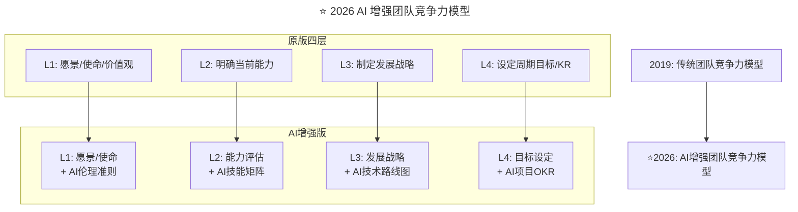

> **适用范围**：CTO、技术总监、Tech Lead、团队管理者
> **更新摘要**：v2 版本基于原文第 186 讲内容（上+下篇），保留全部原始内容并升级为 6 节结构；融入 2026 年 AI 时代注解，新增 AI 增强团队竞争力模型、AI 技能矩阵评估体系及"先问 AI，再决定 Buy/Borrow"新原则。

---

# 第186讲 | 赵晓光：如何培养团队竞争力

## 一、导言

我认为，首先，能力是指一个人或者一个团队保证工作成效，能正确执行工作任务的技能、知识、经验以及行为，并且这些都是可以论证且有因果关系的。我们经常讲知识就是力量，知识就是能力的一部分，而经验也可当作知识，但只有知识加上行动才是能力的体现。

其次，竞争力是能力的升级版或者专业版，更加注重于如何完成特定任务的能力。竞争力是指在完成具体任务时所体现的能力，如果抛开具体的任务，是无法谈竞争力的。

> **⭐ 2026 年技术背景**：赵晓光老师提出的"团队竞争力培养框架"在 AI 时代需要加入全新的能力维度——AI 协作竞争力。84% 开发者日常使用 AI 编程工具，竞争力的定义从"个人技术能力"扩展到"人机协同能力"。

---

## 二、核心方法论

### 2.1 竞争力的特点

无论能力还是竞争力，都有如下特点：

1. **需要针对特定任务**：对于不同的工作任务，竞争力的要求是不一样的
2. **可重复**：竞争力是保证我们所执行的工作能够完成的必要条件，并且要正确，有效率。如果只是勉强可以维持，错误百出，则不能称之为能力
3. **有显著的因果关系**：竞争力是可以被显著的因果关系论证的

### 2.2 团队竞争力培养的关键因素：四层模型

对于任何一个团队，在团队竞争力培养的这件事上，首先要有明确的定位，大致可以分为四个层面：

1. 明确团队的愿景、使命、价值观
2. 明确团队当前的能力
3. 制定发展战略
4. 设定周期性目标以及关键结果

### 2.3 ⭐ 2026 AI 增强团队竞争力模型



上述流程图展示了从传统四层竞争力模型到 AI 增强版的演进：每一层都注入了 AI 时代新内涵——愿景层增加 AI 伦理准则、能力评估层增加 AI 技能矩阵、发展战略层增加 AI 技术路线图、目标设定层增加 AI 项目 OKR。

### 2.4 明确团队的愿景、使命以及价值观

愿景、使命和价值观被称为团队核心三要素，是团队竞争力的基础。理想的团队应该有共同的价值观，为了共同目标在一起努力奋斗。

在团队确定三要素的过程中，团队成员可以通过德尔菲法来逐步明确价值观，也就是征求所有团队成员的意见，进行整理、归纳、统计，再匿名反馈给各个团队成员，再次征求意见，再集中，再反馈，直到最终获得一致。

#### L1 升级：愿景/使命/价值观 + AI 伦理

```
团队愿景示例（AI版）：
"成为行业领先的AI-Native技术团队，
 用人机协作创造10倍价值，
 同时坚守AI伦理底线。"

新增价值观：
├── AI透明度：明确标注AI生成内容
├── 人机协同：AI辅助而非替代人类
├── 持续学习：拥抱AI技术变革
└── 责任担当：对AI输出质量负责
```

---

## 三、关键流程

### 3.1 明确团队当前的能力：TRR/MRR 评估

明确团队能力一般需要周期性的评估，以自我评估为主。我所在的技术团队主要做两个方面的评估：管理资源回顾(MRR)和技术资源回顾(TRR)。

**管理资源回顾**主要是评估个人能力，一般需要自上而下来操作：被评估人在当前职位的水平如何？潜在的继任者是谁，能力如何？如何调整被评估人的职位？对不合格的人采取何种措施等。

**技术资源回顾**主要针对团队的技术能力进行评估，自下而上。在个人评估方面，一般是自评和团队负责人评估相结合。我的经验是采用 CDE 评级：C 指 Capable（基础级）、D 指 Developed（专业级）、E 指 Expert（专家级），还引入 X 表示不具备技能。为方便量化，C=1，D=3，E=5，X=0。

#### L2 升级：能力评估 + AI 技能矩阵

| 技能类别 | 具体技能 | 评级标准 (C/D/E/X) |
|---------|---------|-------------------|
| **核心编程** | TypeScript/Python/Rust | 同原文 |
| **AI 基础** | Prompt Engineering | C:能写简单 Prompt / E:能设计复杂 CoT |
| **AI 工具链** | Cursor/Copilot/v0 | C:会用 1 种 / E:精通 3+并能培训他人 |
| **AI 系统设计** | RAG/Agent/Multi-model | C:了解概念 / E:能独立架构 |
| **数据素养** | 数据分析/特征工程 | C:基本理解 / E:能指导团队 |
| **AI 伦理** | 偏见检测/合规 | C:有意识 / E:能制定规范 |

### 3.2 四象限技能分类法

按照技能获得难易度和对业务的影响力，对技能进行四象限分类：

- **第一象限：皇冠上的明珠**（Crown Jewels）— 高精尖技能，对公司业务发展很重要
- **第二象限：畅销技能**（Marketable Skills）— 对业务发展重要，但人才比较充裕
- **第三象限：基础技能**（Commodity Skills）— 技术人才多或掌握相对容易
- **第四象限：利基技能**（Niche Skills）— 非常难培养，目前满足小部分业务需求

#### ⭐ 2026 四象限更新

- "AI 相关技能"移入第一象限（皇冠明珠）
- "传统纯编码技能"降为第三象限（利基或基础）
- 新增"AI 协作软技能"维度

### 3.3 制定发展战略：Buy or Borrow

针对不同分类的技能所做的策略也不一样：

**高精尖技能**：通过组织内培养/培训或外部招聘（Buy），内部培养反而更好。

**畅销类技能**：通过项目实践来逐步培养，如果需求紧急可直接到市场上招聘。

**领先技能**：需要组织业务人员一起为技术团队找到更好的业务应用场景。

**基础技能**：可以通过外包或合同工的方式转移给第三方（Borrow）。

#### ⭐ 2026 新原则："先问 AI，再决定 Buy/Borrow"

```
传统流程：需要某技能 → Buy(招人) or Borrow(合作)
AI增强流程：需要某技能 → AI能做到多少？→ 剩余部分 → Buy or Borrow
```

### 3.4 设定周期性目标

竞争力培养是个长期的过程，需要定期的回顾并更新：

1. 长期目标设定为 2 年，对两年后要达到的指标进行量化（SMART）
2. 对两年的目标进行分解，分解为以半年为时间跨度的中期目标（半年后完成两年目标的 40%）
3. 继续对半年的目标进行分解，设立关键监测点来定期跟踪

---

## 四、工具与实战

### 4.1 FDP/IDP 培养计划

**着重培养 FDP**（focus development plan）：适用于被选出来的核心发展人员，需要和他的上级一起制定针对性的培养计划，要因材施教。

**普遍提高 IDP**（individual development plan）：适用于整个团队技能的革新，让基础技能逐渐退出，整个团队不断进行技能革新。

#### ⭐ 2026 新增 AI 相关目标

| 目标类型 | 传统 KPI | AI 时代新增 KPI |
|---------|--------|-----------------|
| **个人效能** | 任务完成率、代码质量 | **+AI 工具使用率、人机协作效率** |
| **团队能力** | 技能覆盖率、培训时长 | **+AI 技能成熟度、Prompt 质量评分** |
| **业务影响** | 交付速度、系统稳定性 | **+AI 驱动的创新项目数、AI 成本优化率** |

### 4.2 竞争力模型成熟度评估

类似于 CMMI，竞争力模型可以分为三个级别：

1. **发展级**：对重点核心工作岗位做出了定义，并与业务目标对应，但没有自动化程序执行
2. **标准级**：竞争力模型完全对应业务需要，具有一定伸缩性，大部分工作自动化或半自动化
3. **优化级**：完备的自动化竞争力模型，能预测未来发展并引领行业

#### ⭐ 2026 新增 AI 能力特征

| 级别 | AI 能力特征 |
|-----|----------|
| **发展级** | 少数人使用 AI 工具，无规范 |
| **标准级** | 大多数人使用 AI 工具有基本规范，有 AI 最佳实践库 |
| **优化级** | AI 深度融入所有工作流，持续优化人机协作模式，AI 驱动创新文化 |

### 4.3 ⭐ 2026 行动建议

#### 立即行动（本月）
1. ✅ 盘点团队 AI 技能现状，识别短板和长板
2. ✅ 制定 AI 培训计划，组织 Prompt Engineering 工作坊
3. ✅ 设立 AI 创新基金，鼓励团队尝试 AI 新工具/新场景

#### 短期规划（季度）
4. 📋 重构绩效评估体系，加入 AI 相关 KPI
5. 📋 建立 AI 知识管理体系，构建团队专属 AI 知识库
6. 📋 开展 AI 项目实战，选择 2-3 个适合 AI 增强的业务场景

---

## 五、常见误区

### 5.1 凭个人感觉打分

有些小组长会自以为已经很了解团队了，凭个人感觉打分，就很容易走入误区。正确做法是通过一对一的双向沟通来明确技能等级。

### 5.2 忽视单点故障（SPF）

如果发现单点故障 SPF，也就是说某个技能只有一个人会，那么必须立即采取行动，否则一旦出现 SPF 意外，会对整个组织造成非常大的影响。

### 5.3 按照原始目标一成不变

计划没有变化快，之所以设定定期的监测，就是为了便于快速而敏捷的对变化作出反应。技术团队要做的是及时调整计划，使之能够切实的支持业务发展。

### 5.4 ⭐ 2026 新增误区

- **误区**：忽视 AI 技能评估，只评估传统技术能力
- **正确做法**：在 TRR 中加入"AI 技能"维度，将 AI 工具使用纳入 IDP 必备项

---

## 六、进阶延展

### 6.1 关键数据参考（2026）

| 指标 | 行业平均 | 领先团队 | 差距 |
|------|---------|---------|------|
| 团队 AI 工具使用率 | 65% | **90%+** | 25% |
| AI 辅助后效率提升 | 30% | **50%+** | 20% |
| AI 项目成功率 | 60% | **85%+** | 25% |
| 团队成员 AI 培训覆盖 | 40% | **100%** | 60% |

### 6.2 ⭐ 2026 团队竞争力的终极公式

```
团队竞争力 = (传统技术能力 × 0.4) + (AI协作能力 × 0.4) + (学习创新能力 × 0.2)
```

### 6.3 核心观点总结

赵晓光老师提出的团队竞争力培养框架在 2026 年不仅依然有效，而且需要**注入 AI 时代的新内涵**：

1. **能力定义扩展**：从"个人技术能力"到**"人机协同能力"**
2. **评估体系升级**：CDE 评级需要**增加 AI 技能维度**
3. **培养模式革新**：从"师徒制"到**"AI 加速的学习型组织"**
4. **竞争优势转移**：从"拥有顶尖工程师"到**"拥有最强的人机协作系统"**

> **AI 不会让团队自动变强，善用 AI 的管理者才能打造 AI 时代的卓越团队。**

### 6.4 作者简介

赵晓光，TGO 鲲鹏会会员，目前在 Resideo Technologies, Inc. 担任 Fellow 及 IPA 技术总监，负责技术创新、平台以及架构方向，同时负责技术战略以及路线图，团队竞争力培养以及人员培养等工作。此前在霍尼韦尔担任 Fellow 及技术总监工作。在软件开发领域有丰富经验，获得 Leading SAFe, Exin Devops Master, CSSLP 及 PMP 认证。