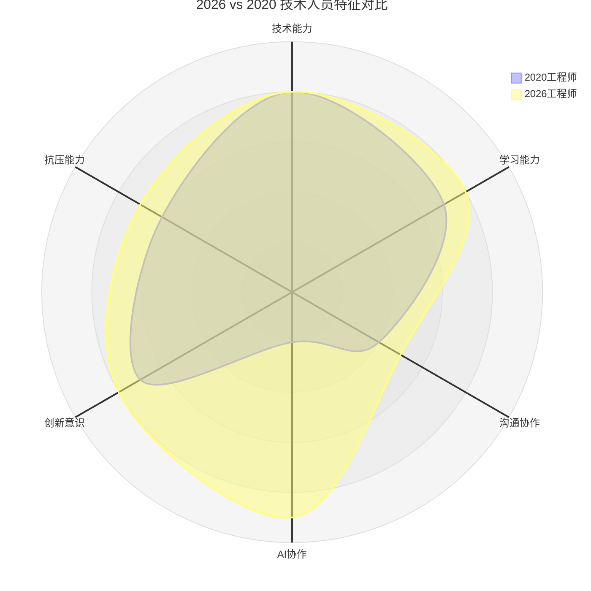

> **适用范围**：技术团队管理者、研发总监、工程经理
> **更新摘要**：v2 版本基于原文第 196 讲内容，保留全部原始内容并升级为 6 节结构；融入 2026 年 AI 时代注解，新增技术人员 AI 画像更新、人机混合团队管理策略及管理者 AI 能力自检清单。

---

# 第196讲 | 邱良军：关于做好技术团队管理的几点思考

## 一、导言

在打造高效技术团队之准备篇和招聘篇中，我们讲了对技术团队的基本认识和团队的招聘要点，今天我们继续聊聊打造高效技术团队时如何进行团队管理。

> **⭐ 2026 年技术背景**：2026 年，技术团队管理面临全新挑战——团队成员结构变为"人类+Agent 混合体"，管理者需要同时管理"人效"和"AI 效"。原文的核心方法论（选对人、四类员工管理、骨干培养、自我提升）在 AI 时代需要全面升级，特别是"选对人"的标准和"管好人"的方法发生了质变。

---

## 二、核心方法论

### 2.1 选对人是第一要务

如果你是一名技术出身的软件工程师，对照自己就会发现，技术人员的特点还是比较鲜明的，让我们看看技术团队成员有哪些明显的特点：

1. 高智商，低情商
2. 多数不善于沟通及协作
3. 有反叛性格
4. 充满好奇心
5. 性格固执，坚持己见
6. 常常不听从管理（尤其是心情不好的时候）

看到这几条，估计你已经心领神会了，如何管理这样的一群人确实让人头痛。尤其是作为团队管理者的你也是技术出身，就更麻烦了。在技术团队中，我们遇到最多的问题就是针尖对麦芒，经常会对一些技术问题争论不休，彼此谁也不服谁；如果管理者也是技术高手，就更会加入技术细节的争论中，又或者直接代替下属把事情给做了。在这样的背景下，如何打造一个有战斗力的技术团队，并高效完成设定的项目目标，或者开发出一款好的产品呢？

按照 PMBOK 中所写的团队发展理论，打造技术团队分组建、激荡、规范、执行四个阶段，理论相关的可以参考相关项目管理类书籍。我在前文打造高效技术团队之招聘篇中就已经强调过：选对人是第一要务。在初期组建团队的过程中，我们的主要目标是：

1. **把招聘过程中出现的误差（选错的人）识别出来，** 对于已经给过多次机会但是发现能力确实不行或者还是不能胜任当前岗位的人，一定要及时处理。培养悟性极低或改变不喜欢这份工作的人是极其困难；
2. 带有 **负能量的人，必须马上下决心放弃；**
3. **通过大小战斗磨合历练团队，** 从小战役开始打起，没有打过仗的士兵不是好士兵，更当不了将军；
4. 每个团队成员的情况都不一样， **用心呵护你的核心骨干，** 他们是团队的支柱；
5. 对于核心成员，必须 **给予充分信任和授权，给予试错机会，** 每月复盘结果，做 PDCA（Plan-Do-Check-Act）循环；

### 2.2 ⭐ 2026 技术人员画像更新

上述雷达图对比了 2020 年与 2026 年技术人员在六个维度的特征变化：AI 协作能力从 2 分跃升至 9 分，成为最显著的变化维度；学习能力和创新意识也有所提升；技术能力保持不变但权重下降。

**关键变化**：
- ✅ AI 协作能力成为**硬指标**（不再是加分项）
- ✅ 学习能力要求更高（AI 技术迭代极快）
- ✅ 沟通协作略有提升（AI 工具降低了部分沟通成本）
- ⚠️ 反叛性格可能表现为"质疑 AI 决策"

### 2.3 ⭐ 2026 选人 Checklist（升级版）

| 维度 | 传统考察 | 2026 新增考察 | 权重变化 |
|-----|---------|------------|---------|
| 技术基础 | 计算机基础、数据结构 | + AI/ML 基础知识了解程度 | 30%→20% |
| 学习能力 | 学习意愿、成长速度 | + 新 AI 工具上手速度 | 15%→15% |
| 沟通能力 | 表达、倾听 | + 向非技术人员解释 AI 决策的能力 | 10%→10% |
| **AI 素养（新增）** | **—** | **Prompt 能力、AI 输出判断力、Agent 使用经验** | **→20%** |
| 文化匹配 | 价值观认同 | + 对 AI 使用的态度（拥抱/抵触/中立） | 15%→15% |
| 团队互补 | 技能互补 | + AI 技能互补（有人擅长 Prompt，有人擅长 Debug） | 10%→10% |
| **数据敏感度（新增）** | **—** | **数据驱动决策意识、指标设计能力** | **→10%** |

**⭐ 2026 面试必问 AI 问题**：
1. "描述一个 AI 帮助你解决复杂问题的具体场景"
2. "你如何验证 AI 生成的代码/方案是正确的？"
3. "你用过哪些 AI 编程工具？各自的优缺点是什么？"
4. "如果 AI 给出的方案和你的直觉冲突，你会怎么处理？"

---

## 三、关键流程

### 3.1 打造技术团队的经验与收获

接下来分享我打造技术团队的几次经历过程：

#### 第一个案例：

2014 年底，我加入了一家大型软件外包的内资企业，需要迅速从 0 开始组建一支项目团队，目标规模在 20 人左右。业务逻辑比较复杂，技术要求并不高，最重要的就是快。在做好人力资源规划和预算后，我就开始想各种方法组建团队。

首先，从其他团队借调了 4~5 人作为核心骨干和小组长；组织专场招聘会从社会上招聘（面试尽量放低要求，用人之长）。团队组建非常迅速，然而从内部借调的人员因为出差等各种原因出现了一连串的问题，中间经历各种奇葩的事情：有的以各种理由不服从项目安排，有的家里有事经常请假，有的手上还带有其他项目只是过来打个酱油，还有的是刚刚招聘过来能力根本不行只是强行凑数而已。

面对这个全是坑的局面，我不得不痛下决心让借调人员全部回去。一方面加紧做社会招聘，并对不合格人员及时做淘汰优化（态度不行的马上处理，以及每月一次复盘优化）；另一方面，自己也参与开发，并重点做代码评审，自己每天 7 点开始工作直到晚上 12 点。经过 3 个月时间的磨练，团队基本组建完毕，项目也进入了正轨。

在此之前，我一直在外企带项目，开发计划、流程都很规范。而这段狗血的组建团队的过程让我数次都有想离职放弃的念头，最后还是坚持下来，感觉收获很大，以下是这次管理团队的心得：

**1. 大企业部门的墙厚重，不要轻信别人答应的事或是自己听到的事，必须亲自参与；**

**2. 外企和内企的管理方式、开发流程和文化方面的差异巨大；**

**3. 沟通、沟通、再沟通，做好项目干系人分析，包括客户、直接领导、兄弟部门以及团队成员；**

**4. 如果是从 0 开始打造团队，团队负责人几乎需要什么都会，哪里需要就要去哪里填坑；**

**5. 坚持、坚持、再坚持，度过难关后就会见到彩虹；**

在这半年后，又一次需要紧急组建一支呼叫中心的项目团队，团队需要有相关系统开发的经验并且时间非常紧急。不得不再次考虑从公司内部借调专业团队，由于有之前的前车之鉴，这次人员借调比较谨慎，设定了几个要求：

1. 宁缺毋滥，必须仔细面试和做调查背景；
2. 借调时间至少半年。

在面试了这个小团队的组长后，感觉和预想的完全不一样。从技术、管理、理念一路聊下来，有很多共识，感觉非常好。接下来就是团队过来、项目启动、进入正轨，并且通过社招扩大团队到 10 多人。通过这次经历深深体会到：

**1. 人和人不一样，选择一个好的负责人，太重要了，选对项目负责人是项目成功最关键的一步；**

**2. 做好沟通，以及团队服务支持工作，定时激励团队。**

#### 第二个案例：

2012 年底，我空降到某外企一个 30 人左右的团队，并经过 2 年左右的时间将其发展为超过 60 人的团队，由于流程规范，整个过程比较顺利，在此过程中有几个关键节点分享一下：

- 1.接手团队的开始阶段，要和每个成员交流，并与核心成员深入交流，前面 2 个月主要是听和观察为主。其后逐步梳理团队，重点培养提拔 2 个骨干，并把一半以上的团队交给他们俩来管理，只授权不干预，效果很不错。而自己亲自来带相对不成熟的小团队。
- 2.在团队扩展发展过程中，遇到了很大的麻烦，有一个几乎不可能完成的紧急任务。最后通过成立临时突击队、封闭式开发（每天到晚上 12 点，周末至少加 1 天班，核心关键成员取消周末）、借调高级工程师等各种手段勉强按时完成。项目完成后及时奖励了团队，包括申请了一笔奖励金和放假 3 天。比起项目完成的成果，团队能力的提升更为重要，一个 Leader 获得晋升并得到重用，此后我们获得了承接更多项目的机会，扩大了团队规模。
- 3.接手团队 2 年后，绩效考核面临非常大的挑战。通过打各种战役，团队成员能力提升快速，团队规模持续扩大。但是外企吃大锅饭、晋升缓慢的特质及其涨薪制度，跟团队成员的期望形成巨大的落差，即使通过各种努力争取到了公司最大支持。最后还是形成了离职潮，当时是非常失落的。现在看起来未必是坏事。很多成员抓住了新的机会，他们在未来的职业生涯中获得了非常好的发展。

这段经历不仅让我认识到规律不可违背，还让我学会了如何做授权来培养 Leader，并且自己经常亲自带新员工和初级开发。正因为对新人培养的投入，这对以后两次的工作变动和组建团队起到了至关重要的作用，他们或自己加入我的新团队，或帮助我推荐了核心骨干。因此，最好的找人方法就是你曾经培养过的团队成员，以及由此积累的口碑，正所谓：种下善果，积累福报。

### 3.2 四类员工管理经验

**通过管理技术团队近 10 年的经历，我总结积累了四条经验分享如下：**

**1.管理好新员工，** 不论你做多大的准备或努力，提升新员工的满意度，激发新员工的潜力，是你必须要时刻放在心上的头等大事，你要总是为新员工的第一天入职做好充足准备：高调介绍新员工给所有人，给予明确的试用期目标，指定一名靠谱导师，一起吃顿饭。而后，每周、每个月、直至试用期前的考核都是重要的节点。留与不留一定要在试用期结束前做出决定。

**2.处理好问题员工，** 要求问题员工限期整改，不要把问题员工留到试用期后。但是试用期后，如果还是发现有问题的员工出现，可以借鉴京东对于问题人员的定义及处理：

- 无德无能的人（称为废铁），坚决不留，并且反思招聘过程中出现的问题。
- 无德有能的人（铁锈），不能久留，及时找人替换。
- 有德少能，对于价值观认同的，给予提升能力或换岗的机会。

**3.服务好优秀员工，** 优秀员工是公司的最核心资产，通常公司 80% 的价值是他们创造的，并且他们也是整个公司其他员工学习的榜样，必须把他们树为标杆。作为管理者，你的首要任务就是利用一切条件服务好他们，给他们创造好的工作环境，激发他们的潜能。正如 GE 杰克韦尔奇说过的，"失去最优秀的前 20% 人才，是领导者的失败，留住最差的 10% 也是一种过错"。

**4.最后是普通员工，** 一个团队一定会有能力普通的员工，这个是现实也是规律，作为管理者要时刻需要鼓励大家向标杆学习，依靠流程制度来管理。日常管理中， **向团队多问问题，抛出挑战性的问题，不要急于给出结果**（偶尔抛出错误问题也没有关系，如果经常出错，就应该自我反思补短板了）， **让团队自己找答案，技术团队的特点是喜欢接受挑战，作为技术团队的 Leader，发现问题、提出问题要比解决问题更重要。**

### 3.3 ⭐ 2026 四类员工管理升级

| 员工类型 | 传统管理策略 | AI 时代增强策略 |
|---------|------------|--------------|
| **新员工** | 导师制、明确目标 | **+ AI Onboarding Kit**（AI 生成的学习路径、AI Third Mentor、AI 编码练习环境） |
| **问题员工** | 限期整改、分类处理 | **+ AI 诊断根因**（是能力问题还是 AI 适应问题？针对性方案） |
| **优秀员工** | 授权、标杆、服务 | **+ 解放他们**（用 AI 接手他们的事务性工作，让他们聚焦创造性工作） |
| **普通员工** | 流程管理、提问引导 | **+ AI 赋能**（提供最佳 AI 工具、培训 AI 技能，帮助他们向优秀迈进） |

### 3.4 ⭐ 2026 新增第五类：AI Specialist（AI 专员）

随着 AI 深入研发流程，团队中会出现一类新型人才——**AI Specialist**，他们的特点是：
- AI 协作能力极强（Prompt Engineering 专家级）
- 能开发和维护团队 AI 工具链
- 能帮助其他成员解决 AI 使用问题
- 是团队的"AI 赋能者"

**管理策略**：给予特殊地位（类似架构师角色），参与技术决策，负责团队 AI 战略落地。

---

## 四、工具与实战

### 4.1 核心骨干的培养

团队的核心骨干是指那些专业技能强、行业知识丰富的员工以及基础管理者，具体包括架构师、核心开发（高级工程师）、产品经理或者需求分析师、团队组长和技术经理等，如何激发团队的潜能是每个技术管理者必须思考的问题。

总体的原则是用人之长、避人之短。对于技术能力强的架构师及高级开发工程师要安排到关键开发岗位（核心模块的开发），多做技术分享等；对于团队组长及技术经理，必须给予足够的授权，同时需要深刻认识到部分优秀工程师不一定适合做技术管理，需要不断提升他们的管理能力。由于个体的差异，每个人的管理方式也要有所不同，我大概分了以下几类：

1. 启发型-导师型，适合求知欲比较强，技术或者管理经验比较好的，同时对管理者自己的要求比较高，是最理想的领导者，又是最难做到的。

2. 指导型-老师型，适合经验不是太足的，比如刚刚开始做组长或者技术经理的，技术上也是入门时间不长的。

3. 甩锅型-授权型，适合经验非常丰富，技术能力或者管理能力强，责任心强的人。

4. 无为型-放羊型，适合自律性非常强，团队是做创新项目，短期目标不明确的人或团队。

5. 服务型，和第一种启发型是对应，不过由于领导人本身不可能在所有领域多精通，这个时候就作为服务者做好服务：帮助团队排除外部干扰，做好信息透明沟通顺畅，做好后勤保障及员工关怀。

### 4.2 ⭐ 2026 第六种风格：AI-Augmented 型（AI 增强型）

**适用对象**：所有骨干（特别是 AI 能力有待提升的资深工程师）

**特点**：
- 管理者为每位骨干配备**个性化 AI 工具组合**
- 利用 AI 扩展骨干的能力边界（如不会前端的后端工程师可以用 AI 辅助写前端代码）
- AI 承担骨干的事务性工作，让他们聚焦核心竞争力培养

**具体做法**：
1. 为每位骨干做**AI 技能诊断**（七维雷达图）
2. 制定**个性化 AI 提升计划**
3. 配备**AI Assistant**（定制化的 AI 助手）
4. 定期**AI 效能复盘**

### 4.3 培养核心骨干的收益

培养好核心骨干的益处非常多，第一，对于自己的能力成长很有帮助，从他们身上可以学到很多东西，可以让自己保持不断学习的动力。第二，对于公司非常有帮助，工作中 80% 的工作（财富）都是他们来完成的，他们是公司的核心资产。第三，对于核心骨干自己也是非常有益的，他们获得了成长锻炼的机会。最后你也将获得最难能可贵的人脉资源，珍惜并培养这些核心骨干，将是你最值得做的事情。

---

## 五、常见误区

### 5.1 误区：管理者事必躬亲

技术人员往往容易做违反管理原则的事情，比如：事必躬亲，过分自信，通过自己努力虽然能解决部分问题，但是效果通常不好，长期如此团队成员没有发挥锻炼的机会，这样的管理者是培养不出人才，打造不出好的技术团队。最后自己累死了，也没把事情做好，更难把业务做大，最后还想不明白为什么？我们要牢记"**专业的事情由专业的人去做**"。

### 5.2 误区：忽视问题员工

- **误区**：对问题员工拖延不处理，寄希望于自动改善
- **正确做法**：限期整改，不要把问题员工留到试用期后；试用期内必须做出决定

### 5.3 误区：用目标、过程、结果管理技术团队

- **误区**：直接用目标、过程、结果这样的词汇去管理技术团队
- **正确做法**：技术人员对目标的理解与管理者不在同一维度，需要先统一意识层面的共识

### 5.4 ⭐ 2026 误区：忽视 AI 能力差距

- **误区**：仍按传统标准评估员工，忽视 AI 协作能力差距
- **正确做法**：在绩效考核中新增 AI 能力维度（15% 权重），建立 AI 诊断机制区分"能力问题"与"AI 适应问题"

---

## 六、进阶延展

### 6.1 提升自己，管理自己

作为技术管理者，**我们还需要提升自己的视界和领导力：**

1. 需要经常了解外面发生了什么，了解前沿的技术发展，通过外部力量来影响团队。
2. 紧跟时代的特点，了解新的资讯、新的变化，80 后、90 后、甚至 00 后都慢慢步入社会，管理方式也在变化，自己也需要做出调整。
3. 及时学习补充管理理论，**必须牢记管理也是一门学问**（很多技术出身的管理者常常认为技术人员是不需要管理的，特别是自己比较自律的那种），而技术人员往往容易做违反管理原则的事情。要学习熟悉管理理论中的一些常识，比如 2/8 原则、PDCA 戴明环、墨菲定律等等。
4. 作为技术出身的管理者，还要学会从"自己做事"中跳出来改变为"指导团队做事"、以及"引导团队做事"。
5. 多思考问题，多角度想问题，把问题想透彻，方法论比解决单个问题更有价值。

作为领导者，与其说是管理团队，不如说是管理自己。这里有两种能力非常重要：第一是认知能力，对于事情的判断要有自己的原则标准，以此来指导自己的工作，建议可以看一下《原则》这本书。第二是知行合一（就是心学大师王阳明倡导的），领导者是孤独的，不被理解将会是常态，你不得不向自己内心寻求答案，那里将是一个更为广阔的精神世界。

### 6.2 ⭐ 2026 自我提升新增维度

| 新增维度 | 具体内容 | 提升资源 |
|---------|---------|---------|
| **AI 战略思维** | 能制定团队 AI 转型路线图 | 《AI-First Company》课程 |
| **AI 工具评估能力** | 能评估和选择合适的 AI 工具 | Gartner Magic Quadrant |
| **Prompt 领导力** | 能编写高质量 Prompt 并指导团队 | Prompt Engineering Guide |
| **AI 效能度量** | 能设计 AI 效能指标并解读 | DORA Metrics AI 扩展版 |
| **AI 伦理与合规** | 能识别和规避 AI 使用风险 | EU AI Act 指南 |
| **变革管理能力** | 能推动团队接受 AI 工具和文化变革 | 《Leading Change》 |

### 6.3 ⭐ 2026 管理者每日 AI Checklist

- [ ] 查看团队 AI 效能看板（5 分钟）
- [ ] 检查 AI Agent 运行状态（如有）（5 分钟）
- [ ] 回顾 AI 生成的 Code Review 结果（10 分钟）
- [ ] 至少一次使用 AI 辅助决策（随时）
- [ ] 思考今天有没有可以进一步 AI 化的工作（下班前 5 分钟）

### 6.4 作者简介

邱良军，极智嘉研发总监，TGO 鲲鹏会会员，负责组建极智嘉苏州研发团队，以及筹建苏州研发中心，4 个月将团队发展到 40 人，并承接两个系统开发，数条支持线的工作。曾在新电任职超 10 年，带领团队交付数个项目，团队峰值人员超 70 人。2014 在文思海辉担任总监，从零开始将团队带至 300 人。18 年 IT 老兵，管理经验丰富。

### 6.5 关键洞察

> "选对人"的标准变了，"管好人"的方法也变了，但核心理念不变——管理者的核心职责依然是激发团队潜能，只是现在潜能的释放有了 AI 这个强大的放大器。

### 6.6 延伸思考

- 四类员工管理框架需新增 AI Specialist 作为第五类人才
- 五种管理风格需扩展加入 AI-Augmented 型作为第六种风格
- 管理者自我提升需新增 AI 治理、数据战略、人机协同设计等维度
- "种下善果，积累福报"的理念在 AI 时代扩展为培养 AI 能力强的核心骨干

---

*本注解基于 2026 年 AI 深度普及的现状，对原文技术团队管理经验进行全面 AI 时代升级。*