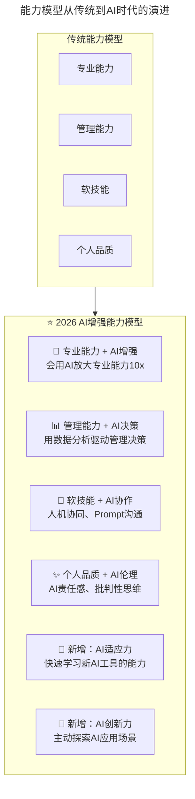
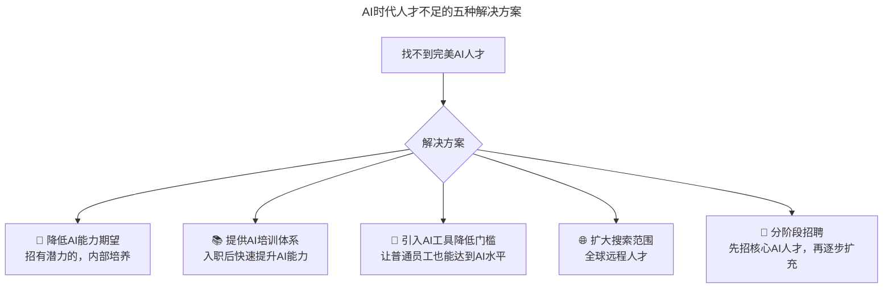

> **适用范围**：CTO、技术团队管理者、招聘负责人
> **更新摘要**：v2 版本基于原文第 171 讲内容，保留全部原始内容并升级为 6 节结构；融入 2026 年 AI 时代注解，新增 AI 增强能力模型、各层级人才 AI 能力要求及面试评估 AI 升级方法。

---

# 第171讲 | 邱良军：如何有效地找到你心仪的人才

## 一、导言

找人是创业起步、公司发展最重要的事情之一，阿里巴巴 CEO 张勇每年问自己两个问题，其中第一个问题就是"今年为企业找了几个人？"可见人才对公司的重要性。在我们准备找人之前，首先得想想我们需要找什么样的人才，以及什么样的人能叫"人才"或者能成为"人才"！一旦找错人或看错人所需付出的代价极高，他直接决定着搭建一个团队的成败。

> **⭐ 2026 年技术背景**：当 AI 可以完成 70% 的编码工作，Agent 能替代 3-5 人团队，人才识别的标准发生了根本变化——"能力=实践+学习+洞察"的公式需要升级为"能力=（实践+学习+洞察）× AI 放大器"。

---

## 二、核心方法论

### 2.1 技术人才定义：能力四要素

在判断人才之前，我们先来定义人的能力，人们在工作中通常需要具备的能力与素质有以下四类：

第一类**专业能力**，具备专业能力的人通常是某领域的专家，是企业发展中不可或缺的一部分，比如技术领域的软件工程师有系统架构师、Java 工程师、C# 工程师、DBA、前端工程师、全栈工程师等。再比如非技术领域有英语翻译员、仓储业产品经理、信贷需求分析师、健康险需求分析师、法律合规员、专利专员等。

第二类**管理能力**，帮助协调管理项目，确保项目能够顺利完成。也可以称为指挥团队的能力，一般达到一定规模的项目会配有专人做管理工作，具体职位有项目助理、项目经理、高级项目经理、项目总监等。

第三类是**软技能**，包括持续学习能力、沟通能力、领导力、洞察力、认知能力以及各种思维能力（结构化思维、逆向思维、深度思考、换位思考……）。

第四类是**个人品质**，包括个人诚信、工作态度、执行能力、抗压能力等，我认为现在常说的延迟回报心态、同理心、个人信念也属于这块。

最后，作为技术专才，或技术型管理人才，身上应该有一种气质：极客精神，Cool，自信，还有一点点的叛逆……

### 2.2 ⭐ 2026 能力四要素的 AI 时代重构



上述流程图展示了能力模型从传统四要素向 AI 增强六要素的演进：原有的专业能力、管理能力、软技能和个人品质均融入 AI 维度，并新增 AI 适应力和 AI 创新力两个独立维度。

#### ⭐ 2026 各能力的具体变化

| 能力维度 | 传统标准 | ⭐ 2026 新增标准 |
|---------|---------|---------------|
| **专业能力** | 精通某技术领域 | **+ 能用 AI 工具在该领域提效 3x+** |
| **管理能力** | 项目管理、团队协调 | **+ 能用 AI 分析团队效能、预测风险** |
| **软技能** | 沟通、学习、领导力 | **+ Prompt Engineering、AI 协作能力** |
| **个人品质** | 诚信、执行力、抗压 | **+ AI 伦理意识、对 AI 错误的敏感度** |

### 2.3 人才发展三阶段

在创业期和团队组建初期，我们往往只需要专业能力较强的人，先"**把事情做对**"。随着业务的发展，企业的壮大，再慢慢通过管理能力来让每个人"**做对的事情**"。随着我们事业的继续扩展，企业向集团化发展，就需要有更强能力的人来把握未来，"**为未来做事**"。

---

## 三、关键流程

### 3.1 专才画像

现在来具体给我们心目中的人才画画像，并结合实际情况想想什么样的人是我们要找的人才。首先，在团队组建初期需要找**专业性人才，简称专才**。"专业的事情由专业的人做"，找人时我们需要关注以下基本点：

1. **学历背景**，虽然学历不等同于能力，但是为了降低试错风险和提高选人效率，需要设置必要的门槛，对于技术人才的选择来说，本科是基本的要求之一。

2. **逻辑思维**，在我参加过的数百次的面试中，几乎有 50% 的人沟通起来比较吃力，原因有思维混乱的、有理解沟通力差的、有表达能力弱的、还有少数人不懂装懂，甚至对完全不懂的概念乱说，等等问题可以总结为"答非所问和沟通效率低"。我在面试中会比较看重候选人的逻辑思维能力，包括逻辑的条理性、逻辑闭环等。

3. **学习动力或习惯**，技术发展日新月异，特别是软件技术人员需要持续不断地学习，我们需要观察候选人才是否还**保持好奇心，会主动学习新技术。**

4. **良好的世界观**，思考问题不偏激，不能想一出是一出，具体表现为**不频繁跳槽**，具备一定的抗压能力；

5.之前提到过的基本要求，**专业技能需要符合岗位要求**，例如专业技术能力、英文能力、行业知识等。

若面试者在以上几个方面都能达到要求，就可以将他定义为人才了，短期能够帮助公司把需要的产品做出来，长期则可以和公司一起成长发展。

如果公司发展快速，团队很快到达了一定的规模，开始出现管理瓶颈，就**必须及时补充管理类人才**。最好的方法还是内部培养提拔，因为管理类岗位对于人品及忠诚度要求比较高，并且试错成本也很高。

### 3.2 技术管理类人才分层画像

#### 基层管理人才

第一类我定义为**基层管理人才**，管人也管事，通常是项目经理类，需要具备的能力有：

1. 前面提到的专才所具备的 5 个方面的要求需要全部满足，其中专业技能可以放低，重点是对技术宽度和发展趋势的理解；

2. 诚实守信非常重要，是人品的必要条件，为人要可靠、做事要靠谱；

3. 沟通协调能力强，总能积极主动地沟通，不轻易放弃；

4. 有带团队和项目管理方面的实际经验，了解或熟悉项目管理的理论知识；

5. 对未来保持乐观，做事富有激情，能够有延迟满足感，而不急于求回报。

如果公司起步就要组建一支较大的团队，规模在 20 人以上，则需要直接找具备以上 5 点能力的负责人。

#### 领导力人才

而当起步就要搭建 50 人以上的大团队时，就需要找具有**领导力的人才**，他们通常需要具备以下几点特质：

1. 需要满足基层管理人才的 5 个要求，技术细节可以继续忽略，但要有技术感知能力，能更好的理解技术趋势；

2. 具有坚定的信念，**做事有很强的原则性**，富有使命感、责任感、荣誉感；（瑞·达利欧写了一本书《原则》，讲述了生活做事的原则，说的非常好。最近几年我都是独立带部门和发展业务，感觉很多处事方式都接近《原则》这本书中所写的。）

3. 熟悉公司运作管理的基本规则，**对自己的责任范围不设限，使命必达**，对团队负责，对公司负责；

4. 不甘于平庸，具有**强烈的工作成就感，极强的沟通力**；

5. 富有领导力，有激情有感染力，通过**内驱来领导团队成长**，能凝聚团队的力量。

#### 创业型/高端人才

如果继续往上要求，寻找技术合伙人、技术 VP 或 CTO，则需要这样的人：**创业型或高端型人才**，他们具备以下几点特质：

1. 需要基本符合领导力人才的 5 个要求。

2. 具有创业精神，必须要有自我牺牲精神，当然这里指是利益上的牺牲。

3. 能给公司带来资源，包括稀缺技术、专利、市场客户、行业内的影响力及人脉资源等。

4. 认同公司及团队价值观，不是一家人不入一家门，对未来有必胜信念。

5. 对公司所处行业未来的趋势有很强的洞察和把握能力。

### 3.3 ⭐ 2026 人才分层的 AI 时代演进

```mermaid
---
title: 人才分层AI能力要求递进
---
flowchart LR
    subgraph Level1["Level 1: 专才（初级）"]
        L1_1[专业技能达标]
        L1_2["⭐ 基本AI工具使用能力"]
    end

    subgraph Level2["Level 2: 基层管理（20人+）"]
        L2_1[专业技术+管理基础]
        L2_2["⭐ AI工作流设计能力"]
        L2_3["⭐ 团队AI工具推广能力"]
    end

    subgraph Level3["Level 3: 领导力（50人+）"]
        L3_1[强领导力+原则性]
        L3_2["⭐ AI战略规划能力"]
        L3_3["⭐ 组织AI转型经验"]
    end

    subgraph Level4["Level 4: 创业型/高端（CTO/VP）"]
        L4_1[创业精神+资源整合]
        L4_2["⭐ AI-native思维模式"]
        L4_3["⭐ 行业AI趋势洞察"]
        L4_4["⭐ AI生态人脉网络"]
    end

    Level1 --> Level2 --> Level3 --> Level4
```



上述流程图展示了各层级人才的 AI 能力递进要求：从 Level 1 的基本 AI 工具使用，到 Level 4 的 AI-native 思维模式和行业 AI 趋势洞察，AI 能力要求随层级提升而系统化深化。

---

## 四、工具与实战

### 4.1 "找不到完美人才"的应对

理想是美好的，但是实际情况是十全十美的人才很难找到，或者说这样的人在市场上原本就很稀奇。如果找不到完美的人才，又或者对人才的能力评估还看不准，也没有关系。可以按照自己团队的特点先用人，而后再重用之。做事的前提是找人，雷军投资不看项目只看人，找准能力强并靠谱的人来做事是企业发展最重要的事情。

### 4.2 ⭐ 2026 "找不到完美人才"的 AI 时代应对



上述流程图展示了 AI 时代面对人才不足的五种应对策略：降低 AI 能力期望并内部培养、提供 AI 培训体系、引入 AI 工具降低门槛、扩大全球搜索范围、分阶段招聘。

> **关键认知转变**：过去找不到完美人才 → 只能凑合 or 继续找；2026 年 → 用 AI 工具弥补能力差距 + 内部培养加速。

### 4.3 ⭐ 2026 面试评估的 AI 升级

| 评估环节 | 传统方法 | ⭐ 2026 新增方法 |
|---------|---------|---------------|
| **简历筛选** | 关键词匹配 | **AI 语义分析 + GitHub/HuggingFace 自动审查** |
| **初试** | 电话/视频面试 | **+ AI 工具使用情况问询** |
| **笔试** | 编程算法题 | **+ AI 辅助编程挑战（允许用 AI 工具）** |
| **复试** | 技术深度面试 | **+ Prompt Engineering 测试 + AI Output Review** |
| **终面** | 文化契合度 | **+ AI 伦理观 + 学习意愿评估** |

### 4.4 ⭐ 2026 AI 人才培养路径

```
Month 1-2: AI基础培训
├── AI工具入门（GPT-5.5, Copilot, Cursor）
├── Prompt Engineering基础
└── AI伦理和安全意识

Month 3-4: AI实战练习
├── 在实际项目中应用AI工具
├── 收集和分享AI使用心得
└── 参与团队AI Best Practices建设

Month 5-6: AI进阶发展
├── 设计个人AI工作流
├── 尝试AI工具链集成
└── 开始指导新人使用AI

Month 7+: AI创新发展
├── 探索AI在新场景的应用
├── 参与AI开源项目或社区
└── 成为团队AI Champion
```

---

## 五、常见误区

### 5.1 误区：只看学历不看能力

- **误区**：唯学历论，忽视实际能力
- **正确做法**：学历是降低试错风险的门槛，但不是唯一标准，需综合评估逻辑思维、学习动力等

### 5.2 误区：追求完美人才

- **误区**：一定要找十全十美的人才
- **正确做法**：找不到完美人才时，按团队特点先用人，后再重用

### 5.3 误区：管理人才外部空降

- **误区**：管理岗位优先外部招聘
- **正确做法**：管理类岗位对人品及忠诚度要求高，试错成本高，最好内部培养提拔

### 5.4 ⭐ 2026 误区：忽视 AI 能力差距

- **误区**：仍按传统标准评估人才，忽视 AI 协作能力
- **正确做法**：在评估体系中新增 AI 能力维度，将 AI 学习意愿作为潜力评估的关键指标

---

## 六、进阶延展

### 6.1 作者简介

邱良军，TGO 鲲鹏会会员，极智嘉研发总监，负责组建极智嘉苏州研发团队，以及筹建苏州研发中心，4 个月将团队发展到 40 人，并承接两个系统开发，数条支持线的工作。曾在新电任职超 10 年，带领团队交付数个项目，团队峰值人员超 70 人。2014 在文思海辉担任总监，从零开始将团队带至 300 人。18 年 IT 老兵，管理经验丰富。

### 6.2 关键洞察

> **邱良军老师的人才分层理论在 AI 时代不仅没有过时，反而更加重要——因为 AI 拉大了人才之间的能力差距。**
>
> - **过去**：优秀程序员 vs 普通程序员 = 2-3x 效率差
> - **2026 年**：AI-Augmented 专家 vs AI 抗拒者 = **10-50x 效率差**
>
> **因此，精准识别和吸引具备 AI 能力的人才，比以往任何时候都更具战略意义。**

### 6.3 延伸思考

- 能力四要素需新增 AI 适应力和 AI 创新力两个维度
- 人才分层需在各层级增加 AI 能力要求（Level 1-4 递进）
- "找不到完美人才"的应对策略新增"用 AI 工具弥补能力差距"
- 面试评估需增加 Prompt 测试、AI 输出审查、AI 伦理判断等环节
- 人才培养路径需加入 AI 基础培训→实战→进阶→创新的完整链条

---

*本注解基于 2026 年 6 月技术环境生成，强调 AI 对各层级人才能力要求的重塑。*