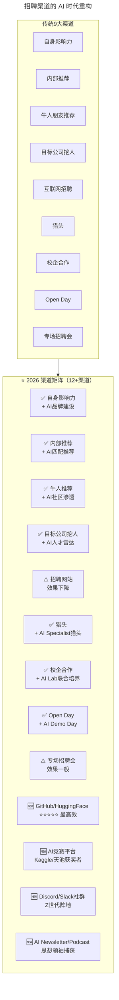
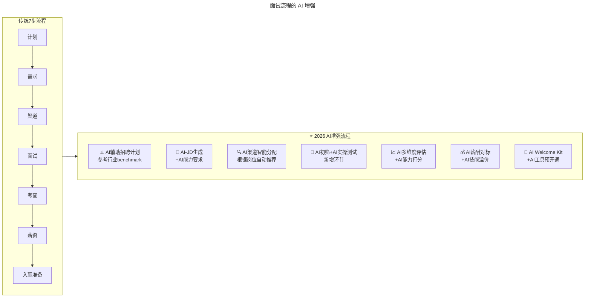
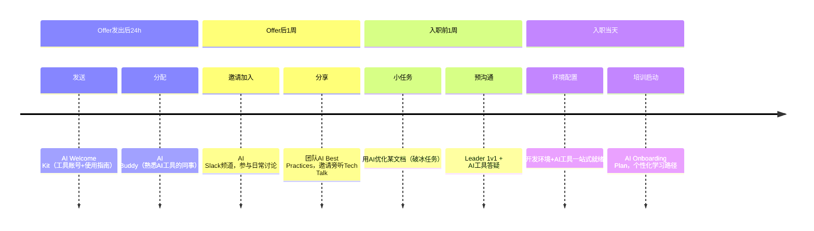
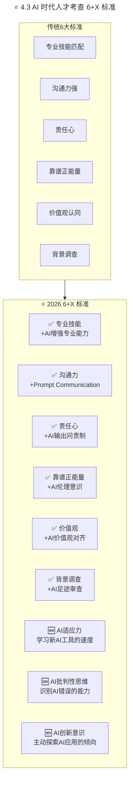

> **适用范围**：CTO、技术VP、招聘负责人、HRBP、团队Leader
> **更新摘要**：v2 版本基于原文第 175 讲内容，保留全部原始内容并升级为 6 节结构；融入 2026 年 AI 时代注解，新增 AI 时代渠道矩阵（12+渠道）、AI 增强面试流程、AI 时代人才考查 6+X 标准及 AI 薪酬福利重构方案。

---

# 第175讲 | 邱良军：打造高效技术团队的人才招聘攻略

## 一、导言

在设定好要打造什么样的技术团队目标后，我们就要启动招聘工作了，随着中国人口红利的消失，人员薪资成本的上升，特别是互联网企业的蓬勃发展，软件技术人才的缺口越来越大。要找到技术能力强且与公司文化价值观相符的人才越来越难。找人是团队组建的第一步，而要想招聘到合适的人才，必须想尽各种办法、利用各种渠道去找人。

> **⭐ 2026 年技术背景**：2026年，**84%的开发者使用AI编程工具**，AI人才成为市场最稀缺的资源。邱良军老师的"招聘七步法"在AI时代依然是最佳实践框架，但每一步都可以用AI来增强效率和效果。最大的变化不是步骤本身，而是：**渠道变了**（从招聘网站转向AI社区）、**标准变了**（增加了AI能力维度）、**流程变了**（新增AI实操测试环节）、**工具变了**（每个环节都有AI工具可用）。

---

## 二、核心方法论

### 2.1 招聘七步法

**第一步**、根据搭建团队的目标，做好 **招聘计划**。

**第二步**、确定 **招聘需求**（定岗定责）：列出每个岗位的职责、需要具备的技能及其他要求。

**第三步**、确定人才 **招聘渠道**，可以根据自身的特点灵活选择。

**第四步**、 **面试方式及面试流程**，一般有笔试及多轮面试来考察候选人的技术能力及软技能，如果条件允许的话还是找一个招聘专员来负责。

**第五步**、 **人才选取及考查**，要根据自己团队的目标来选取合适的人才，设定完成的时间期限，将面试的重点放在专业技能、管理能力、价值观（公司认同）等方面。

**第六步**、 **薪资福利**包，需要根据自己公司的特点，综合考虑薪资、奖金、期权、股票激励等。

**第七步**、 **入职前准备**，从发Offer到入职的这段时间非常重要，如果不做好沟通，会大大降低入职率。

### 2.2 九大招聘渠道

1. **自身的影响力，人脉关系**：最有效的方式，也是最稳妥的
2. **内部推荐**（特别是靠谱员工的内部推荐）：最佳的人才寻找方式
3. **业界大牛朋友推荐**：往往在找人时能出奇兵
4. **找目标公司挖人**：非常快速有效的方法
5. **互联网招聘渠道**：Boss直聘、猎聘、Linkedin等
6. **通过猎头**：特别是高端稀缺人才的招聘
7. **校企合作**：和当地学校建立关系
8. **组织公司的开放日**（Open Day）
9. **专场招聘会**

### 2.3 人才考查六大标准

1. **专业技能匹配**：专业技术技能面试过关，定岗定责
2. **沟通力强**：理解公司的业务，知晓管理层，了解公司的发展方向
3. **责任心**：凡事有交代，件件有着落，事事有回音
4. **靠谱并自带正能量**：不抱怨，主动解决问题
5. **价值观认同**：认同公司，有目标有理想、有激情有冲劲
6. **背景调查**：非常有用的一个办法，可以大幅度降低选人风险

### ⭐ 2.4 AI 时代渠道效果评级（针对 AI 人才）

| 渠道 | 效果评级 | 成本 | 适用人才类型 | AI时代特色 |
|-----|---------|------|------------|-----------|
| **GitHub/HuggingFace** | ⭐⭐⭐⭐⭐ | 低 | 全栈/算法/AI | **代码即能力证明** |
| **Kaggle/天池** | ⭐⭐⭐⭐⭐ | 低 | 算法/数据/AI | **实战能力一目了然** |
| **内推** | ⭐⭐⭐⭐⭐ | 中 | 全岗位 | **依然最靠谱** |
| **Discord社群** | ⭐⭐⭐⭐ | 低 | AI/前端/Z世代 | **新兴高效渠道** |
| **AI Newsletter** | ⭐⭐⭐⭐ | 低 | 思考型选手 | **筛选高质量人才** |
| **猎头(AI方向)** | ⭐⭐⭐⭐ | 高 | 高端/AI Architect | **专业化细分** |
| **LinkedIn** | ⭐⭐⭐ | 中 | 中高级 | **+AI关键词搜索** |
| **Boss直聘等** | ⭐⭐ | 中 | 初中级 | **效果明显下降** |
| **招聘会** | ⭐⭐ | 中低 | 初级 | **AI人才极少参加** |

---

## 三、关键流程

### 3.1 招聘渠道的 AI 时代重构



上述流程图展示了从传统 9 大招聘渠道到 2026 年 AI 时代 12+渠道矩阵的演进：原有渠道大多保留但增加了 AI 增强（如自身影响力+AI品牌建设），同时新增了 4 类 AI 专属渠道（GitHub/HuggingFace、AI竞赛平台、Discord社群、AI Newsletter），招聘网站和专场招聘会效果明显下降。

### 3.2 面试流程的 AI 增强



上述流程图对比了传统 7 步招聘流程与 2026 年 AI 增强流程：每个步骤都增加了 AI 辅助能力，特别是新增了 AI 初筛+实操测试环节和 AI 多维度评估环节。

### 3.3 新增 AI 实操测试环节

**① AI初筛（5-10分钟/人）**
- AI分析简历与JD的语义匹配度
- 自动扫描GitHub/HuggingFace公开贡献
- 生成初步评估报告和面试重点建议

**② AI实操测试（30-45分钟）**

| 测试形式 | 适用岗位 | 考察重点 |
|---------|---------|---------|
| Prompt Engineering Challenge | 全岗位 | 逻辑思维、精确表达 |
| AI-Assisted Coding | 开发/算法 | 人机协作、代码审查能力 |
| AI Output Review | 全岗位 | 批判性思维、错误识别 |
| Agent Design | 高级/架构 | 系统思维、创新能力 |

**③ AI能力深度面试（20-30分钟）**

```
必问题目：
1. "描述一个你用AI工具解决复杂问题的案例"
2. "你如何判断AI输出的正确性？"
3. "你认为AI在你的工作领域中最大的机会和风险是什么？"

进阶题目（高级岗位）：
4. "如果让你设计一个AI系统来自动化我们团队的XX流程，你会怎么做？"
5. "你如何看待AI对职业发展的影响？你做了哪些准备？"
```

### 3.4 入职前 AI 准备时间线



上述时间线展示了入职前 AI 准备的四个时间节点：Offer 后 24 小时（发送 AI Welcome Kit + 分配 AI Buddy）、Offer 后 1 周（邀请加入 AI 频道 + 分享最佳实践）、入职前 1 周（破冰任务 + Leader 预沟通）和入职当天（环境配置 + 培训启动），确保新员工从入职前就开始融入 AI 文化。

---

## 四、工具与实战

### 4.1 招聘实践：困难时期的招聘经历

2015年底，我作为开发经理负责承接一个系统研发任务，计划2个月内组建一支20人的项目团队。因为项目已经逐步启动，团队招聘时间非常紧。

我们在首先准备好招聘计划及需求表后，组织了一次各干系人的动员大会。确定了三个找人的渠道和方法：一是内部协调借调人员，二是招聘专员通过网络渠道招人，三是通过周围的熟人推荐。经过两周时间，面试通过并入职了几个初级Java工程师，但是他们对项目启动根本没帮助，反而需要我花更多的时间来给他们做培训。

当我意识到这个问题后，紧急暂停了当前的状态，重新安排招聘方式：首先，暂停初级Java工程师的招聘，重点找团队骨干；其次，利用高层的影响力，要求必须借调1人过来；最后，扩大周围朋友的范围，主动联系并不太熟的朋友。

通过三天的努力，马上收到立竿见影的效果。因此，**无论怎样的困难，先迅速找到第一个靠得住的骨干再做团队扩张**。

### 4.2 说服候选人加入的要点

面试官需要介绍清楚的核心点有：

1. 公司的未来，行业的发展，创始团队的情况
2. 公司近三年来的发展路线，如果是创业公司，重点讲产品定位和市场潜力
3. 对候选人的职业规划，技术栈，发展机会
4. 薪资报酬，福利待遇，包括奖金、员工关怀、培训机会等

### ⭐ 4.3 AI 时代人才考查 6+X 标准



上述流程图展示了从传统 6 大人才考查标准到 2026 年 6+X 标准的升级：原有 6 项标准全部保留但增加了 AI 维度增强（如专业技能+AI增强、沟通力+Prompt Communication），同时新增 3 项 AI 专属标准（AI适应力、AI批判性思维、AI创新意识）。

### ⭐ 4.4 2026 评分卡示例

| 评估项 | 权重 | 评分标准（1-5分） | 总分 |
|-------|------|-------------------|------|
| 专业技能（含AI） | 25% | 技术深度 + AI工具熟练度 | /125 |
| 沟通力（含Prompt） | 15% | 表达清晰 + Prompt质量 | /75 |
| 责任心 | 10% | 闭环思维 + AI使用规范 | /50 |
| 靠谱+正能量 | 10% | 团队协作 + AI分享意愿 | /50 |
| 价值观 | 10% | 文化契合 + AI伦理观 | /50 |
| 背景调查 | 10% | 履历真实 + AI社区信誉 | /50 |
| **AI适应力** | 10% | 学习速度 + 工具广度 | /50 |
| **AI批判性思维** | 5% | 错误识别 + 安全意识 | /25 |
| **AI创新意识** | 5% | 探索精神 + 应用创意 | /25 |
| **总分** | **100%** | | **/500** |

### ⭐ 4.5 薪资福利的 AI 时代重构

| 福利组成 | 传统内容 | ⭐2026 新增项 |
|---------|---------|-------------|
| **现金薪酬** | 工资 + 奖金 | **+ AI技能津贴** |
| **长期激励** | 期权/股票 | **+ AI项目成功分成** |
| **学习发展** | 培训/会议 | **+ AI Conference VIP + 算力资源** |
| **工作环境** | 办公设备 | **+ 高性能工作站 + GPU access** |
| **工作方式** | 弹性工作 | **+ 远程优先 + 异步协作支持** |
| **特殊福利** | 补充保险 | **+ AI工具全家桶订阅** |

### ⭐ 4.6 招聘效率 AI 提升方案

```
传统招聘1人总耗时: 40-60小时
AI增强后总耗时: 约14小时
节省: 约65%

主要节省环节:
├── 简历筛选: 10h → 2h (AI初筛)
├── 面试安排: 5h → 1h (AI协调)
├── 面试沟通: 15h → 8h (AI辅助)
├── 评估汇总: 5h → 1h (AI打分)
└── 入职准备: 5h → 2h (AI自动化)
```

---

## 五、常见误区

### 误区 1：只走招聘网站渠道

- **现象**：过度依赖Boss直聘、猎聘等传统渠道
- **对策**：AI 人才活跃在 GitHub、HuggingFace、Kaggle、Discord 等平台

### 误区 2：忽视内部推荐

- **现象**：花大钱找猎头，忽视内部推荐
- **对策**：内部推荐是所有找人方式中最好的，特别是让核心骨干去推荐

### 误区 3：招聘初级人才填坑

- **现象**：急需人手时大量招聘初级工程师
- **对策**：先迅速找到第一个靠得住的骨干再做团队扩张

### 误区 4：用欺骗和画大饼拉人

- **现象**：为了招到人，夸大公司前景
- **对策**：来了也会走，得不偿失。换位思考，诚实介绍公司情况

### 误区 5：Offer 到入职期间不沟通

- **现象**：发完 Offer 就等候选人入职
- **对策**：从发Offer到入职的这段时间非常重要，不做好沟通会大大降低入职率

### 误区 6：AI 招聘工具完全替代人工

- **现象**：完全信任 AI 筛选结果，忽略人的判断
- **对策**：AI 负责初筛和排序，最终决策由人类 recruiter 完成

---

## 六、进阶延展

### 关键洞察

> **邱良军老师的"招聘七步法"在AI时代依然是最佳实践框架，但每一步都可以用AI来增强效率和效果。**
>
> **最大的变化不是步骤本身，而是：**
> - **渠道变了**：从招聘网站转向AI社区
> - **标准变了**：增加了AI能力维度
> - **流程变了**：新增AI实操测试环节
> - **工具变了**：每个环节都有AI工具可用
>
> **谁先把AI融入招聘全流程，谁就能在人才争夺战中占据先机。**

### 招聘漏斗 AI 优化

```
传统漏斗:
曝光(1000) → 申请(100) → 初筛(30) → 面试(10) → Offer(3) → 入职(2)

AI优化漏斗:
AI曝光(2000) → AI申请(150) → AI初筛(50) → AI+人工面试(15) → Offer(5) → 入职(4)

入职人数提升: 2x (2人→4人，端到端转化率基本持平)
单位招聘成本降低: 40%
```

### 作者简介

邱良军，极智嘉研发总监，TGO鲲鹏会会员，负责组建极智嘉苏州研发团队，以及筹建苏州研发中心，4个月将团队发展到40人，并承接两个系统开发，数条支持线的工作。曾在新电任职超10年，带领团队交付数个项目，团队峰值人员超70人。2014在文思海辉担任总监，从零开始将团队带至300人。18年IT老兵，管理经验丰富。