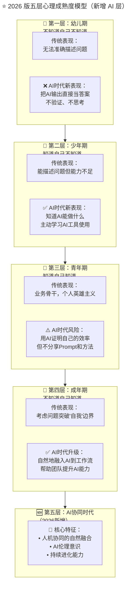

> **适用范围**：CTO、创业公司技术管理者、招聘负责人
> **更新摘要**：v2 版本基于原文第 164 讲内容，保留全部原始内容并升级为 6 节结构；融入 2026 年 AI 时代注解，新增五层心理成熟度模型（含 AI 协同时代层）、各层级 AI 时代识别方法及 AI 时代人才配置建议。

---

# 第164讲 | 陈崇磐：心理成熟度 - 创业公司识人利器

## 一、导言

招人是公司永恒的旋律，而创业公司的招人更是贝九级别的交响曲，冗长而跌宕起伏，一旦团队顺利成型，带给人的成就感也如交响乐带来的震撼一样，更印象深刻且耐人寻味。

可问题是处于创业阶段的公司招人，是所有公司阶段中最难的，因为出不起高价，却要求更高（而不是更低）。虽然 234 原则（2 个人干 4 个人的活，拿 3 个人的工资）就已经很残酷，但更难的是，如何让搭建出的团队能跟上业务的快速发展，而不是牵绊。

> **⭐ 2026 年技术背景**：GPT-5.5 多模态大模型成熟商用、DeepSeek V4 开源模型性能比肩闭源方案、Stack Overflow 开发者调查 2025 显示 84% 开发者使用或计划使用 AI 编程工具、Agent 智能体进入加速落地期。在 AI 时代，"心理成熟度"这个概念不仅依然重要，而且需要新增"AI 协作成熟度"这一维度。

---

## 二、核心方法论

### 2.1 四层心理成熟度模型

我对人群的划分更喜欢使用心理年龄，这个和生理年龄（工作年限）有一定关联却又不完全等同的标准把人分为四等：幼儿期、少年期、青年期、成年期。

#### 幼儿，不知道自己不知道

这是心理成熟度的第一层级，在职场中的表现就是，碰到问题只会求助，而且在求助的时候，连自己的问题都无法准确描述。这种员工和幼儿一样，没有描述问题的能力，分不清自己与世界的边界，也分不清人与人之间、岗位与岗位之间的边界。

为了识别这种候选人，我通常会选择其简历上的项目问一个问题：你们几个之间是怎么分工协作的？比如几个 Java 开发之间、前后端之间等。如果候选人对分工和彼此的边界都不能准确描述，我会把候选人定位为幼儿层级，直接 pass。

#### 少年，知道自己不知道

这是第二层级，正如少年，知道自己是因为个子不够高才拿不到柜子上的玩具，或者因为力气不够大才拧不开超市新买的果酱。这个层级的员工没有足够的能力解决碰到的所有问题，所以在求助时，会对问题有一个准确的描述，甚至自己已经做过某些尝试但还是没能解决。

为了分辨这个层级，我通常会问的问题是：你经历的项目中，有没有遇到让你刻骨铭心的困难，你是怎么解决的？

#### 青年，知道自己知道

青年属于知道自己知道的层级，一方面，青年往往是团队中的业务骨干，知道自己碰到的是什么问题，也往往能找到解决问题的办法。另一方面，青年也会倾向于证明自己，让别人意识到他的"知道"，因此在工作上会有不错的主观能动性。

为了分辨青年，我会倾向于问类似的问题：你过往的工作经历中，最让你有成就感的事情是什么？如果对方的答案是落在个人英雄主义的范围，满足于以个人能力赢得团队的尊敬，我就会将他归到青年的层级。

#### 成人，不知道自己知道

这里的不知道不是真的不知道，而是自己的知道已经悄然地融入到日常行为中，不需要刻意让自己或者别人了解自己已经知道。成人和青年的区别，在于对问题的认识是否突破了"自己"这个边界，考虑问题的出发点是"自己"，还是"自己+相关的人"。

我经常尝试通过一个开放性的问题了解对方的心理成熟度：你心目中最理想的工作环境是什么？这个问题可以很好地衡量出对方考虑问题的角度，如果他在意的都是与自己利益相关的东西，比如待遇、氛围、能学到东西等，我会将他划分到青年层级而不是成人层级。

### 2.2 ⭐ 2026 版五层心理成熟度模型（新增 AI 层）



上述流程图展示了从传统四层心理成熟度模型到 2026 年五层模型的演进：在原有的幼儿→少年→青年→成人四层基础上，新增了第五层"AI 协同时代"，特征包括人机协同的自然融合、AI 伦理意识和持续进化能力。同时，每一层都标注了 AI 时代的新表现和风险。

---

## 三、关键流程

### 3.1 各层级 AI 时代的识别方法

#### 第一层：幼儿期 ——"AI 巨婴"的识别

| 传统识别问题 | AI 时代补充识别 | 危险信号 |
|-------------|---------------|---------|
| 你们怎么分工的？ | **"你用 AI 生成的这段代码，测试过了吗？"** | 直接复制 AI 输出，不做任何验证 |
| （无法描述边界） | **"这个 AI 给出的结论，你自己理解了吗？"** | 无法解释 AI 输出的内容 |

> ⭐ 2026 面试新问题："请描述一个你最近用 AI 辅助完成的任务，以及你是如何验证 AI 输出的正确性的。"——如果回答是"我没验证，AI 应该是对的"，那就是幼儿期。

#### 第二层：少年期 —— 有潜力的学习者

**AI 时代的少年期特征（值得培养）**：
- ✅ 知道自己在 AI 使用上的不足
- ✅ 会主动提问："这个任务 AI 能帮我做到什么程度？"
- ✅ 尝试过多种 AI 工具，能说出各自的优劣
- ⚠️ 但还需要指导才能高效使用

> 💡 **培养建议**：给少年期的员工配备 AI Mentor（可以是团队中的成年期员工），制定 30 天的 AI 能力提升计划。

#### 第三层：青年期 —— 需要警惕的"AI 英雄主义"

| 行为类型 | 具体表现 | 团队影响 |
|---------|---------|---------|
| **Prompt 囤积者** | 不分享高效 Prompt 模板 | 团队整体效率无法提升 |
| **AI 黑箱使用者** | 用 AI 产出结果但不解释过程 | 知识无法传承 |
| **效率表演者** | 故意展示 AI 带来的高效率 | 制造团队焦虑 |
| **工具原教旨主义者** | 坚持只有某一种 AI 工具最好 | 限制团队的技术选择 |

#### 第四层：成年期 —— 稀缺的 AI 时代领导者

| 问题 | 成年期回答 | 非成年期回答 |
|-----|-----------|------------|
| 你理想的工作环境？ | 关注团队能否成长、能否创造更大价值 | 关注个人待遇、学习机会 |
| 你怎么看待 AI？ | AI 是团队的放大器，关键是人怎么用它 | AI 让我的工作效率提升了 X 倍 |
| 你最自豪的事？ | 帮助团队成员解决了难题 | 我独立完成了某个复杂项目 |
| 如果离开公司，你最担心什么？ | 团队的发展会受影响 | 我的个人成长会停滞 |

#### 🆕 第五层：AI 协同时代（2026 新增）

| 维度 | 描述 |
|-----|------|
| **人机协同的自然性** | 使用 AI 像呼吸一样自然，不需要刻意思考 |
| **AI 伦理意识** | 清楚 AI 的能力边界和伦理红线 |
| **持续进化能力** | 能快速适应新的 AI 技术和工具 |
| **知识分享本能** | 主动分享 AI 最佳实践，帮助他人成长 |
| **系统思维** | 从"我+AI"扩展到"团队+AI 生态系统" |

---

## 四、工具与实战

### 4.1 ⭐ 2026 版理想团队模型（基于原文升级）

```
原文模型：成人(管理) + 青年×2(骨干) + 少年×2(新手) + 少年×1(小白)

2026升级模型：
├── 成人/AI协同时代 ×1 (团队负责人)
│   ├── 负责AI战略规划
│   ├── 建立团队AI协作规范
│   └── 培养团队的AI能力
│
├── 成年/青年 ×2 (业务骨干 + AI熟练者)
│   ├── 业务主力
│   ├── AI工具深度用户
│   └── 新人的AI导师
│
├── 青年/少年 ×2 (业务新手 + AI学习者)
│   ├── 执行具体任务
│   ├── 在指导下使用AI工具
│   └── 快速成长中
│
└── AI Agent ×N (数字员工)
    ├── 代码生成Agent
    ├── 文档撰写Agent
    ├── 测试执行Agent
    └── 数据分析Agent
```

### 4.2 ⭐ 2026 给创业者的可执行建议

#### 本周立即行动

1. **Day 1-2**：用更新后的五层模型重新评估现有团队成员
2. **Day 3-4**：识别团队中的"AI 巨婴"和"AI 协同时代"人才
3. **Day 5-7**：为每个员工制定个性化的 AI 能力发展计划

#### 第一个月目标

- [ ] 建立"AI 成熟度评估"机制（每季度评估一次）
- [ ] 识别并重点培养 1-2 名有潜力进入"AI 协同时代"的员工
- [ ] 制定团队的 AI 能力提升路线图

#### 第一个季度目标

- [ ] 团队平均 AI 成熟度提升一个等级
- [ ] 形成"成人带少年"的 AI Mentor 制度
- [ ] 建立团队内部的 AI 最佳实践知识库

---

## 五、常见误区

### 5.1 拔苗助长

我们也经常遵循"学而优则仕"的原则去提拔技术骨干，让他去驱动或影响他人。但现实中这样做并不能每次都成功，失败的结果是既陷入了管理混乱，又损失了一名技术骨干。我对这个问题的个人体会是，事先判断心理层级，如果技术骨干还处于青年的层级，切忌拔苗助长。

### 5.2 AI 时代"幼儿期"更危险

- **误区**：AI 降低了"看起来在工作"的门槛
- **正确认知**：AI 提高了"真正创造价值"的门槛——直接复制 AI 输出不验证，就是 AI 时代的"幼儿期"

### 5.3 "AI 英雄主义"的陷阱

- **误区**：用 AI 证明自己的效率，但不分享 Prompt 和方法
- **正确做法**：引导青年期员工从"个人 AI 效能"转向"团队 AI 赋能"

---

## 六、进阶延展

### 6.1 AI 会让某些层级消失吗？

> ⭐ 核心观点：**不会消失，但层级的含义会演变。**

- **幼儿期**：在 AI 时代更危险了——因为 AI 降低了"看起来在工作"的门槛，但提高了"真正创造价值"的门槛
- **少年期**：更有价值了——因为 AI 学习能力本身就是核心竞争力
- **青年期**：需要转型——从"个人英雄"变成"AI 赋能的英雄"
- **成年期**：更加稀缺——因为 AI 时代更需要能够整合人+AI 系统的人
- **AI 协同时代**（新增）：未来的标准要求——就像现在每个人都必须会用电脑一样

### 6.2 作者简介

陈崇磐，德信随寓 CTO 兼 COO，TGO 鲲鹏会会员，多次从零开始搭建团队，有丰富的团队打造经验，曾在通信领域扎根 10 多年，先后就职于华为、摩托罗拉、诺西通信等公司。2013 年开始自主创业，并随后加入创业社交平台–微链担任 CTO，目前专注长租公寓领域。

### 6.3 延伸思考

- 心理成熟度模型从四层扩展到五层，新增 AI 协同时代
- 每一层的 AI 时代表现形式和评估标准都需更新
- AI Agent 作为"数字员工"加入团队，改变了团队人员配置模型
- 青年期的"AI 英雄主义"是 AI 时代最需要警惕的管理陷阱