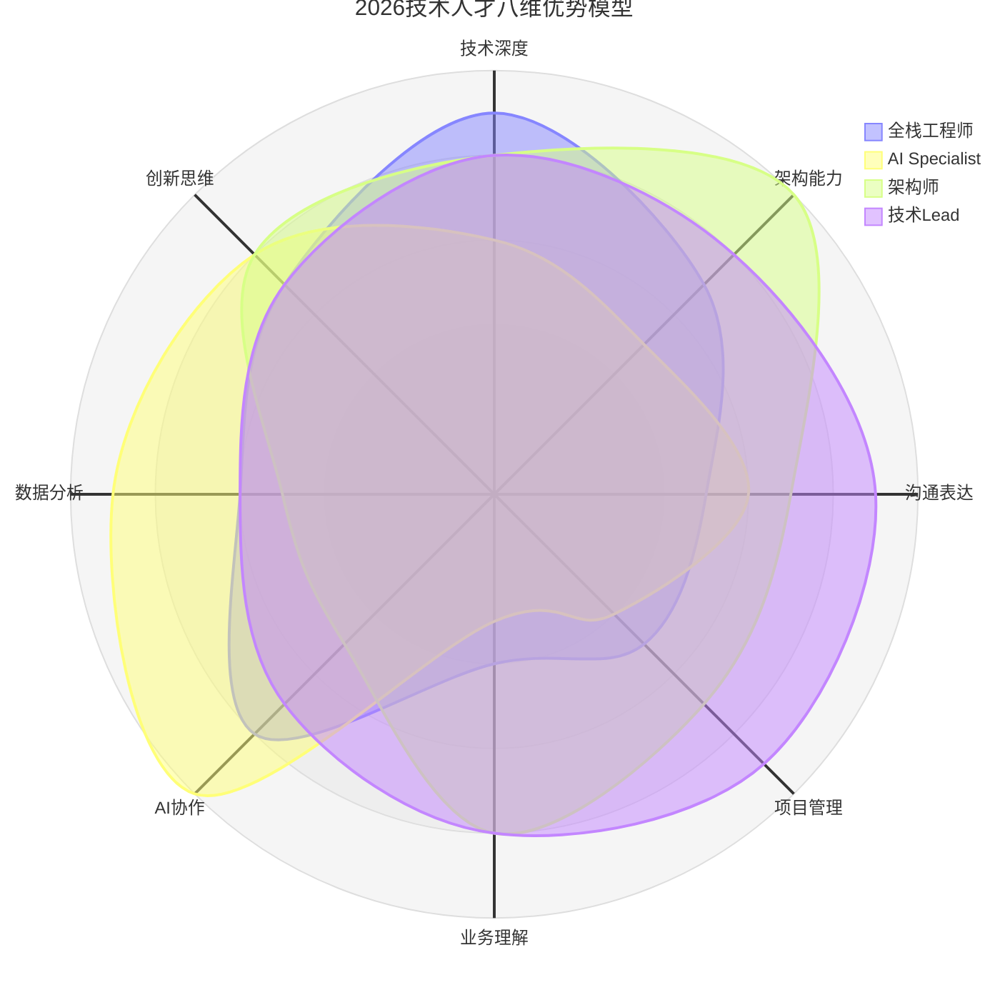
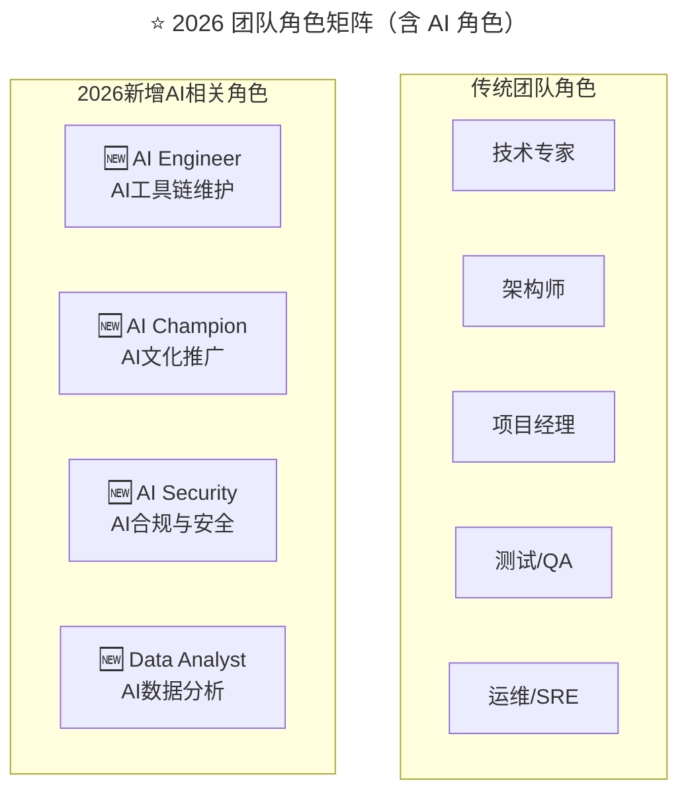

> **适用范围**：技术团队管理者、Tech Lead、HRBP
> **更新摘要**：v2 版本基于原文第 178 讲内容，保留全部原始内容并升级为 6 节结构；融入 2026 年 AI 时代注解，新增八维优势模型（含 AI 协作和数据分析维度）、AI 时代"所长"与"所短"的重新定义及团队角色矩阵。

---

# 第178讲 | 马连浩：用人的关键在于用人所长，而非改人之短

## 一、导言

曾经看到一个观点，"**改变自己是神，改变别人是神经病。**"意思很明确，不要去奢望改变别人，而是要努力改变自己。这个浅显的道理同样适用于团队管理，对于设定的目标，更重要的是要从自己出发，不仅需要自己身体力行去实现，更要根据情况改变自己的管理方式，做到知人善任，靠改变别人来迁就自己，只能是乌托邦痴人说梦而已。

> **⭐ 2026 年技术背景**：2026 年，原文核心观点"用人所长，而非改人之短"在 AI 时代被赋予了全新内涵——"所长"和"所短"的定义发生了变化，AI 协作能力成为新的"长处"，而"不会用 AI"可能成为新的"短处"。

---

## 二、核心方法论

### 2.1 知人才能善任

先前在某公司时，我的两个下属：张和刘（避免误会隐藏真名）年龄相仿，技术能力相当，在各自团队里面的表现都很突出，因此我提名他们做了两个技术团队的主管，负责两条产品线的项目管理和研发交付。

没想到的是，三个月之后，却出现了"冰火两重天"的情况。张带领的部门开始出现颓势，项目延期，质量失控，团队成员冲突频频；而刘带领的部门则是项目交付很顺利，关联部门评价也很高，团队小伙伴的状态昂扬向上，一片欣欣向荣的态势。

我就很纳闷，因为就我亲眼看到的情况来说，张工作更勤奋，他总是在加班。刘则不然，乍一看之下，他并不像张那么勤奋，会议开得也不多，团建庆功倒是不少。

张认为，部门交付效率下降的原因在于团队小伙伴们不给力，张说："团队成员的缺点太多了，改起来需要时间，三个月显然还不够。"刘则认为，部门业绩增长的原因是手下的人很优秀，刘说："他们每一个人都很厉害，我只是鼓励他们大胆去做自己认为对的事情，若有问题，我再身体力行给予辅导。"

如果用一句话来总结他们的做法就是，**张看到了下属的缺点，一直在改人之短；刘则看到了下属的优点，一直在用人所长。**

看一个人的缺点，是比较简单的，通过一两件小事就能得出大概结论。而看一个人的优点，却非常困难。尤其是对于管理者来说，很多时候明知道下属在某些方面的确比自己厉害，可是心里非常别扭，不想承认或不愿承认，硬是把一件好事整成了心病。而这种"不想"或"不愿"的行为，就导致在"知人"方面出了大问题。**既然不能知人，自然也就没法做到善任**。

### 2.2 研发工程师分类

一般来说，研发工程师可分为优秀工程师、有责任心的潜力工程师、有责任心的普通工程师、熟练工程师和普通工程师五类：

1. **优秀** 工程师：技术优秀，认同公司价值观和愿景，有很强的主观能动性，喜欢发现问题，解决问题
2. 具 **有责任心的潜力** 工程师：认同公司价值观和愿景，有很强的主观能动性，技术能力尚待提升
3. 具 **有责任心的普通** 工程师：认同公司价值观和愿景，有很强的主观能动性，技术潜力一般
4. **熟练** 工程师：技术比较扎实，但主观能动性一般
5. **普通** 工程师：技术一般，主观能动性也一般

### 2.3 ⭐ 2026 人才优势矩阵（含 AI 维度）

上述雷达图展示了 2026 年技术人才的八维优势模型，新增了 AI 协作和数据分析两个维度。AI Specialist 在 AI 协作（10 分）和数据分析（9 分）上遥遥领先，而架构师在架构能力上最强（10 分）但 AI 协作偏弱（5 分）。

#### 新增两维详解

| 新维度 | 定义 | 2026 重要性 |
|-------|------|----------|
| **AI 协作能力** | 与 AI 工具/Agent 高效协同的能力 | **核心长处之一**：善用 AI 的人效率提升 3-5 倍 |
| **数据分析能力** | 用数据驱动决策的能力 | **新兴长处**：AI 时代数据素养成为关键差异化能力 |

---

## 三、关键流程

### 3.1 不同类型工程师的用人策略

在现实的技术团队中，往往存在上述各种类型的员工，做好技术人才的画像，将合适的人放到合适的位置，是形成高绩效团队的前提。给不同类型的技术工程师安排工作任务，就如同打仗排兵布阵一样。

- **优秀工程师**需要公司提供适合的舞台，并由技术负责人亲自提供有效的辅导，让其尽情发挥，形成团队榜样
- **潜力工程师**就需要让其负责核心项目中的核心模块，在实战中历练，并安排优秀工程师提供辅导帮助其尽快的成长为优秀工程师
- **具有责任心的普通工程师**安排一些技术难度不高同时需要非常细心的工作，如资金渠道接入、核心业务系统维护等，促使其慢慢成长
- **熟练工程师**安排相对独立、较少协同的工作，可以带一些新人或应届生，但要观察其心态和价值观，避免负能量影响
- **普通工程师**往往需要安排优秀工程师对其工作进行复核监督，避免责任心不到位产生故障损失

### 3.2 ⭐ 2026 需要重新评估的"短处"

| 传统"短处" | AI 时代的重新评估 | 管理建议 |
|-----------|----------------|---------|
| **编码速度慢** | 如果会用 AI 工具，这个短处可被大幅弥补 | 提供 AI 编程工具培训 |
| **不善于写文档** | AI 可以辅助文档生成 | 教会使用 AI 写作工具 |
| **英语不好** | AI 翻译工具已非常成熟 | 不再将此作为硬性门槛 |
| **不会用 AI（新增）** | **这在 2026 年是真正的短处** | **优先提供 AI 技能培训** |

---

## 四、工具与实战

### 4.1 ⭐ 2026 新增的"不可接受的短处"

| 短处类型 | 原因 | 应对策略 |
|---------|------|---------|
| **拒绝学习 AI 工具** | 在 AI 时代这是职业发展的致命障碍 | 深度沟通，了解根本原因；如确属态度问题需考虑调整 |
| **过度依赖 AI 丧失基础能力** | AI 是放大器而非替代品，基础能力仍是根基 | 平衡 AI 使用与手动练习的比例 |
| **忽视 AI 安全和合规** | 可能给团队带来严重风险 | 强化 AI 安全培训和审计 |

### 4.2 ⭐ 2026 团队角色矩阵（含 AI 角色）

上述流程图展示了传统团队角色与 2026 年新增 AI 相关角色的对比：传统角色包括技术专家、架构师、项目经理、测试/QA 和运维/SRE；新增 AI 角色包括 AI Engineer（AI 工具链维护）、AI Champion（AI 文化推广）、AI Security（AI 合规与安全）和 Data Analyst（AI 数据分析），体现了 AI 时代团队角色的新需求。

### 4.3 ⭐ 2026 行动清单

- [ ] 用上述"八维优势模型"重新评估每位团队成员的长处
- [ ] 识别团队中"AI 协作能力"最强的人，考虑赋予其 AI Champion 角色
- [ ] 为"AI 技能较弱"的成员制定针对性的提升计划（而非视为不可改变的短处）

---

## 五、常见误区

### 5.1 改人之短

- **误区**：专注于改变下属的缺点
- **正确做法**：用人所长，才能创造奇迹，是天才的行为；而改人所短，要么自讨没趣，要么事倍功半，是蠢笨的选择

### 5.2 不愿承认下属优秀

- **误区**：明知道下属在某些方面的确比自己厉害，可是心里非常别扭，不想承认或不愿承认
- **正确做法**：管理者一定要把主要精力放在用人所长上，而不是改人之短

### 5.3 拔苗助长

- **误区**：遵循"学而优则仕"的原则去提拔技术骨干，让他去驱动或影响他人
- **正确做法**：事先判断心理层级，如果技术骨干还处于青年层级，切忌拔苗助长

---

## 六、进阶延展

### 6.1 核心理念

不管是哪一个层级的技术管理者在用人方面做到知人善任，都是非常重要的。用人不是要求对方做圣人，方方面面都非常优秀，但求对方有一技之长，用的就是对方的长处。

现在团队人员构成越来越年轻化，管理新生代 90 后员工更多的要抱以同理心，相互尊重，在有条件信任的基础上，更容易建立高效的技术交付团队。优秀的管理者都懂得人性，他们都知道"用人所长"，包容人才的短处和缺点。

### 6.2 核心理念（AI 时代版）

> **发挥优势比弥补短板更有效——但在 AI 时代，"优势"和"短板"的定义发生了变化，管理者需要更新识人用人的标准。**

### 6.3 延伸思考

- "所长"在 AI 时代新增了 AI 协作能力和数据分析能力两个维度
- "所短"在 AI 时代需重新评估：编码速度慢、不善写文档等可被 AI 弥补
- "不会用 AI"成为 2026 年真正的短处，但应通过培训而非淘汰来解决
- 团队互补策略需新增 AI 相关角色（AI Engineer、AI Champion 等）
- 拒绝学习 AI 工具和忽视 AI 安全合规是不可接受的短处

### 6.4 作者简介

马连浩，iPayLinks CTO，TGO 鲲鹏会上海分会会员，曾任职于盛大、新浪、平安、利得等互联网和金融科技公司，先后担任过架构师、技术总监、技术副总裁等技术管理职务；在互联网和金融科技的产品研发及技术管理领域具有超过 12+年的从业经验。