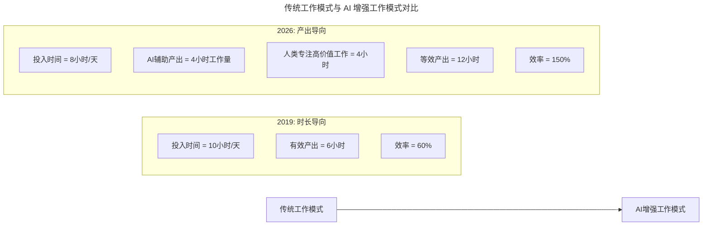

# 第24讲 | 996、987，程序员加班文化你怎么看？

> **适用范围**：技术管理者（CTO、技术总监、技术 Leader）、需要制定工作制度的 HR 与团队负责人、对"加班文化"有困惑的工程师。适用于研发团队工作制度设计、加班文化审视、AI 时代效率提升与团队文化重塑等场景。
>
> **更新摘要（v2 · 2026-08 更新）**：
> - 结构化升级为 6 节骨架（导言 / 核心方法论 / 关键流程 / 工具与实战 / 常见误区 / 进阶延展）
> - 整合原文多位技术领导者的观点与"AI 时代升级注解（2026）"，重组为统一骨架
> - 保留全部 Mermaid 图并补充 `--- title: ... ---` frontmatter，每张图后追加文字解读
> - 将"效率革命"、"反加班策略"等 AI 内容提炼为独立小节
> - 参考资料融入进阶延展

---

## 1. 导言

### 1.1 从"996 一个半月就有人离职"说起

某日，在 TGO 鲲鹏会全国会员群里，一位会员说了句"刚开始实行 996 一个半月，就有人提出离职了"。这一话题马上引起许多会员的共鸣，由此展开了热烈的讨论。加班文化，是很多技术管理者绕不过去的困惑：到底应不应该加班？怎么衡量加班的成果？怎么加班才不会让团队的兄弟们反感？

### 1.2 本文的核心命题

本文汇集了当天参与讨论的几位技术领导者的观点，他们来自启赟金融、今日头条（前 WeWork）、爱因互动、慧安金科、二维火、众安在线等不同规模与行业的公司，对待加班的态度与实践各不相同。通过他们的分享，我们可以提炼出加班文化的本质——**时间投入是否带来了有效产出**。

### 1.3 2026 年 AI 时代背景

2026 年，GPT-5.5 发布，DeepSeek V4 国产大模型崛起，84% 的开发者正在使用或计划在开发流程中使用 AI 工具（Stack Overflow 2025 调查口径），Agent（智能代理）进入加速落地期。在这个背景下，"要不要加班"这一 2019 年的争论，正在演变为一个全新的问题："有了 AI 为什么还要加班？"——AI 让效率革命成为可能，加班文化需要被重新审视。

---

## 2. 核心方法论

### 2.1 加班文化的四种典型立场

几位技术领导者对于加班的态度大致可分为四种：

| 立场 | 代表 | 核心观点 |
|------|------|---------|
| **目标驱动** | 今日头条（陈满砚） | 加班在目标明确的情况下是必须的（如 release 出问题），但不应上升到文化，更不能宣传奉献 |
| **产出导向** | 爱因互动（洪强宁） | 不把延长工作时间作为进度保障，依赖频繁公开的进度沟通和交付质量，避免"为了加班而加班" |
| **模式认同** | 慧安金科（马宇翔） | 955/996/987 都是工作模式，是文化的表现形式，只要不影响健康、家庭、兴趣，也是一种平衡 |
| **结果导向** | 二维火（芦宇峰） | 时间不重要，有质量的进度才重要；业务快速增长才是最好的团建，最终回到结果上 |

### 2.2 加班的三重支撑与产出有效性

**启赟金融 CTO 马连浩**指出，支撑员工接受高强度工作时长无外乎：**工作内容的高度认可、有温度的管理氛围、高度协同的工作同事，以及合理的物质回报**。

同时强调，长期加班必须在**工作产出的有效性**上做判断——加班所涉及的工作内容是否能够有效提高公司销售业绩、降低运营成本、符合公司未来战略布局。**重复劳动和返工对一线员工影响很大**，这块需要技术负责人来把控，保证团队接收到的需求是正确的。

### 2.3 使命感、奖惩机制与人文关怀

**众安在线技术总监陈天予**总结提升团队产出的三要素：
- **使命感培养**：团队有一致目标及使命感，非常清楚"Why？What？How？"三个经典问句的答案，才能在相同条件下爆发出更强战斗力。
- **透明公开的奖惩机制**：对典型情况及时快速奖惩及团队宣导，奖励能极大发挥榜样作用。
- **人文关怀**：关心员工心理状态和生活情况，帮员工解决后顾之忧，让员工平衡好身心、家庭，从而提升团队产出。

### 2.4 AI 时代的核心洞察：加班 ≠ 工作量大，而是效率低



> **图解**：传统模式以"投入时间"衡量工作，效率约 60%；AI 增强模式以"有效产出"衡量，同样的 8 小时通过 AI 辅助产出 4 小时工作量 + 人类专注 4 小时高价值工作，等效产出 12 小时，效率达 150%。**核心洞察：AI 时代"加班"往往不是因为工作量大，而是因为工作效率低（没有善用 AI 工具）或工作方式落后。**

#### 关键数据对比

| 模式 | 日工作时间 | 实际有效产出 | 效率 | 加班需求 |
|------|-----------|-------------|------|---------|
| 传统 996 | 12h | ~7h | 58% | 频繁 |
| 正常 955 | 8h | ~5h | 63% | 偶尔 |
| AI 增强 955 | 8h | **~12h 等效** | **150%** | **极少** |
| AI 增强弹性制 | **6-8h** | **~10h 等效** | **125-167%** | **几乎无** |

---

## 3. 关键流程

### 3.1 从"时长竞争"到"效率革命"

**2019 年的核心矛盾**："要不要 996？"——支持方认为创业公司必须拼搏，反对方认为侵犯权益、不可持续。

**2026 年的新矛盾**："有了 AI 为什么还要加班？"——尽管 AI 提升 30-50% 效率，但很多人仍在加班。原因有四：
1. **AI 工具学习曲线**：初期反而更忙。
2. **业务需求爆炸**：AI 让"可能"变成"必须"。
3. **组织惯性**：管理方式没跟上技术变革。
4. **个人焦虑**：担心被 AI 取代而过度工作。

### 3.2 技术管理者的"反加班"策略一：用 AI 消灭低价值加班

常见可被 AI 替代的加班场景：

| 2019 年加班原因 | 2026 年 AI 解决方案 |
|----------------|-------------------|
| 手写重复代码到深夜 | Cursor/Copilot 自动生成（下班前完成） |
| 写文档/周报耗费大量时间 | AI 自动生成（5 分钟搞定） |
| Code Review 堆积如山 | AI 静态分析 + 人工 Review 关键路径 |
| 测试用例写不完 | AI 生成测试用例（覆盖率 > 80%） |
| 排查 Bug 到凌晨 | AI 日志分析 + 根因推测（分钟级定位） |
| 回复类似客户问题 | AI 客服 + 知识库自动回答 |

### 3.3 反加班策略二：重新定义"有效工作时"

原文启示：多位专家强调"有质量的进度才是重要的"。2026 年技术管理者自身的时间分配建议：

```
🔴 高价值深度工作（40%）
├── 架构设计和技术决策
├── 团队辅导和人才培养
├── AI战略规划和治理
└── 跨部门协调和资源争取

🟡 中等价值协作工作（30%）
├── 会议（但要用AI生成纪要）
├── Code Review（专注AI生成的代码质量）
├── 需求评审和价值判断
└── 一对一沟通

🟢 可委托给AI的工作（30%）
├── 初步的代码实现（AI生成+人工审核）
├── 文档编写和维护
├── 数据分析和报告生成
└── 信息搜集和初步研究
```

### 3.4 反加班策略三：建立 AI 时代的健康团队文化

**应该做的**：用结果衡量绩效（而非工时）；提供 AI 工具培训和 License；鼓励实验和创新；尊重个人生活和工作平衡；建立"高效工作 > 长时间工作"的文化。

**不应该做的**：用 AI 监控员工（侵犯隐私）；强迫使用 AI 工具（引发抵触）；因使用 AI 就要求成倍产出（不现实）；忽视 AI 带来的学习压力；用"别人都在用 AI"制造焦虑。

---

## 4. 工具与实战

### 4.1 不同阶段团队的建议

| 团队类型 | 2019 年挑战 | 2026 年 AI 解决方案 |
|---------|-----------|------------------|
| **初创公司** | 资源少、必须拼搏 | **AI = 10 倍杠杆，小团队做大事情** |
| **成长期公司** | 快速扩张、流程混乱 | **AI 标准化流程 + 自动化运维** |
| **大公司** | 层级多、效率低 | **AI 打破信息孤岛 + 智能协作** |
| **转型期公司** | 技术债重、人心浮动 | **AI 加速重构 + 重塑信心** |

### 4.2 加班文化落地实操：后勤与福利

**马连浩（启赟金融）**：加班要建立在工作需要上，提高工作的有效产出上。更重要的是让员工建立主人翁意识，认为是公司命运共同体的一部分，为自己的事业而奋斗，很多抱怨和不解自然烟消云散。同时公司后勤要跟上——下午茶、加班水果等体贴式福利还是要到位，"让马跑，还要让马吃草"。

**芦宇峰（二维火）**：996 其实是一个概念或动员，具体控制上多数员工早 10 点到、晚 8 点半走。基础要抓好：绩效奖励、晚餐宵夜零食打车、项目庆祝、中午休息时间加长；非 996 时多一些活动和调休。实施方法得当，996 也不是万恶的。

### 4.3 培养独立思考的程序员（AI 时代更关键）

**陈满砚（今日头条）**：有流水线程序员（code monkey），有程序员（engineer）。流水线必然战胜小手工作坊，但流水线上的每一个人每个部件都可以随时被取代。**当 AI 升起，流水线程序员肯定会被直接淘汰**。希望发现和培养出更多的程序员，培养他们独立思考的能力，做对这个技术产业增值的事情。

---

## 5. 常见误区

### 5.1 加班认知误区

| 误区 | 表现 | 正确做法 |
|------|------|---------|
| **把加班当文化** | 将加班上升到文化高度并宣传奉献 | 加班是特定目标的应急手段，不应常态化、仪式化 |
| **用时长衡量产出** | 以在办公室时间长短评价工程师 | 用有质量的进度和交付结果衡量产出 |
| **为了加班而加班** | 没有明确目标地延长工作时间 | 明确"为什么加班"，聚焦有效产出 |
| **忽视人文关怀** | 只讲奉献不讲后勤与福利 | 让马跑，还要让马吃草 |

### 5.2 AI 时代的加班误区

| 误区 | 表现 | 解决方案 |
|------|------|----------|
| **AI 伪效率** | 用了 AI 反而更忙（学习期） | 预留 AI 学习期，接受初期投入 |
| **AI 依赖焦虑** | 担心被取代而过度加班 | 主动掌握 AI 工具，而非被动等待被取代 |
| **用 AI 监控员工** | 用 AI 监控工时，侵犯隐私 | 用 AI 提升效率，而非监控员工 |
| **AI 产出成倍要求** | 因使用 AI 就要求成倍产出 | 理性评估 AI 的合理增效边界 |

---

## 6. 进阶延展

### 6.1 核心观点总结

原文中多位技术领导者的智慧在 2026 年依然闪光，但需要结合 AI 时代的新语境：

1. **马连浩（启赟金融）**的"主人翁意识" → 2026 年是 **"AI 工具的主人翁意识"**——主动掌握 AI 工具，而不是被动等待被 AI 取代。
2. **陈满砚（今日头条）**的"培养独立思考的程序员" → 2026 年更加重要——**AI 能写代码，但不能定义问题和判断价值**。
3. **洪强宁（爱因互动）**的"不把延长工时作为保障" → 2026 年有了更强有力的论据——**AI 让高效工作成为可能**。
4. **芦宇峰（二维火）**的"有质量的进度才重要" → 2026 年升级为 **"有人机协作质量的进度才重要"**。

> **2026 年的终极目标**：不是消灭所有加班，而是**消灭"无意义的加班"**——通过 AI 工具和流程优化，让每个人都能在合理的时间内创造更大的价值。

### 6.2 行动清单

- [ ] 审视团队当前的加班文化，判断加班是否建立在"有效产出"基础上
- [ ] 引入 AI 编程工具，用 AI 消灭低价值加班场景
- [ ] 重新定义"有效工作时"，把高价值工作留给人类，把重复工作交给 AI
- [ ] 建立"高效工作 > 长时间工作"的团队文化，用结果衡量绩效

### 6.3 延伸阅读

- 极客时间《技术领导力 300 讲》相关讨论
- TGO 鲲鹏会会员群关于加班文化的专题讨论
- 关于 AI 编程工具（GitHub Copilot、Cursor、DeepSeek 等）的效率实践资料
