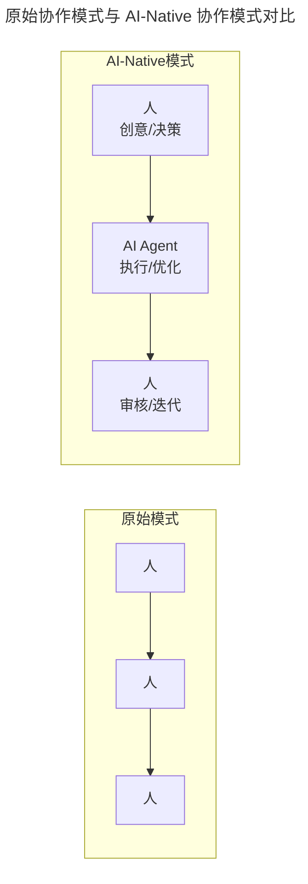
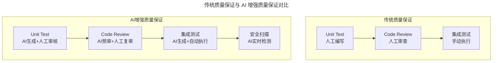
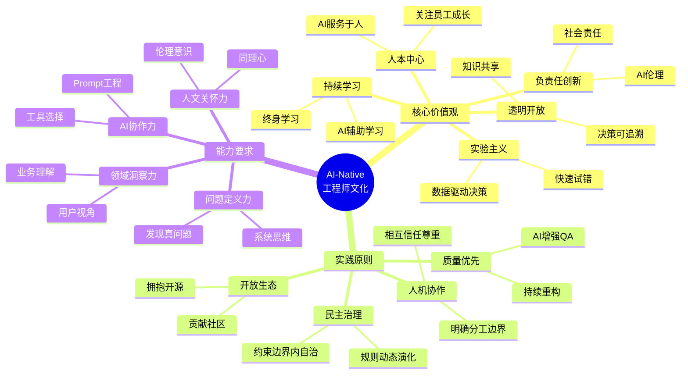

# 第31讲 | 五位技术领导者的文化构建实战

> **适用范围**：技术管理者（CTO、技术总监、技术 Leader）、需要构建工程师文化的团队负责人。适用于团队文化建设、代码质量保障、开放文化培育、AI-Native 工程师文化构建等场景。
>
> **更新摘要（v2 · 2026-08 更新）**：
> - 结构化升级为 6 节骨架（导言 / 核心方法论 / 关键流程 / 工具与实战 / 常见误区 / 进阶延展）
> - 整合原文五位领导者的实践与"AI 时代升级注解（2026）"，升级为 AI-Native 工程师文化框架
> - 保留全部 Mermaid 图并补充 `--- title: ... ---` frontmatter，每张图后追加文字解读

---

## 1. 导言

### 1.1 五位过来人的文化构建实战

作为技术领导者，构建良好的工程师团队文化可能是绕不过去的课题。本文请 5 位过来人讲述他们的文化构建实战经验。由于每个公司对工程师文化的理解不同，这些经验不一定能拿来就用，但至少可以提供一种思路。

五位技术领导者：
- 中青易游 CTO **张辉清**
- 付钱拉高级架构师 **周恒**
- 出门问问 CTO **雷欣**
- FreeWheel 高级副总裁 **容力**
- 花虾金融 CEO、前宜人贷 CTO **段念**

### 1.2 2026 年 AI 时代背景

2026 年，GPT-5.5 和 DeepSeek V4 的发布让 AI Agent 能力达到新高度，84% 的开发者正在使用或计划在开发流程中使用 AI 工具（Stack Overflow 2025 调查口径），Agent 开始在企业级场景中承担代码生成、测试、运维等职责。如果 2018 年的这五位领导者代表了传统工程师文化的最佳实践，那么 2026 年我们需要思考的是：**当 AI Agent 成为团队的"第六位成员"时，这些文化实践应该如何进化？**

---

## 2. 核心方法论

### 2.1 张辉清：共治分享自视一起拼，简单有效快

张辉清 35 岁前主要钻研技术，近几年逐步转向管理，带过几十人至一两百人的研发队伍。总结归纳了几个可以贴到墙上的大字："共治分享自视一起拼，简单有效快"。

- **共治**：部门要共同治理，自我管理和部门管理一起进行，每个人要管好自己，部门的共治转化为个人的自治。具体形式有部门共治文件夹、轮值会议等。
- **分享**：因为专业所以自信，因为自信所以开放，因为开放所以分享。具体形式有周五分享日、书斋建设。
- **自视**：自我察觉，双眼反向注视自己。对公司和他人的要求转化为对自己的要求，少一些抱怨，多找一些方法，如乐捐。
- **一起拼**：团队一起拼搏，一起奋斗，一起喝酒、一起爬山，如户外、项目管理。
- **简单有效快**：把复杂的事情变简单，追求事物的本质；"快"指快速交付、快速响应业务需求，如站立式会议。

当确定了这个阶段的部门文化后，团队氛围有较大改善：从死气沉沉到激情活力、从固步自封到好学分享、从互相推诿到勇于担当。

**关键观点**：文化的构建并没有想象的那么难，也没有多少高大上。它需要脚踏实地，一步一步埋头干。先有管理工具、制度和行为措施，然后予以贯彻，形成一种习惯，最后才是总结提升。构建团队文化的过程如同花朵或生物一般，需要播种、栽培，然后才能收获。这样「长」出来的文化，才能管人做事、深入骨髓、改变思想。

### 2.2 周恒：业务 + 技术结合，通过技术降低业务难度

付钱拉团队的经验是，最好的方式就是把业务和技术结合起来，通过技术降低业务的难度，从而提高学习的时间。分享技术，让代码和思想都能得到升华。

团队内部通过**工具化、框架化和实时重构**，本质简化了运维成本，同时提高了大家对技术的钻研兴趣，用学习的技术解决实际的生产问题。平时工作中多鼓励大家钻研技术、刨根问底、知识共享、思维创新，鼓励组建技术小组攻克技术难点，开展黑客马拉松，强调竞争、合理奖赏。工作之外组织游戏竞赛，放松心情、增强团队了解。

**关键观点**：工程师文化就是一种放松的、自我驱动的技术文化。工具化、框架化强调 DRY 原则，避免重复、提高工作效率；实时重构避免代码质量恶化、提升代码品质；技术氛围创造良好的环境，促进工程师文化持久留存，人人受益，团队才会受益。

### 2.3 雷欣：坚持原则、拥抱开源、鼓励更新

作为一个核心团队来自谷歌的初创公司，出门问问的公司文化很大程度上受到谷歌工程师文化的影响，印象最深的是谷歌对代码质量的要求和追求到了一种近乎狂热的程度。在小的 Start Up 中达到谷歌代码质量的建议：

- **坚持原则**：坚持 Unit Test 和 Code Review。Start Up 步伐很快，很多产品经理可能说"我只需要产品快速出来，不 Care 代码质量"。但从公司长远角度，把基础框架搭好后对以后发展稳定都有帮助。因此要在很大程度上坚持 Unit Test、建立 Code Review 机制，保证代码有一定质量。
- **拥抱开源**：谷歌已经把很多很好很酷的内部东西开源出来，只需把这些东西积攒在一起，搭建一套更适合创业公司的开发环境。
- **鼓励更新、快速迭代**：谷歌内部基本认为没有什么代码能活过 2、3 年，会对代码推陈出新。在推陈出新之间，会把以前没考虑到的做得更好，也锻炼新人、学到更多东西。

### 2.4 容力：拥有良好工程师基因团队的三点要素

1. **管理人员必须从技术第一线提拔而来**：技术公司的管理人员一定要从技术第一线提拔而来，这样公司才能保持工程师团队文化，这种文化才具有与生俱来的技术特性。转变为团队领导的人必须在他的团队里具有最顶尖的技术水平，要能够服众。
2. **培育一种开放的文化（信息和思维双维度）**：开放体现为信息维度的充分共享和思维维度的创造激发。技术层面和商业模式层面的信息，可以在领导层和员工之间充分沟通共享，让全员把握整体方向、理清优先级。大家本着平等开放原则，不会因说话的人不同而态度不同，目的是激发积极性、发挥创造力。
3. **对 Engineering Excellence 的追求**：公司度过生存期挑战并进入加速生长期时，要关注的不再是到处救火，而是追求卓越，打造可以在未来几年支撑业务发展的优秀技术平台。包括对 Full Life Cycle Engineer 理念的倡导、对 CI/CD（持续集成/持续交付）等高效开发流程的探索精进。

### 2.5 段念：强调约束、民主形成规则、行为一致而非思想一致

作为管理者，我们会忍不住像游戏一样去设计规则，但这是不可能的，也不应该这样做。应该强调约束，定义规则的边界，确保规则跟约束没有冲突。

倾向于让团队成员自己以民主的方式形成自己团队的规则，尽量不插手。团队发展早期可以尝试设置一些规则，但会发现这些规则很快被团队内部产生的新规则替代。

**共识的三个层次**：
- **愿景**："什么该做什么不该做"。
- **价值观**："应该怎样做事"，在愿景之下通过规则和约束体现。价值观不是贴在墙上的东西——越是贴在墙上反复念叨的，一般都是越没有的东西。
- **规则与约束**：行为层面。规则很容易被复制，在过程中价值观得到强化。

**关键观点**：更愿意大家在行为上一致，而不去追求思想上的一致。规则创建的过程应该是民主的，需要有冲突、有碰撞、有妥协——因为大家的思想并不一致；而规则一旦建立，则人人遵守规则。

---

## 3. 关键流程

### 3.1 五大实践案例的 AI 时代演进

**1. 张辉清"共治分享自视一起拼，简单有效快"的 AI 升级**

| 原始实践 | AI 时代演进 | 具体做法 |
|---------|-----------|---------|
| **共治**（共同治理） | **人机共治** | 引入 AI Agent 参与决策支持，但最终决策权在人 |
| **分享**（知识共享） | **智能分享** | 使用 AI 知识库自动沉淀和推荐最佳实践 |
| **自视**（自我觉察） | **AI 辅助反思** | 利用 AI 分析个人工作模式，提供改进建议 |
| **一起拼**（团队协作） | **人机协同拼** | 人负责创意和决策，AI 负责执行和优化 |
| **简单有效快** | **AI 加速的简单有效** | 用 AI 工具将复杂流程自动化，聚焦核心价值 |

> **图解**：原始模式是"人→人→人"的线性协作；AI-Native 模式是"人（创意/决策）→ AI Agent（执行/优化）→ 人（审核/迭代）"的循环，AI 承担执行优化，人类聚焦创意决策与审核迭代。

**2. 周恒"业务 + 技术结合"的 AI 升级**：AI 时代的"降低难度"新维度——AI Code Generation（生成 80% 样板代码，聚焦 20% 业务逻辑）、AI Code Review（自动检测质量问题和安全隐患）、AI Documentation（自动生成维护文档）、AI Testing（自动生成测试用例和回归测试）。案例：某团队引入 AI 编程工具后，代码开发效率提升 45%，Code Review 时间减少 60%，技术文档覆盖率从 30% 提升至 95%。

**3. 雷欣"坚持原则、拥抱开源、鼓励更新"的 AI 升级**

> **图解**：传统质量保证各环节全部人工执行；AI 增强质量保证中，Unit Test 由 AI 生成 + 人工审核，Code Review 由 AI 预审 + 人工复审，集成测试 AI 生成 + 自动执行，并新增 AI 实时安全扫描。

**4. 容力"管理一线提拔、开放文化、Engineering Excellence"的 AI 升级**：
- 管理一线提拔 → "AI-Native 一线经验"成为新要求，管理者画像增加：丰富 AI 协作经验、能定义问题而非仅解决问题、系统思维与跨领域整合能力。
- 开放文化 → "透明开放的 AI 文化"：信息维度开放（AI 决策可追溯、数据使用透明、算法偏见定期审计）；思维维度开放（鼓励质疑 AI 输出、欢迎多元技术选型、包容 AI 实验失败）。
- Engineering Excellence → "AI-Augmented Engineering Excellence"：代码质量（AI 生成代码同样高质量）、交付效率（AI 辅助下 10 倍速交付）、系统稳定性（AI 预测性维护）、安全性（AI 实时威胁检测）、可维护性（AI 自动文档生成）。

**5. 段念"强调约束、民主规则、行为一致"的 AI 升级**：
- 强调约束 → "AI 使用的边界约束"：禁止将敏感用户数据输入公共 AI 服务、AI 生成的核心业务代码必须经过双人 Review、关键决策不能完全依赖 AI、定期审计 AI 工具的使用日志和效果。
- 民主形成规则 → "人机协作的民主决策"：AI 收集数据 → 团队讨论 → AI 模拟效果 → 形成共识 → 制定规则。

---

## 4. 工具与实战

### 4.1 统一的 AI-Native 工程师文化框架

> **图解**：综合五位领导者的实践，AI-Native 工程师文化统一框架包含三大层面：核心价值观（人本中心、实验主义、负责任创新、持续学习、透明开放）、实践原则（人机协作、质量优先、开放生态、民主治理）、能力要求（问题定义力、AI 协作力、领域洞察力、人文关怀力）。

### 4.2 可执行建议汇总

| 领导者 | AI 时代可执行建议 |
|--------|-----------------|
| **张辉清** | 建立"人机协作角色矩阵"，明确人和 AI 的分工边界；使用 AI 项目管理工具；定期举办"AI 协作复盘会" |
| **周恒** | 配置 AI 编程助手；建立 AI 生成代码的质量标准和审查流程；将 AI 工具使用率纳入团队效率指标 |
| **雷欣** | 部署 AI Code Review 工具（CodeRabbit、Amazon CodeGuru）；使用 AI 测试生成工具；在 CI/CD 集成 AI 安全扫描；建立公司内部 AI 开源组件库；设立"技术债务偿还日"用 AI 辅助清理技术债务 |
| **容力** | 管理者选拔加入"AI 工具熟练度"评估；发布《AI 透明度报告》；建立"AI 伦理委员会"；制定《AI-Augmented Engineering Excellence 标准》 |
| **段念** | 制定《团队 AI 使用红线》；建立 AI 使用审批流程；实施 AI 行为监控；使用 AI 调研工具收集意见 |

---

## 5. 常见误区

| 误区 | 表现 | 正确做法 |
|------|------|---------|
| **照搬大公司文化** | 从管理书籍挑选几个词语挂墙上 | 脚踏实地，播种栽培，"长"出来的文化才管用 |
| **贴墙文化** | 越贴墙上反复念叨，越是没有 | 价值观通过规则和约束体现，而非口号 |
| **追求思想一致** | 想统一团队思想 | 追求行为一致，允许思想不同 |
| **规则强加** | 管理者像设计游戏一样设计规则 | 让团队民主形成规则，有冲突碰撞妥协 |
| **忽视代码质量** | 为了快牺牲 Unit Test 和 Code Review | 坚持原则，搭好基础框架利于长远 |
| **AI 完全替代人** | 让 AI 做核心决策、忽略人的判断 | 人机协作，关键决策必须有人判断 |

---

## 6. 进阶延展

### 6.1 关键洞察：文化是演进的，不是颠覆的

| 维度 | 2018 年 | 2026 年 |
|------|--------|--------|
| **核心理念** | 工匠精神 | 人机协同创造 |
| **技术栈** | 编程语言、框架 | LLM、Agent、MLOps |
| **协作模式** | 团队合作 | 人机协同网络 |
| **学习方式** | 培训 + 实践 | AI 辅助终身学习 |
| **质量标准** | 代码质量 | 价值 × 影响力 |
| **成功要素** | 个人能力 | 系统 + AI + 人 |

### 6.2 结语

以上是五位技术领导者在实践中总结的"工程师文化"的内涵及实施经验。不同公司的工程师文化确实存在比较明显的差异，也是在实践中慢慢演化而来。核心观点：**继承优秀传统，拥抱 AI 变革；文化演进而非颠覆，人文关怀永不过时。**

### 6.3 延伸阅读

- 极客时间《技术领导力 300 讲》相关章节
- 《卓有成效的管理者》（德鲁克）关于愿景、使命、价值观的论述
- 谷歌工程师文化、Netflix 文化的公开资料
- 2026 年 AI 开源生态（Hugging Face、LangChain、CrewAI 等）实践资料
