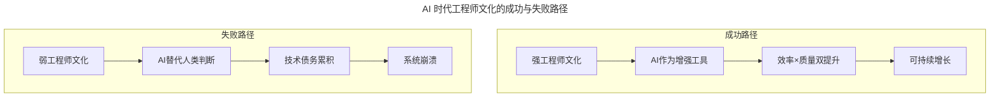
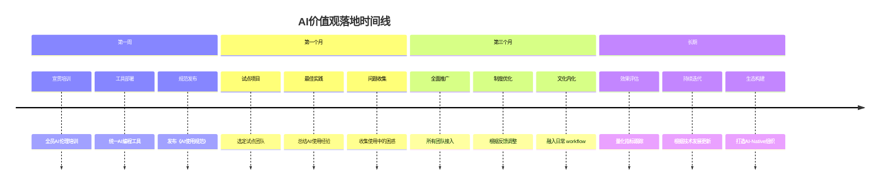

# 第30讲 | 关于工程师文化的六个问题

> **适用范围**：技术管理者（CTO、技术总监、技术 Leader）、创业公司创始人、需要审视自身文化建设的团队负责人。适用于工程师文化认知、文化宣言制定、价值观落地、AI 时代文化演进等场景。
>
> **更新摘要（v2 · 2026-08 更新）**：
> - 结构化升级为 6 节骨架（导言 / 核心方法论 / 关键流程 / 工具与实战 / 常见误区 / 进阶延展）
> - 整合原文"六个问题"与"AI 时代升级注解（2026）"，将传统工程师文化议题升级为 AI 时代版本
> - 保留全部 Mermaid 图并补充 `--- title: ... ---` frontmatter，每张图后追加文字解读

---

## 1. 导言

### 1.1 从硅谷科技公司说起

说到工程师文化，很多人会马上想到 Netflix、Google、Facebook 等知名的硅谷科技公司。如果一家公司的"工程师文化"备受推崇，大家往往会觉得很羡慕，但到底什么是工程师文化、我们为什么需要工程师文化，却没有多少人说得清楚。本文通过几位技术高管的视角，重新审视这些问题。

### 1.2 本文的核心问题

围绕工程师文化，我们提出了六个关键问题，由不同领域的技术领导者作答：
1. 工程师文化能够令一家公司获得成功吗？
2. 为什么要强调工程师文化？
3. 如何让工程师文化体系化、可传承？
4. 如何让价值观潜移默化地影响每个人？
5. 在公司规模快速扩张的情况下，怎样保护公司文化？
6. 硅谷和国内的工程师文化差异在哪里？

### 1.3 2026 年 AI 时代背景

2026 年，DeepSeek V4 的发布让 AI 编程能力再次飞跃，Agent（智能代理）开始在企业级应用中加速落地。根据 GitHub 数据，**AI 生成的代码占比已从 2023 年的 30% 飙升至 2026 年的 68%**。如果说 2018 年的六个问题定义了传统工程师文化的核心议题，那么 2026 年我们需要面对的是：**当 AI 成为每个工程师的"超级助手"时，工程师文化应该如何演进？**

---

## 2. 核心方法论

### 2.1 问题一：工程师文化能够令一家公司获得成功吗？

**答题人：Andreessen Horowitz 联合创始人 Ben Horowitz**

任何技术初创企业必须要做的首当其冲的事情是，开发出这样一款产品，它做某件事情达到的效果至少要比目前市面上通行的方式**好 10 倍**。好 2、3 倍还不够。第二件事是**占领市场**。上述事情如果有一件办不到，文化就会变得一点重要性都没有——**这个世界到处充斥着拥有世界级文化的破产公司，文化并不能造就一家公司。**

为什么还要谈文化？三个理由：
1. 文化关系到你实现上述目标的程度。
2. 随着公司壮大，文化能帮助你坚守核心价值，让你处在一个有利位置。
3. 最关键的一点：在你历尽艰辛换来成功之后，如果文化却让你感觉连自己都不想呆在那里，你的努力将是一场史诗般的悲剧。

**⭐ 2026 升级视角**：AI 是放大器——好的工程师文化 + AI = 指数级增长；差的文化 + AI = 系统性风险。例如：某金融科技公司通过 AI-Native 文化 3 个月将研发效率提升 40%；而某电商公司盲目引入 AI 工具但缺乏代码审查文化，导致线上故障增加 25%。

> **图解**：强工程师文化下 AI 作为增强工具实现"效率 × 质量双提升"的可持续增长；弱工程师文化下 AI 替代人类判断导致技术债务累积甚至系统崩溃。文化决定了 AI 是放大器还是放大器上的风险。

### 2.2 问题二：为什么要强调工程师文化？

**答题人：Atlassian 技术传播者 Sven Peters**

产品时刻都在发展变化，一个倾注血汗和眼泪的产品可能在几年后不复存在。但如果能同时专注于创造健壮的团队和编码文化，就能时刻准备着抓住机遇。**伟大的文化促成伟大的产品。**

人们通常将文化可见的外部标志——免费食物、饮品、瑜伽课程、Aeron 电脑椅、电视游戏、Nerf 玩具枪——错误地等同于文化。文化与这些福利没有半点关系。**文化是我们如何交流、工作、组织、荣辱与共。** 如果员工害怕失败，公司等级森严，雇主把利润看得比员工更重要，即使有再多的免费食物也无济于事。文化如此重要的一个原因就是无论公司规模多大，它都可以帮助公司始终保持创新。

**⭐ 2026 升级视角**：AI-Native 文化的新特征——实验主义、透明开放、人本中心、持续学习、负责任创新。可执行建议：招聘时加入 AI 协作能力评估、将 AI 伦理纳入价值观体系、建立"AI 使用最佳实践"知识库。

### 2.3 问题三：如何让工程师文化体系化、可传承？

**答题人：微软 CTO、前 LinkedIn 高级副总裁 Kevin Scott**

在扩展研发团队的时候，最有价值的管理工具是**文化宣言（Cultural Manifesto）**——一个文件或一组材料，帮助整个研发团队处在同一轨道上。文化宣言是引领公司高速增长的锚。

如何建立文化宣言：
- **不要等到灾难出现才开始行动**：无视研发文化会不经意间产生巨大危害，应尽早起草宣言。
- **经常性地讨论和修改宣言**：随着时间推移，宣言可作为优化研发文化的方式。
- **寻求协调，而非达成共识**：让每个人在同一轨道上并不意味着让每个人都认同。文化宣言不是一份意见目录，而是一份打印好的承诺。
- **明确界定研发的角色**：市场能帮助研发团队清楚认识研发的角色，研发必须具有灵活性。

**⭐ 2026 升级视角**：AI-Native 文化宣言应包含技术观（追求人机协同价值最大化）、协作观（人机协同、知识实时同步）、学习观（终身学习 + AI 辅助学习）、创新观（鼓励负责任的 AI 创新）、责任观（对用户、社会、环境负责）。

### 2.4 问题四：如何让价值观潜移默化地影响每个人？

**答题人：Red Hat 总裁兼 CEO Jim Whitehurst**

当行动和价值观一致时，组织文化就成一种积极的力量，推动组织更快实现更大的创新；当行动和价值观相背离时，组织就举步维艰。

举例：一家核心价值观是"安全"的公司，会议开始时会有人一本正经地向大家告知紧急出口位置和疏散路线，没有人觉得诧异——这家公司让"安全"这一核心文化的价值无处不在，建立了安全无处不在的一系列可观察和学习的行为。

**价值只出现在行为中，行为取决于价值观。** 当同事加入组织时，他们会立即接受周围人的行动表达出来的价值观。

### 2.5 问题五：在公司规模快速扩张下，怎样保护公司文化？

**答题人：Jimdo CTO Arne Roock**

凭空制定自己向往的公司文化，然后指望据此建立一家公司，绝无成功可能。**公司文化的来源正好相反，它已经蕴藏在公司的运转方式里面**，重要的是从中鉴别出有效的成分，确认创始人和每位员工认为重要的方面。

一旦确定了核心价值观，写成书面记录可以坚定公司的支持立场。接下来采取行动来滋养、强化和扶植树立起来的公司文化——首先从创始人自身开始，以身作则来影响其他人。**每当遭遇困境、面对重大变化或招聘新员工时，停下来问一问核心价值观可以怎样帮忙解决当前的状况。**

### 2.6 问题六：硅谷和国内的工程师文化差异在哪里？

**答题人：Twitter 高级主任工程师王天**

工程师本身没有区别，硅谷在多年的发展过程中积累了很多好的实践，普通工程师已经受到这些实践的训练。**国内对底线的容忍比较低，工程师文化的发展实际上是慢慢抬高这个工程质量底线。**

硅谷有很好的工程师文化，是因为大家在环境和社区影响下塑造了比较好的底线，有共同的话语。国内这些话语在慢慢形成，当这些实践慢慢实施开时，国内的底线也会提高，工程师的环境也会更加活泼健康。科技媒体和整个社区的交流非常重要。

---

## 3. 关键流程

### 3.1 问题四的 AI 落地：AI 价值观如何潜移默化地影响每个人？

> **图解**：AI 价值观落地遵循"宣贯培训→试点项目→全面推广→文化内化"时间线，从第一周的工具部署与规范发布，到长期的生态构建，逐步让 AI 价值观成为团队行为的一部分。

**具体行为准则示例**：
1. AI 生成代码必须经过 Code Review
2. 敏感数据处理禁止使用公共 AI 服务
3. AI 决策过程需要可解释、可审计
4. 定期分享 AI 使用的经验和教训

### 3.2 AI 时代文化保护与进化的应对策略

**AI 时代的文化挑战**：技术变化太快文化跟不上；员工对 AI 产生焦虑或抵触；AI 可能强化现有的偏见和不平等。

**应对策略**：
1. 建立"文化敏捷机制"：每季度 review 并更新文化实践。
2. 开展"AI 心理建设"：帮助员工理解 AI 是助手而非替代者。
3. 引入多元化视角：确保 AI 工具的选择和使用不加剧群体差异。

---

## 4. 工具与实战

### 4.1 硅谷 vs 国内在 AI-Native 工程师文化上的差异（2026）

| 维度 | 硅谷 | 国内 |
|------|------|------|
| **AI 工具采用率** | 92% | 84% |
| **Agent 落地程度** | 早期探索 | 快速跟进 |
| **文化开放度** | 高度透明 | 逐步开放 |
| **监管环境** | 相对宽松 | 逐步完善 |
| **人才竞争** | 全球化 | 本土化 + 国际化 |

**国内的优势**：应用场景丰富（移动支付、社交电商、智慧城市等）、政策支持力度大、数据资源优势、工程师勤奋度高。

### 4.2 2026 行动清单

**立即行动（本周）**：组织一次"AI 与工程师文化"主题讨论会；评估当前团队对 AI 工具的使用情况；阅读 AI-Native 文化最新文章。

**短期计划（1-3 个月）**：制定《团队 AI 使用规范》初稿；选定 1-2 个团队进行 AI-Native 文化试点；引入 AI 编程工具并提供培训支持。

**中期目标（3-6 个月）**：全面推广 AI-Native 文化实践；建立 AI 文化效果评估体系；举办"AI 创新黑客马拉松"。

**长期愿景（6-12 个月）**：打造行业标杆的 AI-Native 工程师文化；输出文化实践案例；建立可持续的文化演进机制。

---

## 5. 常见误区

| 误区 | 表现 | 正确做法 |
|------|------|---------|
| **把福利当文化** | 以为免费食物、健身房就是文化 | 文化是交流、工作、组织、荣辱与共的方式 |
| **文化万能论** | 以为有文化就能成功 | 文化不能造就公司，产品好 10 倍 + 占领市场是前提 |
| **强求共识** | 让每个人都认同文化宣言 | 寻求协调而非达成共识，宣言是承诺不是意见目录 |
| **凭空设计文化** | 制定理想文化指望据此建公司 | 从实际运转方式中鉴别有效成分 |
| **AI 替代人类判断** | 引入 AI 工具但缺乏审查文化 | 强文化下 AI 作增强工具，保持代码审查 |

---

## 6. 进阶延展

### 6.1 2026 年新问题：AI 时代的工程师文化应该回答什么？

1. **如何平衡 AI 效率与人文关怀？** 避免"AI 至上主义"，保持人的主体地位，关注员工职业成长和心理健康。
2. **如何建立 AI 时代的信任机制？** AI 生成的代码和决策如何获得团队信任？如何防止 AI 被滥用或误用？
3. **如何培养下一代"AI-Native 工程师"？** 从校园到职场的过渡如何设计？技能模型应如何重新定义？
4. **如何在全球化竞争中保持文化特色？** 既吸收国际最佳实践，又保留本土文化精髓。

### 6.2 延伸阅读

- 极客时间《技术领导力 300 讲》相关章节
- Ben Horowitz《创业维艰》关于企业文化的论述
- Kevin Scott 关于文化宣言的实践
- GitHub 关于 AI 生成代码占比的数据报告（2023-2026）
