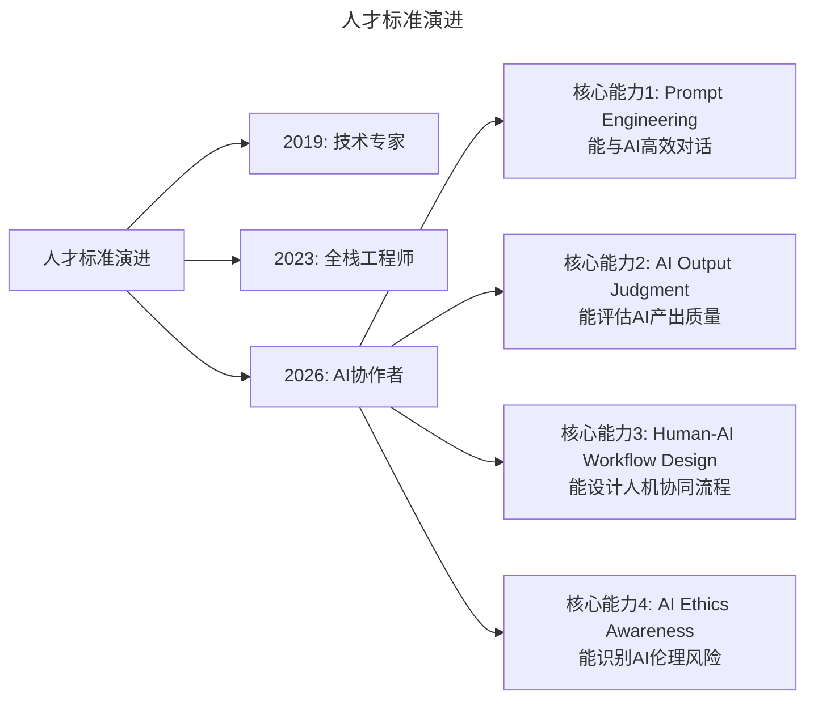

# 大咖对话 | 王平：从人、事、价值观、文化等维度看技术团队转型

> **适用范围**：技术管理者（CTO、技术总监）、创业者、需要推动技术团队转型或打造团队文化的负责人。适用于技术转型战略、出海业务判断、团队文化建设、AI 时代组织升级等场景。
>
> **更新摘要（v2 · 2026-08 更新）**：
> - 结构化升级为 6 节骨架（导言 / 核心方法论 / 关键流程 / 工具与实战 / 常见误区 / 进阶延展）
> - 整合原文访谈与"AI 时代升级注解（2026）"，重组为统一骨架
> - 保留全部 Mermaid 图并补充 `--- title: ... ---` frontmatter，每张图后追加文字解读

---

## 1. 导言

### 1.1 嘉宾介绍

今天作客大咖对话的嘉宾是前 Mobvista CTO **王平**，在 Mobvista 负责公司整体商业变现技术体系的构建和管理。此前先后在百度、高德就职——在百度作为凤巢核心成员负责凤巢流量变现商业产品的技术管理，随后加入高德担任商业变现总监。多年职业生涯一直活跃于互联网商业变现领域的风口，对行业技术体系构建有深刻理解。

### 1.2 本文核心议题

我们跟他聊了聊出海创业的趋势，以及公司技术转型中的挑战与实践。核心围绕王平在 Mobvista 主导技术转型的"人、事、价值观、文化"四阶段经验。

---

## 2. 核心方法论

### 2.1 技术转型的四阶段模型

王平在 Mobvista 的技术转型路线，经历了**人、事、价值观、文化**四个关键阶段：

- **人（人才战略）**：最早推进的事情。没有人才储备，就没有所谓的技术驱动。早期半年内搭建了一支核心团队，未来团队几乎以此为基础展开。
- **事（业务梳理）**：梳理业务和技术体系，确定一系列重点业务和技术专项，全力解决重点核心工作以求突破，又通过"事"来以战养兵。
- **价值观（行为准则）**：伴随着人和事的推进，确定了团队当时的价值观：以终为始、有分工无边界、有功必奖有过必究等。
- **文化（凝聚力）**：前三者几乎同时进行，稳定持续近 2 年；文化是在 2016 年底开始思考和推进的。

### 2.2 150 人规模临界点

上述举措在团队规模 **150 人以内**是能 work 的，但超过 150 人以后，团队管理会遇到很大的效率和执行问题。

- 出了问题，复盘后会发现是某个操作流程或规范上有缺陷，处理方法自然是完善这些地方。
- 但企图通过流程机制或规范的不断完善细化来解决整个管理中的问题，几乎是不可能完成的任务——**规则不可能穷尽**。规则制定得越细，团队成员可发挥的空间就越少。
- 问题的根源在于人多了，不同人的想法、追求、价值观都有差别。因此关键点是：**如何让大家在公司或技术团队范畴内拥有统一的价值观或文化**。

### 2.3 文化解决灰度地带问题

打个比方，社会有其道德价值观，也有法律，但法律只能规定整个社会的道德底线，而没法定义上限。这跟公司的流程规范类似，都只能定义底线。

**价值观或文化的另一个好处是：能在很多灰度地带，引导大家自动选择一个相对正确的行动方向，避免制定极其详细繁杂的流程规范和机制。**

---

## 3. 关键流程

### 3.1 打造技术团队文化的执行路径

确定思路之后，就要去打造属于技术中心的统一的价值观和文化。在具体的执行层面：

1. **招聘一位 HRBP**：需要一个能够在文化建设方面帮助自己的人。文化构建对技术管理者来讲是相对陌生的课题，在一定范畴内属于 HR 体系的事情，专业的事情交给专业的人来做。
2. **确定文化是什么并解读**：确定整个技术团队的文化，以及怎么解读这个文化，哪些案例最能体现文化内涵。当时定下的技术团队文化是**敬畏技术、追求卓越**，再把执行层面的价值观（以终为始、有分工无边界、有功必奖有过必究等）和完善进去。
3. **不断强化文化**：在整个公司层面、各个场合不断强化文化，不断强调哪些价值观、哪些行为会被公司认可，比如通过奖励机制引导成员行为逐渐靠近文化推崇的行为。

### 3.2 文化落地挑战：中层管理者是最大阻力

文化落地过程中存在很多挑战，最典型的例子是**中层管理团队已经在文化和价值观上出现偏差**。推动文化落地时，必然会在中层管理团队这儿感受到阻力，比如推脱"现在业务很紧，如果在质量保障上投入更多精力就可能影响业务进度"。

但这中间的逻辑存在问题：乍一看业务很忙，自然要聚焦业务；但长远来看，减少质量保障的时间，反而会出更多问题影响业务。

因此需要先对整个中层管理团队做一个整体 Check，看他们的文化和价值观取向是否一致，如果出现差异极大的同学，就必须重新调整。**当团队扩张到更大规模时，文化与价值观能否统一，会决定整个团队的精神面貌以及未来的战斗力。**

---

## 4. 工具与实战

### 4.1 出海创业趋势的判断

王平对移动出海的观察（2019 年视角，对创业者有参考价值）：
- 自 2010 年中国移动互联网出海浪潮兴起，历经工具类应用百花齐放、安全桌面类应用和轻型游戏爆发、娱乐内容类产品迭代崛起，目前已进入稳定发展阶段。
- 出海成为热点的原因：国内移动互联网市场趋于饱和、人口红利消耗殆尽，而海外（南美、印度、东南亚）蓝海市场优势仍在。
- 现在出海拼的不再是信息差和经验差，而是**创业者的战略、产品、市场等真正的内功修为**。出海产品在往内容类、社交类、购物类转型时面临规模化瓶颈。
- 国内创业新局面：市场依旧很大（如拼多多下沉挖掘市场）；产业升级带来互联网+机会（VIPKID、钉钉）；互联网发展到十字路口，物联网、AI 领域将带来生产力级跃迁。**对于有技术追求的创业者，不妨多关注和死磕技术竞争力。**

### 4.2 AI 时代的"人"：从"招牛人"到"招 AI 协作者"

> **图解**：人才标准从 2019 年的"技术专家"、2023 年的"全栈工程师"演进到 2026 年的"AI 协作者"，核心能力包括 Prompt Engineering、AI 产出评估、人机工作流设计、AI 伦理意识。

### 4.3 AI 时代"事"与"价值观"的演进

- **"事"**：从"项目制"到"Agent 任务制"——人类提出目标 → Agent 拆解任务 → AI 执行 → 人类审核 → 迭代优化。新挑战：如何衡量 AI 完成的工作量？如何确保 AI 输出质量？如何在人机混合团队中分配 KPI？
- **"价值观"**：王平的"敬畏技术、追求卓越"在 2026 年需要补充三大新维度：

| 传统价值观 | 2026 年新增价值观 | 具体含义 |
|-----------|----------------|---------|
| 敬畏技术 | **负责任地使用 AI** | 不滥用 AI 生成虚假内容，保护用户隐私 |
| 追求卓越 | **拥抱 AI 但不盲从** | 能质疑 AI 的建议，保持独立思考 |
| 有功必奖 | **认可 AI 辅助的贡献** | 合理评估"人+AI"的共同成果 |

### 4.4 2026 行动清单

**对于技术领导者**：重新定义团队文化宣言（加入 AI 伦理准则和人机协同原则）；建立 AI 能力矩阵；设计"Human-in-the-Loop"工作流；创建"AI 文化大使"机制。

**对于 HR/管理者**：招聘时增加 AI 协作面试题（如"请描述一个你用 AI 解决问题的具体案例"）；修订绩效考核指标（从"个人产出"转向"个人+AI 协同产出"）；开展 AI 焦虑管理工作坊。

**对于创业者**：在 A 轮前就建立 AI 文化基因；文档化 AI 使用规范（Prompt 模板库、AI 输出审核清单、伦理红线）。

---

## 5. 常见误区

### 5.1 观点的 AI 时代验证（需调整处）

| 原始观点 | 2026 年验证 | 验证结果 |
|---------|-----------|---------|
| 150 人是管理临界点 | AI 工具普及后，单管理人效提升 2-3 倍，临界点可能上移至 **300-400 人**；但 AI 也带来新的管理复杂度（Prompt 标准化、AI 输出质量控制） | 需调整 |
| 文化解决灰度地带问题 | 依然成立且更关键。AI 时代的决策更多涉及伦理边界（AI 生成内容版权、算法偏见），文化价值观成为唯一指南针 | 强化 |
| 中层管理者是阻力 | 部分成立。2026 年中层管理者面临双重压力：既要推动 AI adoption，又要管理员工对 AI 替代的焦虑 | 复杂化 |
| HRBP 协助文化建设 | 需扩展为"HRBP + AI Ethics Officer"双轨制 | 需升级 |

### 5.2 常见误区

| 误区 | 表现 | 正确做法 |
|------|------|---------|
| **规则无穷尽** | 试图用不断细化的流程解决所有问题 | 用文化价值观覆盖灰度地带 |
| **出海信息差红利** | 以为海外仍是蓝海，靠信息差取胜 | 出海拼的是战略、产品、市场内功 |
| **忽略中层阻力** | 文化落地不处理中层偏差 | 先 Check 中层价值观，差异大者需调整 |

---

## 6. 进阶延展

### 6.1 核心金句（2026 版）

> **"2026 年的文化建设的核心命题是：当 AI 能做 80% 的工作时，剩下的 20%（判断、创意、伦理）如何通过文化来保障？"**

> **"团队规模的临界点不再是人数，而是'有效协作单元数'——一个人类 + 多个 AI Agent 可以被视为一个超级协作单元。"**

> **"中层管理者的新使命：不是管控下属，而是管理'人机混合团队'的生产力和士气。"**

### 6.2 AI 时代"文化"的新内涵

从"信息透明"演进为"算法透明 + 决策透明 + AI 角色透明"：
- **算法透明**：解释 AI 如何做决策。
- **决策透明**：明确哪些由 AI 决定，哪些由人决定。
- **AI 角色透明**：团队清楚 AI 的定位是工具还是伙伴。

### 6.3 延伸阅读

- Mobvista 技术转型实践相关分享
- 极客时间《技术领导力 300 讲》大咖对话系列
- 关于"团队文化""灰度地带""150 人定律"的组织管理资料
