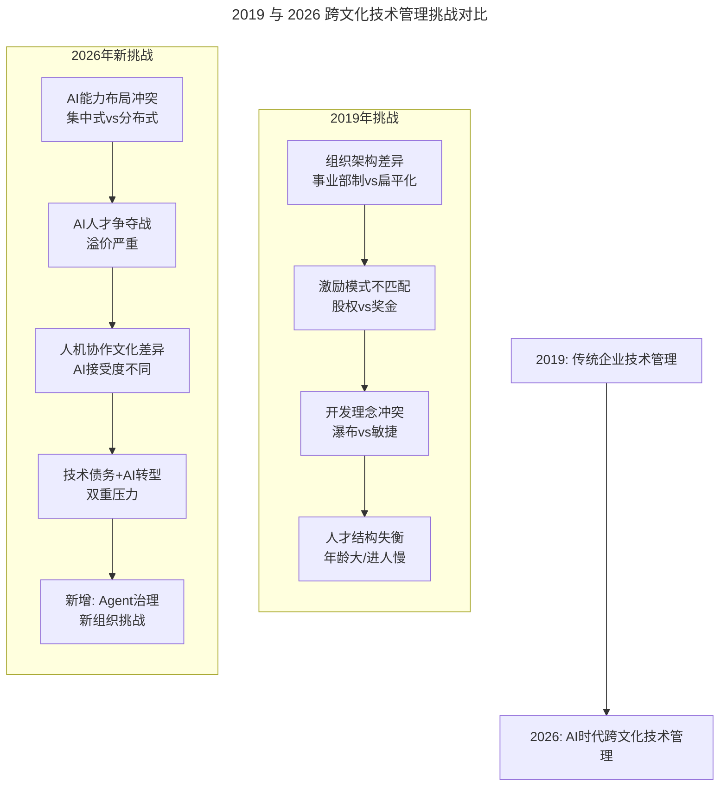

# 第27讲 | 如何在不同组织文化下推行技术管理

> **适用范围**：互联网背景的技术高管、空降到传统企业的 CTO/技术总监、需要在不同组织文化下推行技术管理的负责人。适用于跨文化技术管理、技术体系构建、AI 时代组织转型等场景。
>
> **更新摘要（v2 · 2026-08 更新）**：
> - 结构化升级为 6 节骨架（导言 / 核心方法论 / 关键流程 / 工具与实战 / 常见误区 / 进阶延展）
> - 整合原文与两份"AI 时代升级注解（2026）"，重组为统一骨架
> - 保留全部 Mermaid 图并补充 `--- title: ... ---` frontmatter，每张图后追加文字解读
> - 将"作者简介"融入导言，参考资料融入进阶延展

---

## 1. 导言

### 1.1 从互联网到传统企业的转型背景

2016 年初，我从一家互联网视频公司出来，那时感受到移动互联网创业达到顶点，人口红利吃尽，2C 端流量饱和。这时很多传统企业都在谈数字化转型。我本人接到了很多公司的邀请去构建行业的云平台，来自汽车、医疗、教育等行业的都有。同时看到业内一些朋友从互联网公司加盟了传统企业，有做得比较成功的（如平安科技、链家网），也有很多人遭遇了诸多挑战甚至很快折戟沉沙。

### 1.2 作者简介

钟忻，易建科技技术副总裁兼云服务事业群总经理，TGO 鲲鹏会北京分会会员。2003 年清华大学自动化硕士毕业。曾在 Turbolinux、IBM、Intel 等多家 IT 公司担任资深软件工程师。13 年底到 16 年初担任乐视云平台高级总监，主导了乐视 IaaS、PaaS 平台从无到有的全过程。目前负责易建科技上千人研发团队的技术体系搭建，以及整个海航集团的 IDC 和基础云平台的产品研发、运营和市场开拓。

### 1.3 2026 年 AI 时代背景

2026 年，AI Agent 的普及正在重塑所有企业的技术管理范式。原文讨论的"互联网技术高管进入传统企业"话题有了全新维度——**无论互联网公司还是传统企业，都面临着"AI-Native"转型的历史性机遇**。

> **图解**：2019 年跨文化技术管理挑战围绕组织架构、激励、开发理念、人才结构；2026 年新增 AI 能力布局、AI 人才争夺、人机协作文化差异、技术债务 + AI 转型双重压力、Agent 治理等新挑战，复杂度显著提升。

---

## 2. 核心方法论

### 2.1 传统企业 VS 互联网：面临的挑战

通过两年多的经历，我发现传统企业在诸多方面跟互联网企业存在很多不同，对技术高管推行技术管理会带来很多挑战：

| 维度 | 互联网企业 | 传统企业 |
|------|-----------|---------|
| **组织架构** | 扁平化（三级制管理），以业务为导向 | 事业部制，各事业部独立人财物，研发以成本为导向 |
| **激励机制** | 看重创造性，工资高 + 股权期权 | 看重资源资本，多为项目奖金，工资较低 |
| **开发模式** | 敏捷开发，小团队作战、快速迭代 | 瀑布模型，对新需求响应缓慢 |
| **人员特征** | 新陈代谢快、人员年轻 | 进人慢、学历要求高、很少淘汰、平均年龄大 |

传统企业组织架构的问题：公司层面没有 CTO 或各事业部研发虚线汇报，导致各自为政、技术力量分散、没有统一技术体系，最终形成大大小小的**技术孤岛**，不容易有核心技术积累。

### 2.2 个人经历：一次失败的转型

某传统集团型企业想进行互联网转型，公司管理层下决心在集团层面一年投入上亿预算，成立专门的 PMO 组织，请顶尖咨询公司做业务规划，成立专门的技术产品团队，构建整套私有云平台和微服务架构，并落地校园支付 App。但由于组织架构、人员激励、团队配合等问题，新技术和产品未能得到有效推行，新团队很快瓦解。

### 2.3 个人经历：成功的转型

吸取教训后，在目前公司管理层的支持下，一年内推动了以下工作：
- **技术体系的构建**：成立专家委员会（由各事业群技术总监及提名的技术专家组成），定期会议和月度技术分享。通过一年运行，各事业群形成各自技术体系，同时公司层面三套技术体系有了边界和融合（A 构建 IT 大中台，B 聚焦 IaaS/CaaS 平台，C 对外用 AI 向各事业部赋能）。适度的重复和冗余是必要的，但彼此可以有技术交流促进。
- **新技术的推动**：即便有常态化机制，推动新技术也会遭遇阻力。需要利用时间窗口和契机。如集团对信息安全重视时，迅速组建安全团队，顺势把技术体系提升一个台阶。
- **管理方式的调整**：就像 Gartner 的双模 IT 理念，确实有传统 IT 和敏捷业务并存的情况。没必要强行推动敏捷 DevOps，允许不同团队选择适合自己的开发机制。对不同团队用不同激励手段（正向/负向），灵活运用。

### 2.4 开展工作前先考虑这些

- **业务机会**：技术毕竟是为业务服务的，如果没有好的业务机会，技术再厉害也没有很好的施展空间。
- **管理层的支持**：管理层需要对技术有合理预期、重视长期价值，不急于短期见效，对技术落地给出好建议。
- **碎片化到体系化**：重塑的过程必定是碎片化的，量变引起质变。碎片需要我们一点点去寻找和拼凑，直到引发整体变革。

---

## 3. 关键流程

### 3.1 从"技术孤岛"到"AI 能力孤岛"

**原文痛点**：传统企业各事业部各自为政，形成技术孤岛，没有统一技术体系。

**2026 年新痛点**：AI 能力的建设面临同样的碎片化问题——每个部门都在独立采购 AI 工具、训练模型、积累数据。新问题包括：AI 工具 license 浪费（重复采购）、数据无法共享（数据孤岛加剧）、AI 能力无法复用（重复造轮子）、安全风险分散、供应商锁定不同。

### 3.2 钟忻方法的 AI 版：建立"AI 能力委员会"

**原文做法**：专家委员会由各事业群技术总监组成，定期会议和分享。

**2026 增强方案**：建立企业级 AI 能力中心（AI 平台组、数据治理组、AI 安全组），升级 AI 能力委员会（各事业群 AI 负责人 + AI 能力中心主任 + CISO/CDO 代表，月度会议 + 季度战略对齐）。核心职责：统一 AI 技术栈和工具选型、制定数据共享标准和 API 规范、建立企业级 Prompt Library、协调 AI 人才调配、审批重大 AI 项目投资、建立 AI 安全和伦理规范。

### 3.3 双模 IT 的 AI 版本："双速 AI"

**原文做法**：Gartner 的双模 IT 理念——传统 IT 和敏捷业务并存，允许不同团队选择适合自己的开发机制。

**2026 年升级**：引入"双速 AI"概念：
- **Mode 1（稳定型 AI）**：适用于核心业务系统，高可靠性（99.99%+）、低容错、监管合规严格。适用风控反欺诈、合规审查、核心业务流程 AI 优化。管理方式：严格模型审批、完整测试验证、人工审核 + AI 执行混合。
- **Mode 2（创新型 AI）**：适用于探索性业务，高不确定性、快速迭代、失败容忍度高。适用新产品原型、前沿技术 POC、用户行为预测。管理方式：敏捷/MVP 导向、A/B 测试驱动、失败快速学习更快。

关键成功因素：明确划分边界、不同模式用不同 KPI、建立 Mode 1 ↔ Mode 2 转化通道、高层理解支持。

### 3.4 AI 技术推动的"窗口期"识别与利用

| 窗口类型 | 触发条件 | 机会点 |
|---------|---------|-------|
| **监管驱动** | 新法规出台 | 借机建立 AI 治理框架，申请专项预算 |
| **竞品压力** | 竞争对手发布 AI 新产品 | 用具体案例说服管理层投资 AI |
| **业务痛点爆发** | 某业务线效率低/成本高 | 用 AI 方案解决具体痛点，建立成功案例库 |
| **技术成熟拐点** | 某 AI 技术突然成熟/开源/降价 | 技术门槛降低，快速 POC，抢占先发优势 |

---

## 4. 工具与实战

### 4.1 AI 人才的激励与留存（2026）

AI 人才薪资溢价更夸张（50-200%），传统企业更难吸引和留住。2026 年 AI 人才薪酬（年薪）：AI 算法工程师互联网 80-150 万 vs 传统企业 50-90 万（溢价 -40%）。

传统企业在薪酬上无法与互联网巨头竞争，但可以在**资源、成长、影响力**上打造差异化优势。综合激励包：
- **薪酬部分**：有竞争力的 base salary（至少市场 80%）、项目奖金与 AI 成果挂钩、长期激励。
- **非薪酬激励**：充足的 GPU/算力预算、订阅最新 AI 工具、参加顶级 AI 会议；明确的 AI 职业发展通道、与高校/研究院合作、内部 AI 技术分享会、轮岗机制；充分自主权、减少行政流程、"AI 创新日"制度；AI 成果向高层直接汇报、行业会议展示机会、内部"AI 之星"评选、参与 AI 战略制定的发言权。

### 4.2 从"瀑布 vs 敏捷"到"AI 加速迭代"

| 开发模式 | 2018 年效率 | 2026 年 + AI 后效率 | 提升倍数 |
|---------|-----------|----------------|---------|
| 需求分析 | 2 周 | 2 天（AI 辅助） | 5x |
| 编码实现 | 4 周 | 1 周（AI 生成 80% 代码） | 4x |
| 测试验证 | 2 周 | 3 天（AI 自动测试） | 3.3x |
| 文档撰写 | 1 周 | 0.5 天（AI 生成） | 10x |
| **总周期** | **9 周** | **约 2 周** | **4.5x** |

### 4.3 2026 年技术高管"空降"行动建议

- **空降前（择业阶段）**：评估目标企业的 AI 成熟度（Initial → Managed → Defined → Optimized）；确认管理层的 AI 期望值；了解现有的 AI 能力和债务。
- **空降后 0-3 个月（融入阶段）**：倾听多于行动，先找到"quick win"建立信任；绘制 AI 现状地图，识别 AI 能力孤岛；建立早期 AI 联盟，用成功案例影响更多人。
- **空降后 3-12 个月（推动阶段）**：推动建立 AI 治理架构（AI 能力委员会）；实施"双速 AI"策略；培养 AI 人才梯队。
- **长期（12 个月+）**：实现"AI-Native"的组织转型，从"AI 项目"进化到"AI 能力"。

### 4.4 2026 年技术管理者必备 AI 工具

| 类别 | 推荐工具 | 用途 |
|------|---------|------|
| **AI 编程** | Cursor、GitHub Copilot | 代码生成、重构、Review |
| **AI Agent** | AutoGPT、LangChain、CrewAI | 自动化工作流构建 |
| **知识管理** | Notion AI、Mem | 企业知识库 RAG |
| **数据分析** | Julius AI、Code Interpreter | 数据洞察、报表生成 |
| **文档生成** | Claude 4.5、GPT-5.5 | 技术文档、PRD |

---

## 5. 常见误区

### 5.1 跨文化技术管理误区

| 误区 | 表现 | 正确做法 |
|------|------|---------|
| **照搬互联网管理手段** | 把互联网公司一套方法直接用到传统企业 | 认识组织、激励、开发模式差异，避免水土不服 |
| **强行推敏捷** | 不顾业务实际强行推动敏捷 DevOps | 允许不同团队选择适合的开发机制（双模 IT） |
| **期望一步到位** | 期望完美战略和一步到位落地 | 碎片化到体系化，量变引起质变 |
| **忽略业务机会** | 只看技术不看业务 | 技术为业务服务，没有业务机会就没有施展空间 |
| **忽略管理层支持** | 管理层没有合理预期就推进 | 先争取管理层对技术的长期价值认可 |

### 5.2 2026 年特别提醒：避坑指南

| 坑 | 错误做法 | 正确做法 |
|----|---------|---------|
| **AI washing（AI 洗白）** | 为迎合潮流给所有项目贴 AI 标签 | 只在真正能带来 10x 提升的场景用 AI |
| **忽视人的因素** | 认为 AI 可完全替代人，大规模裁员 | AI 是"能力放大器"，目标是"Augment human, not replace human" |
| **数据隐私与安全** | 将敏感业务数据直接输入公有云大模型 | 部署私有化大模型或使用企业级安全方案 |
| **过度依赖 AI** | 盲目信任 AI 生成代码，不做 Code Review | 建立"AI 生成→人工审查→测试验证"三道防线 |

---

## 6. 进阶延展

### 6.1 核心观点总结

钟忻老师在 2019 年分享的传统企业技术管理经验，在 2026 年的 AI 时代**不仅没有过时，反而更加重要**：

1. **"碎片化到体系化"的规律依然成立**：AI 能力的建设同样需要耐心，不可能一步到位。"量变引起质变"的智慧在 AI 时代更加珍贵。
2. **组织文化的差异被 AI 放大**：互联网企业和传统企业在 AI 接受度上的差距，比当年在"敏捷开发"上的差距更大。
3. **"双模 IT"进化为"双速 AI"**：稳定型 AI 和创新型 AI 需要完全不同的治理模式。
4. **管理层支持仍然是第一要素**：没有管理层的真正理解和投入，一切 AI 转型都是空谈。
5. **"为年轻人创造空间"的理念永不过时**：年轻人正是 AI-Native 的一代，他们是未来。

### 6.2 2026 年技术管理 KPI 新指标

| 新指标 | 定义 | 目标值 |
|--------|------|--------|
| AI Adoption Rate | 团队使用 AI 工具的比例 | >90% |
| AI-Augmented Productivity | 人均产出（vs 基线） | 提升 3-5x |
| Velocity Multiplier | AI 加持下的迭代速度提升 | >2x |
| Knowledge Reuse Rate | AI 生成的代码/方案被复用的比例 | >60% |
| Time-to-Competency | 新人达到独立工作能力的时间 | 降低 50% |

### 6.3 延伸学习资源

- Stack Overflow 2025 开发者调查：84% 开发者正在使用或计划使用 AI 工具
- McKinsey: The State of AI in 2025：企业 AI 落地最新数据
- Gartner Hype Cycle for AI 2026：判断 AI 技术成熟度
- a16z AI Canon、Latent Space Podcast、AI Engineer Summit
- 极客时间《技术领导力 300 讲》相关章节
