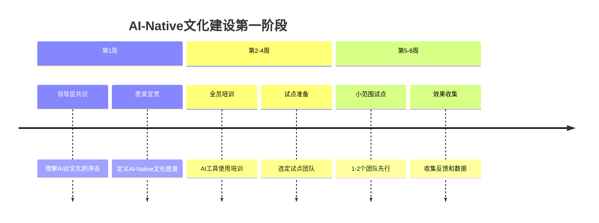

# 第67讲 | 如何打造独属自己的工程师文化？

> **适用范围**：技术管理者（CTO、技术总监、技术 Leader）、需要打造独属团队文化的负责人。适用于工程师文化定义、文化落地、OKR 挑战性设计、AI-Native 文化建设等场景。
>
> **更新摘要（v2 · 2026-08 更新）**：
> - 结构化升级为 6 节骨架（导言 / 核心方法论 / 关键流程 / 工具与实战 / 常见误区 / 进阶延展）
> - 整合原文运满满文化建设案例与"AI 时代升级注解（2026）"，重组为统一骨架
> - 保留全部 Mermaid 图并补充 `--- title: ... ---` frontmatter，每张图后追加文字解读
> - 将"作者简介"融入导言

---

## 1. 导言

### 1.1 工程师文化的意义

之前的文章谈到了业务支撑和技术驱动，这两点是打造有活力、持续创新的研发团队的基础。除了自上而下的推动外，很重要的一点是**通过打造优秀的工程师文化，激发研发团队成员的自我驱动力**，让他们由内而外地真正思考公司业务的发展和创新。

### 1.2 作者简介

王东，运满满 CTO，资深技术专家与管理者，曾先后负责过 10 多条亿级用户的产品研发管理工作，历任天猫高级技术专家、360 高级总监、百度主任架构师，有过两次创业经验。

### 1.3 2026 年 AI 时代背景

2026 年，84% 的开发者正在使用或计划在开发流程中使用 AI 工具（Stack Overflow 2025 调查口径），GPT-5.5 和 DeepSeek V4 的发布让 Agent 能力大幅提升。在这样的背景下，工程师文化不再是单纯的"人的文化"，而是**"人 + AI 协同"的文化**。

---

## 2. 核心方法论

### 2.1 文化是什么

谷歌、Facebook、亚马逊等都有很强的工程师文化。以亚马逊为例，其工程师文化包括：通过解决问题来改造世界、基于事实与科学规律、实践务实、逻辑的、专业的、创造性、不断更新知识、好奇心驱动、对质量的重视、注重效能与效率、交流与传播等。

我们经常跟国内外公司交流，学习他们的文化和做法。交流是一个非常重要的打开团队思路的方法，给团队制定目标后，除了让大家自己思考，也要让大家多出去交流，看看其他公司是怎么做的。

**谷歌、亚马逊的工程师文化非常好，但不代表我们能全盘学习、拿来就用。** 每个公司都有自己的独特之处，要结合自己当时的状态、行业的状态，以及未来发展后的状态，来定义自己的文化。

### 2.2 四大文化支柱

运满满在管理层进行共创后，确定了以下四个文化方向：

**一、有担当**：对于自己 Own 的事情和系统负责，有强烈责任感，出问题第一时间跳出来想解决方案并一竿子跟到底。要总结和思考怎么把事情做得更好，推动自己 Own 的事情跟外部合作拿到结果，站在客户角度思考问题。

**二、执行力、速度感**：但执行力和速度感**并不是加班**，而是要擅总结、有方法。要不停熟悉项目和系统，主动总结和思考，发现问题和改进问题，主动沉淀相关技术和工具。真正的执行力来自清晰的思路和深厚的功底，是厚积薄发的过程。

**三、有挑战、做精彩**：弄清楚重点是什么，必须在重点事情上拿结果；提出和做到有挑战的事情。考核的不是 OKR 达成率，而是 OKR 的**挑战性或精彩性**。对先定不太难 OKR 的做法（哪怕完成 120%），并不赞同。

**四、大声说话、开放皮实**：鼓励大家乐于和勇于表达自己的观点。在晋升、表彰时也会考虑这一点，看他是否愿意表达观点——表达观点一般代表他进行了思考。越有想法、越爱表达的人，越会重点培养。

以上做法兼容了国内互联网公司要拼、要快的风格和国外互联网公司要创新的思维。每家企业都不一样，最重要的是结合自身业务重点、团队发展重点、对未来的期望，创造和融合出属于自己的文化。

---

## 3. 关键流程

### 3.1 文化如何落地：共创与共识

文化定义出来后，如何落地？毕竟改变一群人、让大家认同团队文化并将其当作自己的观点是很困难的事。

**做法是又进行了一次共创**，不是直接把结果告诉大家，而是带领团队去思考。没有自己思考的过程，团队不会认同你，即使表面认同，内心也会有疑问。提出一堆问题供大家思考：
- 什么样的研发就算一个好研发？
- 什么样的测试就算一个好测试？
- 什么样的运维就算一个好运维？
- 我们认同什么样的人？我们 Hire 什么样的人？我们做什么样的 Leader？

捋完这些问题后发现，大家对于"好"的定义和认知是一致的。然后提炼精炼，首先在管理层达成共识，定下对"好"的定义，再推广到全体员工。

**首先，管理者是关键，要律人律己。** 一是根据共识确定选拔标准（够快、有创新能力）；二是各个管理层隔几个月做一次群 Review，反思哪里做得好、哪里做得不好，先保证 Leader 层面的味道。

**其次，落地到员工。** 不是简单弄个文化墙就能搞定，要落到具体关键事情上。

> **图解**：AI-Native 文化建设第一阶段（认知对齐）遵循"领导层共识→全员培训→小范围试点"节奏，在 1-2 个月内完成认知对齐、工具培训和试点准备。

### 3.2 文化落地的三个抓手

**1. 树榜样、荣誉体系**：每三个月有一个开放日，讲公司目标、规划和发展情况，对优秀员工进行表彰，设立的奖项完全匹配文化——有担当奖、最快执行力奖（给打了攻坚仗的项目）、创新奖（看有没有自己的 Idea）。

**2. 员工 One One、项目管理**：与员工做 One One 深度沟通，对于追求的快、速度感、执行力、Ownership 等特质，做得怎么样、哪里值得表扬、哪里需要加强。项目复盘时也会复盘这个。

**3. Hire、Fire**：作为管理者，有时候需要比较坚决。文化这个事情并不是每个人都能认同和融入的，但不认同并不代表他不好，也许只是不适合。对于认同我们、做出贡献的人一定要对得起他；如果观点不一样，尽早分开，避免更多沉没成本。

> **金句**：当你鼓励什么的时候，什么就会生长起来；当你反对什么的时候，什么就会消失掉。

---

## 4. 工具与实战

### 4.1 四大文化支柱的 AI 时代演进

**1. 有担当 → "人机共担"的责任文化**

| 原始内涵 | AI 时代升级 | 具体实践 |
|---------|-----------|---------|
| 对自己 Own 的系统负责 | **人对 AI 生成的代码负责** | AI 生成代码必须经过人工审核 |
| 出问题第一时间跳出来 | **建立 AI 事故响应机制** | 明确 AI 相关问题的责任归属 |
| 主动思考和改进 | **用 AI 辅助发现潜在问题** | 利用 AI 进行代码质量预测 |
| 推动外部合作拿结果 | **AI 增强的跨团队协作** | 用 AI 工具提升沟通效率 |

**2. 执行力、速度感 → "AI 加速"的执行文化**：人提供方向，AI 提供加速度。

| 场景 | 传统方式（耗时） | AI-Native 方式（耗时） | 效率提升 |
|------|-----------------|---------------------|---------|
| 编写 CRUD 接口 | 2-4 小时 | 30 分钟 + 15 分钟审核 | **75-85%** |
| 编写单元测试 | 1-2 小时 | 10 分钟 + 10 分钟审核 | **80-85%** |
| 技术文档编写 | 3-4 小时 | 20 分钟 + 30 分钟修改 | **80-85%** |
| Code Review | 1-2 小时/人 | 30 分钟 AI 预审 + 30 分钟人工复审 | **50-60%** |

> **关键洞察**：执行力和速度感不是靠加班，而是靠工具赋能和流程优化。AI 时代真正的速度感来自：正确的方向 + AI 的加速 + 人的把控。

**3. 有挑战、做精彩 → "AI 增强创新"的挑战文化**

| 维度 | 传统 OKR | AI-Native OKR |
|------|---------|---------------|
| **目标(O)** | 完成 XX 系统重构 | **用 AI 辅助将重构效率提升 50%** |
| **KR1** | 重构 3 个核心模块 | **AI 生成 70% 代码，人工聚焦架构设计** |
| **KR2** | 测试覆盖率提升至 80% | **AI 自动生成测试用例，覆盖率达到 90%** |
| **KR3** | 文档完善度 100% | **AI 实时生成和维护文档，覆盖率 100%** |

**4. 大声说话、开放皮实 → "透明开放的 AI 协作"文化**：AI 决策过程透明化（分享 AI 辅助决策的过程和依据）、知识共享智能化（用 AI 知识库沉淀最佳实践）、反馈机制实时化（利用 AI 收集和分析团队反馈）。

### 4.2 文化效果的度量指标（2026）

| 维度 | 传统指标 | AI-Native 指标 | 目标值 |
|------|---------|---------------|--------|
| **工具采用率** | N/A | AI 编程工具活跃用户占比 | ≥90% |
| **效率提升** | 代码产出量 | 人均有效代码行数（AI 辅助后） | 提升 40%+ |
| **质量保持** | Bug 数 | AI 生成代码 Bug 率 | ≤人工水平 |
| **创新活跃度** | 专利数/论文数 | AI 创新项目数量 | 季度 ≥5 个 |
| **员工满意度** | 满意度调查 | AI 工具满意度评分 | ≥4.5/5.0 |

---

## 5. 常见误区

| 误区 | 表现 | 正确做法 |
|------|------|---------|
| **全盘照搬外部文化** | 拿来谷歌/亚马逊文化就用 | 结合自身状态、行业、未来状态定义独属文化 |
| **执行力 = 加班** | 用加班代替执行力和速度感 | 擅总结、有方法，来自清晰思路和深厚功底 |
| **OKR 求稳** | 先定不太难的 OKR 完成 120% | 考核 OKR 的挑战性和精彩性 |
| **文化墙上贴标语** | 以为弄个文化墙就搞定 | 落到具体关键事情（荣誉体系、One One、Hire/Fire） |
| **文化强推不共创** | 直接把结果告诉大家 | 带团队思考，先达成共识再推广 |

---

## 6. 进阶延展

### 6.1 关键洞察：文化是生长出来的，不是设计出来的

原文观点："构建团队文化的过程就如同花朵或生物一般，需要播种、栽培，然后才能收获。"

AI-Native 文化的"生长"逻辑：播种（领导层示范）→ 发芽（小范围试点）→ 成长（规模推广）→ 开花（最佳实践涌现）→ 结果（文化内化）。

**核心原则**：领导层先践行（CTO/VP 率先使用 AI 工具并分享经验）；让事实说话（用数据和案例证明 AI 价值）；尊重个体差异（不强制，鼓励自愿参与）；持续迭代优化。

### 6.2 2026 年展望：从"工程师文化"到"Creator 文化"

未来的工程师文化可能演变为**"Creator 文化"（创造者文化）**：
- 从"写代码"到"创造价值"：工程师核心职责从编码转向价值创造。
- 从"个人英雄"到"人机协同"：成功关键在人机配合的默契。
- 从"技术深度"到"问题洞察"：能定义正确的问题比解决问题更重要。
- 从"工匠精神"到"系统思维"：关注整个系统的优化而非局部最优。

### 6.3 延伸阅读

- 亚马逊工程师文化的公开资料
- OKR 挑战性设计的实践资料
- 极客时间《技术领导力 300 讲》相关章节
