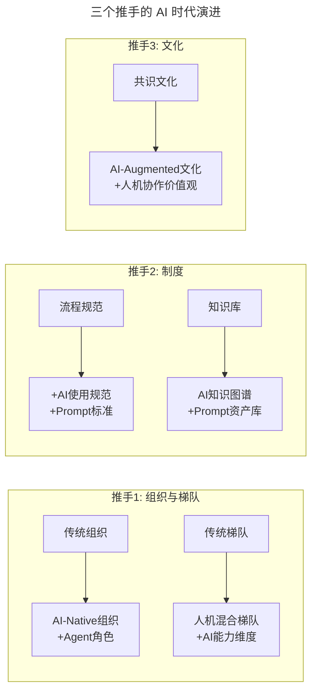

# 第115讲 | 成敏：打造优秀团队与文化的三个推手

> **适用范围**：技术管理者（CTO、技术总监、技术 Leader）、需要做组织架构设计与团队建设的负责人。适用于组织与梯队建设、制度建设、文化建设、AI 时代组织进化等场景。
>
> **更新摘要（v2 · 2026-08 更新）**：
> - 结构化升级为 6 节骨架（导言 / 核心方法论 / 关键流程 / 工具与实战 / 常见误区 / 进阶延展）
> - 整合原文"三推手"框架与"AI 时代升级注解（2026）"，扩展为"三推手 + AI 治理"
> - 保留全部 Mermaid 图并补充 `--- title: ... ---` frontmatter，每张图后追加文字解读

---

## 1. 导言

### 1.1 团队与文化的重要性

在当前高速变化的互联网行业，新的技术和新的模式一直在不断涌现，如果能拥有健壮的团队和优秀的文化，就能有更多的机会克服障碍，抓住新出现的机遇。同时，发展优秀的文化需要团队本身达成共识，而这种凝聚力会正向地反映到团队所构建的产品上——**优秀的文化促成优秀的产品**。

如何打造优秀的团队与文化？一般可以从**组织与梯队建设、制度建设、文化建设**三个方面入手。

### 1.2 2026 年 AI 时代背景

2026 年，84% 的开发者正在使用或计划在开发流程中使用 AI 工具（Stack Overflow 2025 调查口径），人机协作成为新常态。成敏老师的"三推手"框架在 AI 时代需要扩展为"三推手 + AI 治理"，以应对 AI 工具标准化、质量把控、成本管理、伦理合规等新挑战。

> **图解**：三个推手在 AI 时代各自演进——组织与梯队增加 Agent 角色和人机混合梯队，制度增加 AI 使用规范和 Prompt 资产库，文化增加人机协作价值观。

---

## 2. 核心方法论

### 2.1 推手一：组织与梯队建设

#### 组织建设

组织建设有三个考量点：**沟通效率、执行效率、人力成本**。

- **常见组织结构**：垂直向划分（以技术类别划分 QA、运维、前端等部门）、横向划分（以业务为导向，每条业务线包含独立研发、QA、运维）、矩阵型划分。很难说哪种划分方法完全正确。
- **沟通效率**通常与组织结构划分有关，技术组织是业务体系的一种映射，当技术组织与业务体系匹配时，整体沟通效率会更高。
- **案例**：某公司创业之初以技术类别垂直划分，团队规模大了之后发现某个产品需要协调后端、前端、移动端、运维等多个部门，沟通难度大大增加。当发展到 500 人左右规模时，改为按业务线横向划分，沟通效率、资源分配率、成本核算率都大大提高。
- **执行效率**：其成本占比会随着团队变大而增加。垂直划分下，某个业务的移动团队需求只能进入需求池按排期做，执行效率大打折扣。
- **人力成本**：垂直划分人员集中、人力成本相对节约；横向划分会带来人员重复建设，造成人力成本、技术成本上升，但能带来业务效率提升，需要在组织建设时衡量人力成本与业务成本的关系。

#### 梯队建设

合理的梯队建设可以帮助团队规避许多风险：
1. **降低人员变动风险**：避免"只有一个能力很牛的人，一旦离职就没人接手"的情况。
2. **使技术人力成本更加合理**：避免让高水平工程师做初级简单工作造成浪费。
3. **定制人员成长发挥空间**：定期（至少一年一次）review 团队梯队结构，除技术能力外还要考虑沟通能力、性格等维度。让擅长沟通的人多负责外联事务，让喜欢钻研技术的人更多研究技术难点。

### 2.2 推手二：制度建设

制度建设分为**流程规范**和**知识库**两个方面。

- **流程规范**：流程不是为了最好地解决问题，而是**为了避免最坏的情况产生**。规范不是为了统一对错，而是为了协同共识。以编码规范为例，选择某个规范只是为了协调团队达成共识，规避争议。**老掉的流程比没有流程更有害**，要像 review 梯队一样经常 review 流程规范。
- **知识库**："见字如见人"，知识库的水准基本可以衡量团队的整体水准。互联网行业人员流动快，没有完整知识库，很多东西就没法传承。构建知识库能有效避免"业务绑架"问题——某个员工以独特而有价值的知识长期占据岗位且不愿分享。

### 2.3 推手三：文化建设

优秀文化对团队、技术人员有极强的凝聚力，但文化建设需要遵循两个要点：
1. **避免理想主义，必须有明确的目标**：比如团建要真正将整个团队融合在一起，传递公司想传递的信息，而不是熟络的同事形成小圈子。
2. **基于共识，而不是强推**：文化的核心在于融入，而非排斥。君子和而不同，尽量将不同背景、不同年龄、不同想法的人融合在一起。

---

## 3. 关键流程

### 3.1 新增第四个推手：AI 治理能力（2026）

| 维度 | 具体内容 |
|-----|---------|
| AI 工具标准化 | 统一工具选型、使用规范 |
| AI 质量把控 | 输出审核机制、质量标准 |
| AI 成本管理 | 用量监控、ROI 追踪 |
| AI 伦理合规 | 使用边界、数据隐私 |

### 3.2 组织与梯队建设的 AI 化流程

- **组织建设**：从"垂直/横向/矩阵"演进为"AI-Native 组织"，引入 Agent 角色。
- **梯队建设**：从"传统人岗匹配"演进为"人机混合梯队"，增加 AI 能力维度（Prompt Engineering、AI 工具熟练度、AI 协作经验）。

---

## 4. 工具与实战

### 4.1 制度建设的 AI 增强

| 制度 | 传统做法 | AI 时代增强 |
|------|---------|-----------|
| **流程规范** | 编码规范、研发流程 | + AI 使用规范、Prompt 标准、AI 代码审查流程 |
| **知识库** | 文档、WIKI | + AI 知识图谱、Prompt 资产库、AI 生成的文档与问答系统 |

### 4.2 文化建设 Checklist（2026）

**月度检查项**：
- 团队 AI 工具使用率是否达标（目标：100%）
- 是否有新的 AI 最佳实践产生
- 是否出现"AI 负能量"现象并及时处理
- AI 相关培训是否按计划进行
- 流程规范是否需要更新

**季度复盘项**：
- 团队文化是否符合 AI 时代需求
- 成员 AI 技能是否有提升
- 人机协作效率是否改善
- 是否出现新的文化挑战

---

## 5. 常见误区

| 误区 | 表现 | 正确做法 |
|------|------|---------|
| **组织划分万能论** | 认为某种组织结构完全正确 | 组织结构是业务体系的映射，随规模动态调整 |
| **梯队失衡** | 团队只有一个牛人，或高才低用 | 搭建合理梯队，降风险、合理成本、定制成长 |
| **流程僵化** | 流程老掉不更新 | 经常 review 流程规范，符合当前业务形态 |
| **忽视知识库** | 认为构建知识库是重复麻烦的工作 | 知识库避免业务绑架，传承团队经验 |
| **文化建设理想主义** | 团建流于形式、小圈子 | 明确目标，真正融合团队、传递信息 |
| **文化强推** | 不尊重团队共识强行推行 | 基于共识，融入而非排斥 |

---

## 6. 进阶延展

### 6.1 三推手在 AI 时代的完整框架

成敏老师的"三推手"框架在 AI 时代扩展为"三推手 + AI 治理"：

1. **组织与梯队建设** → AI-Native 组织 + 人机混合梯队
2. **制度建设** → AI 使用规范 + Prompt 资产库 + AI 知识图谱
3. **文化建设** → AI-Augmented 文化 + 人机协作价值观
4. **AI 治理能力（新增）** → 工具标准化 + 质量把控 + 成本管理 + 伦理合规

### 6.2 延伸阅读

- 极客时间《技术领导力 300 讲》相关章节
- 关于组织架构设计、梯队建设、知识库建设的经典资料
- 2026 年 AI 治理、AI 伦理相关行业实践
