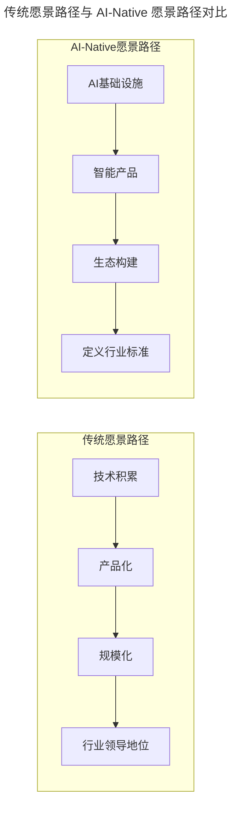
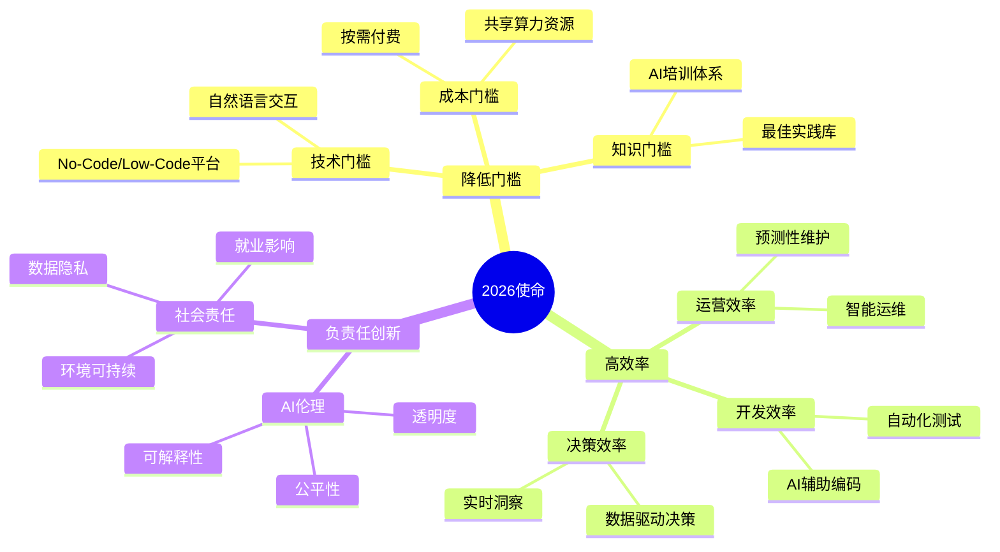

# 第32讲 | 文化是管理的那只无形之手

> **适用范围**：CTO、技术总监、VP 等"O"级别管理者、需要构建技术文化的团队负责人。适用于技术文化构造、愿景使命价值观设计、MTP（Massive Transformation Purpose）制定、AI-Native 组织文化构建等场景。
>
> **更新摘要（v2 · 2026-08 更新）**：
> - 结构化升级为 6 节骨架（导言 / 核心方法论 / 关键流程 / 工具与实战 / 常见误区 / 进阶延展）
> - 整合原文与"AI 时代升级注解（2026）"，将文化从"无形之手"升级为 AI 时代的"有形可度量之手"
> - 保留全部 Mermaid 图并补充 `--- title: ... ---` frontmatter，每张图后追加文字解读
> - 将"作者简介"融入导言

---

## 1. 导言

### 1.1 文化的定义与价值

文化是人类群体创造并共同享有的物质实体、价值观念、意义体系和行为方式，是人类群体的整个生活状态。对应到技术管理上，就是管理者对于大家意识的影响力，小到对于整个技术团队价值观、公司技术氛围、行为方式和状态的构造和影响能力，大到对于国内技术生态甚至国际技术生态的影响力。

文化对于公司和部门管理非常重要，它是**无形之手**，决定了你团队的价值观是什么，你的公司能不能招聘到高级的技术人员，在我们日常流程和管理者眼睛看不到的地方，员工是怎样工作的。是否可以打造一个合适公司发展的技术文化，是否可以构造一个开放、透明的技术氛围，是否有能力建立一个 MTP（Massive Transformation Purpose）让每个技术人员深入人心。

### 1.2 文化的地位：与领导力并列

"影响意识"的能力是一个 CTO 水平高低的评判标准，也是每个"O"级别管理者能力的体现。同样是 CEO/CTO，除了可以"成事"的领导力，**文化构造能力也是决定了哪些企业可以持续壮大、哪些企业会昙花一现的关键要素**。

### 1.3 作者简介

郭炜，易观 CTO，中国软件行业协会智能应用服务分会副主任委员，TGO 鲲鹏会北京分会董事会会长。负责构建易观技术团队、完成易观大数据采集、平台、数据挖掘等技术架构与体系；从无到有完成易观混合云的搭建、易观 SDK 的升级，并发布易观秒算实时计算平台。目前易观大数据平台日处理数据量 30T、272 亿条，月活用户 5.5 亿。

### 1.4 2026 年 AI 时代背景

2026 年，GPT-5.5 和 DeepSeek V4 让 AI 能力达到新高度，Agent 加速落地期已经到来，84% 的开发者正在使用或计划在开发流程中使用 AI 工具（Stack Overflow 2025 调查口径）。如果说 2018 年的文化是管理的"无形之手"，那么 2026 年的 AI 正在让这只手变得**可感知、可度量、可优化**。

---

## 2. 核心方法论

### 2.1 构造技术文化的关键点：愿景

愿景是技术团队要成为什么。一般会根据公司的业务和技术团队具体情况定义一个宏大定义，它就像一面旗帜，吸引高级技术人才的同时激励现有员工不断学习、挑战自己的极限。

**易观的愿景**：技术团队要成为世界顶尖的用户大数据团队。这里结合公司愿景阐述了几件事：第一，易观技术团队是做大数据的，特别是用户大数据（用户画像、数据存储、数据采集、数据处理、数据引擎），招聘和技术品牌宣传可以定向；第二，我们要做世界级别的顶尖技术团队，要的是卓越人才，面临的挑战也是世界级别的，激励员工不断挑战不可能。

只定义愿景不够，不能把它变成空口号，而要在日常的招聘、培训、工作安排中体现实际行动：招聘的是否是卓越人员，培训辅导是否国际化，技术挑战是否其他公司无法提供，是否有技术大牛在难关时指点迷津。

### 2.2 构造技术文化的关键点：使命

使命是技术团队要去做什么，一般是宏大的概念，和公司业务抽象集成。它和价值观一起，指导员工具体怎样去做事情，让团队在做决策、发生矛盾时有统一目标。

**易观的使命**："让未来数据科技开箱即用"。几层含义：
- **未来**：使用最前沿甚至自主研发的技术，放眼未来科技，不停滞于当前临时的困难。
- **数据科技**：明确针对数据细分领域，做科技而非简单技术应用，需要科学家的探索和迭代试错。
- **开箱即用**：说明技术目标不是为了炫技，而是让内外部客户通过极致的体验认识到卓越技术的效果。技术要有商业闭环，一味追求技术并不是技术团队要追求的事。

大家在定义技术团队使命时，一定要和公司实际业务结合，这样可以和公司其他部门耦合更紧密。

### 2.3 构造技术文化的关键点：价值观

价值观是一个团队提倡的团队理念，不符合这个理念的人不能招聘到团队中。首先，价值观在公司大价值观之下；其次，针对技术团队需增加特殊价值理念（如绝对透明、勇于担当），这些价值观定义了你的团队是怎样的一群人走到一起。

价值观和一个人管理者的管理风格密切相关。一个高级管理者的价值观会带入团队，所以有"强将手下无弱兵""兵怂怂一个，将怂怂一窝"。价值观没有对错，但定义了哪些人可以"对味"。碰到公司价值观红线，很可能被清理出团队。

---

## 3. 关键流程

### 3.1 愿景的 AI 时代重构：从"世界顶尖团队"到"AI-Native 组织"

> **图解**：传统愿景路径是"技术积累→产品化→规模化→行业领导地位"的线性推进；AI-Native 愿景路径是"AI 基础设施→智能产品→生态构建→定义行业标准"，从"提供工具"转向"赋能生态"，从"行业领先"转向"定义未来"。

**2026 愿景升级版示例**："打造 AI-Native 的数据智能平台，用人机协同的方式，让数据科技开箱即用，赋能千万企业的数字化转型。"

| 维度 | 传统愿景 | AI-Native 愿景 |
|------|---------|---------------|
| **核心能力** | 技术深度 | 人机协同创造力 |
| **价值主张** | 提供工具 | 赋能生态 |
| **竞争壁垒** | 技术积累 | 数据 + 算法 + 场景 |
| **成功标准** | 行业领先 | 定义未来 |

### 3.2 使命的 AI 时代重构：从"让数据科技开箱即用"到"让 AI 触手可及"

> **图解**：2026 使命从"降低 AI 使用门槛"（技术、成本、知识门槛）、"高效率"（开发、运营、决策效率）和"负责任创新"（AI 伦理、社会责任）三个维度展开，让每一家企业低成本、高效率地享受 AI 价值。

**2026 使命升级版**："降低 AI 使用门槛，让每一家企业都能低成本、高效率地享受 AI 带来的价值；通过负责任的创新，推动行业的可持续发展。"

### 3.3 价值观的 AI 时代重构：从"绝对透明、勇于担当"到"透明开放、人本中心、负责任创新"

**价值观一：透明开放（Radical Transparency）**：AI 时代透明性从代码层面（AI Code Review）、决策层面（AI 会议纪要 + 决策依据公开）、数据层面（数据使用日志 + 算法审计）、算法层面（可解释 AI XAI + 模型卡片）全面升级。具体实践：AI 生成代码标注、决策过程留痕、定期透明度报告。

**价值观二：人本中心（Human-Centric）**：核心理念是"AI 是工具，人才是目的"。正确的人本观是"AI 增强人类 → 提升工作质量 → 关注成长发展 → 人才吸引"，而非"AI 替代人类 → 追求极致效率 → 忽视员工感受 → 人才流失"。具体实践：AI 技能培训、职业转型支持、心理健康关注。

**价值观三：负责任创新（Responsible Innovation）**：AI 创新有四层边界——法律合规（数据隐私、知识产权、行业监管）、伦理道德（公平性、透明度、问责制）、技术安全（系统稳定性、数据安全、对抗攻击）、社会影响（就业影响、数字鸿沟、环境可持续）。具体实践：建立 AI 伦理审查机制、设立 AI 安全红线、定期进行社会影响评估。

---

## 4. 工具与实战

### 4.1 重新定义"技术领袖"的能力模型（2026）

**传统 CTO 画像**：技术深度、团队管理、业务理解、战略思维。

**2026 CTO 画像**：以上传统四要素 + **AI 战略规划能力、AI 伦理判断力、跨领域整合能力、人文关怀意识**。

可执行建议：为现有 CTO/技术 VP 提供 AI 领导力培训；招聘技术领导者时加入 AI 相关能力考察；建立 CTO AI Advisory Board 提供外部视角。

### 4.2 打造"AI-Ready"的技术氛围

1. **物理环境**：配备高性能 GPU 工作站、提供 AI 开发算力、建立 AI 实验沙箱环境。
2. **工具链**：统一部署 AI 编程助手（Copilot、Cursor）、集成 AI 测试/CI-CD 工具、建立 AI 知识库和最佳实践库。
3. **流程制度**：制定《AI 使用规范》、建立 AI 项目审批流程、设立 AI 创新基金。
4. **文化活动**：定期举办 AI 黑客马拉松、组织 AI 技术分享会、表彰 AI 创新先锋。

### 4.3 建立 MTP（Massive Transformation Purpose）的 AI 版本

**传统 MTP 示例**："让未来数据科技开箱即用"。
**AI-Native MTP 示例**："用 AI 的力量，让每一个创意都能快速变成现实，让每一份数据都能创造价值，让每一个人都能享受到技术进步的红利。"

MTP 设计原则：宏大但可实现（激发使命感但不空洞）；以人为本（强调对人的价值）；面向未来（指引 5-10 年方向）；简单易传播（一句话能说清）。

### 4.4 文化落地的度量指标（AI 时代版）

| 维度 | 传统指标 | AI-Native 指标 |
|------|---------|---------------|
| **参与度** | 培训出勤率 | AI 工具使用率、活跃度 |
| **认同度** | 员工满意度调查 | AI 文化认同度评分 |
| **实践度** | 文化活动次数 | AI 项目数量、创新案例数 |
| **效果度** | 团队绩效 | 人机协作效率提升幅度 |
| **影响力** | 行业知名度 | AI 最佳实践的对外输出 |

---

## 5. 常见误区

| 误区 | 表现 | 正确做法 |
|------|------|---------|
| **把愿景当口号** | 定义了愿景但日常不践行 | 在招聘、培训、工作安排中体现愿景的实际行动 |
| **使命脱离业务** | 使命与公司实际业务不耦合 | 使命要结合公司业务，与其他部门耦合紧密 |
| **价值观不设红线** | 对碰价值观红线的行为不处理 | 价值观红线清晰，违背者清理出团队 |
| **文化一日建成** | 期望文化快速成型 | 文化需要定型后不断重复，成为团队灵魂 |
| **AI 替代人类** | 用 AI 追求极致效率、忽视员工 | AI 增强人类，以人为本 |

---

## 6. 进阶延展

### 6.1 核心观点：文化是演进的，AI 是催化剂

| 时间点 | 文化的形态 | AI 的角色 |
|--------|----------|---------|
| 2018 年 | 无形之手 | 不存在或边缘化 |
| 2023 年 | 开始感知 | 工具辅助 |
| 2026 年 | 有形可度量 | 深度融入 |
| 2030 年？ | 智能自适应 | 文化本身 |

### 6.2 结语：无形之手与有形之手

愿景、使命、价值观看上去虚无缥缈，但其实它定义了你要的是怎样的人、这些人要去做什么、用什么样的理念处理事情。正是这些人在这样的文化下，把公司一个又一个目标变成结果。文化并不是一日建成的，它需要定型后不断给员工反复重复，直到这些文化成为团队的灵魂。

此前已经分享了领导力、体系搭建能力、人员管理的能力如何构建和提高，这些都是有形之手，看得见摸得到；而**文化，就是管理的那只无形之手**，融入到你团队每一个人的血液里，在很多前面几种能力鞭长莫及的地方发挥它的力量。

### 6.3 延伸阅读

- 《原则》（瑞·达利欧）：公司就是一个从目标到结果的运作机器，由文化和人构成
- 易观技术团队文化建设的公开分享
- 极客时间《技术领导力 300 讲》相关章节
