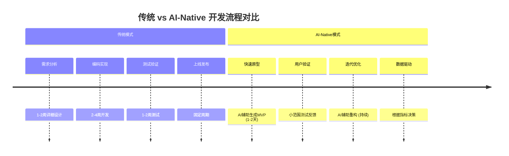
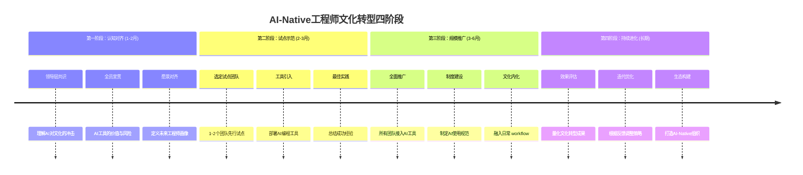

# 第29讲 | 被80%的人误解的工程师文化

> **适用范围**：技术管理者（CTO、技术总监、技术 Leader）、希望打造工程师文化的团队负责人、需要向老板解释工程师价值的 HR 与管理者。适用于团队文化建设、工程师文化打造、AI 时代文化进化等场景。
>
> **更新摘要（v2 · 2026-08 更新）**：
> - 结构化升级为 6 节骨架（导言 / 核心方法论 / 关键流程 / 工具与实战 / 常见误区 / 进阶延展）
> - 整合原文与"AI 时代升级注解（2026）"，将工程师文化升级为"AI-Native 工程师文化"
> - 保留全部 Mermaid 图并补充 `--- title: ... ---` frontmatter，每张图后追加文字解读
> - 将原"作者简介"融入导言，参考资料融入进阶延展

---

## 1. 导言

### 1.1 团队文化：软件开发的集体智慧

软件开发是一场需要集体智慧的运动，它的成功不完全属于团队中任何一个人。然而，团队成员们做人做事的风格却不完全一样，因此我们需要一种叫做"团队文化"的东西，通过它让大家的心聚集在一起，齐心协力完成目标。

本文将从团队文化入手，站在软件开发的角度，讲述工程师文化是如何打造出来的，并包含一些可立即落地的实践方法。

### 1.2 作者简介

黄勇，现任特赞科技（tezign.com）CTO，图书《架构探险》作者，Smart 开源项目作者，TGO 鲲鹏会上海分会董事会成员，QCon 讲师。十年以上互联网软件架构与技术管理经验，擅长敏捷开发，推崇"轻量级"架构思想。

### 1.3 2026 年 AI 时代背景

2026 年，根据 Stack Overflow 2025 年开发者调查，**84% 的开发者正在使用或计划在开发流程中使用 AI 工具**（如 GitHub Copilot、Cursor 等），GPT-5.5 和 DeepSeek V4 的发布标志着我们正式进入 Agent 加速落地期。在 AI 时代，工程师文化不是被替代，而是需要**进化**——从传统的"工匠精神"升级为**"人机协同创造"的新文化范式**。

---

## 2. 核心方法论

### 2.1 什么是团队文化？

团队文化主要包含三个方面：

- **团队气氛**：我们每天都要与人协作和沟通，如果缺乏好的团队气氛，合作关系将变得冷漠，工作也将失去激情。营造好的团队文化，起到决定性作用的就是团队领袖。
- **做人原则**：做人原则是态度和行为的根基。团队领袖就是团队做人原则的根基，他说的每一句话、做的每一件事，团队都看在眼里。物以类聚，人以群分。
- **做事方式**：做人原则决定了做事方式。一位求实的员工，一定会用数据说话，将数据背后的本质原因分析给老板听，帮助老板正确决策。

如果团队都是性格直爽的人，那么一定是有话直说、对事不对人；如果团队都是溜须拍马的人，那么一定会让领导笑口常开，用表象去掩盖事实。团队的做事方式同样取决于团队领袖。

### 2.2 什么是工程师文化？

弹性的工作时间、优雅的办公环境、穿着自由且随意、做自己喜欢的工作、工程师们说了算……这些是工程师文化吗？显然不是，这些只是工程师文化的**表象，而非本质**。

**工程师文化是以共同解决实际问题为目标的团队文化。** 工程师文化并非由工程师们自发创建，更不是一种自嗨行为。工程师文化是由企业文化所决定，企业文化由老板所决定，老板必须理解工程师这样的人群，才能把合适的工程师放在合适的位置上，才能真正领悟工程师文化的真谛。

工程师文化强调的是团队有目标、有分工、有协作，而且团队所解决的是当前面临的实际问题，并非一些不切实际的目标，更不是加班这种表面上的东西。

### 2.3 AI-Native 工程师文化的五大新特征

在 AI 时代，工程师文化需要进化为"AI-Native"文化范式，包含五大特征：

1. **实验主义（Experimentation First）**：鼓励快速实验、迭代验证，而非"先设计再编码"。

> **图解**：传统模式按"需求→编码→测试→发布"线性推进，周期长；AI-Native 模式以"快速原型→用户验证→迭代优化→数据驱动"循环推进，MVP 可在 1-2 天产出。

2. **透明开放（Radical Transparency）**：代码生成过程可追溯、决策依据数据化、知识共享即时化。
3. **人本中心（Human-Centric）**：AI 是工具，人才是核心。从"代码产出"到"价值创造"，从"个人英雄"到"协同网络"。
4. **持续学习（Continuous Learning）**：技术半衰期已缩短至 18 个月，学习能力 > 已有知识。
5. **负责任创新（Responsible Innovation）**：确保 AI 生成的代码没有安全漏洞、偏见或歧视，决策过程可解释、可审计。

---

## 3. 关键流程

### 3.1 怎样打造工程师文化？第一步：让老板理解软件工程

如果你是一位技术负责人，你的老板却不太懂技术，你首先要做的是**让老板理解软件开发是一项工程**，需要工程师们合力完成，还要让老板看清工程师的价值。在不懂技术的老板眼中，工程师的成本是相当昂贵的。

我们必须站在老板的角度去理解他，把他心中的顾虑全部排除掉，让他觉得软件开发是一项伟大而复杂的过程，需要工程师们用科学的方法来避免风险，从而让项目得以顺利交付。

### 3.2 第二步：落地工程师文化的具体做法

当你让老板理解了软件工程以及工程师价值以后，可以做一些事情：

- 让团队扁平，自己和团队一起工作
- 没有 Leader，只有 Owner
- 没有"你们"，只有"我们"
- 一切都以数据说话，分析数据的本质
- 可以加班，但拒绝无意义的加班

接下来，需要不断培养队员们的软技能，其中有 3 点非常重要的态度：
1. **主动担当任务**，并非被动等待
2. **具备用户思维**，产出有用成果
3. **具备服务意识**，乐于帮助同事

此外还可以做到：让大家成为朋友、缩短项目迭代周期、为每个项目找到 Owner、选择最合适的技术、技术尽可能自动化、注重代码质量、建立开放与共享、预留学习时间、只招最对的人不招最贵的人等。

### 3.3 工程师文化转型路径（2026 版）

> **图解**：AI-Native 工程师文化转型遵循"认知对齐→试点示范→规模推广→持续进化"四阶段，从领导层共识到全员内化，逐步将 AI 文化融入日常工作流。

---

## 4. 工具与实战

### 4.1 AI-Native 文化打造的可执行建议

| 特征 | 可执行建议 |
|------|-----------|
| **实验主义** | 建立"72 小时原型"机制；鼓励多方案对比实验；将"实验次数"和"学习速度"纳入团队评价体系 |
| **透明开放** | 在 Code Review 中增加 AI Code Review 环节；建立团队 AI 使用日志；定期举办"AI 翻车案例"分享会 |
| **人本中心** | 重新定义能力模型（AI 协作力 + 领域洞察力 + 系统架构力 + 人文关怀力）；设立"AI 伦理官"角色 |
| **持续学习** | 为每位工程师提供 AI 工具预算；建立"20% 时间"制度；创建内部 AI 学院 |
| **负责任创新** | 制定《团队 AI 使用规范》；在 CI/CD 集成 AI 代码安全扫描；定期进行 AI 伦理审计 |

### 4.2 团队活动的组织

可以组织一些有意思的活动，比如：茶话会、小黑屋、经验分享、内部演讲、摄影比赛、话题辩论、体育活动、健身、户外运动、技能培训、读书会、黑客马拉松等，只要对团队成长有帮助的活动，都可以大胆尝试。

---

## 5. 常见误区

### 5.1 对工程师文化的误解

| 误区 | 真相 |
|------|------|
| **弹性工作 = 工程师文化** | 弹性工作时间只是表象，核心是"以共同解决实际问题为目标" |
| **穿着自由 = 工程师文化** | 这只是外在表现，老板若把早下班看作不努力，就注定没有真工程师文化 |
| **工程师文化 = 工程师自嗨** | 工程师文化由企业文化决定，需要老板自顶向下认同与推动 |
| **工程师文化 = 加班** | 文化强调的是解决实际问题，不是加班这种表面上的东西 |

### 5.2 AI 时代的常见误区

| 误区 | 表现 | 解决方案 |
|------|------|----------|
| **把 AI 当文化** | 以为引入 AI 工具就有了工程师文化 | AI 是放大器，基础仍是目标、分工、协作 |
| **盲目追求 AI 产出** | 忽略代码质量，AI 生成代码不审查 | 建立 AI 代码审查机制 |
| **AI 决定一切** | 让 AI 做关键决策，放弃人类判断 | 保持人本中心，AI 辅助人类决策 |

---

## 6. 进阶延展

### 6.1 关键洞察：AI 不是替代工程师文化，而是让它进化

| 维度 | 传统工程师文化 | AI-Native 工程师文化 |
|------|----------------|---------------------|
| **核心价值观** | 工匠精神 | 人机协同创造 |
| **能力要求** | 技术深度 | 问题定义 + AI 协作 |
| **学习方式** | 培训课程 | 实践中学习 + AI 辅助 |
| **协作模式** | 分工明确 | 动态角色 + AI 增强 |
| **创新来源** | 个人灵感 | 数据驱动 + AI 启发 |
| **成功标准** | 代码质量 | 业务价值 × 技术影响力 |

### 6.2 2026 年及以后的展望

1. **Agent 成为新的"团队成员"**：到 2027 年，每个工程师团队可能配备 1-2 个专职 AI Agent。
2. **"全栈工程师"重新定义**：不再是前后端通吃，而是"人类 + AI"的全栈能力。
3. **工程师文化的全球化**：AI 消除了语言和文化障碍。
4. **从"写代码"到"设计系统"**：工程师的核心职责将从编码转向架构设计和 AI Agent 编排。

### 6.3 行动清单

- [ ] 让老板理解软件工程和工程师的价值
- [ ] 落地"没有 Leader 只有 Owner""拒绝无意义加班"等文化实践
- [ ] 制定《团队 AI 使用规范》，将 AI 伦理纳入价值观
- [ ] 启动 AI-Native 文化转型四阶段

### 6.4 延伸阅读

- 极客时间《技术领导力 300 讲》"打造高效研发团队"系列文章（本文作者已发表 4 篇）
- Stack Overflow 2025 开发者调查关于 AI 工具使用的数据（84% 正在使用或计划使用）
- GitHub Copilot、Cursor 等 AI 编程工具的实践资料
