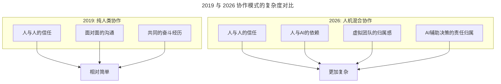

# 第204讲 | 邱良军：从小处着眼，修炼文化价值观

> **适用范围**：技术管理者（CTO、技术总监、团队 Leader）、需要打造团队文化价值观的负责人。适用于愿景使命价值观梳理、工程师文化塑造、正能量与极客文化建设、文化价值观落地等场景。
>
> **更新摘要（v2 · 2026-08 更新）**：
> - 结构化升级为 6 节骨架（导言 / 核心方法论 / 关键流程 / 工具与实战 / 常见误区 / 进阶延展）
> - 整合原文与"AI 时代升级注解（2026）"，补充 AI 时代文化建设新维度
> - 保留全部 Mermaid 图并补充 `--- title: ... ---` frontmatter，每张图后追加文字解读
> - 将"作者简介"融入导言

---

## 1. 导言

### 1.1 从"不是一家人，不进一家门"说起

"不是一家人，不进一家门"，这体现了文化价值观认同的重要性，以此作为基础来做事会容易的多。在一个团队中不传递负能量，很关键的表现就是对文化价值观的认同。好的公司和团队需要有一个正确的、激动人心的愿景、使命、价值观，它总能在关键时刻帮助大家做出正确的选择。

本文将通过三点来讲文化价值观方面的内容：
1. 什么是公司的愿景、使命和文化价值观；
2. 文化价值观对技术团队的影响；
3. 文化价值观如何落地，又如何体现在技术团队管理中。

### 1.2 作者简介

邱良军，极智嘉研发总监，TGO 鲲鹏会会员，负责组建极智嘉苏州研发团队以及筹建苏州研发中心，4 个月将团队发展到 40 人。曾在新电任职超 10 年，带领团队交付数个项目，团队峰值人员超 70 人。2014 年在文思海辉担任总监，从零开始将团队带至 300 人。18 年 IT 老兵，管理经验丰富。

### 1.3 2026 年 AI 时代背景

2026 年，84% 的开发者正在使用或计划在开发流程中使用 AI 工具（Stack Overflow 2025 调查口径），人机协作成为新常态，文化价值观面临新的挑战——如何在 AI 时代保持"人的温度"？本升级补充 AI 时代的文化建设新维度（AI 伦理观、AI-Augmented 工程师文化、AI 使用透明度、AI 探索精神）。



> **图解**：2019 年纯人类协作依赖"人与人信任、面对面沟通、共同奋斗经历"，相对简单；2026 年人机混合协作增加"人与 AI 依赖、虚拟团队归属感、AI 决策责任归属"，更加复杂，需要更完善的文化价值观来锚定。

---

## 2. 核心方法论

### 2.1 公司愿景、使命和价值观

- **愿景** 就是目标。某个学生立志成为天文学家就是一个愿景，阿里的愿景是"成为一家 102 年的企业"。愿景通常是宏大的，实现起来很困难，通常不会轻易变化。
- **使命** 就是为什么而存在。立志做天文学家的学生会把"发现外星文明"作为使命，阿里的使命是"让天下没有难做的生意"。使命会让我们对从事的工作充满敬意和荣誉感。
- **价值观** 就是做事的原则，有所为有所不为。社会最基本的底线是法律，在此之上是社会道德，企业的价值观应以此为底线，再结合企业自身特点来确定做事准则。

**马云的故事**：有一次阿里销售人员在培训，培训老师讲怎么把梳子卖给和尚。马云听了 5 分钟非常生气，把这个培训老师开除了——"这根本不是销售之术，而是赤裸裸的欺骗！"这就是价值观，以"不忽悠客户为中心"。

愿景、使命、文化价值观构建了企业和团队的核心精神，帮助企业和团队做出符合发展的选择，也帮助团队渡过难关。

### 2.2 文化价值观对技术团队的影响

文化价值观就是企业的基因，会深深影响公司中的每个人，特别是在面临很多选择的十字路口：
1. 当遇到困难、迷茫时，愿景和使命会指引驱动我们向前，让团队抱着必胜的信念。
2. 当取得成绩面临诱惑时，价值观会让我们不骄不躁、清醒头脑，坚定地做出正确选择。

著名企业的文化价值观：华为的"狼性"文化（高度危机感）、阿里的创新武侠文化（每个高管有花名）、京东的客户体验文化（强大执行力）。

### 2.3 技术团队的三种文化

**一、工程师文化**：核心标签是"专业专注"、"学习自律"、"自由创新"。工程师是某个领域的专家，非常专注、持续自主地学习探索某个领域知识，需要自由状态和环境，是创新的主要贡献者。但几乎没有一个公司能打造标准化的工程师文化环境——企业需要生存，理想自由不存在。技术管理者需要在两者间找到平衡，为团队创造自由宽松的环境，同时引导团队崇尚技术、创新、学习。

**二、团队不能带有负能量**：负能量文化是摧毁一切的开始。如果有负能量信息在传递，只要感知到就必须第一时间找出原因，直面问题做梳理，通过公开沟通澄清事实。总有少数人喜欢抱怨公司、老板、同事，团队负责人必须干预，必要时坚决不用这样的成员。

**三、极客文化**：软件研发团队特有的一种文化。极客文化把"技术让工程师变酷"的认知推向极致，代表人物是乔布斯，他对产品功能、性能、外型近乎完美的要求是技术人员极其推崇的对象。

---

## 3. 关键流程

### 3.1 文化价值观如何落地：从小事着眼

被誉为"世界第一 CEO"的杰克·韦尔奇提出"价值观要天天讲、月月讲、年年讲"，他每到一个分公司都会给全体员工讲企业文化，并要求每一个管理者都宣传企业文化。

技术团队落实价值观，要**从小事着眼**，处处体现公司的文化价值观：
1. 会议室的命名，可以带有技术、自由的元素；
2. 给予团队成员一定自由度，鼓励并奖励成员的创新，创造思辨的环境氛围；
3. 可以给团队成员起一个"酷"的别称或昵称；
4. 去掉公司等级、企业的老总文化；
5. 定期组织技术分享、沙龙；
6. 让团队成员，尤其是具有极客精神的成员拥有 20% 的思考时间；
7. 把"要做什么、不能做什么"清楚地表达出来，列一个 Do List 和一个 Don't List，放到每个人的桌子案头；
8. 技术团队负责人要以身作则地做表率，这个非常关键。

### 3.2 AI 时代文化落地的新增方法

2026 年新增落地方法：建立"AI 使用日历"（记录团队 AI adoption 进度）、设立"AI 创新奖"（奖励有价值的 AI 应用）、组织"AI Ethics 讨论会"（定期讨论伦理问题）、创建"Prompt Library"（共享高质量 Prompt）、实施"AI Code Review"（关注 AI 生成代码质量）、开展"人机协作工作坊"（提升协作效率）。

---

## 4. 工具与实战

### 4.1 AI 时代工程师文化的扩展定义

```
2026版工程师文化 = 
  专业专注（核心技术深度）
  + 学习自律（持续学习AI新技术）
  + 自由创新（用AI放大创造力）
  + AI素养（理解LLM能力边界）
  + 伦理意识（负责任地使用AI）
  + 协作能力（人机+人际双重协作）
```

### 4.2 AI 时代的 Do List 与 Don't List

**Do List（应该做的）**：保持对核心技术的深度理解（不被 AI 替代）；积极学习和尝试新的 AI 工具；透明化 AI 的使用（标注哪些是 AI 生成的）；用 AI 处理重复性工作、专注于创造性任务；分享有价值的 Prompt 和工作流；对 AI 输出保持批判性思维；关注 AI 伦理和社会影响；在 AI 犯错时主动承担责任。

**Don't List（不应该做的）**：完全依赖 AI 而不理解原理；将 AI 生成的代码冒充为自己写的；忽视代码质量和安全性（"AI 写的没问题"）；用 AI 作弊（面试、考试、评估）；将敏感数据发送给公共 AI 服务；歧视不会使用 AI 的同事；盲目相信 AI 的输出（不做验证）；放弃学习新技术（"AI 会帮我做"）。

### 4.3 AI 时代的极客新标准

| 维度 | 2019 年极客 | 2026 年 AI-Augmented 极客 |
|------|-----------|----------------------|
| 追求目标 | 代码优雅、性能极致 | **AI 辅助下的极致效率 + 质量** |
| 技术栈深度 | 精通某一领域 | **精通 + AI 跨界整合能力** |
| 创新方式 | 个人英雄主义 | **人机协同创新** |
| 影响力范围 | 团队/公司 | **开源社区 + AI 生态** |
| 价值观念 | 技术至上 | **技术服务于业务 + 社会** |

> **极客精神新诠释**：真正的极客不是拒绝 AI，而是**驾驭 AI 去追求更高的目标**——当 AI 能处理 80% 的基础工作时，极客们应该将精力集中在那 20% 真正需要创造力和深度的挑战上。

---

## 5. 常见误区

### 5.1 文化建设的常见误区

| 误区 | 表现 | 正确做法 |
|------|------|---------|
| **理想主义文化建设** | 脱离公司实际空谈理想文化 | 文化要有明确目标，为业务服务 |
| **强推文化** | 不尊重团队共识强行推行 | 基于共识，融入而非排斥 |
| **负能量蔓延** | 对抱怨听之任之 | 第一时间找原因，公开澄清，必要时坚决处理 |
| **忽视细节落地** | 只喊口号不做小事 | 从会议室命名、Do/Don't List 等小处着眼 |

### 5.2 AI 时代的"负能量"新类型

传统负能量：抱怨公司/老板/同事、拒绝合作/推卸责任、传播负面情绪。

**2026 新增"AI 负能量"**：AI 工具歧视（"你居然不用 Cursor？"）、AI 依赖炫耀（"我的代码全是 AI 写的，你们太落后"）、幻觉传播（不加验证就分享 AI 的错误结论）、技术放弃（"反正 AI 会写代码，我不用学了"）、责任推卸（"这是 AI 的 bug，不是我写的"）。

---

## 6. 进阶延展

### 6.1 文化的力量：榜样的力量

文化最终体现在每个人的行为规范上，对于细节的处理就是文化的体现。技术管理者要想打造积极向上的工程师文化，就需要首先自己践行，做到知行合一。**文化的力量就是榜样的力量，我们要把文化作为一种习惯固化下来。** 同时，文化的力量是伟大的，也最能体现领导力的力量。

> 杰克·韦尔奇："世界属于热情而又有动力的领导者，这些人不仅自身具有很多能量，而且能激发那些被领导者的能量！"

### 6.2 AI 时代文化建设 Checklist

**月度检查项**：团队 AI 工具使用率是否达标（目标：100%）；是否有新的 AI 最佳实践产生；是否出现"AI 负能量"现象并及时处理；AI 相关培训是否按计划进行；Do/Don't List 是否需要更新。

**季度复盘项**：团队文化是否符合 AI 时代需求；成员 AI 技能是否有提升；人机协作效率是否改善；是否出现新的文化挑战；下季度文化建设重点是什么。

### 6.3 延伸阅读

- 杰克·韦尔奇关于企业文化的论述
- 阿里巴巴企业文化与价值观建设的公开资料
- 极客时间《技术领导力 300 讲》相关章节
