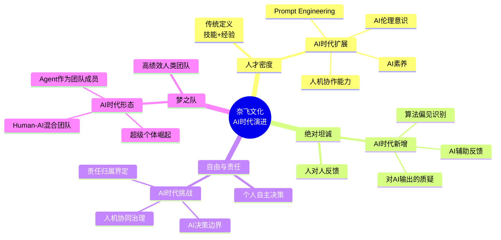
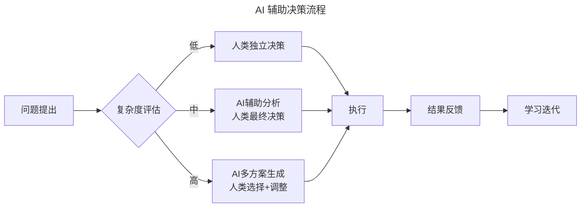
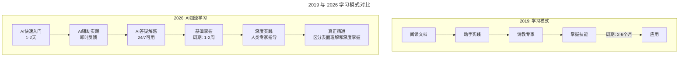
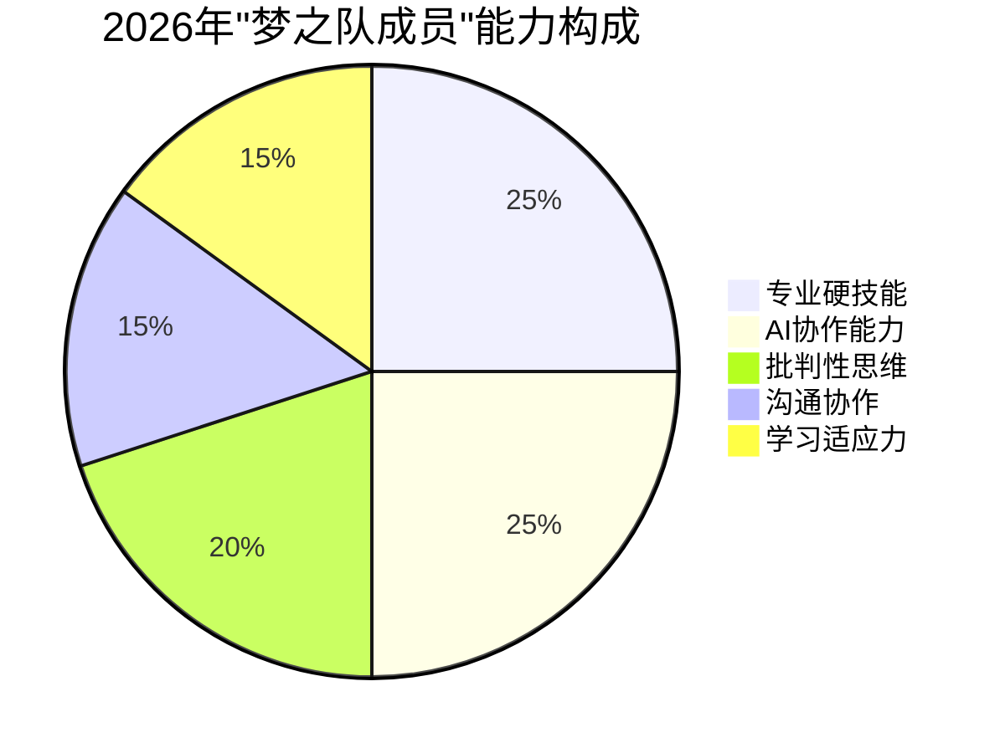
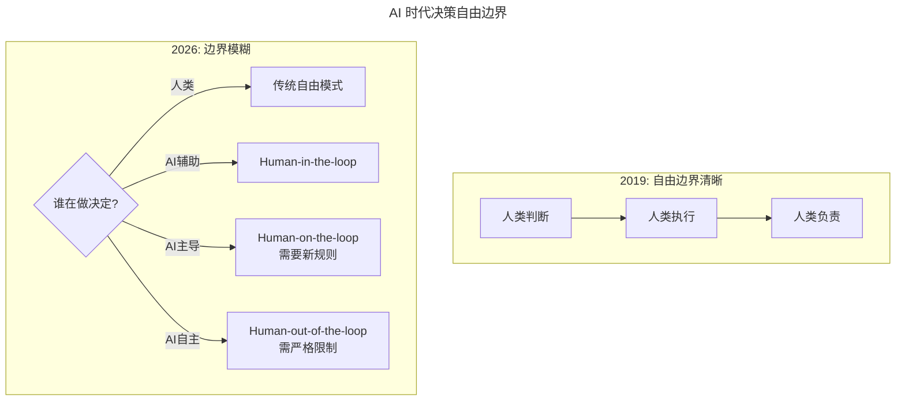
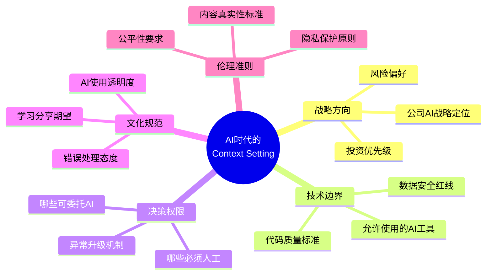

# 第202讲 | 陈嘉佳：奈飞文化宣言

> **适用范围**：CTO、技术总监、HR 负责人、团队 Leader、需要打造高绩效文化的管理者。适用于企业文化设计、人才密度建设、反馈机制构建、自由与责任边界界定、AI 时代文化演进等场景。
>
> **更新摘要（v2 · 2026-08 更新）**：
> - 结构化升级为 6 节骨架（导言 / 核心方法论 / 关键流程 / 工具与实战 / 常见误区 / 进阶延展）
> - 整合原文奈飞文化宣言上下篇与两份"AI 时代升级注解（2026）"，重组为统一骨架
> - 保留全部 Mermaid 图并补充 `--- title: ... ---` frontmatter，每张图后追加文字解读
> - 将"译者简介"融入导言，参考资料融入进阶延展

---

## 1. 导言

### 1.1 奈飞文化宣言的背景

早在 2009 年，奈飞就公开发布了一份介绍企业文化的 PPT 文件，在网上累计下载量超过 1500 万次，被 Facebook 的 COO 谢丽尔·桑德伯格称为"硅谷重要文件"。风靡全球的《奈飞文化手册》就是奈飞前 CHO 帕蒂·麦考德对这份文件的深度解读。

2017 年 6 月，奈飞做了一个重大更新：将这份文件从 120 页的演讲稿进化成了仅有 10 页的散文，更简洁、更清晰、更明确。本文由陈嘉佳翻译为中文。

### 1.2 奈飞的特殊之处

奈飞竭尽全力雇佣最优秀的人，珍惜正直、卓越、尊重、包容和合作。奈飞最特殊的地方在于：
1. 鼓励员工独立作出决定；
2. 开放地、完全地、深思熟虑地共享信息；
3. 相互之间极其地坦率；
4. 仅仅保留最高效的员工；
5. 避免规则。

核心哲学是**人重于流程**——一群优秀的人一起打造的梦之队。通过这种方法，组织更灵活、更有趣、更有创造力、更合作和更成功。

### 1.3 译者简介

陈嘉佳，巧房科技创始人 & 技术合伙人，负责技术和管理工作。TGO 鲲鹏会会员，国防科学技术大学硕士学历，拥有十多年研发实践经验，热爱技术，追求卓越。拥有 10 年以上 SaaS 研发经验，在弹性计算、中间件、高并发分布式和大数据处理等方面积累了丰富的实战经验。

### 1.4 2026 年 AI 时代背景

2026 年，84% 的开发者正在使用或计划在开发流程中使用 AI 工具（Stack Overflow 2025 调查口径），Agent 进入加速落地期，人机协作成为新常态。奈飞文化的核心理念——**人才密度、绝对坦诚、自由责任**——在 AI 时代不仅没有过时，反而变得更加重要。

> **图解**：奈飞文化的四大支柱（人才密度、绝对坦诚、自由与责任、梦之队）在 AI 时代各有一组新增内涵，从"技能+经验"到"AI 素养"，从"人对人反馈"到"对 AI 输出的质疑"，文化体系随人机协作深化而演进。

---

## 2. 核心方法论

### 2.1 真实的价值观：十大核心价值观

一个公司的真实价值观要通过**谁得到奖励或者谁离职**来体现。奈飞最重视的特定行为和技能有十大项：

| 价值观 | 核心要义 |
|--------|---------|
| **决策** | 在不确定下做明智决定，找到根本原因，用数据佐证直觉，做长期决定 |
| **沟通** | 简明扼要表达，聆听并在反馈前力求理解，提供坦诚、有帮助、及时的反馈 |
| **好奇心** | 快速而热切地学习，在专长之外做有效贡献，寻求不一样的观点 |
| **勇气** | 只要符合最佳利益就怎么说，敢于做艰难决定，承受明智风险坦然面对失败 |
| **激情** | 用对卓越的渴望激励他人，顽强而乐观，沉稳自信对人谦虚 |
| **无私** | 寻求最利于公司而非自己，开放而主动地共享信息，花时间帮助同事 |
| **创新** | 创建被证明有用的新想法，重定义问题，挑战主流假设 |
| **包容** | 与各种文化背景的人有效合作，培养不同观点，努力超越偏见 |
| **正直** | 以坦率、真实、透明和非政治性闻名，当面说的和背后说的一样 |
| **碰撞** | 完成大量重要工作，让你的同事更优秀，关注结果甚于过程 |

### 2.2 梦之队

梦之队是一支所有同事都为所做的事情而感到骄傲的团队。**我们对于伟大工作场所的定义是：一支梦之队一起追求雄心勃勃的共同目标，并为此付出了沉重的努力**——不是寿司午餐、健身房、时尚办公室或频繁派对。

梦之队的关键理念：
- **把公司定位成一个团队，而不是一个家庭**：家庭有无条件的爱，梦之队要求你逼迫自己成为最好的队员，且知道你不可能会永远在这个团队之中。
- **没有钟形曲线、排名或配额**：通过"留存测试"（Keeper Test）关注管理者判断力——如果团队里有人想离开，管理者会不会竭尽全力挽留？对没通过测试的人，迅速而尊敬地给一份丰厚离职金。
- **没有"出色的混蛋"**：出色的人能进行体面的人际互动，当一群出色的人在合作的氛围里，会产出更多成果。
- **成功在于有效工作，而不是努力工作**：持续的"B"级绩效，即使一直有"A"级努力，也只能得到丰厚离职金。
- **支付市场上的最高薪酬**：每年根据市场情况校准，不用"普通人加薪 2%、优秀的人加薪 4%"模型。最终经济安全依赖于技能和信誉，而不是资历。

### 2.3 自由和责任

奈飞的目标是**启发人而不是管理人**。我们信任每一个人都能做出他认为对奈飞最好的事情：给他们足够的自由、权利和信息以支持他们做出决定。

许多组织不健康地强调流程而不是自由。每次出问题，流程就像巨蟒一样越缠越紧。奈飞避免过度专业化导致的僵硬，努力同时满足四个目标：**保持自由、业务不断增长、员工卓越水平不断提升、业务模型尽可能简单**。

奈飞关于自由的不寻常例子：内部广泛系统地分享文档；几乎没有支出控制或合同签署控制；休假政策就是"去休假"；产假政策就是"照顾你的小孩和你自己"；每年可选择现金还是期权；不要求你留下来才能拿到你的钱。

但自由也有重要的例外：对道德问题和安全问题很严格（骚扰、内幕交易零容忍），信息安全有严格访问控制。**自由和快速恢复好于防止出错**——我们从事的是创意行业，面临的最大危险是缺乏创新。

### 2.4 消息灵通的船长（Disagree & Commit）

对于每一个重要决定，都需要一个负责任的**船长**在综合和消化了其他意见之后做出判断。奈飞避免通过委员会做出决定，因为这会减缓速度、分散责任。

- 小决定可以仅通过邮件分享，大决定需要讨论不同立场，并把船长为什么做出这个决定记录为备忘录。
- 最终决定不是由多数人或委员会投票做出的。
- **公开反对**：如果你在实质性问题上有分歧，有责任通过讨论和书面解释为什么不同意。一旦"船长"做出决定，所有人都希望让它尽可能成功。无声的分歧是不可接受的。

### 2.5 不控制环境与高度一致、松散耦合

- **不控制环境**：希望员工成为优秀的独立决策者。每个层级领导者的工作是设置清晰的上下文（Context），确保其他人有正确的信息来做出正确的决策。不仿效自上而下的"CEO 神话"。
- **高度一致，松散耦合**：花大量时间一起讨论战略，然后相信其他人可以按照战术执行，不需要提前审批。两个小组可能致力于同一目标，但行动相互不需要认可。

---

## 3. 关键流程

### 3.1 十大价值观的 AI 时代重新诠释

**1. 决策（Decision Making）——AI 成为决策的"第二大脑"**

> **图解**：AI 辅助决策遵循"问题→复杂度评估"分诊：低复杂度由人类独立决策，中复杂度 AI 辅助分析、人类最终决策，高复杂度 AI 生成多方案、人类选择调整。最终一切决策归于人类执行、反馈与学习迭代。

> **AI 辅助决策黄金法则**：AI 提供选项和分析，人类做最终决策并承担责任。永远不要让 AI 替你做重要的道德或战略决策。

**2. 沟通（Communication）——AI 改变了沟通的频率、形式和质量**

- **AI 辅助反馈撰写**：将原始想法转化为更建设性表达，如"你的代码很烂"→"我注意到这段代码的可读性可以提升，建议……"。
- **AI 会议摘要与行动追踪**：自动生成纪要，追踪承诺事项完成情况。
- **跨时区/跨语言沟通**：AI 实时翻译（准确率 98%+），文化差异提示。

**3. 好奇心（Curiosity）——AI 降低了学习曲线，但对"真学习"要求更高**

> **图解**：2019 年学习周期 2-6 个月，2026 年在 AI 辅助下基础掌握缩短到 1-2 周，但"真正精通"仍需人类专家指导和深度实践。**关键警示**：AI 让"伪学习"更容易——真正学习能力体现在能否在没有 AI 帮助下向他人解释清楚这个概念。

**4. 勇气（Courage）——新维度：敢于质疑 AI**

| 类型 | 2019 年 | 2026 年新增 |
|------|--------|-----------|
| 说出不受欢迎的真话 | ✅ 核心要求 | 同等重要 |
| 质疑权威/上级 | ✅ 核心要求 | 同等重要 |
| **质疑 AI 输出** | N/A | **新增核心能力** |
| **拒绝过度依赖 AI** | N/A | **新增核心能力** |
| **指出 AI 伦理问题** | N/A | **新增核心能力** |

**5. 激情（Passion）——从"代码热情"转向"价值创造热情"**：用 AI 解决真正有价值的业务问题、创造前所未有的用户体验、推动团队 AI 化转型。

**6. 无私（Selflessness）——新含义：共享 AI 资产**：共享 Prompt 模板、AI 工作流、最佳实践、工具配置、失败教训。避免"我的 Prompt 效果好但不想公开"。

**7. 创新（Innovation）——从"纯人类创新"到"人机协同创新"**：人类提出问题→AI 生成多个方案→人类筛选组合→AI 快速原型→人类验证迭代→AI 规模化部署。概念验证从 4-8 周缩短到 3-7 天（6 倍）。

**8. 包容（Inclusion）——扩展到"AI 偏见"议题**：包容不同 AI 使用熟练度、不同 AI 工具偏好、对 AI 的不同态度。**包容原则**：团队的 AI 素养可以有差异，但不应该因此产生歧视；高手的责任是帮助新手成长。

**9. 正直（Integrity）——面临 AI 新挑战**：AI 生成代码审查时明确标注哪些是 AI 生成的；AI 辅助决策说明参考了 AI 的分析；如实说明 AI 提效的真实比例。

**10. 碰撞（Impact）——"产出"vs"AI 辅助产出"**：2026 年 KPI 应关注净产出价值 =（总产出 − AI 可自动化部分）× 质量系数、AI 杠杆率、团队赋能度、学习速度。

### 3.2 梦之队的 AI 时代演进

- **人才密度新定义**：专业硬技能 + AI 协作能力 + 批判性思维 + 沟通协作 + 学习适应力。

> **图解**：2026 年梦之队成员能力构成中，专业硬技能与 AI 协作能力各占 25%，批判性思维占 20%，沟通协作与学习适应力各占 15%——AI 协作能力已与传统硬技能同等重要。

- **留存测试 2.0**：除技术贡献、团队协作、学习成长、文化契合外，额外关注 AI 工具使用效率、Prompt 质量、AI 资产共享、AI 伦理观。
- **"没有出色混蛋"的 AI 延伸**：新增"AI 混蛋"行为——AI 工具歧视、Prompt 傲慢、AI 依赖鄙视、幻觉传播、伦理漠视。

### 3.3 自由与责任的 AI 时代新框架

> **图解**：2019 年人类"判断→执行→负责"闭环清晰；2026 年决策权在人类与 AI 之间分配出现多种模式——Human-in-the-loop（人在环内）、Human-on-the-loop（人在环上）、Human-out-of-the-loop（人脱离环），越往后者越需新规则和严格限制。

> **自由与责任黄金法则**：授权等级 = 影响范围 × 不可逆性。影响越大、越不可逆的决定，越需要人类深度参与。

### 3.4 船长的 AI 时代演进：从"决策者"到"决策架构师"

| 传统职责 | AI 时代新职责 |
|----------|-------------|
| 收集各方意见 | **设计 AI 信息收集的 Prompt 和来源** |
| 综合分析数据 | **验证 AI 分析的准确性和偏差** |
| 做出最终决策 | **在 AI 选项中做出价值判断** |
| 推动决策执行 | **设定 AI 执行的护栏和边界** |
| 承担决策后果 | **建立 AI 决策的可追溯机制** |

---

## 4. 工具与实战

### 4.1 2026 年领导者应该设置的"AI 上下文"

> **图解**：AI 时代领导者设置上下文需覆盖五个维度：战略方向、技术边界、决策权限、文化规范、伦理准则，确保员工在有足够信息、清晰边界和正确价值观的框架下自主决策。

### 4.2 "高度一致、松散耦合"的 AI 适配

1. **战略文档 AI 化**：将战略目标转化为 AI 可理解的格式，让 AI 在每个 Sprint 开始时检查任务与战略的一致性。
2. **建立"松散耦合"的 AI 协作协议**：共享 AI Agent 的配置和 Prompt，定期同步 AI 产出的洞察，发现偏差时主动沟通。
3. **利用 AI 增强"一致性检查"**：每周自动运行各团队当前工作 vs 公司战略目标的匹配度、跨团队依赖检测、潜在冲突预警。

### 4.3 技术领导者的实施建议

| 周期 | 行动 |
|------|------|
| **短期（1-3 个月）** | 评估团队 AI 素养现状；制定 AI 工具使用规范；建立"AI 辅助标注"文化；组织"AI 时代的坦诚反馈"工作坊 |
| **中期（3-12 个月）** | 将 AI 素养纳入招聘评估；建立内部 Prompt Library；实施"留存测试 2.0"；定期举办"AI 伦理讨论会" |
| **长期（1-3 年）** | 打造"AI-Augmented Dream Team"；建立人机协作最佳实践体系；形成"AI-First Culture" |

---

## 5. 常见误区

### 5.1 奈飞文化常见误区

| 误区 | 真相 |
|------|------|
| **把福利当文化** | 寿司午餐、健身房、时尚办公室不等于梦之队文化，伟大工作场所是"梦之队一起追求雄心勃勃的目标" |
| **把公司当家庭** | 奈飞是"团队"而非"家庭"，没有无条件爱，需要持续高绩效 |
| **用裁员配额管理** | 奈飞不用钟形曲线或"每年削减最低 10%"，用"留存测试"判断 |
| **流程越多越好** | 流程巨蟒会扼杀自由和创新，应保持"自由和快速恢复"优于"防止出错" |

### 5.2 AI 时代的误区

| 误区 | 表现 | 解决方案 |
|------|------|----------|
| **AI 伪学习** | 以为记住 AI 答案就是学会了 | 检验能否在无 AI 帮助下解释清楚概念 |
| **AI 全权决策** | 让 AI 做重要道德或战略决策 | AI 提供选项，人类做最终决策并负责 |
| **AI 工具歧视** | 嘲笑不用 AI 的同事 | 高手帮助新手，AI 素养差异不应导致歧视 |
| **冒充 AI 产出** | 把 AI 生成代码当自己写的 | 透明标注 AI 贡献，承认自己的 Prompt 或审核责任 |

---

## 6. 进阶延展

### 6.1 追求卓越的 AI 时代诠释

奈飞"追求卓越"的公式在 2026 年升级为：**卓越 = 人类智慧 × AI 能力 × 协作效率**。从"追求卓越"到"追求 AI-Augmented Excellence"：效率定义从"更快完成工作"变为"更快完成更有价值的工作"；学习方式变为"AI 辅助学习 + 实践 + 反思"；创新来源变为"人类提问 + AI 发散 + 人类收敛"。

### 6.2 《小王子》名言的 AI 时代解读

> 如果你想要造一艘船，不要召集大家去收集木材，不要划分工作并发号施令。而是要教会他们对浩瀚无际的大海心生憧憬。

2019 年版本：教会人们对"大海"（愿景/使命）心生憧憬，人们会自发造船。
2026 年版本：教会人们对"大海"心生憧憬 + 教会人们善用"AI 工具"（新型帆桨）+ 明确"航行的边界"（AI 伦理/安全）。

> **2026 启示**：你的角色不是"发号施令的船长"，而是：描绘大海的人（愿景制定者）、提供先进工具的人（AI 基础设施建设者）、设定航行边界的人（伦理与安全守护者）、庆祝每次抵达的人（成就认可者）。

### 6.3 延伸阅读

- 奈飞文化宣言原始 PPT 及 2017 年散文版（陈嘉佳中文翻译）
- 《奈飞文化手册》（帕蒂·麦考德）
- 谢丽尔·桑德伯格关于奈飞文化的评价
- 极客时间《技术领导力 300 讲》相关课程
