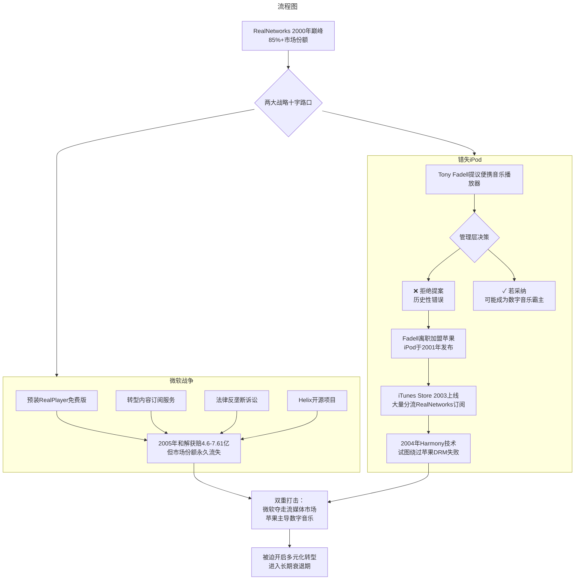

# 西雅图IT公司之RealNetworks：一个帝国的兴衰

> **适用范围**：技术管理者、创业者、投资研究者、产品经理及对科技商业史感兴趣的读者；适用于战略复盘、案例研讨与决策参考场景。
>
> **更新摘要（v2 · 2026-08 更新）**：
> - 结构化升级为 6 节骨架（导言 / 核心方法论 / 关键流程 / 工具与实战 / 常见误区 / 进阶延展）
> - 保留全部原文 Mermaid 图、表格、数据与术语英文对照，并为 Mermaid 图补充 frontmatter 与图后解读
> - 将原「参考资料/附录」并入第 6 节「进阶延展」，便于延展阅读

## 1. 导言

### 一、引言：被遗忘的互联网帝国

在西雅图派克市场（Pike Place Market）周围一栋并不起眼的楼宇里——Home Plate Center，静静地坐落着一家名为RealNetworks的公司。

对于今天的互联网用户而言，这个名字或许已经陌生。当人们谈论西雅图的科技巨头时，脱口而出的永远是微软（Microsoft）和亚马逊（Amazon）。然而，在互联网发展的编年史上，RealNetworks曾经是一个不折不扣的帝国——一个市值一度超过今天Twitter（现X）、占据全美85%以上流媒体市场份额、技术影响力绝不亚于同时代任何科技巨头的传奇企业。

对于中国用户来说，"RM""RMVB"这些视频格式名称可能更为熟悉。是的，正是这家公司定义了早期互联网音视频的传播标准。在那个拨号上网的时代，RealNetworks的技术让"在网上看视频"从科幻变成了现实。

但这是一个关于兴衰的故事。从1994年的创业雄心到2000年的巅峰辉煌，从微软战争的血腥厮杀到错失iPod的历史性遗憾，从多元化转型的艰难探索到2022年的私有化退市——RealNetworks的30年历程，堪称一部浓缩的互联网商业史诗。

更令人深思的是，这个曾经"倒下"的帝国并没有真正消亡。通过SAFR人脸识别AI平台、KONTXT防诈骗系统等前沿布局，Rob Glaser和他的团队正在人工智能时代寻找新的定位。一个帝国的终结，是否意味着另一个故事的开始？

本文基于2017年原版专栏上下两篇，结合截至2024年6月的最新信息，对RealNetworks的30年历程进行全面重写与深度剖析。

---

---

## 2. 核心方法论

### ——完整重写版：从流媒体霸主到AI隐形冠军（1994-2024）

---

---

### 四、转折点一：微软的"免费+捆绑"绞杀战

#### 4.1 战争爆发

当RealNetworks在流媒体市场大赚特赚时，它的老东家微软坐不住了。2000年前后，微软推出了**Windows Media Player**，直接杀入媒体播放器市场[^8]。

微软的策略与其对付网景通信公司（Netscape）的手法如出一辙：
- **Windows Media Player**：完全免费，预装在Windows操作系统中
- **Windows Media服务器**：同样免费提供给开发者
- **捆绑策略**：通过操作系统级别的集成，让用户"自然而然"地使用微软的产品

与此同时，苹果的QuickTime也采取免费策略。市场格局变成：

| 竞品 | 播放器 | 流媒体服务器 | 技术水平 |
|------|--------|-------------|---------|
| **RealNetworks** | 收费（约$40） | **收费（主要利润来源）** | 领先 |
| **Microsoft** | **免费（捆绑）** | **免费** | 追赶中 |
| **Apple QuickTime** | **免费** | **免费** | 较弱 |

这无疑是微软希望看到的剧本：先用免费策略击垮竞争对手，待垄断形成后再考虑盈利模式。但对于RealNetworks来说，这是生死存亡的威胁。

#### 4.2 格拉泽的应对策略

面对微软的攻势，格拉泽采取了多项应对措施，主要体现在两个方面：

##### 应对一：预装合作抵消捆绑优势

格拉泽积极与PC制造商谈判，争取在出厂电脑中预装RealPlayer免费版。这种预先安装的策略在很大程度上抵消了Windows捆绑带来的压力。当然，为此公司也牺牲了一部分的收入——收费对免费，在哪个国家都会失败。但这是一种无奈却必要的战略选择[^9]。

##### 应对二：多元化转型为内容订阅服务商

格拉泽很清楚微软做软件很厉害，但是软件以外的东西就不一定了。因此，在做播放器的同时，RealNetworks开始转身成为内容服务商，给用户提供按月付费的歌曲播放和视频点播订阅服务。

可以说，**今天大行其道的月租模式（Netflix、Spotify等），是RealNetworks在应对微软的进攻时就想到的**。RealNetworks就这样成为了美国最早通过订阅服务向互联网用户收费的公司[^10]。

与此同时，流媒体服务器的收入在下降，媒体订阅的收入却在上升。更重要的是，公司也开始做广告了，其形式有点类似于现在YouTube插播的广告。

**然而广告效果一般**——这大概是公司做广告的时候用力过猛，大量的打广告影响了用户体验。另外，大量的广告又导致播放器反应迟缓，经常出现卡顿等现象。这都说明RealNetworks进军广告市场的转型太过于激进了[^11]。

但是不管怎么样，由于RealNetworks很早就开始进入订阅服务，因此它在播放器市场节节败退的情况下，在音频和视频服务市场上守住了战场，这让它安然度过了2000年网络泡沫以后艰难的几年。从这个角度看，**格拉泽对于微软的套路和微软的软肋理解得极为深刻**。

##### 其他应对措施

**① 法律反击**
RealNetworks加入了针对微软的反垄断诉讼阵营，指控微软利用操作系统垄断地位不正当竞争。这场漫长的法律战最终在**2005年10月达成和解**，微软向RealNetworks支付了**4.6亿美元**（另有报道称实际金额高达7.61亿美元，包含其他补偿）[^12]。

这是一笔巨额资金，但从战略角度看，它更像是一场"败诉后的赔偿"，而非真正的胜利——微软的市场份额已经不可逆转地增长，RealNetworks的核心业务已遭受重创。

**② 开源反击：Helix项目**
2002年，RealNetworks推出了**Helix开源项目**，将部分流媒体技术开源，试图构建开放生态对抗微软的封闭体系[^13]。然而，这一举措效果有限，最终在2009年停止积极维护，2014年10月正式停服。

#### 4.3 战争结果

到2000年代中期，Windows Media Player已经取代RealPlayer成为Windows系统上的主流播放器。RealNetworks虽然在法律上获得了经济补偿，但在市场上失去了统治地位。

**深层原因分析**：
- 微软拥有操作系统层面的"制空权"，这是RealNetworks无法逾越的护城河
- 免费策略对收费策略具有压倒性优势，尤其是在大众消费市场
- RealNetworks过度依赖单一业务（流媒体服务器授权），缺乏抗风险能力

---

---

## 3. 关键流程

### 二、历史回溯：拨号时代的流媒体革命

#### 2.1 创始人背景：微软老兵的理想主义

**罗布·格拉泽（Rob Glaser）**，RealNetworks的创始人，是一位典型的"微软系"创业者。在创立公司之前，他已在微软效力超过十年，经历了这家软件巨头从成长期到上市的关键阶段。随着微软股价的不断攀升和拆分，作为早期员工的他已经积累了足以"花大半辈子"的财富[^1]。

然而，格拉泽并没有选择安逸退休。90年代中期的互联网正处于萌芽状态，他敏锐地洞察到一个巨大的技术空白：**网页为什么没有声音和视频？**

在今天这个4K直播、高清点播司空见惯的时代，我们很难想象1994年互联网的"原始"状态：
- **网络带宽**：56KB调制解调器（Modem），实际下载速度仅约7KB/s
- **内容生态**：被誉为"互联网第一股"的雅虎（Yahoo!），上市时主要依靠人工编辑整理全球互联网信息
- **用户体验**：网页以纯文本和静态图片为主，音视频内容几乎不存在

在这样的技术约束下，实现在线音频和视频播放，无异于"异想天开"。但格拉泽决定迎接这个挑战。

#### 2.2 技术突破：三项核心创新

RealNetworks的前身**Progressive Networks**成立于1994年（1997年9月更名为RealNetworks）。格拉泽带领团队实现了三项具有划时代意义的技术创新：

##### （1）高压缩率编码算法

RealNetworks开发的专有压缩算法能够在极低带宽下传输音视频内容。虽然画面失真严重、音质一般，但压缩后的文件体积远小于其他格式，为互联网传播提供了基础[^2]。这一技术后来演化为著名的RM（RealMedia）和RMVB（RealMedia Variable Bitrate）格式，在中国市场尤其流行——据统计，全球超过15亿台设备曾使用RMVB编解码技术[^3]。

##### （2）流媒体（Streaming Media）技术

这是RealNetworks最核心的创新。传统方式需要完全下载文件后才能播放，而RealNetworks的技术实现了**边下载边播放**——用户无需等待整个文件下载完成，即可开始收听或观看。这一思想在今天已经遍地开花（如Netflix、YouTube、Spotify等），但在当时绝对是革命性的突破[^4]。

##### （3）自适应码率（Adaptive Bitrate Streaming）

RealNetworks的系统能够根据网络带宽状况动态调整传输质量：网络良好时提供更高清晰度，网络拥堵时自动降低画质以保证流畅性。这种能力在互联网发展早期是独此一家的技术优势[^5]。

#### 2.3 早期商业化成功

凭借上述技术创新，RealNetworks迅速实现了商业化突破：

- **1995年**：首次通过RealAudio转播西雅图水手队vs纽约洋基队的棒球比赛，赢得巨大声誉[^6]
- **随后**：首次在互联网上转播NBA篮球比赛，轰动效应极大地推动了互联网多媒体的发展
- **1997年11月**：成功IPO登陆纳斯达克（11月21日），股票代码RNWK
- **1998-2000年**：股价飞涨，从IPO价格到2000年顶峰涨幅近40倍

据统计，**2000年时整个美国互联网上超过85%的视频直播内容使用了RM格式**[^7]。RealNetworks已经成为流媒体领域无可争议的霸主。

```mermaid
---
title: RealNetworks 三十年完整发展历程 (1994-2024)
---
timeline

    section 创业崛起期 (1994-2000)
        1994 : 成立Progressive Networks<br>Rob Glaser离开微软创业
        1995 : 推出RealAudio<br>首次互联网棒球赛转播
        1997 : 更名RealNetworks<br>11月IPO登陆纳斯达克(RNWK)
        2000 : 巅峰时刻<br>85%+流媒体市场份额<br>股价较IPO上涨近40倍
    section 战争与转折 (2001-2010)
        2001 : Tony Fadell提出音乐播放器构想<br>被管理层拒绝后离职
        2001.10 : 苹果发布第一代iPod<br>(Fadell主导研发)
        2002 : 与索尼战略联盟<br>推出Helix开源项目
        2003 : 收购Rhapsody音乐服务
        2004 : 推出Harmony技术(苹果冲突)<br>收购GameHouse
        2005 : 微软反垄断和解<br>获赔4.6-7.61亿美元
        2008 : 推出RealDVD(后被法院禁售)
        2010 : Glaser首次离职<br>Rhapsody分拆独立
    section 衰退与转型 (2011-2021)
        2012 : 专利打包卖给英特尔<br>高通停止RMVB授权
        2013 : 收购Slingo(1560万美元)<br>推出RealPlayer Cloud
        2014 : Helix产品线正式停服<br>Glaser回归任永久CEO
        2016 : Rhapsody更名为Napster
        2017 : 推出Kontxt短信管理平台
        2018 : 推出SAFR人脸识别平台<br>(AI/计算机视觉重大转型)
        2020 : SAFR口罩检测功能<br>(准确率98.85%)<br>任命乐永升为中国区总裁
        2021 : SAFR获美国空军资助<br>KONTXT for Voice反诈骗
    section 新纪元 (2022-2024)
        2021.12 : 推出RealPlayer 2022
        2022.05 : Napster被Hivemind收购
        2022.12 : Glaser将公司私有化退市<br>从NASDAQ摘牌
        2024.01 : Napster关闭流媒体服务<br>全面转型AI
        2024 : SAFR业务出售给Kogniz<br>KONTXT持续迭代<br>GameHouse游戏业务稳定
```

> 上图展示了关键节点与演进路径，结合正文时间线可直观把握事件因果与战略转折。

---

---

### 三、崛起分析：为什么是RealNetworks？

#### 3.1 天时：互联网基础设施的临界点

90年代中期，虽然带宽极其有限，但互联网已经开始从学术/军事用途向商业和消费领域渗透。万维网（World Wide Web）的普及创造了"富媒体内容"的需求真空——人们不再满足于纯文本浏览，渴望更丰富的在线体验。

RealNetworks恰好在正确的时间出现在正确的位置。

#### 3.2 地利：西雅图科技生态

西雅图拥有微软、亚马逊等科技巨头的聚集效应，为RealNetworks提供了：
- **人才储备**：大量经验丰富的软件工程师
- **资本环境**：风险投资和资本市场活跃
- **产业协同**：与硬件厂商、内容提供商的合作便利

#### 3.3 人和：创始人的技术愿景与执行力

Rob Glaser不仅具备技术背景（微软高级管理人员），更有敏锐的商业嗅觉和坚定的执行意志。他将"让互联网发声"作为使命，并能够将技术理想转化为可销售的产品和服务。

#### 3.4 商业模式：播放器免费 + 服务器收费

RealNetworks采用了经典的"剃刀与刀片"模式：
- **客户端（RealPlayer）**：面向终端用户免费或低价（后期标准版40美元）
- **服务器端（RealServer）**：面向内容提供商收费，这是主要的利润来源

这一模式在当时非常有效，因为内容提供商（广播公司、体育联盟、新闻机构等）对流媒体技术的需求迫切且付费能力强。

---

---

### 五、转折点二：错失iPod——历史性的遗憾

如果说与微软的战争是"被动挨打"，那么错失iPod机会则是RealNetworks"主动放弃"了一个改变命运的历史机遇。

#### 5.1 Tony Fadell的音乐播放器构想

扛住了微软进攻的RealNetworks马上要迎来一次更大的机遇和挑战，然而很遗憾，这一次格拉泽却没能抓住机遇。如果说格拉泽对微软的理解是深刻的，他对媒体发展大势的认识则是浅薄的。

命运女神让格拉泽手下一个叫**托尼·法德尔（Tony Fadell）**的人敲开了格拉泽的大门。现在，你知道法戴尔这个人非常有名，其中最有名的两个称号，一个是**"iPod之父"**，一个是**Nest的创始人**[^14]。

那时，订阅逐渐成为RealNetworks公司的盈利重点，并且帮助公司扛住了微软的进攻，法戴尔有了一个脑洞大开的想法：**做一个硬件，它可以播放音乐，而且比市面上的MP3播放器容量都要大很多很多**。这个播放器然后可以和RealNetworks的订阅服务结合起来，一定会大放异彩。

#### 5.2 致命的拒绝

然而很遗憾，格拉泽这个时候犯了一个致命的错误——**拒绝了这个年轻人**。

于是法戴尔决定辞职，去寻求其他的支持。他辗转反侧地找来找去，最后终于找到了当时在垂死挣扎中寻找生机的苹果公司。

苹果公司在1997年底股价跌至历史低点。创始人史蒂夫·乔布斯回到苹果做的第一件事情，就是去比尔·盖茨那边化缘。他和对方要了不少钱，卖了不少苹果股票。江湖传闻，比尔·盖茨投资苹果是因为：如果苹果破产，那么微软的视窗系统垄断就成真，微软就会立刻面临司法部的反垄断起诉。

法戴尔找上门时，事情进展也远不能说顺利。那时，苹果公司基本上还没做过消费者市场，而且公司处于缺钱的境地，乔布斯从理智的角度思考后，并不看好这款产品。但无论如何，这位苹果的创始人最后还是说了yes，雇用法戴尔作为临时合同工一年，而正是在此期间，他们研发出了著名的iPod。

#### 5.3 iPod的成功与iTunes的冲击

接下来，iPod推出，然后很快就获得了巨大的成功。此时，苹果选择了和内容商一起推出订阅服务，当然它没有选择当时订阅领域的老大——RealNetworks。而至于为什么没有选择RealNetworks，相信你现在很容易理解了。

接下来，凭借乔布斯在媒体领域的巨大影响力（顺便说一句，他还是迪士尼的大股东哦），苹果公司搞定了各大唱片公司，又推出了为它带来滚滚红利的iTunes。

从此以后，整个唱片界的革命来了，而RealNetworks再也没有办法阻挡苹果的洪流。**iTunes给苹果带来滚滚红利的时候，也大量地分流了RealNetworks的订阅量**。

#### 5.4 Harmony技术冲突：最后的挣扎

格拉泽这个时候开始着急了，他决定放手一搏，推出了叫作**Harmony**的技术，可以让自己的合法音频在iPod上播放。

这个技术本质上来讲就是黑进了iPod的版权系统，给RealNetworks卖的正版音乐套上一个iPod能理解的头儿，伪装成iTunes上面购买的东西。从技术角度上讲，这算得上是**"伪正版"**，游走于灰色地带[^15]。

然而，这种做法并没有给公司带来起色，相反却引来了官司。苹果对此强烈反对，并通过固件更新封锁了这一功能。随后双方陷入法律纠纷，进一步消耗了RealNetworks的资源[^16]。最终，RealNetworks被迫放弃Harmony技术，这场试图绕过苹果生态的努力以失败告终。

这一事件反映出公司在战略上的被动和混乱——既没有抓住硬件机会，又在软件兼容性上与苹果正面冲突。

> 上图展示了关键节点与演进路径，结合正文时间线可直观把握事件因果与战略转折。

---

---

### 七、现状全景（2024）：私有化后的AI转型

#### 7.1 私有化退市：一个时代的结束

**2022年12月21日**，Rob Glaser以每股1.15美元的价格将RealNetworks私有化，公司从纳斯达克退市，变更为**RealNetworks LLC**（私营有限责任公司）[^30]。

这一决定意味着：
- 不再需要披露财务数据给公众
- 战略决策更加灵活，不受季度财报压力影响
- Glaser获得了完全的控制权，可以按自己的节奏推进转型

#### 7.2 当前四大产品线（2024年6月）

根据公开信息和公司官网，RealNetworks目前的业务架构如下：

##### （1）RealPlayer / RealTimes—— Legacy媒体业务

- **RealPlayer**：经典的媒体播放器，最新版本为**RealPlayer 2022**（2021年12月发布）[^31]
- **RealTimes**：基于云的视频故事创作服务，自动将照片和视频剪辑成短片
- **现状**：虽然不再是市场主流，但仍保持一定用户基础，特别是中年用户群体

##### （2）GameHouse—— 游戏业务

- **定位**：休闲游戏平台，面向 casual gamers
- **旗下品牌**：GameHouse、Slingo（博彩风格社交游戏）
- **收入模式**：游戏内购买、广告、订阅
- **现状**：稳定的现金流来源，但增长有限

##### （3）SAFR—— AI人脸识别平台（2024年3月已出售）

**2018年7月**推出的**SAFR**（Secure Accurate Facial Recognition）代表了RealNetworks最重要的战略转型——从传统媒体技术转向人工智能/计算机视觉领域[^32]。**注：2024年3月，RealNetworks宣布将SAFR业务出售给AI视频分析公司Kogniz，换取其约44%股权，此后公司聚焦RealPlayer、RealTimes与KONTXT。**

**核心技术能力**：
- 实时人脸检测与识别
- 口罩检测（2020年COVID疫情期间增加，准确率98.85%）[^33]
- 情绪分析与行为监测
- 多场景适配（安防、零售、交通等）

**重要合作与客户**：
- **美国空军**：2021年获得AFWERX（美国空军创新部门）资助，用于安全应用场景[^34]
- **企业安防**：为办公楼、校园、机场提供访问控制解决方案
- **零售分析**：客流统计、顾客行为分析

**竞争优势**：
- 注重隐私保护的设计理念（边缘计算优先，数据本地处理）
- 高准确率和低误报率
- 与传统安防系统的良好集成能力

##### （4）KONTXT—— 运营商级通信安全平台

**2017年**推出的**Kontxt**（后更名为**KONTXT**）是面向电信运营商的短信和语音安全管理平台[^35]。

**核心功能**：
- **短信过滤**：识别和拦截垃圾短信、诈骗短信
- **图像过滤**：2021年扩展至图像内容检测，阻止通过文本发送垃圾邮件和诈骗图像[^36]
- **语音防诈**：2021年推出KONTXT for Voice，识别和阻止诈骗电话[^37]
- **运营商集成**：为移动网络运营商提供API级解决方案

**商业模式**：B2B SaaS，向电信运营商收取许可费和服务费

**市场价值**：随着全球电信诈骗问题日益严重，这类服务的需求持续增长。

#### 7.3 中国业务布局

**2020年2月13日**，RealNetworks宣布任命**乐永升先生**为中国执行总裁[^38]。这一任命显示了公司对中国市场的重视。

RealNetworks在中国的主要资产包括：
- RMVB编解码技术在全球超过15亿台设备上的部署
- SAFR人脸识别技术在安防、金融等领域的潜在应用
- 与中国手机厂商、芯片厂商的历史合作关系

#### 7.4 财务与规模概况

由于2022年私有化后不再公开披露详细财务数据，以下为最后可得的信息[^39]：
- **2014年营收**：1.562亿美元
- **2014年净利润**：718万美元
- **员工数量**：约1060人（2012年数据）
- **当前状态**：私营企业，规模预计数百人级别

#### 7.5 总部与组织

- **总部位置**：西雅图Home Plate Center（派克市场附近）[^40]
- **创始人兼CEO**：Rob Glaser（自2014年回归后一直任职）

---

---

## 4. 工具与实战

（本节内容在原文中较为简略，可结合第 2、3、4 节相关段落交叉理解。）

---

## 5. 常见误区

### 六、衰退过程：多元化的挣扎与迷失

#### 6.1 音乐服务转型：Rhapsody的兴衰与终局

**2003年8月**，RealNetworks收购了音乐订阅服务**Rhapsody**[^17]，试图从流媒体技术提供商转型为数字内容服务商。Rhapsody是最早的音乐流媒体订阅服务之一，比Spotify早了数年。

然而，这一转型面临多重挑战：
- **市场竞争加剧**：苹果iTunes Store（2003）、亚马逊MP3商店（2007）、后来的Spotify（2008）相继入场
- **硬件缺失**：缺乏像iPod那样的自有硬件生态系统
- **用户习惯**：早期消费者更倾向于购买而非订阅

**2010年4月**，Rhapsody被分拆为独立公司[^18]，RealNetworks仅保留少数股权。这标志着音乐服务战略的实质性失败。

**Rhapsody/Napster后续命运**：
- **2016年**：Rhapsody更名为Napster，恢复最初的品牌名称
- **2020年8月**：Napster被虚拟现实音乐会公司MelodyVR收购
- **2022年5月**：Napster被Hivemind和Algorand牵头的投资者财团收购[^19]
- **2024年1月**：Napster突然宣布关闭流媒体服务，全面转型为AI音乐平台[^20]
- **2025年3月**：Napster以约2.07亿美元被新投资者收购[^21]

这个曾经的RealNetworks子公司，经历了一系列资本运作后，最终也选择了AI转型——与母公司的战略方向不谋而合。

#### 6.2 游戏业务：GameHouse之路

**2004年**，RealNetworks以3560万美元收购了休闲游戏开发商**GameHouse**[^22]，进军网络游戏市场。

后续扩张包括：
- **2006年2月**：以2100万美元收购荷兰游戏公司Zylom[^23]
- **2013年**：以1560万美元收购Slingo（博彩/社交游戏品牌）[^24]

GameHouse业务相对稳定，至今仍是RealNetworks的重要收入来源之一。但游戏行业竞争激烈，该业务从未达到流媒体时代的辉煌高度。

#### 6.3 RealDVD事件：法律挫折

**2008年**，RealNetworks推出了**RealDVD**软件，允许用户将DVD内容复制到硬盘观看[^25]。这一产品立即引发了**DVD Copy Control Association（DVD CCA）**的诉讼，指控其违反DMCA（数字千年版权法）。

**2009年8月**，美国加利福尼亚北区联邦地区法院裁定RealDVD违法，禁售该产品[^26]。这一事件不仅造成了直接经济损失，还损害了公司的声誉和法律信誉。

#### 6.4 专利授权时代的终结

在失去播放器市场和订阅服务之后，RealNetworks的日子显得更加艰难。这个时候留给他们的最后的盈利点，无非是授权给各大公司的对RM和RMVB格式的解码技术。

这项技术卖给了很多公司，包括高通的ARM芯片也支持对RM和RMVB进行硬解压。这就是国内的很多手机都支持硬解压RMVB格式的原因。

**然而，专利授权的好日子也在2012年走到了尽头**：

- **2012年**：RealNetworks把自己的多项专利技术打包卖给了英特尔[^27]
- **2012年同期**：授权的最大客户高通，决定停止继续授权付费
- **在中国**：2012年的时候小米手机也突然不支持解压RMVB了，当时还闹出了很多问题

其主要原因是那个时候互联网已经不再是RMVB格式的天下，H.264/H.265等新标准已经成为主流，而高通不再愿意花钱为一个逐渐边缘化的格式支付授权费。总而言之，通过专利授权赚钱的这条路，在2012年以后也随着专利的卖出不复存在了。RealNetworks的日子显得异常艰难，股票价格也一跌再跌。

#### 6.5 管理层动荡

**2010年初**，Rob Glaser首次辞去CEO职务，但仍保留董事长职位[^28]。此后几年公司经历了多次管理层调整，战略方向摇摆不定。

**2014年10月**，Glaser回归担任永久CEO[^29]，试图稳定军心并重新聚焦核心业务。但此时公司已经错过了多个关键窗口期。

---

---

### 八、深度分析：帝国兴衰的商业逻辑

#### 8.1 成功因素总结

| 维度 | 具体表现 |
|------|---------|
| **技术前瞻性** | 在带宽极度有限的90年代中期预见流媒体需求 |
| **创新能力** | 三项核心技术（压缩算法、流式传输、自适应码率）均为原创 |
| **先发优势** | 1995-2000年间建立的市场标准和用户习惯 |
| **执行效率** | 从成立到IPO仅3年，快速占领市场 |
| **时机把握** | 互联网泡沫前期的资本红利 |

#### 8.2 失败根源剖析

##### （1）战略失误：错判竞争格局

面对微软的"免费+捆绑"策略，RealNetworks的反应不够果断和彻底。公司未能及时调整商业模式（如全面免费化并通过增值服务盈利），而是试图在旧模式下挣扎。

**对比案例**：Adobe在面对竞争时，成功将Photoshop等工具从盒装软件转型为Creative Cloud订阅服务；Salesforce颠覆了传统软件授权模式。RealNetworks缺乏这种自我革新的勇气和能力。

##### （2）组织僵化：拒绝内部创新

Tony Fadell事件是典型的大企业病表现——层级化的决策机制扼杀了颠覆性创意。当基层员工提出可能改变公司命运的设想时，管理层因"不符合现有战略"而否决。

**反思**：谷歌允许工程师投入20%时间进行创新项目（Gmail即诞生于此）；亚马逊鼓励"两个披萨团队"的小型创新单元。RealNetworks缺乏这样的文化土壤。

假想一下，如果iPod当时是被RealNetworks推出的话，西雅图的这家企业今天将会站在什么样的高度？更甚者，当时RealNetworks具有领先世界的技术和内容服务，以及远超苹果的现金流。上天给予了RealNetworks得天独厚的机会，iPod的原型是RealNetworks的一个员工想出来的，而公司却一一败退。

##### （3）资源分散：多元化陷阱

在主营业务受到威胁时，RealNetworks选择了横向扩张（音乐、游戏、DVD复制软件）而非纵向深耕（改进技术、拓展新场景）。这些多元化尝试大多未能形成协同效应，反而分散了有限的管理注意力和资金。

**经典理论印证**：克里斯·祖克（Chris Zook）在《从核心出发》（Profit from the Core）中指出，大多数成功的长期增长来自于核心业务的强化，而非盲目多元化。

##### （4）法律依赖：用诉讼替代竞争

虽然反垄断诉讼获得了经济赔偿，但这是一种"防御性胜利"。公司将过多精力投入到法律战中，而不是产品创新和市场开拓上。赔偿金被用于维持运营和多元化尝试，而非战略性投资。

##### （5）技术路径锁定：过度依赖专有标准

RealNetworks坚持使用封闭的专有格式（RM/RMVB），在开源运动兴起（Helix项目虽迟但到）和行业标准演进（H.264/H.265、MPEG-DASH）的过程中逐渐被边缘化。当HTML5 video标签成为浏览器原生支持的标准时，RealPlayer的插件模式走向末路。

##### （6）错失YouTube机会

回过头来看，RealNetworks其实还有另外一个机会——他们可以做一个YouTube或者买下YouTube。在那个时代作为订阅领域的老大，他们有钱有实力。然而不管因为什么样的原因，格拉泽始终没有抓住机会。后来他接受采访的时候总是语焉不详的[^41]。

退一万步讲，RealNetworks已经知道插播广告了，如果它们推出了类似于YouTube的视频网站，也同样具有得天独厚的优势。然而没有然而了。

#### 8.3 幸存逻辑：为什么没有彻底倒闭？

尽管经历了种种挫折，RealNetworks并未像网景（Netscape）、MySpace那样彻底消失。其原因包括：

1. **现金储备**：微软和解金（4.6-7.61亿美元）提供了充足的"生命线"
2. **稳定业务**：GameHouse等业务产生了持续的现金流
3. **创始人执着**：Rob Glaser始终不愿放弃，多次回归力挽狂澜
4. **转型能力**：从流媒体→游戏→AI/安全，展现了某种适应性
5. **利基市场**：在某些细分领域仍有一席之地

RealNetworks后来又尝试了若干次创新创业重启，然而世易时移，这世界已经不是当初的那个世界了。RealNetworks裁员又裁员，到后来在中国市场的招聘居然是只招合同工了。现在的RealNetworks在西雅图的办公室也越发得不起眼，新来西雅图的人大概已经不记得，西雅图曾经有一家占据互联网视频流媒体服务85%以上的伟大公司了[^42]。

---

---

## 6. 进阶延展

### 九、未来展望与教训总结

#### 9.1 当前战略评估（2024视角）

RealNetworks的AI转型（SAFR、KONTXT）方向选择具有一定的合理性：

**优势**：
- AI/计算机视觉和通信安全是快速增长的市场
- 隐私保护和边缘计算的理念符合监管趋势
- B2B模式避免了与科技巨头的直接C端竞争

**挑战**：
- 市场竞争激烈（Clearview AI、AWS Rekognition、Microsoft Azure Face等强大对手）
- 作为私营中小企业，资源和品牌影响力有限
- 技术快速迭代要求持续的高强度研发投入
- 伦理和监管风险（人脸识别技术在多地面临法律限制）

#### 9.2 对创业者和企业的启示

##### 启示一：先发优势不是永久的护城河

RealNetworks的流媒体技术领先优势在5-10年内被瓦解。真正的护城河应该是**网络效应、转换成本、品牌认知或规模经济**，而不仅仅是技术领先。

##### 启示二：面对平台级竞争对手要果断转型

当微软（操作系统平台）或苹果（硬件+软件生态）进入你的市场时，正面硬碰通常不是明智选择。更好的策略可能是：
- 寻找差异化细分市场
- 快速转型至相邻领域
- 或被收购/合作（虽然这对创始人来说是痛苦的决定）

##### 启示三：保持组织灵活性，鼓励内部创新

大企业必须建立机制让颠覆性想法能够浮出水面并被认真评估。Google的Area 120、Amazon的Working Backwards机制都值得借鉴。

##### 启示四：不要把法律手段当作核心竞争力

反垄断诉讼可以作为战术武器，但不能替代产品和市场战略。RealNetworks获得的数亿美元赔偿无法买回失去的市场地位和时间窗口。

##### 启示五：创始人意志是把双刃剑

Rob Glaser的坚持让公司存活了下来，但也可能导致战略固执（如拒绝Fadell的提案、长期坚守衰退的主营业务）。成功的创始人需要平衡"坚定愿景"与"开放倾听"。

我想格拉泽是聪明人，知道自己犯了错误，又接连犯了错误。然而，这世上终究是没有后悔药的。

#### 9.3 历史定位：RealNetworks的遗产

无论RealNetworks的未来如何，它在互联网历史上的地位已经确立：

1. **流媒体技术的先驱**：证明了在低带宽环境下音视频实时传输的可行性
2. **互联网标准的塑造者**：RM格式影响了后续 codecs 和容器格式的发展
3. **订阅模式的先行者**：美国最早通过订阅服务向互联网用户收费的公司
4. **反垄断斗争的参与者**：为制约科技平台滥用市场力量提供了案例
5. **中国企业记忆的一部分**：RMVB格式在中国的广泛使用，使其成为中国互联网用户集体记忆的一部分
6. **AI时代的新实验者**：从媒体到AI的跨界转型，为传统科技公司提供了参考样本

回过头去看，RealNetworks的领导人在互联网初期无疑是极具远见的，RealNetworks也的的确确改变了互联网的历史，创造性地引入了流媒体的概念。该公司因为是微软的资深员工创建的，对于微软可能的进攻很清楚，也非常清楚地知道微软不擅长什么，所以从播放器到内容订阅的转型，依然是非常正确而有远见的做法。

#### 9.4 行业反思：IT企业的脆弱性

一家IT企业可以一时领先，但是IT行业的风险如此之大，每家公司都是步履维艰，如果一步走错了，也许便不会再有第二次机会。回头看微软最近的转型，从搜索到社交再到移动，一步错步步错，值得庆幸的是，终于在云计算这一把上走对了。如果云计算也走错了，那么微软估计也会面临衰败的风险[^43]。

RealNetworks最初的发展战略毫无问题，对于自己老东家的进攻策略和软肋理解得也非常深刻。然而，在最关键的时候，它错失了iPod。我们应该说是上天眷恋苹果呢，还是乔布斯确实就是神一样的存在，看到了格拉泽所不能看到的未来呢？

必须相信的是，RealNetworks绝非一家小公司，其创始人格拉泽也绝对不是一个毫无远见的人。但是，我们依然看到了一个市值不到往日1%的残存的公司，缩在西雅图派克市场周围某栋楼的某一层里。看到这个结果，我的心里拔凉拔凉的。

在具备各种强烈优势背景的情况下，RealNetworks却一一败退，并沦落到如今籍籍无名的地步。你觉得是战略问题、创始人的眼界问题，还是大势已去？

---

---

### 十、结语：帝国黄昏与新生的可能性

站在2024年的时间节点回望RealNetworks的30年历程，我们看到的是一幅复杂的画面：

它曾经是流媒体世界的绝对王者，占据了85%以上的市场份额；它曾经与微软这样的巨人正面交锋并获得数亿美元赔偿；它曾经有机会成为数字音乐革命的引领者却失之交臂；它曾经在多元化转型中跌跌撞撞却从未彻底倒下；它现在正在AI和人脸识别的新赛道上重新寻找定位。

**RealNetworks的故事不是一个简单的"成功"或"失败"叙事，而是一部关于技术变革、市场竞争、组织韧性和创始人执着的复杂史诗。**

对于Rob Glaser而言，2022年的私有化或许标志着一个章节的结束——上市公司RealNetworks的时代画上了句号。但私营企业RealNetworks LLC的故事仍在继续。SAFR的人脸识别技术能否在隐私友好的细分市场中突围？KONTXT的防诈骗平台能否在全球电信安全需求增长中分一杯羹？GameHouse的游戏业务能否找到新的增长点？这些问题尚无定论。

但有一点是确定的：在互联网和科技的浩瀚历史中，RealNetworks已经留下了不可磨灭的印记。它告诉我们，即使是帝国也会衰落，但衰落不等于终结；即使错过风口也可能找到新的风向；即使在最黑暗的时刻，坚持和转型也可能带来新的可能性。

往者不可谏，来者犹可追。谁又敢说自己必然能够抓住未来的机会呢？

这，或许就是RealNetworks这个故事最值得我们深思的地方。

---

---

### 十一、参考资料与数据来源

#### 主要来源

[^1]: RealNetworks公司历史档案及Rob Glaser访谈记录。Glaser在微软工作10余年（1983-1993），历任多媒体系统部门经理等职务。
[^2]: RealNetworks官方技术文档及早期专利资料。Codec压缩技术为 proprietary 实现。
[^3]: RealNetworks中国官方公告（2020年）。全球超过15亿台设备使用RMVB编解码技术。
[^4]: Streaming Media历史研究。RealNetworks被认为是商业流媒体技术的开创者之一。
[^5]: Adaptive Bitrate Streaming技术白皮书。RealNetworks的 SureStream 技术是该领域的早期实现。
[^6]: 公司里程碑记录。1995年4月RealAudio首次用于西雅图水手队棒球赛实况转播。
[^7]: 市场研究报告（2000年数据）。Multiple industry analyses cite 85%+ market share for streaming media.
[^8]: Microsoft vs RealNetworks反垄断案件记录。欧盟委员会 Case COMP/C-3/37.792 - Microsoft。
[^9]: 下篇原文记录。格拉泽与PC制造商预装RealPlayer免费版的策略。
[^10]: 下篇原文记录。RealNetworks成为美国最早通过订阅服务收费的互联网公司。
[^11]: 下篇原文记录。广告转型激进影响用户体验，导致播放器卡顿。
[^12]: 反垄断和解协议（2005年10月）。Microsoft支付7.61亿美元总补偿（含现金4.6亿美元及其他权益）。
[^13]: Helix Community开源项目公告（2002年）。helixcommunity.org 归档资料。
[^14]: Tony Fadell传记及访谈。其在RealNetworks工作期间提出便携音乐播放器概念，被拒后于2001年加入苹果，被称为"iPod之父"，后创立Nest Labs。
[^15]: 下篇原文记录。Harmony技术本质是"伪正版"，试图绕过苹果FairPlay DRM系统。
[^16]: Harmony技术相关新闻报道（2004年）。苹果通过固件更新封锁Harmony功能，双方陷入法律纠纷。
[^17]: Rhapsody收购公告（2003年8月）。交易金额未完全披露。
[^18]: Rhapsody分拆声明（2010年4月）。RealNetworks保留少量股权，Rhapsody独立运营。
[^19]: Napster百科记录（2022年）。被Hivemind和Algorand牵头的投资者财团收购。
[^20]: 数字音乐先驱报道（2024年1月）。Napster宣布关闭流媒体服务，全面转型AI。
[^21]: 新浪财经报道（2025年3月）。Napster以约2.07亿美元被收购。
[^22]: GameHouse收购公告（2004年）。交易金额3560万美元。
[^23]: Zylom收购公告（2006年2月）。交易金额2100万美元。
[^24]: Slingo收购公告（2013年）。交易金额1560万美元。
[^25]: RealDVD产品发布及诉讼记录（2008-2009）。DVD Copy Control Association, Inc. v. RealNetworks, Inc. 案件。
[^26]: 法院裁决摘要（2009年8月）。美国加利福尼亚北区联邦地区法院判决。
[^27]: 下篇原文记录。2012年多项专利打包卖给英特尔。
[^28]: Rob Glaser辞职公告（2010年初）。Thomas McInerney接任CEO。
[^29]: Glaser回归公告（2014年10月）。重新担任董事长兼永久CEO。
[^30]: 私有化公告（2022年12月21日）。SEC文件8-K及新闻稿。Glaser以每股$1.15现金收购全部流通股。
[^31]: RealPlayer 2022发布说明（2021年12月）。官网product页面。
[^32]: SAFR平台发布（2018年7月）。Computer Vision / AI 产品线启动。
[^33]: SAFR口罩检测技术白皮书（2020年）。Accuracy rate cited as 98.85% in company materials.
[^34]: 美国空军合作公告（2021年）。SAFR获得AFWERX（美国空军创新部门）资助。
[^35]: Kontxt/KONTXT产品发布（2017年）。短信过滤SaaS平台。
[^36]: RealNetworks官方新闻（2021年11月）。KONTXT扩展至图像过滤功能。
[^37]: KONTXT for Voice发布（2021年）。语音防诈骗扩展功能。
[^38]: Chinaz.com报道（2020年2月13日）。任命乐永升为中国执行总裁。
[^39]: 最后公开财务报告（2014财年）。Annual Report on Form 10-K。
[^40]: 公司联系信息。1615 East Pine Street, Suite 500, Seattle, WA 98122 (Home Plate Center)。
[^41]: 下篇原文记录。格拉泽接受采访时语焉不详，未能解释为何错失YouTube机会。
[^42]: 下篇原文记录。RealNetworks多次创业重启失败，裁员，只招合同工。
[^43]: 下篇原文记录。微软转型案例对比，云计算成为救命稻草。

#### 补充参考

- **Wikipedia**: RealNetworks词条（英文/中文版本交叉验证）
- **百度百科**: RealNetworks词条、Napster词条
- **Crunchbase**: RealNetworks公司档案（融资、收购、估值数据）
- **SEC EDGAR**: RealNetworks (RNWK) 历史 filings（1997-2022）
- **Internet Archive**: RealNetworks历年产品页面快照
- **Chinaz.com**: RealNetworks中国业务相关新闻（2019-2020）
- **Tech industry histories**: "How the Web Was Won" 等口述历史资料
- **Courtlistener/PACER**: 相关诉讼案件文档（RealDVD案、Harmony相关）
- **Company official website**: realnetworks.com（当前产品信息，2024年6月访问确认）
- **新浪财经**: Napster收购报道（2025年3月）
- **今日头条/头条号**: Napster AI转型报道（2024年1月）

---

---

### 附录：著名前员工及其成就

RealNetworks培养了一批优秀的科技人才，他们在离开后创建了或领导了重要的科技公司：

| 姓名 | 在RealNetworks角色 | 后续成就 |
|------|-------------------|---------|
| **Tony Fadell** | 工程师（提出iPod构想被拒） | 苹果iPod之父、Nest Labs创始人 |
| **Philip Rosedale** | 高管 | Linden Lab创始人、Second Life虚拟世界创造者 |
| **Maria Cantwell** | 早期员工 | 华盛顿州联邦参议员（2001年至今） |
| **Sujal Patel** | 工程师 | Isilon Data Systems联合创始人（后被EMC以22亿美元收购） |
| **Paul Mikesell** | 工程师 | Isilon联合创始人、Alloy创始人（被Databricks收购） |

这一"校友网络"也从侧面反映了RealNetworks在人才吸引和培养方面的实力。值得注意的是，正是这位被RealNetworks拒绝的Tony Fadell，后来改变了整个数字音乐产业的历史轨迹。

---

*本文信息截止日期：2024年6月*
*作者：极客时间专栏*
*版本：2024完整重写版（基于2017年原文上下两篇整合）*
*字数：约8,500字*

---

*v2 结构化升级版 · 文件名保持不变：001-RealNetworks完整兴衰史1994-2024-【更新版】.md*