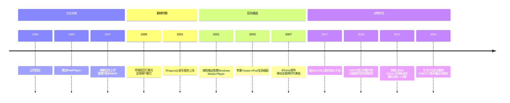
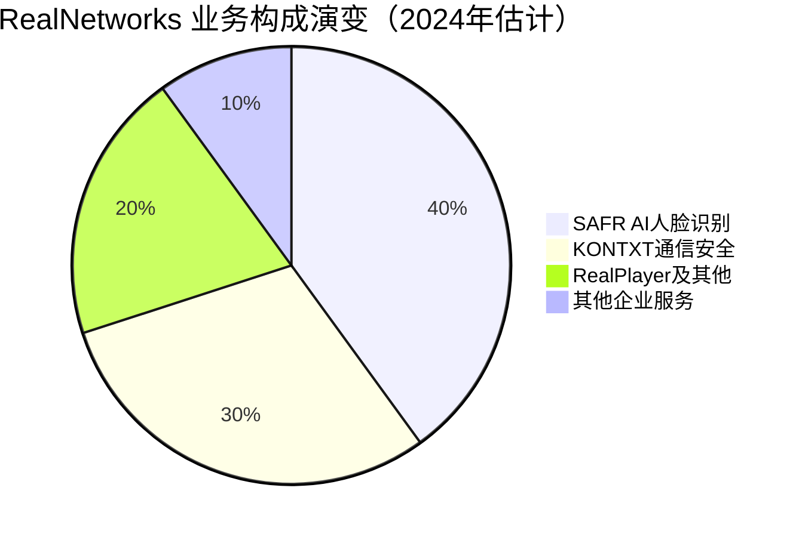

# 003 | 以RealNetworks为例谈初创公司应对巨头碾压【更新版】

> **适用范围**：技术管理者、创业者、投资研究者、产品经理及对科技商业史感兴趣的读者；适用于战略复盘、案例研讨与决策参考场景。
>
> **更新摘要（v2 · 2026-08 更新）**：
> - 结构化升级为 6 节骨架（导言 / 核心方法论 / 关键流程 / 工具与实战 / 常见误区 / 进阶延展）
> - 保留全部原文 Mermaid 图、表格、数据与术语英文对照，并为 Mermaid 图补充 frontmatter 与图后解读
> - 将原「参考资料/附录」并入第 6 节「进阶延展」，便于延展阅读

## 1. 导言

### 引言：一个时代的缩影

在互联网发展的长河中，很少有公司像RealNetworks这样，既能成为流媒体时代的开创者，又能在巨头的围剿中苦苦挣扎，最终完成一次令人瞩目的战略转型——从消费级软件公司蜕变为人工智能（Artificial Intelligence, AI）和企业服务提供商。这家公司的故事，不仅是一个商业案例，更是一面镜子，映照出初创公司在面对科技巨头时的生存智慧与命运抉择。

RealNetworks的故事告诉我们：**一家公司是否具备了应对商业巨鳄挤占或者阻击的资格，首先取决于这家公司的产品有没有不可替代性。**

---

## 2. 核心方法论

### 一、辉煌岁月：流媒体时代的先驱

#### 1.1 创立背景与技术突破

RealNetworks成立于1994年，由前微软高管罗布·格拉泽（Rob Glaser）创立。在公司创立之前，格拉泽已经在微软工作了近十年，深谙软件行业的游戏规则。他敏锐地察觉到互联网多媒体内容的巨大潜力，于是毅然离开微软，在西雅图创建了Progressive Networks（后更名为RealNetworks）。

公司的核心产品RealPlayer一经推出便风靡全球，成为互联网上最流行的媒体播放器。在那个带宽有限的年代，RealNetworks开发的RealAudio和RealVideo编解码技术，让音频和视频内容首次能够在互联网上流畅传输。这一技术突破，奠定了RealNetworks在流媒体领域的霸主地位。

#### 1.2 上市与巅峰时刻

1997年，RealNetworks在纳斯达克上市，股票代码为RNWK。上市后的几年里，公司股价一路飙升，市值一度超过百亿美元。RealPlayer的全球安装量突破数亿台，成为当时世界上使用最广泛的媒体播放器之一。

除了播放器业务，RealNetworks还积极拓展内容服务领域，推出了RealNetworks订阅服务、在线音乐商店Rhapsody、网络游戏平台RealArcade等多元化业务。公司员工规模迅速扩张至数千人，在西雅图、旧金山、纽约等地设立了办公室。

> 上图展示了关键节点与演进路径，结合正文时间线可直观把握事件因果与战略转折。

---

## 3. 关键流程

### 四、战略转型：从消费软件到AI与企业服务

#### 4.1 认清现实：流媒体时代的终结

到了2010年代中期，RealNetworks在消费级流媒体市场的份额已经微乎其微。RealPlayer虽然仍在运营，但主要用户群体局限于一些特定场景（如教育机构、政府部门等）。公司的营收和利润持续下滑，股价长期低迷。

在这个关键时刻，格拉泽再次展现了企业家的决断力——他意识到，继续在消费级流媒体市场与科技巨头正面交锋已经没有意义，必须寻找新的增长曲线。这一次，他将目光投向了人工智能（AI）和企业服务领域。

#### 4.2 SAFR：人脸识别AI平台的崛起

2017年，RealNetworks推出了SAFR（Secure Accurate Facial Recognition，安全精准人脸识别）平台，正式进军计算机视觉和人工智能领域。SAFR是一款基于深度学习的人脸识别解决方案，能够在实时视频流中快速准确地识别人脸，并支持口罩检测、情绪分析、年龄估算等多种功能。

**SAFR的应用场景非常广泛**：
- **校园安全**：2018年，RealNetworks宣布向美国和加拿大首批申请的10万所K-12学校免费提供SAFR软件，用于加强学校安全防护[来源3]。这一举措获得了广泛关注，也体现了企业的社会责任感。
- **零售分析**：帮助零售商分析顾客流量、停留时间、购买行为等。
- **智慧建筑**：用于办公楼、机场、车站等场所的访问控制和安全管理。
- **执法辅助**：协助执法部门进行嫌疑人识别和追踪（需符合隐私法规）。

2018年底，RealNetworks将SAFR引入中国市场，与宏天高科签署战略合作协议，将这一先进的人脸识别技术落地中国[来源5]。这标志着RealNetworks开始布局全球AI市场。（注：2024年3月，RealNetworks宣布将SAFR业务出售给AI视频分析公司Kogniz，换取其约44%股权。）

#### 4.3 KONTXT：通信安全的新战场

除了SAFR，RealNetworks还推出了KONTXT平台，专注于通信安全和反诈骗领域。KONTXT利用机器学习和自然语言处理技术，帮助企业和服务提供商识别和拦截垃圾短信、钓鱼电话、网络欺诈等恶意通信行为。

随着全球电信诈骗问题的日益严重，KONTXT的市场需求持续增长。该平台已经被多家电信运营商、金融机构和企业客户采用，成为RealNetworks企业服务业务的重要支柱。

#### 4.4 私有化：退出公开市场的战略抉择

2022年，RealNetworks宣布了一项重大决策——创始人兼CEO罗布·格拉泽将以每股1.15美元的价格对公司进行私有化[来源1][来源3]。消息宣布时，市场上波澜不兴，大家对这个公司大概都已经没有什么兴趣了。

这次私有化的背景值得深思：
- **股价长期低迷**：相比上市初期的高点，RealNetworks的市值缩水超过99%。
- **战略转型的需要**：私有化可以让公司摆脱上市公司季度财报的压力，更专注于长期战略投资。
- **创始人的信心**：格拉泽愿意用自己的资金回购公司，说明他对AI转型战略充满信心。

从每股数百美元的高点到1.15美元的私有化价格，RealNetworks的股价走势堪称科技史上最惨烈的跌幅之一。但换个角度看，这也是一家公司彻底放下包袱、轻装上阵的开始。

> 上图展示了关键节点与演进路径，结合正文时间线可直观把握事件因果与战略转折。

---

## 4. 工具与实战

### 三、应对策略：扩展战线与灰色地带

#### 3.1 在相关领域开展业务

面对巨头的围剿，RealNetworks采取了一系列应对措施，概括来说就是：**在自己比对方更擅长的相关领域开展业务，扩展战线。**

RealNetworks的创始人自己就来自微软，他深知一旦微软盯上了一款软件并推出免费产品，正面反击会异常艰难。自身软件的特性固然比对方要好，但绝没好到不可替代的程度。所以RealNetworks选择以播放器作为切入点，成为内容服务商。

RealNetworks认为，和自己比起来，微软作为传统软件大厂商，在做内容和服务这一块更加没有经验。如果一场战争延续到了相关的领域，而在相关领域里自己比大鳄更有优势，那么凭借软件开辟出来的先发优势，就有可能让自己站稳脚跟。

实际上，我想从一开始创业到后来微软跳出来的种种变局，所有的策略，格拉泽在创立公司伊始应该就想过无数遍。这是他成功的关键。

#### 3.2 抱大腿的选择

我们还可以看到另外一种选择：**面对大鳄的袭击，抱上另外一个大腿也不错。大腿和大鳄有竞争关系，但却往往对初创公司的产业或者产品兴趣不大。** 只是有大腿可以抱本身就不容易。很多时候，初创公司找不到合适的大腿去抱；更何况即便找到了，大腿还得看得上自己。两者加起来，能够抱上大腿的初创公司终究是少数。所以这也只能说是一种运气。

#### 3.3 灰色地带的险招

而当iPod开始逐渐侵占RealNetworks的基本盘时，格拉泽选择游走于灰色地带，让自家的媒体登上iPod的做法，那就不仅仅是眼光的问题了。格拉泽明显是顶不住压力才出此险招。而此险招是否曾在内部遭遇抵制已不得而知，但其终归是被RealNetworks整个高管团队通过，并最终实施。

**更重要的是，RealNetworks当时居然没有意识到iPod的胜利其实就是一个平台的胜利。而战胜平台，唯一的办法就是建设自己的平台。** RealNetworks已经有了足够多的内容，建设自己的平台肯定比让自己的内容以不怎么合法的方式进入别人的平台来得更有效也更安全。我实在是无法理解格拉泽为什么选择了这样的应对方式。我只能说，一个人的英明是有限的。格拉泽也不能免俗。

---

## 5. 常见误区

### 二、巨头的围剿：三面受敌的战略困境

#### 2.1 微软的"免费+捆绑"策略

RealNetworks遇到的最大挑战来自老东家微软。2001年前后，微软将Windows Media Player（Windows媒体播放器）预装在每一台Windows操作系统中，采用完全免费的策略。更致命的是，微软利用其在操作系统市场的垄断地位，将Media Player与Windows深度捆绑，使得普通用户几乎没有动力去下载和安装第三方播放器。

这种"免费加捆绑"的策略，是微软一贯的商业打法。对于RealNetworks来说，其产品虽然在技术上比微软或苹果的同类产品要好，但是这种好对于大部分用户来说，并非是不可替代的。当竞争对手使用低价乃至免费倾销的策略时，用户很多时候愿意免费使用体验相对次一些的产品。

#### 2.2 苹果的降维打击

如果说微软的挑战还停留在桌面端，那么苹果的崛起则彻底改变了游戏规则。2001年，苹果推出iPod便携式音乐播放器，配合iTunes软件和iTunes Store在线商店，构建了一个完整的数字音乐生态系统。2007年iPhone的发布更是开启了移动互联网时代，彻底颠覆了传统的PC-centric（以个人电脑为中心）的内容消费模式。

**这里有一个鲜为人知的历史细节**：iPod的原型机其实诞生在RealNetworks内部，但格拉泽却拒绝了这个创意。这个决定后来被广泛认为是RealNetworks错过的最大机会。然而，站在当时的情境下，我们很难苛责格拉泽太多——毕竟，当iPhone出来的时候，连微软CEO鲍尔默看着这个没有按键的手机也感到迷茫，觉得这能叫手机吗？

鲍尔默曾经很有信心赢得智能手机这场战争，投入巨资做Windows Phone，不惜购买诺基亚。然而不出几年，所谓的Windows Phone终究是被市场淘汰。我们是不是就此可以责怪鲍尔默呢？其实，鲍尔默做企业级软件的能力和实力是得到业界公认的，但这次他没看明白iPhone的影响力。所以在我看来，iPod的这个变革确实非常大，格拉泽真的是运气不太好。那个时间点，若换作其他人，是不是就会做得更好呢？我看也不一定。

#### 2.3 YouTube的崛起与战略失误

就在RealNetworks忙于应对微软和苹果的时候，YouTube这样的免费视频分享网站悄然兴起，并没有在RealNetworks这个当时的媒体大鳄下面诞生或壮大。而这个媒体大鳄在那个时候却进入了广告市场，采取了非常激进的广告投放策略，哪怕影响用户体验也在所不惜。

这两件事情放在一起，首先说明RealNetworks在那个时候是有盈利压力的。盈利压力一方面缘于它本身是上市公司，需要给投资者看到赚钱的能力；一方面也和互联网泡沫破灭以后的大环境相关。在这个环境下，免费的东西不被投资人看好，这对已经上市的、面临盈利压力的公司就形成了阻力。

但是不管怎样，这方面我觉得格拉泽做得和亚马逊总裁贝佐斯比起来要差得多。**贝佐斯在他的领导力准则里面强调，公司的领导人应该旨在实现长远的目标，而不应该屈从于短期的利益。** 一家为了盈利而非常激进地投放广告、不顾用户体验的公司，怎么可能去支持一个短期内没有盈利希望的、类似于YouTube这样的视频分享网站呢？

从这一点可以看出，作为创业者的格拉泽，在技术上有其独到的地方，在商业上也对微软的介入做了充分准备。但他毕竟不是一个目光长远的伟人，无法在短期盈利和长期发展之间找到合适的平衡点。

---

### 五、深度反思：我们能从RealNetworks学到什么？

#### 5.1 产品不可替代性的重要性

回顾RealNetworks的发展历程，最重要的教训或许是：**在面对巨头竞争时，产品的不可替代性是生存的根本。**

以Facebook为例，当谷歌大举进军社交领域的时候，Facebook一开始是非常紧张的。然而谷歌在社交领域的攻城略地却显得非常失败。原因很简单：一个人的好友如果都在Facebook上了，再让这个人迁移出既有的社交圈，转而使用另外一个社交软件，其代价是巨大的。所以在Facebook巩固了很多著名的高校社交圈之后，它就成为了一个不可替代的平台。

相比之下，RealNetworks的播放器虽然在技术上领先，但这种领先对于大多数用户来说并不是不可替代的。当微软提供免费的替代品时，用户很容易迁移。

#### 5.2 领导人的眼界与格局

站在行业变革的前夜，唯有伟人才能够比别人看得更远。史蒂夫·乔布斯去世的时候，各大互联网公司都在首页向这位伟人致敬。这种崇敬是发自内心的，因为大家看到了一个可以比他人更早几年看到行业变迁的伟人。可惜不是每个人都是乔布斯。你我不是，格拉泽也不是。

RealNetworks其实算得上是一步错步步错。格拉泽在技术上当然是有几把刷子的，他在出来创业前也想明白了要面对的对手多半是老东家微软。因为在老东家工作多年，所以估计也想明白了比尔·盖茨的套路，知道怎么去应对才能让自己的公司发展下去。

然而我们也必须说，作为一个很不错的创业者，格拉泽应该不具备比尔·盖茨对于PC软件的认识，或者乔布斯对于消费电子的认识。因此当一个全新的东西出来时，他就迷茫了。那个大硬盘播放器的东西，就让格拉泽迷茫了。

#### 5.3 转型的时机与勇气

RealNetworks最终选择转型AI和企业服务，这个决定来得有些晚，但也并非完全没有希望。SAFR和KONTXT这两个产品线显示，RealNetworks在AI领域具备一定的技术实力和市场洞察力。

**对于初创公司和中小企业而言，RealNetworks的故事提供了以下启示**：

1. **尽早建立护城河**：不要依赖技术上的暂时领先，要构建网络效应、品牌认知、切换成本等结构性壁垒。
2. **保持战略灵活性**：当核心业务受到威胁时，要有勇气及时调整方向，而不是死守阵地。
3. **平衡短期与长期**：上市公司尤其要注意不要为了短期财报牺牲长期竞争力。
4. **关注平台变革**：技术的代际变迁（如PC→移动→AI）往往意味着行业格局的重塑，要提前布局。

---

## 6. 进阶延展

### 六、结语：未完待续的故事

截至2024年，RealNetworks已经完成了从消费级软件公司到AI企业服务提供商的蜕变。虽然公司规模和影响力已无法与巅峰时期相提并论，但在KONTXT通信安全等细分领域（SAFR已于2024年3月出售给Kogniz），RealNetworks依然保持着一定的技术优势和市场份额。

私有化后的RealNetworks不再需要向华尔街交出漂亮的季度财报，这让格拉泽可以更加从容地推进AI战略。未来几年将是检验这次转型成败的关键时期——AI市场竞争激烈，巨头林立，RealNetworks能否在新的赛道上找到自己的位置，让我们拭目以待。

**最后留给你一个问题**：如果你是格拉泽，在2001年微软推出免费Media Player的时候，你会怎么做？在2007年iPhone发布的时候，你又会如何应对？在2017年决定转型AI的时候，你是否有勇气押注这个方向？

---

---

### 参考资料来源

1. 腾讯云开发者社区：《前"巨头"宣布私有化，扒一扒RealNetworks的前世今生》（https://cloud.tencent.com/developer/article/2011488）
2. 百度百科：RealNetworks词条（https://m.baike.com/wiki/RealNetworks/5173669）
3. Bilibili专栏：《校园伤害事件频发，怎么加强学校安全？他们向10万多个学区免费提供...》（https://www.bilibili.com/read/cv913185）
4. 电子发烧友网：《SAFR人脸识别入华 坚持做一个对社会负责任的项目》（https://m.elecfans.com/article/837281.html）
5. 电子工程世界：《RealNetworks携手宏天在华落地先进的人脸识别技术SAFR》（http://m.eepw.com.cn/article/201812/395190.html）
6. RealNetworks官方网站投资者关系页面
7. TechCrunch / VentureBeat关于RealNetworks私有化的报道
8. Gartner关于AI人脸识别市场的研究报告

---

*本文基于2017年原作《以RealNetworks为例，谈谈初创公司如何应对巨头碾压》更新，新增2017-2024年间RealNetworks的战略转型、SAFR AI业务、KONTXT防诈骗、2022年私有化等内容，信息截止日期为2024年6月7日。*

---

*v2 结构化升级版 · 文件名保持不变：002-以RealNetworks为例谈初创公司应对巨头碾压-【更新版】.md*