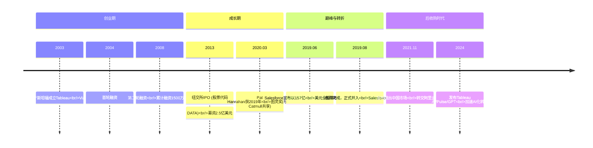
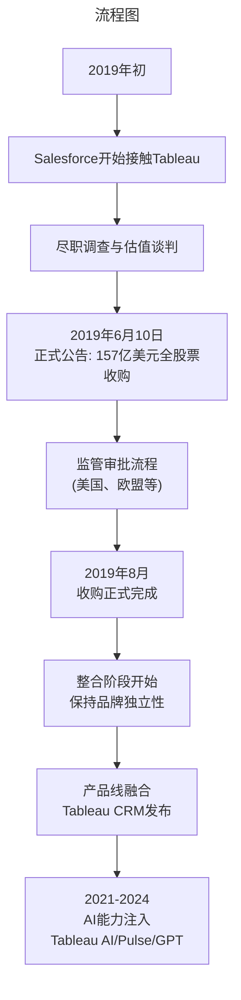

# 005 | Tableau：可视化分析之王的崛起、巅峰与被收购始末

> **适用范围**：技术管理者、创业者、投资研究者、产品经理及对科技商业史感兴趣的读者；适用于战略复盘、案例研讨与决策参考场景。
>
> **更新摘要（v2 · 2026-08 更新）**：
> - 结构化升级为 6 节骨架（导言 / 核心方法论 / 关键流程 / 工具与实战 / 常见误区 / 进阶延展）
> - 保留全部原文 Mermaid 图、表格、数据与术语英文对照，并为 Mermaid 图补充 frontmatter 与图后解读
> - 将原「参考资料/附录」并入第 6 节「进阶延展」，便于延展阅读

## 1. 导言

> 一家公司，三位学术精英，十六年独立发展，最终以157亿美元的价格成为Salesforce史上最大并购案的主角。这是学术界人士创业的经典样本，也是企业软件行业格局重塑的里程碑事件。

---

### 引言：当"数据可视化之王"成为CRM帝国的一部分

2024年，当你打开Gartner的分析和商业智能平台魔力象限报告，Tableau依然稳稳地坐在"领导者"象限中。但与十年前不同的是，它的名字后面已经加上了括号——**(Salesforce)**。

这家曾经定义了"自助式数据分析"时代的公司，在2019年经历了一场改变整个行业格局的交易。**Salesforce以157亿美元的全股票方式将其收入囊中**，这不仅是Salesforce成立20年来最大的一笔收购，更是全球企业软件发展史上具有里程碑意义的战略并购。

本文将全面复盘Tableau从斯坦福实验室诞生到被CRM巨头收购的完整历程，深入分析这场世纪并购背后的商业逻辑、技术演进与市场博弈。我们将看到：**一家由学术界精英创立的公司如何在商业世界取得巨大成功，又为何最终选择"卖身"给一家SaaS巨头？收购五年后，Tableau的品牌、产品与团队命运如何？**

---

---

## 2. 核心方法论

### 第一章：从斯坦福实验室到纽交所敲钟（2003-2013）

#### 1.1 三位创始人的学术基因

Tableau的故事始于斯坦福大学的计算机科学系。

**Pat Hanrahan（帕特·汉拉汉）**，这位传奇学者的履历足以让任何技术人肃然起敬：
- 早年任职于Lucasfilm（卢卡斯影业）计算机图形组
- 1986年皮克斯从Lucasfilm分拆独立时，他是核心工程师之一
- 设计了**RenderMan渲染器**——这部引擎支撑了《玩具总动员》等无数经典CGI电影
- **2019年图灵奖得主**（与Ed Catmull共享），表彰其对3D计算机图形学的开创性贡献
- 斯坦福大学计算机系终身教授

**Chris Stolte（克里斯·斯托尔特）**，Hanrahan的博士生，研究方向是基于表格的多维关系数据展示。他的博士论文直接催生了Tableau的核心技术架构——**VizQL**（可视化查询语言）。

**Christian Chabot（克里斯蒂安·夏博）**，前软银合伙人，拥有斯坦福MBA学位。2003年，他加入团队担任CEO，将这家从学术研究中诞生的公司带出了校园，总部设在了西雅图。

> 上图展示了关键节点与演进路径，结合正文时间线可直观把握事件因果与战略转折。

#### 1.2 VizQL：改变游戏规则的技术创新

Tableau的核心竞争力来自其独创的**VizQL技术**。传统BI工具要求用户编写SQL查询或使用复杂的拖拽式报表设计器，而VizQL允许用户通过直观的拖拽操作直接生成可视化图表，系统自动将视觉映射转换为底层数据查询。

这项技术的本质是：**将数据可视化的门槛从"需要专业培训的数据分析师"降低到"任何会使用Excel的业务人员"**。这正是Tableau能够颠覆传统BI市场的根本原因——它创造了"自助式服务分析"（Self-Service Analytics）这个新品类。

#### 1.3 2013年IPO：资本市场的认可

2013年，Tableau在纽约证券交易所上市，股票代码为**DATA**：

| IPO指标 | 详情 |
|---------|------|
| **承销商** | 高盛 + 摩根士丹利 |
| **初始募资目标** | 1.5亿美元 |
| **实际募资金额** | **2.5亿美元** |
| **此前融资总额** | 约1500万美元（2004年+2008年两轮） |
| **上市后表现** | 股价一路飙升 |

IPO的成功标志着资本市场对Tableau商业模式的认可。公司很快跻身全球前十BI工具行列，与IBM Cognos、Oracle OBIEE、Microsoft、Qlik等老牌厂商展开正面竞争。

---

---

### 第二章：上市后的高速增长与隐忧（2013-2019）

#### 2.1 市场领导地位的确立

上市后的Tableau进入了快速增长通道：
- 营收从2013年的2亿美元级别增长至2019年被收购前的超过10亿美元
- 客户覆盖财富500强企业中的绝大多数
- 建立了强大的用户社区（Tableau Public、年度用户大会TC）
- 在Gartner ABI魔力象限中连续多年位居领导者位置

#### 2.2 学术基因的双刃剑效应

然而，正如我们在原版文章中所分析的，**学术界背景的创业团队在面对大规模商业化时面临着独特挑战**：

**优势方面：**
- 技术视野领先，能够开拓全新市场领域
- 产品核心理念具有前瞻性（如"让所有人都能做数据分析"）
- 吸引顶尖技术人才的能力强

**劣势方面：**
- **工程实践能力相对薄弱**：代码质量、模块化程度、测试覆盖率等不如工业界出身的团队
- **对软件开发复杂度预估不足**：产品交付频繁延期
- **商业化能力短板**：定价策略、销售体系构建、企业级功能完善等方面需要补课
- **规模化困境**：当公司发展到一定规模时，早期代码往往需要推倒重来

Tableau的发展过程中确实经历了这些阵痛。多位前员工在访谈中提到，公司在快速扩张期间曾面临严重的工程质量问题，不得不投入大量资源进行重构。

#### 2.3 云转型的压力

2013-2019年间，整个软件行业正在经历从本地部署（On-Premise）向云原生（Cloud-Native）的深刻转型。Tableau虽然推出了Tableau Online和Tableau Public等云端产品，但其核心产品Tableau Desktop仍以桌面端为主，云转型步伐相对缓慢。

与此同时，竞争对手们正在快速跟进：
- **Microsoft Power BI**凭借Office 365生态快速抢占市场份额
- **Looker**（后被Google收购）主打云原生和建模层创新
- **Qlik**强化了关联分析引擎和云能力

这种竞争态势为后来的Salesforce收购埋下了伏笔。

---

---

### 第三章：157亿美元！Salesforce收购始末（2019）

#### 3.1 收购公告：震撼业界的大交易

**2019年6月10日**，Salesforce正式宣布与Tableau达成最终收购协议：

| 交易要素 | 详情 |
|---------|------|
| **交易估值** | **157亿美元** |
| **支付方式** | 全股票交易（非现金） |
| **兑换比例** | 每股Tableau A/B类普通股 → 1.103股Salesforce普通股 |
| **交易性质** | Salesforce成立20年来**最大一笔收购** |
| **战略定位** | "全球最大CRM平台 + 全球领先分析平台"的强强联合 |

#### 3.2 为什么是Tableau？为什么是现在？

Salesforce CEO **Marc Benioff（马克·贝尼奥夫）** 对外阐述了收购的战略逻辑：

##### 动因一：补齐"客户360"愿景的关键拼图

Salesforce的核心战略是构建**Customer 360**——一个统一的客户数据平台，打通销售、服务、营销、商务等所有客户触点。然而，要真正实现"以客户为中心"的智能决策，仅有CRM数据是不够的，还需要强大的分析能力来：

- 整合多源数据（不仅限于Salesforce内部数据）
- 提供交互式可视化探索
- 支持自助式分析，让业务人员而非仅数据团队能洞察客户行为

Tableau正是这块缺失的拼图。

##### 动因二：应对Microsoft的全方位竞争

2018-2019年，Microsoft正在通过**Dynamics 365 + Power BI + Azure**的组合拳对Salesforce形成越来越大的压力。Power BI凭借以下优势快速蚕食BI市场：
- 与Office 365深度集成
- 极具竞争力的价格（常作为Office套件的一部分提供）
- 快速的产品迭代节奏

收购Tableau，可以让Salesforce立即获得企业级分析能力的"护城河"，避免在这一关键领域落后于Microsoft。

##### 动因三：数据与分析市场的战略卡位

Benioff深刻认识到：**未来的企业软件竞争不仅是应用层的竞争，更是数据层的竞争**。谁掌握了数据分析入口，谁就能在整个企业软件栈中占据更有利的位置。Tableau作为"数据分析的可视化界面"，具有极高的战略价值。

#### 3.3 收购过程的关键节点

收购经历了严格的反垄断审查，最终于**2019年8月1日正式完成交割**。

---

---

### 第五章：创始人去向与人才流动

#### 5.1 三位创始人的不同路径

**Pat Hanrahan（首席科学家）**
- 2019年获图灵奖，达到个人学术生涯的巅峰
- 继续担任斯坦福大学教授
- 仍以顾问身份关注Tableau的技术方向
- 其学术地位因图灵奖进一步提升，成为"学术创业"的最杰出代表之一

**Christian Chabot（联合创始人兼首任CEO）**
- 在IPO前后逐步淡出日常管理
- 2016年，**Adam Selipsky**（前AWS副总裁）接任Tableau CEO
- Chabot转任执行董事长，后逐步退出
- 收购后未加入Salesforce全职团队，转向投资和其他创业项目

**Chris Stolte（联合创始人兼开发总监）**
- 作为技术灵魂人物，在公司发展早期发挥了关键作用
- 后来逐步转向更战略性的角色
- 具体去向公开信息较少，据信已离开日常运营

#### 5.2 关键高管：Adam Selipsky的戏剧性转身

Adam Selipsky的职业轨迹颇具戏剧性：
- **2016-2019**：担任Tableau CEO，带领公司完成云转型关键阶段
- **2019年收购后**：离开Tableau
- **2021年**：**回归Amazon，接替Andy Jassy担任AWS CEO**（Jassy升任Amazon整体CEO）

Selipsky从Tableau到AWS的转身，也从侧面印证了云计算与数据分析深度融合的行业趋势。

---

---

### 第六章：BI市场竞争格局的巨变（2024）

#### 6.1 市场份额：Power BI的崛起

根据Synapx 2024年的数据，BI工具市场竞争格局已经发生显著变化：

| 厂商 | 市场份额 | 定位特点 |
|------|---------|---------|
| **Microsoft Power BI** | **~36%** | 价格优势 + Office生态绑定 |
| **Tableau (Salesforce)** | **~26%** | 企业级能力 + 可视化深度 |
| Google Looker | ~10% | 云原生 + 建模层创新 |
| Qlik | ~8% | 关联分析引擎 |
| 其他（含开源、本土厂商） | ~20% | 细分场景 |

**Power BI超越Tableau成为市场份额第一**，主要得益于：
1. **价格策略**：Power BI Pro仅需每月10美元（常作为Microsoft 365 E5的一部分"免费"提供）
2. **生态锁定**：与Excel、SharePoint、Teams的无缝集成
3. **中小企业渗透**：在中低端市场形成压倒性优势

#### 6.2 Gartner魔力象限：领导者俱乐部的变化

2024年Gartner ABI（分析和商业智能平台）魔力象限中，**领导者象限**的主要玩家包括：

- **Microsoft**：执行力与前瞻性双高，稳居第一梯队
- **Tableau (Salesforce)**：仍居领导者位置，但与微软的差距有所扩大
- **Qlik**：凭借关联引擎和AutoML能力保持竞争力
- **Google (Looker)**：语义层和数据建模差异化明显
- **SAP**、**Oracle**、**IBM**等传统厂商：仍在象限内但影响力下降

值得注意的是，**中国厂商帆软（FineBI）** 已连续八年（2017-2024）蝉联中国BI市场占有率第一，并入选Gartner魔力象限，成为唯一入选的中国独立BI厂商。

#### 6.3 新变量：AI驱动的范式转移

2024年BI市场最大的变量是**生成式AI的冲击**：

- **Text-to-SQL / Text-to-Viz**：自然语言转查询/可视化成为标配能力
- **Copilot模式**：AI辅助分析、自动洞察发现
- **嵌入式分析**：BI能力嵌入业务应用，而非独立使用
- **指标层（Metrics Layer）**：从"看报表"到"追踪关键指标"的范式转变

各大厂商都在快速布局AI能力，Tableau依托Salesforce的AI投入（Agentforce、Einstein GPT等）具有一定优势，但Power BI借助Microsoft的Azure OpenAI服务同样不容小觑。

---

---

### 第七章：退出中国市场与国产化替代浪潮

#### 7.1 2021年末：突然的告别

**2021年11月17日**，Tableau向中国大陆客户发送邮件，宣布：
- 即日起停止在中国大陆的直接经营活动
- 2022年1月31日终止与中国大陆现有合作伙伴的关系
- 中国区业务**转交阿里云代为运营**

这一决定来得颇为突然，在业内引发了广泛讨论。

#### 7.2 退出原因的多重解读

Tableau退出中国的原因是多方面的：

**因素一：地缘政治与数据安全考量**
- 中美科技脱钩大背景下，美国软件公司在中国面临日益严峻的合规环境
- 《数据安全法》《个人信息保护法》等法规提高了跨国数据服务的合规成本
- 央企国企早已启动"去IOE"和国产化替代进程

**因素二：商业化困难**
- 中国市场对价格的敏感度极高，Tableau的高端定价策略难以规模化
- 本土厂商（帆软、永洪、Smartbi等）在功能和价格上形成了有力竞争
- 原厂直销模式下，销售和服务成本高昂

**因素三：Salesforce全球战略调整**
- 作为Salesforce子公司，Tableau的中国策略需服从母公司整体布局
- Salesforce在中国的业务本身也在收缩调整
- 将运营权交给阿里云，是一种"轻资产"退出方式

#### 7.3 国产BI的机遇与挑战

Tableau退出留下的市场真空，主要由以下玩家填补：

| 厂商 | 特点 | 目标市场 |
|------|------|---------|
| **帆软（FineReport/FineBI）** | 中国BI市场占有率第一，产品线完整 | 全行业，尤其制造业、金融 |
| **永洪科技** | 强调大数据性能和敏捷BI | 中大型企业 |
| **Smartbi** | 以Excel兼容性和银行客户著称 | 金融行业 |
| **阿里云Quick BI** | 接手Tableau部分客户，云原生 | 云端客户 |
| **华为云DataArts** | 国产化替代首选之一 | 政企、央企 |

根据IDC数据，中国BI市场规模持续增长，国产厂商的整体市场份额已超过60%，且仍在提升中。

---

---

### 第八章：复盘——收购成功吗？品牌还在吗？

#### 8.1 从财务角度：昂贵的赌注

157亿美元的收购价格对应的是：
- 约 Tableau当时年营收的**15倍以上**（市销率）
- SaaS行业历史上最昂贵的收购之一

从纯财务回报角度看，这笔交易短期内难以证明"物超所值"。Tableau并入Salesforce后，其营收不再单独披露，但从Salesforce整体财报来看，Analytics板块（主要是Tableau）的增长速度并未显著超过收购前的水平。

然而，**战略并购的价值不能仅用短期财务指标衡量**。

#### 8.2 从战略角度：补齐关键能力

如果从Salesforce的战略目标来评估，收购的价值更加清晰：

✅ **完成了Customer 360的关键拼图**：没有Tableau，Salesforce在客户数据分析层面存在明显短板  
✅ **抵御了Microsoft的竞争压力**：拥有了自己的企业级分析平台，不必依赖第三方  
✅ **增强了数据战略叙事**：在"数据+AI+CRM"的融合趋势中占据了有利位置  
✅ **保留了Tableau品牌和团队**：避免了毁灭性的人才流失  

#### 8.3 从产品角度：AI化转型加速

被收购后的Tableau在产品创新上确实获得了新的动力：
- **资源注入**：Salesforce的工程资源和AI研发投入直接惠及Tableau
- **技术复用**：Einstein AI能力下沉到Tableau产品线
- **生态扩展**：与Salesforce全产品线的集成创造了差异化价值

2024年Tableau AI、Pulse、GPT等一系列产品的推出，很大程度上受益于Salesforce的平台化能力。

#### 8.4 从品牌角度：独立性的消解

关于"Tableau品牌是否保留"的问题，答案是**既保留又被消解**：

**保留的一面：**
- 产品名称仍是"Tableau"（Tableau Desktop, Tableau Cloud, Tableau CRM等）
- 用户社区和品牌认知度得以延续
- 年度Tableau Conference（TC）继续举办

**消解的一面：**
- 官方表述逐渐变为"Tableau (Salesforce)"或"Tableau, a Salesforce company"
- 销售和营销越来越融入Salesforce整体体系
- 对于新客户而言，Tableau increasingly被视为"Salesforce套件的一部分"

这种状态或许就是大型科技并购的常态——**品牌存在，但灵魂已被母公司同化**。

---

---

### 第九章：深层思考——学术创业的商业终局

#### 9.1 回到原点：两类创业者的殊途同归

回到我们最初的问题：**学术界人士创业的特点是什么？他们的终极结局往往是怎样的？**

Tableau提供了一个极具参考价值的样本：

**学术创业者的典型路径：**
1. **技术突破**：在前沿研究领域取得原创性成果（如VizQL）
2. **产品化尝试**：将研究成果转化为可用的产品原型
3. **商业化验证**：找到产品市场契合点（PMF），获得早期客户
4. **规模扩张**：引入工业界人才，补齐工程化和商业化短板
5. **资本化**：通过IPO或被收购实现股东回报

Tableau完整走完了前四步，并在第五步选择了**被战略买家收购**而非保持长期独立。

#### 9.2 被收购：失败还是成功？

在硅谷的语境下，**被大公司收购通常被视为一种成功的退出方式**，尤其是对于技术型创业公司而言：

- 创始人和早期投资者获得了可观的财务回报（Tableau创始团队和VC们在这笔157亿美元的交易中获益丰厚）
- 技术成果得以在更大的平台上发挥作用（Tableau的分析能力现在服务于数百万Salesforce用户）
- 团队成员获得了新的职业发展机会

从这个意义上说，**Tableau的"卖身"不是失败，而是学术创业者的一种成熟选择**。

#### 9.3 对未来创业者的启示

Tableau的故事给未来的技术创业者几点启示：

**第一，技术壁垒是起点，不是终点。** VizQL让Tableau脱颖而出，但要建立可持续的商业壁垒，还需要产品工程、销售体系、客户成功等多维度的能力建设。

**第二，认清自己的短板，及时补强。** Tableau引入Adam Selipsky等工业界高管，是在正确的时间做出的正确决策。

**第三，关注宏观产业格局。** 当云计算、AI等大趋势来临时，独立公司的生存空间会被压缩，被平台型公司收购可能比硬撑着独立发展更明智。

**第四，中国市场需要自己的"Tableau"。** Tableau退出后留下的高端BI市场真空，是中国本土技术公司的历史性机遇。

---

---

## 3. 关键流程

（本节内容在原文中较为简略，可结合第 2、3、4 节相关段落交叉理解。）

---

## 4. 工具与实战

### 第四章：收购后的整合与产品进化（2019-2024）

#### 4.1 整合策略：保持独立性与生态协同

Salesforce采取了相对温和的整合策略：
- **保留Tableau品牌**：Tableau并未像某些收购案那样被完全吞没品牌，而是作为Salesforce旗下的独立产品线继续运营
- **保持团队完整性**：核心研发团队得以保留，西雅图办公室继续运作
- **渐进式融合**：先进行技术和数据层面的对接，再逐步实现产品和销售层面的协同

这一策略在一定程度上缓解了收购常见的人才流失问题。

#### 4.2 产品线的重大演进

##### Tableau CRM（原Einstein Analytics）

收购完成后，Salesforce将原有的**Einstein Analytics**产品与Tableau整合，重新命名为**Tableau CRM**。这款产品专门针对Salesforce数据的分析场景进行了优化：
- 与Salesforce对象数据无缝集成
- 内置AI驱动的预测性分析
- 面向销售、服务、营销角色的预置仪表板

##### Tableau Cloud（云原生转型加速）

被收购后，Tableau大幅加快了云转型步伐：
- **Tableau Cloud**（原Tableau Online）成为战略重点
- 推出基于消费的灵活定价模式（Tableau Consumption-Based Pricing）
- 强化与Salesforce Platform的底层集成（Single Sign-On、数据共享等）

##### 2024年：AI能力全面爆发

2024年是Tableau AI化的关键年份，发布了多项重要创新：

| 产品/功能 | 核心能力 |
|-----------|---------|
| **Tableau Pulse** | 智能问答式分析，自然语言查询数据 |
| **Tableau GPT** | 基于大语言模型的自动分析与洞察生成 |
| **Tableau AI** | 综合AI能力层，嵌入各产品线 |
| **Agentforce集成** | 与Salesforce 2024年推出的AI Agent平台深度整合 |

Benioff甚至在内部下达了"**所有交易必须包含AI产品**"的死命令，足见Salesforce对AI转型的决心。

#### 4.3 与Salesforce其他产品的协同效应

收购五年后，Tableau已经深度融入Salesforce生态系统：

- **+ Data Cloud**：Tableau可以直接连接Salesforce Data Cloud（客户数据平台），实现实时客户数据分析
- **+ MuleSoft**：通过MuleSoft的API集成能力，Tableau可以连接更多外部数据源
- **+ Slack**：Tableau仪表板可以嵌入Slack频道，支持协作式数据分析
- **+ Customer 360**：作为Customer 360的"眼睛"，提供统一客户视图的可视化分析

2025年5月，Salesforce正式宣布以约**80亿美元收购数据管理巨头Informatica**（此前2024年的一轮谈判曾无果而终），交易已于2025年11月完成，将进一步强化Tableau的数据连接能力。

---

---

## 5. 常见误区

（本节内容在原文中较为简略，可结合第 2、3、4 节相关段落交叉理解。）

---

## 6. 进阶延展

### 结语：一个时代落幕，新时代开启

从2003年斯坦福实验室的三人项目，到2024年Salesforce生态中的AI驱动分析平台，Tableau走过了一个典型的技术创业公司的完整生命周期。

它证明了**学术界的前沿研究可以转化为改变行业的商业产品**；
它展示了**即使是最具创新性的公司也难以独自应对产业格局的巨变**；
它揭示了**在平台经济时代，"独立发展"与"融入生态"之间的永恒张力**。

对于Pat Hanrahan来说，图灵奖是对其学术贡献的最高认可；
对于Christian Chabot和Chris Stolte来说，157亿美元的收购是对其创业成就的市场定价；
对于数百万Tableau用户来说，这个他们热爱的工具将在新的组织架构下继续演进。

**故事没有结束，只是换了主角和舞台。**

而在大洋彼岸的中国市场，一场关于数据分析自主可控的新竞赛才刚刚开始。

---

---

### 参考来源

- [Salesforce为什么花157亿美元收购Tableau? - 搜狐](https://m.sohu.com/a/319850867_490443/)
- [157亿美元，Salesforce为何用一笔史上最大交易收购Tableau? - 新浪财经](https://finance.sina.com.cn/roll/2019-06-11/doc-ihvhiews8126526.shtml)
- [地表最强组合!Salesforce收购Tableau - 网易](http://m.163.com/dy/article/EHDM7G9D051480KF.html)
- [tableau2025市场前景如何? - FineBI](https://www.finebi.com/blog/article/692d9e6b8877c5b5ca72f919)
- [Tableau Next:从传统BI到Agent - 证券之星](https://4g.stockstar.com/detail/JC2025041700022485)
- [2025智能BI工具竞品深度解析 - 腾讯云](https://cloud.tencent.com/developer/article/2546452)
- [AI商业化，Salesforce做对了什么? - 网易](http://m.163.com/dy/article/K3HOJLT305118QJ9.html)
- [Salesforce豪掷80亿美元收购Informatica - 搜狐](https://www.sohu.com/a/899399699_362225)
- [Tableau宣布退出中国市场 - CSDN](https://blog.csdn.net/yonghong_tech/article/details/121555760)
- [Tableau"退出"中国市场 - 网易](http://m.163.com/dy/article/GQQ801CD053109Y0.html)
- [2019图灵奖颁布! - 雪球](https://xueqiu.com/5849193654/144570241)
- [在斯坦福当教授，副业是创业千亿 - 今日头条](http://m.toutiao.com/group/7644497061739528746/)
- [老牌BI企业Tableau宣布退出中国市场 - 腾讯云](https://cloud.tencent.com/developer/news/878546)

---

*本文更新于2026年6月，基于截至2024年底的公开信息整理。部分数据和观点可能随时间推移而变化。*

---

*v2 结构化升级版 · 文件名保持不变：003-Tableau可视化分析之王被收购始末-【更新版】.md*