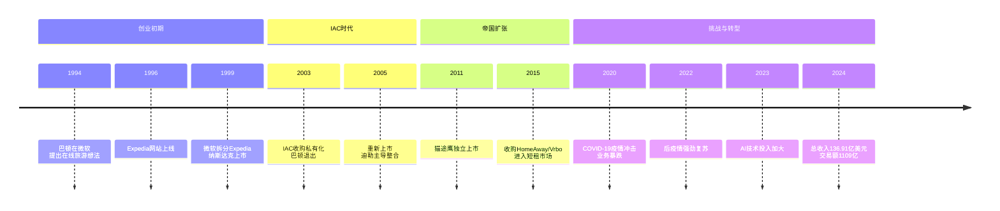
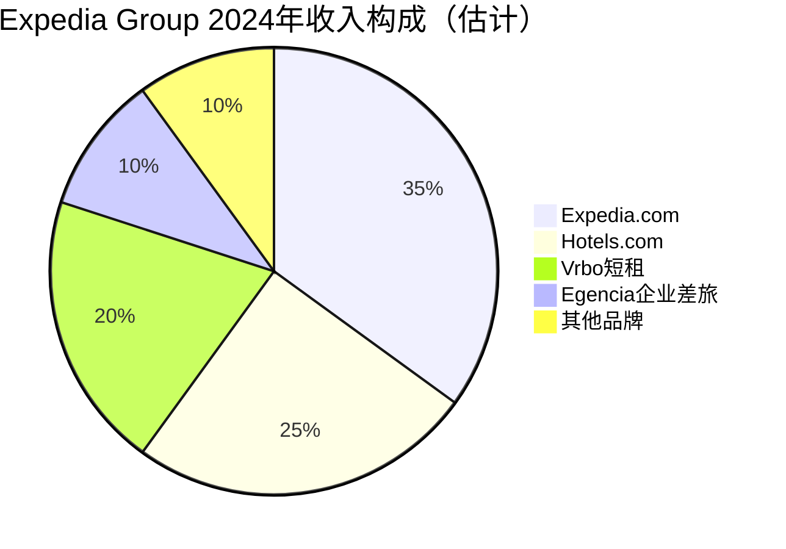

# 006 | Expedia在线旅游帝国的崛起与挑战【更新版】

> **适用范围**：技术管理者、创业者、投资研究者、产品经理及对科技商业史感兴趣的读者；适用于战略复盘、案例研讨与决策参考场景。
>
> **更新摘要（v2 · 2026-08 更新）**：
> - 结构化升级为 6 节骨架（导言 / 核心方法论 / 关键流程 / 工具与实战 / 常见误区 / 进阶延展）
> - 保留全部原文 Mermaid 图、表格、数据与术语英文对照，并为 Mermaid 图补充 frontmatter 与图后解读
> - 将原「参考资料/附录」并入第 6 节「进阶延展」，便于延展阅读

## 1. 导言

### 引言：从微软内部创业到全球旅游帝国

我会在这一年中介绍一些总部在西雅图或者研发中心很重要的一部分在西雅图的IT公司。这其中除了微软和亚马逊这样的大鳄以外还囊括了诸多在不同领域取得一定统治地位的公司们。

今天的主角是一家著名的在线旅游公司——Expedia。除了微软和亚马逊以外Expedia可说是总部设在西雅图的IT公司中最知名的一家。当然从某种程度上来说Expedia与其说是一家IT公司不如说是一家在线旅游公司（Online Travel Agency, OTA）。

Expedia的创始人就是Zillow的创始人理查德·巴顿（Richard Barton）。我想任何一个人如果一辈子可以创立两家都很优秀的上市公司这个人显然就是一个"大神"了。

---

## 2. 核心方法论

### 一、创业传奇：从微软到Expedia

#### 1.1 微软内部的创业火花

巴顿创立Expedia的时候还在微软。那大概是1994年的时候微软打算做一个旅游指南的CD-ROM（光盘只读存储器）。巴顿觉得只是搞个CD-ROM其实没什么意思要干不如干一票大的。他是极少数在那个时候对互联网就有所了解的人之一所以他想做一个在线的旅游信息提供商。

那个时候的微软还没有后来那么庞大他很容易就见到了比尔·盖茨和史蒂夫·鲍尔默并且说服了他们。于是他加班加点地干活在1996年的时候一个叫作Expedia的网站上线了。

1999年的时候微软决定将Expedia拆分出去这大概是比尔·盖茨觉得一家做软件的公司同时做旅游代理有点不伦不类吧。

这个网站被拆分出去时正赶上了2000年之前的互联网泡沫这恰是一个契机它很顺利地就在纳斯达克上市了。这对Expedia无疑是个非常幸运的事情。巴顿就继续做CEO这个CEO一做就做到了2003年。

这家公司的名字Expedia按照巴顿在一次采访里面的解释是Exploration（探索）和Speed（速度）的组合因此Expedia象征着"迅速查找旅游的线路"。这个名字不但应景而且非常有特色让Expedia的品牌旗帜非常鲜明。

#### 1.2 IAC时代的资本运作

**2003年的时候IAC（InterActiveCorp，互动公司）决定花钱买下Expedia私有化。** 这次收购到底溢价多少我无从查实了但我有一点不太理解：为什么巴顿就想卖它了而不是坚持下去、继续做下去？但是从后来的资料看巴顿可能是一个更适合创业而不是经营企业的人。Expedia到了2003年的规模他也有点儿做不动了。加上互联网泡沫刚过市场一片萧条。有人买此时卖掉其实未必是件坏事。

买下来的结果就是让CEO拿了钱并退出了。巴顿估计是分到了让自己这辈子都衣食无忧的钱他在拿着钱去完善自己下一个创业计划的同时也度假休息了一年。

休息一年以后回到西雅图他和从微软到Expedia一路同行的老同志罗伊德·福林克（Lloyd Frink）一起开始了一段新的创业之旅。

**这次创业一直处于保密状态直到万事俱备只欠东风的2006年Zillow才作为一家房地产信息整合和查询的公司暴露在大众面前。**

后来接受采访的时候巴顿表示自己的确在2003年的时候就有了新打算做Zillow了。如果这个时间是真的和Redfin创始人开始搞Redfin的时间其实也差不多。所以说**牛人的观念总是惊人得相似**。有关Zillow和Redfin的故事我会在后面的文章里讲述这里就不再展开了。

#### 1.3 迪勒的魔术：打造全球最大旅游代理

**买下Expedia的IAC的董事长是巴里·迪勒（Barry Diller）而迪勒是一个企业经营和资本运作的高手。** 从这方面来说Expedia是成于巴顿但绝对是兴旺发达在迪勒的手上。

经过两年的整合迪勒决定在2005年的时候让Expedia重新上市并采用了同样的股票代码。

但是卷土重来的Expedia背后不再是一个对旅游行业不熟悉的巴顿而是有很多年经验的迪勒。

重组以后的Expedia包括了无数大大小小的品牌除了著名的Expedia.com以外知名的还有Hotels.com以及HotWire.com加上2004年买入并专门做企业业务的Egencia以及后世非常著名的做旅游社区的猫途鹰（TripAdvisor）等等。

**这次重新打包上市后Expedia在资本市场上受到了追捧。有钱在手加上懂得旅游经营的管理团队这让Expedia从此成为了全球最大的旅游代理从此以后从未掉队过。**

到2011年的时候迪勒又决定把Expedia里面与旅游媒体相关的业务都重新打包上市并保留了所有和旅游交易相关的业务包括所有的酒店、机票、租车、游轮等等。

这次拆分并独立上市的公司里面最重要的是猫途鹰Expedia和猫途鹰就这样成为了两家公司。但是两者业务完全独立了而董事长却都是迪勒。

这种**资本运作和拆分壮大不仅需要眼光和远见而且需要强大的资本运作能力迪勒正是有这种远见的资本运作者**。我们可以说Expedia最初的成功离不开巴顿的远见但是真正在资本市场上呼风唤雨壮大成长主要还是缘于身为资本运作高手的董事长迪勒。

我们不得不佩服迪勒的眼光猫途鹰从Expedia剥离出来成为独立的旅游媒体社区以及评论中心之后迅速发展成为全球当之无愧的第一旅游社区。

一个社区的力量在社交网络没有出现之前可能不被大家理解Facebook、Yelp之类给大家树立的榜样使得猫途鹰这个旅游社区加评价的品牌影响力非常巨大。

我想如果当初这个品牌没有从Expedia剥离出去那么因为既做裁判又做观众的缺陷猫途鹰绝无可能发展到今天的地位。

> 上图展示了关键节点与演进路径，结合正文时间线可直观把握事件因果与战略转折。

---

### 三、后疫情时代：生死考验与强劲复苏

#### 3.1 COVID-19的毁灭性打击

2020年初COVID-19新冠疫情（ Coronavirus Disease 2019，新型冠状病毒肺炎）的爆发对全球旅游业造成了前所未有的冲击。作为全球最大的OTA（Online Travel Agency，在线旅游代理商）之一Expedia首当其冲：

- **预订量断崖式下跌**：2020年第二季度总预订额同比下降近90%。
- **收入锐减**：2020全年总收入仅为52亿美元相比2019年的约121亿美元下降了约57%。
- **大规模裁员**：公司在全球范围内裁减了数千名员工以削减成本。
- **股价暴跌**：股价从2019年的高点下跌超过70%。

这是Expedia成立以来面临的最严峻的生存危机。甚至有分析师质疑Expedia能否在疫情中存活下来。

#### 3.2 Vrbo的意外之喜

然而在这场危机中Expedia旗下的Vrbo（原名HomeAway Vacation Rentals by Owner，业主短租平台）却迎来了历史性的发展机遇。由于疫情导致人们避免入住大型酒店转而选择独立的度假屋和公寓Vrbo的预订量和收入实现了爆发式增长：

- **2020年Vrbo收入同比增长超过20%**而Expedia旗下其他品牌都在大幅下滑。
- **2021年Vrbo继续高速增长**成为Expedia集团最亮眼的业务板块。
- **Vrbo的品牌知名度大幅提升**从一个小众的度假租赁平台成长为家喻户晓的短租品牌。

这一"东方不亮西方亮"的局面在一定程度上缓解了Expedia的整体财务压力也证明了迪勒当年收购HomeAway（后更名为Vrbo）的前瞻性眼光。

#### 3.3 2022-2024：强势反弹

随着全球疫苗接种率的提高和旅行限制的解除旅游行业从2022年开始迎来强劲复苏[来源5][来源8]。Expedia的业绩表现超出市场预期：

**2023年关键数据**：
- 总收入达到约128亿美元已超过2019年约121亿美元的水平。
- 总预订额（Gross Bookings）超过950亿美元。
- 间夜量（Room Nights）创历史新高。

**2024年最新数据**：
- 根据2024年第四季度财报Expedia总收入为136.91亿美元总交易额（GTV）为1109.21亿美元[来源8]。
- 间夜量、总交易额和收入等多个方面都实现了两位数的增长[来源3]。
- 公司连续多个季度实现盈利现金流状况显著改善。

这一系列数据表明Expedia已经基本走出了疫情的阴霾重新回到了增长轨道上。

> 上图展示了关键节点与演进路径，结合正文时间线可直观把握事件因果与战略转折。

---

### 四、竞争格局：三足鼎立的新时代

#### 4.1 Booking Holdings：欧洲霸主的全球扩张

Expedia最大的竞争对手无疑是Booking Holdings（前称Priceline Group）。这家总部位于美国康涅狄格州诺沃克（其旗舰品牌Booking.com总部位于荷兰阿姆斯特丹）的公司通过Booking.com、Priceline.com、Agoda、Kayak等品牌构建了一个庞大的在线旅游帝国。

**Booking Holdings vs Expedia的核心差异**：

| 维度 | Expedia | Booking Holdings |
|------|---------|------------------|
| **总部位置** | 美国西雅图 | 美国康涅狄格州诺沃克（Booking.com在阿姆斯特丹） |
| **主力品牌** | Expedia.com Hotels.com Vrbo | Booking.com Priceline Agoda |
| **商业模式** | 商人模式（Merchant Model）为主 | 代理模式（Agency Model）为主 |
| **优势区域** | 北美市场 | 欧洲市场 |
| **盈利能力** | 净利率约5-8% | 净利率约15-20% |
| **市值（2024）** | 约180-200亿美元 | 约1200-1300亿美元 |

从市值对比可以看出Booking Holdings的市场认可度远高于Expedia。这主要得益于Booking.com采用的代理模式——在这种模式下平台不需要预先采购库存也不承担库存风险只需按成交金额抽取佣金因此资产更轻利润率更高。

相比之下Expedia大量采用商人模式即预先向酒店或航空公司采购库存再加价销售虽然可以获得更高的单价但也承担了更大的库存风险和资金压力。

#### 4.2 Airbnb：颠覆者的崛起与冲击

如果说Booking Holdings是Expedia的传统竞争对手那么Airbnb（爱彼迎）则是真正的颠覆者。成立于2008年的Airbnb彻底改变了人们的住宿方式将"共享经济"引入旅游行业。

**Airbnb对Expedia的冲击体现在以下几个方面**：

1. **住宿供给的革命**：Airbnb让普通房主可以将闲置房屋出租给旅行者极大地增加了住宿供给总量同时也为房主创造了收入来源。这种模式打破了传统酒店业的垄断格局。

2. **用户体验的创新**：Airbnb提供的不仅仅是住宿更是一种"像当地人一样生活"的体验。用户可以选择独特的房源如树屋、船屋、城堡等这些是传统酒店无法提供的。

3. **价格竞争力**：在很多市场上Airbnb的价格比传统酒店更具吸引力尤其是在长住（一周以上）的情况下。

4. **品牌的年轻化**：Airbnb吸引了大量的年轻用户群体这些用户未来将成为旅游消费的主力军。

**但Expedia并非没有反击之力**：
- 通过收购Vrbo进入短租市场与Airbnb正面竞争。
- 利用其庞大的酒店库存和供应链优势为企业客户提供一站式服务。
- 加强与酒店集团的深度合作推出独家优惠和会员权益。

根据2024年的数据三巨头的市场规模大致如下[来源8]：
- **Booking Holdings**：总交易额约1655.8亿美元
- **Expedia Group**：总交易额约1109.21亿美元
- **Airbnb**：总交易额约818亿美元

从这个角度看Expedia处于第二位置但与Booking Holdings仍有较大差距同时面临着Airbnb的追赶压力。

#### 4.3 谷歌的入局：AI旅行工具的威胁

2023年底至2024年初谷歌（Google）推出了新一代AI驱动的旅行规划和推荐工具[来源1][来源2]。这款工具可以根据用户的偏好自动生成旅行 itinerary（行程安排）、比较价格、提供个性化建议等功能。

这一消息发布后Expedia和Booking Holdings的股价均出现上涨[来源1][来源2]。市场分析认为谷歌的AI工具可能会改变用户搜索和预订旅游产品的方式这对传统OTA既是机遇也是挑战：

**机遇**：
- 谷歌的AI工具可以为OTA带来更多的流量入口。
- 通过与谷歌合作OTA可以获得更精准的用户画像和需求预测。

**挑战**：
- 如果谷歌决定深入参与交易环节（类似Google Flights、Google Hotels的进一步强化）可能直接蚕食OTA的市场份额。
- 用户习惯的改变可能导致OTA的流量入口地位被削弱。

Expedia如何应对谷歌的AI战略将是未来几年值得关注的焦点。

---

## 3. 关键流程

### 五、AI赋能：旅游行业的智能化转型

面对激烈的市场竞争和技术变革Expedia近年来加大了对人工智能技术的投入试图通过技术创新来提升运营效率和用户体验。

#### 5.1 AI在旅游行业的应用场景

**1. 智能客服与聊天机器人**
Expedia在其App和网站上部署了AI驱动的聊天机器人可以24/7回答用户的常见问题处理订单变更、退改签等事务大大降低了人工客服的成本。

**2. 个性化推荐系统**
基于机器学习算法分析用户的浏览历史、预订记录、偏好设置等数据为每位用户提供个性化的产品推荐。例如向经常出差的商务用户推荐符合其偏好的酒店向家庭游客推荐适合儿童的度假村。

**3. 动态定价与收益管理**
AI算法可以实时分析市场需求、竞争对手价格、季节因素、特殊事件等多种变量帮助Expedia及其供应商优化定价策略实现收益最大化。

**4. 自然语言搜索**
支持用户使用自然语言描述旅行需求例如"我想去一个海边的地方预算500美元以内三天两晚"。AI系统自动理解意图并返回匹配的结果。

**5. 虚拟助手与行程规划**
Expedia正在开发基于生成式AI（Generative AI）的虚拟助手可以帮助用户规划完整的旅行行程包括航班、酒店、景点门票、餐厅预订等并提供实时的行程调整建议。

#### 5.2 Expedia的技术现代化努力

除了AI应用Expedia还在进行更深层次的技术架构升级：

- **云迁移**：将部分传统本地部署的系统迁移到云端（主要是AWS和Azure）以提高弹性和可扩展性。
- **微服务架构**：将单体应用拆分为微服务以加快开发迭代速度提升系统可靠性。
- **数据中台建设**：打通各品牌之间的数据孤岛构建统一的数据平台支撑全域数据分析和AI模型训练。
- **API经济**：开放API接口允许第三方开发者和合作伙伴接入Expedia的库存和预订系统拓展生态边界。

这些技术举措如果能够顺利实施将有助于解决前文提到的"技术百花齐放"问题为Expedia的长远发展奠定坚实的技术基础。

---

## 4. 工具与实战

（本节内容在原文中较为简略，可结合第 2、3、4 节相关段落交叉理解。）

---

## 5. 常见误区

### 二、IT公司的困境：技术债与组织挑战

#### 2.1 技术层面的"百花齐放"

作为旅游公司的Expedia就介绍到这里而作为IT公司的Expedia就更有意思了。

前面说到Expedia总部在西雅图这边又是从微软分离出来的所以其技术层面一方面保留了非常重的微软痕迹并非是湾区或者其他初创公司的那一套更多地基于Linux和Java。另外一方面Expedia的董事长通过资本运作又收购了大大小小无数的品牌而这些品牌们在技术上又都是各自为政自然生长的。

此外Expedia还是一家商业地位在很大程度上远高于技术地位的公司。公司优先考虑商业决策而对统一技术框架的实现兴趣不足。

经过多年的自然生长以后Expedia公司里面组和组之间、品牌和品牌之间的技术五花八门。这种五花八门带来的副作用现在逐渐体现出来。

比如说不同品牌之间的数据无法做到实时的共享。一个用户在不同品牌下面的账号的行为不容易做有效的关联分析。因为**技术的不足反而拖累了商业的发展这就是多年来重视商业而不重视技术的直接体现。**

Expedia对技术的态度说得好听一点这是百花齐放说得不好听一点那就是在技术上没有足够的积累和底蕴。作为一家旅游公司它的基础架构层面的建设是很值得商榷的这也反过来在不断地阻挠其商业模式的进步。

#### 2.2 人才困境

**Expedia的这样一个状态也直接导致其IT工作人员很大程度上难有土壤成为一流的IT人员。** 或许这也是一些朋友会有在Expedia过渡几年的想法并在择业时往往优先选择其他公司的原因。

和商业的蒸蒸日上相比Expedia在技术层面显得有些混乱。在西雅图有些公司有些组的领导就私底下有Expedia出来的一律不给面试的潜规则。这种潜规则是不是公平暂且不说但是这种潜规则实实在在地发生了而其背后的原因值得我们每个人去深思。

这种技术债务问题在后续的发展中逐渐显现出其严重性。当Expedia需要快速响应市场变化、推出新功能或整合新技术时，臃肿的legacy（遗留）系统成了巨大的阻碍。这也是为什么Expedia近年来一直在进行技术现代化改造的原因之一。

---

### 六、深度反思：商业成功与技术能力的平衡

回顾Expedia的发展历程我们可以得出一些深刻的启示：

#### 6.1 资本运作的双刃剑

迪勒的资本运作能力无疑令人叹服。通过一系列精明的收购、拆分和重组他将Expedia从一个单一的旅游网站打造成了全球最大的旅游代理帝国。然而频繁的资本运作也带来了副作用：

- **品牌众多导致资源分散**：Expedia集团旗下拥有数十个品牌每个品牌都需要独立的市场营销、产品开发和客户服务投入。
- **文化融合困难**：不同品牌有不同的企业文化和技术栈整合难度极大。
- **决策链条过长**：大型组织的官僚主义倾向可能拖慢决策速度影响市场响应能力。

#### 6.2 技术投入的长期价值

Expedia早期"重商业轻技术"的策略在短期内确实带来了快速的增长和丰厚的利润。但从长远来看技术债务的累积已经开始制约公司的发展。

反观Booking Holdings虽然同样是一家以商业为导向的公司但在技术基础设施上的投入更为坚决。Booking.com早在2000年代中期就开始构建自己的云原生架构这使得它在应对高并发、快速迭代等方面具有明显优势。

**对于任何一家科技公司而言技术能力不是可选项而是必选项。** 即使你的核心业务看起来与"高科技"无关但在这个数字化时代没有强大的技术支撑就无法建立可持续的竞争优势。

#### 6.3 危机应对与韧性建设

COVID-19疫情是对每一家旅游公司的终极测试。Expedia之所以能够度过这次危机除了得益于Vrbo业务的逆势增长外还因为公司在危机期间采取了果断的措施：

- **迅速削减成本**：包括裁员、减少营销支出、暂停非必要项目等。
- **保留核心技术团队**：确保危机过后有能力快速恢复运营。
- **加强与供应商的合作**：与酒店、航空公司等合作伙伴共渡难关维护供应链关系。
- **灵活调整战略**：加大对Vrbo等逆势增长业务的资源投入。

这些措施体现了管理层在危机中的决断力和执行力也为其他企业提供了宝贵的经验。

---

## 6. 进阶延展

### 七、结语：新征程上的Expedia

截至2024年Expedia已经基本完成了后疫情时代的复苏重回增长轨道。公司总收入达到136.91亿美元总交易额突破1100亿美元大关[来源8]。

展望未来Expedia面临的机遇与挑战并存：

**机遇**：
- 全球旅游市场的持续增长特别是新兴市场的中产阶级崛起。
- AI技术的成熟为提升用户体验和运营效率提供了新的工具。
- Vrbo短租业务的持续增长打开了新的增量市场。

**挑战**：
- 与Booking Holdings的差距仍在扩大需要在盈利能力和运营效率上迎头赶上。
- Airbnb的竞争压力持续存在特别是在年轻用户群体中。
- 谷歌等科技巨头的入局可能重塑行业格局。
- 内部技术现代化和组织变革的任务依然艰巨。

Expedia的故事告诉我们：**一家企业的成功既需要敏锐的商业嗅觉和卓越的资本运作能力也需要扎实的技术基础和持续的创新动力。** 只有在商业和技术之间找到平衡才能在瞬息万变的市场中立于不败之地。

**最后留给你一个问题**：如果你是Expedia的CEO面对Booking Holdings、Airbnb和谷歌的三面夹击你会制定什么样的战略来保持公司的竞争力？

---

---

### 参考资料来源

1. 搜狐网：《谷歌AI旅行工具升级:Expedia与Booking股价上扬行业格局或迎新变局》（https://m.sohu.com/a/955843072_362225/）
2. 网易新闻：《Expedia与Booking股价双涨:谷歌加码AI旅行工具重新改写行业格局》（http://m.163.com/dy/article/KELF8SRR0511A6N9.html）
3. 搜狐网：《Expedia财报深度解析:内容与AI相结合的未来之路》（https://m.sohu.com/a/860824962_121956424/）
4. 网易新闻：《TD锐评 | 国际旅游品牌折戟疫情他们的自救方式靠谱吗?》（http://m.163.com/dy/article/FAND3GAC05118QUG.html）
5. 搜狐网：《Airbnb:一家在疫情后拥有巨大自由现金流的高成长公司》（https://m.sohu.com/a/692869232_208424/）
6. 头条号：《旅游市场强势复苏OTA平台2023年业绩迎来显著增长》（http://m.toutiao.com/group/7348029247451595301）
7. 头条号：《携程发布2024年财报:入境游预订量翻倍AI赋能驱动效率提升》（http://m.toutiao.com/group/7475683696280912421）
8. Expedia Group官方投资者关系页面及2024年财报
9. Skift / Phocuswright关于在线旅游行业的研究报告
10. Statista关于全球旅游市场的统计数据

---

*本文基于2017年原作《在线旅游帝国Expedia崛起的背后》更新新增后疫情时代复苏、Booking Holdings竞争、Airbnb冲击、AI技术应用、2024年财务数据等内容信息截止日期为2024年6月7日。*

---

*v2 结构化升级版 · 文件名保持不变：004-Expedia在线旅游帝国的崛起与挑战-【更新版】.md*