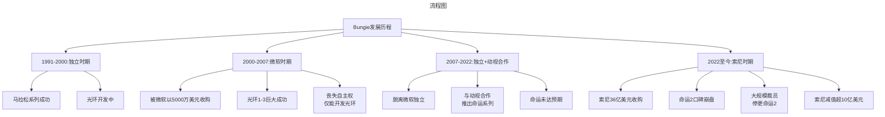
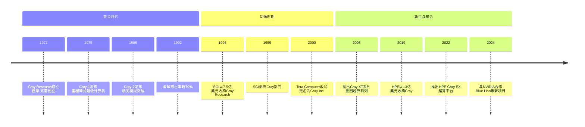

# 007 | Cray超级计算机与Bungie游戏公司的命运对比【更新版】

> **适用范围**：技术管理者、创业者、投资研究者、产品经理及对科技商业史感兴趣的读者；适用于战略复盘、案例研讨与决策参考场景。
>
> **更新摘要（v2 · 2026-08 更新）**：
> - 结构化升级为 6 节骨架（导言 / 核心方法论 / 关键流程 / 工具与实战 / 常见误区 / 进阶延展）
> - 保留全部原文 Mermaid 图、表格、数据与术语英文对照，并为 Mermaid 图补充 frontmatter 与图后解读
> - 将原「参考资料/附录」并入第 6 节「进阶延展」，便于延展阅读

## 1. 导言

### 引言：两条截然不同的"卖身"之路

在商业世界中，被收购往往是创业公司发展过程中的一个重要节点——有时是无奈之举，有时是战略选择，有时则是水到渠成的结果。今天我要讲述的两家公司——Cray（克雷）和Bungie——虽然处于完全不同的行业（前者是超级计算机制造商，后者是视频游戏开发商），但它们的经历都深刻地揭示了创业公司在面对"卖身"抉择时所需要考虑的战略因素。

Cray的故事是一部关于技术理想主义与现实商业压力碰撞的史诗：从辉煌的霸主地位到多次破产重组最终被HPE（Hewlett Packard Enterprise，慧与）收购。而Bungie的历程则是一段关于创意独立性与资本力量博弈的传奇：从微软的"金手铐"到索尼的36亿美元豪赌再到如今的裁员风波。

将这两个看似毫不相关的故事放在一起对比我们会发现一些令人深思的共同主题：**单一业务依赖的风险、创始人愿景与资本期望的冲突、以及在被大公司收购后如何保持创新活力。**

---

---

## 2. 核心方法论

### 第二部分：Bungie传奇——从独立工作室到微软再到索尼

#### 2.1 创始故事：一个人的游戏帝国

Bungie是一家总部位于西雅图地区贝尔维尤市的游戏公司如今全球最大的游戏工作室之一。

Bungie在国内玩家中知名度不高但是其开发的游戏大作《光环》（Halo）系列估计就有很多人熟悉了这款游戏在Xbox上首发并占据了极其重要的游戏地位。可以说正是这款游戏让Xbox的主机上终于有了一款在当时可以和索尼PlayStation 2竞争的扛鼎之作从此以后Xbox从可有可无的游戏平台走向了辉煌的主机巨头行列。而Bungie与其游戏的发行方或者说公司的收购方微软的分分合合也是Xbox发展史上浓墨重彩的一笔。

**Bungie最初是一个人的传奇故事。** 1991年在芝加哥大学就读的亚历克斯·瑟罗皮恩（Alex Seropian）创办了自己的游戏公司。其实在创办游戏公司之前他就已经自己开发仿制了当时非常流行的一款乒乓球类街机游戏奠定了自己的游戏开发之旅。

Bungie成立的1991年计算机还是个新事物美国的大部分大学还没有日后大红大紫的计算机科学系而计算机专业则依托于数学或者电子系下面。所以那个时候做软件开发尤其是游戏开发想要获得投资更是不易。

瑟罗皮恩在亲朋好友的帮助下自己组装硬件开发软件在游戏开发的道路上越走越远。不过他并没有赚到多少钱。据说是在上一门人工智能课程时瑟罗皮恩遇到了Bungie的第二名员工杰森·琼斯（Jason Jones）。

琼斯也是游戏的狂热爱好者。他完成了一款叫作Minotaur的角色扮演游戏这款游戏还运用了AppleTalk这种互联网联网协议使不同的用户可以通过"猫"实现互联。这款以Bungie公司名义发布的游戏尽管本身销量在当时并不可观但作为Bungie创立以来的第一桶金为这两位游戏的狂热爱好者开发下一款游戏提供了资金支持。

#### 2.2 从《马拉松》到《神话》：奠定射击游戏王者地位

当时射击游戏很流行因此瑟罗皮恩和琼斯的下一款游戏也转向了射击类这就是在Bungie历史上第一款广受赞誉的《黑暗之路》（Pathways into Darkness）。这款游戏的开发在很大程度上奠定了Bungie此后多年的游戏开发模式：专注于射击游戏的开发让其他人越来越难超越。

射击游戏并不罕见比如《毁灭战士》（DOOM）当时就很火。然而这些游戏的普遍特点就是为了射击而射击缺乏故事情节作支撑让人很难感受到游戏的乐趣。Bungie在这个时候推出了整个游戏历史上都要浓墨重彩记上一笔的《马拉松》（Marathon）系列的首款游戏。

和以往的射击游戏比起来《马拉松》的情节曲折连贯引人入胜。而那个早在其他游戏里就尝试采用过的AppleTalk也成为了这款游戏最为独特的一部分《马拉松》成了第一款可以在不同玩家之间联网和交互的射击游戏。这都让Bungie在众多游戏公司中迅速脱颖而出。

Bungie的《马拉松》迅速占领了市场。毕竟能够联网的射击游戏和不能够联网的射击游戏不可同日而语。

因为一望无际的好日子Bungie的境遇尤其是财务状况蒸蒸日上并且很快推出了《马拉松》的续集。

此时恰逢Windows 95降临的大潮头脑活络的Bungie把《马拉松》续集移植到了Windows上。而Windows市场的销量远远大于Mac市场这一波移植的成功让Bungie顿悟了"Windows才是未来"。

《马拉松》系列的新版本就在Windows和Mac上同步发行了。这几款《马拉松》游戏让Bungie在射击游戏领域一时声名鹊起并且有了源源不断的订单和滚滚金钱。

好日子仍然在延续而聪明的Bungie意识到应该新起一个系列了毕竟单靠啃《马拉松》系列的"老本"过活并不是公司长远发展的明智之举。

新游戏《神话》（Myth）应运而生这是一款策略游戏虽然很遗憾我没玩过但从游戏玩家论坛中仍然可以看到这款游戏当初是多么受欢迎。

《马拉松》和《神话》大获成功让Bungie一跃成为世界顶级的游戏工作室和发行厂商。这时Bungie再次回到了他们所擅长的射击游戏上来新的一款游戏被命名为《光环》（Halo）。这款游戏在未来的几年让Bungie获得了大量声誉但同时也带来了很多麻烦。

#### 2.3 《光环》与微软：一段爱恨交织的关系

**《光环》游戏最初于1999年宣布同年苹果公司CEO史蒂夫·乔布斯在Macworld Expo的Keynote上公开做了演示。** 这也是Bungie在苹果公司那边获得的最高规格待遇。

但是Bungie显然已经从Windows和Mac同步发行上尝到了很多好处《光环》最初的计划也是在Windows和Mac上同步发行这种"一鱼两吃"的做法Bungie已经驾轻就熟。

2000年6月Bungie在E3 2000上公开展示了《光环》获得了极大的好评。然而正当大家都在翘首期盼《光环》正式发行的时候出乎所有人意料微软宣布Bungie被他们收购了Bungie已经成为微软游戏分支的子企业。不久以后微软决定《光环》系列不在Windows和Mac中的任意一个平台发行其唯一发行平台是微软的新游戏主机Xbox。

有关这场收购背后的故事有很多版本。但目前来看比较靠谱的说法是《神话2》有一个巨大的Bug可以删除用户硬盘上的所有资料。所以Bungie被迫在发行前进行召回但这样一来就损失了几百万美元让Bungie陷入了财务危机。

而此时的微软正需要为它的新业务Xbox主机的发展寻找一款很好的游戏大作。相对于索尼这个历史悠久的主机PlayStation 2上大作频出的局面微软的Xbox当时要么是索尼的移植版要么就是不值一提的作品因此急需一款属于并且只属于Xbox的大作。

这样一来陷入财务危机的Bungie和需要大作的微软一拍即合微软买下了Bungie同时让《光环》成为了Xbox的专属游戏。然而收购价据说仅为5000万美元。

实际上早在推出《神话》系列的同时Bungie还成立了分支机构Bungie West。这个新成立的分支机构发行了一款叫作《奥尼》（Oni）的游戏。这款游戏算不上大红大紫加上游戏发行的时候Bungie被微软收购了因此最终没能够形成一个系列。

而作为并购的一部分微软同时也获得了《神话》系列和《奥尼》一半的版权。《奥尼》的开发在2001年结束以后就没再有续作了。整个Bungie工作室的重心从此转到了给Xbox开发《光环》系列上。这个转型也为以后Bungie和微软之间的分道扬镳埋下了伏笔。

#### 2.4 《光环》的辉煌与Bungie的失落

**《光环》系列的首作取得了极其巨大的成功发行量超过650万份市场反应热烈这是Bungie从未达到过的高度。** 当时微软的高层比尔·盖茨和鲍尔默都忍不住要让Bungie尽快开发《光环2》。

这里插一句考虑到这款游戏只在Xbox上发行倘若它能在更多平台发行的话数字可能更是无法想象。

我来西雅图以后正好认识了《光环》游戏系列的一位开发者在某次听他讲述这段工作经历时才得知《光环2》是整个系列里面开发最为辛苦的一版游戏：因为微软高层都对《光环2》的开发抱有很高的期望而《光环1》又给游戏开发设置了一个很高的标准这让《光环2》的开发一直不顺期间多次推倒重来。好在最后《光环2》不负众望地上市了并且因为和Xbox Live的对接获得了更大的成功。

Xbox Live是微软为Xbox主机创建的一个可以让全球各地的人联网战斗的平台。这个平台和以往联网游戏最大的不同是：以往的游戏往往都是在局域网内自行组团而Xbox Live则提供了一个全球统一的平台并且可以记录每个人自己的战绩和游戏历史还具有一定的社交功能。

Xbox Live和《光环2》的对接使得世界各地的《光环》爱好者们都可以在统一的平台上联网战斗分享游戏体验还可以看到排名等各种统计数据。因此世界各地的游戏爱好者蜂拥而至非常踊跃地参与进来。

《光环2》达到了一个新的高度。《光环》系列从此不再只是一款简单的射击游戏还是一个社交平台。全世界的《光环》玩家都可以共享游戏体验。因为《光环2》的发行Xbox的销量也迅猛增长。游戏带动主机的销售这就是微软一直期盼的大作效应。

2007年发行的《光环3》让这款游戏更上一层楼。为此Bungie还给《光环》系列发行了两个资料片。

#### 2.5 分道扬镳：Bungie离开微软

**但是《光环3》发行没多久Bungie就和微软同时宣布拆分Bungie脱离微软成为一家独立的公司而《光环》系列的所有知识产权归属于微软。** 作为拆分计划的一部分微软于同年成立了343 Industries工作室替代Bungie制作和发行《光环》系列。《光环4》和《光环5》都是由这个工作室制作的。

若说当初的收购还有迹可循这次拆分的缘由就一直不太明朗了。一直到十年后的今天也没有多少资料公开谈论这次拆分。Bungie和微软的合作延续到了2010年《光环3》第二部资料片的发布。

我和那个开发《光环》的工程师聊天时感觉到在被微软收购的那几年里公司的一切事务都围绕着《光环》系列进行这让整个工作室都有点茫然失措。按道理微软的收购很大程度上给Bungie提供了丰富的资源这才使得《光环》系列获得了如此巨大的成功。

但是与此同时Bungie丧失了自主权和独立性。Bungie存在的作用对于微软来说就是开发《光环》系列。在被微软收购后的那些日子里除去《光环》系列Bungie竟然没有能够开发出任何一款新游戏。这对于Bungie的游戏开发者来说肯定不是多么愉悦的事情。

更重要的是游戏工作室讲究独立性微软本身则越来越官僚两者之间难免会在文化上有很多冲突这种冲突可能可以控制在比较好的范围内也可能会导致很多的问题。

我想到了后期Bungie自己想做的事情和微软需要它们做的事情两者之间不仅仅没法沟通和妥协很可能微软连听都懒得听Bungie的想法了吧。2007年的微软是官僚主义很盛行的时候。

坊间另外一个传闻是5000万的价格收购Bungie微软多少有些趁Bungie财务危机之虚而进入的嫌疑。这笔钱从今天来看显然是便宜了。而连续不断地让Bungie只为Xbox开发《光环》系列可能更是让Bungie觉得在微软下面毫无发展空间可言并最终走上拆分之路。

#### 2.6 独立岁月与动视合作：《命运》的野心

拆分以后的Bungie继续扩张并把新的总部设置在了贝尔维尤市中心。然后它与全球知名的游戏制作和发行厂商动视暴雪（Activision Blizzard）展开合作由后者替其出版发行下一款游戏大作《命运》（Destiny）。Bungie新发行的游戏《命运》是其独立以后的第一个游戏系列但是无论人气还是名气都远远未能达到《光环》系列的标准。

可以确定的是离开微软之后Bungie未来的路会更加艰难。拆分十年过去了现在的《命运》系列依旧无法和《光环》系列相比。它始终没能够像《光环》系列那样万众瞩目受到玩家的极力追捧在销量上也未能和《光环》系列媲美。

#### 2.7 索尼的36亿美元赌注：一场昂贵的教训

**2022年1月索尼互动娱乐（Sony Interactive Entertainment）宣布以36亿美元的价格收购Bungie[来源6][来源7][来源8]。** 当时这笔交易被广泛视为索尼对抗微软（刚宣布对动视暴雪的收购）和谷歌（拥有Stadia云游戏平台）在游戏领域扩张的重要举措。

**索尼收购Bungie的战略逻辑**：
看中的是它作为"服务型游戏（Games as a Service, GaaS）总教头"的能力——当时PlayStation正全力押注实时服务游戏计划几年内从1款扩展到12款而Bungie手里握着运营多年的《命运》系列既能自证其长线运营实力又能传授经验给索尼内部的工作室。

然而此后的发展却令索尼大跌眼镜：

**2023年：《光陨之秋》口碑崩盘**

2023年2月Bungie发布了《命运2》的最新资料片《光陨之秋》（Lightfall）但这款作品遭遇了口碑和销量的双重滑铁卢[来源2][来源3]：
- 玩家批评剧情空洞、玩法单调、定价过高。
- Metacritic用户评分创下系列新低。
- 活跃玩家数量大幅下滑。

**2024年：裁员风暴与《命运2》停更**

更严峻的危机在2024年爆发：
- Bungie宣布《命运2》停止大规模内容更新转入"维护模式"[来源2]。
- 公司进行了大规模裁员近半员工被裁减[来源2]。
- 索尼在财报中对Bungie计入了约165亿日元（约1亿美元）的资产减值[来源3]。

媒体用"240亿打水漂？"来形容这笔交易的惨淡结局[来源2]。从36亿美元的收购价到累计减值超过10亿美元再加上持续的经营亏损索尼在这笔投资上可谓损失惨重。

**失败原因分析**：

1. **过度依赖单一IP**：与微软时代的《光环》困境类似Bungie再次陷入了"一条腿走路"的陷阱过度依赖《命运》系列而新IP开发进展缓慢。
2. **人才流失**：被收购后多位核心开发者离职包括联合创始人Jason Jones的参与度下降。
3. **文化冲突**：Bungie的独立创作文化与索尼的 corporate（企业化）管理风格产生摩擦。
4. **服务型游戏市场竞争加剧**：《堡垒之夜》、《Apex英雄》、《原神》等服务型游戏抢走了大量玩家时间和注意力。
5. **执行能力不足**：《命运2》后续内容质量不稳定未能维持玩家的长期 engagement（参与度）。

> 上图展示了关键节点与演进路径，结合正文时间线可直观把握事件因果与战略转折。

---

---

### 第三部分："卖身"须谨慎——创业公司的战略抉择

#### 3.1 为什么创业公司要考虑"卖身"?

在讨论Bungie的经历之前我想先聊聊一个更宏观的话题：创业公司在什么情况下应该考虑出售或被收购？

**常见的"卖身"原因**：
1. **财务压力**：如Bungie因《神话2》召回事件陷入财务危机。
2. **战略互补**：被收购后可以获得更大的平台、更多的资源和更广的分发渠道。
3. **创始人退出**：创始人希望套现退休或开启新的创业项目。
4. **行业整合**：所在行业正在进行并购整合不加入就可能被淘汰。
5. **防御性出售**：与其被竞争对手收购不如选择一个更"友好"的买家。

#### 3.2 "卖身"的风险

然而"卖身"并非没有风险从Cray和Bungie的经历我们可以总结出以下风险：

**风险一：丧失自主权**
被收购后创业公司往往需要服从母公司的整体战略这可能限制了其原有的创新方向和发展空间。Bungie在微软期间除了《光环》无法开发其他游戏就是典型的例子。

**风险二：文化冲突**
大公司的流程、制度和文化可能与创业公司的快速灵活风格格格不入。当文化冲突无法调和时就可能导致核心人才流失项目延期甚至失败。

**风险三：估值偏差**
收购价可能高于或低于公司的实际价值。如果高于（如索尼收购Bungie的36亿美元）母公司可能会有过高的业绩期望导致被收购方承受巨大压力。如果低于（如微软收购Bungie的5000万美元）创始人可能会感到后悔和不满。

**风险四：整合失败**
许多收购最终失败是因为整合不力。产品线重叠、团队摩擦、系统不兼容等问题都可能导致协同效应无法实现。

**风险五："金手铐"效应**
收购协议通常包含数年的留任奖金和竞业禁止条款这使得核心员工虽然获得了经济回报但也失去了在一定时间内自由选择职业的机会。

#### 3.3 如何做出明智的"卖身"决策?

如果你是创业公司的创始人或CEO面临收购邀约时建议从以下几个维度进行评估：

**维度一：战略契合度**
收购方的战略目标是否与你公司的愿景一致？收购后你的公司将扮演什么角色？是独立运营还是被整合？

**维度二：文化匹配度**
收购方的企业文化是否与你的团队兼容？你是否愿意在这种文化下工作？你的关键员工怎么看？

**维度三：估值合理性**
收购价格是否反映了公司的真实价值（包括现有业务和未来潜力）？支付方式（现金/股票/混合）是否符合你的需求？

**维度四：自主权保障**
收购协议中是否保留了足够的自主权？你能否继续按照自己的理念经营公司？决策权如何分配？

**维度五：退出选项**
如果收购后情况不如预期你有哪些退出选项？是否有过错卖出（Reverse Termination）条款？竞业禁止的范围和期限是什么？

**维度六：员工利益**
收购对你的员工意味着什么？会有裁员吗？薪酬福利会变化吗？关键人才的 retention（保留）方案是什么？

---

---

## 3. 关键流程

（本节内容在原文中较为简略，可结合第 2、3、4 节相关段落交叉理解。）

---

## 4. 工具与实战

### 第四部分：深度对比——Cray vs Bungie的命运异同

#### 4.1 相同点

| 维度 | Cray | Bungie |
|------|------|--------|
| **创始人的技术理想主义** | 西摩·克雷追求极致计算性能不顾商业现实 | Bungie追求游戏艺术性和创新性不愿妥协 |
| **"一条腿走路"的风险** | 只做超级计算机市场狭窄 | 过度依赖单一IP（《光环》/《命运》） |
| **多次易主的经历** | CDC→Cray Research→SGI→Tera→HPE | 独立→微软→独立→索尼 |
| **被收购后的文化冲突** | 与SGI基因不合 | 与微软/索尼的管理风格冲突 |
| **技术创新能力** | 始终保持技术领先 | 游戏设计和引擎技术一流 |

#### 4.2 不同点

| 维度 | Cray | Bungie |
|------|------|--------|
| **行业特性** | B2G/B2R（政府/科研）小众市场 | B2C（消费者）大众市场 |
| **收购价格趋势** | 稳步上升（7.5亿→13亿） | 大幅上升（5000万→36亿） |
| **当前状态** | 在HPE旗下稳定发展 | 在索尼旗下陷入困境 |
| **核心矛盾** | 技术理想 vs 商业可持续性 | 创意独立 vs 资本期望 |
| **最终归宿** | 成为大型科技公司的产品线 | 仍不确定可能进一步重组 |

#### 4.3 启示录

通过Cray和Bungie的对比我们可以得出以下启示：

**启示一：多元化是生存之本**
无论是Cray还是Bungie都曾因过度依赖单一产品或单一市场而陷入困境。对于创业公司而言在核心业务稳健发展的同时适度探索第二曲线是必要的。

**启示二：被收购不是终点而是新的起点**
很多创业者将被收购视为"终点"或"退出"但实际上被收购后如何在新体系中发挥作用、保持创新能力才是真正的挑战。Cray在HPE旗下找到了新的定位而Bungie在索尼旗下仍在挣扎。

**启示三：创始人的角色需要重新定义**
被收购后创始人需要从"独裁者"转变为"协作者"或"内部创业者"。能够适应这种角色转变的人才能在新环境中继续创造价值否则就会像Bungie的核心成员一样选择离开。

**启示四：IP（知识产权）的价值与诅咒**
Bungie的《光环》和《命运》IP既是其最大的财富也是其最大的枷锁。过度依赖知名IP可能导致创新惰性而完全放弃IP又可能失去市场认知度。如何在"延续经典"和"开拓创新"之间找到平衡是每个内容创作者面临的永恒难题。

---

---

## 5. 常见误区

### 第一部分：Cray沉浮录——超级计算机之王的兴衰

#### 1.1 西摩·克雷与超级计算机的黄金时代

互联网行业的发展如此迅猛很多曾经鼎鼎大名的企业如今都默默无闻了在西雅图的克雷公司（Cray）就是这样一家企业。

克雷公司以超级计算机之父西摩·克雷（Seymour Cray）的名字命名它是做超级计算机的在今天全球前400名的超级计算机里大概占据了60%的份额。这个数字大致上可以说明在超级计算机领域克雷公司的地位。

但是现在使用计算机的主流方式已经从一台超级计算机过渡到了无数多台普通计算机构成的数据中心联合工作的方式。因此超级计算机已然是一个小众市场而克雷公司是小众市场里面举足轻重的公司。

克雷公司自从成立以后曾经在西雅图鼎鼎大名但其后续发展可谓命途多舛经历了很多次破产和合并。

最初这家公司全称叫作克雷研究公司（Cray Research）是"超级计算机之父"西摩·克雷创建的第二家公司。克雷研究公司主要研发基于集成电路的超级计算机。这之前西摩·克雷创建了控制数据公司即CDC（Control Data Corporation）。克雷在CDC公司里面研发基于晶体管的超级计算机代表系列有CDC 600、CDC 7600等。

20世纪60年代末70年代初正是从晶体管走向集成电路的时候。半导体集成电路的发明给计算机产业带来了一场前所未有的变革这种变革连发明了集成电路的仙童公司也没有预见到。

然而克雷预见到了这个变化。克雷创立的克雷研究公司成为了第一家使用集成电路研发超级计算机的公司。当时仙童公司亟需证明集成电路有着广大的市场并因为看到克雷的CDC公司曾经在晶体管超级计算机上取得巨大成功决定和他合作。

整个合作计划里克雷研究公司专门从事超级计算机的设计和研发而仙童公司则给他们提供专门设计的集成电路。克雷需要什么仙童公司就给设计什么。两者的结合让著名的新型超级计算机Cray-1得以面世。

#### 1.2 Cray-1：计算机史上的里程碑

**Cray-1是在整个计算机发展史上具有里程碑意义的超级计算机。** 它第一次使用了集成电路重量轻到只有5吨；而克雷的设计也非常优雅。在1975年Cray-1发布的时候作为超级计算机市场上的唯一重量级对手IBM被耍得连边儿都找不到了。1975年这可能也是克雷研究公司最具有历史意义的时刻。

因为这个计算机实在是太牛太强大了订单纷纷到来。而订单带来的资金又让克雷研究公司的研发得以顺利开展下去。

克雷研究公司做的计算机越来越厉害10年后的1985年它们发布了Cray-2。Cray-2的计算能力使得美国国家航天局第一次可以进行航天飞机的模拟风洞试验。而这之前因为计算机计算能力的限制人类一直没有办法做这么大规模的计算。

由于克雷研究公司在技术上如此领先对手们与它之间的差距非常巨大。此时全球在用的超级计算机的70%以上都是克雷研究公司研发的IBM、NEC等竞争对手只能瓜分剩余的30%的市场。那个时候的克雷研究公司无疑非常辉煌。

> 上图展示了关键节点与演进路径，结合正文时间线可直观把握事件因果与战略转折。

#### 1.3 战略失误：错失个人计算机革命

然而超级计算机有一个巨大的问题：它的计算能力很强性价比却不高。占计算机市场大部分的企业和个人并不需要如此强大的计算能力。换句话说他们不愿意花冤枉钱买超级计算机。

进入20世纪80年代以苹果和IBM为首的个人计算机发展得如火如荼个人计算机的计算能力没有超级计算机那么强但是大部分需要计算机的个人和企业花更便宜的价格买个人计算机也够用了。

**而克雷研究公司并没有预见到这种变化可能给自身带来的影响准备相当不足。** 克雷研究公司继续投入钱和人力研发新一代的超级计算机Cray-3却没有投钱进军个人计算机市场。

当新一代超级计算机Cray-3研制成功以后克雷研究公司发现几乎没什么人理睬。那些买了Cray-1和Cray-2的人不需要新的计算机而其他人则不需要那么快那么贵的计算机。Cray-3和前两款机型相比在商业上只能用惨败来形容。

和如火如荼不断发展的个人计算机市场比起来Cray-3的惨败让新公司的管理层和克雷之间进一步产生了分歧。公司管理层认为应该进入个人计算机市场而不是继续研究更快更强的新一代计算机而克雷则坚持研究新的Cray-4计算机不管商业上是否有前景公司是不是能从新型超级计算机里面盈利。

这直接导致了克雷离开克雷研究公司。克雷又创建了新的公司但不久就在一场车祸中去世。而那个克雷离开后的克雷研究公司在经历了Cray-1和Cray-2的辉煌以及Cray-3的惨淡之后既没有克雷这样的天才来支撑研发又没能够在个人计算机市场上有所斩获慢慢地开始衰落。

#### 1.4 多次易主：从SGI到Tera再到HPE

**1996年12月SGI以7.5亿美元的价格买下了克雷研究公司。** 但是很不幸这次合并一开始就不被人看好。SGI以图形工作站闻名而克雷研究公司则擅长搞超级计算机两者的基因并不是特别吻合。没有人知道为什么在那个时间点SGI要买下已经没有了克雷又不断走下坡路的克雷研究公司。

SGI在经过了若干次尝试以后于1999年把克雷研究公司作为独立的部门剥离出来。此后成立于1987年同样主要从事超级计算机研发的Tera Computer公司在2000年买下这个部门并将自己改名为Cray即克雷公司。

在整合了克雷研究公司的相关技术之后克雷公司一直在推出自己的超级计算机但是超级计算机在今天已经是一个非常非常小的市场主要服务于研究机构、航空航天、军队等需要超级计算能力的地方。

无论如何"克雷"作为一个品牌还是存活了下来。

#### 1.5 HPE时代：AI驱动的新机遇

**2019年5月HPE宣布以13亿美元的价格收购Cray[来源4]。** 这一价格相当于每股35美元比Cray当时的收盘价溢价17%。这是HPE在超算领域的一次重要布局旨在加强其在高性能计算（High Performance Computing, HPC）市场的地位。

收购完成后Cray成为HPE旗下的HPE Cray品牌继续专注于超级计算机的研发和销售。HPE将Cray的技术与其自身的HPC产品线进行整合形成了更加完整的产品组合：

**HPE Cray EX超级计算机系统**
这是HPE Cray的旗舰产品线采用模块化设计可以根据客户需求灵活扩展。该系统已被全球多个顶级科研机构和政府采用包括：
- 美国能源部的多个国家实验室
- 欧洲的气象预报中心
- 日本的RIKEN研究所
- 中国的部分超算中心

**与NVIDIA的战略合作**

在人工智能（AI）浪潮的推动下超级计算机正在经历一次新的复兴。传统的科学计算（如气候模拟、核武器研发、药物发现）与AI工作负载（如大语言模型训练、深度学习推理）开始融合这为Cray带来了新的增长机会。

HPE Cray与NVIDIA建立了深度的战略合作关系共同打造新一代AI超级计算机[来源1][来源3][来源5]：

- **Venado超级计算机**：由洛斯阿拉莫斯国家实验室（Los Alamos National Laboratory）与HPE和Nvidia合作推出采用HPE Cray EX架构和Nvidia GH200 Grace Hopper Superchip（超级芯片）技术拥有2560个节点专为AI和科学计算的混合工作负载设计[来源5]。
- **Blue Lion超级计算机**：NVIDIA和HPE在德国汉堡宣布将与德国莱布尼茨超级计算中心合作共同打造名为Blue Lion的新型超级计算机其计算能力将比目前的系统大幅提升[来源1]。
- **Cray Supercomputing GX5000平台**：HPE于2024年11月宣布为其Cray超算平台扩展产品组合发布搭载英伟达和AMD的2026年芯片的处理刀片[来源3]。

这些项目表明Cray品牌在HPE旗下不仅得以保留而且正在AI时代焕发新的生机。

#### 1.6 "一条腿走路"的隐忧

回顾Cray的历史我们可以清晰地看到"单一化"或"一条腿走路"战略的巨大风险：

**什么是"一条腿走路"？**
指公司将全部或绝大部分资源投入到单一产品线或单一市场中缺乏多元化布局一旦该市场发生变化公司将面临生存危机。

**Cray的"一条腿走路"表现**：
1. **单一产品依赖**：只做超级计算机不做其他类型的计算设备。
2. **单一客户群体**：主要服务于政府和学术机构企业客户很少。
3. **单一技术应用**：专注于极致的计算性能忽视成本效益和易用性。
4. **拒绝市场扩张**：西摩·克雷坚持认为应该继续追求更快更强的超级计算机而不愿意进入利润丰厚但"不够酷"的个人计算机市场。

**后果**：
- 当个人计算机崛起时Cray无法分享这一增长红利。
- 当分布式计算和云计算兴起时Cray的传统集中式超算模式受到挑战。
- 公司多次陷入财务困境不得不通过出售来维持生存。

这个教训对于今天的初创公司依然具有强烈的警示意义：**即使你在自己的领域做到了世界第一如果这个领域的市场规模有限或者正在萎缩你仍然可能面临生存危机。**

---

---

## 6. 进阶延展

### 五、结语：命运的岔路口

截至2024年Cray和Bungie这两家有着截然不同命运的公司都在书写着各自的新篇章：

**Cray**在HPE的庇护下似乎找到了相对稳定的位置。AI浪潮的兴起为超级计算机带来了新的需求HPE Cray与NVIDIA的合作项目（如Venado、Blue Lion）显示这个老牌品牌仍有技术竞争力。虽然不再是独立的上市公司但Cray的品牌和技术遗产得以延续这对于一个经历过多次生死存亡的公司来说已经是不错的结局。

**Bungie**的情况则复杂得多。36亿美元的收购价、逾亿美元的减值、近半员工的裁员、《命运2》的停更……这一系列事件构成了一个关于"高价收购陷阱"的经典案例。索尼当初看中的"GaaS总教头"能力似乎并未如期兑现Bungie反而成为了财报上的"负资产"。未来Bungie何去何从是被进一步整合进PlayStation Studios还是被再次出售抑或是通过某种方式恢复独立都还是未知数。

**最后留给你一个问题**：

如果你是Bungie的创始人在2000年面对微软的5000万收购邀约你会接受吗？在2007年你会选择离开微软吗？在2022年面对索尼的36亿美元报价你又会如何决定？

如果你是Cray的西摩·克雷在1980年代面对个人计算机的兴起你会坚持做超级计算机还是会 diversify（多元化）进入消费级市场？

这些问题的答案或许没有对错之分但思考这些问题的过程本身就能让我们对企业战略、创业精神和商业本质有更深刻的理解。

---

---

### 参考资料来源

1. 头条号：《NVIDIA 和慧与联手在德国建造先进的超级计算机》（http://m.toutiao.com/group/7514352539949662771）
2. 头条号：《240亿打水漂?《命运2》正式停更Bungie裁员近半索尼这波亏麻了》（http://m.toutiao.com/group/7643022215381795378）
3. 头条号：《基于英伟达、AMD明年芯片HPE发布新一代Cray刀片服务器》（http://m.toutiao.com/group/7573546794550968867）
4. 搜狐网：《HPE以13亿美元价格收购超级计算机制造商Cray》（https://m.sohu.com/a/315013703_120044112）
5. 头条号：《洛斯阿拉莫斯国家实验室与HPE和Nvidia合作推出Venado超级计算机》（http://m.toutiao.com/group/7358333090474918434）
6. 头条号：《终于出手了!索尼官宣36亿美元收购游戏制作商Bungie》（http://m.toutiao.com/group/7059521835225842206）
7. 头条号：《游戏圈又迎重要收购索尼将以36亿美元价格收购命运系列游戏》（http://m.toutiao.com/group/7059609360225600014）
8. 头条号：《索尼36亿美元收购Bungie累计减值超10亿命运2为何停更》（http://m.toutiao.com/group/7643350120066662966）
9. 网易新闻：《HPE为什么今年大涨超80%?空间几何?》（http://m.163.com/dy/article/KUC159EF05568W0A.html）
10. Top500.org全球超级计算机排名网站
11. HPE官方网站投资者关系页面及Cray产品文档
12. 索尼互动娱乐官方新闻稿及财报电话会议记录

---

*本文基于2017年四篇原作《克雷公司沉浮录：行走在超级计算机市场》、"'单一化'的隐忧：从克雷公司看'一条腿走路'"、《Halo的开发者Bungie：与微软的聚散》、"'卖身'须谨慎：创业公司面临的抉择》合并更新新增Cray被HPE收购后发展、NVIDIA合作、Bungie被索尼收购及裁员风波等内容信息截止日期为2024年6月7日。*

---

*v2 结构化升级版 · 文件名保持不变：005-Cray超级计算机与Bungie游戏公司的命运对比-【更新版】.md*