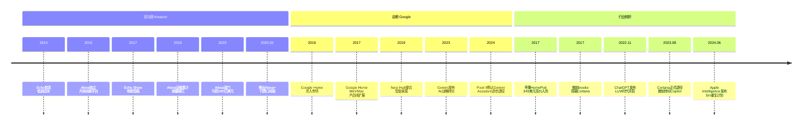
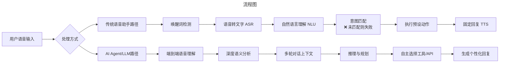
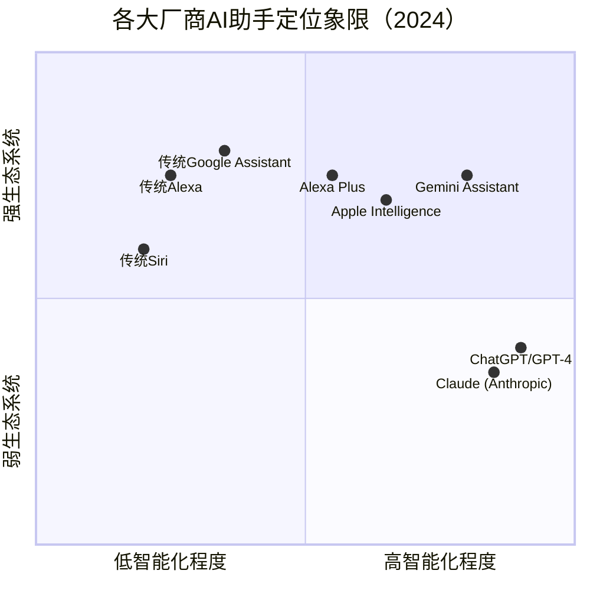

# 引言：从"无心插柳"到"生死存亡"——一个产品的十年浮沉

> **适用范围**：技术管理者、创业者、投资研究者、产品经理及对科技商业史感兴趣的读者；适用于战略复盘、案例研讨与决策参考场景。
>
> **更新摘要（v2 · 2026-08 更新）**：
> - 结构化升级为 6 节骨架（导言 / 核心方法论 / 关键流程 / 工具与实战 / 常见误区 / 进阶延展）
> - 保留全部原文 Mermaid 图、表格、数据与术语英文对照，并为 Mermaid 图补充 frontmatter 与图后解读
> - 将原「参考资料/附录」并入第 6 节「进阶延展」，便于延展阅读

## 1. 导言

2014年11月，当亚马逊（Amazon）悄悄向Prime会员推送一款名为Echo的圆柱形智能音箱时，没有人预料到这会成为科技史上最具戏剧性的产品故事之一。这款最初被列为低优先级、代号为"项目D"的产品，不仅意外引爆了整个智能音箱市场，更让亚马逊在语音交互领域占据了先发优势。然而十年后的今天，当ChatGPT（由OpenAI开发的生成式预训练转换器）以摧枯拉朽之势重塑人工智能格局时，曾经风光无限的Alexa语音助手却陷入了前所未有的困境——年亏损超100亿美元、大规模裁员、被迫推出付费订阅版本。

这是一个关于技术创新、市场机遇与范式转移的故事。它告诉我们：**在技术革命的浪潮中，今天的颠覆者可能就是明天的被颠覆者；而真正的挑战不在于你是否抓住了第一个机会，而在于当游戏规则改变时，你能否及时转身。**

本文将深入剖析Echo与Alexa从崛起到困境的完整历程，探讨大语言模型（Large Language Model, LLM）如何从根本上改变了语音助手的竞争规则，以及亚马逊正在进行的AI Agent（人工智能代理）转型能否让Alexa重获新生。

> 上图展示了关键节点与演进路径，结合正文时间线可直观把握事件因果与战略转折。

---

## 2. 核心方法论

### 二、转折点（2020-2022）：疫情红利与隐忧浮现

#### 2.1 疫情推动的最后一次增长

2020年新冠疫情爆发，全球 lockdown（封锁）措施让居家时间大幅增加，智能音箱迎来了意外的增长窗口。根据Canalys数据，**2020年全球智能音箱出货量同比增长13%**，突破1.5亿台。亚马逊Echo系列设备累计销量在这一年突破了1亿台大关。

疫情期间，智能音箱的使用场景得到极大拓展：
- **在线教育**：家长通过音箱查询课程安排、设置提醒
- **居家办公**：语音控制会议日程、播放背景音乐
- **娱乐需求激增**：音乐播放、有声书、播客等使用频率飙升

然而，这次增长更像是一次性的"回光返照"，而非可持续的趋势。疫情掩盖了智能音箱行业深层次的问题。

#### 2.2 市场饱和的信号

进入2021年后，增长势头明显放缓：

**中国市场率先衰退：**
- 2021年：销量开始下滑
- 2022年：全年销量仅2631万台，**同比下降28%**（来源：RUNTO）
- 2023-2024年：持续萎缩，2024年销量仅1570万台，**同比下降25.6%**，连续四年衰退（来源：RUNTO）

**全球市场同步放缓：**
- 2022年全球智能音箱市场规模55.7亿美元，同比仅增长8.3%（来源：市场研究报告）
- 主要市场（北美、欧洲）渗透率趋于饱和
- 用户活跃度下降：许多设备沦为"高级闹钟"

更深层的危机在于：**用户发现传统语音助手的能力边界远比想象中狭窄**。

#### 2.3 传统语音助手的根本性缺陷

在ChatGPT出现之前，Alexa、Google Assistant、Siri等语音助手已经暴露出系统性问题：

**1. 理解能力有限**
- 只能处理预设的指令模式
- 无法理解复杂语境和多轮对话
- 经常出现"我不明白您的意思"的尴尬回应

**2. 缺乏真正智能**
- 本质上是"关键词匹配 + 预设回复"系统
- 无法进行推理、创作或提供个性化建议
- 回答问题依赖预先编制的知识库，时效性差

**3. 生态割裂**
- 不同平台的技能/应用互不兼容
- 开发者需要为每个平台单独适配
- 用户体验碎片化

**4. 商业模式不清**
- 硬件销售利润微薄
- 通过音箱促成的购物转化率低于预期
- 技能平台的开发者难以盈利

这些问题在当时看来似乎是"技术演进中的阶段性挑战"，但2022年底ChatGPT的出现彻底改变了一切。

---

### 三、颠覆时刻（2023-2024）：LLM降维打击

#### 3.1 ChatGPT：游戏规则改变者

2022年11月30日，OpenAI发布ChatGPT，标志着**大语言模型（LLM）时代正式到来**。这款产品在两个月内达成月活用户1亿的纪录，成为历史上增长最快的消费级应用。

与传统语音助手相比，ChatGPT展现出的能力堪称**降维打击**：

| 能力维度 | 传统语音助手（Alexa/Siri） | 大语言模型（ChatGPT/GPT-4） |
|---------|---------------------------|---------------------------|
| 自然语言理解 | 关键词匹配，指令式 | 深度语义理解，对话式 |
| 多轮对话 | 上下文记忆有限 | 长程上下文，连贯对话 |
| 知识问答 | 预设知识库，更新慢 | 实时训练，知识广博 |
| 创作能力 | 几乎没有 | 文章、代码、诗歌等 |
| 推理能力 | 简单逻辑 | 复杂推理链 |
| 个性化 | 基础偏好设置 | 深度定制，角色扮演 |
| 学习能力 | 人工更新 | 持续学习优化 |

用户很快发现：**同样一个问题，问ChatGPT得到的回答远比问Alexa有用得多**。这种体验差距是质的飞跃，而非量的积累。

#### 3.2 亚马逊的危机：100亿美元的亏损

面对LLM浪潮，亚马逊的反应显得迟缓而被动。更严峻的是财务压力逐渐浮出水面：

**Alexa部门的巨额亏损：**
- 2022年，Alexa部门**亏损高达100亿美元**（来源：Business Insider、腾讯新闻等多方报道）
- 这是亚马逊内部亏损最严重的业务单元之一
- 即使考虑到研发投入，这个数字仍令人震惊

**大规模裁员：**
- 2023年初：亚马逊启动公司史上最大规模裁员，**裁员1.8万人**
- 2023年底：Alexa部门再次**裁掉数百名员工**
- 许多核心工程师和研究人员离职

**为什么亏损如此严重？**

1. **硬件补贴**：Echo设备长期低价销售，利润微薄甚至亏本
2. **基础设施成本**：语音处理需要大量云计算资源
3. **人才成本**：维持庞大的研发团队
4. **生态投入**：补贴开发者、推广技能平台
5. **收入不及预期**：通过语音购物的转化率远低于手机App

更致命的是：**在LLM时代，传统语音助手的技术架构显得过时**。Alexa基于规则和机器学习的混合系统，在面对GPT-4这样的Transformer架构时，竞争力骤降。

#### 3.3 亚马逊的应对：Alexa Plus与AI重组

2024年，亚马逊开始采取紧急应对措施：

**推出Alexa+（Alexa Plus）付费版（2025年2月发布）：**
- 月费**19.99美元**（Prime会员免费使用）
- 集成更先进的AI能力
- 提供个性化对话、复杂任务处理等高级功能
- 标志着语音助手从"免费增值"转向"订阅制"商业模式

**技术重组：**
- 加速内部大语言模型研发（代号"Olympus"等项目）
- 收购或投资AI初创公司
- 将AWS（亚马逊云服务）的AI能力引入Alexa

**战略调整：**
- 从"语音助手"重新定位为"AI Agent"
- 强调自主任务执行能力（如预订餐厅、规划行程）
- 与OpenAI、Anthropic等建立合作关系

然而，这些措施能否挽救Alexa的颓势仍是未知数。毕竟，**当用户习惯了ChatGPT级别的智能体验，很难再回到"设定闹钟、播放音乐"的基础功能**。

---

## 3. 关键流程

### 一、黄金时代（2014-2019）：Echo的崛起与百箱大战

#### 1.1 Fire Phone的失败，Echo的契机

智能音箱Echo是一个自2011年起就一直存在的研发项目，但优先级一直很低。在亚马逊神秘的硬件研发团队Lab126内部，各个项目用代号指代：A是Kindle电子书，B是Fire Phone（亚马逊智能手机），C是一款AR/VR相关产品，D则是当时默默无闻、如今却大红大紫的智能音箱Echo。

据后来披露的材料显示，代号C的产品与Fire Phone高度关联。随着Fire Phone在2014年的惨败——这款被寄予厚望的手机仅上市数月就宣告失败，导致Lab126士气低迷，大量项目被砍——"硕果仅存"的项目D意外获得了试水的机会。大约在Fire Phone失败半年后，Echo定型并决定发布。

吸取了Fire Phone高调发布却惨败的教训，也或许是因为亚马逊自己心底没底，Echo的发布极其低调：仅通过Prime会员推送信息，库存量也很小。然而，这款产品却带来了意外之喜。

#### 1.2 为什么Echo能够一炮而红？

Echo的成功可以归结为四个关键因素：

**第一，过硬的硬件品质。** 作为一款音箱，Echo把分内事做得很好——音质达到专业级入门水准，对于一般用户绰绰有余。199美元的定价与市面入门级专业音箱持平，但功能却丰富得多。

**第二，创新的语音交互体验。** Echo没有屏幕或键盘，唯一的交互途径就是语音。这种前所未有的交流方式让用户眼前一亮：当大家忙于手头事情、不方便操作手机时，可以方便地与音箱交互。它可以播放音乐、设定闹钟、控制智能家居设备等。

**第三，高冷的外观设计。** Echo最初的外形和颜色显得比较"高冷"，后来的调查显示这种设计反而促进了一部分人的购买欲，让它看起来像一件精致的家居装饰品而非电子设备。

**第四，亚马逊的市场反应能力。** 当Echo销量蹭蹭往上涨时，亚马逊迅速加大研发和宣传投入，加班加点占领市场。这种忠于市场真实反应的能力，不是一般互联网公司具备的。

2015年，亚马逊卖出超过250万只Echo；2016年这个数字翻倍至500万只。短短两年时间，Echo把市面上入门级专业音箱打得落花流水，各种品牌被扫地出门。专业音箱厂商只能蜷缩在高端市场，而高端市场的总量远无法与入门级市场相比。

#### 1.3 从音箱到平台：Alexa的战略转型

Echo上市约10个月后，亚马逊意识到语音助手可以作为独立的云服务存在，不必捆绑于Echo硬件。于是，那个原本叫"Echo"的语音助手被改名为**Alexa**（这个名字原本属于亚马逊旗下的网站分析工具，算是"鸠占鹊巢"，此后再无人记得那个曾经的工具）。

为保证向后兼容，提醒词"Hello Echo"依然保留，但从命名变迁中我们可以看到亚马逊的战略重心转移：**从硬件转向软件和平台**。

为了打造强大的Alexa，亚马逊展开了疯狂的人才与技术收购：
- **挖角Nuance**：高价搜罗这家老牌语音处理公司的核心人员
- **收购Yap和Evi**：两家语音技术创业公司迅速并入亚马逊麾下

在技术层面，Echo面临的最大挑战是**嘈杂环境下的语音识别**。聚餐、舞会等场景存在大量背景噪音，如何准确识别用户的语音命令？负责Alexa业务的首席科学家罗希特·普拉萨德（Rohit Prasad）曾透露，这个问题一度导致Echo项目搁浅，最后不得不在全公司范围寻求帮助。

解决方案是**机器学习**。亚马逊公开过对比音频：经过机器学习处理的音频达到了近乎完美的噪音过滤效果。这让Echo即使在极度嘈杂的环境中也能保持出色的语音识别能力——这是Echo脱颖而出的核心技术优势之一。

#### 1.4 开放生态：技能平台的威力

2015年上半年，向来封闭的亚马逊做出了一个关键决策：**开放第三方技能平台**。

所谓"技能"（Skills），是指第三方厂商可以通过开发插件的方式将自己支持的功能接入Echo。例如：
- Uber开发打车技能，用户可通过Echo叫车
- 飞利浦将智能家电接入，实现语音控制灯光、电器
- 各种智能家居品牌纷纷加入，开锁、开关窗帘等功能层出不穷

时至今日，Alexa技能平台的技能数量已达**10万+量级**。更重要的是，亚马逊还打破了封闭策略，允许Echo接入第三方音乐服务（Spotify、Apple Music等），即使这意味着会分流自家的Amazon Music收入。

这一系列决策体现了亚马逊的长远眼光：**卖出更多硬件、建立生态圈，比短期服务收益更有利于长期发展**。

Alexa独立后迅速扩张：
- **内部集成**：Fire TV、Kindle等设备全部接入
- **外部输出**：华为手机、LG电器、汽车系统等第三方硬件纷纷支持
- **组织升级**：设立总监级负责人，成为C-level高管直接关注的项目

在亚马逊内部，很多人相信**语音交互是未来的重要流量入口**。Alexa团队的规模持续膨胀，LinkedIn上来自亚马逊Alexa部门的招聘邀约居高不下。至此，亚马逊完成了从"卖音箱"到"建平台"的战略转型。

---

## 4. 工具与实战

### 四、深度分析：为什么语音助手未能兑现承诺？

#### 4.1 技术瓶颈：从"理解命令"到"理解意图"

传统语音助手的根本局限在于：**它们被设计为"指令执行系统"，而非"智能对话伙伴"**。

以Alexa为例，其工作流程大致如下：
1. **唤醒词检测**：听到"Alexa"后开始录音
2. **语音转文字（ASR）**：将音频转为文本
3. **自然语言理解（NLU）**：提取意图和实体
4. **意图匹配**：在预设的意图库中查找匹配项
5. **执行动作**：调用对应技能或API
6. **文字转语音（TTS）**：生成语音回复

这套系统的致命弱点在于**步骤3-4**：如果用户的表达方式不在训练数据中，系统就无法理解。而人类的语言表达千变万化，穷举所有可能性是不可能的。

相比之下，LLM的优势在于：
- **语义理解**：不需要精确匹配，而是理解含义
- **泛化能力**：从未见过的表达方式也能处理
- **上下文感知**：记住对话历史，理解隐含信息
- **推理能力**：可以推断用户未明说的需求

> 上图展示了关键节点与演进路径，结合正文时间线可直观把握事件因果与战略转折。

#### 4.2 商业模式的困境

智能音箱行业面临着一个根本性矛盾：**硬件低价策略与高昂运营成本的冲突**。

**成本结构：**
- **硬件BOM（物料清单）**：50-150美元/台（取决于配置）
- **云计算成本**：每次语音交互约0.01-0.05美元
- **研发投入**：每年数十亿美元
- **营销推广**：持续的品牌建设

**收入来源：**
- **硬件销售**：微利或亏本
- **语音购物**：转化率极低（估计<2%）
- **技能平台分成**：开发者本身难盈利
- **广告**：隐私争议大，尚未规模化
- **订阅服务**：刚刚起步

**核心问题：** 用户不愿意为"稍微聪明点的闹钟"支付溢价，而提供真正智能的服务又成本高昂。这个矛盾在LLM时代更加尖锐——运行大模型的成本远高于传统语音处理。

#### 4.3 用户体验的落差

2014-2019年间，媒体和业界对智能音箱的预期极高：
- "下一代计算平台"
- "语音将成为主要交互方式"
- "智能家居的控制中心"
- "电商的新入口"

然而现实是：
- **使用场景有限**：主要集中在听音乐、查天气、设闹钟
- **准确率不足**：嘈杂环境、口音、复杂句式都影响识别
- **隐私担忧**：麦克风始终在线引发监控恐惧
- **novelty effect（新奇效应）消退**：购买初期频繁使用，后期闲置

根据多项调查，**超过50%的智能音箱用户每周使用次数少于3次**，许多设备最终沦为普通的蓝牙音箱。

---

## 5. 常见误区

（本节内容在原文中较为简略，可结合第 2、3、4 节相关段落交叉理解。）

---

## 6. 进阶延展

### 五、未来展望：AI Agent新范式

#### 5.1 从"语音助手"到"AI Agent"的范式转移

2023-2024年，行业正在经历一场深刻的范式转移：**从"语音指令执行系统"（Voice Command System）转向"AI自主代理"（AI Autonomous Agent）**。

**传统语音助手的特点：**
- 被动响应用户指令
- 执行预设的、有限的动作
- 单轮或简单多轮对话
- 无法主动提供服务

**AI Agent的愿景：**
- 主动理解用户需求和偏好
- 自主规划和执行复杂任务
- 跨应用、跨设备的协同能力
- 持续学习和个性化进化

> 上图展示了关键节点与演进路径，结合正文时间线可直观把握事件因果与战略转折。

#### 5.2 亚马逊的AI Agent转型之路

面对行业巨变，亚马逊正在推进Alexa的AI Agent转型：

**技术层面：**
1. **大模型集成**：将先进LLM融入Alexa的核心处理流程
2. **多模态能力**：支持图像、文本、语音的综合理解
3. **工具调用（Function Calling）**：Agent可以自主调用外部API完成复杂任务
4. **记忆系统**：长期记住用户偏好和历史交互

**产品层面：**
1. **Alexa Plus**：面向付费用户的高级版本
2. **场景化Agent**：针对特定场景（如烹饪、健身、育儿）的专业助手
3. **企业级方案**：将Alexa Agent能力开放给企业客户

**生态层面：**
1. **开发者工具升级**：降低构建Agent技能的门槛
2. **合作伙伴计划**：与更多服务提供商集成
3. **开源部分技术**：吸引社区贡献

#### 5.3 挑战与不确定性

尽管方向明确，亚马逊的转型面临诸多挑战：

**技术挑战：**
- 如何在保证响应速度的前提下运行大模型？
- 如何平衡云端计算与边缘计算的部署？
- 如何确保AI Agent的行为可控、安全？

**商业挑战：**
- 用户是否愿意为AI Agent支付每月近20美元？
- 如何证明付费版相比免费版的价值差异？
- 企业客户的需求与消费者有何不同？

**竞争挑战：**
- OpenAI的ChatGPT已占据"智能AI"的心智认知
- Google的Gemini正快速追赶
- Apple Intelligence依托iOS生态可能后来居上
- 初创公司（如Anthropic、Perplexity）不断涌现

#### 5.4 对行业的启示

Echo与Alexa的故事给整个科技行业带来深刻启示：

**1. 先发优势并非护城河**
亚马逊凭借Echo抢占了先发优势，但当底层技术发生革命性变革时，先发者可能因为历史包袱反而处于劣势。

**2. 平台生态需要持续创新**
Alexa建立了庞大的技能生态，但如果底层能力停滞不前，生态也会随之凋零。生态的活力依赖于核心技术的持续进步。

**3. 商业模式必须可持续**
靠烧钱换市场的策略在资本充裕期可行，但当增长放缓、亏损扩大时，必须找到健康的商业模式。

**4. 技术范式转移不可忽视**
从移动互联网到AI，每一次技术范式的转移都会重塑行业格局。保持技术敏感度和快速适应能力至关重要。

---

### 六、结语：站在十字路口的Alexa

回望2014-2024这十年，Echo与Alexa的经历堪称一部科技行业的微缩史诗：

- **2014-2017**：从无到有，意外崛起，定义了一个新品类
- **2018-2020**：高速扩张，生态繁荣，看似无可阻挡
- **2021-2022**：增速放缓，隐忧浮现，但未被重视
- **2023-2024**： paradigm shift（范式转移），生存危机，艰难转型

今天的Alexa站在一个关键的十字路口。一方面，它拥有**数亿设备安装基数、成熟的硬件供应链、丰富的技能生态**；另一方面，它面临着**技术架构落后、巨额亏损、人才流失、用户流失**的多重挑战。

Alexa Plus和AI Agent转型是亚马逊的豪赌。赌注不仅是几百亿美元的投入，更是亚马逊在下一代人机交互领域的地位。如果成功，Alexa将从"会说话的音箱"进化为真正的"AI生活助理"；如果失败，它可能成为另一个Nokia或BlackBerry——曾经的王者被技术革命无情淘汰。

无论结果如何，Echo与Alexa的故事都将载入商业史册。它提醒我们：**在科技行业，唯一不变的就是变化本身。昨天的颠覆者，必须时刻准备迎接明天被颠覆的命运。**

---

---

### 参考资料

1. Canalys. (2020). *Global Smart Speaker Market to Grow 13% in 2020 Despite Coronavirus Disruption*.
2. RUNTO. (2023). *2022中国智能音箱市场调研报告*.
3. RUNTO. (2025). *2024年中国智能音箱市场报告*.
4. Business Insider / 腾讯新闻. (2024). *语音助手也有VIP? Alexa或将步入订阅时代*.
5. CNBC / 新浪财经. (2023). *科技巨头最大规模裁员! 亚马逊决定裁员1.8万余人*.
6. Google Official Blog. (2024). *Google Assistant to Gemini Migration Plan*.
7. Apple Newsroom. (2024). *Apple Intelligence Announced at WWDC 2024*.
8. Microsoft Official Blog. (2023). *Cortana Support Ending - Welcome Windows Copilot*.
9. OpenAI. (2022-2024). *ChatGPT Product Updates and GPT-4 Technical Report*.
10. Various industry reports on smart speaker market size and growth forecasts (2020-2024).

---

*本文信息截止日期：2024年6月7日*
*原始文章：030-智能音箱的战斗：Echo攻城略地、031-智能音箱的战斗：语音助手Alexa*
*【更新版】融合了2023-2024年LLM对语音助手行业的颠覆性影响及最新行业数据*

---

*v2 结构化升级版 · 文件名保持不变：006-Echo与Alexa的兴衰与AI Agent转型-【更新版】.md*