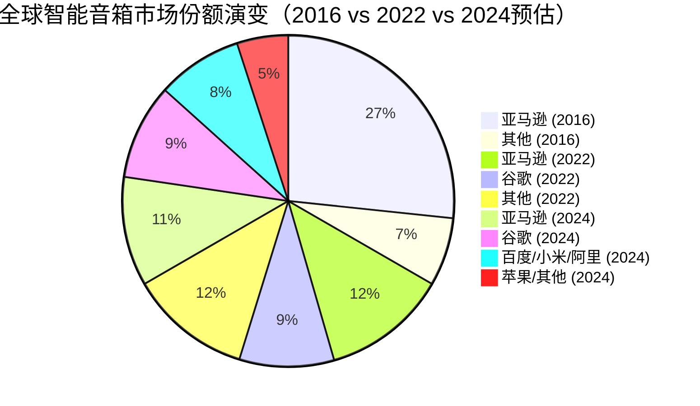
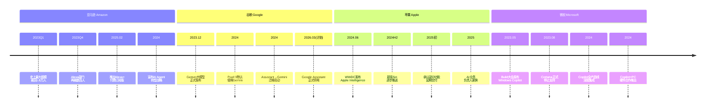
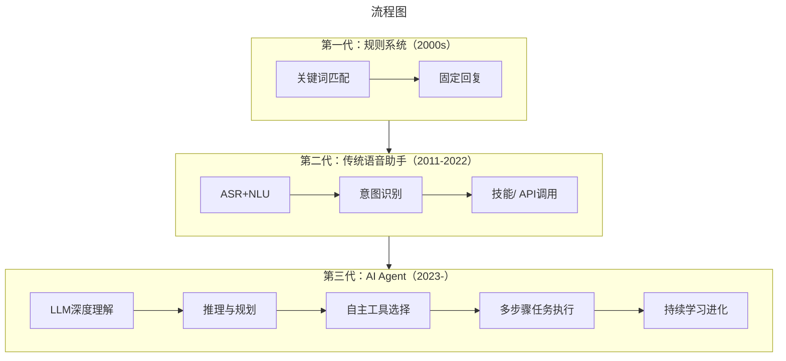

# 引言：当"百箱大战"遇上"大模型革命"

> **适用范围**：技术管理者、创业者、投资研究者、产品经理及对科技商业史感兴趣的读者；适用于战略复盘、案例研讨与决策参考场景。
>
> **更新摘要（v2 · 2026-08 更新）**：
> - 结构化升级为 6 节骨架（导言 / 核心方法论 / 关键流程 / 工具与实战 / 常见误区 / 进阶延展）
> - 保留全部原文 Mermaid 图、表格、数据与术语英文对照，并为 Mermaid 图补充 frontmatter 与图后解读
> - 将原「参考资料/附录」并入第 6 节「进阶延展」，便于延展阅读

## 1. 导言

2016年11月，当谷歌（Google）悄然推出首款智能音箱Google Home时，智能音箱行业正式进入"百箱大战"时代。彼时，亚马逊Echo凭借先发优势占据近80%市场份额，看似不可撼动。然而接下来的几年里，苹果（Apple）、微软（Microsoft）、阿里巴巴、小米等巨头纷纷入局，一场关于"占领客厅"、"掌控语音入口"的战争全面打响。

当时业界普遍认为：**谁赢得了智能音箱，谁就掌握了下一代计算平台的入口**。然而八年后的今天，这场战争的结局却出人意料——不是某一家公司胜出，而是整个行业被另一种技术彻底颠覆。2022年底ChatGPT的发布，让传统语音助手瞬间显得过时；2023年微软Cortana正式退役；2024年谷歌宣布用Gemini取代Google Assistant；苹果发布Apple Intelligence试图让Siri重生。

这是一个关于技术范式转移如何改写行业格局的故事。本文将全景式回顾智能音箱大战的完整历程，深入分析各大厂商的战略得失，并探讨在LLM（大语言模型）时代，语音交互的未来究竟何去何从。



> 上图展示了关键节点与演进路径，结合正文时间线可直观把握事件因果与战略转折。

---

## 2. 核心方法论

### 一、黄金时代（2014-2019）：群雄逐鹿与战略分化

#### 1.1 谷歌的杀入：技术优势对阵生态壁垒

2016年11月，谷歌推出Google Home，正式向亚马逊发起挑战。这并非谷歌首次尝试硬件产品——早在2012年，谷歌就推出过一款球状音乐播放器Nexus Q（媒体流播放器），售价299美元，主打"Made in America"，但上市不久便草草收场。此外，谷歌还尝试过Google TV（谷歌电视）和Chromecast（电视棒），在智能家居领域积累了一定经验。2014年重金收购Nest（由iPod之父托尼·法德尔创立的智能温控器公司），更是为进军智能音箱市场提供了技术和经验储备。

**产品对比：**

| 维度 | Amazon Echo | Google Home |
|------|-------------|-------------|
| 首发价格 | 199美元（后降至179美元） | **129美元** |
| 麦克风数量 | **7个** | 2个 |
| 技术卖点 | 噪音过滤机器学习 | 更先进的AI算法 |
| 外观设计 | 高冷圆柱形 | 和谐柔和，可换底座 |
| 音乐服务 | 初期仅Amazon Music | 开放第三方 |
| 屏幕扩展 | Echo Show（后期） | 可连接Chromecast/电视 |

谷歌的定价策略极具攻击性——**以"便宜"著称的亚马逊，居然被高科技公司在价格上打败了**。为保证低价，谷歌在成本上做了控制：使用2个麦克风而非亚马逊的7个。但谷歌宣称，凭借更优异的机器学习技术，2个麦克风就能达到亚马逊7个麦克风的效果。现场测试表明，这种差距即便存在，在日常场景下也几乎无法区分。

**真正的差距在于"智商"。** 依托谷歌强大的搜索引擎和人工智能积累，Google Home能够：
- 更自然地响应用户问题
- 理解上下文相关性（多轮对话）
- 提供更准确的信息和丰富内容
- 整合Gmail、日历、通讯录等服务

有用户评价："对着Echo说半天Alexa听不懂，换成Google Home问题就荡然无存了。"这就是技术差距导致的体验鸿沟。

谷歌还有一个独特优势：**通过Chromecast或Google TV将交互结果显示在电视屏幕上**。有些场景（如查询天气、查看日程）用大屏展示比语音朗读更直观。

上市后，Google Home迅速抢下约10%市场份额。但亚马逊仍有一个巨大护城河：**第三方技能平台上的技能数量是谷歌的100倍之多**。

#### 1.2 苹果的误判：HomePod与"音质执念"

2017年6月的WWDC（全球开发者大会）上，苹果终于发布了智能音箱HomePod——售价**349美元**，是所有竞品中最贵的。

HomePod的发布会演示非常能说明苹果的战略定位：
- **80%的时间**强调音乐播放功能：7个扬声器、1个低音炮、6个麦克风、A8芯片、"空间感知"自动调节音量...
- **20%的时间**简单提及Siri：可以语音交互完成特定指令

**这个比例本身就很说明问题。** 在所有竞争对手都在拼"智能"的时候，苹果却在拼"音质"。结合349美元的高价，用户自然会想：想要高音质为什么不去买专业音响品牌？想要智能为什么要选一个智能属性不突出的产品？

苹果的慢节奏同样令人费解。Siri作为最早出现在iPhone上的语音助手（2011年），本应让苹果最早意识到语音交互的重要性。但苹果在智能音箱领域的动作始终"慢几拍"，给人感觉像是**没有真正理解"智能音箱非音箱"的本质**。

中国古代逻辑学家公孙龙提出过著名的"白马非马"论，这个命题特别适用于智能音箱领域：**智能音箱之所以火起来，不是因为它是"音箱"，而是因为它是"语音入口"和"控制中枢"。** 苹果似乎直到很晚才明白这一点。

#### 1.3 微软的困境：Invoke与Cortana的黄昏

2017年5月，传统音频厂商哈曼卡顿（Harman Kardon，后被三星收购）宣布与微软合作，推出搭载Cortana（微软语音助手，中文名"小娜"）的智能音箱**Invoke**，同年10月正式开售，定价199.95美元。

微软的策略是**只做技术、不做硬件**——这与当年PC时代的Windows模式如出一辙：微软提供操作系统，硬件交给联想、戴尔、惠普等合作伙伴。但这个模式移植到智能音箱领域面临根本性问题：

**1. 音箱厂商远少于PC厂商**
PC时代有数十家整机厂商，而能够生产高质量智能音箱的传统音频厂商屈指可数。如果最终只有一两家合作，生态根本起不来。

**2. 微软缺乏消费级硬件基因**
从Zune播放机到Windows Phone，微软在消费级硬件领域屡战屡败。Invoke的销量惨淡，很快就被市场遗忘。

**3. Cortana自身竞争力不足**
相比Alexa和Google Assistant，Cortana在语音识别准确率、技能丰富度、第三方集成等方面都处于劣势。用户没有理由选择一个"更笨"的语音助手。

**4. 战略摇摆不定**
微软对Cortana的投入时紧时松，多次调整团队和方向，导致产品迭代缓慢，错失发展窗口期。

到2018年，当亚马逊已卖出数千万台Echo、谷歌也在不断出货时，微软Invoke在市场上几乎销声匿迹。正如我在原文中所言："三年后入场的微软，在这个领域还能有所作为吗？我个人不太看好。"

#### 1.4 国内市场的混战：百家争鸣与同质化竞争

国外巨头激战正酣之时，中国市场的智能音箱赛道也迅速升温：

| 品牌 | 产品 | 推出时间 | 特点 |
|------|------|----------|------|
| 京东+科大讯飞 | 叮咚音箱 | 较早 | 功能差强人意，生态薄弱 |
| 阿里巴巴 | 天猫精灵X1 | 2017 | 价格激进，快速铺量 |
| 小米 | 小米AI音箱 | 2017 | 性价比高，依托米家生态 |
| 百度 | 小度音箱 | 2018 | AI技术加持，补贴力度大 |
| 华为 | AI音箱 | 2018 | 品牌溢价，高端路线 |
| 喜马拉雅 | 小雅AI音箱 | 2017 | 内容生态差异化 |

国内产品的共同问题是：**在嘈杂环境下的语音识别能力普遍不如亚马逊和谷歌的产品**。科大讯飞虽然在中文语音处理领域全球领先，但整体产品体验仍有差距。

根据RUNTO数据，中国市场在经历初期的快速增长后，自2021年起进入持续衰退通道：
- **2022年**：销量2631万台，同比下降**28%**
- **2023年**：继续下滑
- **2024年**：销量仅1570万台，同比下降**25.6%**，连续四年衰退

目前国内市场呈现"四强格局"：**百度、小米、天猫精灵、华为合计占据96.5%的市场份额**，其中小米份额高达43%（来源：RUNTO 2024报告）。大量中小品牌已被淘汰出局。

---

### 二、转折点（2020-2022）：疫情红利与泡沫破裂

#### 2.1 最后的狂欢：疫情催生的增长幻象

2020年新冠疫情爆发，全球 lockdown（封锁）措施让智能音箱迎来了一次意外增长：

**增长驱动因素：**
- **居家时间增加**：客厅、厨房成为主要活动空间
- **在线教育需求**：家长需要工具辅助管理孩子学习
- **远程办公场景**：语音控制会议、播放背景音乐
- **娱乐需求激增**：音乐、有声书、播客使用频率飙升

根据Canalys数据，**2020年全球智能音箱出货量同比增长13%**，突破1.5亿台。各大厂商纷纷加大备货和营销投入，似乎行业前景一片光明。

**然而，这次增长具有强烈的"一次性"特征**，更像是对未来需求的透支，而非可持续趋势的开端。

#### 2.2 泡沫信号：增长放缓与用户倦怠

进入2021年后，全球智能音箱市场增速明显放缓：

**市场饱和迹象：**
- 北美市场渗透率超过40%，新增用户获取成本飙升
- 欧洲市场增长乏力，经济不确定性影响消费意愿
- 中国市场率先进入负增长通道

**用户行为变化：**
- **使用频率下降**：新购设备初期频繁使用，3个月后活跃度骤降
- **功能集中化**：大部分用户仅使用3-5个核心功能（音乐、闹钟、天气、智能家居控制）
- **novelty effect（新奇效应）消退**：设备逐渐沦为"高级蓝牙音箱"
- **复购率低迷**：用户更换设备的动力不足

更深层的危机在于：**传统语音助手的能力天花板已经触手可及**。用户发现无论哪家公司的产品，都面临着相似的局限性——听不懂复杂指令、无法真正对话、回答问题像"机器人"、经常需要重复说好几遍...

这些问题在ChatGPT出现之前似乎只能"慢慢改进"，但2022年底的技术爆炸让一切变得不同。

#### 2.3 行业集体迷茫：路在何方？

2021-2022年间，智能音箱行业的领军者们陷入了集体迷茫：

**亚马逊：**
- Echo设备销量增长停滞
- Alexa部门亏损扩大（后来披露达100亿美元/年）
- 内部对战略方向产生分歧
- 开始探索付费订阅模式

**谷歌：**
- Google Home系列更新频率降低
- Google Assistant功能迭代放缓
- 内部资源向其他AI项目倾斜
- Nest整合进展不及预期

**苹果：**
- HomePod销量惨淡，2021年推出Mini版降价自救
- Siri多年未进行架构级升级
- 内部对语音战略举棋不定
- 团队人才流失严重

**微软：**
- Cortana基本停止消费者端投入
- Invoke早已停产退市
- 转向企业市场和Azure集成
- 开始规划替代方案

**国内厂商：**
- 价格战愈演愈烈，利润微薄
- 用户活跃度和留存率堪忧
- 盈利模式不清，依赖补贴
- 部分厂商开始缩减投入

整个行业仿佛陷入了一个怪圈：**卖得越多亏得越多，投入越大回报越不确定**。没有人知道突破口在哪里，直到ChatGPT横空出世。

---

### 三、颠覆时刻（2023-2024）：LLM改写游戏规则

#### 3.1 ChatGPT效应：一夜之间的降维打击

2022年11月30日，OpenAI发布ChatGPT，这款产品在短短两个月内达成月活用户1亿的纪录，成为历史上增长最快的消费级应用。更重要的是，它让全世界第一次见识到了**生成式AI（Generative AI）的威力**。

对于智能音箱行业而言，ChatGPT的出现堪称**灭顶之灾**：

**用户体验的质的飞跃：**
- 传统语音助手：*"对不起，我不明白您的意思"*
- ChatGPT：*流畅自然的对话、精准的回答、创造性的内容*

**能力维度的全面碾压：**
```
传统语音助手的能力边界：
├── 预设指令执行 ✗
├── 简单问答（知识库匹配）✗
├── 单轮/有限多轮对话 ✗
├── 无创作能力 ✗
└── 无法推理和学习 ✗

ChatGPT/GPT-4 的能力展现：
├── 开放域自然语言理解 ✓
├── 复杂多轮对话与上下文记忆 ✓
├── 知识问答、总结、翻译 ✓
├── 文章、代码、诗歌创作 ✓
├── 逻辑推理与数学运算 ✓
├── 角色扮演与个性化定制 ✓
└── 持续学习与优化 ✓
```

用户很快意识到：**同样一个问题，问ChatGPT得到的答案比问任何智能音箱都有用得多**。这种体验差距不是渐进式的改进可以弥补的，而是**代际差异**。

#### 3.2 各大厂商的紧急应对

面对LLM浪潮，各大厂商被迫做出战略调整：

##### 亚马逊：Alexa Plus与生存之战

**危机暴露：**
- 2022年Alexa部门亏损**100亿美元**
- 2023年初裁员**1.8万人**（公司史上最大规模）
- 2023年底Alexa部门再裁数百人
- 核心工程师和研究人员大量离职

**应对措施：**
1. **推出Alexa+（Alexa Plus）付费版**（2025年2月发布）
   - 月费19.99美元（Prime会员免费使用）
   - 集成先进LLM能力
   - 提供个性化对话、复杂任务处理等功能
   
2. **加速内部AI研发**
   - 大语言模型项目（代号"Olympus"等）
   - 收购/投资AI初创公司
   - 将AWS AI能力引入Alexa

3. **重新定位为AI Agent**
   - 从"语音助手"升级为"AI自主代理"
   - 强调任务规划和执行能力
   - 开放API和开发者工具

##### 谷歌：Gemini取代Google Assistant

谷歌的反应最为激进和果断：

**Gemini发布与整合计划：**
- **2023年12月**：发布Gemini大语言模型
- **2024年**：Pixel 9系列手机将Gemini设为默认助手
- **原计划2025年底**：全面完成Google Assistant向Gemini迁移
- **最新消息**：推迟至**2026年3月**，Google Assistant届时正式停用

**战略意义：**
- 谷歌认识到传统Assistant架构已无法与GPT-4竞争
- 必须用原生LLM架构从头构建新一代AI助手
- Gemini不仅服务于智能音箱，还将覆盖所有谷歌产品线
- 这是一次"断臂求生"式的战略转型

**技术特点：**
- 原生多模态（文本、图像、音频、视频）
- 强大的推理和规划能力
- 与谷歌搜索、地图、YouTube等服务的深度集成
- 支持Agent自主执行复杂任务

##### 苹果：Apple Intelligence与Siri重生

苹果的动作相对迟缓，但在2024年WWDC上终于亮出了底牌：

**Apple Intelligence发布（2024年6月）：**
- 这是苹果历史上最大规模的AI战略发布
- 新版Siri代号"Campo"
- 核心能力包括：
  - 理解用户个人信息和偏好
  - 感知屏幕内容和应用状态
  - 跨应用的协同操作
  - 自然流畅的多轮对话

**技术架构变革：**
- 对Siri底层架构进行重构（这也是导致延期的主要原因）
- 端云结合的AI处理模式
- 强调隐私保护（设备端处理敏感信息）
- 支持调用外部AI服务（已宣布将集成ChatGPT）

**挑战与争议：**
- 发布初期承诺的功能未能完全兑现
- 2025年初宣布部分功能延期
- AI业务负责人更换，多名核心成员离职
- 能否追赶上谷歌和OpenAI的进度仍是未知数

##### 微软：Cortana退役与Copilot崛起

微软是反应最快、最坚决的：

**Cortana正式退役：**
- **2023年8月**：微软正式停止Windows系统中Cortana的支持
- 这标志着微软在传统语音助手赛道的彻底退出
- Cortana从2014年发布到退役，历时近10年

**Copilot全面接棒：**
- 基于**OpenAI GPT-4**技术
- 已集成到**Windows 11、Office 365、Bing搜索、Edge浏览器**等几乎所有微软产品
- 定位为"AI协作伙伴"而非简单的语音助手
- 支持文本、语音、图像等多模态交互

**战略意义：**
- 微软通过与OpenAI的合作，成功实现了"弯道超车"
- Copilot的用户体验远超Cortana鼎盛时期
- 企业级市场接受度高（Office集成是杀手锏）
- 微软成为AI时代的重要玩家之一



> 上图展示了关键节点与演进路径，结合正文时间线可直观把握事件因果与战略转折。

#### 3.3 市场格局剧变：从"百箱大战"到"AI竞赛"

随着LLM技术的成熟和应用，智能音箱行业的竞争逻辑发生了根本性改变：

**旧的竞争维度（2014-2022）：**
- 硬件设计和音质
- 语音识别准确率
- 技能/应用数量
- 价格和渠道
- 品牌和生态

**新的竞争维度（2023-）：**
- 大模型能力和智能化水平
- AI Agent的任务执行能力
- 多模态交互体验
- 个性化定制程度
- 数据隐私和安全
- 商业模式的可持续性

**市场格局重塑：**

| 厂商 | 旧赛道地位 | 新赛道地位 | 转型难度 | 前景评估 |
|------|-----------|-----------|---------|---------|
| OpenAI | 未参与 | **领跑者** | N/A | 最强技术，但缺硬件入口 |
| 谷歌 | 第二名 | **有力竞争者** | 中等 | Gemini整合决心大，执行力待验证 |
| 微软 | 淘汰者 | **重要玩家** | 低（借力OpenAI） | Copilot企业市场成功，消费端待观察 |
| 亚马逊 | 第一名 | **追赶者** | 高（历史包袱重） | Alexa Plus成败未卜 |
| 苹果 | 落后者 | **追赶者** | 中高（隐私优先限制） | Apple Intelligence潜力大但进度慢 |
| Anthropic/Claude | 未参与 | **挑战者** | N/A | 技术强劲，寻求差异化 |

---

## 3. 关键流程

（本节内容在原文中较为简略，可结合第 2、3、4 节相关段落交叉理解。）

---

## 4. 工具与实战

### 四、深度分析：为什么"百箱大战"没有赢家？

#### 4.1 "白马非马"：智能音箱的本质误读

回望整场"百箱大战"，最大的教训或许在于：**许多参与者从一开始就误解了智能音箱的本质**。

中国古代哲学家公孙龙的"白马非马"论指出：**概念的外延和内涵不能混淆**。"白马"是"马"的一种，但"白马"不等于"马"的全部。同理：

- **"智能音箱"是"音箱"的一种**（它确实能放音乐）
- **但"智能音箱"的核心价值不在"音箱"，而在"智能"**

许多厂商（尤其是苹果）把重点放在了"音箱"属性上——音质、外观、材质...而忽略了真正的战场在"智能"——语音识别准确率、自然语言理解能力、任务执行的智能程度、生态系统的丰富性...

**亚马逊的成功恰恰因为它最先意识到了这一点**：Echo最初只是切入点，真正的目标是Alexa语音平台。而那些执着于"做好一只音箱"的公司，最终都偏离了赛道。

#### 4.2 技术瓶颈：传统语音助手的结构性缺陷

即使没有ChatGPT，传统语音助手也面临着难以逾越的技术瓶颈：

**架构局限：**
```
传统语音助手架构：
┌─────────────────────────────────────┐
│  唤醒词检测 → ASR → NLU → 意图匹配  │
│       ↓                            │
│  预设回复/技能调用 → TTS → 语音输出   │
└─────────────────────────────────────┘
     ↑                         ↑
     │  管道式处理              │  刚性流程
     │  无语义理解              │  无泛化能力
     └─────────────────────────┘  无法处理未知输入
```

**致命弱点：**
1. **意图匹配的穷举困境**：人类表达方式无限，预设意图库永远不够
2. **上下文记忆有限**：难以维持长程对话的一致性
3. **无推理能力**：无法处理需要逻辑判断的复杂请求
4. **知识时效性差**：依赖人工更新的知识库
5. **个性化程度低**：难以深度理解用户偏好

这些不是"优化"可以解决的问题，而是**架构层面的根本性限制**。只有LLM的出现才提供了真正的解决方案。

#### 4.3 商业模式的死结

智能音箱行业面临着一个无解的商业矛盾：

**成本端：**
- 硬件BOM：50-150美元/台
- 云计算成本：每次交互0.01-0.05美元
- 研发投入：每年数十亿美元
- 营销推广：持续的品牌建设费用

**收入端：**
- 硬件销售：微利甚至亏本（价格战）
- 语音购物：转化率<2%，GMV有限
- 技能分成：开发者难盈利，平台无分成
- 广告收入：隐私争议，规模化困难
- 订阅服务：刚刚起步，用户付费意愿低

**核心矛盾：**
> 要提供真正智能的服务，需要巨大的算力和研发投入；
> 但用户不愿意为"稍微聪明点的闹钟"支付溢价；
> 于是只能靠烧钱换市场，导致巨额亏损；
> 亏损又限制了进一步投入，形成恶性循环。

Alexa部门100亿美元的年亏损就是这个死结的极端体现。

#### 4.4 生态陷阱：繁荣背后的脆弱

亚马逊Alexa技能平台曾被视为强大的护城河——**10万+技能**听起来令人印象深刻。但深入分析后发现：

**技能生态的问题：**
1. **头部效应极端**：前1%的技能占据了99%的使用量
2. **长尾技能无人问津**：大量技能下载量极低
3. **开发者盈利困难**：除少数头部外，大多数技能无法变现
4. **质量参差不齐**：许多技能体验糟糕，损害平台声誉
5. **维护成本高昂**：第三方API变更导致技能失效

**更深层的问题是：**
- 技能本质上是"预编程的工作流"，不具备真正的智能
- 用户需要记住每个技能的触发词，认知负担重
- 不同平台的技能互不兼容，开发者适配成本高
- 当底层AI能力提升时，许多技能变得多余

**LLM时代的启示：**
ChatGPT不需要"技能商店"——它可以通过自然语言理解用户意图，直接调用合适的工具/API。这是**质的飞跃**：从"安装技能"到"即问即答"，用户体验完全不同。

---

## 5. 常见误区

（本节内容在原文中较为简略，可结合第 2、3、4 节相关段落交叉理解。）

---

## 6. 进阶延展

### 五、未来展望：AI Agent新纪元

#### 5.1 范式转移：从Voice Assistant到AI Agent

2023-2024年，我们正在见证人机交互领域的一次深刻范式转移：



**AI Agent的核心特征：**
- **主动性**：不只是被动响应，还能主动提供建议和服务
- **自主性**：能够独立规划和执行复杂的多步骤任务
- **通用性**：不需要为每个任务单独开发"技能"
- **学习能力**：通过交互不断优化，越用越懂你
- **跨平台性**：可以在手机、电脑、音箱、汽车、手表等设备间无缝切换

#### 5.2 各厂商的Agent布局

**谷歌Gemini Agent：**
- 2024年已开始将Project Mariner等技术整合进Gemini Agent
- 支持归档电子邮件、预订酒店等复杂操作
- 与谷歌全家桶（Search、Maps、Gmail、Calendar等）深度集成
- 目标：成为用户的"全能数字助理"

**微软Copilot Agent：**
- 已嵌入Office 365、Windows、Edge等产品
- 企业级场景表现突出（文档处理、数据分析、邮件管理等）
- 与OpenAI深度合作，技术底座强大
- 正在拓展更多垂直领域应用

**亚马逊Alexa Agent：**
- Alexa Plus是第一步，但仍处早期阶段
- 依托AWS云服务和电商生态
- 挑战在于如何追赶技术差距和重建用户信任
- 成败将在未来1-2年内见分晓

**Apple Intelligence Agent：**
- 强调隐私保护和设备端处理
- iOS/macOS生态系统是独特优势
- 进度落后于竞争对手，但苹果向来后发制人
- 能否重现iPhone时代的辉煌？

**OpenAI/ChatGPT Agent：**
- 技术领先，但缺乏硬件入口
- 2024-2025年大力推广Agent能力（Operator、Deep Research等）
- 可能通过与其他厂商合作补齐硬件短板
- 最大变数：是否推出自有硬件产品？

#### 5.3 智能音箱的未来：消亡还是重生？

一个关键问题是：**在AI Agent时代，智能音箱这种产品形态还会存在吗？**

**悲观观点：智能音箱将逐渐消亡**
- 手机和电脑上的AI Agent更加智能和便捷
- 专用硬件的需求降低
- 用户不愿为单一功能的设备付费
- 厂商将资源转向更有前景的产品

**乐观观点：智能音箱将进化重生**
- 作为家庭AI Agent的"物理载体"仍有价值
- 语音交互在某些场景（厨房、卧室、车内）不可替代
- 结合视觉传感器和机器人技术，可演变为"家庭智能中枢"
- 关键在于能否提供足够智能的Agent体验

**我的判断：短期承压，长期分化**

短期内（1-3年），智能音箱市场将继续萎缩，因为现有产品的体验无法满足用户被ChatGPT抬高的期望。但中长期来看，**真正具备AI Agent能力的智能音箱产品可能会重新获得关注**——前提是它们必须足够智能，而不只是"会说话的喇叭"。

可能的演进路径：
1. **高端化**：面向愿意为优质体验付费的用户群体
2. **专业化**：针对特定场景（如厨房助手、儿童教育伴侣）
3. **融合化**：与智能家居系统、机器人等深度融合
4. **订阅制**：硬件免费或低价，通过Agent服务收费

#### 5.4 对科技行业的启示

智能音箱大战的始末给整个科技行业留下了宝贵的经验教训：

**1. 先发优势 ≠ 持续优势**
亚马逊Echo抢占了先发优势，但当底层技术发生革命性变革时，历史包袱反而成为转型的障碍。**真正的护城河是持续创新能力，而不是先发地位。**

**2. 技术范式转移是不可逆的**
从PC到移动互联网，从App到AI Agent，每一次范式转移都会淘汰一批曾经的领导者。**保持技术敏感度和快速适应能力至关重要。**

**3. 商业模式必须经得起时间检验**
烧钱换市场的策略在资本充裕期可行，但最终必须找到可持续的商业模式。**不能盈利的业务，无论多么"战略性"，都是不可持续的。**

**4. 用户体验是最终的裁判**
无论技术多先进、生态多庞大，如果用户体验不好，一切都是空谈。ChatGPT的成功首先是因为它**真的好用**，而不是因为它的技术有多复杂。

**5. 开放与合作往往优于封闭与独占**
微软通过与OpenAI的合作实现了弯道超车，而坚持封闭生态的苹果则一度落后。**在AI时代，开放合作可能是更快到达目标的方式。**

---

### 六、结语：没有赢家的战争，所有人的教训

回望2016-2024这八年的智能音箱大战，这是一个**没有明确赢家，但所有人都付出了代价**的故事：

- **亚马逊**：赢得了市场份额，但亏损百亿美元，如今面临生死转型
- **谷歌**：技术领先，但未能撼动亚马逊的主导地位，正在用Gemini推倒重来
- **苹果**：战略误判，浪费了Siri的先发优势，Apple Intelligence能否力挽狂澜？
- **微软**：Cortana彻底失败，但借助OpenAI和Copilot找到了新赛道
- **国内厂商**：经历价格战后伤痕累累，市场持续萎缩

**更大的输家或许是"智能音箱"这个品类本身**——它曾被寄予厚望，被认为是下一代计算平台的入口，但最终却被另一种技术（LLM/AI Agent）所颠覆。

然而，这场战争并非毫无意义。它推动了：
- 语音识别技术的进步
- 智能家居生态的发展
- 用户对语音交互的认知和习惯培养
- 各大厂商在AI领域的投入和积累

这些遗产将在AI Agent时代继续发挥作用。

站在2024年中这个时间节点，我们可以确信的是：**语音交互的未来不会消失，但它将以一种全新的形态存在**。不再是"智能音箱"这种单一产品，而是无处不在的AI Agent——在你的手机里、电脑里、汽车里、耳机里，也许未来还会有全新的硬件形态。

**唯一不变的是变化本身。** 对于科技公司而言，最重要的不是赢得某一场战役，而是在每一次技术革命来临时，都能及时转身，拥抱新的可能性。

---

---

### 参考资料

1. Canalys. (2016-2024). *Global Smart Speaker Market Reports*.
2. RUNTO. (2022-2024). *中国智能音箱市场调研报告*.
3. Business Insider / 腾讯新闻. (2024). *Alexa部门亏损100亿美元报道*.
4. CNBC / 新浪财经. (2023). *亚马逊1.8万人大裁员报道*.
5. Google Official Blog / 搜狐网. (2024). *Google Assistant to Gemini Migration Plan (2026)*.
6. Apple Newsroom. (2024). *Apple Intelligence Announced at WWDC 2024*.
7. Microsoft Official Blog. (2023). *Cortana Support Ending - Welcome Windows Copilot*.
8. OpenAI. (2022-2024). *ChatGPT Product Updates and Technical Reports*.
9. Various industry analyses on smart speaker market evolution and AI paradigm shift (2023-2024).
10. 原始文章：032-智能音箱的战斗：谷歌的杀入、034-智能音箱的战斗：巨头纷纷入场、035-智能音箱的战斗：白马非马.

---

*本文信息截止日期：2024年6月7日*
*原始文章：032-智能音箱的战斗：谷歌的杀入、034-智能音箱的战斗：巨头纷纷入场、035-智能音箱的战斗：白马非马*
*【更新版】全面重写，融合2023-2024年LLM对语音助手行业的颠覆性影响及最新行业数据*

---

*v2 结构化升级版 · 文件名保持不变：007-智能音箱大战的终局与AI范式转移-【更新版】.md*