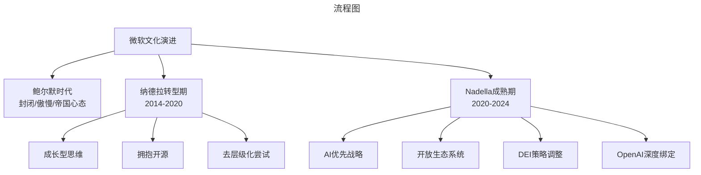
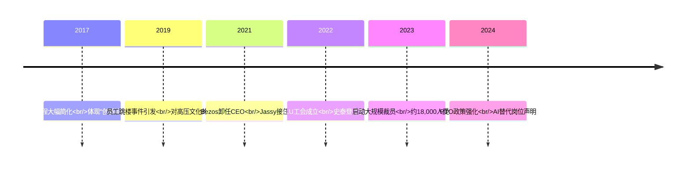
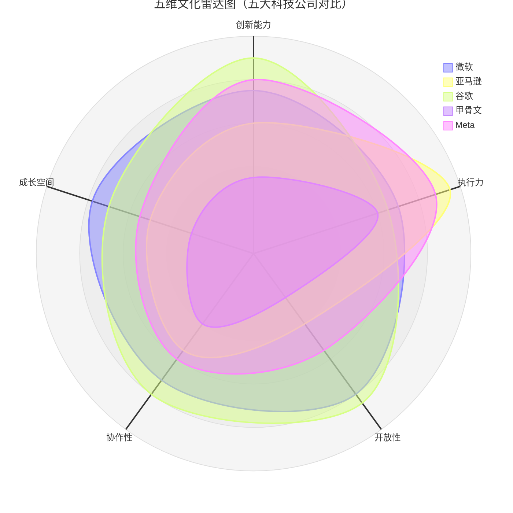
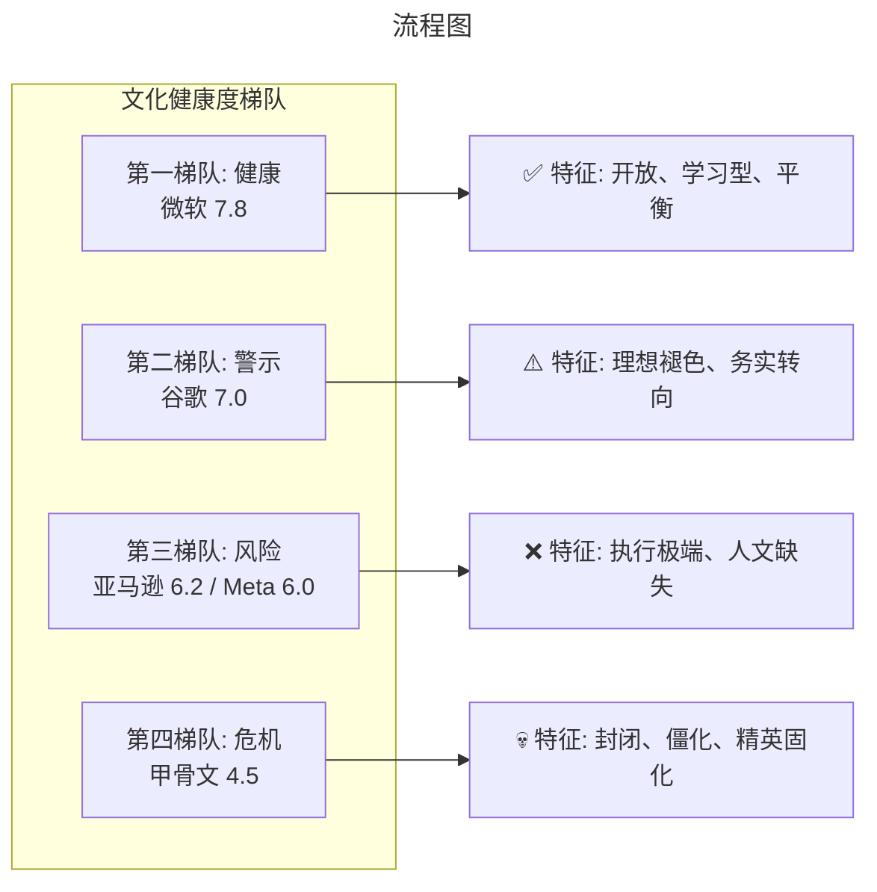
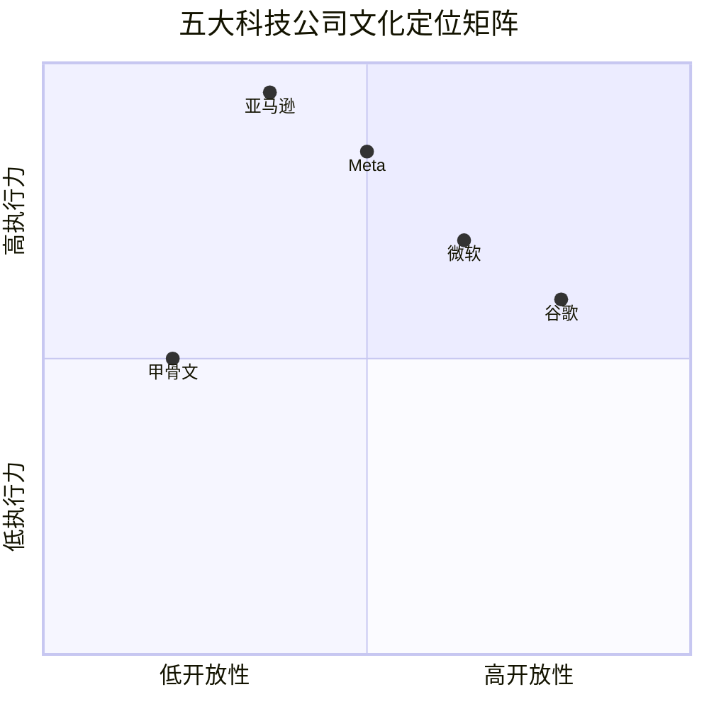

# 引言：为什么企业文化比技术更决定成败？

> **适用范围**：技术管理者、创业者、投资研究者、产品经理及对科技商业史感兴趣的读者；适用于战略复盘、案例研讨与决策参考场景。
>
> **更新摘要（v2 · 2026-08 更新）**：
> - 结构化升级为 6 节骨架（导言 / 核心方法论 / 关键流程 / 工具与实战 / 常见误区 / 进阶延展）
> - 保留全部原文 Mermaid 图、表格、数据与术语英文对照，并为 Mermaid 图补充 frontmatter 与图后解读
> - 将原「参考资料/附录」并入第 6 节「进阶延展」，便于延展阅读

## 1. 导言

在科技行业，我们习惯于关注技术栈、产品功能、市场份额这些"硬指标"。然而，真正决定一家科技公司能走多远的，往往是那些看不见摸不着的东西——企业文化。

2017年至2019年间，我曾撰写过五篇关于硅谷五巨头企业文化的系列文章，从**面试流程**这个独特的切入口，剖析了微软、亚马逊、谷歌、甲骨文和Facebook（现Meta）的文化基因。七年过去了，科技世界经历了翻天覆地的变化：AI浪潮席卷一切、疫情重塑工作方式、地缘政治撕裂全球化、经济周期引发裁员潮。

站在2024年的节点回望，这五家公司的文化发生了怎样的演变？哪些基因得以延续？哪些又被迫改变？更重要的是，当AI成为新的生产力引擎时，什么样的文化才能支撑企业走得更远？

本文将整合并更新之前的五篇原创内容，以**2024年的全新视角**重新审视硅谷五巨头的文化图景。

---

---

## 2. 核心方法论

### 一、微软：从傲慢到谦逊的文化复兴

#### 原文面试案例回顾

微软的面试流程有一个极具特色的角色——**AA（As Appropriate）面试官**。这不是一个普通的面试官，而是拥有"终极裁判权"的特殊岗位。AA面试官可以代表微软决定是否录用候选人，哪怕前面所有面试官都给了"Hire"，AA说"No"就是"No"；反之亦然。

这套制度折射出微软文化的两个核心特征：

1. **自上而下的管理风格**：领导主要对上级负责，而非对下级负责。获取AA资格需要经过长达一年的培训和考核，且必须得到上级乃至上上级的鼎力支持。这种晋升机制导致领导层更在意"上面的人怎么看"，而忽视下属的真实感受。
   
2. **极大的自由裁量权**：具备一定资格的领导者在人事和资源分配上拥有几乎不受约束的权力。这催生了微软内部"圈子套圈子"的局面——每个牛人占据一块地盘后，会招聘自己圈子里的人，形成封闭的利益共同体。

#### Nadella时代的文化变革成果（2024评估）

2014年萨提亚·纳德拉（Satya Nadella）接任CEO时，微软正处于前所未有的低谷：PC市场萎缩、移动战略失败、内部派系林立、创新活力枯竭。纳德拉上任后推动了一场堪称教科书级别的文化转型：

**从"知道一切"到"学习一切"（Know-it-all → Learn-it-all）**

这是纳德拉最著名的文化口号。他亲自撰写的《刷新》（Hit Refresh）详细阐述了这一理念：承认自己的无知，保持成长型思维，将失败视为学习机会而非耻辱。这一转变直接影响了招聘标准——微软开始更看重候选人的学习能力和协作精神，而非单纯的技术能力或学历背景。

**开源友好：告别封闭帝国的傲慢**

曾几何时，微软是开源运动的死敌。史蒂夫·鲍尔默（Steve Ballmer）曾公开称Linux为"癌症"。然而在纳德拉领导下，微软完成了180度大转弯：
- 2018年以75亿美元收购GitHub
- VS Code成为开发者最喜爱的编辑器
- .NET框架全面开源
- TypeScript成为Web开发的主流语言
- Azure积极支持Linux工作负载

2024年，纳德拉更是明确提出构建**"最开放的AI生态系统"**，与Anthropic、Mistral等多家模型提供商合作，打破对OpenAI的单一依赖。这种开放姿态是老微软完全不可想象的。

**多元化与包容性（DEI）的推进与回撤**

纳德拉时代初期，微软在DEI方面投入巨大：定期发布多元化报告、设立包容性指标、在绩效评估中纳入多样性考量。然而2024年出现了一个值得关注的转向——微软悄然**取消了DEI相关的绩效考核指标**，并停止发布年度多元化报告。这一变化引发了外界对微软是否在"政治正确退潮"中妥协的质疑。

**员工满意度与文化健康度**

根据Glassdoor等平台的数据，微软的员工满意度评分从纳德拉初期的3.3分左右提升至2024年的**4.1-4.3分**（满分5分），在大型科技公司中处于中上水平。员工普遍认可公司的转型方向和工作生活平衡，但仍有部分人对内部政治和晋升机制表示不满。

> 上图展示了关键节点与演进路径，结合正文时间线可直观把握事件因果与战略转折。

#### OpenAI合作带来的文化张力

微软与OpenAI的合作是近年来科技界最重要的战略联盟之一，累计投资超过**130亿美元**。然而，这段"蜜月关系"正在产生微妙的文化张力：

**资源倾斜引发的内部不满**
据外媒报道，大量微软员工对公司过度聚焦OpenAI合作感到不安。有人担心微软正在沦为"OpenAI的IT部门"——将最优秀的人才和算力资源都投入到支持OpenAI的产品中，而忽视了内部AI研发团队的成长。这种担忧并非空穴来风：2024年，多位微软AI研究核心人员离职加入OpenAI或其他竞争对手。

**治理风险的暴露**
2023年底OpenAI的"政变"事件（Sam Altman被罢免后又复职）让微软深刻意识到过度依赖单一合作伙伴的风险。此后，微软开始主动**分散AI赌注**：引入Anthropic的Claude模型进入Office 365、投资多家AI初创公司、加强内部Microsoft 365 Copilot团队的建设。

**身份认同危机**
对于许多资深微软员工来说，公司正在经历一场"身份认同危机"：微软究竟是平台提供商、AI基础设施公司，还是OpenAI的分销渠道？这种战略模糊性正在侵蚀微软引以为傲的"工程师文化"根基。

---

---

### 二、亚马逊：领导力准则的双刃剑

#### 原文面试案例回顾

亚马逊的面试体系围绕其著名的**14条领导力准则（Leadership Principles）**展开。其中最具特色的是**Bar Raiser（标杆提升者）**角色——来自任何部门的资深员工，在面试中拥有**一票否决权**，专门负责维护亚马逊的文化标准和招聘质量。

Bar Raiser制度源于贝佐斯早期的理念：每个新员工都必须**高于现有平均水平**，从而持续提升组织能力。随着公司规模扩大，贝佐斯无法亲自参与每次面试，Bar Raiser便成为他的"文化代理人"。

亚马逊面试的另一大特点是**极高的淘汰率**。在亚马逊待满18个月就算"老员工"了，远低于其他科技公司的平均在职时长。贝佐斯对此毫不介意——他认为高流动率是"大浪淘沙"的自然结果，留下来的才是真正认同亚马逊文化的人。

#### 14条准则的实践与异化

亚马逊的14条领导力准则包括："顾客至上"、"主人翁精神"、"创新简化"、"决策正确"、"好奇求知"等。这些准则本身并无问题，但在实践中却呈现出复杂的两面性：

**正面作用**
- 为跨部门协作提供了共同语言
- 确保了亚马逊强大的执行力和客户导向
- 在校招流程改革中体现了"创新简化"和"勤俭节约"

**异化风险**
- 准则数量过多（14条），容易被选择性引用来为任意决策背书
- "坚持最高标准"演变为无底线的内卷
- " disagree and commit（异议后承诺）"有时变成压制异见的工具
- "勤俭节约"在员工福利方面表现为抠门文化

#### Bezos → Jassy的权力交接与文化延续

2021年7月，杰夫·贝佐斯卸任CEO，由AWS创始人安迪·贾西（Andy Jassy）接棒。这次权力交接是亚马逊历史上最重要的领导层变动之一。

**Jassy的风格差异**
与贝佐斯的远见卓识和 eccentric（古怪）风格不同，Jassy更像一个**务实的运营者**：
- 更注重数据驱动决策
- 强调成本控制和效率提升
- 风格更加低调内敛
- 背景是AWS的成功经验

**文化延续性**
尽管风格不同，Jassy基本延续了亚马逊的核心文化DNA：
- 14条领导力准则依然是圣经
- Bar Raiser制度继续运行
- 高强度工作文化未变

**新引入的元素**
Jassy也带来了一些微妙的变化：
- **更严格的绩效管理**：引入了更精细的员工评级系统
- **回归办公室政策（RTO）**：要求员工每周至少到岗3天，引发广泛争议
- **AI驱动的效率革命**：明确表态生成式AI将"减少"总部员工数量

#### 工会化：亚马逊文化的最大挑战

**Amazon Labor Union（ALU）的成立**
2022年，亚马逊史无前例地遭遇了工会化的重大挑战。在纽约史泰登岛仓库，ALU成功组织了投票，成为亚马逊美国首个工会化场所。这对亚马逊的文化根基构成了根本性质疑：

> 如果亚马逊真的如其所宣称的那样是"地球上最好的雇主之一"，为什么员工需要工会来保护自己的权益？

**文化冲击**
工会化运动揭示了亚马逊领导力准则与现实之间的巨大鸿沟：
- "以人为本" vs 严苛的配额管理
- "追求卓越" vs 将员工视为可替换零件
- "赢得信任" vs 对基层声音的系统性忽视

**后续影响**
截至2024年，虽然亚马逊在其他仓库成功阻击了工会化运动，但ALU的存在已经永久性地改变了亚马逊的劳资关系格局。公司不得不在某些福利和工作条件上做出让步，这在亚马逊历史上极为罕见。

> 上图展示了关键节点与演进路径，结合正文时间线可直观把握事件因果与战略转折。

---

---

### 四、甲骨文：狼性文化的存续与代价

#### 原文面试案例回顾

在五家公司中，甲骨文的招聘方式最为**独特且争议最大**——它实行严格的**"学校名单制度"（School List Policy）**。

**名单内的特权**
甲骨文维护着一份全球精英学校的白名单。在中国大陆地区，这份名单包括清华大学本科、北京大学本科、中国科学技术大学少年班和零零班等极少数项目。美国本土上榜的学校也不超过20所。

如果你有幸在名单上：
- 可以在全公司范围内自由面试多个团队
- 面试过程轻松愉快，主要是"聊天谈心"
- 技术考察仅为一两轮简单的编程题
- 多个组争相发Offer

**名单外的困境**
如果你不在名单上：
- 原则上不会获得任何面试资格
- 即使有内部人士推荐，也需要走繁琐的"特例审批"流程
- 需要提交本科以来的全部成绩单
- 需要3封推荐信（包括导师推荐）
- 需要接受长达两个月的背景调查（甚至跨国核实）
- 最终可能只能去偏远地区的空缺岗位

我在原文中亲身经历了这一过程：作为非名校毕业生，历经两个月折腾才获得面试机会，最终因 Offer 条件不佳而拒绝。

#### 销售驱动的基因难以改变

甲骨文的企业文化深深植根于其**数据库销售帝国的历史**。拉里·埃里森（Larry Ellison）创立公司时的核心理念是：**销售驱动一切，技术为销售服务**。

**工程师文化的边缘化**
与谷歌、微软等"工程师驱动"的公司不同，甲骨文的工程师长期处于从属地位：
- 销售人员的收入和地位远高于同级别的工程师
- 技术决策往往服从于商业合同需求
- 内部创新缺乏土壤，主要依靠收购获取新技术

**精英主义的固化**
学校名单制度是甲骨文精英文化的极致体现。这种"唯出身论"在公司内部形成了以学历为基石的小圈子，导致：
- 政治斗争严重
- 人浮于事现象普遍
- 非名校出身者晋升困难
- 人才流失率居高不下

#### 云转型中的文化撕裂

**战略转型的迫切性**
面对AWS和Azure的强势崛起，甲骨文面临着生死存亡的云转型压力。埃里森多次公开宣称Oracle Cloud将超越竞争对手，但现实数据并不乐观。

**Cerner收购：最大的赌注**
2022年6月，甲骨文以**283亿美元**现金收购医疗信息公司Cerner，这是公司史上最大规模的收购。战略意图很明确：借助Cerner的医疗云业务快速切入垂直领域，缩小与AWS/Azure的差距。

然而，收购后的整合进程**远不及预期**：
- Cerner原有团队与甲骨文文化冲突严重
- 医疗行业的合规要求与甲骨文的激进风格不合拍
- 整合进度缓慢，协同效应尚未显现
- 有分析师称这笔收购已成为"转型包袱"

**与AWS/Azure竞争中的工程师文化困境**
在云计算市场，甲骨文面临着一个根本性的文化矛盾：
- 云计算需要**快速迭代、开放协作**的工程师文化
- 甲骨文的基因是**销售主导、封闭控制**的商业文化
- 这种错位导致甲骨文云产品的竞争力始终不足

#### Ellison的最后战役

80多岁的拉里·埃里森依然牢牢掌控着甲骨文的方向盘。他的领导风格集**个人魅力、攻击性强、控制欲重**于一身：

- 公开抨击竞争对手（尤其是AWS）
- 亲自参与重要产品发布会
- 对公司运营细节保持高度关注
- 不愿意放权给职业经理人

这种"强人政治"在创业期和成长期可能是优势，但在需要敏捷创新的云时代，却可能成为桎梏。埃里森的"最后战役"不仅是技术的较量，更是文化的突围——**一家50岁的公司能否在创始人阴影下完成自我革新？**

---

---

### 五、Meta：黑客精神的迷失与寻找

#### 原文面试案例回顾

Facebook（现Meta）的面试体系明显带有**谷歌的影子**，但有几个关键差异：

**刷题文化的官方认可**
与谷歌反对刷题、追求"智商测试"不同，Meta不仅不反对刷题，反而**默认并鼓励**这种行为：
- 面试题大部分来自网上常见的算法题库
- 45分钟内写出2-3道无Bug代码才算合格
- 告诉面试官"我是刷题准备的"完全没问题
- 核心筛选标准是**速度和熟练度**，而非纯粹智力

这种设计反映了两条隐性筛选原则：
1. **勤奋**：愿意花大量时间刷题的人通常工作也很努力
2. **时间充裕**：年轻人更有时间和精力投入高强度准备

**高强度考评体系**
Meta的考评分**7个等级**，每季度考评一次：
- 最高档奖金可达工资的数倍
- 最低档奖金为0
- 连续两次不合格即被解职
- 考评指标包含**代码行数**等量化指标

这种"计件工资式"的考评导致Meta员工普遍**一周七天、每天10+小时**工作，在硅谷显得格格不入。

**年轻化倾向**
由于高强度工作和年龄相关的生活负担，Meta员工的平均年龄显著低于其他科技公司。管理层也呈现年轻化趋势。这既是Meta高效执行力的来源，也埋下了经验断层和人才流失的隐患。

#### "Move Fast"的异化与修正

**黑客精神的起源**
"Move Fast and Break Things（快速行动，打破常规）"曾是Facebook最著名的文化口号，体现了典型的黑客精神：不怕犯错、快速迭代、用户反馈驱动优化。

**异化为"Move Fast with Broken Things"**
随着公司规模扩大，这句口号逐渐变味：
- 快速发布导致产品质量问题频发
- "打破常规"演变为无视用户隐私（剑桥分析事件）
- 数据泄露丑闻严重损害品牌声誉

**修正为"Move Fast with Stable Infra"**
2014年后，扎克伯格将口号修改为"Move Fast with Stable Infrastructure（在稳定基础设施上快速前进）"，强调速度不能以牺牲稳定性为代价。但这一修正并未触及更深层的文化问题。

#### 效率年：Zuckerberg的冷酷决策

**2023：效率之年（Year of Efficiency）**
2023年2月，扎克伯格宣布将2023年定为"效率年"，启动公司**18年来首次大规模裁员**：
- 第一轮裁员约**11,000人**（2022年11月）
- 第二轮裁员约**10,000人**（2023年3月）
- 关闭约**5,000个**开放职位
- 总计裁员超**21,000人**，占员工总数近20%

**决策风格转变**
这次裁员展现了扎克伯格领导力的另一面：
- 果断冷酷，不拖泥带水
- 公开承认此前"过度招聘"的错误
- 将元宇宙投资与效率提升并列为核心战略
- 不再回避艰难的人事决策

**文化影响**
"效率年"对Meta文化的冲击是深远的：
- 打破了"永不裁员"的心理预期
- 员工对公司的信任度下降
- 幸存者综合症（Survivor Guilt）弥漫
- 工作安全感急剧降低

#### 元宇宙：文化赌注还是文化毒药？

**Reality Labs的巨额亏损**
Meta的元宇宙部门Reality Labs是公司文化转型的核心载体，但其财务表现令人担忧：
- 2022年亏损**137亿美元**
- 2023年亏损继续扩大（单季亏损达42亿美元）
- 营收仅21.6亿美元，远不足以覆盖成本
- 占据全球VR市场80%份额仍无法盈利

**文化冲突**
元宇宙愿景与Meta传统工程文化之间存在深刻的张力：
- **长期主义 vs 季度压力**：元宇宙需要10年以上的耐心，华尔街想要即时回报
- **理想主义 vs 商业现实**：Zuckerberg的元宇宙热情与员工的生计焦虑
- **创新探索 vs 执行效率**：前沿研究与"效率年"的矛盾

**年轻员工流失问题**
元宇宙的不确定性和裁员潮叠加，导致Meta面临严峻的人才流失问题：
- 资深工程师被OpenAI、Google DeepMind等AI公司挖角
- 年轻员工对"元宇宙叙事"的信仰度下降
- 硅谷其他公司（尤其是AI初创公司）提供更具吸引力的选项

**Zuckerberg的领导力演变**
从哈佛宿舍的 hacker 到掌控万亿美元市值的CEO，扎克伯格的领导风格经历了显著演变：
- 早期：直觉驱动、反叛权威、快速试错
- 中期：学习成熟企业的管理方法、引入职业经理人
- 近期：更果断、更冷酷、更专注于长期赌注
- 当前：在"效率"与"愿景"之间寻求艰难平衡

> 上图展示了关键节点与演进路径，结合正文时间线可直观把握事件因果与战略转折。

---

---

## 3. 关键流程

（本节内容在原文中较为简略，可结合第 2、3、4 节相关段落交叉理解。）

---

## 4. 工具与实战

### 六、横向对比：五大科技公司文化健康度评估

基于以上分析，我们从五个维度对五家公司进行综合评估：

| 维度 | 微软 | 亚马逊 | 谷歌 | 甲骨文 | Meta |
|------|------|--------|------|--------|------|
| **面试流程特点** | AA终极面试官制，自上而下 | Bar Raiser否决权，14条准则导向 | 委员会制，极度严格，三次禁面 | 学校名单制，出身歧视 | 类谷歌但鼓励刷题，速度导向 |
| **核心价值观** | 成长型思维、学习一切、开放生态 | 顾客至上、创新简化、坚持最高标准 | 组织信息、不作恶（已删除）、精英主义 | 销售驱动、精英主义、控制导向 | Move Fast、效率优先、黑客精神 |
| **工程师文化** | ★★★★☆ 正在复兴 | ★★★☆☆ 工具化倾向 | ★★★★★ 曾是标杆，正在褪色 | ★★☆☆☆ 边缘化严重 | ★★★★☆ 高强度但有效 |
| **决策机制** | 层级分明但有授权 | 数据驱动+准则约束 | 委员会审议+高层终审 | 创始人集权 | CEO独断+快速迭代 |
| **创新/执行力平衡** | 偏向创新（转型期） | 极端偏向执行力 | 偏向创新（但执行力提升中） | 偏向保守 | 极端偏向执行力 |
| **2024年文化健康度评分** | **7.8/10** 📈 | **6.2/10** ➡️ | **7.0/10** 📉 | **4.5/10** ➡️ | **6.0/10** 📉 |

#### 评分说明

**微软（7.8/10）📈**：纳德拉的文化转型是最成功的案例。从封闭帝国到开放平台的转变令人印象深刻。主要扣分点在于OpenAI依赖症和DEI策略的回撤。

**亚马逊（6.2/10）➡️**：领导力准则依然是强大的执行工具，但异化风险加剧。工会化挑战暴露了文化与现实的裂痕。Jassy时代的效率优先策略进一步压缩了人文空间。

**谷歌（7.0/10）📉**：曾经的理想主义灯塔正在黯淡。裁员潮、"不作恶"删除、军事合同等事件严重损害了谷歌的文化品牌。AI竞争压力下，谷歌正在失去"与众不同"的特质。

**甲骨文（4.5/10）➡️**：五家公司中文化健康度最低。学校名单制度、销售驱动基因、创始人集权等问题根深蒂固。云转型能否成功取决于能否突破文化瓶颈——目前看来难度极大。

**Meta（6.0/10）📉**：从"最酷公司"到"裁员机器"的形象转变剧烈。元宇宙赌注尚未兑现，效率优先策略伤害了员工信任。年轻化文化在AI人才争夺战中可能成为劣势。

> 上图展示了关键节点与演进路径，结合正文时间线可直观把握事件因果与战略转折。

---

---

## 5. 常见误区

### 三、谷歌：理想主义者的现实困境

#### 原文面试案例回顾

谷歌的面试体系可以用三个词概括：**难、公平（相对）、昂贵**。

**委员会制决策**
谷歌不采用微软的"终极面试官"模式，也不像亚马逊那样有Bar Raiser。取而代之的是一套**多层级委员会审核制度**：
1. 五轮独立现场面试，每轮产出详细的评价报告
2. HR汇总后提交**招聘委员会**讨论
3. 委员会决定送交**资深副总裁**终审
4. 通过后进入**队伍匹配**环节

这套制度的逻辑是：通过极端严格的筛选确保"只招最优秀的人"，然后用足够高的薪酬让这些人愿意接受苛刻的条件。

**残酷的惩罚机制**
谷歌有一个令人生畏的规定：**同一职位面试失败三次，终身禁止再次面试**。这意味着即使你后来成为了业界顶尖专家，谷歌的大门也可能永远对你关闭。这种"一锤定音"的做法体现了谷歌的自信——我们有足够多的候选人，不需要给你第二次机会。

**队伍匹配的双刃剑**
谷歌的"有条件录用（Conditional Offer）"制度意味着：即使你通过了所有面试，如果几个月内没有团队选择你，Offer就会作废。这导致许多候选人为了进谷歌，不得不接受自己并不感兴趣的项目。

#### 从"Don't Be Evil"到现实的妥协

2004年谷歌IPO招股书中，"Don't Be Evil（不作恶）"正式成为公司的核心价值观。这句简洁有力的口号定义了一整代硅谷工程师的理想主义情怀。然而，2024年的今天，这句话已经从谷歌的行为准则中被**悄悄删除**。

**Project Maven事件（2018）**
五角大楼委托谷歌开发用于无人机打击的AI系统，引发数千名员工联名抗议。最终谷歌退出项目并承诺不开发武器技术。这是谷歌员工力量的一次胜利，也是"Don't Be Evil"精神的最后一次高光时刻。

**Project Nimbus争议（2021至今）**
谷歌与以色列政府签订价值**12亿美元**的云服务合同，被批评可能用于监控巴勒斯坦人。这一次，员工抗议的效果大打折扣——谷歌选择继续履行合同，并解雇了参与抗议的员工。从Maven到Nimbus，谷歌的态度转变清晰可见：**商业利益压倒了理想主义**。

**军事AI合同的全面进军**
2024年，谷歌与五角大楼签订了涉及机密AI服务的重磅合同，正式进军价值**60亿美元**的国防AI市场。"Don't Be Evil"的精神遗产在这一刻彻底崩塌。

#### 裁员潮：谷歌文化的至暗时刻？

**2023年初的历史性裁员**
2023年1月，Alphabet实施了公司**25年来首次大规模裁员**，削减约**12,000个岗位**（占总数6%），遣散费用高达**21亿美元**。这对于一直标榜"永不裁员"的谷歌来说，无异于一次文化地震。

**文化冲击**
裁员对谷歌文化的打击是多维度的：
- **心理契约破裂**：员工曾以为谷歌是"永不裁员的安全港湾"
- **精英神话破灭**：即使是谷歌选出的"最优秀的人"，也会被裁掉
- **信任危机**：管理层在裁员前几个月还在招人，被认为缺乏诚信
- **20%时间制的名存实亡**：员工不再有余力从事创新性的副项目

**后续影响**
2023-2024年，谷歌又进行了多轮小规模裁员（主要集中在Pixel、Nest、Fitbit等硬件部门）。曾经令人艳羡的"谷歌福利文化"正在被务实主义取代。

#### AI时代的创新机制重构

**Gemini AI的发布与组织调整**
2023年底，谷歌发布了旗舰AI模型Gemini，试图在生成式AI领域追赶OpenAI。然而，Gemini的推出伴随着重大的组织调整：
- Google Brain与DeepMind合并为Google DeepMind
- 大量资源向AI部门集中
- 传统搜索业务面临"自我颠覆"的压力

**创新的制度化困境**
谷歌曾经的创新引擎——**20%自由时间制**（允许员工用20%的工作时间做自己感兴趣的项目），诞生了Gmail、Google News、AdSense等传奇产品。然而在AI时代，这套机制正面临挑战：
- 裁员后的生存焦虑让员工不敢"冒险"
- AI研发需要大规模算力和团队协作，个人英雄主义难以奏效
- 来自OpenAI的竞争压力让管理层更倾向于"集中力量办大事"

> 上图展示了关键节点与演进路径，结合正文时间线可直观把握事件因果与战略转折。

---

---

## 6. 进阶延展

### 七、结论：AI时代的企业文化新命题

回顾这五年科技公司的文化演变，我们可以提炼出几个关键洞察：

#### 1. 文化惯性比想象中更强

无论是微软的"圈子文化"、亚马逊的"领导力准则异化"，还是甲骨文的"精英主义"，这些深层文化基因在CEO更迭、战略调整后依然顽强存在。**文化变革需要十年以上的持续努力**，纳德拉的转型之所以相对成功，正是因为他已经坚持了整整十年。

#### 2. 理想主义在商业压力下脆弱不堪

谷歌"Don't Be Evil"的消亡是一个标志性事件。当60亿美元的国防合同摆在面前时，理想主义迅速让位于商业理性。**AI时代的军备竞赛正在重塑科技公司的道德底线**，这是一个值得警惕的趋势。

#### 3. 效率与人文的零和博弈？

2023-2024年的裁员潮揭示了一个残酷的现实：在资本市场压力下，"员工福祉"往往是第一个被牺牲的选项。Meta的"效率年"、亚马逊的AI替代宣言、谷歌的"提前毕业"——这些委婉说法背后是**数万个家庭的生计危机**。

然而，真正的长远竞争力恰恰来自于**员工的创造力和忠诚度**。过度追求短期效率可能会透支未来的创新潜力。

#### 4. AI时代需要什么样的文化？

站在2024年的节点展望未来，我认为AI时代的成功企业文化应该具备以下特质：

- **学习型组织**：能够快速吸收新技术、新模式（微软的成长型思维）
- **伦理自觉**：在商业利益与社会责任之间找到平衡点（谷歌曾经的理想主义）
- **分布式创新**：不只依赖天才个体，而是建立系统化的创新能力
- **心理安全**：让员工敢于尝试、敢于质疑、敢于失败
- **包容性多元**：避免陷入单一视角的思维盲区

#### 5. 给求职者的建议

基于以上分析，对于正在考虑加入这五家公司之一的求职者，我的建议是：

**选择微软**：如果你看重工作生活平衡、希望在一个正在复兴的平台型公司发展，且对AI领域感兴趣。注意规避内部政治。

**选择亚马逊**：如果你渴望高强度的实战锻炼、不介意高压环境、希望在电商或云计算领域深耕。做好18个月内离职的心理准备。

**选择谷歌**：如果你追求技术卓越、希望与顶尖人才共事、重视员工福利。但要做好"理想幻灭"的准备，并意识到谷歌不再是当年的乌托邦。

**选择甲骨文**：除非你是目标学校的毕业生且有特定的人脉资源，否则谨慎考虑。云转型期的动荡可能会持续较长时间。

**选择Meta**：如果你年轻、精力充沛、渴望快速成长、不介意高强度工作。但要密切关注元宇宙战略的实际进展，以及公司是否会进一步裁员。

---

---

### 结语

企业文化不是写在墙上的标语，而是体现在每一次招聘决策、每一轮绩效考评、每一个战略选择中的**集体潜意识**。

从微软的AA面试官到亚马逊的Bar Raiser，从谷歌的委员会制到甲骨文的学校名单，从Meta的刷题文化——这些看似琐碎的流程细节，实际上都在无声地诉说着每家公司的灵魂密码。

2024年的今天，当AI浪潮席卷一切，当经济周期无情洗牌，当理想主义遭遇现实碾压，这些文化基因正在经受前所未有的考验。有些公司在进化，有些公司在退化，有些公司在挣扎。

而对于我们每一个身处其中的个体而言，理解这些文化逻辑的意义在于：**选择一份工作，不仅是选择一个职位和薪水，更是选择一种价值观和生活方式。**

愿你在看清真相之后，依然做出忠于内心的选择。

---

---

### 参考资料

#### 原始系列文章
1. 《037 | 管中窥豹之从面试看企业文化：微软》
2. 《038 | 管中窥豹之从面试看企业文化：亚马逊》
3. 《039 | 管中窥豹之从面试看企业文化：谷歌》
4. 《040 | 管中窥豹之从面试看企业文化：甲骨文》
5. 《041 | 管中窥豹之从面试看企业文化：Facebook》

#### 最新资料来源（2020-2024）
- 微软2024年度开发者大会Build主旨演讲及Satya Nadella访谈
- 微软与OpenAI合作关系调整相关报道（Financial Times, 2024）
- 微软DEI策略调整报道（IT之家, 2024）
- Amazon 2024 re:Invent大会Andy Jassy演讲
- 亚马逊裁员及RTO政策调整报道（CNBC, 华尔街日报, 2023-2024）
- Amazon Labor Union（ALU）成立及相关进展
- Alphabet 2023财年裁员公告及财报数据
- 谷歌Gemini AI发布及Google DeepMind重组
- 谷歌"Don't Be Evil"删除及军事AI合同报道
- Oracle-Cerner收购交易及整合进展（283亿美元，2022）
- 甲骨文云转型战略及市场竞争分析
- Meta 2023"效率年"裁员公告（21,000人）
- Meta Reality Labs财务数据（137亿美元亏损，2023）
- Mark Zuckerberg关于元宇宙及AI的战略表述
- Glassdoor及其他平台的员工满意度调查数据
- Brand Finance 2024美国品牌价值排行榜

---

*本文更新于2024年12月，基于2017-2019年原创系列文章整合扩展。所有分析和观点仅供参考，具体情况请以各公司官方信息为准。*

---

*v2 结构化升级版 · 文件名保持不变：008-硅谷五巨头企业文化透视录-【更新版】.md*