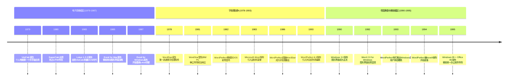
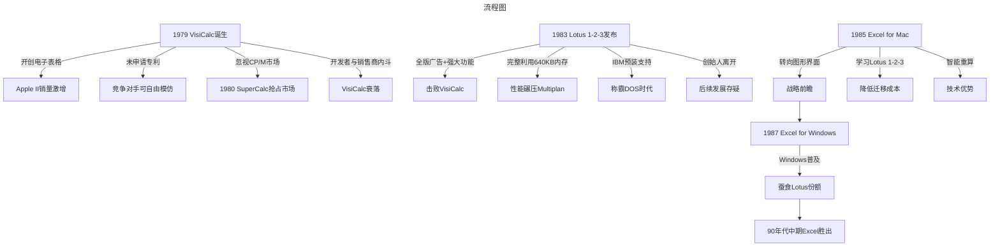
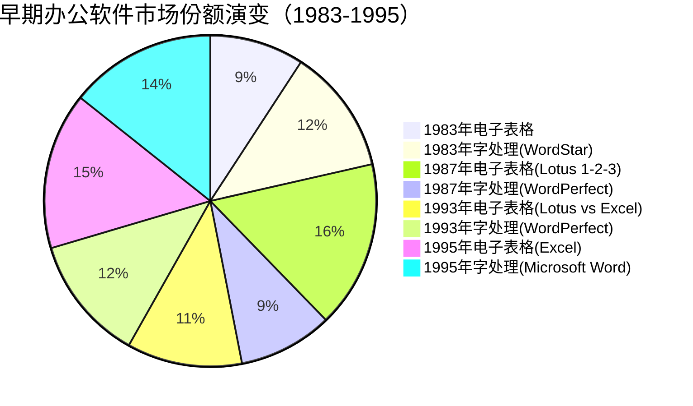

# 办公软件黎明史：从VisiCalc到Lotus帝国

> **适用范围**：技术管理者、创业者、投资研究者、产品经理及对科技商业史感兴趣的读者；适用于战略复盘、案例研讨与决策参考场景。
>
> **更新摘要（v2 · 2026-08 更新）**：
> - 结构化升级为 6 节骨架（导言 / 核心方法论 / 关键流程 / 工具与实战 / 常见误区 / 进阶延展）
> - 保留全部原文 Mermaid 图、表格、数据与术语英文对照，并为 Mermaid 图补充 frontmatter 与图后解读
> - 将原「参考资料/附录」并入第 6 节「进阶延展」，便于延展阅读

## 1. 导言

### 引言：被遗忘的黎明

如果说起老牌软件帝国微软赖以生存的两架马车，第一肯定是操作系统——字符界面时代的DOS系列和图形界面时代的Windows系列，第二就是著名的Office系列办公软件。在很长一段时间里，这两架马车如同"印钞机"一般，给微软带来了滚滚财源。

但进入新世纪后，随着手机和平板电脑的异军突起，微软在操作系统上的优势已经不再那么重要。Windows这架马车虽然依旧可以提供资金支持，却已失去光辉未来。然而，其办公软件这架马车不但没有失去活力，反而以Office 365的形式在云计算转型中扮演了不可或缺的角色。

我们很多人一直以来有种错觉，觉得微软的Office软件是天经地义的行业标准。**并非没人发起过对Office的冲击**：开源的Star Office、谷歌的Google Docs都曾发起过进攻，但这些战斗最终都偃旗息鼓。

历史总容易被遗忘。有一个事实是我们这一代人不知道或者不记得的：**微软在办公软件领域确立统治地位还只是20世纪90年代中后期的事情，而办公软件的诞生可以追溯到20世纪70年代末个人电脑诞生的初期。**

在那个年代，为了争夺办公软件领域的统治地位，一大批在文字处理、电子表格等领域颇有建树的企业崛起又陨落。在这些企业中，微软只是一个强有力的竞争者——而且最初还是一个屡战屡败的竞争者。

本文将带你穿越回那个激情燃烧的黎明时期，一起回顾VisiCalc如何开创电子表格时代、WordStar如何定义字处理软件、WordPerfect如何凭借极致服务登顶、Lotus 1-2-3如何建立电子表格帝国——以及它们最终如何一个个倒下，将舞台让给了微软。

> 上图展示了关键节点与演进路径，结合正文时间线可直观把握事件因果与战略转折。

---

## 2. 核心方法论

### 第一章：VisiCalc——电子表格的创世神话

#### 1.1 一个MBA学生的烦恼

如今的办公软件里，Excel对于很多人来说绝对是不可或缺的一部分。很多数据处理工作都要用它来完成，作为电子表格的集大成者，Excel达到了其他软件无法企及的高度，为微软这个软件帝国带来了滚滚利润。

但是你可能不知道，**Excel并非电子表格的首创产品**。

让我们把时光调回1977年。那个时候，在哈佛大学就读的丹·布里克林（Dan Bricklin）突然就觉得烦了：他攻读的是工商管理硕士，天天就是做各种表格的计算，涉及非常单调的繁琐操作。那个年代并没有什么好用的软件，能用的无非就是纸和笔。

于是这位本就有编程经验、并且学习过Basic的同学灵机一动，跑进机房开始写一个软件，以便自己可以轻松完成作业。为了显示自己的聪明才智，他把自己写了这样一个软件的事情告诉了导师。工商管理学院的导师通常都有商业嗅觉，导师看到后眼前一亮，拍拍布里克林的肩膀说："小伙子有前途，你这个东西就是为我们这样的工商管理人士量身定做的啊，要不你把这个东西好好包装一下，写得好一点，然后商业化了吧。"

布里克林听了以后深受启发，觉得这里有商机；但他当时还是个穷学生，电脑这个东西在1977年还是非常昂贵的稀罕物件。一没钱二没电脑的布里克林，有点举足无措，不知该如何继续下去。

这时Personal Software公司的老板丹·费尔斯塔拉（Dan Fylstra）听说了这件事，于是非常慷慨地赠给布里克林一台当时著名的苹果二代个人电脑。这台电脑，让有编程天赋的布里克林终于得以完善了自己的软件——**第一款电子表格软件就此诞生**。

#### 1.2 改变世界的发明

这个软件是这样设计的："行"是数字，列是字母，所以A1, A2, B1, B2……这样就表示了整个电子表格。是的，没错，是不是很熟悉，很像Excel？今天大家熟悉的Excel其实就是借鉴了这种想法。

两位开发人员把软件命名为**VisiCalc**，即将Visual和Calculation这两个单词各取一部分。他们同时成立了一家软件开发公司叫作Software Arts，专门进行VisiCalc的开发。

与此同时，作为对当初获赠一台昂贵的苹果二代电脑的回报，这个VisiCalc的销售被委托给了Personal Software公司来负责。这也是因为那时软件开发人员还没有那么受人重视，所以软件销售一般会通过专门的销售公司去做。行规大致是这样的，软件销售公司给开发者的软件授权费一般不会超过销售盈利总额的18%。

但是Personal Software和Software Arts达成了一个不太符合业界规矩的协议：**Personal Software给Software Arts支付的软件授权费用是销售盈利总额的1/3**。至于为什么给予了这么高的比例，我不得而知，但正是这个软件授权费，为以后两者之间的矛盾埋下了伏笔。

#### 1.3 杀手级应用与苹果的崛起

VisiCalc作为给苹果二代个人机开发的软件，一开始反响并不大。然而后来不知道这个Personal Software怎么和苹果公司联系上了，于是苹果公司开始在机器中预装这个软件。

然后见证奇迹的时刻到了——**这个软件就此出乎意料地成为爆款，获得了大家的喜爱，不到一年便成为苹果机器上最为畅销的个人软件**。更为奇葩的是，很多人买苹果电脑的目的，只是为了能够使用这个软件。

这样一来，情况就完全不一样了：**软件居然大大促进了硬件的销售**。于是苹果越发重视VisiCalc了，有段时间甚至出现了"苹果机搭载VisiCalc"是最佳组合的宣传。这个时候，卖软件的Personal Software看到软件如此好用，赶紧就把自己的公司改名成了VisiCorp，以此来彰显自己就是那个卖VisiCalc软件的公司。

在河山一片大好的情况下，VisiCorp和Software Arts之间携手共进，迅速把这款软件往苹果以外的机器上铺开来。大家都有钱赚，这显然是一段美好的蜜月期。

#### 1.4 窝里斗与外部威胁

但是我们知道的，很多时候可以共患难，却难以同富贵。这两家公司一家做软件，一家卖软件，到底谁的贡献更大呢？

从VisiCorp的角度来看，做生意的人辛辛苦苦地铺进去很多成本，却要付出比行业基本价来说更多的利润，有种"宝宝心里苦，宝宝受委屈了"的感觉。而Software Arts的两个哥们显然不是这样想的。这款爆款软件赚钱赚到手抽筋，他们觉得自己才是更大的贡献者：没有人把软件做出来，拿什么东西去卖啊？

这两方之间的龌龊就这样开始了。两者之间有过协议，在固定的时间内要提供新版的软件。Software Arts的人就经常故意拖着，因为他们希望VisiCorp给出更多的钱；而VisiCorp的人自然拖着不给钱，因为他们想通过拖钱的方式来再度谈判降低支付比例。

以上算得上是内忧了，外患则来源于同行。**在VisiCalc横扫很多机器的时候，他们忘记了给CP/M做开发**。CP/M是当时很主流的一款操作系统，VisiCalc忘记了这个重要市场，也因此赋予他人可乘之机。

事实上，1980年一家叫作Sorcim的软件公司迅速出手，开发出了一个叫作SuperCalc的软件。这款软件运行于CP/M，迅速占领了市场，而且其软件功能比VisiCalc还强一些。此时，VisiCorp和Software Arts已陷入长久的征战，对手在进攻，这两家公司却就钱的问题开始对簿公堂，一路折腾。

#### 1.5 遗憾的专利失误

VisiCalc的故事多少有些让人扼腕。除了窝里斗的结果，**布里克林犯了一个在今天看来是常识性的错误：他没有替自己的软件设计申请专利**。

换句话说，如果他申请了专利，那么微软今天每卖出一份Excel都要向他交一份专利费，那么几十年里伴随微软在办公领域的扩张，布里克林也早就赚翻了。"一失足成千古恨"，这句话真是太有道理了。

但是退一步讲，在1977年的时候，计算机的普及程度也远非今天能比，那时写了软件却不知道申请专利，可能也是常态。如果你我回到1977年，穿越变身当时的布里克林，是不是能比他做得更好一些，也不好说。

总体来看，VisiCalc的故事倒是很好地印证了一句话：**很多成功的公司都是自己作死**。无论是开发者还是销售商都觉得自己亏了，双方却又没有真正地协商解决问题。此外，对于专利不够重视，没有为自己的发明申请专利，也是让竞争对手可以随意抄袭的主要原因。

---

### 第二章：WordStar——字处理软件的开山鼻祖

#### 2.1 从专用到通用的跨越

20世纪70年代，王安电脑公司的字处理机应运而生。这是一种结合了电脑和打字机的机器，它可以让用户方便地在电脑上打字、修改，等文档成型以后再打印出来，这一过程节省了大量的纸张。这一功能类似于今天的字处理软件Word，但那是一台特殊的电脑，软件硬件一起卖。

当初，给著名的个人计算机厂商IMSAI打工的西摩·鲁宾斯坦（Seymour Rubinstein）决定离职创业，MicroPro公司由此诞生。西摩雇用了程序员约翰·巴纳比（John Barnaby）开发了一款主供研发人员使用的文字处理程序WordMaster，因此有了第一桶金，但远远不够发家致富走向幸福生活的。

作为一个生意人，他很快把目光投向了通用字处理软件市场。首先，他搞到一份研究报告，其中详细分析了IBM、王安电脑和施乐公司的字处理软件，各大厂商分别有一些什么功能一目了然。西摩开始让程序员巴纳比继续开发软件，补充添加各大软件厂商拥有的功能，并希望将产品打造成通用的字处理软件来销售。

因为当时最流行的操作系统是CP/M，这个软件也是专门为CP/M编写的。为了区别于老款软件，西摩把软件改名为**WordStar**。**1978年，个人计算机上的第一款通用字处理软件就这样诞生了。**

#### 2.2 巅峰时刻

软件非常成功，西摩自己公布的数据显示，差不多8个月内就卖了5000份！当时的软件市场毕竟不能与今天同日而语，买得起个人计算机在全美国也是屈指可数，5000份已经是个天文数字了。

1981年绝对是WordStar发展过程中很重要的一年。这一年IBM推出了自己品牌的PC机，西摩紧跟"蓝色巨人"的潮流，迅速推出了在IBM PC机上运行的WordStar，并将操作系统也换成了DOS。就是这一年，**WordStar在个人文字处理市场上确立了统治地位**。

WordStar有哪些独特的地方呢？有一点特别知名，就是它最早提供了其他编辑软件所不具备的**"所见即所得"功能**。当然，这一功能在那时还比较简单，只是可以即时在屏幕上显示出斜体和黑体。但即便如此，也让它比起其他软件，包括专门的文字处理机器更受欢迎。

1983年，著名的BYTE杂志宣称：WordStar毫无疑问是PC市场上最为著名，并且很可能是最为广泛使用的字处理软件。同年，新发布的WordStar 3.3更让MicroPro占据了整个个人计算机软件市场10%的份额。

1984年，MicroPro上市，同时确立了自己在计算机软件市场的统治地位，**成为全球公认最大的纯软件公司**。这个名头后来被莲花公司和微软相继获得，但那是以后的事情了。1984年的个人计算机软件市场，属于MicroPro和它的WordStar。

#### 2.3 盛极而衰的内忧

俗话说得好，盛极而衰，这真的是"放之四海而皆准"的话。1984年，也正是WordStar由盛转衰的开始。

我在研究一个又一个企业的发展历史时，总会发现很多企业成为了某个领域的世界第一，然后却转而衰败。只有少数企业，在多重领域不断厮杀，最终奠定了软件帝国的地位。所以，**世界第一，其实并不是那么好当的**。

WordStar的烦恼首先来自于竞争对手。当时的竞争对手主要有两个：其一是成立于1979年的WordPerfect公司，产品WordPerfect相当不俗；另外一个是在操作系统和编译器领域小有建树、想要进军应用软件市场的微软。

然而，**WordStar的问题更多还是来自于自身**：

**第一个问题是技术债务**。当软件从CP/M挪到DOS操作系统时，MicroPro只是做了一个简单的移植：最初的版本并没有解决CP/M只能用64KB内存，而DOS可以支持640KB内存的事实。以至于用户发现，如果在内存里面创造一个虚拟磁盘，把文件复制进虚拟磁盘以后再用WordStar打开，速度要快无数倍，这让用户们很苦恼。

**第二个问题是交互设计的滞后**。WordStar成型得太早，早期还没有鼠标，软件操作需要通过快捷键来进行，而键盘上的快捷键往往是两三个键的组合，非常难记。当然WordStar也没有所谓的下拉式菜单，所以用户无法用鼠标选择菜单完成操作。

早年的时候功能不是很多，WordStar的使用者也不需要记忆太多快捷键。但是等到WordStar的功能越来越丰富，要让WordStar顺利工作起来，使用者或者必须记熟所有的快捷键，或者只能随时查手册。而微软新推出的Microsoft Word已经开始支持鼠标和下拉式菜单，从而大大简化了用户入门使用的门槛。

#### 2.4 致命的内斗

伴随着竞争对手的产品越来越好入门，WordStar自己却陷入了**严重的内部斗争**：

**标志事件一：核心开发人员出走**
MicroPro的WordStar核心开发人员离开MicroPro，并创立了New Star公司。New Star公司做的正是类似于WordStar的产品，在市面上直接和WordStar展开竞争。现在已经无法考据其核心人员的离开究竟是何原因，比较靠谱的说法是政治斗争。而且，为什么一家公司的核心人员可以创立新公司，开发类似的产品，却不需要承担法律责任呢？或许你可以去研究下。这多半又是一起之前没有申请专利，导致知识产权不明确的案例。

**标志事件二：产品线分裂**
AT&T当年作为美国最大的电话公司准备进军个人计算机市场。它打算推出一款基于UNIX操作系统的机器，并在自己的机器上配备一个办公软件。于是AT&T找了当时著名的MicroPro，让其替自己开发一套基于UNIX的WordStar。

AT&T并不知情的是，WordStar的核心开发人员早就离开WordStar去开设New Star创业了，而MicroPro也毫无UNIX的开发经验。西摩找到某个程序员开发了UNIX下的WordStar仿制版本，决定将他招至麾下。这个UNIX下的WordStar版本和公司已有的WordStar版本在功能上并不完全重合，西摩觉得要让两者统一起来代价太大，不如就拿这个UNIX版开始销售吧，并将这个软件命名为**WordStar 2000**。

这款新软件是用C语言开发的，因为C语言在DOS和UNIX下均可以成功编译，所以WordStar 2000又同时出了DOS版。**正是这个决定让MicroPro陷入了两难的境地**。

WordStar 2000和WordStar各自有一些用户喜欢的功能，各自又都缺一些用户需要的功能。面临两选一的问题，用户们也很纠结。而这种"二选一"也让公司内部的所有资源，从开发到销售都一分为二。公司内部这两个产品之间的利益争斗自不必说，而西摩所领导的公司因为WordStar核心开发人员的出走，也不具备技术力量在老WordStar里开发WordStar 2000那些备受用户欢迎的功能。

这种全方位的内斗，加之任何一款产品都无法让用户完全满意，用户又不愿意同时购买两款产品，致使WordStar的市场占有率逐年下降。

#### 2.5 最后的挣扎与覆灭

西摩看到情况不对，赶紧以收购New Star公司的方式把之前核心人员重新召了回来，然后让这些老核心人员在WordStar的源代码上开发新版本4.0。新版本的推出，让MicroPro暂时稳住了市场。

照理来说，接下来MicroPro应该开始整合WordStar和WordStar 2000两款软件，把优秀的软件功能都整合进一个新产品里去了。因为这样既可避免用户的两难选择，也可以让公司的销售资源重新集中到一个产品下面。

但是事情并未这样发展。MicroPro准备开发WordStar 5.0。因为重新召回的那些核心开发人员，坚决抵制WordStar 2000的任何功能，并表示一定要推陈出新；即使不得不采用的合理功能，他们也要变着法子使用其他方式呈现给用户，并重新设计实现。

但是原来这些功能在WordStar 2000里面的使用方式已经得到用户的普遍认可，WordStar 5.0却偏偏要"吃螃蟹"，换作未被用户认可而且很可能是更难用的方式呈现软件功能。**这个奇葩的政治斗争的产物WordStar 5.0，后来因为极其难用，面市第一天就招来谩骂、恶评如潮。**

WordStar就这样被用户抛弃了。卖不出产品了，曾经的"全球软件老大"MicroPro终于迎来了它破产的一天。**MicroPro的失败，真是印证了一句话：No Zuo No Die（不作不死）。**

---

### 第三章：WordPerfect——服务致胜的字处理王者

#### 3.1 大学生与教授的创业传奇

前面说到，微软在正面进攻WordStar的过程中，做了一回办公软件战场的"螳螂"，而背后的"黄雀"就是这个字处理软件WordPerfect。它一路攻城略地，成功战胜了微软的Word和MicroPro的WordStar，一举坐上字处理市场的头把交椅。

**WordPerfect是美国杨百翰大学的学生布鲁斯·巴斯蒂安（Bruce Bastian）和教授艾伦·阿什顿（Alan Ashton）开发的**。这个软件最初开发在Data General的个人计算机上。Data General作为一家个人计算机制造商，在那个个人计算机百花齐放的年代，并没有太大的知名度，所以WordPerfect最初推出来的时候也没多少人知道。

但是1982年，两位开发者把WordPerfect移植到了DOS系统，而DOS是IBM个人计算机及其兼容机上的操作系统，这让软件的影响力变得不可同日而语。

#### 3.2 技术创新：绕过操作系统的性能奇迹

在向DOS移植的过程中，WordPerfect的作者一开始打算用C语言开发。但是就像其他人遇到的问题一样，市面上尚不存在一个成熟的C编译器，于是他们选用了汇编语言。

但是和WordStar以及Microsoft Word不同，**布鲁斯决定绕过操作系统层，用汇编语言对屏幕直接进行绘画和操作**，而竞争对手则是通过操作系统DOS的API来实现同类操作的。

这个决定在当时显得至关重要。虽然这显著增加了WordPerfect的开发难度，但却让它在当时的硬件条件下相较于WordStar和Microsoft Word表现出了超强的性能。**性能直接影响用户体验，WordPerfect因此甩了其他字处理软件一条街。**

#### 3.3 服务至上：免费培训与贴心客服

WordPerfect的另外一个创新在于它给用户提供的服务方式。与竞争对手不同，它基本不做广告，而是把钱花在派人去客户那边进行培训和普及上。这种服务不仅仅被作为主要的营销手段，而且**免费提供**。相反，各大竞争对手对这种服务则要收取高昂的服务费用。

不但如此，为了让在电话线另一头等待的客户不至于无聊，WordPerfect还专门让接线员给客户讲笑话。如此贴心的服务，让客户一用上这个软件就觉得很安心。

当微软开始用大量广告费宣传Word软件的时候，WordPerfect公司把公司账单刊登出来，账单中有数额巨大的电话费。WordPerfect表示："我们不浪费钱打广告，我们只是全心全意为客户服务。"高额的电话费用成了WordPerfect贴心服务的最好证明。**微软的广告打水漂，WordPerfect则在这种贴心的客户服务模式下攻城略地。**

#### 3.4 功能演进：从3.0到6.0的辉煌历程

不但服务很好，WordPerfect软件本身做得更是好用：

**1983年：里程碑式的3.0版**
具有最大的突破是对各种打印机的支持：通过自带驱动的方式，WordPerfect当时支持了50多种打印机；接下来很短的时间内，这个支持数量又迅速增加到100多种。使用WordPerfect的用户完全不用担心打印问题，但对于使用其他字处理软件的用户，单单打印机的配置就是一个非常让人头疼的问题。

**1986年：最重要的4.2版**
WordPerfect针对律师事务所重点进行了功能增强。它引入了页脚和页面编号、自动行号等功能，第一次让自己的产品登录对打字软件要求最为严格的律师事务所行业，而其竞争对手几年后依然不被律所采购。**这让WordPerfect不但在功能上远远超过了Microsoft Word，更是第一次在市场份额上超越WordStar，成为名副其实的头号字处理软件。**

**1989年：5.1版的全面升级**
开始支持菜单、支持表，而且增加了打印预览功能——这是第一次有字处理软件可以让用户在电脑上预览文章的打印效果。

**1993年：6.0版的巅峰之作**
在字处理软件里增加了今天我们非常熟悉的"所见即所得"的编辑功能，让用户可以在打印预览模式下直接编辑文件，并立刻看到编辑效果。

同时代的WordStar忙于内斗无所事事；微软则在不懈地、一步一个脚印地继续发行Word的新版本，但是这些版本和WordPerfect比起来功能差距太大，毫无竞争力。**WordPerfect一度成为字处理软件的事实标准。**

---

### 第四章：Lotus 1-2-3——莲花公司的电子表格帝国

#### 4.1 另类创始人的创业故事

莲花公司曾经是20世纪80年代到90年代最大的软件公司，在美国软件发展史上具有重要的地位。它起源于一款电子表格软件，这款软件曾经占领整个电子表格市场超过80%的份额，并让电子表格软件的鼻祖VisiCalc两年内关门大吉，也让微软雄心勃勃推出的Multiplan搁浅。

提到莲花公司，不得不说下它的创始人米切尔·卡普尔（Mitch Kapor）。这位创始人就像一位特立独行的"叛逆者"，一向游走在主流文化之外。他早年特别喜欢摇滚乐，爱好吸毒，曾经进入耶鲁大学攻读心理学、语言学、计算机学尤其是控制论，并开始对计算机产生兴趣。

毕业以后他的工作一度飘泊不定，做过电台主持人，当过滑稽戏演员，之后还远赴瑞士参加冥想学习，希望可以练出特异功能。再后来，他还曾在精神病院打杂。谁能想到，他在日后会成为与盖茨并称"美国软件业双子星"的变革者呢？

1978年，苹果二号降到1500美元左右，他抵押自己的立体声音响设备，掏空腰包买了一台苹果电脑，之后一边自学一边给人提供计算机技能咨询。再后来，他还跑到MIT读MBA，终究因为兴趣不在此处，很快跑去一家计算机公司上班。

上班期间他仍在寻求下一个机会，而恰巧VisiCorp的老板丹·费尔斯塔拉正有新的打算。VisiCorp就是被授权独家代理销售电子表格软件VisiCalc的公司，为了让VisiCalc更好用，VisiCorp的老板找到米切尔，让后者帮忙开发VisiCalc的画图插件。按照协议，插件的所有权双方各占一半。米切尔开发了两个插件，后来被以VisiPlot和VisiTrend的名义和VisiCalc一起出售给用户。

到1982年的时候，VisiCorp的老板想买断这两个插件的所有权，双方认为这两个插件总价值为120万美元，米切尔因此分到60万美元。**这第一桶金让米切尔认识到，自己做老板才是赚钱最快的途径。**

#### 4.2 Lotus 1-2-3：改变游戏规则的产品

1982年，米切尔决定自己开公司。大概是始终难忘当年冥想训练的那段经历，他把公司命名为"莲花"（Lotus），这个在佛教里面预示着"神秘而纯洁"的东西。

他想做的产品非常简单：因为自己前面做了两个画图插件，又接触了电子表格，后来不知又从哪里听说了数据存储和管理的重要性，于是决定将这些功能集中打包成一个产品——于是著名的**Lotus 1-2-3诞生了**。在这个软件名中，1代表电子表格，2代表画图，3代表数据的存储和管理。

#### 4.3 史无前例的豪赌式推广

米切尔决定玩票大的，他花巨资请来了知名咨询公司麦肯锡做软件的推广宣传——**这一软件推广方式是历史上非常著名的一次豪赌**。麦肯锡在《华尔街日报》刊登了全版广告来宣传这个新产品，这种宣传做法在之前的软件发布史上从未有过，而且价格高昂，大大突破了以前软件公司在宣传上的预算。

米切尔当时还在创业，没有多少资金，却大把撒钱搞宣传。如果宣传不成功，产品不能顺利卖出，等待米切尔的或许就只有破产了。

幸运的是，新产品神秘的命名、组合的功能，以及在《华尔街日报》的全版广告，给用户留下了非常深刻的印象。而此时微软对标VisiCalc出品的Multiplan才刚刚发布不过一个月时间，就这样被米切尔以非常规的宣传方式压制得毫无声响。

#### 4.4 技术优势：压倒性的性能领先

大肆宣传之余，这个软件的功能也绝对不弱。**Lotus 1-2-3是第一款完全支持640KB内存的电子表格软件**。

和CP/M只支持64KB内存比起来，微软开发的DOS操作系统支持640KB的内存，理论上来讲软件就应该能利用所有的640KB内存吧？但微软自己开发Multiplan的时候，因为考虑到软件要在不同操作系统下都能运行，所以非常保守地使用了64KB内存。而深知内存少性能差、没办法好好画图的米切尔，则采取了比微软激进得多的做法：**有多少内存用多少内存**。

这样一来，Lotus 1-2-3不仅品牌响亮、功能全面，更是速度一流。

Lotus 1-2-3还有一个特别的地方：在磁盘上，莲花公司不但存储了软件，还给用户存了一份软件使用说明书。这个做法和当时市场上动辄几百页的纸质说明书比起来，要先进得多，因为用户可以用电脑非常方便地检索所需信息了。

#### 4.5 席卷市场与IBM的青睐

Lotus 1-2-3似乎注定要在市场上大放异彩，它迅速占领了市场，打得VisiCalc毫无招架之力，而发布不久的微软Multiplan更是一点声响都没弄出来就挂掉了。因为当时拥有电脑的人并不多，市场总量有限，买了Lotus 1-2-3的人自然就不会再去买VisiCalc，VisiCorp渐渐入不敷出，**三年后宣告破产**。

Lotus 1-2-3的成功，也让当时PC机的主宰者蓝色巨人IBM开始心心念念起来。原来IBM和微软的合作，尤其是DOS方面的合作非常愉快，而VisiCalc也是IBM在PC机上主推的几个软件之一。但是Lotus 1-2-3的全方位领先，让IBM看到也许未来不属于VisiCalc，IBM觉得应该扶持一下这个新崛起的莲花公司，以免Lotus 1-2-3只专注于苹果机的开发，让IBM的PC机失去机会。

**于是，IBM也开始在机器上主推和预装Lotus 1-2-3。**

#### 4.6 创业第一年的奇迹

米切尔创业第一年推出的软件Lotus 1-2-3，当年销售额就高达5300万美元，远超他几百万美元的预期，从而让莲花公司成功上市——**这可说是史上最快的上市速度了**。第二年销售额飙升到1.5亿美元，第三年更是高达2.5亿美元。在此之前，从来没有任何公司凭借一款软件以这样的速度在个人软件市场大爆发的。

公司成功了，米切尔的江湖地位也是急剧上升。1985年，他的影响力迅速超过比尔·盖茨，成为当年最为炙手可热的人物。

#### 4.7 激流勇退：创始人的离开

然而他却在1986年选择离开，表示自己并不适合经营公司，也不喜欢权力，而是偏爱做自己内行的事，现在的工作已然变了味。

退出商业圈子后，他跑去MIT找了份访问教授的工作开始教书育人。不过安稳注定与他无缘，一年后他还是觉得软件开发有意思，出来开了一家叫作On的公司，一干就是三年，只是这家公司却没有重现莲花公司的风采。

**莲花公司的故事让我们看到了一个别具一格的智者**：米切尔无论是创业、打造软件、宣传产品还是激流勇退，都透露着各种不安分。作为创始人他对莲花公司极为重要，但是莲花公司却留不住他。那么靠一款产品一炮而红的这家公司，怎么才能在没有领袖的情况下长久存活呢？

> 上图展示了关键节点与演进路径，结合正文时间线可直观把握事件因果与战略转折。

---

## 3. 关键流程

### 第六章：历史转折点——图形界面的十字路口

#### 6.1 Windows时代的到来

"花开两朵，各表一枝"。20世纪80年代中期开始，微软除了做字处理软件还在开发一个新的图形界面，就是后来著名的Windows。Windows 1.0虽然表现并不突出但是却很重要：这个Windows版本实现了对办公软件比如Excel和Word所需要的图形界面的支持，为微软的办公软件向图形界面系统迁移提供了基础。

但当时Windows的市场占有率整体上还不是很高，DOS依然是最主流的操作系统。**这正是所有DOS时代霸主面临的最大考验：是否应该转型？何时转型？**

#### 6.2 WordPerfect的战略犹豫

WordPerfect 5.1的成功让WordPerfect公司非常犹豫：是应该继续巩固DOS市场，还是应该进军Windows市场？前者可以让WordPerfect继续完善盈利的产品，后者则有很大的危险性，因为WordPerfect并不清楚Windows 1.0作为一个操作系统是不是有未来、能不能成功。

而微软及时推出了Word的Windows版本。**等到WordPerfect想明白决定进军Windows市场时，Microsoft Word已经面市两年多**，而且因为Microsoft Word是第一个可以在Windows下跑的字处理软件，随着Windows市场占有率在这两年里的不断攀升，它已经不容小觑。

醒悟过来的WordPerfect匆忙之中推出Windows版本，但因为匆忙很多都是DOS代码的直接移植没怎么测试过。WordPerfect的组合键和Windows自己的组合键产生了大量冲突问题频出。更重要的是Windows下的打印机驱动模式和DOS下有所不同，而WordPerfect最引以为傲的自带打印机驱动的功能到了Windows下居然罢工了。

可以说仓促推出的WordPerfect 5.2这个Windows版非常糟糕，用户抱怨连连。虽然后来WordPerfect公司显示出了强悍的开发能力，将这些问题在接下来的版本WordPerfect 6.0里逐渐修复，但是**市场先发优势已去**。伴随着Windows的普及，Microsoft Word在新时代里牢牢站稳了市场。

#### 6.3 Lotus的迟缓应对

同样的命运也降临在了Lotus 1-2-3身上。

面对Excel的步步紧逼，莲花公司CEO吉姆·曼兹（Jim Manzi）做出了一个关键决策：**避免与微软正面交锋，另辟企业协同战场**。1984年曼兹秘密委托Iris公司（由莲花前员工雷·奥茨创立）开发一款企业级通信与协同软件——这就是后来的Lotus Notes。

曼兹对奥茨充满信心，但莲花内部沉浸于Lotus 1-2-3成功喜悦中的高管们强烈反对这次转型，最终导致12个副总裁陆续离职。

1989年Lotus Notes推向市场并大获成功。这是一个主打企业级通信与协同的客户端/服务器软件，集合了电子邮件、日历、通讯录、文件存储、审批流程等功能。Lotus Notes给人的感觉**极其超前**，仿佛是在汽车还没跑起来的年代里混进了一辆跑车。

但在电子表格的主战场上，莲花公司对Windows的响应同样迟缓。当Excel for Windows在1987年发布并快速夺取市场份额时，Lotus的应对产品"爵士乐"（Jazz）晚了三个月登陆Mac且只是简单的DOS版本移植，Bug丛生、性能糟糕。

**到90年代中期，Lotus 1-2-3的市场份额已被Excel大幅侵蚀**。1995年IBM以64.5美元/股的价格（当时股价32美元）恶意收购莲花公司，郭士纳主导的这次收购是为了IBM从硬件向软件和服务转型的战略布局。

> 上图展示了关键节点与演进路径，结合正文时间线可直观把握事件因果与战略转折。

---

## 4. 工具与实战

（本节内容在原文中较为简略，可结合第 2、3、4 节相关段落交叉理解。）

---

## 5. 常见误区

### 第五章：微软的螳螂之路——两次失败与坚持

#### 5.1 第一次出击：Multiplan的惨败

中国有句话说得好，"螳螂捕蝉，黄雀在后"。奔走在办公软件帝国之路上的微软，就曾经一次次地成为了这样一只螳螂。

1981年，微软离成为后来的软件帝国依然有巨大差距，但已在操作系统和编译器领域颇有建树，算是很成功的软件公司了。比尔·盖茨在成功建立了操作系统和编译器领域的地位后，决定进军办公软件市场。**他选择的第一个对手，就是他认为的"软柿子"：电子表格软件VisiCalc。**

那时候，西雅图依旧是一片软件人员的荒芜之地，而硅谷则是各大技术人员的中心。当年最为著名的施乐PARC研发中心则是数一数二的人才聚集之地，比尔·盖茨就到这里来寻找他需要的人才，为新成立的应用软件部门物色第一位员工。

盖茨成功物色到了一位名叫查尔斯·西蒙尼（Charles Simonyi）的大师。此人是匈牙利人，博士学位，曾先后在加州伯克利大学和斯坦福大学学习深造。他在微软做的最有广泛影响力的事情之一，就是后来被命名为"匈牙利命名法"的变量命名法则。他的另一项伟大成就是先后两次乘坐"联盟号"宇宙飞船登陆空间站。

1981年的查尔斯还没有后来那么英明睿识，但已经动向到了要怎样开发电子表格。他的到来让微软开始了一个名字叫作**Multiplan**的计划。这个产品是一个早期的电子表格，最主要的功能是可以支持多个表以及多个窗口，此外还得支持多个操作系统。

这些功能对于"大神"来说都不是问题，查尔斯想要发明的是一个新东西：**菜单**。"菜单"在今天已经是寻常物件，一个软件要是没有个能用鼠标点点选选的菜单简直不可思议。但是在那个靠快捷键操作、鼠标还没普及的1981年，查尔斯决定用菜单来为新软件保驾护航的做法无疑非常聪明。

当1982年微软正式把Multiplan同时在多个平台上推出时，比尔·盖茨也是非常激动。这个软件比起VisiCalc简直一个天上一个地下。然而命运总是弄人，市场上出现了一个新的软件：**莲花公司的Lotus 1-2-3**。

作为大牛的查尔斯决定亲自看看这个软件是什么，而比较结果让这位"大神"倍感挫败。很多年后查尔斯接受媒体采访时说，当他看到Lotus 1-2-3的时候就知道自己的第一个产品完蛋了。对方实在是段位太高，完全不是他能想象的。除了认栽，他别无它法。

果然，时隔两年Multiplan占据了6%的市场，VisiCalc在两大对手的挤压下濒临破产，而**Lotus 1-2-3则占据了整个电子表格市场的绝大多数比例**。做了一次螳螂的微软就这样被黄雀赶下马，Multiplan当然也不好意思再卖下去了。

#### 5.2 第二次出击：Word的艰难起步

在电子表格市场上败北的微软总裁比尔·盖茨决定再次出击，将目标转向了另外一个办公软件：字处理软件。字处理软件市场此时正是WordStar横行的年代，其开发公司MicroPro在1984年成功上市，成为当时最大的软件公司，可谓风头一时无两。

但微软已经将鼠标在Multiplan里面运用得无比纯熟，比尔·盖茨很快察觉到了WordStar有欠缺的地方：这个软件需要用户记住大量快捷键，极伤用户体验。于是携着鼠标和菜单两大利器，比尔·盖茨和应用软件开发部的查尔斯自信能够在文字处理市场攻城略地。

最初微软打算使用MultiWord这个名字，借此让产品和MultiPlan相得益彰，但是这个名字已经名花有主，于是才有了今天我们熟知的**Microsoft Word**。这是一个多么朴实的名字啊。

1983年在Multiplan失败后一年，微软发布了Word软件，其最为显著的特点就是对鼠标的支持。软件一经推出便赢得无数赞誉，大家都说WordStar要倒霉了。

实际上WordStar占据了整个文字处理市场老大的地位很长时间。如果不是自己内乱后面的故事会怎样发展还真不好说。但历史终归无法改变和臆测。

微软还在Word里第一次使用了后来惯用的伎俩：**软件可以读取其他竞争对手的格式**，这次它瞄准的就是WordStar。那时比尔·盖茨和查尔斯一定对将来的好日子充满希望，但几个月后的销量表现却相当惨淡。

#### 5.3 第三者的崛起：WordPerfect的意外胜利

于是微软开始调研，却发现原来有一家叫作WordPerfect的公司，开发了一款叫作WordPerfect的软件。该公司是由大学生和教授合开的，又雇用了一群群的大学生挨家挨户上门去推销他们的软件，并为买了软件的公司提供无微不至的服务。

比如说购买了该软件的用户可以随时打免费的电话技术支持热线，由技术人员提供免费而无微不至的服务支持。在微软大张旗鼓做广告的时候，WordPerfect却通过这种宣传方式和服务方式一点一点地蚕食着WordStar的市场，并很快超过了Microsoft Word，成为市场上仅次于WordStar的字处理软件。

时间到了1986年，WordStar已经很久没有推出新品，又备受内耗之苦，市场占有率下降到了16%的份额；而WordPerfect则占据了整个市场销售份额的31%；至于Microsoft Word，在微软的各种努力下却只抢到了11%的市场份额。

幸好WordStar忙于内斗，WordPerfect虽然牛，但是显然没有Lotus 1-2-3那样统治整个领域，留给Microsoft Word的生存和发展空间依然很大。这次微软进军办公软件市场的努力虽然被黄雀给堵了，却也没有落到一无所有必须放弃的地步。

**两次战斗两次失败的微软依旧没有放弃在办公软件市场的努力**。微软这两次战斗失败的主要原因，并非是对当时市场上的霸主研究不够准备不足，而是没有注意到市场上也有和微软类似的竞争者在打造类似的产品，并且产品更为强大。所以眼观六路耳听八方，不仅仅要注意市场的霸主，观察周围潜在的竞争对手同样很重要。

---

## 6. 进阶延展

### 第七章：黎明时期的深刻启示——对AI时代创业公司的警示

#### 7.1 启示一：技术转型的窗口期稍纵即逝

回顾这段黎明时期的历史，最深刻的教训莫过于：**每一次技术范式转移都是格局重塑的最佳窗口期**。

- **VisiCalc**错过了从Apple II向IBM PC和多平台扩展的机会
- **WordStar**错失了从字符界面向图形界面迁移的关键时机
- **WordPerfect**在Windows时代到来时犹豫不决，最终因仓促推出的劣质产品失去市场
- **Lotus 1-2-3**在GUI时代反应迟缓，被Excel逐步蚕食

**对于2024年的AI创业公司而言，这个教训尤为珍贵**：
- 当前正处于从"工具辅助"向"AI原生"的范式转移期
- 那些在传统办公软件基础上简单叠加AI功能的做法，类似于WordPerfect直接移植DOS代码到Windows
- 真正的机会属于那些能够重新思考"AI时代的工作方式应该是怎样"的公司，就像当年的Excel重新设计了电子表格的交互模式

#### 7.2 启示二：内忧永远比外患更致命

办公软件黎明期的历史反复证明了一个残酷的真理：**大部分公司死于内忧而非外患**。

- **VisiCorp vs Software Arts**：利益分配矛盾导致双方对簿公堂，外部竞争对手乘虚而入
- **MicroPro的WordStar**：核心团队出走、产品线分裂、政治斗争导致自我毁灭
- **莲花公司**：创始人离开后缺乏强有力的领导层，战略方向摇摆不定

反观微软，虽然在产品层面屡次失败，但其组织始终保持着高度的凝聚力和执行力。**这种组织能力最终成为了微软最核心的竞争优势**。

**对当今创业公司的警示**：
- 在融资顺利、估值高涨时，更要警惕内部利益分配问题
- 核心技术人员流失往往是衰败的开始
- 产品线分裂、资源分散是致命伤
- 创始人的领导力和愿景至关重要

#### 7.3 启示三：先发优势不等于永久优势

VisiCalc是电子表格的开创者，WordStar是字处理软件的先驱，Lotus 1-2-3曾占据80%以上的市场份额——**但它们都没有笑到最后**。

**先发优势的本质是时间窗口**：
- VisiCalc的时间窗口大约3年（1979-1982）
- WordStar的统治期约5年（1981-1986）
- WordPerfect的巅峰约7年（1986-1993）
- Lotus 1-2-3的黄金时代约10年（1983-1993）

**每个窗口期都在缩短**，因为技术迭代在加速、用户期望在提高、竞争在加剧。对于AI时代的创业公司而言：
- 先发优势的价值正在被压缩
- 真正的护城河来自持续创新能力、生态系统锁定和网络效应
- 不要因为早期的成功而停止投入研发

#### 7.4 启示四：用户体验是最终的决胜因素

回顾这段历史，每一个失败者都在技术上有所建树，但最终输在了用户体验上：

- **WordStar**：快捷键复杂难记，而Word引入了鼠标和菜单
- **WordPerfect**：Windows版本体验糟糕，组合键冲突频发
- **Lotus 1-2-3**：面对Excel的智能重算和更好用的界面逐渐失去优势

**技术领先如果不能转化为用户体验的优势，终将被超越**。这一点在AI时代更加明显：
- AI模型的参数规模和benchmark分数固然重要
- 但用户真正关心的是：这个工具能否让我更快更好地完成工作？
- AI幻觉、输出不稳定、工作流整合不畅等问题如果得不到解决，再强的模型也无法赢得市场

#### 7.5 启示五：生态系统的力量不可低估

微软最终获胜的一个关键因素是**套件化策略**：将Word、Excel、PowerPoint等整合为Office套件，形成强大的协同效应和切换成本。

相比之下：
- VisiCalc只有单一产品
- WordStar在内斗中分散了资源
- WordPerfect专注于字处理单一领域
- Lotus虽然有Notes协同平台但未能有效整合

**AI时代的启示**：
- 单点突破的工具很容易被集成到更大的平台中
- 构建生态系统（API、插件、合作伙伴网络）比单产品更重要
- Notion、Figma等新一代工具的成功部分得益于其开放的生态策略

---

### 结语：黎明虽短，光芒永存

从1978年WordStar的诞生到1995年微软Office 95的统一天下，这短短十七年是办公软件史上最波澜壮阔的黎明时期。

在这段时期里，我们见证了：
- **VisiCalc**如何开创电子表格时代却又因内斗和战略失误而陨落
- **WordStar**如何成为全球最大软件公司却又因内耗而自我毁灭
- **WordPerfect**如何凭借极致服务和产品品质登顶却又在图形界面转型中折戟
- **Lotus 1-2-3**如何建立电子表格帝国却又在Windows时代走向衰落
- **微软**如何在屡战屡败中坚持不懈，最终凭借正确的战略判断和组织执行力赢得一切

这些故事告诉我们几个永恒的道理：

**第一，企业的生命周期往往比我们想象的要短得多**。即使是最伟大的公司，如果在关键技术转型期做出错误决策，也可能在短短几年内从巅峰跌落谷底。

**第二，内部团结和执行力往往比技术和市场地位更重要**。那些倒在黎明时期的企业，大多不是被竞争对手打败，而是毁于自己的内耗和混乱。

**第三，坚持和韧性是稀缺的品质**。微软的"屡败屡战"精神值得每一个创业者学习。失败不可怕，可怕的是放弃。

**第四，技术范式的转移是不可逆的**。无论是从字符界面到图形界面，还是从本地软件到云端服务，再到今天的AI原生——每一次转移都会淘汰掉一批旧玩家，也会造就一批新赢家。

站在2024年回望这段黎明时期的历史，我们不禁感慨万千。那些曾经叱咤风云的名字——VisiCalc、WordStar、WordPerfect、Lotus——如今大多已成为历史的注脚。但它们开创的技术、积累的经验、留下的教训，至今仍在影响着整个软件行业。

而对于正在经历AI革命的新一代创业者和从业者而言，这段黎明时期的历史提供了无比珍贵的镜鉴：**在技术变革的浪潮中，唯有保持敏锐的洞察力、坚定的执行力和开放的学习态度，才能在激烈的竞争中生存下来，甚至开创新的纪元。**

正如米切尔·卡普尔当年在《华尔街日报》投下的那则全版广告一样——**有时候你需要一场豪赌才能改变世界**。只不过这场赌局的筹码不再仅仅是广告预算和技术能力，更是对未来的洞察、对组织的驾驭、对人性的理解。

黎明虽短，但它照亮了整条道路。

---

*本文合并重写自原系列文章043-048，聚焦1979-1995年办公软件黎明期的详细历史，补充了最新视角的分析和对AI时代创业公司的启示。*

---

### 参考资料

1. 原始系列文章：043《办公软件的战斗：开篇》、044《VisiCalc：第一个电子表格软件的诞生》、045《WordStar：第一个字处理软件的故事》、047《WordPerfect：字处理软件的新秀》、048《Lotus 1-2-3：莲花公司的电子表格帝国》
2. Dan Bricklin访谈记录及VisiCalc开发历史文档
3. Mitch Kapor传记及莲花公司创业史料
4. Seymour Rubinstein采访及MicroPro公司档案
5. Charles Simonyi回忆录及微软早期应用软件开发史
6. 《硅谷之火》相关章节
7. Gartner《办公软件市场演变报告》（历史数据）
8. 斯坦福大学HAI《2025 AI指数报告》

---

*v2 结构化升级版 · 文件名保持不变：009-办公软件黎明史：从VisiCalc到Lotus帝国-【更新版】.md*