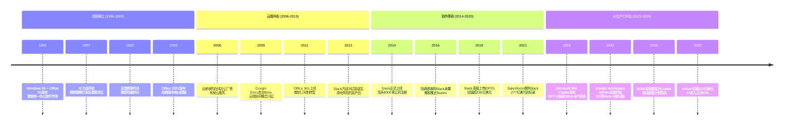
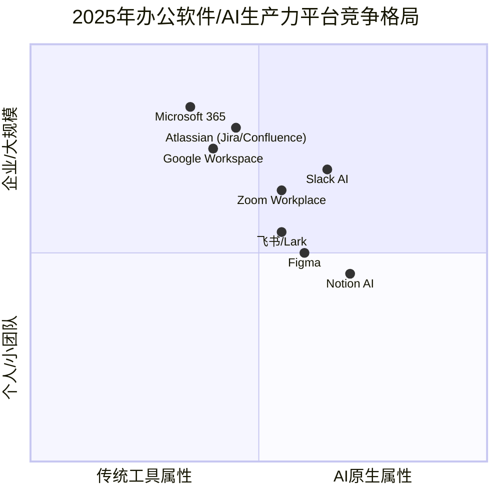
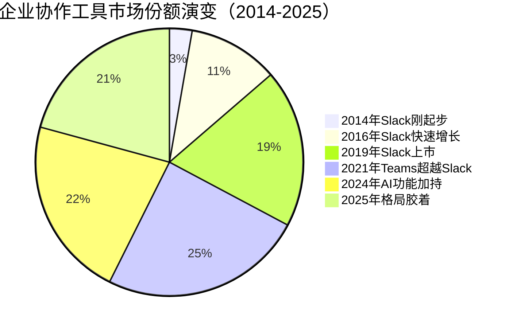

# 微软Office霸权与Slack的异军突起

> **适用范围**：技术管理者、创业者、投资研究者、产品经理及对科技商业史感兴趣的读者；适用于战略复盘、案例研讨与决策参考场景。
>
> **更新摘要（v2 · 2026-08 更新）**：
> - 结构化升级为 6 节骨架（导言 / 核心方法论 / 关键流程 / 工具与实战 / 常见误区 / 进阶延展）
> - 保留全部原文 Mermaid 图、表格、数据与术语英文对照，并为 Mermaid 图补充 frontmatter 与图后解读
> - 将原「参考资料/附录」并入第 6 节「进阶延展」，便于延展阅读

## 1. 导言

### 引言：从垄断到被颠覆的焦虑

如果说1979-1995年的办公软件黎明期是群雄逐鹿的时代，那么1995年之后的近三十年则是**微软帝国一统天下与新兴挑战者不断涌现**的时代。

1995年，Windows 95和Office 95的发布标志着微软在办公软件领域的绝对统治地位正式确立。曾经的对手们——VisiCalc消失、Lotus 1-2-3被赶超、WordStar破产、WordPerfect衰落——**在办公软件领域，微软看不到敌人了**。

比尔·盖茨在一次受访中表示："整个软件行业很美好，只有一些杂音。"他指的是Netscape、Oracle、IBM、Sun、EMC这五家企业。

然而历史证明，**这种自信（或者说傲慢）往往是危机的前奏**。从谷歌以云服务发起冲击到Slack在企业协作领域的异军突起，再到AI时代Copilot、Gemini、Notion AI等新一代工具的群雄逐鹿——微软的办公软件帝国从未真正安宁过。

本文将深入剖析微软如何建立并巩固其办公软件霸权、Slack如何成为数十年来最强劲的挑战者、以及AI革命正在如何重塑整个办公软件版图。更重要的是，我们将重新审视两个永恒的商业启示：**"内忧总是强于外患"**和**"敌人的出现常常出其不意"**——在AI时代的全新语境下。

> 上图展示了关键节点与演进路径，结合正文时间线可直观把握事件因果与战略转折。

---

## 2. 核心方法论

### 第一章：微软的称霸之路——从屡败屡战到帝国建立

#### 1.1 两次失败：螳螂的宿命

中国有句话说得好，"螳螂捕蝉，黄雀在后"。奔走在办公软件帝国之路上的微软就曾经一次次地成为了这样一只螳螂。

1981年，微软离成为后来的软件帝国依然有巨大差距，但已在操作系统和编译器领域颇有建树。比尔·盖茨决定进军办公软件市场，选择的第一个对手是电子表格软件VisiCalc。

盖茨到施乐PARC研发中心物色到了匈牙利裔大师查尔斯·西蒙尼（Charles Simonyi）。西蒙尼的到来让微软开始了Multiplan计划——一个支持多表、多窗口、多操作系统的早期电子表格产品。他发明的"菜单"概念在当时极具前瞻性。

然而命运总是弄人。当1982年微软正式把Multiplan推向市场时，**莲花公司的Lotus 1-2-3横空出世**。多年后西蒙尼接受采访时说："当我看到Lotus 1-2-3的时候就知道自己的第一个产品完蛋了。对方实在是段位太高。"

果然，两年后Multiplan只占据6%的市场份额，VisiCalc濒临破产，而Lotus 1-2-3占据了绝大多数比例。**第一次出击，微软做了回螳螂，被黄雀赶下马。**

#### 1.2 第二次出击：Word的艰难起步

在电子表格市场上败北后，盖茨将目标转向字处理软件市场。此时正是WordStar横行的年代，MicroPro在1984年上市成为当时最大的软件公司。

但微软已经将鼠标运用得纯熟无比，盖茨很快察觉到WordStar的致命缺陷：用户需要记住大量快捷键。携着鼠标和菜单两大利器，盖茨和西蒙尼自信能够在文字处理市场攻城略地。

1983年微软发布了Microsoft Word，最显著的特点就是对鼠标的支持。软件一经推出便赢得无数赞誉。微软还在Word里第一次使用了后来惯用的伎俩：**可以读取竞争对手格式**，这次瞄准的就是WordStar。

然而几个月后的销量表现却相当惨淡。调研后发现原来有一家叫WordPerfect的公司正在异军突起……

#### 1.3 第三者的崛起与微软的坚持

WordPerfect是由美国杨百翰大学的学生布鲁斯·巴斯蒂安和教授艾伦·阿什顿开发的。该公司雇用了一群大学生挨家挨户上门推销软件，并提供免费的技术支持热线服务。在微软大张旗鼓做广告的时候，WordPerfect通过这种贴心的服务方式一点一点地蚕食着WordStar的市场。

到1986年，WordStar市场份额降至16%，WordPerfect升至31%，而Microsoft Word仅抢到11%。

**两次战斗两次失败的微软依旧没有放弃**。微软这两次战斗失败的主要原因并非是对霸主研究不够准备不足，而是没有注意到市场上也有类似竞争者在打造更强大的产品。

**眼观六路耳听八方，不仅仅要注意市场的霸主，观察周围潜在的竞争对手同样很重要。** 这条教训微软深刻地记住了，并在后来的竞争中反复运用。

#### 1.4 图形界面的战略转折

"花开两朵各表一枝"。1990年开始微软除了做字处理软件还在开发新的图形界面Windows。Windows 1.0虽然表现不突出但却很重要：它实现了对办公软件所需图形界面的支持，为微软办公软件向图形界面系统迁移提供了基础。

而此时的竞争对手们却陷入了犹豫：

**WordPerfect 5.1的成功让公司非常纠结**：是继续巩固DOS市场还是进军Windows市场？前者盈利稳定后者风险巨大。而微软及时推出了Word for Windows。等到WordPerfect想明白时，Microsoft Word已经面市两年多，随着Windows市占率攀升已不容小觑。

匆忙推出的WordPerfect Windows版因为DOS代码直接移植导致组合键冲突频发、打印机驱动罢工等问题，用户体验极其糟糕。虽然后续版本逐渐修复，但**先机已失**。

同样的命运降临在了Lotus 1-2-3身上。面对Excel的步步紧逼莲花公司的应对迟缓。当Excel for Windows在1987年发布时莲花的产品晚了三个月且Bug丛生。

#### 1.5 Windows 95与Office 95：巅峰时刻

1995年微软发布Windows 95和Office 95，整个世界正式进入Windows时代。Office 95包含Word、Excel、PowerPoint和Outlook，是微软办公软件的集大成者。

此时微软曾经的对手们已全部败落：VisiCalc消失、Lotus 1-2-3被赶超、WordStar破产、WordPerfect衰落。**在办公软件领域微软看不到敌人了。**

盖茨在一次受访中表示："整个软件行业很美好只有一些杂音。"这种自信（或者说傲慢）为后续的反垄断诉讼埋下了伏笔。

---

### 第三章：谷歌的云端冲击与Office 365的绝地反击

#### 3.1 谷歌的办公软件梦

作为互联网时代成长起来的巨头谷歌自然也有办公软件梦——毕竟这个市场巨大只要能入场就有饭吃。但想要在"老司机"微软的帝国范围内掘金着实不易。

谷歌的策略是通过一系列收购快速构建产品线：
- **2006年**：收购网络字处理厂商UPStartle和在线电子表格公司2Web Technologies
- **2007年**：收购幻灯片制作公司Tonic Systems
- 经过数年Beta测试，**Google Docs于2009年走出测试版**——形成包括文字处理、电子表格和幻灯片的云服务套件（2006年即以测试版上线，2007年整合演示文稿功能）

#### 3.2 两大创新：云端与协同

Google Docs带来了两个颠覆性创新：

1. **基于浏览器的云服务**：无需本地安装通过浏览器即可使用数据保存在云端随时随地多设备访问
2. **实时协同编辑**：多人可以同时编辑同一文档实时看到彼此的改动

这两大特色让Google Docs一经推出就大受追捧媒体纷纷宣称"云服务才是未来"。此时的微软在搜索、社交、移动领域接连失利最牢固的办公软件腹地突然被杀入形势危急。

#### 3.3 微软的绝地反击：Office 365

微软迅速组建Office 365部门目标明确：实现浏览器端Office编辑和多人协同。这意味着需要对Office架构做大手术——将UI层与功能层分离底层模块复用前端用JavaScript重新实现UI。同时还需建设网盘（最初叫SkyDrive后改名OneDrive）。

经过数年研发Office 365终于在功能上可以与Google Docs媲美。高层进而决定取消传统Office与Office 365的区分所有新功能必须同时支持本地和云端。

#### 3.4 谷歌为何未能撼动微软？

很多人期待Google Docs与Office 365的剧烈交锋但这件事并没有发生。**Google Docs虽然来势汹汹最终却未能威胁到微软的统治地位。**

原因很现实：谷歌三件套的功能过于单薄尤其是电子表格与Excel完全不可比。企业级用户无法从功能丰富的微软Office切换到"够用就好"的谷歌替代品。而微软借助这次转型完成了更重要的变革——**从卖软件授权转为订阅制收费模式**。

Office 365按月订阅（几美元到几十美元不等）大大增强了盈利能力和稳定性也减少了对频繁版本更新的依赖。

**谷歌给大家带来了耳目一新的云服务却倒在了功能不够健全上。** 微软的Office部门无愧于"微软最为强悍的部门"之称。

---

### 第五章：Salesforce收购后的Slack——AI赋能的第二春

#### 5.1 史诗级并购：277亿美元的赌注

2021年7月21日Salesforce完成了对Slack的收购交易金额高达**277亿美元**创下企业软件领域最大的并购交易之一。Slack的用户包括亚马逊、IBM、CNN等多家大型公司。

这次收购的战略意图很清晰：**Salesforce希望将Slack打造为企业数字化转型的核心平台将其CRM生态与企业协作能力深度融合**。

然而收购后的表现并不尽如人意。在与微软Teams的竞争中Slack处于劣势增长放缓。许多分析师质疑这笔交易的合理性认为Salesforce可能高估了Slack的价值。

#### 5.2 2024年AI复兴：30项新功能的全面升级

转机出现在2024年。Salesforce为Slack注入了新的活力：**发布30余项AI新功能**将Slack转变为AI驱动的企业协作中枢：

**Slackbot智能化升级**
支持模型上下文协议（MCP）可为开发者提供灵活安全地访问Slack对话数据的途径。合作伙伴和开发者可以构建AI应用和代理利用客户的非结构化对话数据在满足企业安全和合规要求的前提下创造价值。

**Agentforce深度集成**
与Salesforce 2024年推出的AI智能体开发平台深度整合可将工作任务流转至各类AI Agent实现真正的智能自动化。

**智能摘要和搜索**
自动总结频道讨论智能检索历史消息大幅提升信息获取效率。

**工作流自动化**
AI驱动的工作流推荐和执行减少人工干预提高运营效率。

Slack的战略定位正在从"企业聊天工具"进化为**"企业AI操作系统的入口"**。这个愿景能否实现取决于Salesforce能否有效整合其CRM生态与Slack的协作能力。

#### 5.3 与微软Teams的持久战

截至2025年企业协作市场的格局依然胶着：

**微软Teams的优势**：
- 与Microsoft 365深度绑定的天然优势
- 庞大的企业客户基础（超过3亿月活用户）
- 持续的功能迭代和AI集成（Copilot in Teams）

**Slack的差异化**：
- 更优秀的开发者生态和API开放性
- 更灵活的频道组织和信息架构
- Salesforce CRM生态的独特价值
- AI能力的快速追赶

这场战争远未结束。正如历史上微软多次证明的那样**持久战往往有利于资源雄厚的一方**但AI时代的规则可能正在改变这一点。

---

## 3. 关键流程

（本节内容在原文中较为简略，可结合第 2、3、4 节相关段落交叉理解。）

---

## 4. 工具与实战

（本节内容在原文中较为简略，可结合第 2、3、4 节相关段落交叉理解。）

---

## 5. 常见误区

### 第二章：垄断时代的创新困境与反垄断风暴

#### 2.1 IE大战与反垄断诉讼

面对Netscape浏览器的威胁微软开发IE并通过Windows捆绑免费分发最终导致Netscape破产。1998年美国司法部联合20个州政府起诉微软垄断要求强制拆分——类似当年拆分美孚石油公司和AT&T。

官司打了三年2001年达成和解拆分未实施但微软被要求共享API。欧盟的反垄断诉讼持续时间更长要求更多。**反垄断诉讼大大牵制了微软的精力加上互联网泡沫破灭和巨额罚款微软变得小心翼翼进取心大不如前。**

#### 2.2 为创新而创新：Ribbon UI的争议

没有竞争对手的Office部门面临一个棘手问题：**如何让用户持续购买新版本？**

Office 2000太过经典完美导致后续的Office 2003销售惨淡。微软的解决方案是Office 2007推出的Ribbon UI（原名Fluent UI）——彻底抛弃了从DOS时代延续下来的菜单系统。

这是微软Office历史上最具争议的一次更新：用户无法退回到经典菜单（这在微软历史上可能是唯一一次）企业被迫在"保持旧版"和"全面升级"之间做选择。

随着微软逐步停止对Office 2003的技术支持企业最终都切换到了Ribbon界面。**Ribbon解决了当务之急——拉动新版销售——但没有解决根本问题：如何持续创新？**

Office 2013再次面临同样的困境：与2010版差异不大销售又不理想。微软意识到靠功能更新驱动销售的模型已经走到尽头需要新的商业模式。

---

### 第四章：Slack的异军突起——游戏失败者的意外胜利

#### 4.1 斯图尔特·巴特菲尔德：两次创业做游戏都失败了

2016年9月微软华人副总裁陆奇宣布因身体原因辞职。据说此前作为Office部门的负责人他做出了一项决定：**收购一个叫Slack的公司**。这项决定后来被微软CEO萨提亚和创始人比尔·盖茨否决了。

2016年11月2号微软宣布了功能上与Slack超级雷同的Teams应用而同一天Slack则买下《纽约时报》的整版广告表示欢迎微软来PK他们有信心打赢这场战争。

这两件事都指向了一个叫Slack的公司和软件。**Slack是这两年来企业办公市场里最火爆的软件；也是微软数十年如一日努力战胜Lotus Notes以来在企业协同软件市场遇到的最为强悍的竞争对手。**

Slack的CEO是斯图尔特·巴特菲尔德（Stewart Butterfield）。这位老兄最擅长的事情是做游戏。不过了解他的人都知道**他两次创业做游戏都失败了游戏的副产品却都成功了**：

**第一次创业**：做游戏失败后发现游戏中的照片分享功能非常成功于是将这个功能单独拿了出来命名为Flickr。2005年被有钱任性的雅虎出钱买下。作为收购的一部分斯图尔特需要在雅虎工作一段时间但按照他后来的说法在雅虎工作实在是没什么意思于是合同期满钱拿到手他就离开了。

**第二次创业**：离开后斯图尔特再次选择创业做游戏。当年一起创业的小伙伴们此时已经分散到天南海北于是为了方便大家沟通这些程序员们决定开发一款内部通信工具。这个工具可以实现存档检索等各种功能以至于他们之间的沟通再也不需要邮件了。

但遗憾的是这次开发的游戏依然失败了所谓命运多舛估计就是这个意思吧。按照之前做Flickr的经验斯图尔特决定推广一下这个内部通信工具并将其命名为**Slack**。

#### 4.2 爆炸式增长：从内测到独角兽

最初他们几乎是连哄带求地说服了几家公司来试用不过试用结果非常可喜用户非常喜欢Slack。2013年8月他们发布了Slack的测试版之后用户便以每周3%到5%的速度开始增长。

公司转向经营Slack以后开始迅速发展：
- **2014年2月**：Slack正式上线当天就有8000家公司注册
- **当月**：Slack就以2.5亿美元的估值获得了4275万美元的融资
- **同年10月**：Slack再次融资1.2亿美元估值更是达到11.2亿
- **从内测到上线短短一年时间Slack就成长为一个独角兽这是绝无仅有的记录**

#### 4.3 Slack为何如此火爆？

在我看来原因主要有以下几个：

**第一Slack有着非常强大的内部沟通功能**
正好可以满足计算机和互联网行业从业人员的需求。

**第二Slack有着非比寻常的搜索功能**
它支持在消息文件通知等项目内做跨类搜索而且非常精准。

**第三Slack自带一个机器人**
这是Slack的特色之一它不但可以自动回答用户Slack的使用问题而且还允许对特定企业的特殊需求进行开发和定制。Slackbot无疑是Slack里非常亮眼的一个特色。

**第四Slack有着非常强大的整合第三方应用的功能**
Slack整合了现在流行的大部分应用用户完全不用离开Slack就可以直接操作其他软件。比如Slack可以整合Outlook让用户在Slack内直接收发邮件。

**Slack强大的应用整合功能得益于它主推的应用商店App Directory**。这个应用商店类似苹果的iTunesApp Store和谷歌的Google Play应用商店。第三方通过Slack提供的API可以写APP实现自己的软件和Slack之间的整合。现在Slack对第三方应用的支持很多都是由第三方调用Slack提供的API自己开发的。

作为Slack的忠实用户我必须说它非常适合计算机和互联网行业的从业人员使用。无论是使用习惯界面布置第三方应用的整合还是强大的搜索功能它都在个人办公方面给我带来了无穷帮助。我可以拍着胸脯说这是我见过的最好用的团队沟通和协作软件没有"之一"。

#### 4.4 估值飙升与微软的觊觎

Slack不断发展它的估值也在不断升高：
- **2016年4月**：Slack完成新一轮融资估值达到38亿美元
- 当时陆奇作为Office的最高负责人看到这个软件如此强大的信息整合能力和如此迅猛的增长速度想以80亿美元的价格收购
- 然而世事难料收购计划并未落实陆奇却很快离开微软

这前后的原因不得而知但有一点是肯定的：**Slack的这种信息整合和搜索功能对微软办公软件帝国的地位造成了威胁**。传闻比尔·盖茨想利用好刚刚收购的Skype将它发展成为微软在企业协同领域的王牌产品与Slack进行竞争。

果不其然2016年11月微软发布了新的企业协同工具Teams的预览版并于几个月后发布了正式版。遵照比尔·盖茨的意见这个Teams是由原来Skype组的成员带头开发的。很明显**Teams模仿了Slack就是冲着Slack去的**。

截至2017年Slack在企业协同领域已经取得了丰厚的成绩全球日活跃用户超过500万尤其在中小型企业里Slack更是首选。

虽然现在Teams有着各种各样的问题比如软件跑得很慢能够连接的第三方应用很少等等但是我们知道**微软在企业办公领域基本上是"屡战屡败屡败屡战"而且最后在不管多么艰难的环境下都取得了最后的胜利**。那么面对这个一次又一次取得胜利的微软Slack真的准备好了吗？

---

### 第六章：AI生产力平台时代——Copilot、Gemini与新一代挑战者

#### 6.1 Microsoft 365 Copilot：巨象转身

**2023年3月微软正式发布Microsoft 365 Copilot**将GPT-4大语言模型深度集成到Word、Excel、PowerPoint、Outlook、Teams等全系产品中。这是办公软件史上最大规模的一次AI集成。

Copilot的能力令人瞩目：
- **Word中**：根据大纲自动生成完整文档改写润色已有文本总结长文档要点
- **Excel中**：自然语言查询数据分析趋势自动生成公式和数据可视化
- **PowerPoint中**：根据文字稿自动生成演示文稿调整排版和设计
- **Outlook中**：自动起草邮件回复总结邮件线程安排会议优先级
- **Teams中**：实时会议转录翻译生成会议纪要和行动项

**商业化进程与定价策略**：
- 定价为**每名用户每月30美元**（在现有Office 365订阅基础上额外收取）
- 截至2024年底的数据显示微软办公软件总用户约4.5亿而Copilot付费订阅数约为1500万份付费率约3%
- 2025年起微软开始在已安装M365应用的商用Windows PC上自动安装Copilot应用图标加速渗透

**用户反馈呈现两极分化**：
- 部分用户称赞Copilot大幅提升了工作效率（尤其是文档生成和会议纪要场景）
- 大量用户抱怨AI生成的质量不稳定定价过高以及与现有工作流整合不够顺畅

**核心矛盾在于：AI的生产力提升是否足以支撑高昂的订阅费用？** 对于个人用户和小型企业而言答案可能是否定的但对于每天花费数小时在Office上的知识工作者Copilot的时间节省可能物超所值。这个价值验证过程仍需时间。

#### 6.2 Google Workspace Gemini：追赶者的全面反击

谷歌的应对策略是将自家的Gemini大模型全面集成到Google Workspace中。**2025年7月谷歌宣布其可定制的Gemini AI助手（称为"Gems"）现已正式集成至Google Workspace办公套件包括Docs、Sheets、Slides、Drive和Gmail等应用。**

主要功能包括：
- **Gemini in Docs/Sheets/Slides**：承担繁重的撰写分析和设计工作帮助用户摆脱空白页焦虑
- **Gemini Live语音对话模式**：面向Workspace用户提供对话式AI体验可用自然语言语音提问并获得即时响应
- **深度Drive集成**：AI助手可以跨文件进行信息检索和综合分析
- **Gemini in Chrome**：面向Workspace用户全面开放的AI浏览器助手

谷歌的差异化优势在于其**云原生的基因**——Google Docs从第一天就是为协作设计的Gemini的集成比微软在遗留代码库上加装AI要更加自然流畅。此外谷歌在AI领域的深厚积累（Transformer架构的发明者、TensorFlow框架、TPU芯片）为其提供了坚实的技术基础。

但谷歌面临的挑战同样严峻：企业市场的惯性巨大Google Workspace在企业端的渗透率仍然有限且Gemini的商业化路径尚不清晰。

#### 6.3 Notion AI：新一代办公工具的崛起

如果微软和谷歌代表的是"老牌办公软件加AI"那么**Notion代表的是"AI原生的全新工作方式"**。

Notion作为一个集笔记文档项目管理知识库于一体的全能workspace在2023年推出Notion AI后实现了爆发式增长：

**2025年关键数据**：
- 估值达到**110亿美元**
- 年度经常性收入突破**6亿美元**其中**一半来自AI产品**
- 公司已实现正向现金流
- 据Pitchbook数据显示该公司正考虑IPO

Notion AI的核心能力包括：
- **Q&A问答模式**：用户可以直接向Notion AI提问快速检索和综合所有笔记与文档中的信息
- **智能写作辅助**：自动续写改写总结翻译调整语气和长度
- **数据库自动化**：AI可以帮助填充整理和分析Notion数据库中的结构化数据
- **头脑风暴伙伴**：提供创意建议和思路拓展

Notion的成功揭示了一个重要趋势：**下一代办公软件可能不是"更好的Word或Excel"而是打破文档表格演示边界的一体化AI workspace**。这种范式对微软和谷歌的套件模式构成了潜在的结构性挑战。

#### 6.4 AI原生工具的百花齐放

除了上述主流玩家还有一大批AI原生办公工具正在快速崛起：

**Gamma**：AI驱动的演示文稿生成工具可根据大纲或主题自动生成完整的PPT支持多种模板和风格调整

**Jasper**（原名Jarvis）：综合性写作工具支持学术论文报告等长文生成提供多种模板与风格调整功能被誉为行业标杆

**Copy.ai**：专精短文案生成的AI工具特别适合营销文案社交媒体内容等场景

**Grammarly**：AI写作助手专注于语法检查风格优化和清晰度提升已成为数百万用户的日常工具

**Cursor**：AI驱动的代码编辑器专为开发者设计提供智能补全代码解释bug修复等功能代表了"AI原生开发工具"的方向

这些工具的共同特点是：**垂直场景聚焦用户体验至上AI能力为核心而非附加功能**。它们正在从各个细分领域蚕食传统办公软件的市场。

> 上图展示了关键节点与演进路径，结合正文时间线可直观把握事件因果与战略转折。

---

## 6. 进阶延展

### 第七章：两大商业启示的新验证

#### 7.1 启示一：内忧总是强于外患——微软自身的AI焦虑

今天来看微软作为办公软件领域的霸主当之无愧它的Office系列是事实上的业内标准。但是办公软件的发展历史告诉我们故事的开始并不是这样的。无论是在字处理软件市场还是在电子表格市场微软不但不是初创者而且在很长一段时间里都有其他公司与其分庭抗礼甚至比它强得多。

那么为什么这些公司一个接一个地倒下了微软却成了最后的霸主呢？是微软战斗力特别强吗？是这些企业的产品不行吗？

**都不是。办公软件的战斗史告诉我们：这些公司大都死于内忧；而微软"屡战屡败、屡败屡战"却几乎没有出现过内部问题。**

**内忧往往比外患更可怕**。这个道理看似浅显易懂但很多公司都败在内忧的问题上。

##### 内忧的表现形式

**第一种是内斗**
有些企业还没有站稳脚跟就开始内斗MicroPro公司的WordStar就是一个非常典型的例子。因为内斗MicroPro不同版本的WordStar开始互掐甚至在用户面前都不能做到自圆其说。很难想象一个出道最早占有率很高的软件到最后被自己玩死了。

企业发展过程中这种内斗其实非常常见。举个例子Twitter四位创始人之间的内斗就是硅谷近年来广受关注的事情。CEO换了好几轮Twitter却依然不死不活。最近几年杰克·多西成了CEO没了新的内斗Twitter才渐渐趋向稳定终于开始盈利。

这里需要注意的是我所说的是关系到公司生死存亡的空耗型的恶性内斗。如果一个公司内部有多个团体做同一个产品互相PK那就不一定是坏事。事实上很多成功的企业尤其是"家大业大不缺钱的主儿"往往在某些技术方向上让企业内部不同的部门做类似的产品并在最后进行优胜劣汰。

这在我看来是很有成效的一种做法。毕竟通过竞争选择最合适的解决方案往往会给公司提供最好的软件。但是很多时候内部竞争的发生和发展并不一定可以控制在一定范围内。如果内部竞争的发生和发展到了足以影响公司经营的地步那就非常危险了。一不小心可能会搭上整个公司的前途。

**第二种内忧可能更常见那就是不思进取不懂得居安思危**
有些企业在确立了垄断地位后觉得自己一家独大就不需要担心未来了；有些企业还没来得及确立垄断地位就开始"休息"了。做企业尤其是互联网行业的企业属于高风险的事情稍微在功劳簿上打个滚儿可能回头就不知道被哪来的对手掀翻了。

居安思危是件很不容易的事情对人对企业来说都是。比尔·盖茨曾说**"微软离破产永远只有18个月"**。可能这就是他在任期间微软从来没有不思进取的原因吧。纵观办公软件的发展历史无论是取得了成绩还是遭受了挫折微软一直都在前进。所以最后微软活了下来更多的同类企业却死得差不多了。

WordPerfect就是不懂得居安思危的典型所以当操作系统进入图形界面时代后它很快就被淘汰了。有人说这是因为微软的操作系统Windows是自己开发的有先发优势。然而在我看来这个说法是不成立的。因为微软在自己的Windows操作系统还没成熟的时候就在给苹果开发Excel。WordPerfect如果想转型到图形界面的话有足够的时间去开发新版本。

再比如Novell是DOS时代著名的网络操作系统。当时可谓：在个人计算机上单机靠DOS联网则用Novell。但是伴随着从DOS到Windows的飞跃Windows NT服务器自带网络并且有更好用的图形界面Novell就自然而然地消亡了。

当然Novell并不是没有采取过自救行为。比如Novell后来买下了WordPerfect试图在办公领域和微软竞争。但是没过多久就发现这条路行不通又把WordPerfect给卖掉了。总结原因Novell大部分时间沉迷于DOS时代的霸主地位忽视了潜在的危机等变革真正到来的时候就理所当然地被革了命。

**从这里可以看出居安思危是一个企业持续成功必须具备的素质。**

##### 新验证：微软自身的AI焦虑

有趣的是当我们用"内忧总是强于外患"这个框架来审视今天的微软时会发现一些微妙的变化：

**微软正在经历前所未有的"AI焦虑"**：
- Copilot的付费率仅约3%远低于预期
- 内部对于AI战略方向存在分歧：是全面押注AI还是渐进式集成？
- 组织结构调整频繁：成立专门的AI部门又重组又调整
- 与OpenAI的合作关系既是优势也是隐患（过度依赖单一合作伙伴）

这些症状让人联想到当年IBM在PC时代的困境、诺基亚在智能手机时代的迷茫。**即使是曾经"没有内忧"的微软在面对范式级技术变革时也开始显现出内部张力。**

历史的讽刺在于：**当年那些因内忧而倒下的公司——VisiCorp的内斗、MicroPro的政治斗争、WordPerfect的战略犹豫——今天似乎正在微软身上以不同的形式重演。**

只不过这一次的"内忧"不是简单的利益分配或权力斗争而是更深层的**战略迷茫和组织惯性**：如何在保持现有庞大业务的同时成功转型为AI native的公司？

这个问题不仅困扰着微软也困扰着每一个面临技术范式转移的大型科技企业。

#### 7.2 启示二：敌人的出现常常出其不意——ChatGPT对所有人的降维打击

微软在奠定了办公软件行业的霸主地位之后很长一段时间里都不再有可以对其构成威胁的对手。这也许是它在办公软件领域耕耘太久认识更为深刻也许是它的软件成为了这一领域内的事实标准。

**谷歌这一竞争对手的出现似乎有些出人意料它是从互联网办公的角度展开攻势的**。谷歌出品的Google Docs只需要一个浏览器就可以使用而不需要安装客户端。这种新型的办公和协作方式显然让微软很懵微软实在是没有料到敌人会从这个角度出招。

好在谷歌虽然对互联网的理解很深刻但是对办公软件的理解还是过于浅薄。虽然Google Docs的新型办公和协作方式吸引了不少眼球但是因为功能过于简单而未能满足用户的需求。

很快微软就开始有模有样地学起了谷歌搞起了Office 365。Office 365里面很多的功能比如说浏览器可以打开Word文档可以直接多人协同编辑等等说白了都是效仿谷歌的。只不过微软后来做得还不错而谷歌在办公软件功能本身的提升上却没什么进展所以微软顺利度过了这次危机。

**Slack的出现估计更是大大出乎微软的意料**。这个协同办公软件迅速占领了很多中小型企业市场大家不再需要零散的Email或者在线消息沟通方式取而代之的则是频道的概念。

Slack的"频道"类似于常见的聊天室一个频道就是一个聊天室相关人员都可以加入所以做同一件事的人可以集中在一个频道里面协同办公。

对于这个新出现的竞品微软也只能模仿做了个雷同的Teams应用。至于结果鹿死谁手现在还很难预料。

##### 办公软件的战斗告诉我们：敌人的出现不一定在同一个领域

有时候一个领域一个产品被颠覆甚至可能是看起来毫不相关的产品。让我们看几个经典案例：

**相机领域的尼康**：最终关闭中国公司主要就是因为智能手机的兴起这就和相机本身关系不大。

**GPS厂商**：曾几何时TomTom和Garmin在北美市场占据了极为重要的地位。只是自从有了智能手机和谷歌这样的公司以后智能手机实时更新的地图和导航就迅速取代了GPS。实时导航结合离线地图几乎无所不能既有传统GPS的优点又可以随时更新交通状况实时计算最佳路径。这显然是传统GPS厂商想都想不到的事情。

**口香糖厂商**：前段时间我看到一条新闻说口香糖厂商的日子不好过竟是因为智能手机出现后大家开始沉迷于手机APP。以前大家排队无聊的时候总会嚼块儿口香糖打发时间很长一段时间里都如此。然而智能手机的出现以及随之而来的各种APP使排队变得不再无聊。大家拿出手机看看微信刷刷朋友圈或者玩几把王者荣耀消磨时间的方式更加先进有趣更加让人沉溺其中。于是无聊嚼块儿口香糖这件事情就显得不那么重要了。

**杭州的小偷**：前段时间我看到一条新闻说杭州的治安比前些年好多了小偷几乎不见了。因为智能手机的出现移动支付开始普及在杭州只要智能手机在手消费几乎都可以用无现金的方式通过移动支付完成。小偷们还可以继续偷手机但是却沒有现金可偷了。而手机销赃相对于窃取现金来说更加困难所以愿意通过偷手机销赃赚钱的小偷还是少数。这样一来小偷少了很多。估计他们自己也没有想到竟会这样失业吧？

##### 新验证：ChatGPT对所有人的降维打击

如果说谷歌是从"云端"这个角度出其不意地攻击了微软Slack是从"协作"这个角度让微软措手不及那么**ChatGPT和生成式AI的爆发则是对所有办公软件玩家的降维打击**。

**为什么说是降维打击？**

因为ChatGPT及其背后的技术正在从根本上改变"办公"的定义：

1. **从"工具辅助"到"AI代劳"**：以前的办公软件是帮助你做得更好更快；现在的AI是可以直接替你完成工作。写邮件不再是打开Outlook起草而是告诉AI"帮我写一封礼貌的拒绝信"；做PPT不再是打开PowerPoint一页页排版而是告诉AI"根据这份报告生成一个10页的演示文稿"。

2. **从"套件思维"到"对话式交互"**：微软花了三十年建立的Office套件体系（Word、Excel、PowerPoint、Outlook）在AI时代可能变得不再重要。用户不需要知道该打开哪个软件只需要用自然语言描述需求AI会自动调用合适的工具完成任务。

3. **从"文件为中心"到"答案为中心"**：传统的办公流程围绕文件的创建编辑存储共享展开；AI时代的办公流程围绕问题的提出和解决展开。你不再需要一个"完美的PPT文件"你需要的是"说服客户的论据和视觉呈现"——AI可以实时生成而不必保存为永久文件。

4. **从"技能壁垒"到"民主化"**：以前掌握Office套件是一项专业技能（会VBA宏会复杂公式会精美排版）；AI大大降低了这项技能的门槛任何人都可以借助AI产出专业水准的工作成果。

**这意味着什么？**

意味着**所有现有的办公软件厂商都可能面临来自AI的直接威胁**——无论你是微软、谷歌还是Slack、Notion。因为敌人不是另一个办公软件而是**一种全新的交互范式和工作方式**。

这就像智能手机之于GPS之于口香糖之于小偷——**真正的敌人总是出其不意地从意想不到的角度出现**。

##### 面对不确定性：大公司的应对策略

面对这样的情况企业的生存难度无疑大了很多。所以一个已经占据行业优势地位的企业也应该时刻居安思危不断拓展新领域。可以看到大型互联网公司除了在自己最擅长的领域里面做得非常出色无不在非常努力地进行全方位拓展。

当然这种全方位拓展带来的往往是大概率的失败。可即便如此这些公司依旧毫不犹豫投入大量资金去拓展业务。只有不断尝试才有可能抵御住不知会从哪儿冒出来的危机。这种方式是否高效尚不得知但目前看起来创新全方位地创新的确是面对不确定性最有效的方式。

此外大公司还有其他两种常见的应对策略：**收购有威胁的公司或者仿造有威胁的产品**。这两种策略不同的公司在不同的情景下都实施过。

当初陆奇还在微软的时候就打算收购Slack不过据说这个计划被比尔·盖茨和萨提亚否决了随后微软就开始模仿Slack做起了Teams。同样的逻辑今天也在AI领域上演：微软投资OpenAI、谷歌收购Anthropic部分股份、Salesforce收购Slack后大力投入AI……

大公司之所以可以这样做一方面是雄厚的资金支持另外一方面是可以迅速调集很多资源。从后者来说对市场的迅速反应能力非常关键而目前在这方面做得最好的当属亚马逊了。

**大公司面对不知将自何处的威胁基本上也就只有这些办法了。** 但换个角度看这也侧面反应出相对于10多年前的传统软件行业的发展近些年兴起的互联网行业的变革实在是太快了。APP层出不穷商业模式不断推陈出新。尽管有所谓的垄断小公司乃至创业公司也完全有从对手难以想象的角度去颠覆其垄断地位的可能性。

换句话说**小公司的机会是无穷无尽的**。所以找到合适的方式是小公司成功的关键。每个行业都有可能被颠覆每个垄断者的地位都可能被不知来自什么方向的对手撼动如此精彩的行业和如此丰富的机会也是每个互联网行业创业者的有利条件。

> 上图展示了关键节点与演进路径，结合正文时间线可直观把握事件因果与战略转折。

---

### 第八章：未来展望——AI时代办公软件的终极形态

#### 8.1 五代竞争的本质差异

回顾从1995年至今的办公软件竞争史我们可以清晰地看到每一代竞争的核心逻辑变化：

| 代际 | 时间 | 核心竞争维度 | 代表产品 | 决胜关键 |
|------|------|-------------|---------|---------|
| 第二代 | 1983-1995 | 易用性与套件化 | WordPerfect → Word Office 95 | 图形界面与整合 |
| 第三代 | 1989-2010 | 企业协同 | Lotus Notes vs Exchange | 工作流深度绑定 |
| 第四代 | 2006-2020 | 云端与协作 | Google Docs vs Office 365 | 订阅制商业模式 |
| 第五代 | 2020-2025 | AI智能 | Copilot Gemini Notion AI等 | AI能力与价值验证 |

**第五代竞争的本质区别在于：前四代是"工具的优化"第五代是"范式的重构"。**

#### 8.2 三个结构性变化

**第一创作模式的根本改变**
传统办公软件是"人创作工具辅助"AI时代则是"AI创作人审核迭代"。生成式PPT自动撰写邮件智能数据分析报告……这些能力的成熟意味着大量"中间层"工作将被AI承担。知识工作者的角色将从"内容的创造者"转变为"AI输出的编辑者和决策者"。

**第二软件边界的消融**
Notion打破了文档/表格/演示的界限Figma模糊了设计与办公的边界Slack试图成为企业AI操作的入口。传统的"办公套件"概念正在瓦解取而代之的是**以工作流为中心的AI能力矩阵**。

**第三商业模式的再探索**
Microsoft 365 Copilot每人每月30美元的定价引发广泛讨论。AI功能应该如何收费？是捆绑在现有订阅中还是单独计费？按使用量还是按席位？这些问题将在未来几年内逐渐明晰。目前的迹象表明**AI可能催生一种新的分层定价模式**：基础功能低价或免费高级AI能力高价溢价。

#### 8.3 2025年市场格局的关键特征

综合来看2025年的办公软件/AI生产力平台市场呈现以下特征：

1. **微软依然 dominant 但面临挑战**：Microsoft 365在全球企业市场仍占据绝对主导地位（估计超过85%的企业使用至少一款Microsoft 365产品）但Copilot的商业化速度低于预期且面临着来自各方的AI竞争压力

2. **谷歌稳扎稳打**：Google Workspace在教育科技公司和中小型企业中有稳固的基本盘Gemini的集成增强了竞争力但在大型企业市场的渗透仍然有限

3. **新兴力量快速崛起**：Notion、Figma、Linear等新一代工具正在从垂直场景切入逐步扩展到更广泛的办公场景。它们的共同特点是**AI原生云优先用户体验至上**

4. **垂直领域专业化**：Slack（协作）Zoom（会议）Atlassian（开发管理）Salesforce（CRM）都在强化AI能力试图成为各自领域的工作流中枢

5. **中国市场独特性**：飞书（Lark）钉钉企业微信等中国本土产品在AI办公领域快速迭代形成与全球市场平行的竞争格局

#### 8.4 历史的启示与未来的悬念

回顾这三十年的历史几个规律反复浮现：

**第一技术转型的窗口期是格局重塑的唯一机会**
DOS→Windows本地→云端工具→AI每一次范式转移都伴随着新老交替。错过窗口的玩家无论曾经多么强大最终都被淘汰或边缘化。

**第二生态系统锁定是终极护城河**
微软之所以能在Google Docs的冲击下屹立不倒核心原因不是产品更好而是**文件格式兼容性企业IT基础设施用户习惯和学习成本**构成了极深的护城河。AI时代是否会打破这种锁定？目前看答案是否定的——微软正在将AI能力叠加在这条护城河之上。

**第三创新需要正确的组织土壤**
Lotus Notes在莲花公司手中是划时代的产品到了IBM手中却日渐凋零。**伟大的产品可以被错误的管理摧毁**这个教训值得每一个科技公司警惕。

**第四敌人总是在意想不到的地方出现**
微软没想到浏览器会成为威胁（Netscape）没想到云服务会挑战本地软件（Google Docs）没想到协作工具会从游戏副产品崛起（Slack）现在又面临着AI原生工具的潜在颠覆。

**成功的最大风险是自身的成功——因为它让你对边缘创新视而不见。**

站在2025年末展望未来几个关键悬念将决定接下来几年的格局：

- **AI付费模式的可行性**：Copilot 3%的付费率是暂时现象还是长期常态？AI能否真正证明其ROI？
- **AI原生的挑战者**：Notion、Figma等新一代工具能否突破垂直场景的限制对微软和谷歌构成实质性威胁？
- **企业采纳曲线**：大型企业在AI办公工具上的采纳速度有多快？合规和安全顾虑会在多大程度上延缓这一进程？
- **技术能力的上限**：当前的大语言模型在办公场景中的可靠性如何？幻觉问题数据隐私输出质量控制仍是未解难题
- **微软自身的转型**：面对AI范式转移微软能否避免当年IBM的错误成功将庞大的Office帝国转化为AI native的平台？

---

### 结语：战斗永不终结

从红狮宾馆的三天密谋到Ribbon UI的激进革新；从Google Docs的云端冲击到Slack的异军突起；再到今天Copilot、Gemini、Notion AI的群雄逐鹿——**办公软件的战场从未平静过**。

三十年的竞争史告诉我们：**没有任何霸主是永恒的也没有任何领先是不可逾越的**。每一代技术浪潮都会带来新的玩家新的规则新的赢家和输家。

而我们此刻正身处第五代竞争的深水区。AI对办公软件的重构仍在进行中未来的形态可能与今天的一切都截然不同。唯一确定的是：这场关于人类知识生产力的伟大实验还将继续下去。

两个古老的商业启示在今天依然熠熠生辉：

**"内忧总是强于外患"**——即使是最强大的帝国也可能毁于内部的迷茫与分裂。微软能否克服自身的AI焦虑成功转型？这不仅关乎一家公司的命运也为所有大型科技企业提供了镜鉴。

**"敌人的出现常常出其不意"**——ChatGPT的爆发再次证明真正的颠覆往往来自意想不到的角度。在这个AI加速发展的时代唯有保持极度开放的心态和快速反应的能力才能在激烈的竞争中生存下来。

正如比尔·盖茨在红狮宾馆所展示的那样——**锲而不舍的精神和善于总结经验打硬仗的能力永远是制胜的关键**。只不过这一次战场不再仅仅是电子表格或字处理软件而是关于人工智能如何重新定义"工作"本身的更深层次竞争。

而对于每一个身处这场变革中的创业者从业者和普通用户而言这也是一个前所未有的机遇时代。因为在颠覆与重建的过程中总有机会属于那些敢于想象勇于实践的人。

战斗永不终结但正是这场永不停歇的战斗推动着人类生产力不断向前发展。

---

*本文合并重写自原系列文章046、053、054、055，更新至2026年6月，涵盖微软Office霸权的建立与巩固、Slack的崛起与AI赋能、以及AI生产力平台时代的全面分析。*

---

### 参考资料

1. 原始系列文章：046《微软：办公软件战场的螳螂》、053《异军突起的Slack》、054《办公软件战斗的启示：内忧总是强于外患》、055《办公软件战斗的启示：敌人的出现常常出其不意》
2. Microsoft 365 Copilot官方文档及财报数据（2024-2025）
3. Google Workspace Gemini发布公告（2025年7月）
4. Salesforce Slack AI功能发布及收购整合报告（2021-2024）
5. Notion AI产品更新日志及估值报告（2024-2025）
6. Gartner《2024-2025年全球十大商业趋势》报告
7. 斯坦福大学HAI《2025 AI指数报告》
8. PitchBook Notion估值及IPO相关数据
9. 企业协作工具市场研究报告（2024-2025）

---

*v2 结构化升级版 · 文件名保持不变：010-微软Office霸权与Slack的异军突起-【更新版】.md*