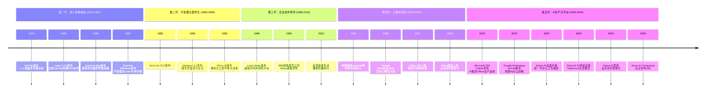
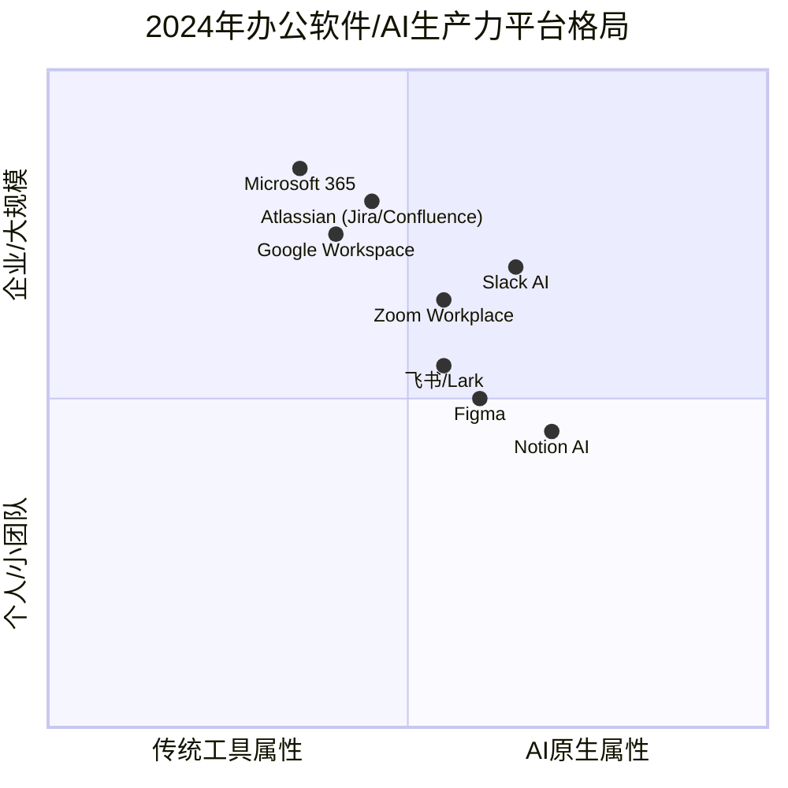

# 办公软件战斗四十年史：从Lotus到AI生产力平台

> **适用范围**：技术管理者、创业者、投资研究者、产品经理及对科技商业史感兴趣的读者；适用于战略复盘、案例研讨与决策参考场景。
>
> **更新摘要（v2 · 2026-08 更新）**：
> - 结构化升级为 6 节骨架（导言 / 核心方法论 / 关键流程 / 工具与实战 / 常见误区 / 进阶延展）
> - 保留全部原文 Mermaid 图、表格、数据与术语英文对照，并为 Mermaid 图补充 frontmatter 与图后解读
> - 将原「参考资料/附录」并入第 6 节「进阶延展」，便于延展阅读

## 1. 导言

### 引言：一场跨越四十年的帝国战争

在西雅图地区贝尔维尤市的市中心，有一家红狮宾馆（Red Lion）。和市中心很多高大上的新式宾馆比起来，它并不显眼，却在办公软件发展史上占有一席之地——这里曾是微软"红狮会战"的发生地，是比尔·盖茨反击Lotus 1-2-3的战略起点。

从1979年VisiCalc诞生至今，办公软件领域已经演进了四十余年。这四十年间，我们见证了无数帝国的崛起与陨落：VisiCalc开创了电子表格时代却被Lotus 1-2-3超越；莲花公司凭借1-2-3登顶却又被微软Excel击败；WordPerfect曾统治字处理市场却因错失图形界面而衰落；Lotus Notes超前时代二十年却在IBM手中逐渐凋零；谷歌以云服务挑战微软霸权却未能撼动其根基。

而今，站在2024年的节点上回望，我们正经历着办公软件史上最深刻的范式转移：**生成式AI正在将"办公软件"重新定义为"AI生产力平台"**。Microsoft 365 Copilot、Google Workspace Gemini、Notion AI、Slack AI、Figma AI……这场新战争的烈度与影响范围，远超以往任何一代竞争。

本文将完整梳理这四十年的战斗史诗，并重点剖析AI时代办公软件的新格局。

> 上图展示了关键节点与演进路径，结合正文时间线可直观把握事件因果与战略转折。

---

## 2. 核心方法论

### 第一章：电子表格之战——VisiCalc、Lotus与Excel的三国演义

#### 1.1 VisiCalc：个人电脑的第一个杀手级应用

1979年，Dan Bricklin和Bob Frankston开发了VisiCalc（Visible Calculator），这是世界上第一款电子表格软件。它的出现堪称革命性——在此之前，会计和财务人员只能用纸笔或大型机进行计算，而VisiCalc让个人电脑首次具备了真正的商业价值。

VisiCalc的成功直接推动了Apple II的销售，也让人们意识到：**软件可以成为硬件的驱动力**。这一认知深刻影响了后来整个PC产业的发展逻辑。

#### 1.2 Lotus 1-2-3：DOS时代的王者

1983年，米切尔·卡普尔（Mitch Kapor）创立的莲花公司推出了Lotus 1-2-3。这款产品之所以叫"1-2-3"，是因为它集成了三大功能：电子表格、图表生成和数据库管理。Lotus 1-2-3凭借更强大的功能和更好的性能迅速击败了VisiCalc，成为DOS时代无可争议的电子表格霸主。

莲花公司也因此一跃成为全球最大的独立软件公司，卡普尔本人也成为硅谷的风云人物。然而，历史证明，**技术的领先地位从来不是永久的**。

#### 1.3 红狮会战：微软的战略转折点

连续做了两次"螳螂"的微软，屡战屡败。其早期电子表格产品Multiplan在欧洲市场取得了一定成功，但在美国市场完全无法抗衡Lotus 1-2-3。比尔·盖茨这样心高气傲的人，自然不会甘心。

1983年9月，盖茨召集微软精英在红狮宾馆召开了三天三夜的闭门会议。主题只有一个：**推出世界上最快、最好用的电子表格软件，打败Lotus 1-2-3**。会议对Multiplan和Lotus 1-2-3做了详细比较，最终决定开发全新的电子表格软件，命名为Excel——中文意思就是"超越"。

Excel吸取了Lotus 1-2-3的诸多优点（如宏语言），同时引入了**智能重算**的概念：改动部分数据只会导致相关部分重新计算，而非整个表格重算。此外，Excel的界面毫不犹豫地仿造了Lotus 1-2-3，以降低用户迁移成本。

#### 1.4 豪赌Macintosh：盖茨的远见卓识

开发半年多后，盖茨突然宣布一个令人震惊的决定：**Excel的开发重心从DOS转向苹果Macintosh**。

这个决定的逻辑非常清晰：电子表格的使用体验与硬件和操作系统高度相关，只有在最新的图形界面下才可能战胜Lotus 1-2-3。当时Windows开发刚刚起步，而Mac已经提供了世界最好的图形界面支持。为了"超越"，微软甚至愿意先为竞争对手的平台开发软件。

这种极具远见的战略判断，解释了为什么微软不遗余力地开发基于Windows的Microsoft Word，而WordPerfect及其他竞品却没有真正意识到图形界面的未来。

1985年5月，盖茨亲自带队在纽约举办Excel for Mac发布会，大获成功。莲花公司的应对产品"爵士乐"（Jazz）晚了三个月登陆Mac，且只是简单的DOS版本移植，Bug丛生、性能糟糕。一年后，Excel在Mac市场占据近90%份额。

#### 1.5 Windows战役与全面胜利

Mac市场的胜利只是前奏。真正的主战场仍在PC，而微软手中的新武器是Windows。Excel for Windows的开发持续两年，期间Windows组和Excel组必须同步开发——最初的Windows甚至不是一个完整操作系统，只提供了运行Excel所必需的功能。

1987年Excel for Windows发布时跑在386电脑上。IBM为延长286产业链拒绝使用386，微软则抛弃合作传统站到了兼容机厂商阵营，这被证明是Excel成功的关键因素之一。加上数百万美元的市场推广投入，Excel for Windows一年后夺取12%市场份额，几年后彻底占领PC市场。

随后微软推出的Works套装（Office前身）集成了字处理、电子表格、数据库和通信软件，1987年底成为当年销售最好的办公软件。**微软因此超越莲花公司，荣登全球软件公司头号交椅。**

---

### 第三章：Lotus Notes——超前时代的"大杀器"

#### 3.1 另辟战场的战略抉择

面对Excel的步步紧逼，莲花公司CEO吉姆·曼兹（Jim Manzi）做出了一个关键决策：**避免与微软正面交锋，另辟企业协同战场**。

1984年，曼兹秘密委托Iris公司（由莲花前员工雷·奥茨创立）开发一款企业级通信与协同软件——这就是后来的Lotus Notes。曼兹对奥茨充满信心，但莲花内部沉浸于Lotus 1-2-3成功喜悦中的高管们强烈反对这次转型，最终导致12个副总裁陆续离职。

#### 3.2 从1984年穿越来的软件

1989年，Lotus Notes推向市场并大获成功。这是一个主打企业级通信与协同的客户端/服务器软件，集合了电子邮件、日历、通讯录、文件存储、审批流程等功能，并提供大量接口供用户定制化开发。

Lotus Notes给人的感觉**极其超前**，仿佛是在汽车还没跑起来的年代里混进了一辆跑车。有人戏称奥茨是从2004年穿越回1984年来开发这款软件的——其中的很多功能到21世纪才司空见惯，却在80年代后期就被开发出来了。

但Notes还有一个特点：**极高的封闭性和迁移成本**。一旦企业部署了这套系统，整个办公流程都会被深度绑定，迁移极其困难。华为公司就花了十多年时间，直到2015年才完成从Lotus Notes系统的迁移。

#### 3.3 IBM的恶意收购与Notes的凋零

1995年，IBM以64.5美元/股的价格（当时股价32美元）恶意收购莲花公司。郭士纳主导的这次收购是为了IBM从硬件向软件和服务转型的战略布局——Lotus Notes被视为企业软件和服务业务的关键资产。

收购后莲花保持了数年独立运营，奥茨也留任至2001年。但随着IBM重组将莲花开发团队并入总部，以及奥茨的离职，Notes开始走下坡路：新功能杂乱不堪，客户端内存泄漏严重，性能堪忧。到2008年笔者在IBM研究院实习时使用Notes，机器经常毫无缘由地卡顿半分钟到几分钟。

**如果莲花公司没有被收购继续独立发展，今天会达到什么高度？** 这个问题恐怕永远没有答案了。但Notes的故事告诉我们：即使是最具前瞻性的产品，也可能毁于错误的资本运作和组织管理。

---

### 第五章：云服务革命——Google Docs与Office 365

#### 5.1 谷歌的办公软件梦

作为互联网时代成长起来的巨头，谷歌自然也有办公软件梦——毕竟这个市场巨大，只要能入场就有饭吃。但想要在"老司机"微软的帝国范围内掘金，着实不易。

谷歌的策略是通过一系列收购快速构建产品线：2006年收购网络字处理厂商Upstartle和在线电子表格公司2Web Technologies，2007年收购幻灯片制作公司Tonic Systems。经过数年Beta测试，**Google Docs于2009年走出测试版**——形成包括文字处理、电子表格和幻灯片的云服务套件（2006年即以测试版上线，2007年整合演示文稿功能）。

#### 5.2 两大创新：云端与协同

Google Docs带来了两个颠覆性创新：

1. **基于浏览器的云服务**：无需本地安装，通过浏览器即可使用，数据保存在云端，随时随地多设备访问。
2. **实时协同编辑**：多人可以同时编辑同一文档，实时看到彼此的改动。

这两大特色让Google Docs一经推出就大受追捧，媒体纷纷宣称"云服务才是未来"。此时的微软，在搜索、社交、移动领域接连失利，最牢固的办公软件腹地突然被杀入，形势危急。

#### 5.3 微软的绝地反击：Office 365

微软迅速组建Office 365部门，目标明确：实现浏览器端Office编辑和多人协同。这意味着需要对Office架构做大手术——将UI层与功能层分离，底层模块复用，前端用JavaScript重新实现UI。同时还需建设网盘（最初叫SkyDrive，后改名OneDrive）。

经过数年研发，Office 365终于在功能上可以与Google Docs媲美。高层进而决定取消传统Office与Office 365的区分，所有新功能必须同时支持本地和云端。

#### 5.4 谷歌为何未能撼动微软？

很多人期待Google Docs与Office 365的剧烈交锋，但这件事并没有发生。**Google Docs虽然来势汹汹，最终却未能威胁到微软的统治地位。**

原因很现实：谷歌三件套的功能过于单薄，尤其是电子表格与Excel完全不可比。企业级用户无法从功能丰富的微软Office切换到"够用就好"的谷歌替代品。而微软借助这次转型完成了更重要的变革——**从卖软件授权转为订阅制收费模式**。

Office 365按月订阅（几美元到几十美元不等），大大增强了盈利能力和稳定性，也减少了对频繁版本更新的依赖。微软高层表示："用户和营收的增长已超过预期。"

**谷歌给大家带来了耳目一新的云服务，却倒在了功能不够健全上。** 微软的Office部门无愧于"微软最为强悍的部门"之称。

---

### 第六章：AI生产力平台时代——2020-2024的新战争

如果说前四代竞争的核心是"更好的工具"，那么第五代竞争的核心则是**"智能的伙伴"**。生成式AI的爆发正在从根本上重新定义办公软件的价值主张：不再是"帮助你做事"，而是"替你做事"。

> 上图展示了关键节点与演进路径，结合正文时间线可直观把握事件因果与战略转折。

#### 6.1 Microsoft 365 Copilot：巨象转身

2023年3月，微软正式发布**Microsoft 365 Copilot**，将GPT-4大语言模型深度集成到Word、Excel、PowerPoint、Outlook、Teams等全系产品中。这是办公软件史上最大规模的一次AI集成。

Copilot的能力令人瞩目：
- **Word中**：根据大纲自动生成完整文档，改写润色已有文本，总结长文档要点
- **Excel中**：自然语言查询数据分析趋势，自动生成公式和数据可视化
- **PowerPoint中**：根据文字稿自动生成演示文稿，调整排版和设计
- **Outlook中**：自动起草邮件回复，总结邮件线程，安排会议优先级
- **Teams中**：实时会议转录、翻译、生成会议纪要和行动项

然而，商业化进程并非一帆风顺。截至2024年底的数据显示：微软办公软件总用户约4.5亿，而Copilot付费订阅数约为1500万份，**付费率仅约3%**。尽管微软在AI领域投入超过130亿美元，但Copilot尚未显著带动Office 365的整体增速。

用户反馈呈现两极分化：部分用户称赞Copilot大幅提升了工作效率（尤其是文档生成和会议纪要场景），但也有大量用户抱怨AI生成的质量不稳定、定价过高（每人每月30美元）、以及与现有工作流整合不够顺畅。2024年秋季发布的Copilot Wave 2系统级升级更是引发了用户的广泛不满。

**核心矛盾在于：AI的生产力提升是否足以支撑高昂的订阅费用？** 对于个人用户和小型企业而言，答案可能是否定的。但对于每天花费数小时在Office上的知识工作者，Copilot的时间节省可能物超所值。这个价值验证过程仍需时间。

#### 6.2 Google Workspace Gemini：追赶者的全面反击

谷歌的应对策略是将自家的Gemini大模型全面集成到Google Workspace中。2024年，Google Workspace迎来了Gemini功能的重大升级：

- **Gemini in Docs/Sheets/Slides**：承担繁重的撰写、分析和设计工作，帮助用户摆脱空白页焦虑
- **Gemini Live语音对话模式**：面向Workspace用户推出，提供对话式AI体验，可用自然语言语音提问并获得即时响应
- **深度Drive集成**：AI助手可以跨文件进行信息检索和综合分析

谷歌的差异化优势在于其**云原生的基因**——Google Docs从第一天就是为协作设计的，Gemini的集成比微软在遗留代码库上加装AI要更加自然流畅。此外，谷歌在AI领域的深厚积累（Transformer架构的发明者、TensorFlow框架、TPU芯片）为其提供了坚实的技术基础。

但谷歌面临的挑战同样严峻：企业市场的惯性巨大，Google Workspace在企业端的渗透率仍然有限，且Gemini的商业化路径尚不清晰。

#### 6.3 Notion AI：新一代办公工具的崛起

如果微软和谷歌代表的是"老牌办公软件加AI"，那么**Notion代表的是"AI原生的全新工作方式"**。

Notion作为一个集笔记、文档、项目管理、知识库于一体的全能 workspace，在2023年推出Notion AI后实现了爆发式增长。Notion AI的核心能力包括：

- **Q&A问答模式**：用户可以直接向Notion AI提问，快速检索和综合所有笔记与文档中的信息
- **智能写作辅助**：自动续写、改写、总结、翻译、调整语气和长度
- **数据库自动化**：AI可以帮助填充、整理和分析Notion数据库中的结构化数据
- **头脑风暴伙伴**：提供创意建议和思路拓展

2024年，Notion进行了密集的功能更新（上半年即发布4个大版本），其中最受关注的是**Notion Calendar**等产品线的扩展。Notion的用户群体从初创公司和个人创作者快速扩展到中型企业和部分大型企业的团队。

Notion的成功揭示了一个重要趋势：**下一代办公软件可能不是"更好的Word或Excel"，而是打破文档、表格、演示边界的一体化AI workspace**。这种范式对微软和谷歌的套件模式构成了潜在的结构性挑战。

#### 6.4 Slack AI：企业协作的智能化

2021年，Salesforce以277亿美元收购Slack，创下企业软件领域最大的并购交易之一。然而，Slack在收购后的表现并不尽如人意——在与微软Teams的竞争中处于劣势，增长放缓。

2024年，Salesforce为Slack注入了新的活力：**发布30余项AI新功能**，将Slack转变为AI驱动的企业协作中枢：

- **Slackbot智能化升级**：支持模型上下文协议（MCP），可接入外部服务和工具
- **Agentforce集成**：与Salesforce 2024年推出的AI智能体开发平台深度整合，可将工作路由到各类AI Agent
- **智能摘要和搜索**：自动总结频道讨论，智能检索历史消息
- **工作流自动化**：AI驱动的工作流推荐和执行

Slack的战略定位正在从"企业聊天工具"进化为**"企业AI操作系统的入口"**。这个愿景能否实现，取决于Salesforce能否有效整合其CRM生态与Slack的协作能力。

#### 6.5 Atlassian：开发者协作的AI化

Atlassian（Jira、Confluence、Trello的母公司）在2024年全面推进AI战略：

- **Atlassian Intelligence**：已嵌入Jira、Confluence和Jira Service Management，提供智能工作流自动化
- **虚拟Agent**：可以在Jira Service Management中自主处理服务请求
- **自然语言交互**：用户可以用自然语言创建和修改Jira任务、查询Confluence知识库

Atlassian的《2024年团队现状报告》揭示了一个引人深思的数据：**仅有24%的团队在从事真正关键的任务性工作**，其余时间消耗在协调、沟通和信息查找上。AI的承诺正是将这些"非生产性时间"转化为实际产出。

值得注意的是，Atlassian已于2024年2月终止了Server产品的支持，**全面转向云服务**。这与微软Office 365的转型路径一致，说明云+AI已成为企业软件的必然方向。

#### 6.6 Figma：设计协作的AI革命

Figma作为云端UI/UX设计与协作平台的领军者，在2024年推出了**Figma AI**，标志着设计工具的智能化转型：

- **AI辅助设计**：自动生成UI组件、布局建议、配色方案
- **智能原型**：从文字描述快速生成交互式原型
- **设计系统维护**：AI帮助检测和维护设计一致性
- **实时协作增强**：AI驱动的评论和建议功能

Figma已于2025年7月在纽交所上市（计划募资约10亿美元），估值反映了资本市场对**"设计即办公"**这一理念的认可。Figma的崛起模糊了"设计软件"与"办公软件"的边界——在现代知识工作中，设计思维和视觉表达已成为通用技能，而非设计师专属。

#### 6.7 Zoom AI Companion：会议协作的重构

Zoom在2024年推出**Zoom Workplace**和**Zoom AI Companion**，将视频会议从"通信工具"升级为"AI增强的工作空间"：

- **会议智能助理**：自动生成会议纪要、提取行动项、跟踪任务完成情况
- **实时翻译和字幕**：支持多语言的实时会议辅助
- **Ask AI Companion**：会后可通过自然语言查询会议内容和决策记录
- **工作流集成**：与主流办公软件的深度对接

Zoom的战略逻辑清晰：**会议是企业协作的高频场景，AI可以从这里切入重构整个工作流**。这与微软Teams、Google Meet、Slack huddles形成了直接的正面竞争。

---

### 第七章：范式转移——从"办公软件"到"AI生产力平台"

#### 7.1 五代竞争的本质差异

回顾四十年的办公软件竞争史，我们可以清晰地看到每一代竞争的核心逻辑变化：

| 代际 | 时间 | 核心竞争维度 | 代表产品 | 决胜关键 |
|------|------|-------------|---------|---------|
| 第一代 | 1979-1987 | 计算能力 | VisiCalc → Lotus 1-2-3 → Excel | 性能与功能 |
| 第二代 | 1983-1995 | 易用性与套件化 | WordPerfect → Word, Office 95 | 图形界面与整合 |
| 第三代 | 1989-2010 | 企业协同 | Lotus Notes | 工作流深度绑定 |
| 第四代 | 2006-2020 | 云端与协作 | Google Docs vs Office 365 | 订阅制商业模式 |
| 第五代 | 2020-2024 | AI智能 | Copilot, Gemini, Notion AI等 | AI能力与价值验证 |

**第五代竞争的本质区别在于：前四代是"工具的优化"，第五代是"范式的重构"。**

#### 7.2 AI带来的三个结构性变化

**第一，创作模式的根本改变。** 传统办公软件是"人创作、工具辅助"，AI时代则是"AI创作、人审核迭代"。生成式PPT、自动撰写邮件、智能数据分析报告……这些能力的成熟意味着大量"中间层"工作将被AI承担。知识工作者的角色将从"内容的创造者"转变为"AI输出的编辑者和决策者"。

**第二，软件边界的消融。** Notion打破了文档/表格/演示的界限，Figma模糊了设计与办公的边界，Slack试图成为企业AI操作的入口。传统的"办公套件"概念正在瓦解，取而代之的是**以工作流为中心的AI能力矩阵**。

**第三，商业模式的再探索。** Microsoft 365 Copilot每人每月30美元的定价引发广泛讨论。AI功能应该如何收费？是捆绑在现有订阅中还是单独计费？按使用量还是按席位？这些问题将在未来几年内逐渐明晰。目前的迹象表明，**AI可能催生一种新的分层定价模式**：基础功能低价或免费，高级AI能力高价溢价。

#### 7.3 2024年市场格局的关键特征

综合来看，2024年的办公软件/AI生产力平台市场呈现以下特征：

1. **微软依然 dominant 但面临挑战**：Microsoft 365在全球企业市场仍占据绝对主导地位（估计超过85%的企业使用至少一款Microsoft 365产品），但Copilot的商业化速度低于预期，且面临着来自各方的AI竞争压力。

2. **谷歌稳扎稳打**：Google Workspace在教育、科技公司和中小型企业中有稳固的基本盘，Gemini的集成增强了竞争力，但在大型企业市场的渗透仍然有限。

3. **新兴力量快速崛起**：Notion、Figma、Linear等新一代工具正在从垂直场景切入，逐步扩展到更广泛的办公场景。它们的共同特点是**AI原生、云优先、用户体验至上**。

4. **垂直领域专业化**：Slack（协作）、Zoom（会议）、Atlassian（开发管理）、Salesforce（CRM）都在强化AI能力，试图成为各自领域的工作流中枢。

5. **中国市场独特性**：飞书（Lark）、钉钉、企业微信等中国本土产品在AI办公领域快速迭代，形成与全球市场平行的竞争格局。

#### 7.4 历史的启示与未来的悬念

回顾这四十年的历史，几个规律反复浮现：

**第一，技术转型的窗口期是格局重塑的唯一机会。** DOS→Windows、本地→云端、工具→AI，每一次范式转移都伴随着新老交替。错过窗口的玩家（Lotus 1-2-3、WordPerfect、Lotus Notes）无论曾经多么强大，最终都被淘汰或边缘化。

**第二，生态系统锁定是终极护城河。** 微软之所以能在Google Docs的冲击下屹立不倒，核心原因不是产品更好，而是**文件格式兼容性、企业IT基础设施、用户习惯和学习成本**构成了极深的护城河。AI时代是否会打破这种锁定？目前看答案是否定的——微软正在将AI能力叠加在这条护城河之上。

**第三，创新需要正确的组织土壤。** Lotus Notes在莲花公司手中是划时代的产品，到了IBM手中却日渐凋零。**伟大的产品可以被错误的管理摧毁**，这个教训值得每一个科技公司警惕。

**第四，敌人总是在意想不到的地方出现。** 微软没想到浏览器会成为威胁（Netscape），没想到云服务会挑战本地软件（Google Docs），现在又面临着AI原生工具的潜在颠覆。**成功的最大风险是自身的成功——因为它让你对边缘创新视而不见。**

站在2024年末展望未来，几个关键悬念将决定接下来几年的格局：

- **AI付费模式的可行性**：Copilot 3%的付费率是暂时现象还是长期常态？AI能否真正证明其ROI？
- **AI原生的挑战者**：Notion、Figma等新一代工具能否突破垂直场景的限制，对微软和谷歌构成实质性威胁？
- **企业采纳曲线**：大型企业在AI办公工具上的采纳速度有多快？合规和安全顾虑会在多大程度上延缓这一进程？
- **技术能力的上限**：当前的大语言模型在办公场景中的可靠性如何？幻觉问题、数据隐私、输出质量控制仍是未解难题。

---

## 3. 关键流程

### 第二章：字处理之争——WordPerfect的陨落与Word的崛起

#### 2.1 字处理市场的群雄逐鹿

在电子表格激战的同时，字处理市场同样硝烟弥漫。WordStar是早期的领导者，但因内部斗争和管理混乱走向衰落。WordPerfect则凭借强大的功能（尤其是排版能力）和良好的兼容性，在80年代末至90年代初成为字处理市场的绝对霸主。

#### 2.2 图形界面十字路口

WordPerfect的命运转折点与Lotus 1-2-3如出一辙：**当行业从字符界面转向图形界面时，它没能及时跟上**。

微软早在Windows 1.0时代就开始开发基于图形界面的Word，而WordPerfect直到Windows 95发布后才推出真正原生化的Windows版本。这致命的时间差让微软Word在企业市场和消费市场双双取得优势。

到90年代中期，Word已经成为最流行的字处理软件，而WordPerfect则被Corel收购后逐渐边缘化。这段历史再次印证了一个规律：**技术转型期是格局重塑的最佳窗口**。

---

## 4. 工具与实战

（本节内容在原文中较为简略，可结合第 2、3、4 节相关段落交叉理解。）

---

## 5. 常见误区

### 第四章：垄断时代的创新困境

#### 4.1 Windows 95与Office 95的巅峰时刻

1995年，微软发布Windows 95和Office 95，整个世界正式进入Windows时代。Office 95包含Word、Excel、PowerPoint和Outlook，是微软办公软件的集大成者。

此时，微软曾经的对手们已全部败落：VisiCalc消失、Lotus 1-2-3被赶超、WordStar破产、WordPerfect衰落。**在办公软件领域，微软看不到敌人了。**

盖茨在一次受访中表示："整个软件行业很美好，只有一些杂音。"他指的是Netscape、Oracle、IBM、Sun、EMC这五家企业。这种自信（或者说傲慢），为后续的反垄断诉讼埋下了伏笔。

#### 4.2 IE大战与反垄断诉讼

面对Netscape浏览器的威胁，微软开发IE并通过Windows捆绑免费分发，最终导致Netscape破产。1998年，美国司法部联合20个州政府起诉微软垄断，要求强制拆分——类似当年拆分美孚石油公司和AT&T。

官司打了三年，2001年达成和解，拆分未实施，但微软被要求共享API。欧盟的反垄断诉讼持续时间更长、要求更多。**反垄断诉讼大大牵制了微软的精力，加上互联网泡沫破灭和巨额罚款，微软变得小心翼翼，进取心大不如前。**

#### 4.3 为创新而创新：Ribbon UI的争议

没有竞争对手的Office部门面临一个棘手问题：如何让用户持续购买新版本？Office 2000太过经典完美，导致后续的Office 2003销售惨淡。

微软的解决方案是Office 2007推出的Ribbon UI（原名Fluent UI）——彻底抛弃了从DOS时代延续下来的菜单系统。这是微软Office历史上最具争议的一次更新：用户无法退回到经典菜单（这在微软历史上可能是唯一一次），企业被迫在"保持旧版"和"全面升级"之间做选择。

随着微软逐步停止对Office 2003的技术支持，企业最终都切换到了Ribbon界面。**Ribbon解决了当务之急——拉动新版销售——但没有解决根本问题：如何持续创新？**

Office 2013再次面临同样的困境：与2010版差异不大，销售又不理想。微软意识到，靠功能更新驱动销售的模型已经走到尽头，需要新的商业模式。

---

## 6. 进阶延展

### 结语：战斗永不终结

从西雅图红狮宾馆的三天密谋，到雷·奥茨的超前构想；从Ribbon UI的激进革新，到Google Docs的云端冲击；再到今天Copilot、Gemini、Notion AI的群雄逐鹿——办公软件的战场从未平静过。

四十年的竞争史告诉我们：**没有任何霸主是永恒的，也没有任何领先是不可逾越的。** 每一代技术浪潮都会带来新的玩家、新的规则、新的赢家和输家。

而我们此刻正身处第五代竞争的开端。AI对办公软件的重构才刚刚开始，未来的形态可能与今天的一切都截然不同。唯一确定的是：这场关于人类知识生产力的伟大实验，还将继续下去。

正如比尔·盖茨在红狮宾馆所展示的那样——**锲而不舍的精神和善于总结经验打硬仗的能力，永远是制胜的关键**。只不过这一次，战场不再仅仅是电子表格或字处理软件，而是关于人工智能如何重新定义"工作"本身的更深层次竞争。

---

*本文合并重写自原系列文章049-052，更新至2024年12月，涵盖办公软件领域四十年的竞争史及最新AI发展趋势。*

---

### 参考资料

1. 原始系列文章：049《红狮会战：微软的反击》、050《大杀器Lotus Notes和被收购的莲花公司》、051《无敌寂寞的微软之为创新而创新》、052《办公软件的新时代：微软和谷歌的战斗》
2. Microsoft 365 Copilot官方文档及财报数据（2024）
3. Google Workspace Gemini发布公告（2024）
4. Notion AI产品更新日志（2024）
5. Salesforce Slack AI功能发布（2024）
6. Atlassian《2024年团队现状报告》
7. Figma AI功能发布及IPO招股书（2024-2025）
8. Zoom AI Companion官方指南（2024）
9. Gartner《2024年全球十大商业趋势》报告

---

*v2 结构化升级版 · 文件名保持不变：011-办公软件战斗四十年史从Lotus到AI生产力平台-【更新版】.md*