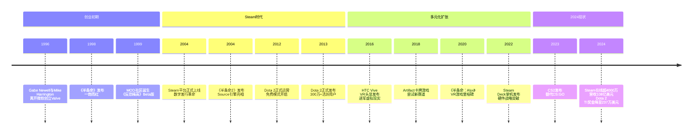
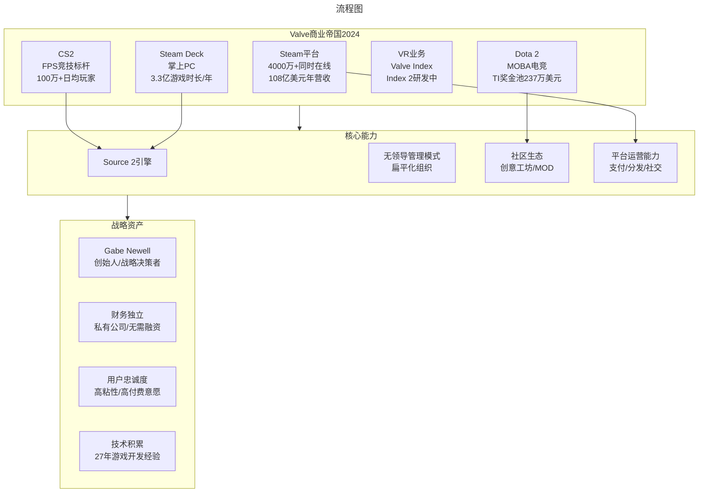

# Valve Steam帝国与无领导管理传奇（更新至2024）

> **适用范围**：技术管理者、创业者、投资研究者、产品经理及对科技商业史感兴趣的读者；适用于战略复盘、案例研讨与决策参考场景。
>
> **更新摘要（v2 · 2026-08 更新）**：
> - 结构化升级为 6 节骨架（导言 / 核心方法论 / 关键流程 / 工具与实战 / 常见误区 / 进阶延展）
> - 保留全部原文 Mermaid 图、表格、数据与术语英文对照，并为 Mermaid 图补充 frontmatter 与图后解读
> - 将原「参考资料/附录」并入第 6 节「进阶延展」，便于延展阅读

## 1. 导言

### 引言：一家"反直觉"公司的商业奇迹

在硅谷的创业神话中，Valve Corporation（维尔福软件公司）是一个异类。它没有IPO，没有风险投资，没有层级管理，没有季度财报压力，却在2024年创造了约108亿美元的总营收，净利润率长期维持在40%-50%的惊人区间。它的Steam平台拥有超过4000万最高同时在线用户，是全球最大的PC游戏分发平台；它的Dota 2国际邀请赛曾创造超过3400万美元的电竞奖金纪录；它的CS2（反恐精英2）日均玩家数稳居Steam榜首；它的Steam Deck掌机重新定义了便携式PC游戏体验。

更令人称奇的是，这一切成就的背后，是一家员工人数仅数百人、实行彻底扁平化管理的私人公司。在Valve的办公大厅里，没有CEO、没有CTO、没有总监、没有经理——每个人都可以自由选择参与任何项目，办公桌下装着滑轮可以随意移动到感兴趣的团队。这种看似混乱的管理模式，却孕育出了游戏行业最具创新力的产品矩阵。

本文将基于原始六篇文章的核心内容，结合2024年最新数据，全面剖析Valve帝国的崛起之路、商业模式、组织创新与未来挑战。

> 上图展示了关键节点与演进路径，结合正文时间线可直观把握事件因果与战略转折。

---

## 2. 核心方法论

### 第一章：《半条命》——两个微软老司机的游戏梦

#### 1.1 创始人的微软背景

1996年的西雅图，正值微软上市后股价暴涨的黄金时期。Windows操作系统的早期开发者们一夜之间实现了财务自由，其中就包括Gabe Newell（加布·纽维尔）和Mike Harrington（麦克·哈灵顿）。这两位在微软工作了13年的"老司机"，决定用自己赚到的第一桶金去做一件看似疯狂的事情——创办一家游戏公司。

值得注意的是，他们并非游戏行业出身。Newell在微软负责Windows 1.01到Windows XP的三个版本开发，Harrington则是操作系统内核的高级工程师。按照常理，这两位应该继续在科技巨头的高管位置上稳步晋升，或者转投其他软件公司担任CTO。但他们选择了完全不同的道路：从零开始学习游戏开发。

这种跨界创业的选择，在当时看来几乎是自杀式的。游戏行业门槛高、竞争激烈、失败率极高，而且两位创始人毫无相关经验。然而，正是这种"局外人"的视角，让Valve从一开始就走上了与众不同的道路。

#### 1.2 Quake引擎与《半条命》的诞生

既然不懂游戏开发，那就用最聪明的方式入门——Valve决定采用id Software的Quake引擎来开发自己的第一款游戏。这个决策体现了创始人作为资深程序员的务实思维：与其从头造轮子，不如站在巨人的肩膀上。

1997年E3游戏展上，《半条命》（Half-Life）首次亮相便引起轰动。这款游戏打破了当时动作游戏的固有范式：没有无脑的射击狂欢，没有生硬的过场动画，而是将叙事无缝融入游戏过程之中。玩家扮演的理论物理学家Gordon Freeman在黑山研究所的灾难中挣扎求生，每一刻都充满沉浸感。

然而，天才的创意并不意味着顺利的开发过程。《半条命》经历了多次跳票，从原定的1997年下半年一直拖延到1998年感恩节才正式发售。发行商Sierra Online对Valve的能力产生了严重质疑，甚至一度考虑取消项目。这段经历为Valve日后坚持自主发行埋下了伏笔。

#### 1.3 MOD生态与《反恐精英》的意外之喜

《半条命》真正改变游戏历史的，不是其单机内容，而是Valve对MOD（模组）开发的开放态度。在那个大多数游戏公司视MOD为威胁的时代，Valve主动开放了大量代码和工具，鼓励社区创作。

这一决策催生了游戏史上最成功的MOD之一——《反恐精英》（Counter-Strike）。这款由 Minh Le（"Gooseman"）和Jess Cliffe制作的多人战术射击模组，完全颠覆了《半条命》的游戏玩法，引入了即时战术对抗、阵营分化（反恐精英与恐怖分子）和团队协作机制。1999年Beta测试版发布后迅速风靡全球。

Valve的反应堪称教科书级别：直接收购了《反恐精英》团队，将其纳入公司麾下。这不仅带来了一棵新的摇钱树，更重要的是收罗了一批顶尖的游戏开发人才。此后，《反恐精英》系列推出了多个续作，成为Valve仅次于《半条命》的第二大IP。

然而，就在公司蒸蒸日上之时，联合创始人Harrington因理念不合离开Valve，开始了漫长的休假，后来创办的公司被谷歌收购。Harrington的离去原因至今成谜，但从那时起，Valve成为了Newell一个人的帝国。

#### 1.4 《半条命2》：危机中的重生

时隔5年后的2003年，Valve终于展示了《半条命2》。但命运再次捉弄了这家公司——游戏源代码被黑客窃取并泄露到互联网。未完成的版本充满了Bug，让期待已久的玩家大失所望，销售前景蒙上阴影。发行商Vivendi Universal甚至决定取消2003年的发行计划。

面对危机，Newell展现了出色的危机管理能力：一方面向FBI报案追查黑客，另一方面利用与玩家的良好关系动员社区协助调查。那位胆大包天的黑客竟然主动现身，表示希望为Valve工作。Newell假意应允，实则配合FBI在德国将其抓捕。

与此同时，Valve与发行商之间爆发了一场关于数字发行权的法律战。Valve希望通过Steam平台自主发行纯下载版本，而发行商则认为自己买断了所有发行权。这场官司严重影响了《半条命2》的发行进度，最终双方庭外和解，游戏于2004年11月才姗姗来迟。

《半条命2》最终没有辜负期待。其先进的Source引擎、突破性的物理系统（重力枪可以投掷任何物体）、高智能的NPC设计，使其成为2000年代最重要的游戏之一。更重要的是，这款游戏成为Steam平台推广的关键载体，为Valve从游戏开发商向平台运营商转型奠定了基础。

---

### 第二章：Steam平台——游戏界的iTunes

#### 2.1 前瞻性的数字发行 vision

早在2002年，当大多数人还在购买实体光盘时，Valve就开始打造Steam平台。这个想法在当时极为超前：创建一个类似iTunes的游戏数字发行系统，让玩家可以通过互联网直接下载和更新游戏。

Steam的技术架构由BT协议发明者Bram Cohen亲自操刀设计，采用点对点下载技术，大幅提升了下载速度。2004年，Steam随《反恐精英：零点行动》一同问世，最初只是一个游戏更新工具和反作弊系统，后来逐渐演变为完整的游戏商店和社交平台。

今天回头看，Steam的出现时机堪称完美：
- 宽带互联网开始普及，下载GB级游戏成为可能
- 数字版权管理（DRM）技术逐渐成熟
- 独立游戏开发者缺乏有效的发行渠道
- 玩家厌倦了实体光盘的繁琐和丢失风险

Valve敏锐地捕捉到了这些趋势，并在正确的时间点推出了正确的产品。

#### 2.2 推广策略：捆绑销售与平台依赖

为了推广Steam，Valve采取了多管齐下的策略：

**《半条命2》强制绑定**：这是最关键的一步。玩家必须安装Steam才能运行《半条命2》，数百万玩家因此成为了Steam的用户基础。游戏允许预下载，发行日即可直接游玩，这一创新大大提升了用户体验。

**橙盒捆绑包（The Orange Box, 2007）**：Valve将5款游戏打包销售——《半条命2》及其两部续集、《军团要塞2》、《传送门》。这套组合以极具竞争力的价格提供了丰富的游戏内容，既延续了《半条命2》的热度，又带动了新IP的成长。特别是解谜游戏《传送门》，凭借精巧的设计和幽默的叙事成为了独立于《半条命》宇宙的经典之作。

**持续的平台改进**：Steam不断添加社区功能（好友、聊天、组队）、创意工坊（Workshop，支持MOD分享）、促销活动（季节性打折、每日特惠）、开发者工具（Steamworks API）。这些功能形成了强大的网络效应：玩家因为朋友在Steam上而留在Steam，开发者因为玩家在Steam而上架Steam。

#### 2.3 2024年的Steam帝国

经过20多年的发展，Steam已经成为全球PC游戏的绝对霸主。根据Valve发布的2024年度回顾报告：

**用户规模**：
- 最高同时在线用户数突破4000万（2024年12月）
- 自2020年以来，在线用户数几乎翻倍
- 月活跃用户估计超过1.2亿（行业估算）

**商业表现**：
- 2024年是Steam新游戏销售表现最好的一年
- 超过500款新游戏首月收入超过25万美元（同比增长27%）
- 200款新品首月收入突破100万美元（同比增长15%）
- 年度新发行产品总收益较2014年增长近10倍

**生态系统**：
- 2023年最热门的20款新品吸引了170万名首次购买者
- 这些新玩家在后续14个月内额外游玩了1.41亿小时游戏内容
- 在游戏内消费2000万美元，付费游戏和DLC投入7300万美元
- 成功案例：马来西亚单人工作室OPNeon的《卡牌商店模拟器》首月吸引百万用户，销售覆盖全球十大市场

**Steam Deck效应**：
- 2024年Steam Deck贡献了3.3亿小时游戏时间（同比增长64%）
- 这款基于Linux系统的掌上PC成功开辟了新的游戏场景
- 推动了整个掌上PC游戏品类的兴起

据估算，Valve在2024年的总营收约为108亿美元，净利润率长期维持在40%-50%的惊人区间。人均营收贡献预估在1500万至3000万美元之间，远超谷歌、微软等科技巨头。如果Valve是一家上市公司，其市值可能达到数千亿美元级别。

#### 2.4 平台垄断争议与Epic挑战

Steam的成功也带来了垄断指控。30%的平台抽成（称为"Steam税"）长期以来受到开发者的批评，尤其是中小型独立游戏团队。2021年，Wolfire Games发起诉讼，指控Valve利用市场支配地位实施不公平定价。2023年，Newell本人被法院强制出庭作证，坚决否认Steam构成垄断。

2024年，英国竞争上诉审裁处（CAT）受理了一起针对Valve的集体诉讼，再次聚焦于30%抽成的合理性。原告认为，Valve通过技术锁定（游戏绑定Steam平台）和高昂的转移成本维持了垄断地位。

Epic Games Store自2018年推出以来，一直以12%的低抽成策略挑战Steam的统治地位。Epic通过限时独占、每周免费游戏等方式积极争夺用户和开发者。然而，到了2024-2025年，Epic似乎正在调整策略。商店副总裁Steve Allison表示，Epic Games Store正逐步放弃激进竞争，转向可持续增长与稳定的市场份额目标。这被外界解读为Epic在与Steam的正面交锋中未能取得决定性胜利。

Steam的护城河不仅在于用户规模，更在于其完善的生态系统：创意工坊、云存档、成就系统、社区评测、开发者API等。对于玩家来说，迁移到另一个平台意味着放弃多年的游戏库、好友列表和社区关系；对于开发者来说，Steam提供的不仅仅是分销渠道，还有完整的基础设施服务。

---

### 第三章：Dota 2——从MOD到电竞帝国

#### 3.1 Dota的起源与冰蛙的加入

Dota的故事始于2003年暴雪娱乐的《魔兽争霸3：冰封王座》。这张自定义地图由Steve "Guinsoo" Feak制作，名为"Dota Allstars"，很快成为最受欢迎的自定义地图之一。2005年，Feak退出项目，IceFrog（真名至今未公开确认）接手成为主要维护者。

2009年，IceFrog与Dota社区的联合创始人Steve "Pendragon" Mescon发生理念冲突，导致IceFrog离开并创建了新的社区网站。这一变故引起了Valve内部Dota粉丝的注意。在玩家与Newell的沟通之后，Valve联系了IceFrog，很快这位神秘的地图制作人成为了Valve的员工。

Valve决定使用Source引擎开发一款独立的Dota游戏——不再是依附于《魔兽争霸3》的模组，而是可以独立运行的完整产品。这款游戏被命名为Dota 2，并于2011年在首届国际邀请赛（The International, 简称TI）上首次亮相，2013年正式发布时已拥有超过300万活跃用户。

#### 3.2 商标之争与免费模式

Newell的商业嗅觉在此展露无疑：他迅速注册了Dota商标。这引发了Dota Allstars LLC（由Feak和Mescon创立）与Valve之间的法律纠纷。暴雪娱乐获得授权代表Dota Allstars公司提起申诉，两大游戏巨头在2011年围绕Dota商标权展开博弈。

经过一年多的诉讼，裁决总体有利于Valve：公司保留了Dota商标权，但第三方可在非营利性活动中使用该名称。有分析认为，这也是Valve宣布Dota 2永久免费的原因之一——如果收费，暴雪可以立即推出免费的克隆版本进行竞争。

Dota 2的免费模式与国内常见的"免费玩+付费道具"模式截然不同。Valve不售卖任何影响游戏平衡性的道具或角色，免费玩家与付费玩家在战斗力上完全平等。盈利主要来自三个方面：
1. **装饰性道具**：皮肤、特效、配音等纯 cosmetic 物品
2. **创意工坊分成**：玩家设计的道具入选后可获得销售收入分成
3. **电竞赛事门票及周边**：TI等赛事的现场门票、观看通行证、互动指南等

#### 3.3 电竞巅峰与奖金池神话

Dota 2的国际邀请赛（TI）创造了电子竞技历史上的奖金神话。2019年TI9的奖金池超过3400万美元，冠军战队OG独得超过1500万美元，创下单项电竞赛事奖金的世界纪录。这一成就源于独特的"众筹"模式：玩家购买"互动指南"（Compendium），其中25%的收入注入奖金池。

TI期间，西雅图钥匙球体育馆座无虚席，全球数百万观众通过直播观看比赛。在中国，程序员群体中流传着这样的段子：TI决赛当天，科技公司整层楼的90后集体"失踪"，第二天回来一脸沮丧——因为中国战队又输了（"奇数年输，偶数年赢"的魔咒）。

然而，进入2020年代中期，Dota 2的电竞生态面临挑战。根据Dota 2 Prize Pool Tracker的数据，**2024年TI的总奖金仅为237万美元，创下自2013年以来的最低纪录**。相比2019年的峰值，缩水超过93%。这一变化反映了多重因素：
- 玩家基数增长放缓，核心受众老龄化
- 新MOBA竞品的分流（《英雄联盟手游》《王者荣耀国际版》等）
- Valve对Dota 2投入的资源向其他项目转移
- 电竞市场整体降温，赞助商更加谨慎

尽管如此，Dota 2仍然保持着百万级的日活跃用户，在全球MOBA市场中占据重要地位。沙特阿拉伯的利雅得大师赛（后并入电竞世界杯体系）2023年曾为Dota 2设立高达1500万美元的奖金池，显示出传统体育资本对Dota电竞的持续兴趣。

#### 3.4 Source 2引擎迁移的阵痛

2015年，Valve宣布下一代引擎Source 2，并将Dota 2作为首个移植目标。这次大规模重构导致了Dota 2历史上唯一一次显著的用户流失——历时半年左右才恢复到改版前的水平。

这次事件暴露了Valve"质量优先"文化的双刃剑特性：为了长远的技术升级，愿意承受短期的用户损失。但从玩家角度看，频繁的大规模改动也会消耗耐心和信任。如何在创新与稳定性之间取得平衡，是Valve持续面临的挑战。

---

### 第四章：无领导管理模式——组织学的极端实验

#### 4.1 彻底扁平化的组织架构

Valve可能是世界上管理结构最奇特的公司之一。其员工手册开宗明义："我们不需要任何人管，谁也不需要向谁汇报。"在公司内部：
- 没有CEO、CTO、总裁、副总裁、总监、经理等职位
- 没有上下级关系，所有人都是平级的
- 没有正式的组织架构图
- 员工不被分配到特定项目，而是自由选择参与什么

新员工入职后，不会有人告诉他"你的岗位职责是什么"。Valve的办公桌下面装有滑轮，员工可以把桌子移动到任何感兴趣的项目组旁边，旁听讨论，聊出感觉后就自然加入那个团队的工作。有些人同时在多个项目间穿梭，有些人则有能力拉起一波人启动全新项目。

这种模式听起来像是混乱的代名词，但Valve的实践证明它在特定条件下是可行的。关键在于招聘标准：Valve只招那些主动性极强、能够自我驱动、具备独当一面能力的人。在这样的群体中，传统的命令-控制型管理不仅是多余的，甚至是有害的。

#### 4.2 不拘一格的招人哲学

Valve的招人方式同样独特，甚至有些"随心所欲"：

**心理学博士 Mike Ambinder**：计算机和心理学双学士、心理学博士，在官网员工表位列第一位。他的职责是将心理学研究方法应用于游戏设计，解释了为什么Valve的游戏总能精准把握玩家的心理需求——挑战性与成就感完美平衡，既不简单无聊也不过分挫败。

**高中老师 Leslie Redd**：前高中管理员，因为在教学中使用《传送门》教授物理课而被Newell相中，直接招入Valve。这种跨越教育界与游戏界的招聘，体现了Valve对跨领域人才的开放态度。

**经济学家 Yanis Varoufakis**：希腊著名经济学家，因在网上撰写欧洲经济形势分析博文而被Newell注意到。Newell亲自发邮件邀请他访问西雅图，探讨虚拟世界中的经济学规律。Varoufakis最终以兼职方式加入Valve，担任驻站经济学家。

Varoufakis对这份工作的热情来源于数据的完整性："在虚拟世界里，每一笔交易和行为都有详细记录。现实世界的经济学研究需要大量统计假设，而虚拟经济的数据是绝对准确和完整的。"对于Valve而言，聘请经济学家的价值在于优化虚拟物品定价、理解玩家消费行为、设计可持续的经济系统。

#### 4.3 无领导模式的运作条件

Valve的无领导管理模式能够在实践中运转，依赖于几个特殊条件：

**创始人的个人威信**：虽然公司没有CEO，但Newell作为创始人和大股东，实际上扮演着"最后协调者"的角色。当不同项目组之间产生资源冲突或意见分歧时，Newell的个人威信足以进行调解。员工对他高度认可，愿意接受他的协调。

**充足的财务资源**：Valve从不缺钱。从创业之初就用自有资金投入，此后从未向资本市场融资。强大的现金流意味着公司有能力承担"失败实验"的成本——即使某个项目搞砸了，也可以当作学习经验，不会危及公司生存。

**小规模的精英团队**：Valve的员工数量始终控制在数百人规模（具体数字未公开，估计在300-800人之间）。在这种规模下，面对面沟通、非正式协调是可行的。如果扩大到几千人甚至几万人，彻底扁平化几乎不可能维持。

**专注而非多元化**：Valve深耕少数几个领域（游戏开发、平台运营、硬件），而不是盲目扩张业务线。有限的范围使得员工可以在相对集中的方向上积累专业知识和协作默契。

**永不上市的股权结构**：Valve是完全私有的公司，Newell是实际控制人。员工不持有公司股票（即使持有也无法变现），这意味着没有通过IPO实现财富自由的预期。员工留下的动机是对工作的热爱、对文化的认同、以及具有竞争力的薪酬待遇（虽然无法通过股票暴富）。

#### 4.4 2024年的反思：远程办公时代的Valve模式

COVID-19疫情后，远程办公和混合办公成为新常态。在这个背景下，Valve的无领导管理模式受到了前所未有的关注和重新评估。

**优势再发现**：
- **分布式决策天然适配远程环境**：当员工本来就不需要向上级汇报时，物理距离的影响较小
- **结果导向的文化**：Valve从来就是看产出而不是看考勤，这与远程办公的理念高度一致
- **异步协作的经验**：Valve多年来积累了跨时区、异步协作的工具和方法论
- **人才吸引力的提升**：在后疫情时代，更多顶尖人才渴望灵活自主的工作方式

**局限性凸显**：
- **隐性知识传递困难**：新员工的融入很大程度上依赖于办公室内的非正式交流（"移动桌子旁听"），这在远程环境中难以复制
- **文化稀释的风险**：快速扩张可能导致原有文化的稀释，而文化正是Valve模式的核心支撑
- **协调成本的上升**：随着项目复杂度和团队规模增长，纯粹依靠自发协调的效率可能下降
- **创新动力的维持**：当公司已经非常成功时，员工是否还能保持创业初期的饥饿感和冒险精神？

管理学研究者普遍认为，Valve的模式具有高度的情境依赖性，难以直接复制到其他组织。但其核心理念——赋予员工自主权、消除不必要的层级、以成果为导向——正在被越来越多的公司借鉴，尤其是在知识密集型行业和技术团队中。

---

### 第五章：硬件野心——从VR到Steam Deck

#### 5.1 虚拟现实的早期探索与HTC合作

Valve对虚拟现实的关注可以追溯到2012年，当时公司内部已经开发出了原型头戴式显示器。然而，作为软件公司，Valve在硬件制造方面经验不足，早期原型机笨重且不适合消费者使用，只能作为内部开发VR游戏的实验设备。

2014年初，Valve与Oculus（当时尚未被Facebook收购）宣布合作，共同推进VR技术发展。Oculus创始人Palmer Luckey公开称赞Valve掌握着"世界上最先进的VR技术之一"。然而，Facebook在同年3月以20亿美元收购Oculus，改变了合作格局。Valve与Oculus的关系迅速冷却，转而寻求新的硬件合作伙伴。

手机制造商HTC此时正面临智能手机业务的衰退，急需转型。在考察了AR/VR领域后，HTC决定集中资源做高端独立VR设备，而非像三星那样做手机附件。Valve与HTC的合作水到渠成：Valve提供VR技术和游戏内容背书，HTC负责硬件制造和供应链管理。

2015年，Vive在MWC（世界移动通信大会）和GDC（游戏开发者大会）上首次亮相，惊艳全场。2016年4月消费者版发布，以799美元的定价和优秀的性能赢得了市场认可。Vive的成功使HTC有信心剥离亏损的手机业务，全力押注VR赛道。

#### 5.2 Valve Index与VR开发生态

2019年，Valve发布了自主研发的VR头显Valve Index。这款设备定位高端市场，采用了更高的刷新率（120Hz/144Hz）、更精确的定位追踪、更舒适的佩戴设计。Index的推出标志着Valve不再满足于仅仅提供技术授权，而是要亲自下场参与VR硬件竞争。

2020年，Valve发布了VR游戏里程碑作品《半条命：Alyx》（Half-Life: Alyx）。这款游戏被广泛认为是史上最佳VR游戏之一，充分展示了沉浸式叙事的可能性。更重要的是，它证明了3A级游戏品质在VR平台上是可以实现的，为整个VR游戏产业注入了信心。

截至2024年，Valve仍在持续投入VR研发。据报道，Valve计划在2025年底前推出新一代VR头显（代号Deckard或Index 2），预计价格较高，定位专业级市场。同时，Valve Index仍然是高端VR市场的重要参与者，与Meta Quest系列形成差异化竞争。

VR业务对Valve的战略意义在于：
- **技术前沿布局**：保持公司在新兴计算平台的先发优势
- **Steam生态延伸**：VR是Steam平台的重要内容品类
- **品牌形象强化**：巩固Valve作为技术创新者的声誉
- **未来入口卡位**：如果VR/AR成为下一代主流计算平台，Valve不想缺席

#### 5.3 Steam Deck——掌上PC革命的催化剂

2022年2月，Valve发布了Steam Deck——一款基于AMD APU、运行定制版Linux系统（SteamOS）的掌上PC游戏设备。这不是Valve第一次尝试硬件（此前有过失败的Steam Machines项目），但这一次取得了空前的成功。

Steam Deck的核心卖点是：
- **便携性**：7英寸屏幕、手持尺寸，可随时携带
- **性能**：能够流畅运行大部分Steam游戏库（不是全部，但覆盖面很广）
- **生态整合**：直接访问玩家已有的Steam游戏库，无需重新购买
- **价格竞争力**：起步价399美元（虽然更高配置版本价格更高）
- **Mod友好**：社区开发了各种改装方案，从存储扩容到外接显卡

2024年的数据显示，Steam Deck全年贡献了3.3亿小时的Steam游戏时间，较2023年增长64%。这一成绩证明了掌上PC游戏品类的可行性，也刺激了竞争对手的跟进：华硕ROG Ally、联想Legion Go、MSI Claw等产品相继推出，形成了一个全新的硬件细分市场。

Steam Deck的成功还推动了SteamOS（基于Arch Linux的发行版）的普及。越来越多的玩家开始在桌面PC上安装SteamOS，享受其针对游戏优化的性能和简洁的界面。这对于打破Windows在PC游戏领域的垄断具有潜在的长远意义。

---

### 第七章：Gabe Newell——帝国背后的男人

#### 7.1 从微软到Valve的转身

Gabe Newell（圈内昵称"G胖"）1962年出生，1980年进入哈佛大学就读，但在大三时退学加入微软。在微软的13年间，他是Windows操作系统的早期核心成员之一，参与了从Windows 1.01到Windows XP多个版本的开发。据说他在微软期间的薪酬加上股票期权，让他早早实现了财务自由。

1996年，Newell和Harrington共同出资创立Valve，初始资金来自两人在微软积累的财富。这意味着Valve从第一天起就不需要外部投资，不需要向投资人汇报，不需要为短期业绩妥协。这种独立性贯穿了公司发展的全过程。

#### 7.2 战略眼光与关键时刻

回顾Valve的历史，Newell展现了几次关键的战略判断：

**坚持数字发行（2002-2004）**：在实体光盘仍占主导的年代，毅然投入Steam平台的建设，并与发行商打官司争取数字发行权。这一决策在今天看来是显而易见的，但在当时需要极大的勇气和前瞻性。

**收购Dota团队（2009）**：识别出Dota MOD的潜力，主动联系冰蛙并将其纳入Valve。这次"挖角"为Valve带来了接下来十年的核心产品和收入来源。

**进军VR领域（2012-2016）**：在VR还是极小众技术的年代就开始投入研发，最终通过与HTC合作推出Vive，确立了Valve在VR行业的地位。

**Steam Deck的押注（2021-2022）**：在掌上PC游戏市场几乎空白的情况下，投入大量资源开发Steam Deck，成功开创了一个新的硬件品类。

这些决策的共同特点是：在技术或市场的早期阶段就识别趋势，并且敢于投入资源去抓住机会。Newell既是技术人员出身（理解技术潜力），又是商人（理解商业价值），这种复合背景是他战略判断力的基础。

#### 7.3 2024年的Newell：投资AI与海洋探索

2024年，Newell在公开场合分享了他对AI（人工智能）未来的看法。他认为，在AI普及的时代，即使是不懂编程效率的人也能超越有10年经验的资深开发者。这种观点反映了Valve一贯重视工具链和开发效率的传统——从Steam降低游戏发行门槛，到创意工坊降低MOD创作门槛，再到AI降低开发技能门槛。

此外，Newell通过海洋研究组织Inkfish投资约7亿欧元（约合55亿元人民币）打造RV11000深海科考船，用于深海科学研究。这一投资显示了他的个人兴趣已经超越了游戏行业，转向更具探索性的科学领域。

在法律层面，Newell在2023年因Wolfire Games的反垄断诉讼被法院强制出庭作证。庭审记录显示，他坚决否认Steam构成垄断，强调Valve面临着来自主机平台（PlayStation、Xbox、Switch）、移动平台和其他PC商店的竞争。他还否认曾威胁育碧要求《彩虹六号：围攻》在Steam上的定价不能超过其他平台。

---

## 3. 关键流程

（本节内容在原文中较为简略，可结合第 2、3、4 节相关段落交叉理解。）

---

## 4. 工具与实战

### 第六章：CS2与核心产品的持续进化

#### 6.1 从CS:GO到CS2的跨越

2023年9月27日，《反恐精英2》（Counter-Strike 2，简称CS2）正式发布，取代了运行11年的《反恐精英：全球攻势》（CS:GO）。这款游戏基于Valve最新的Source 2引擎开发，代表了Valve在其历史最悠久的IP上的重大技术升级。

CS2的核心创新包括：
- **Sub-Tick技术**：取代了传统的Tick-rate服务器架构，理论上可以实现更精确的命中判定和响应速度
- **动态烟雾弹系统**：烟雾会受环境影响（如爆炸冲击波推开），增加了战术深度
- **全面地图重制**：经典地图（如Dust II、Mirage）使用Source 2引擎重建，视觉效果大幅提升
- **UI/UX现代化**：重新设计的菜单系统和 HUD（抬头显示）

CS2继承了CS:GO庞大的玩家基础和成熟的电竞生态。发布后，CS2迅速登顶Steam同时在线玩家榜首位，日均玩家数通常维持在100万以上。这一成绩确保了Valve在竞技FPS领域的领导地位。

#### 6.2 《半条命3》：永远的传说？

在Valve的产品谱系中，有一个永恒的话题——《半条命3》（Half-Life 3）。自《半条命2：第二章》2007年发布以来，粉丝们已经等待了近18年。期间无数次传闻、泄露、简历错误、配音演员暗示，每一次都会引发社区的狂欢，然后归于沉寂。

截至2024年，Valve从未官方承认《半条命3》的开发立项。游戏编剧Marc Laidlaw在几年前有效地终结了《半条命2》故事线的可能性（他在离职后以同人小说形式公布了原本设想的《半条命2：第三章》剧情大纲）。Newell对此话题始终保持沉默或回避。

2024年，又有传闻称《半条命3》正在进行全面内部测试（来源是此前准确爆料过Valve未公布项目的业内人士"Gabe Follower"），但这些消息均未得到官方证实。

业界分析认为，《半条命3》迟迟未出的原因可能包括：
- **期望值过高**：前两作树立的标准太高，续作很难超越
- **资源优先级**：Steam和Dota 2带来的收益远高于单机3A游戏
- **技术路线分歧**：是否应该做成VR专属游戏？
- **组织文化因素**：在无领导模式下，没有人能强行推动一个不受欢迎的项目
- **"永远的悬念"本身就是营销**：保持神秘感比发布一个平庸的续作更有价值

无论如何，《半条命3》已经成为游戏文化中的一个符号——代表着未实现的承诺、无限的可能性和玩家群体的执念。也许它永远不会出现，但这恰恰是其传奇色彩的一部分。

---

### 第八章：Valve模式的利弊分析与不可复制性

#### 8.1 核心优势总结

**1. 极强的个体战斗力**
Valve的每个员工都是独当一面的人才，公司整体实力远超同等规模的传统企业。无领导模式筛选掉了需要外部驱动的人，留下来的都是自我驱动的精英。

**2. 民主创新的氛围**
没有层级意味着没有"老板说不能做"的限制。员工可以尝试任何他们认为有价值的事情，这种自由孕育了Steam、Dota 2、Portal等创新产品。

**3. 创始人的战略定力**
Newell展现了难得的大局观和耐心。无论是Steam早期的亏损运营，还是Dota 2长期的免费策略，抑或VR业务的持续投入，他都愿意为长远利益承受短期的压力。

**4. 避免内耗**
没有层级就没有政治斗争。在许多大公司中，大量的精力消耗在部门间的权力博弈、向上管理、抢夺资源等方面。Valve将这些能量全部导向了产品创造。

**5. 资本独立性**
从不融资意味着不受资本市场的短期压力。Valve可以做5年、10年才能看到回报的投资（如VR、Steam OS），而不必担心季报不及格导致的股价下跌。

#### 8.2 核心劣势与局限

**1. 高度的条件依赖**
如前所述，Valve模式需要同时满足多个苛刻条件：有威信的创始人、精英化的小团队、雄厚的资金、专注的业务范围、私有股权结构。这些条件的组合概率极低，使得模式本身不具备普适性。

**2. 项目推进的不确定性**
没有项目经理意味着没有明确的交付时间表。这就是为什么Valve的游戏经常跳票，为什么《半条命3》可能永远不会有——如果没有人觉得这件事足够有趣并愿意牵头推动，它就不会发生。

**3. 员工激励的结构性问题**
由于公司永不上市，员工无法通过股票期权获得财富增值。虽然薪资水平有竞争力（推测高于行业平均），但对于追求财务自由的高端人才来说，吸引力不如提供期权的初创公司或大型上市公司。这也解释了为什么一些Valve员工在工作一段时间后选择离开，去创办自己的公司或加入更有"变现机会"的企业。

**4. 决策效率的潜在瓶颈**
在小规模团队中，非正式协调是高效的。但随着公司复杂度的增加，纯粹的自愿协调可能导致重要决策的延误或缺失。特别是在需要快速反应的市场环境中，这种模式可能显得笨重。

**5. 知识传承的困难**
没有正式的职位描述和组织结构，意味着很多隐性知识存在于个人头脑中。当关键员工离职时，相关的专业知识和人际关系网络可能随之流失，而公司缺乏系统性的知识管理机制来弥补这一点。

#### 8.3 对其他企业的启示

Valve的模式值得学习但不值得照搬。其核心理念可以提炼为以下几点，适用于不同类型的组织：

**赋权与问责并重**：给员工更多的自主决策权，但同时建立清晰的结果考核机制。不需要告诉他们怎么做，但需要明确期望的产出是什么。

**减少不必要的层级**：审视组织架构图，问自己每一层管理是否真的创造了价值。很多公司的层级是为了"管理"而存在，而非为了"产出"而存在。

**招聘重于培训**：花更多时间找到合适的人，而不是试图把不合适的人改造成为合适的人。Valve的招聘标准极其严格，但一旦招进来就给予充分的信任和自由。

**保护创新空间**：允许一部分资源和时间用于探索性项目，不要把所有人力都压在确定性任务上。Google的"20%时间"政策（虽然已被调整）和Valve的自由项目制度有相似之处。

**长期主义思维**：如果条件允许（尤其是资金充裕的情况下），避免过度关注短期指标。伟大的产品往往需要多年的培育。

> 上图展示了关键节点与演进路径，结合正文时间线可直观把握事件因果与战略转折。

---

## 5. 常见误区

（本节内容在原文中较为简略，可结合第 2、3、4 节相关段落交叉理解。）

---

## 6. 进阶延展

### 第九章：未来展望——Valve的下一个十年

#### 9.1 短期挑战（2025-2027）

**Steam竞争加剧**：虽然Epic Games Store的挑战有所放缓，但微软Xbox PC Game Pass、亚马逊、谷歌等巨头仍在觊觎PC游戏分发市场。订阅制服务的兴起可能动摇Steam的"买断制"主导地位。Valve需要在保持平台开放性的同时，构建新的防御壁垒。

**Dota 2的重振**：TI奖金池的急剧下滑是危险信号。Valve需要决定是加大投入重振Dota 2电竞生态，还是接受其进入成熟期/衰退期的现实。可能的措施包括：改革赛事体系、推出Dota 3（基于Source 2或新引擎）、加强与第三方赛事组织的合作。

**VR的临界点**：Apple Vision Pro的发布（虽然价格高昂）重新点燃了公众对XR（扩展现实）的关注。Valve计划推出的Index 2 / Deckard能否在技术上实现突破，将决定其在下一代计算平台中的位置。如果VR/AR在未来5年内迎来iPhone时刻，Valve必须准备好。

**监管风险**：全球范围内的反垄断审查正在加强。欧盟的DMA（数字市场法案）、美国的反垄断执法、英国的集体诉讼，都可能迫使Valve调整平台规则（如降低抽成比例、开放第三方支付）。这将直接影响利润率。

#### 9.2 中长期机遇（2027-2034）

**AI重塑游戏开发**：生成式AI正在改变游戏资产的创作流程（美术、音效、文本、代码）。Valve已经在Steam平台上制定了AI生成内容的政策框架（要求披露AI使用情况）。未来，Valve可能推出自己的AI辅助开发工具，进一步降低游戏创作的门槛——就像Steam降低了游戏发行的门槛一样。

**云计算与串流**：虽然Google Stadia失败了，但云游戏的概念并未消亡。随着5G/6G网络的普及和边缘计算的成熟，"在任何设备上玩任何游戏"可能成为现实。Valve需要决定是自建云基础设施（Remote Play已有雏形），还是与云服务商合作。

**Web3与数字所有权**：NFT和区块链技术在游戏领域的应用仍有争议，但"真正的数字资产所有权"这一概念具有持久吸引力。Valve目前禁止Steam平台上的加密货币和NFT相关内容，但如果技术成熟且用户需求明确，立场可能会调整。

**Newell的接班问题**：Newell出生于1962年，到2030年代将接近70岁。作为Valve的灵魂人物，他的退休或健康问题将对公司产生深远影响。目前没有公开的接班人计划，这可能是有意为之（符合无领导文化的逻辑），也可能是一个潜在的治理风险。

#### 9.3 终极问题：Valve模式能否延续？

Valve最根本的挑战不在于某款产品或某项技术，而在于其独特的组织文化能否在公司规模扩大、代际交替、市场环境变化的条件下得以维持。

乐观的观点认为：Valve文化已经经受了25年的考验，经历了多次危机（创始人离开、代码被盗、诉讼缠身、产品失败）依然屹立不倒。只要Newell还在，核心团队还在，财务独立还在，这套系统就能继续运转。

悲观的观点则指出：Valve的成功在很大程度上依赖于Newell个人的能力和威信。当他不在的时候，谁来协调矛盾？谁来做出艰难的决定？谁来抵御资本的诱惑？没有他的Valve，可能变成另一家普通的游戏公司——也许更赚钱，但不再特别。

无论哪种预测成真，Valve都已经书写了一段非凡的商业史。它证明了：在资本为王、增长至上的科技行业，存在另一种可能——慢一点、小一点、私有化一点，但依然可以伟大。

---

### 结语：半条命的帝国，不朽的传奇

从1996年西雅图的一间办公室，到2024年营收百亿美元的数字娱乐帝国；从两个微软工程师的游戏梦，到全球4千万玩家每天打开的Steam平台；从《半条命》的惊世骇俗，到Dota 2的电竞赛场欢呼；从Source引擎的技术积淀，到Steam Deck的硬件野心——Valve的故事是关于创新、坚持和另类智慧的故事。

它告诉我们：商业成功不一定遵循教科书式的路径。有时候，拒绝上市、拒绝融资、拒绝层级管理、拒绝短期思维，反而能创造出更长久的价值。当然，这条路只适合极少数人走——你需要有足够的钱、足够好的运气、足够强的个人魅力，以及一群愿意相信你的人才。

对于剩下的99.9%的企业和个人来说，Valve的价值不在于模仿，而在于启发：思考什么对自己真正重要，什么可以舍弃，什么必须坚守。在追逐KPI和估值的狂奔中，偶尔停下来问问——我们到底想成为什么样的公司？

Valve给出了它的答案。你的答案呢？

---

**参考资料：**

1. Valve官方Steam 2024年度回顾报告 (store.steampowered.com)
2. Dota 2 Prize Pool Tracker 数据 (diredota.com)
3. 英国竞争上诉审裁处（CAT）2024年集体诉讼公告
4. Epic Games Store 2024-2025战略调整声明
5. Valve员工手册（公开版本）
6. Yanis Varoufakis博客文章及访谈
7. Wolfire Games诉Valve案庭审记录（2023）
8. TechRadar Gaming 2024年度VR头显推荐榜单
9. 游侠网、虎扑、IT之家等中文科技媒体报道
10. 投研机构对Valve估值分析报告（雪球、新浪财经等）

**字数统计：约11,000字**

**版本信息：**
- 原始系列：056-061（6篇文章）
- 合并重写版本：2.0（更新至2024年12月）
- 下次更新建议：2025年12月（重点关注Index 2/Deckard发布、TI13奖金池、Steam Deck 2 rumors）

---

*v2 结构化升级版 · 文件名保持不变：012-Valve Steam帝国与无领导管理传奇-【更新版】.md*